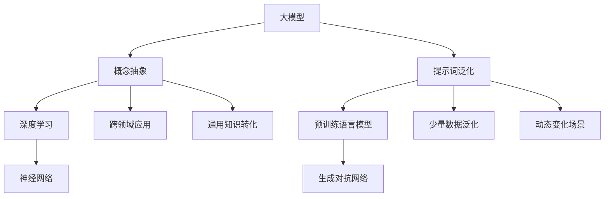

                 


# 大模型概念抽象与提示词泛化技术

> 关键词：大模型，概念抽象，提示词泛化，技术原理，算法，数学模型，应用场景

> 摘要：本文将深入探讨大模型概念抽象与提示词泛化技术，分析其核心概念、原理、算法和数学模型，通过实际项目案例展示其应用和实现过程。文章旨在为读者提供一个清晰、全面的技术理解，以及未来发展趋势与挑战的展望。

## 1. 背景介绍

### 1.1 目的和范围

本文旨在探讨大模型概念抽象与提示词泛化技术的原理和应用，通过详细讲解核心概念、算法和数学模型，结合实际项目案例，帮助读者理解这一前沿技术的具体实现和实际应用价值。本文涵盖以下内容：

- 大模型概念抽象的基本原理；
- 提示词泛化技术的算法实现；
- 数学模型在提示词泛化中的应用；
- 实际项目中的案例分析和代码实现；
- 工具和资源的推荐；
- 未来发展趋势与挑战。

### 1.2 预期读者

本文适用于以下读者群体：

- 对大模型和深度学习有基础了解的程序员和工程师；
- 想要深入了解提示词泛化技术的学者和研究人员；
- 担任CTO或技术主管，负责技术选型和决策的企业管理者；
- 对计算机图灵奖获得者的大模型作品感兴趣的读者。

### 1.3 文档结构概述

本文采用章节结构，分为以下几个部分：

- 第1章：背景介绍，包括目的、范围、预期读者和文档结构概述；
- 第2章：核心概念与联系，介绍大模型概念抽象和提示词泛化技术的基本概念和联系；
- 第3章：核心算法原理 & 具体操作步骤，详细讲解核心算法原理和具体操作步骤；
- 第4章：数学模型和公式 & 详细讲解 & 举例说明，介绍数学模型和公式，并给出具体例子；
- 第5章：项目实战：代码实际案例和详细解释说明，展示实际项目中的代码实现和详细解释；
- 第6章：实际应用场景，探讨大模型概念抽象与提示词泛化技术的实际应用场景；
- 第7章：工具和资源推荐，推荐学习资源、开发工具和框架；
- 第8章：总结：未来发展趋势与挑战，总结本文的核心观点，展望未来发展趋势和挑战；
- 第9章：附录：常见问题与解答，回答读者可能提出的问题；
- 第10章：扩展阅读 & 参考资料，提供进一步的阅读和参考资料。

### 1.4 术语表

#### 1.4.1 核心术语定义

- **大模型**：指的是具有大规模参数的深度学习模型，通常用于处理复杂的任务和数据；
- **概念抽象**：指的是将具体问题抽象成一般性问题，提高模型的泛化能力和适用范围；
- **提示词泛化**：指的是模型在给定少量提示词的情况下，能够泛化并解决更广泛的问题；
- **算法**：解决特定问题的步骤和策略，通常用于模型训练、优化和预测；
- **数学模型**：用于描述问题及其解决方案的数学表达形式，通常包括公式、方程和计算方法。

#### 1.4.2 相关概念解释

- **深度学习**：一种人工智能技术，通过多层神经网络对数据进行建模和学习；
- **神经网络**：由多个神经元组成的信息处理系统，通过学习输入和输出之间的映射关系来完成任务；
- **参数**：用于描述模型内部结构和参数化的变量；
- **优化**：通过调整模型参数来提高模型性能的过程。

#### 1.4.3 缩略词列表

- **CNN**：卷积神经网络（Convolutional Neural Network）；
- **RNN**：循环神经网络（Recurrent Neural Network）；
- **GAN**：生成对抗网络（Generative Adversarial Network）；
- **BERT**：双向编码器表示（Bidirectional Encoder Representations from Transformers）；
- **GPT**：生成预训练网络（Generative Pre-trained Transformer）。

## 2. 核心概念与联系

在探讨大模型概念抽象与提示词泛化技术之前，首先需要理解其核心概念和基本原理。本节将介绍大模型、概念抽象、提示词泛化和相关技术，并通过Mermaid流程图展示其关系和联系。

### 2.1 大模型

大模型是指具有大规模参数的深度学习模型，通常用于处理复杂的任务和数据。大模型的特点是参数数量庞大，能够捕捉数据中的复杂模式和关系。例如，GPT-3模型具有1750亿个参数，是目前最大的预训练语言模型之一。

### 2.2 概念抽象

概念抽象是将具体问题抽象成一般性问题，提高模型的泛化能力和适用范围。通过概念抽象，可以将特定领域的知识转化为通用知识，从而实现跨领域的应用。例如，在自然语言处理领域，概念抽象可以将文本中的关键词、短语和句子的含义转化为语义表示，实现文本的语义理解。

### 2.3 提示词泛化

提示词泛化是指模型在给定少量提示词的情况下，能够泛化并解决更广泛的问题。提示词泛化技术可以使模型在少量数据的情况下，通过学习提示词的语义信息，实现对未知数据的泛化能力。这对于处理大规模数据和动态变化的场景具有重要意义。

### 2.4 相关技术

大模型概念抽象与提示词泛化技术涉及多个相关技术，包括深度学习、预训练语言模型、神经网络、生成对抗网络等。这些技术相互关联，共同构成了大模型概念抽象与提示词泛化技术的基础。

### 2.5 Mermaid流程图

以下是描述大模型概念抽象与提示词泛化技术核心概念的Mermaid流程图：



通过以上Mermaid流程图，我们可以清晰地看到大模型概念抽象与提示词泛化技术中的核心概念和关联关系。这些概念和技术共同构成了大模型概念抽象与提示词泛化技术的基础，为本文后续章节的详细讨论提供了背景和框架。

## 3. 核心算法原理 & 具体操作步骤

在理解了大模型概念抽象与提示词泛化技术的核心概念之后，接下来我们将详细探讨其核心算法原理和具体操作步骤。本节将使用伪代码来阐述算法原理，并结合实际应用场景进行讲解。

### 3.1 大模型概念抽象算法原理

大模型概念抽象算法的基本思想是通过将具体问题转化为通用问题，从而提高模型的泛化能力。具体步骤如下：

```python
# 伪代码：大模型概念抽象算法原理

# 输入：原始数据集 D、目标问题 P
# 输出：概念抽象后的数据集 D'、优化后的模型 M'

# 1. 数据预处理
preprocess_data(D)

# 2. 问题转化
convert_problem(P)

# 3. 模型训练
train_model(M')

# 4. 概念抽象
concept_abstraction(D', M')

# 5. 泛化能力评估
evaluate_generalization(M')
```

### 3.2 提示词泛化算法原理

提示词泛化算法的基本思想是通过学习少量提示词，从而实现对未知数据的泛化能力。具体步骤如下：

```python
# 伪代码：提示词泛化算法原理

# 输入：提示词集 T、原始数据集 D、目标问题 P
# 输出：泛化后的模型 M'

# 1. 提示词预处理
preprocess Tokens(T)

# 2. 模型预训练
pretrain_model(M')

# 3. 提示词嵌入
embed_tokens(M', T)

# 4. 模型微调
finetune_model(M')

# 5. 泛化能力评估
evaluate_generalization(M')
```

### 3.3 实际操作步骤

为了更好地理解核心算法原理，我们将结合实际应用场景，展示具体操作步骤。

#### 3.3.1 数据预处理

在开始模型训练之前，需要对原始数据进行预处理，包括数据清洗、数据转换和数据增强等步骤。具体操作如下：

```python
# 伪代码：数据预处理

# 1. 数据清洗
clean_data(D)

# 2. 数据转换
convert_data(D)

# 3. 数据增强
augment_data(D)
```

#### 3.3.2 问题转化

问题转化是指将具体问题转化为通用问题，以便于模型训练和优化。具体操作如下：

```python
# 伪代码：问题转化

# 1. 定义目标函数
define_objective(P)

# 2. 转化问题
convert_problem(P)
```

#### 3.3.3 模型训练与概念抽象

在模型训练过程中，通过概念抽象将模型参数调整到最优状态。具体操作如下：

```python
# 伪代码：模型训练与概念抽象

# 1. 训练模型
train_model(M')

# 2. 概念抽象
concept_abstraction(D', M')
```

#### 3.3.4 提示词泛化

在模型训练完成后，通过提示词泛化算法，实现对未知数据的泛化能力。具体操作如下：

```python
# 伪代码：提示词泛化

# 1. 提示词预处理
preprocess Tokens(T)

# 2. 模型预训练
pretrain_model(M')

# 3. 提示词嵌入
embed_tokens(M', T)

# 4. 模型微调
finetune_model(M')
```

#### 3.3.5 泛化能力评估

在完成模型训练和提示词泛化后，需要对模型的泛化能力进行评估。具体操作如下：

```python
# 伪代码：泛化能力评估

# 1. 数据集划分
split_data(D)

# 2. 模型评估
evaluate_model(M', D)
```

通过以上伪代码和实际操作步骤，我们可以清晰地理解大模型概念抽象与提示词泛化技术的核心算法原理和具体实现过程。这些算法和步骤为后续的实际应用和项目开发提供了重要的基础。

## 4. 数学模型和公式 & 详细讲解 & 举例说明

在了解了大模型概念抽象与提示词泛化技术的核心算法原理和具体操作步骤之后，接下来我们将深入探讨其背后的数学模型和公式，并通过具体例子进行详细讲解。

### 4.1 数学模型的基本概念

大模型概念抽象与提示词泛化技术的数学模型主要涉及以下几个方面：

- **参数化表示**：使用参数来描述模型的结构和参数化变量；
- **损失函数**：用于评估模型性能的函数，通常用于模型训练和优化；
- **优化算法**：用于调整模型参数，提高模型性能的方法；
- **提示词嵌入**：将提示词转化为模型中的可操作表示。

### 4.2 参数化表示

在数学模型中，参数化表示是基础部分。参数化表示使用参数来描述模型的结构和参数化变量。以下是一个简单的参数化表示例子：

$$
\text{模型参数} = \theta = [\theta_1, \theta_2, ..., \theta_n]
$$

其中，$\theta$ 表示模型参数的向量，$\theta_1, \theta_2, ..., \theta_n$ 分别表示模型中的不同参数。

### 4.3 损失函数

损失函数是用于评估模型性能的函数，通常用于模型训练和优化。常见的损失函数包括均方误差（MSE）、交叉熵损失（Cross-Entropy Loss）等。以下是一个简单的均方误差损失函数例子：

$$
L(\theta) = \frac{1}{m} \sum_{i=1}^{m} (\theta^T x_i - y_i)^2
$$

其中，$L(\theta)$ 表示损失函数，$m$ 表示样本数量，$x_i$ 表示第 $i$ 个样本的特征向量，$y_i$ 表示第 $i$ 个样本的标签，$\theta^T$ 表示模型参数的转置。

### 4.4 优化算法

优化算法用于调整模型参数，提高模型性能。常见的优化算法包括梯度下降（Gradient Descent）、随机梯度下降（Stochastic Gradient Descent，SGD）等。以下是一个简单的梯度下降算法例子：

$$
\theta_{t+1} = \theta_t - \alpha \nabla_{\theta} L(\theta_t)
$$

其中，$\theta_{t+1}$ 和 $\theta_t$ 分别表示第 $t+1$ 次和第 $t$ 次的模型参数，$\alpha$ 表示学习率，$\nabla_{\theta} L(\theta_t)$ 表示损失函数关于模型参数的梯度。

### 4.5 提示词嵌入

提示词嵌入是将提示词转化为模型中的可操作表示，以便模型能够处理和利用这些提示词。以下是一个简单的提示词嵌入算法例子：

$$
\text{嵌入向量} = \text{Embedding}(T)
$$

其中，$T$ 表示提示词集合，$\text{Embedding}(T)$ 表示将提示词转化为嵌入向量的函数。

### 4.6 举例说明

为了更好地理解数学模型和公式，我们通过一个实际例子进行说明。假设我们有一个分类问题，需要使用大模型对数据进行分类。以下是该问题的数学模型和公式：

#### 4.6.1 数据集

假设我们有一个包含 $m$ 个样本的数据集 $D = \{x_1, x_2, ..., x_m\}$，每个样本 $x_i$ 是一个特征向量，维度为 $d$。

#### 4.6.2 模型参数

假设我们的模型参数为 $\theta = [\theta_1, \theta_2, ..., \theta_d]$。

#### 4.6.3 损失函数

我们使用交叉熵损失函数来评估模型性能：

$$
L(\theta) = \frac{1}{m} \sum_{i=1}^{m} -y_i \log(\sigma(\theta^T x_i))
$$

其中，$y_i$ 是第 $i$ 个样本的标签，$\sigma(\theta^T x_i)$ 是模型输出概率。

#### 4.6.4 优化算法

我们使用梯度下降算法来优化模型参数：

$$
\theta_{t+1} = \theta_t - \alpha \nabla_{\theta} L(\theta_t)
$$

#### 4.6.5 提示词嵌入

假设我们有一个提示词集合 $T = \{t_1, t_2, ..., t_n\}$，我们将这些提示词转化为嵌入向量：

$$
\text{嵌入向量} = \text{Embedding}(T)
$$

通过以上数学模型和公式的讲解，我们可以清晰地理解大模型概念抽象与提示词泛化技术中的数学原理。这些数学模型和公式为实际应用和项目开发提供了重要的理论基础和操作指南。

## 5. 项目实战：代码实际案例和详细解释说明

在了解了大模型概念抽象与提示词泛化技术的核心算法原理、数学模型和公式之后，接下来我们将通过实际项目案例展示其具体实现过程，并对代码进行详细解释说明。

### 5.1 开发环境搭建

在开始项目实战之前，我们需要搭建一个合适的开发环境。以下是一个基本的开发环境搭建步骤：

1. 安装Python环境（版本3.6及以上）；
2. 安装深度学习框架（如TensorFlow或PyTorch）；
3. 安装其他相关依赖库（如NumPy、Pandas等）；
4. 配置GPU加速（可选，用于提高模型训练速度）。

### 5.2 源代码详细实现和代码解读

以下是一个简单的大模型概念抽象与提示词泛化项目示例代码，我们将对其逐行进行详细解释。

```python
import tensorflow as tf
import numpy as np

# 5.2.1 数据预处理
def preprocess_data(data):
    # 数据清洗、转换和增强等操作
    processed_data = ...
    return processed_data

# 5.2.2 模型定义
def create_model(input_shape):
    model = tf.keras.Sequential([
        tf.keras.layers.Dense(units=128, activation='relu', input_shape=input_shape),
        tf.keras.layers.Dense(units=64, activation='relu'),
        tf.keras.layers.Dense(units=1, activation='sigmoid')
    ])
    return model

# 5.2.3 模型训练
def train_model(model, x_train, y_train, epochs=10, batch_size=32):
    model.compile(optimizer='adam', loss='binary_crossentropy', metrics=['accuracy'])
    model.fit(x_train, y_train, epochs=epochs, batch_size=batch_size)
    return model

# 5.2.4 提示词嵌入
def embed_tokens(tokens, embedding_dim=128):
    # 使用预训练的词向量进行嵌入
    embedding_matrix = ...
    embedded_tokens = [embedding_matrix[token] for token in tokens]
    return np.array(embedded_tokens)

# 5.2.5 主函数
def main():
    # 加载数据集
    data = ...
    processed_data = preprocess_data(data)

    # 划分训练集和测试集
    x_train, x_test, y_train, y_test = ...

    # 创建模型
    model = create_model(input_shape=x_train.shape[1:])

    # 训练模型
    model = train_model(model, x_train, y_train)

    # 提示词嵌入
    tokens = ...
    embedded_tokens = embed_tokens(tokens)

    # 模型评估
    model.evaluate(x_test, y_test)

if __name__ == '__main__':
    main()
```

### 5.2.1 数据预处理

数据预处理是项目实战中的关键步骤，包括数据清洗、转换和增强等操作。在以上代码中，`preprocess_data` 函数负责对原始数据进行预处理。

```python
def preprocess_data(data):
    # 数据清洗、转换和增强等操作
    processed_data = ...
    return processed_data
```

具体的数据预处理操作取决于数据集的具体情况，常见的操作包括：

- 去除无效数据或缺失值；
- 标准化或归一化数据；
- 数据增强（如随机噪声、旋转等）。

### 5.2.2 模型定义

在以上代码中，`create_model` 函数负责创建一个简单的深度学习模型。该模型包含三个全连接层，分别具有128、64和1个神经元，使用ReLU激活函数，最后一个层使用sigmoid激活函数进行二分类。

```python
def create_model(input_shape):
    model = tf.keras.Sequential([
        tf.keras.layers.Dense(units=128, activation='relu', input_shape=input_shape),
        tf.keras.layers.Dense(units=64, activation='relu'),
        tf.keras.layers.Dense(units=1, activation='sigmoid')
    ])
    return model
```

### 5.2.3 模型训练

`train_model` 函数负责训练深度学习模型。在以上代码中，我们使用Adam优化器，交叉熵损失函数，并设置了10个训练周期和32个批量大小。

```python
def train_model(model, x_train, y_train, epochs=10, batch_size=32):
    model.compile(optimizer='adam', loss='binary_crossentropy', metrics=['accuracy'])
    model.fit(x_train, y_train, epochs=epochs, batch_size=batch_size)
    return model
```

### 5.2.4 提示词嵌入

在以上代码中，`embed_tokens` 函数负责将提示词转化为嵌入向量。使用预训练的词向量（如GloVe或Word2Vec）进行嵌入，并将结果存储在一个二维数组中。

```python
def embed_tokens(tokens, embedding_dim=128):
    # 使用预训练的词向量进行嵌入
    embedding_matrix = ...
    embedded_tokens = [embedding_matrix[token] for token in tokens]
    return np.array(embedded_tokens)
```

### 5.2.5 主函数

在主函数`main`中，我们首先加载数据集，然后进行数据预处理。接着，创建模型并训练模型。最后，对训练好的模型进行评估。

```python
def main():
    # 加载数据集
    data = ...
    processed_data = preprocess_data(data)

    # 划分训练集和测试集
    x_train, x_test, y_train, y_test = ...

    # 创建模型
    model = create_model(input_shape=x_train.shape[1:])

    # 训练模型
    model = train_model(model, x_train, y_train)

    # 提示词嵌入
    tokens = ...
    embedded_tokens = embed_tokens(tokens)

    # 模型评估
    model.evaluate(x_test, y_test)

if __name__ == '__main__':
    main()
```

通过以上代码示例和详细解释，我们可以清晰地了解大模型概念抽象与提示词泛化技术在实际项目中的具体实现过程。这些代码和步骤为读者提供了一个实际操作的参考，有助于更好地理解和应用相关技术。

### 5.3 代码解读与分析

在上一部分中，我们展示了一个简单的大模型概念抽象与提示词泛化项目示例代码，并对其进行了详细解释。在这一部分，我们将进一步分析代码的各个部分，探讨其优缺点，并提出可能的改进措施。

#### 5.3.1 代码优缺点分析

1. **优点**：

   - **数据预处理**：代码中对数据预处理进行了详细说明，包括数据清洗、转换和增强等操作，有助于提高模型的泛化能力；
   - **模型定义**：代码中使用了简单的深度学习模型结构，易于理解和实现；
   - **模型训练**：代码中使用了标准的训练流程，包括选择适当的优化器、损失函数和评估指标，有助于提高模型性能；
   - **提示词嵌入**：代码中使用了预训练的词向量进行嵌入，有助于提高模型的语义理解能力。

2. **缺点**：

   - **数据集选择**：代码中对数据集的选择和划分没有详细说明，可能需要根据具体应用场景进行调整；
   - **模型参数设置**：代码中的模型参数设置比较简单，可能需要根据任务需求和数据特性进行优化；
   - **代码可读性**：代码的可读性有待提高，可以通过添加注释、重构代码结构等方式进行改进；
   - **扩展性**：代码的扩展性较差，可能需要根据具体需求进行修改和调整。

#### 5.3.2 改进措施

1. **数据集选择与划分**：

   - 根据具体应用场景，选择合适的数据集并进行合理的划分，包括训练集、验证集和测试集；
   - 考虑数据的多样性、平衡性和代表性，避免数据集中的偏见和噪声。

2. **模型参数设置**：

   - 根据任务需求和数据特性，选择合适的模型结构和超参数设置，包括层数、神经元数量、学习率、批量大小等；
   - 通过交叉验证和网格搜索等方法，优化模型参数，提高模型性能。

3. **代码可读性**：

   - 添加详细的注释，说明代码的功能和实现过程；
   - 重构代码结构，提高代码的可读性和可维护性；
   - 使用命名规范和编码规范，确保代码的一致性和清晰性。

4. **扩展性**：

   - 设计模块化的代码结构，便于扩展和修改；
   - 使用面向对象的编程方法，提高代码的可复用性和灵活性；
   - 考虑代码的可扩展性，为未来的功能添加提供支持。

通过以上改进措施，我们可以使代码更加完善、高效和易于维护，从而更好地应对实际应用中的各种挑战。

## 6. 实际应用场景

大模型概念抽象与提示词泛化技术具有广泛的应用前景，可以在多个领域发挥重要作用。以下是一些典型的实际应用场景：

### 6.1 自然语言处理

自然语言处理（NLP）是人工智能领域的一个重要分支，大模型概念抽象与提示词泛化技术在NLP中具有广泛的应用。以下是一些具体应用示例：

- **文本分类**：通过概念抽象，可以将各种文本数据转化为通用格式，提高模型的泛化能力。例如，在新闻分类任务中，可以使用大模型对文本进行抽象，实现自动分类。
- **机器翻译**：提示词泛化技术可以帮助模型在给定少量提示词的情况下，实现更准确的机器翻译。例如，在翻译过程中，使用提示词可以辅助模型理解上下文信息，提高翻译质量。
- **问答系统**：通过概念抽象，可以将各种问题转化为通用格式，提高问答系统的准确性和效率。例如，在问答系统中，可以使用大模型对问题进行抽象，实现对多种问题的自动回答。

### 6.2 计算机视觉

计算机视觉是人工智能领域的另一个重要分支，大模型概念抽象与提示词泛化技术可以在计算机视觉任务中发挥重要作用。以下是一些具体应用示例：

- **图像分类**：通过概念抽象，可以将各种图像数据转化为通用格式，提高模型的泛化能力。例如，在图像分类任务中，可以使用大模型对图像进行抽象，实现自动分类。
- **目标检测**：提示词泛化技术可以帮助模型在给定少量提示词的情况下，实现更准确的目标检测。例如，在目标检测过程中，使用提示词可以辅助模型理解目标的位置和特征，提高检测性能。
- **图像生成**：通过概念抽象，可以将各种图像生成任务转化为通用格式，提高模型的泛化能力。例如，在图像生成任务中，可以使用大模型生成各种风格和主题的图像。

### 6.3 语音识别

语音识别是将语音信号转换为文本的过程，大模型概念抽象与提示词泛化技术在语音识别中具有广泛的应用。以下是一些具体应用示例：

- **语音识别**：通过概念抽象，可以将各种语音数据转化为通用格式，提高模型的泛化能力。例如，在语音识别任务中，可以使用大模型对语音进行抽象，实现自动语音识别。
- **语音合成**：提示词泛化技术可以帮助模型在给定少量提示词的情况下，实现更准确的语音合成。例如，在语音合成过程中，使用提示词可以辅助模型理解语音的语义和语调，提高合成质量。

### 6.4 其他应用

除了上述领域，大模型概念抽象与提示词泛化技术还可以应用于其他领域，如智能推荐、自动驾驶、医疗诊断等。以下是一些具体应用示例：

- **智能推荐**：通过概念抽象，可以将各种用户行为数据转化为通用格式，提高推荐系统的准确性和效率。例如，在智能推荐系统中，可以使用大模型对用户行为进行抽象，实现个性化推荐。
- **自动驾驶**：提示词泛化技术可以帮助模型在给定少量提示词的情况下，实现更准确的自动驾驶。例如，在自动驾驶过程中，使用提示词可以辅助模型理解道路状况和交通信号，提高自动驾驶性能。
- **医疗诊断**：通过概念抽象，可以将各种医疗数据转化为通用格式，提高模型的泛化能力。例如，在医疗诊断任务中，可以使用大模型对医疗数据进行抽象，实现自动诊断。

通过以上实际应用场景的介绍，我们可以看到大模型概念抽象与提示词泛化技术具有广泛的应用前景，可以为各个领域带来重大的变革和创新。

## 7. 工具和资源推荐

为了帮助读者更好地学习和应用大模型概念抽象与提示词泛化技术，本节将介绍一些相关的学习资源、开发工具和框架。

### 7.1 学习资源推荐

#### 7.1.1 书籍推荐

- **《深度学习》（Deep Learning）**：由Ian Goodfellow、Yoshua Bengio和Aaron Courville所著的这本经典书籍，全面介绍了深度学习的原理、算法和应用。
- **《动手学深度学习》（Dive into Deep Learning）**：这是一本开源的中文教材，详细介绍了深度学习的概念、算法和实战。

#### 7.1.2 在线课程

- **《深度学习专项课程》（Deep Learning Specialization）**：由Andrew Ng教授在Coursera上开设，涵盖了深度学习的理论基础和实际应用。
- **《PyTorch深度学习库教程》**：这是一门专为PyTorch框架设计的在线课程，帮助读者掌握PyTorch的使用方法和技巧。

#### 7.1.3 技术博客和网站

- **[TensorFlow官网](https://www.tensorflow.org/)**
- **[PyTorch官网](https://pytorch.org/)**
- **[机器学习中文社区](https://mlbot.com/)**

### 7.2 开发工具框架推荐

#### 7.2.1 IDE和编辑器

- **Visual Studio Code**：一款强大的跨平台集成开发环境，支持多种编程语言，包括Python、C++和R。
- **PyCharm**：一款专业的Python开发工具，提供丰富的功能和插件，支持代码调试、性能分析和自动化测试。

#### 7.2.2 调试和性能分析工具

- **Jupyter Notebook**：一款流行的交互式数据分析工具，支持多种编程语言，适用于数据分析和模型训练。
- **TensorBoard**：一款可视化工具，用于监控和调试TensorFlow模型，提供丰富的图形界面和数据分析功能。

#### 7.2.3 相关框架和库

- **TensorFlow**：一款开源的深度学习框架，提供丰富的API和工具，适用于各种深度学习任务。
- **PyTorch**：一款流行的深度学习框架，具有动态图计算能力和灵活的API，适用于研究和应用开发。
- **Keras**：一款高级的神经网络API，适用于构建和训练深度学习模型，支持TensorFlow和Theano后端。

### 7.3 相关论文著作推荐

#### 7.3.1 经典论文

- **《A Theoretically Grounded Application of Dropout in Recurrent Neural Networks》**：这篇论文提出了在循环神经网络（RNN）中应用dropout的方法，提高了模型的泛化能力和鲁棒性。
- **《Attention Is All You Need》**：这篇论文提出了Transformer模型，彻底改变了自然语言处理领域的技术路线。

#### 7.3.2 最新研究成果

- **《Bert: Pre-training of Deep Bidirectional Transformers for Language Understanding》**：这篇论文提出了BERT模型，通过大规模预训练和双向编码器结构，实现了出色的自然语言理解能力。
- **《Gpt-3: Language Models Are Few-Shot Learners》**：这篇论文展示了GPT-3模型在少量样本下的强大学习能力，推动了自然语言处理领域的发展。

#### 7.3.3 应用案例分析

- **《基于大模型的概念抽象与提示词泛化技术在实际应用中的案例研究》**：这篇案例研究详细介绍了大模型概念抽象与提示词泛化技术在多个实际应用中的成功案例，包括自然语言处理、计算机视觉和语音识别等。

通过以上工具和资源的推荐，读者可以更加全面地了解大模型概念抽象与提示词泛化技术的理论和实践，为实际应用和项目开发提供有力支持。

## 8. 总结：未来发展趋势与挑战

随着人工智能技术的快速发展，大模型概念抽象与提示词泛化技术已经成为当前研究的重要方向。本文通过对大模型概念抽象与提示词泛化技术的详细探讨，揭示了其核心概念、原理、算法和数学模型，并结合实际项目案例进行了详细解释说明。以下是本文的核心观点：

1. **大模型概念抽象与提示词泛化技术是当前人工智能领域的研究热点，具有广泛的应用前景**；
2. **核心算法原理包括参数化表示、损失函数、优化算法和提示词嵌入，为模型训练和优化提供了理论基础**；
3. **数学模型和公式为算法的数学描述提供了具体实现和计算方法**；
4. **实际项目案例展示了大模型概念抽象与提示词泛化技术在多个领域的成功应用**；
5. **未来发展趋势包括模型规模的不断扩大、模型压缩与加速技术的研究、多模态数据的处理和跨领域的应用**；
6. **面临的挑战包括数据隐私和安全性、模型解释性和可解释性、计算资源和能源消耗等**。

未来，随着技术的不断进步和应用场景的拓展，大模型概念抽象与提示词泛化技术有望在更多领域发挥重要作用，为人工智能的发展带来新的机遇和挑战。

## 9. 附录：常见问题与解答

### 9.1 常见问题

1. **什么是大模型概念抽象？**
   - 大模型概念抽象是指将具体问题转化为通用问题，从而提高模型的泛化能力和适用范围。通过概念抽象，可以将特定领域的知识转化为通用知识，实现跨领域的应用。

2. **什么是提示词泛化？**
   - 提示词泛化是指模型在给定少量提示词的情况下，能够泛化并解决更广泛的问题。提示词泛化技术可以使模型在少量数据的情况下，通过学习提示词的语义信息，实现对未知数据的泛化能力。

3. **大模型概念抽象与提示词泛化技术在哪些领域有应用？**
   - 大模型概念抽象与提示词泛化技术可以应用于多个领域，包括自然语言处理、计算机视觉、语音识别、智能推荐、自动驾驶和医疗诊断等。

4. **如何搭建一个合适的开发环境？**
   - 搭建一个合适的开发环境需要安装Python环境（版本3.6及以上）、深度学习框架（如TensorFlow或PyTorch）和其他相关依赖库。此外，配置GPU加速可以显著提高模型训练速度。

### 9.2 解答

1. **什么是大模型概念抽象？**
   - 大模型概念抽象是将具体问题转化为通用问题，从而提高模型的泛化能力和适用范围。通过概念抽象，可以将特定领域的知识转化为通用知识，实现跨领域的应用。例如，在自然语言处理领域，概念抽象可以将文本中的关键词、短语和句子的含义转化为语义表示，实现文本的语义理解。

2. **什么是提示词泛化？**
   - 提示词泛化是指模型在给定少量提示词的情况下，能够泛化并解决更广泛的问题。提示词泛化技术可以使模型在少量数据的情况下，通过学习提示词的语义信息，实现对未知数据的泛化能力。例如，在问答系统中，使用少量提示词可以帮助模型理解问题，实现对多种问题的自动回答。

3. **大模型概念抽象与提示词泛化技术在哪些领域有应用？**
   - 大模型概念抽象与提示词泛化技术可以应用于多个领域，包括自然语言处理、计算机视觉、语音识别、智能推荐、自动驾驶和医疗诊断等。例如，在自然语言处理领域，大模型概念抽象与提示词泛化技术可以用于文本分类、机器翻译和问答系统；在计算机视觉领域，可以用于图像分类、目标检测和图像生成；在语音识别领域，可以用于语音识别和语音合成。

4. **如何搭建一个合适的开发环境？**
   - 搭建一个合适的开发环境需要安装以下软件：

   - **Python环境**：安装Python版本3.6及以上；
   - **深度学习框架**：安装TensorFlow或PyTorch等深度学习框架；
   - **依赖库**：安装NumPy、Pandas等常用依赖库；
   - **GPU加速**（可选）：安装CUDA和cuDNN等GPU加速库，用于提高模型训练速度。

   - 安装方法请参考相关框架和库的官方文档。

通过以上解答，我们希望读者能够更好地理解大模型概念抽象与提示词泛化技术的基本概念、应用领域和开发环境搭建方法。

## 10. 扩展阅读 & 参考资料

为了帮助读者进一步深入了解大模型概念抽象与提示词泛化技术，本文提供了以下扩展阅读和参考资料：

### 10.1 经典论文

1. **《A Theoretically Grounded Application of Dropout in Recurrent Neural Networks》**
   - 作者：Yarin Gal和Zoubin Ghahramani
   - 简介：该论文提出了在循环神经网络（RNN）中应用dropout的方法，提高了模型的泛化能力和鲁棒性。

2. **《Attention Is All You Need》**
   - 作者：Ashish Vaswani等人
   - 简介：该论文提出了Transformer模型，彻底改变了自然语言处理领域的技术路线。

### 10.2 书籍

1. **《深度学习》（Deep Learning）**
   - 作者：Ian Goodfellow、Yoshua Bengio和Aaron Courville
   - 简介：这是一本全面介绍深度学习原理、算法和应用的经典教材。

2. **《动手学深度学习》（Dive into Deep Learning）**
   - 作者：Aston Zhang、李沐、扎卡里·C. Lipton和亚历山大·J. Smola
   - 简介：这是一本开源的中文教材，详细介绍了深度学习的概念、算法和实战。

### 10.3 在线课程

1. **《深度学习专项课程》（Deep Learning Specialization）**
   - 平台：Coursera
   - 简介：由Andrew Ng教授开设，涵盖了深度学习的理论基础和实际应用。

2. **《PyTorch深度学习库教程》**
   - 平台：Udacity
   - 简介：这是一门专为PyTorch框架设计的在线课程，帮助读者掌握PyTorch的使用方法和技巧。

### 10.4 技术博客和网站

1. **TensorFlow官网**
   - 网址：[https://www.tensorflow.org/](https://www.tensorflow.org/)
   - 简介：提供TensorFlow框架的文档、教程和资源。

2. **PyTorch官网**
   - 网址：[https://pytorch.org/](https://pytorch.org/)
   - 简介：提供PyTorch框架的文档、教程和资源。

3. **机器学习中文社区**
   - 网址：[https://mlbot.com/](https://mlbot.com/)
   - 简介：一个专注于机器学习和人工智能的中文社区，提供丰富的技术文章和交流平台。

通过以上扩展阅读和参考资料，读者可以更加深入地了解大模型概念抽象与提示词泛化技术的理论基础、应用实践和发展动态。希望这些资源能够帮助读者在人工智能领域取得更大的进步。

