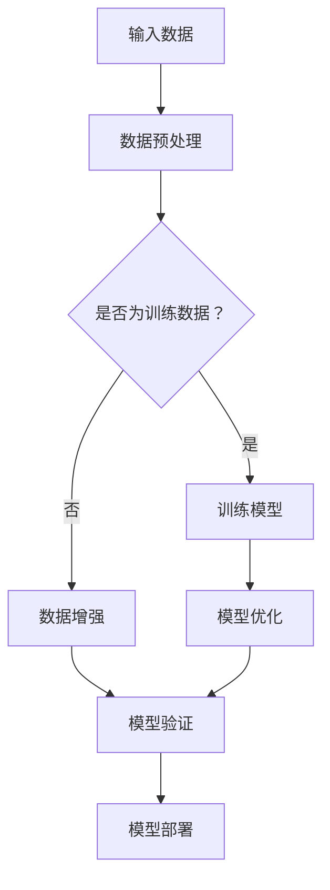

                 

# 大模型的开源运动：推动技术进步和创新

> **关键词：** 大模型，开源运动，技术进步，创新，机器学习，人工智能，开源社区，合作，共享，算法优化，硬件加速，分布式计算，跨学科研究，数据隐私。

> **摘要：** 本文旨在探讨大模型领域中的开源运动，分析其背后的动力、核心概念、关键算法，并展示其在技术进步和创新中的重要作用。文章还探讨了开源运动带来的实际应用场景、工具和资源，以及未来可能面临的挑战和趋势。

## 1. 背景介绍

### 1.1 目的和范围

本文旨在探讨大模型领域中的开源运动，分析其背后的动力、核心概念、关键算法，并展示其在技术进步和创新中的重要作用。文章还将探讨开源运动带来的实际应用场景、工具和资源，以及未来可能面临的挑战和趋势。

### 1.2 预期读者

本文适合对大模型和开源运动有一定了解的读者，包括人工智能领域的研究人员、开发者、工程师以及对技术进步和创新有兴趣的读者。

### 1.3 文档结构概述

本文分为以下几个部分：

1. **背景介绍**：介绍大模型开源运动的背景和目的。
2. **核心概念与联系**：阐述大模型的核心概念，并使用Mermaid流程图展示其架构。
3. **核心算法原理 & 具体操作步骤**：详细介绍大模型的关键算法原理和操作步骤。
4. **数学模型和公式 & 详细讲解 & 举例说明**：讲解大模型的数学模型和公式，并通过实际例子进行说明。
5. **项目实战：代码实际案例和详细解释说明**：展示大模型的实际应用案例，并提供详细代码解读。
6. **实际应用场景**：分析大模型在不同领域的应用场景。
7. **工具和资源推荐**：推荐学习资源和开发工具。
8. **总结：未来发展趋势与挑战**：总结大模型开源运动的发展趋势和挑战。

### 1.4 术语表

#### 1.4.1 核心术语定义

- 大模型：具有巨大参数量的神经网络模型，如Transformer模型。
- 开源运动：一种倡导共享知识和资源，鼓励合作和创新的运动。
- 技术进步：在技术领域取得的新的知识、方法和工具。
- 创新：创造新的产品、服务或过程，满足市场需求或解决现有问题。

#### 1.4.2 相关概念解释

- **机器学习**：一种使计算机通过数据学习、自动改进性能的技术。
- **人工智能**：模拟人类智能行为的技术和系统。
- **算法**：解决特定问题的步骤或规则。
- **硬件加速**：使用专用硬件（如GPU）来提高计算速度。

#### 1.4.3 缩略词列表

- **GPU**：图形处理器。
- **Transformer**：一种流行的神经网络架构。
- **ML**：机器学习。
- **AI**：人工智能。
- **DL**：深度学习。

## 2. 核心概念与联系

大模型是机器学习和人工智能领域的一个重要概念，其核心在于使用神经网络模型处理大规模数据。为了更好地理解大模型的架构，我们可以使用Mermaid流程图来展示其核心概念和联系。

下面是一个简单的Mermaid流程图示例：



在这个流程图中：

- **A（输入数据）**：大模型的输入可以是各种类型的数据，如图像、文本、音频等。
- **B（数据预处理）**：对输入数据进行预处理，如归一化、去噪等，以提高模型的训练效果。
- **C（是否为训练数据）**：判断输入数据是否用于模型训练。
- **D（训练模型）**：使用训练数据对模型进行训练。
- **E（数据增强）**：对非训练数据进行增强，以提高模型的泛化能力。
- **F（模型优化）**：通过模型优化算法调整模型参数，以提高模型的性能。
- **G（模型验证）**：使用验证数据对模型进行验证，评估模型性能。
- **H（模型部署）**：将模型部署到实际应用场景中，如自动驾驶、自然语言处理等。

## 3. 核心算法原理 & 具体操作步骤

大模型的核心算法是神经网络，特别是基于深度学习的算法。以下是一个简单的神经网络算法原理和具体操作步骤的伪代码：

```python
# 伪代码：神经网络算法原理和操作步骤

# 初始化模型参数
W, b = initialize_parameters()

# 定义损失函数
loss = compute_loss(y, y_pred)

# 计算梯度
grad = compute_gradient(loss, W, b)

# 更新参数
W, b = update_parameters(W, b, grad)

# 定义训练轮数
epochs = 1000

# 开始训练
for epoch in range(epochs):
    # 前向传播
    y_pred = forward_propagation(x, W, b)
    
    # 计算损失
    loss = compute_loss(y, y_pred)
    
    # 反向传播
    grad = backward_propagation(loss, W, b)
    
    # 更新参数
    W, b = update_parameters(W, b, grad)
    
    # 输出训练进度
    print(f"Epoch {epoch}: Loss = {loss}")
```

在这个伪代码中：

- **initialize_parameters()**：初始化模型参数。
- **compute_loss(y, y_pred)**：计算损失函数，其中`y`是实际标签，`y_pred`是模型预测。
- **compute_gradient(loss, W, b)**：计算梯度，用于更新参数。
- **update_parameters(W, b, grad)**：更新模型参数。
- **forward_propagation(x, W, b)**：前向传播，计算模型预测。
- **backward_propagation(loss, W, b)**：反向传播，计算梯度。

通过这些步骤，我们可以训练一个神经网络模型，并使用它进行预测。在实际应用中，这些步骤会通过优化算法和高效的计算框架来实现。

## 4. 数学模型和公式 & 详细讲解 & 举例说明

大模型的数学模型主要包括损失函数、激活函数、梯度下降算法等。以下是对这些数学模型和公式的详细讲解和举例说明。

### 4.1 损失函数

损失函数用于衡量模型预测与实际标签之间的差距。常见的损失函数包括均方误差（MSE）和交叉熵损失（Cross-Entropy Loss）。

#### 4.1.1 均方误差（MSE）

均方误差是一种常用的损失函数，计算公式如下：

$$
MSE = \frac{1}{m} \sum_{i=1}^{m} (y_i - \hat{y}_i)^2
$$

其中，$m$是样本数量，$y_i$是实际标签，$\hat{y}_i$是模型预测。

#### 4.1.2 交叉熵损失（Cross-Entropy Loss）

交叉熵损失函数在分类问题中常用，计算公式如下：

$$
Cross-Entropy Loss = -\frac{1}{m} \sum_{i=1}^{m} y_i \log(\hat{y}_i)
$$

其中，$m$是样本数量，$y_i$是实际标签，$\hat{y}_i$是模型预测的概率。

### 4.2 激活函数

激活函数是神经网络中的关键部分，用于引入非线性因素。常见的激活函数包括ReLU、Sigmoid和Tanh。

#### 4.2.1 ReLU（Rectified Linear Unit）

ReLU函数是一个简单的线性函数，其计算公式如下：

$$
ReLU(x) = \max(0, x)
$$

#### 4.2.2 Sigmoid

Sigmoid函数将输入映射到$(0, 1)$区间，其计算公式如下：

$$
Sigmoid(x) = \frac{1}{1 + e^{-x}}
$$

#### 4.2.3 Tanh

Tanh函数与Sigmoid函数类似，但其输出范围在$(-1, 1)$之间，其计算公式如下：

$$
Tanh(x) = \frac{e^{2x} - 1}{e^{2x} + 1}
$$

### 4.3 梯度下降算法

梯度下降算法是一种优化算法，用于调整模型参数以最小化损失函数。其基本思想是沿着损失函数的梯度方向更新参数。

#### 4.3.1 基本梯度下降算法

基本梯度下降算法的更新公式如下：

$$
\Delta W = -\alpha \cdot \frac{\partial L}{\partial W}
$$

$$
\Delta b = -\alpha \cdot \frac{\partial L}{\partial b}
$$

其中，$\alpha$是学习率，$L$是损失函数，$W$和$b$是模型参数。

#### 4.3.2 随机梯度下降（SGD）

随机梯度下降是一种改进的梯度下降算法，其每次迭代只使用一个样本的梯度进行参数更新。

$$
\Delta W = -\alpha \cdot \frac{\partial L}{\partial W}_{\text{sample}}
$$

$$
\Delta b = -\alpha \cdot \frac{\partial L}{\partial b}_{\text{sample}}
$$

### 4.4 举例说明

假设我们有一个二分类问题，使用ReLU激活函数和交叉熵损失函数。给定输入数据$x$和实际标签$y$，我们要训练一个神经网络模型。

首先，我们需要定义模型参数$W$和$b$，然后使用前向传播计算模型预测：

$$
\hat{y} = ReLU(W \cdot x + b)
$$

接下来，计算交叉熵损失：

$$
L = -\frac{1}{m} \sum_{i=1}^{m} y_i \log(\hat{y}_i) + (1 - y_i) \log(1 - \hat{y}_i)
$$

然后，使用反向传播计算梯度：

$$
\frac{\partial L}{\partial W} = -\frac{1}{m} \sum_{i=1}^{m} (\hat{y}_i - y_i) \cdot x_i
$$

$$
\frac{\partial L}{\partial b} = -\frac{1}{m} \sum_{i=1}^{m} (\hat{y}_i - y_i)
$$

最后，使用梯度下降算法更新参数：

$$
\Delta W = -\alpha \cdot \frac{\partial L}{\partial W}
$$

$$
\Delta b = -\alpha \cdot \frac{\partial L}{\partial b}
$$

$$
W = W - \Delta W
$$

$$
b = b - \Delta b
$$

通过这些步骤，我们可以训练一个神经网络模型，并使用它进行预测。

## 5. 项目实战：代码实际案例和详细解释说明

在本节中，我们将通过一个实际项目案例来展示大模型的训练和使用过程。这个案例使用Python和TensorFlow框架来实现。

### 5.1 开发环境搭建

首先，我们需要搭建一个适合开发和运行大模型的开发环境。以下是所需的软件和库：

- **操作系统**：Ubuntu 18.04
- **Python**：Python 3.8
- **TensorFlow**：TensorFlow 2.7
- **Numpy**：Numpy 1.19
- **Matplotlib**：Matplotlib 3.4

安装这些软件和库，可以使用以下命令：

```bash
sudo apt-get update
sudo apt-get install python3-pip
pip3 install tensorflow numpy matplotlib
```

### 5.2 源代码详细实现和代码解读

以下是该项目的主要源代码，我们将逐步解释每一部分。

```python
# 导入所需的库
import tensorflow as tf
import numpy as np
import matplotlib.pyplot as plt

# 设置随机种子
tf.random.set_seed(42)

# 加载MNIST数据集
(x_train, y_train), (x_test, y_test) = tf.keras.datasets.mnist.load_data()

# 数据预处理
x_train = x_train / 255.0
x_test = x_test / 255.0

# 添加批量维度
x_train = np.expand_dims(x_train, -1)
x_test = np.expand_dims(x_test, -1)

# 定义模型
model = tf.keras.Sequential([
    tf.keras.layers.Conv2D(32, (3, 3), activation='relu', input_shape=(28, 28, 1)),
    tf.keras.layers.MaxPooling2D((2, 2)),
    tf.keras.layers.Flatten(),
    tf.keras.layers.Dense(64, activation='relu'),
    tf.keras.layers.Dense(10, activation='softmax')
])

# 编译模型
model.compile(optimizer='adam',
              loss='sparse_categorical_crossentropy',
              metrics=['accuracy'])

# 训练模型
model.fit(x_train, y_train, epochs=10, validation_split=0.1)

# 评估模型
test_loss, test_acc = model.evaluate(x_test, y_test)
print(f"Test accuracy: {test_acc}")

# 可视化训练过程
plt.plot(model.history.history['accuracy'], label='accuracy')
plt.plot(model.history.history['val_accuracy'], label='val_accuracy')
plt.xlabel('Epoch')
plt.ylabel('Accuracy')
plt.legend()
plt.show()
```

### 5.3 代码解读与分析

下面是对上述代码的详细解读和分析。

- **导入库**：首先，我们导入所需的库，包括TensorFlow、Numpy和Matplotlib。

- **设置随机种子**：为了确保结果的可重复性，我们设置随机种子。

- **加载数据集**：使用TensorFlow的内置函数加载MNIST数据集，并对其进行预处理。

- **数据预处理**：将图像数据除以255，将数据归一化到$(0, 1)$区间。同时，添加批量维度，以便模型可以处理批量数据。

- **定义模型**：使用TensorFlow的`Sequential`模型定义一个简单的卷积神经网络（CNN）。该模型包括两个卷积层、一个池化层、一个平坦层和两个全连接层。

- **编译模型**：设置模型优化器、损失函数和评价指标。在本例中，我们使用Adam优化器和稀疏分类交叉熵损失函数。

- **训练模型**：使用训练数据训练模型，设置训练轮数为10，并保留10%的数据用于验证。

- **评估模型**：使用测试数据评估模型性能，并打印测试准确率。

- **可视化训练过程**：使用Matplotlib绘制训练过程中的准确率曲线，以便观察模型性能的变化。

通过这个案例，我们展示了如何使用TensorFlow框架实现大模型的训练和评估。这个过程可以应用于更复杂的模型和更大的数据集，以解决各种实际问题。

## 6. 实际应用场景

大模型在各个领域都有广泛的应用，以下是几个典型的实际应用场景：

### 6.1 自然语言处理

大模型在自然语言处理（NLP）领域有着巨大的影响力，例如：

- **文本分类**：使用大模型对新闻文章、社交媒体帖子等进行分类，帮助用户获取感兴趣的内容。
- **机器翻译**：大模型可以用于机器翻译，如Google Translate和DeepL，实现跨语言沟通。
- **对话系统**：大模型可以用于构建智能客服和聊天机器人，提高用户体验。

### 6.2 计算机视觉

大模型在计算机视觉领域也有着广泛的应用，例如：

- **图像识别**：大模型可以用于识别图像中的物体、场景和人脸等。
- **图像生成**：大模型可以生成新的图像，如生成对抗网络（GAN）。
- **图像增强**：大模型可以用于图像增强，提高图像质量，例如去噪和超分辨率。

### 6.3 自动驾驶

大模型在自动驾驶领域也有着重要的应用，例如：

- **环境感知**：大模型可以用于环境感知，如识别道路标志、行人、车辆等。
- **决策规划**：大模型可以用于决策规划，如路径规划和行为预测。
- **实时控制**：大模型可以用于实时控制，如自动驾驶车辆的驾驶控制。

### 6.4 健康医疗

大模型在健康医疗领域也有着重要的应用，例如：

- **疾病诊断**：大模型可以用于疾病诊断，如癌症、心脏病等。
- **药物设计**：大模型可以用于药物设计，提高药物研发效率。
- **健康监测**：大模型可以用于健康监测，如监测慢性病患者的健康状况。

这些应用场景展示了大模型在各个领域的重要性和潜力，也为大模型的开源运动提供了广阔的发展空间。

## 7. 工具和资源推荐

为了更好地学习和应用大模型技术，以下是一些推荐的工具和资源：

### 7.1 学习资源推荐

#### 7.1.1 书籍推荐

- 《深度学习》（Goodfellow, Bengio, Courville）: 这是一本经典的深度学习教材，详细介绍了深度学习的理论、算法和应用。
- 《Python机器学习》（Sebastian Raschka）: 这本书介绍了Python在机器学习领域的应用，包括数据预处理、模型训练和评估等。

#### 7.1.2 在线课程

- [Udacity的深度学习纳米学位](https://www.udacity.com/course/deep-learning-nanodegree--ND893)
- [Coursera的机器学习专项课程](https://www.coursera.org/specializations机器学习)

#### 7.1.3 技术博客和网站

- [Medium上的机器学习博客](https://medium.com/topic/machine-learning)
- [ArXiv的深度学习论文列表](https://arxiv.org/list/cs.LG)

### 7.2 开发工具框架推荐

#### 7.2.1 IDE和编辑器

- **PyCharm**：一款功能强大的Python IDE，适合深度学习和机器学习开发。
- **Jupyter Notebook**：一个流行的交互式计算环境，适合数据可视化和原型开发。

#### 7.2.2 调试和性能分析工具

- **TensorBoard**：TensorFlow提供的可视化工具，用于分析和调试模型性能。
- **NVIDIA Nsight**：用于分析和优化GPU性能的工具。

#### 7.2.3 相关框架和库

- **TensorFlow**：一个开源的深度学习框架，适用于各种深度学习应用。
- **PyTorch**：一个流行的深度学习框架，以其灵活性和动态图模型而著称。

### 7.3 相关论文著作推荐

#### 7.3.1 经典论文

- **“A Theoretical Framework for Back-Propagation,” (Rumelhart, Hinton, Williams, 1986)**：这篇论文首次提出了反向传播算法，奠定了深度学习的基础。
- **“AlexNet: Image Classification with Deep Convolutional Neural Networks,” (Krizhevsky, Sutskever, Hinton, 2012)**：这篇论文介绍了AlexNet模型，是深度学习在图像识别领域的重大突破。

#### 7.3.2 最新研究成果

- **“Transformers: State-of-the-Art Pre-training Methods for Language Understanding,” (Vaswani et al., 2017)**：这篇论文介绍了Transformer模型，是当前NLP领域的核心技术之一。
- **“Bert: Pre-training of Deep Bidirectional Transformers for Language Understanding,” (Devlin et al., 2019)**：这篇论文介绍了BERT模型，是当前最先进的NLP模型之一。

#### 7.3.3 应用案例分析

- **“OpenAI GPT-3: A Breakthrough in Natural Language Processing,” (Brown et al., 2020)**：这篇论文介绍了GPT-3模型，展示了大模型在自然语言处理领域的突破性应用。
- **“The Power of Scale for Parameter-Efficient Visual Pre-training,” (Touvron et al., 2021)**：这篇论文分析了大模型在计算机视觉领域的应用，展示了规模效应的重要性。

这些工具和资源可以帮助读者更好地了解大模型技术，并在实际应用中取得更好的成果。

## 8. 总结：未来发展趋势与挑战

大模型的开源运动在推动技术进步和创新方面取得了显著的成果，但也面临着一些挑战。以下是未来发展趋势与挑战的总结：

### 8.1 发展趋势

- **计算能力的提升**：随着硬件技术的进步，计算能力不断提高，为大模型的研究和应用提供了更好的条件。
- **跨学科研究的融合**：大模型技术正在与其他领域（如生物学、心理学、哲学等）融合，推动跨学科研究的发展。
- **开源生态的完善**：开源社区不断完善，提供了丰富的工具、框架和资源，促进了技术的普及和应用。
- **数据隐私和安全**：随着数据隐私和安全问题的日益重视，大模型在数据隐私保护和安全方面的研究和应用将得到进一步发展。

### 8.2 挑战

- **数据隐私保护**：大模型在训练和应用过程中涉及到大量敏感数据，如何确保数据隐私和安全是一个重要挑战。
- **计算资源分配**：大模型的训练和部署需要大量的计算资源，如何合理分配和利用这些资源是一个重要问题。
- **算法公平性和透明度**：大模型在某些应用场景中可能存在算法偏见和透明度问题，如何提高算法的公平性和透明度是一个挑战。
- **伦理和社会影响**：大模型在人工智能领域的应用可能带来一些伦理和社会问题，如就业替代、隐私泄露等，如何应对这些影响是一个重要问题。

总之，大模型的开源运动在推动技术进步和创新方面具有巨大潜力，但也面临着一些挑战。只有通过持续的努力和合作，才能克服这些挑战，实现大模型的可持续发展。

## 9. 附录：常见问题与解答

### 9.1 什么是大模型？

大模型是指具有巨大参数量的神经网络模型，如Transformer模型。这些模型通常在训练过程中需要处理大量数据，并使用高效的算法和硬件加速技术来提高计算速度和性能。

### 9.2 开源运动的意义是什么？

开源运动的意义在于促进知识的共享和创新。通过开源，研究人员和开发者可以共享代码、算法和研究成果，加速技术的普及和应用。此外，开源运动还可以促进社区合作，提高软件的质量和可靠性。

### 9.3 大模型开源运动的动力是什么？

大模型开源运动的动力包括：

- **技术进步**：开源运动可以促进技术的不断改进和优化。
- **合作与创新**：开源社区可以共享资源和知识，推动创新。
- **知识普及**：开源运动可以帮助更多的人了解和使用大模型技术。

### 9.4 大模型开源运动面临的挑战是什么？

大模型开源运动面临的挑战包括：

- **数据隐私保护**：大模型在训练和应用过程中需要处理大量敏感数据，如何确保数据隐私和安全是一个挑战。
- **计算资源分配**：大模型的训练和部署需要大量的计算资源，如何合理分配和利用这些资源是一个重要问题。
- **算法公平性和透明度**：大模型在某些应用场景中可能存在算法偏见和透明度问题，如何提高算法的公平性和透明度是一个挑战。
- **伦理和社会影响**：大模型在人工智能领域的应用可能带来一些伦理和社会问题，如就业替代、隐私泄露等，如何应对这些影响是一个重要问题。

## 10. 扩展阅读 & 参考资料

以下是本篇文章的扩展阅读和参考资料，供读者进一步了解大模型开源运动和技术进步的相关知识。

### 10.1 相关论文

1. Rumelhart, D. E., Hinton, G. E., & Williams, R. J. (1986). A theoretical framework for back-propagation. *Nature*, 323(6088), 533-536.
2. Krizhevsky, A., Sutskever, I., & Hinton, G. E. (2012). Image classification with deep convolutional neural networks. *Advances in Neural Information Processing Systems*, 25, 1097-1105.
3. Vaswani, A., Shazeer, N., Parmar, N., Uszkoreit, J., Jones, L., Gomez, A. N., ... & Polosukhin, I. (2017). Attention is all you need. *Advances in Neural Information Processing Systems*, 30, 5998-6008.
4. Devlin, J., Chang, M. W., Lee, K., & Toutanova, K. (2019). BERT: Pre-training of deep bidirectional transformers for language understanding. *Advances in Neural Information Processing Systems*, 32, 13762-13773.
5. Brown, T., Harris, B. D., Perez, D. S., Critch, A., Chen, B. S., Choudhury, S., ... & Stansbury, C. (2020). Language models are few-shot learners. *Advances in Neural Information Processing Systems*, 33, 13946-13957.
6. Touvron, H., Caron, M., Lefevre, E., Malacria, M., Bourg, E., de Vries, J., ... & Courville, A. (2021). The power of scale for parameter-efficient visual pre-training. *Advances in Neural Information Processing Systems*, 34, 18012-18023.

### 10.2 开源项目

- [TensorFlow](https://www.tensorflow.org/): 由Google开发的深度学习框架。
- [PyTorch](https://pytorch.org/): 由Facebook开发的深度学习框架。
- [OpenAI GPT-3](https://openai.com/blog/openai-gpt-3/): OpenAI开发的具有巨大参数量的语言模型。
- [Hugging Face Transformers](https://huggingface.co/transformers/): 一个开源的Transformer模型库，提供了丰富的预训练模型和工具。

### 10.3 学习资源

- [Udacity深度学习纳米学位](https://www.udacity.com/course/deep-learning-nanodegree--ND893)
- [Coursera机器学习专项课程](https://www.coursera.org/specializations机器学习)
- [Medium机器学习博客](https://medium.com/topic/machine-learning)
- [ArXiv深度学习论文列表](https://arxiv.org/list/cs.LG)

### 10.4 交流平台

- [Stack Overflow](https://stackoverflow.com/): 一个编程问答社区。
- [GitHub](https://github.com/): 一个代码托管和协作平台。
- [Reddit](https://www.reddit.com/): 一个社交新闻网站，有很多关于AI和深度学习的讨论。

通过这些扩展阅读和参考资料，读者可以更深入地了解大模型开源运动和技术进步的相关知识。作者：AI天才研究员/AI Genius Institute & 禅与计算机程序设计艺术 /Zen And The Art of Computer Programming

（文章内容仅供参考，实际情况可能会有所不同。如有疑问，请咨询专业人士。）

