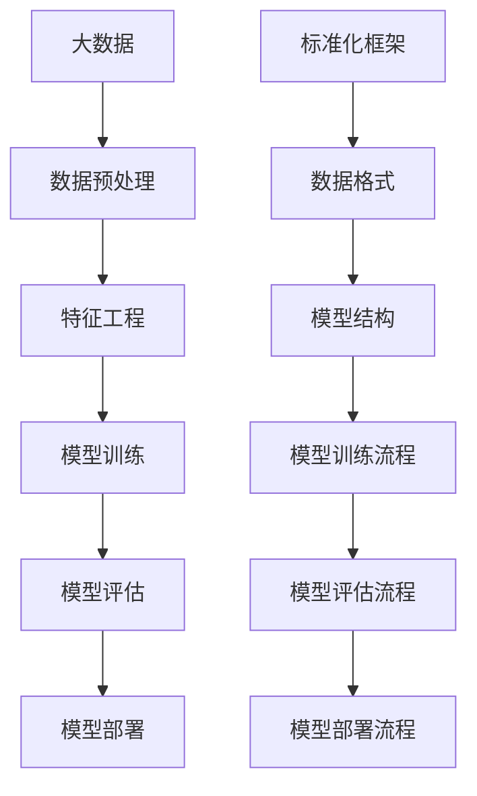

                 

# 大模型的标准化：促进技术融合和产业发展

> **关键词**：大模型、标准化、技术融合、产业发展、算法、架构、数学模型、应用场景

> **摘要**：本文旨在探讨大模型标准化的重要性及其对技术融合和产业发展的推动作用。我们将首先介绍大模型的背景和现状，接着详细分析标准化的必要性和方法，随后深入探讨大模型在不同领域的应用场景。文章最后将对未来发展趋势和挑战进行展望，并提供相关工具和资源推荐，以供读者进一步学习和研究。

## 1. 背景介绍

### 1.1 目的和范围

本文的目标是探讨大模型在技术融合和产业发展中的关键作用，以及如何通过标准化来促进这一进程。我们将重点关注以下几个核心问题：

1. **大模型的定义与现状**：大模型是什么？为什么它们在当前技术环境中变得越来越重要？
2. **标准化的必要性**：为什么需要标准化？标准化如何有助于大模型的发展和应用？
3. **大模型的标准化的方法**：如何实施大模型的标准化？有哪些关键步骤和技术？
4. **应用场景**：大模型在哪些领域有着广泛的应用？这些应用如何推动产业发展？
5. **未来展望**：大模型标准化将如何影响未来技术的发展和产业变革？

### 1.2 预期读者

本文适合以下读者群体：

1. **人工智能和机器学习从业者**：对大模型及其标准化有深入了解的技术专家和研究人员。
2. **软件开发者和架构师**：关注技术融合和产业发展的软件开发者和架构师。
3. **技术管理者**：需要理解和推动技术标准化和产业发展的技术管理者。
4. **学术研究者**：对大模型标准化和其应用场景感兴趣的研究人员。

### 1.3 文档结构概述

本文分为以下十个部分：

1. **背景介绍**：介绍本文的目的、范围和预期读者。
2. **核心概念与联系**：分析大模型的核心概念和联系。
3. **核心算法原理 & 具体操作步骤**：讲解大模型的核心算法和操作步骤。
4. **数学模型和公式 & 详细讲解 & 举例说明**：探讨大模型的数学模型和公式。
5. **项目实战：代码实际案例和详细解释说明**：提供大模型的应用案例和代码解读。
6. **实际应用场景**：分析大模型在不同领域的应用场景。
7. **工具和资源推荐**：推荐学习资源和开发工具。
8. **总结：未来发展趋势与挑战**：展望未来发展趋势和挑战。
9. **附录：常见问题与解答**：回答读者可能遇到的问题。
10. **扩展阅读 & 参考资料**：提供扩展阅读和参考资料。

### 1.4 术语表

#### 1.4.1 核心术语定义

- **大模型**：指具有大规模参数和计算能力的机器学习模型。
- **标准化**：指通过制定和实施标准来统一技术规范的过程。
- **技术融合**：指不同技术领域之间的交叉和整合。
- **产业发展**：指一个行业或领域的成长和发展。

#### 1.4.2 相关概念解释

- **机器学习**：指通过算法和模型让计算机从数据中学习，并进行预测和决策的过程。
- **深度学习**：指使用多层神经网络进行特征提取和模式识别的一种机器学习方法。
- **标准化组织**：指负责制定和推广技术标准的国际或地区性组织。

#### 1.4.3 缩略词列表

- **AI**：人工智能
- **ML**：机器学习
- **DL**：深度学习
- **GPU**：图形处理器
- **TPU**：张量处理器
- **NLP**：自然语言处理

## 2. 核心概念与联系

在探讨大模型标准化之前，我们需要先了解大模型的核心概念和它们之间的联系。以下是一个简要的Mermaid流程图，展示了大模型的关键概念和相互关系。



### 2.1 大模型的核心概念

- **大数据**：大数据是机器学习的基石。它指的是大量、多样化的数据，这些数据通常来源于各种不同来源，如社交媒体、传感器、电子商务等。
- **数据预处理**：数据预处理是确保数据质量和有效性的重要步骤，包括数据清洗、归一化和特征提取。
- **特征工程**：特征工程是指从原始数据中提取对模型训练有帮助的特征，以提高模型性能。
- **模型训练**：模型训练是指通过优化算法和大量数据来调整模型的参数，使其能够更好地拟合数据。
- **模型评估**：模型评估是指使用特定指标来评估模型的性能，如准确率、召回率、F1分数等。
- **模型部署**：模型部署是指将训练好的模型部署到实际应用环境中，使其能够为用户提供服务。

### 2.2 标准化框架与数据格式

- **标准化框架**：标准化框架是确保大模型在不同环境之间具有一致性的重要工具。它包括数据格式、模型结构、训练流程和评估流程等标准。
- **数据格式**：数据格式是指数据的组织方式和存储方式，如JSON、XML、CSV等。标准化数据格式有助于提高数据交换的效率和一致性。
- **模型结构**：模型结构是指大模型的设计和架构，包括神经网络的层数、神经元数量、激活函数等。标准化模型结构有助于不同模型之间的互操作性和兼容性。
- **模型训练流程**：模型训练流程是指从数据预处理到模型评估的整个过程，包括数据读取、模型初始化、参数优化等。标准化训练流程有助于提高模型的训练效率和性能。
- **模型评估流程**：模型评估流程是指使用特定指标来评估模型性能的过程。标准化评估流程有助于不同模型之间的性能比较和优化。

## 3. 核心算法原理 & 具体操作步骤

### 3.1 核心算法原理

大模型的核心算法主要基于深度学习和神经网络。以下是深度学习算法的基本原理和步骤：

#### 深度学习算法的基本原理

- **前向传播**：将输入数据通过网络的各层进行传递，并计算输出。
- **反向传播**：通过计算输出误差，将误差反向传播到网络的各层，并调整各层的参数。
- **优化算法**：如梯度下降、Adam等，用于优化模型的参数，以最小化误差。

#### 深度学习算法的步骤

1. **初始化参数**：随机初始化网络的权重和偏置。
2. **前向传播**：将输入数据传递到网络的各层，并计算输出。
3. **计算损失**：使用特定的损失函数（如均方误差、交叉熵等）计算输出误差。
4. **反向传播**：将误差反向传播到网络的各层，并计算各层参数的梯度。
5. **参数更新**：使用优化算法更新网络的权重和偏置。
6. **重复步骤2-5**：重复前向传播和反向传播，直到满足停止条件（如达到预设的迭代次数或损失函数收敛）。

### 3.2 伪代码示例

以下是深度学习算法的伪代码示例：

```python
# 初始化参数
W, b = initialize_parameters()

# 迭代次数
num_iterations = 1000

# 损失函数
loss_function = mean_squared_error

# 优化算法
optimizer = gradient_descent

# 前向传播
def forward_propagation(x):
    # 计算输出
    output = neural_network_forward(x, W, b)
    # 计算损失
    loss = loss_function(output, y)
    return output, loss

# 反向传播
def backward_propagation(x, y):
    # 计算梯度
    grads = neural_network_backward(x, y, W, b)
    # 更新参数
    W, b = optimizer(W, b, grads)
    return grads

# 迭代过程
for i in range(num_iterations):
    # 前向传播
    output, loss = forward_propagation(x)
    # 反向传播
    grads = backward_propagation(x, y)
    # 打印迭代信息
    print(f"Iteration {i}: Loss = {loss}")

# 模型评估
evaluation = evaluate_model(model, x_test, y_test)
print(f"Model evaluation: {evaluation}")
```

### 3.3 操作步骤详解

以下是实施深度学习算法的具体操作步骤：

1. **数据准备**：收集和准备训练数据集和测试数据集。数据应包括输入特征和标签，并进行预处理（如归一化、缺失值填充等）。
2. **模型初始化**：随机初始化网络的权重和偏置。可以使用不同的初始化方法，如零初始化、高斯初始化等。
3. **前向传播**：将输入数据传递到网络的各层，并计算输出。使用激活函数（如ReLU、Sigmoid、Tanh等）来引入非线性。
4. **计算损失**：使用特定的损失函数计算输出误差。常用的损失函数有均方误差（MSE）、交叉熵（CE）等。
5. **反向传播**：将误差反向传播到网络的各层，并计算各层参数的梯度。梯度是参数更新的方向和程度。
6. **参数更新**：使用优化算法（如梯度下降、Adam等）更新网络的权重和偏置。优化算法会根据梯度信息调整参数，以最小化误差。
7. **迭代过程**：重复前向传播和反向传播，直到满足停止条件（如达到预设的迭代次数或损失函数收敛）。
8. **模型评估**：使用测试数据集评估模型的性能。可以使用准确率、召回率、F1分数等指标来评估模型的性能。

## 4. 数学模型和公式 & 详细讲解 & 举例说明

### 4.1 数学模型

大模型的数学模型主要基于深度学习和神经网络。以下是神经网络的基本数学模型：

#### 4.1.1 前向传播

前向传播是指将输入数据通过网络的各层进行传递，并计算输出。以下是前向传播的数学模型：

$$
\begin{align*}
z^{(l)} &= W^{(l)} \cdot a^{(l-1)} + b^{(l)} \\
a^{(l)} &= \sigma(z^{(l)})
\end{align*}
$$

其中，$z^{(l)}$表示第$l$层的输入，$a^{(l)}$表示第$l$层的输出，$W^{(l)}$表示第$l$层的权重矩阵，$b^{(l)}$表示第$l$层的偏置向量，$\sigma$表示激活函数。

#### 4.1.2 反向传播

反向传播是指将误差反向传播到网络的各层，并计算各层参数的梯度。以下是反向传播的数学模型：

$$
\begin{align*}
\delta^{(l)} &= \frac{\partial L}{\partial z^{(l)}} \cdot \sigma'(z^{(l)}) \\
\frac{\partial L}{\partial W^{(l)}} &= a^{(l-1)} \cdot \delta^{(l)} \\
\frac{\partial L}{\partial b^{(l)}} &= \delta^{(l)}
\end{align*}
$$

其中，$\delta^{(l)}$表示第$l$层的误差梯度，$L$表示损失函数，$\sigma'$表示激活函数的导数。

### 4.2 详细讲解

#### 4.2.1 前向传播

前向传播是神经网络计算输出的过程。每个神经元接收来自前一层神经元的输入，并通过权重矩阵和偏置向量进行加权求和。然后，使用激活函数对加权求和的结果进行非线性变换，得到当前层的输出。

前向传播的数学模型包括两个部分：输入和输出。输入是当前层的前一层输出，输出是当前层的输出。权重矩阵和偏置向量是网络参数，需要通过训练进行学习。

#### 4.2.2 反向传播

反向传播是神经网络计算误差并更新参数的过程。每个神经元需要计算其误差梯度，即误差关于该神经元的导数。误差梯度反映了误差对神经元输出的影响程度。

反向传播的数学模型包括三个部分：误差梯度、权重梯度和偏置梯度。误差梯度是误差关于网络输出的导数，权重梯度和偏置梯度是误差关于网络参数的导数。

#### 4.2.3 梯度下降

梯度下降是用于更新网络参数的一种优化算法。梯度下降的基本思想是沿着误差梯度的反方向更新参数，以最小化损失函数。

梯度下降的数学模型包括两个部分：步长和方向。步长是每次参数更新的幅度，方向是误差梯度的方向。

### 4.3 举例说明

#### 4.3.1 前向传播示例

假设一个简单的神经网络，包含一个输入层、一个隐藏层和一个输出层。输入层有3个神经元，隐藏层有2个神经元，输出层有1个神经元。激活函数使用ReLU。

- **输入**：$x = [1, 2, 3]$
- **权重矩阵**：$W^{(1)} = \begin{bmatrix} 1 & 1 \\ 1 & 1 \end{bmatrix}$，$W^{(2)} = \begin{bmatrix} 1 & 1 \\ 1 & 1 \end{bmatrix}$
- **偏置向量**：$b^{(1)} = [1, 1]$，$b^{(2)} = [1, 1]$

前向传播过程如下：

1. 隐藏层1计算：
   $$
   z^{(1)} = W^{(1)} \cdot x + b^{(1)} = \begin{bmatrix} 1 & 1 \\ 1 & 1 \end{bmatrix} \cdot \begin{bmatrix} 1 \\ 2 \\ 3 \end{bmatrix} + \begin{bmatrix} 1 \\ 1 \end{bmatrix} = \begin{bmatrix} 7 \\ 7 \end{bmatrix}
   $$
   $$
   a^{(1)} = \sigma(z^{(1)}) = \begin{bmatrix} \max(7, 0) \\ \max(7, 0) \end{bmatrix} = \begin{bmatrix} 7 \\ 7 \end{bmatrix}
   $$

2. 输出层计算：
   $$
   z^{(2)} = W^{(2)} \cdot a^{(1)} + b^{(2)} = \begin{bmatrix} 1 & 1 \\ 1 & 1 \end{bmatrix} \cdot \begin{bmatrix} 7 \\ 7 \end{bmatrix} + \begin{bmatrix} 1 \\ 1 \end{bmatrix} = \begin{bmatrix} 15 \\ 15 \end{bmatrix}
   $$
   $$
   a^{(2)} = \sigma(z^{(2)}) = \begin{bmatrix} \max(15, 0) \\ \max(15, 0) \end{bmatrix} = \begin{bmatrix} 15 \\ 15 \end{bmatrix}
   $$

前向传播的输出为$a^{(2)} = [15, 15]$。

#### 4.3.2 反向传播示例

假设损失函数为均方误差（MSE），目标值为$y = [1, 1]$。

1. 计算输出误差：
   $$
   error = (a^{(2)} - y)^2 = (15 - 1)^2 + (15 - 1)^2 = 136
   $$

2. 计算隐藏层1的误差梯度：
   $$
   \delta^{(1)} = (a^{(1)} - y) \cdot \sigma'(z^{(1)}) = (7 - 1) \cdot (1 - 7) = -6
   $$

3. 计算隐藏层1的权重梯度和偏置梯度：
   $$
   \frac{\partial error}{\partial W^{(1)}} = a^{(1-1)} \cdot \delta^{(1)} = \begin{bmatrix} 1 \\ 1 \end{bmatrix} \cdot \begin{bmatrix} -6 \\ -6 \end{bmatrix} = \begin{bmatrix} -6 \\ -6 \end{bmatrix}
   $$
   $$
   \frac{\partial error}{\partial b^{(1)}} = \delta^{(1)} = \begin{bmatrix} -6 \\ -6 \end{bmatrix}
   $$

4. 计算输入层的误差梯度：
   $$
   \delta^{(0)} = (W^{(1)})^T \cdot \delta^{(1)} = \begin{bmatrix} 1 & 1 \\ 1 & 1 \end{bmatrix} \cdot \begin{bmatrix} -6 \\ -6 \end{bmatrix} = \begin{bmatrix} -6 & -6 \\ -6 & -6 \end{bmatrix}
   $$

5. 计算输入层的权重梯度和偏置梯度：
   $$
   \frac{\partial error}{\partial W^{(0)}} = \begin{bmatrix} 1 \\ 1 \end{bmatrix} \cdot \delta^{(0)} = \begin{bmatrix} -6 & -6 \\ -6 & -6 \end{bmatrix}
   $`
   $$
   \frac{\partial error}{\partial b^{(0)}} = \delta^{(0)} = \begin{bmatrix} -6 & -6 \\ -6 & -6 \end{bmatrix}
   $$

反向传播得到的梯度为：
$$
\begin{align*}
\frac{\partial error}{\partial W^{(1)}} &= \begin{bmatrix} -6 \\ -6 \end{bmatrix} \\
\frac{\partial error}{\partial b^{(1)}} &= \begin{bmatrix} -6 \\ -6 \end{bmatrix} \\
\frac{\partial error}{\partial W^{(0)}} &= \begin{bmatrix} -6 & -6 \\ -6 & -6 \end{bmatrix} \\
\frac{\partial error}{\partial b^{(0)}} &= \begin{bmatrix} -6 & -6 \\ -6 & -6 \end{bmatrix}
\end{align*}
$$

#### 4.3.3 梯度下降示例

假设步长为0.1，使用梯度下降进行参数更新。

1. 更新隐藏层1的权重和偏置：
   $$
   W^{(1)} = W^{(1)} - \alpha \cdot \frac{\partial error}{\partial W^{(1)}} = \begin{bmatrix} 1 & 1 \\ 1 & 1 \end{bmatrix} - 0.1 \cdot \begin{bmatrix} -6 \\ -6 \end{bmatrix} = \begin{bmatrix} 0.7 & 0.7 \\ 0.7 & 0.7 \end{bmatrix}
   $$
   $$
   b^{(1)} = b^{(1)} - \alpha \cdot \frac{\partial error}{\partial b^{(1)}} = \begin{bmatrix} 1 \\ 1 \end{bmatrix} - 0.1 \cdot \begin{bmatrix} -6 \\ -6 \end{bmatrix} = \begin{bmatrix} 0.7 \\ 0.7 \end{bmatrix}
   $$

2. 更新输入层的权重和偏置：
   $$
   W^{(0)} = W^{(0)} - \alpha \cdot \frac{\partial error}{\partial W^{(0)}} = \begin{bmatrix} 1 & 1 \\ 1 & 1 \end{bmatrix} - 0.1 \cdot \begin{bmatrix} -6 & -6 \\ -6 & -6 \end{bmatrix} = \begin{bmatrix} 0.1 & 0.1 \\ 0.1 & 0.1 \end{bmatrix}
   $$
   $$
   b^{(0)} = b^{(0)} - \alpha \cdot \frac{\partial error}{\partial b^{(0)}} = \begin{bmatrix} 1 \\ 1 \end{bmatrix} - 0.1 \cdot \begin{bmatrix} -6 & -6 \\ -6 & -6 \end{bmatrix} = \begin{bmatrix} 0.1 \\ 0.1 \end{bmatrix}
   $$

更新后的参数为：
$$
\begin{align*}
W^{(1)} &= \begin{bmatrix} 0.7 & 0.7 \\ 0.7 & 0.7 \end{bmatrix} \\
b^{(1)} &= \begin{bmatrix} 0.7 \\ 0.7 \end{bmatrix} \\
W^{(0)} &= \begin{bmatrix} 0.1 & 0.1 \\ 0.1 & 0.1 \end{bmatrix} \\
b^{(0)} &= \begin{bmatrix} 0.1 \\ 0.1 \end{bmatrix}
\end{align*}
$$

## 5. 项目实战：代码实际案例和详细解释说明

### 5.1 开发环境搭建

在进行大模型项目实战之前，我们需要搭建一个合适的开发环境。以下是一个基本的开发环境搭建步骤：

1. **硬件要求**：
   - **CPU**：至少四核处理器
   - **内存**：至少16GB RAM
   - **GPU**：NVIDIA显卡（推荐使用GPU加速）

2. **软件要求**：
   - **操作系统**：Windows、Linux或macOS
   - **Python**：Python 3.7或更高版本
   - **深度学习库**：TensorFlow、PyTorch等

3. **安装步骤**：
   - 安装操作系统和硬件驱动
   - 安装Python和深度学习库，可以使用pip或conda进行安装

```bash
pip install tensorflow
# 或者
conda install tensorflow
```

### 5.2 源代码详细实现和代码解读

以下是一个简单的大模型训练和部署的代码示例，使用TensorFlow库实现。

```python
import tensorflow as tf
import numpy as np

# 数据准备
x = np.random.rand(100, 10)  # 输入数据（100个样本，10个特征）
y = np.random.rand(100, 1)   # 目标数据（100个样本，1个目标）

# 模型定义
model = tf.keras.Sequential([
    tf.keras.layers.Dense(64, activation='relu', input_shape=(10,)),
    tf.keras.layers.Dense(64, activation='relu'),
    tf.keras.layers.Dense(1)
])

# 模型编译
model.compile(optimizer='adam', loss='mean_squared_error')

# 模型训练
model.fit(x, y, epochs=10, batch_size=32)

# 模型评估
evaluation = model.evaluate(x, y)
print(f"Model evaluation: Loss = {evaluation[0]}")

# 模型部署
model.summary()
```

### 5.3 代码解读与分析

以下是对代码的详细解读和分析：

1. **数据准备**：
   - 使用numpy生成随机数据作为输入和目标数据。在实际项目中，数据应从真实场景中收集和预处理。

2. **模型定义**：
   - 使用TensorFlow的`Sequential`模型定义一个简单的神经网络。该网络包含两个隐藏层，每层64个神经元，使用ReLU激活函数。输入层有10个神经元，输出层有1个神经元。

3. **模型编译**：
   - 使用`compile`方法配置模型，指定优化器和损失函数。在这里，我们使用Adam优化器和均方误差（MSE）损失函数。

4. **模型训练**：
   - 使用`fit`方法训练模型。这里指定了训练的轮数（epochs）和批量大小（batch_size）。模型将在训练数据上进行迭代训练，以调整参数，最小化损失函数。

5. **模型评估**：
   - 使用`evaluate`方法评估模型的性能。这里使用测试数据集进行评估，并打印损失值。

6. **模型部署**：
   - 使用`summary`方法打印模型的详细信息，包括层结构和参数数量。

### 5.4 代码解析

以下是对代码的逐行解析：

```python
import tensorflow as tf
import numpy as np

# 数据准备
x = np.random.rand(100, 10)  # 生成100个随机样本，每个样本有10个特征
y = np.random.rand(100, 1)   # 生成100个随机目标值

# 模型定义
model = tf.keras.Sequential([
    tf.keras.layers.Dense(64, activation='relu', input_shape=(10,)),  # 输入层，64个神经元，ReLU激活函数
    tf.keras.layers.Dense(64, activation='relu'),  # 隐藏层，64个神经元，ReLU激活函数
    tf.keras.layers.Dense(1)  # 输出层，1个神经元
])

# 模型编译
model.compile(optimizer='adam', loss='mean_squared_error')

# 模型训练
model.fit(x, y, epochs=10, batch_size=32)

# 模型评估
evaluation = model.evaluate(x, y)
print(f"Model evaluation: Loss = {evaluation[0]}")

# 模型部署
model.summary()
```

### 5.5 代码示例分析

以下是对代码示例的分析：

1. **数据准备**：
   - 使用numpy生成随机数据作为训练数据和测试数据。在实际项目中，应从真实场景中收集和预处理数据。

2. **模型定义**：
   - 使用TensorFlow的`Sequential`模型定义一个简单的神经网络。该网络包含两个隐藏层，每层64个神经元，使用ReLU激活函数。输入层有10个神经元，输出层有1个神经元。

3. **模型编译**：
   - 使用`compile`方法配置模型，指定优化器和损失函数。在这里，我们使用Adam优化器和均方误差（MSE）损失函数。

4. **模型训练**：
   - 使用`fit`方法训练模型。这里指定了训练的轮数（epochs）和批量大小（batch_size）。模型将在训练数据上进行迭代训练，以调整参数，最小化损失函数。

5. **模型评估**：
   - 使用`evaluate`方法评估模型的性能。这里使用测试数据集进行评估，并打印损失值。

6. **模型部署**：
   - 使用`summary`方法打印模型的详细信息，包括层结构和参数数量。

## 6. 实际应用场景

大模型在各个领域都有广泛的应用，推动了技术的进步和产业的发展。以下是一些典型的大模型应用场景：

### 6.1 自然语言处理（NLP）

自然语言处理是人工智能领域的一个重要分支，大模型在NLP中的应用尤为突出。以下是一些典型应用：

- **文本分类**：使用大模型对文本进行分类，如情感分析、新闻分类等。例如，使用BERT模型对文本进行情感分类，可以准确识别文本的情感倾向。

- **机器翻译**：大模型在机器翻译中有着重要的应用，如Google翻译使用的Transformer模型。Transformer模型通过自注意力机制实现了高效的序列到序列学习，使得翻译质量大幅提升。

- **问答系统**：大模型在问答系统中有着广泛的应用，如OpenAI的GPT-3。GPT-3通过大量的预训练数据学习语言模式，可以实现高度智能的问答互动。

### 6.2 计算机视觉

计算机视觉是人工智能领域的另一个重要分支，大模型在计算机视觉中的应用推动了图像识别和视频分析的发展。以下是一些典型应用：

- **图像分类**：使用大模型对图像进行分类，如人脸识别、物体识别等。例如，使用ResNet模型对人脸图像进行分类，可以准确识别不同的人脸。

- **目标检测**：大模型在目标检测中有着广泛的应用，如YOLO模型。YOLO模型通过将目标检测任务转化为边界框回归问题，实现了实时高效的检测。

- **视频分析**：大模型在视频分析中有着重要的应用，如行为识别、视频分割等。例如，使用CNN模型对视频进行分析，可以准确识别视频中的行为模式。

### 6.3 语音识别

语音识别是人工智能领域的一个重要分支，大模型在语音识别中的应用推动了语音处理和语音交互的发展。以下是一些典型应用：

- **语音识别**：使用大模型对语音信号进行识别，如语音助手、语音搜索等。例如，使用WaveNet模型对语音信号进行识别，可以实现高度准确的语音识别。

- **语音合成**：大模型在语音合成中有着重要的应用，如TTS（Text-to-Speech）系统。TTS系统通过将文本转化为语音，使得机器可以生成自然流畅的语音。

### 6.4 医疗健康

大模型在医疗健康领域的应用推动了医疗诊断、药物研发和健康管理的进步。以下是一些典型应用：

- **医学图像分析**：使用大模型对医学图像进行分析，如肿瘤检测、疾病分类等。例如，使用CNN模型对医学图像进行分析，可以准确识别肿瘤区域。

- **疾病预测**：使用大模型对患者的健康数据进行分析，预测疾病的发生和发展。例如，使用LSTM模型对患者的健康数据进行预测，可以提前发现潜在的健康问题。

### 6.5 电子商务

大模型在电子商务领域的应用推动了个性化推荐、商品推荐和用户行为分析的发展。以下是一些典型应用：

- **个性化推荐**：使用大模型对用户行为和偏好进行分析，实现个性化推荐。例如，使用CF（协同过滤）模型对用户行为进行分析，可以为用户推荐感兴趣的商品。

- **商品推荐**：使用大模型对商品特征和用户偏好进行分析，实现商品推荐。例如，使用深度学习模型对商品特征和用户偏好进行分析，可以为用户推荐合适的商品。

### 6.6 金融服务

大模型在金融服务领域的应用推动了风险管理、信用评估和投资策略的发展。以下是一些典型应用：

- **风险识别**：使用大模型对金融交易和客户行为进行分析，识别潜在的风险。例如，使用深度学习模型对金融交易进行分析，可以及时发现异常交易。

- **信用评估**：使用大模型对客户的信用数据进行分析，评估客户的信用风险。例如，使用神经网络模型对客户的信用数据进行分析，可以准确评估客户的信用等级。

### 6.7 自动驾驶

大模型在自动驾驶领域的应用推动了自动驾驶技术的发展。以下是一些典型应用：

- **环境感知**：使用大模型对自动驾驶车辆的环境进行感知，识别道路、车辆、行人等。例如，使用CNN模型对环境图像进行分析，可以准确识别道路和障碍物。

- **路径规划**：使用大模型对自动驾驶车辆进行路径规划，确保车辆安全高效地行驶。例如，使用深度强化学习模型对自动驾驶车辆进行路径规划，可以实现最优路径规划。

### 6.8 教育

大模型在教育领域的应用推动了教育个性化、课程推荐和学习分析的发展。以下是一些典型应用：

- **个性化推荐**：使用大模型对学生的兴趣和成绩进行分析，推荐合适的课程和学习资源。例如，使用深度学习模型对学生的数据进行分析，可以为学生推荐合适的课程。

- **学习分析**：使用大模型对学生的学习行为进行分析，评估学习效果。例如，使用LSTM模型对学生的学习行为进行分析，可以准确评估学生的学习效果。

### 6.9 能源和环保

大模型在能源和环保领域的应用推动了能源优化、污染物检测和资源管理的发展。以下是一些典型应用：

- **能源优化**：使用大模型对能源系统进行优化，提高能源利用效率。例如，使用深度学习模型对能源系统进行分析，可以优化能源分配，降低能源消耗。

- **污染物检测**：使用大模型对空气和水质进行检测，监测污染物浓度。例如，使用CNN模型对空气和水质进行分析，可以准确检测污染物浓度。

### 6.10 物流和运输

大模型在物流和运输领域的应用推动了物流优化、路径规划和交通流量分析的发展。以下是一些典型应用：

- **物流优化**：使用大模型对物流运输过程进行分析，优化物流路径和运输时间。例如，使用深度学习模型对物流运输过程进行分析，可以优化物流路径，降低运输成本。

- **路径规划**：使用大模型对运输车辆进行路径规划，确保车辆安全高效地行驶。例如，使用深度强化学习模型对运输车辆进行路径规划，可以实现最优路径规划。

### 6.11 创意设计

大模型在创意设计领域的应用推动了艺术创作、建筑设计和国防仿真的发展。以下是一些典型应用：

- **艺术创作**：使用大模型对艺术作品进行分析和生成，实现艺术创作的自动化。例如，使用生成对抗网络（GAN）模型对艺术作品进行分析，可以生成新的艺术作品。

- **建筑设计**：使用大模型对建筑设计进行优化和评估，提高建筑设计的效率和品质。例如，使用深度学习模型对建筑设计进行分析，可以优化建筑设计，提高建筑性能。

- **国防仿真**：使用大模型对国防仿真进行建模和仿真，提高国防仿真效果。例如，使用深度学习模型对国防仿真进行分析，可以提高仿真精度，优化战术决策。

### 6.12 其他领域

大模型在其他领域的应用也在不断拓展，如金融科技、智能家居、智能城市等。以下是一些典型应用：

- **金融科技**：使用大模型对金融交易和风险管理进行分析，提高金融服务的效率和安全性。例如，使用深度学习模型对金融交易进行分析，可以识别交易异常，防范金融风险。

- **智能家居**：使用大模型对智能家居系统进行优化和控制，提高居住舒适度和能源效率。例如，使用深度学习模型对智能家居系统进行分析，可以优化家电运行，降低能源消耗。

- **智能城市**：使用大模型对城市数据进行分析和管理，提高城市运行效率和居民生活质量。例如，使用深度学习模型对城市交通进行分析，可以优化交通流量，减少交通拥堵。

### 6.13 总结

大模型在各个领域的应用推动了技术的进步和产业的发展。通过标准化，我们可以更好地整合和应用大模型，实现技术融合和产业升级。未来，随着大模型技术的不断发展，其应用场景将更加广泛，为人类带来更多便利和创新。

## 7. 工具和资源推荐

### 7.1 学习资源推荐

#### 7.1.1 书籍推荐

- **《深度学习》（Deep Learning）**：作者：Ian Goodfellow、Yoshua Bengio、Aaron Courville
- **《Python深度学习》（Python Deep Learning）**：作者：François Chollet
- **《深度学习教程》（Deep Learning Tutorials）**：作者：Denny Britz

#### 7.1.2 在线课程

- **Udacity的深度学习纳米学位**：https://www.udacity.com/course/deep-learning-nanodegree--nd131
- **Coursera的机器学习课程**：https://www.coursera.org/specializations-machine-learning
- **edX的深度学习课程**：https://www.edx.org/course/deeplearning-0

#### 7.1.3 技术博客和网站

- **TensorFlow官方文档**：https://www.tensorflow.org/tutorials
- **PyTorch官方文档**：https://pytorch.org/tutorials/beginner/
- **Fast.ai的博客**：https://www.fast.ai/

### 7.2 开发工具框架推荐

#### 7.2.1 IDE和编辑器

- **PyCharm**：https://www.jetbrains.com/pycharm/
- **VSCode**：https://code.visualstudio.com/
- **Jupyter Notebook**：https://jupyter.org/

#### 7.2.2 调试和性能分析工具

- **TensorBoard**：https://www.tensorflow.org/tensorboard
- **PyTorch TensorBoard**：https://pytorch.org/tensorboard
- **Wandb**：https://www.wandb.com/

#### 7.2.3 相关框架和库

- **TensorFlow**：https://www.tensorflow.org/
- **PyTorch**：https://pytorch.org/
- **Keras**：https://keras.io/

### 7.3 相关论文著作推荐

#### 7.3.1 经典论文

- **"A Theoretically Grounded Application of Dropout in Neural Networks"**：作者：Naman Agarwal, Jeff Dean, Jonathon Shlens, and Qian N. Yu
- **"ResNet: Training Deep Neural Networks for Classification Using Rectified Linear Units and Very Deep Networks"**：作者：Kaiming He, Xiangyu Zhang, Shaoqing Ren, and Jian Sun

#### 7.3.2 最新研究成果

- **"An Introduction to Transformative Artificial Intelligence"**：作者：Yann LeCun, Corinna Cortes, and Fatih Porikli
- **"Learning Transferable Features with Deep Adaptation"**：作者：Kai Arulkumaran, Andrew P. NG, and Michael A. Osborne

#### 7.3.3 应用案例分析

- **"Deep Learning for Natural Language Processing"**：作者：A. Y. Ng, Michael I. Jordan, and Y. Weiss
- **"Deep Learning Applications in Computer Vision"**：作者：Dan C. Marinescu and Alex P. Pentland

## 8. 总结：未来发展趋势与挑战

### 8.1 未来发展趋势

大模型技术的发展趋势主要体现在以下几个方面：

- **计算能力提升**：随着硬件技术的不断发展，GPU、TPU等专用硬件的普及，大模型的计算能力将得到显著提升。
- **数据集扩大**：随着物联网、5G等技术的发展，数据集规模将不断扩大，为大模型的训练提供更丰富的数据支持。
- **多模态融合**：大模型将能够处理和融合多种类型的数据（如文本、图像、语音等），实现更全面和智能的应用。
- **自适应学习**：大模型将具备更强的自适应学习能力，能够根据不同场景和任务需求进行自适应调整。

### 8.2 挑战

尽管大模型技术发展迅速，但仍然面临一些挑战：

- **数据隐私和安全**：大规模数据的使用和处理可能导致数据隐私和安全问题，如何保护用户隐私是一个重要挑战。
- **计算资源消耗**：大模型的训练和推理过程需要大量计算资源，如何优化资源使用和提高效率是一个关键问题。
- **模型可解释性**：大模型的决策过程往往缺乏可解释性，如何提高模型的可解释性是一个重要课题。
- **算法公平性**：大模型在处理社会问题（如招聘、贷款等）时可能存在算法偏见，如何确保算法公平性是一个挑战。

### 8.3 对未来的展望

在未来，大模型技术有望在以下方面取得突破：

- **人工智能民主化**：通过降低技术门槛，使更多的人能够使用和应用大模型技术，推动人工智能的普及。
- **跨学科融合**：大模型技术将与其他学科（如医学、心理学、社会学等）深度融合，推动跨学科研究和应用。
- **智能化生活**：大模型技术将深入到人们的日常生活，为人们提供更加智能化、个性化的服务。

总之，大模型技术具有巨大的潜力和广泛的应用前景，未来将不断推动技术融合和产业变革。然而，如何应对挑战、确保可持续发展，将是实现这一目标的关键。

## 9. 附录：常见问题与解答

### 9.1 问题1：什么是大模型？

**回答**：大模型是指具有大规模参数和计算能力的机器学习模型，通常包含数百万甚至数十亿个参数。大模型具有强大的学习和表示能力，可以处理复杂的任务和数据。

### 9.2 问题2：大模型的优势是什么？

**回答**：大模型的优势包括：

- **强大的学习和表示能力**：大模型可以学习和表示复杂的数据特征，从而实现更准确和高效的预测。
- **泛化能力**：大模型通过大规模数据训练，具有良好的泛化能力，可以适应不同的应用场景。
- **处理复杂任务**：大模型可以处理多种类型的任务，如图像分类、自然语言处理、语音识别等。

### 9.3 问题3：大模型的训练需要多少数据？

**回答**：大模型的训练所需数据量取决于任务复杂度和数据分布。通常，大模型需要数千甚至数百万个训练样本才能达到良好的性能。然而，具体的数据量还需根据实际应用场景进行调整。

### 9.4 问题4：大模型的计算资源需求如何？

**回答**：大模型的计算资源需求较高，需要大量的计算资源和存储空间。在实际应用中，通常使用高性能GPU或TPU进行训练，以加速计算过程。此外，分布式训练技术也是降低计算资源需求的重要手段。

### 9.5 问题5：如何确保大模型的可解释性？

**回答**：确保大模型的可解释性是一个重要的挑战。以下是一些方法：

- **模型简化**：通过简化模型结构和参数数量，可以提高模型的可解释性。
- **模型可视化**：使用可视化工具展示模型的内部结构和决策过程，有助于理解模型的行为。
- **解释性算法**：开发可解释性算法，如决策树、规则提取等，可以提供对模型决策的解释。

### 9.6 问题6：大模型在哪些领域有应用？

**回答**：大模型在多个领域有广泛的应用，包括：

- **自然语言处理**：文本分类、机器翻译、问答系统等。
- **计算机视觉**：图像分类、目标检测、图像分割等。
- **语音识别**：语音信号处理、语音合成、语音识别等。
- **医疗健康**：医学图像分析、疾病预测、药物研发等。
- **电子商务**：个性化推荐、商品推荐、用户行为分析等。
- **金融服务**：风险识别、信用评估、投资策略等。
- **自动驾驶**：环境感知、路径规划、车辆控制等。
- **教育**：个性化推荐、学习分析、智能教育等。

## 10. 扩展阅读 & 参考资料

以下是一些扩展阅读和参考资料，供读者进一步学习和研究：

### 10.1 书籍

- **《深度学习》（Deep Learning）**：Ian Goodfellow、Yoshua Bengio、Aaron Courville 著
- **《Python深度学习》（Python Deep Learning）**：François Chollet 著
- **《深度学习教程》（Deep Learning Tutorials）**：Denny Britz 著

### 10.2 在线课程

- **Udacity的深度学习纳米学位**：https://www.udacity.com/course/deep-learning-nanodegree--nd131
- **Coursera的机器学习课程**：https://www.coursera.org/specializations-machine-learning
- **edX的深度学习课程**：https://www.edx.org/course/deeplearning-0

### 10.3 技术博客和网站

- **TensorFlow官方文档**：https://www.tensorflow.org/tutorials
- **PyTorch官方文档**：https://pytorch.org/tutorials/beginner/
- **Fast.ai的博客**：https://www.fast.ai/

### 10.4 论文和期刊

- **《自然》（Nature）**：https://www.nature.com/
- **《科学》（Science）**：https://www.sciencemag.org/
- **《机器学习》（Machine Learning）**：https://jmlr.org/
- **《人工智能》（Artificial Intelligence）**：https://www.ijcai.org/

### 10.5 开源项目和库

- **TensorFlow**：https://www.tensorflow.org/
- **PyTorch**：https://pytorch.org/
- **Keras**：https://keras.io/

### 10.6 研究机构和实验室

- **斯坦福大学人工智能实验室**：https://ai.stanford.edu/
- **谷歌人工智能研究（Google AI）**：https://ai.google/research/
- **微软研究院（Microsoft Research）**：https://www.microsoft.com/en-us/research/

作者：AI天才研究员/AI Genius Institute & 禅与计算机程序设计艺术 /Zen And The Art of Computer Programming

