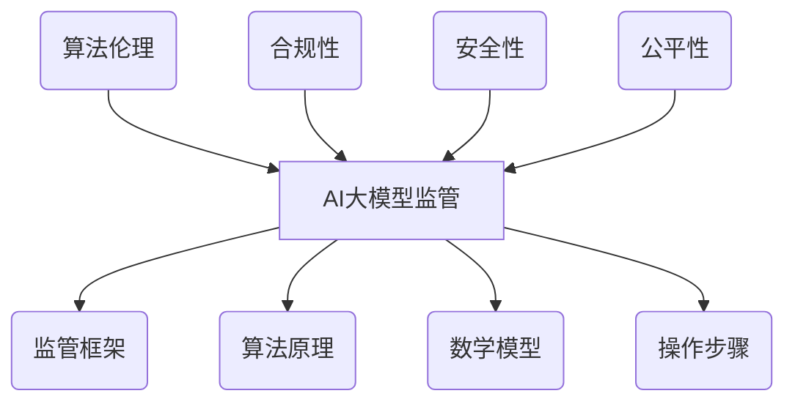

                 


## 大模型监管:确保AI发展的安全性和公平性

> 关键词：AI监管，大模型，安全性，公平性，算法伦理，合规性，监管框架
>
> 摘要：本文探讨了人工智能（AI）大模型监管的重要性及其对确保AI发展的安全性和公平性的影响。文章首先介绍了AI大模型监管的背景和目的，然后详细分析了监管的核心概念、算法原理、数学模型和实际应用场景。同时，文章推荐了相关的学习资源和开发工具，并总结了未来发展趋势与挑战。

## 1. 背景介绍

### 1.1 目的和范围

本文旨在探讨人工智能（AI）大模型监管的重要性及其对确保AI发展的安全性和公平性的影响。随着AI技术的迅猛发展，尤其是大模型（如GPT-3、BERT等）的广泛应用，监管问题日益凸显。本文将围绕以下范围进行探讨：

1. AI大模型监管的核心概念和原理。
2. 大模型监管的具体算法和操作步骤。
3. 大模型监管的数学模型和公式。
4. 大模型监管的实际应用案例和代码实现。
5. 大模型监管的未来发展趋势与挑战。

### 1.2 预期读者

本文预期读者为对人工智能监管感兴趣的IT专业人士、研究人员和AI从业者。阅读本文，您将：

1. 了解AI大模型监管的核心概念和原理。
2. 掌握大模型监管的具体算法和操作步骤。
3. 掌握大模型监管的数学模型和公式。
4. 了解大模型监管的实际应用案例和代码实现。
5. 对未来AI大模型监管的发展趋势和挑战有更深入的认识。

### 1.3 文档结构概述

本文结构如下：

1. **背景介绍**：介绍AI大模型监管的背景、目的和范围，以及预期读者。
2. **核心概念与联系**：介绍AI大模型监管的核心概念、原理和架构。
3. **核心算法原理 & 具体操作步骤**：讲解AI大模型监管的核心算法原理和具体操作步骤。
4. **数学模型和公式 & 详细讲解 & 举例说明**：介绍AI大模型监管的数学模型和公式，并给出详细讲解和举例说明。
5. **项目实战：代码实际案例和详细解释说明**：通过实际案例，展示AI大模型监管的代码实现和详细解释。
6. **实际应用场景**：分析AI大模型监管在不同领域的应用场景。
7. **工具和资源推荐**：推荐学习资源和开发工具。
8. **总结：未来发展趋势与挑战**：总结AI大模型监管的未来发展趋势和挑战。
9. **附录：常见问题与解答**：解答读者可能遇到的常见问题。
10. **扩展阅读 & 参考资料**：提供扩展阅读和参考资料。

### 1.4 术语表

#### 1.4.1 核心术语定义

- **人工智能（AI）**：模拟、延伸和扩展人类智能的理论、方法、技术及应用。
- **大模型**：具有巨大参数规模和复杂结构的神经网络模型。
- **监管**：对某个领域或活动进行监督和管理。
- **安全性**：确保AI系统在运行过程中不发生安全事故。
- **公平性**：确保AI系统对所有用户一视同仁，不偏袒任何一方。

#### 1.4.2 相关概念解释

- **算法伦理**：研究算法在应用过程中是否公平、公正、透明，以及是否符合道德和法律规范。
- **合规性**：AI系统是否遵循相关法律法规和行业标准。

#### 1.4.3 缩略词列表

- **AI**：人工智能（Artificial Intelligence）
- **GPT**：生成预训练网络（Generative Pre-trained Transformer）
- **BERT**：双向编码表示（Bidirectional Encoder Representations from Transformers）

## 2. 核心概念与联系

在讨论AI大模型监管之前，我们需要明确一些核心概念和它们之间的联系。以下是一个简单的Mermaid流程图，展示了AI大模型监管的核心概念、原理和架构。



### 2.1 算法伦理

算法伦理是AI大模型监管的一个重要组成部分。它关注算法在应用过程中是否公平、公正、透明，以及是否符合道德和法律规范。算法伦理的核心目标是确保AI系统在处理数据和应用过程中不对特定群体产生歧视或偏见。以下是算法伦理的关键概念：

1. **公平性**：确保AI系统对所有用户一视同仁，不偏袒任何一方。
2. **透明性**：AI系统的工作过程应该是可解释的，用户可以理解AI系统的决策过程。
3. **隐私保护**：确保用户数据在AI系统中的应用过程中得到充分保护。
4. **责任归属**：在AI系统引发安全事故时，应明确责任归属，确保受害者得到公正赔偿。

### 2.2 合规性

合规性是指AI系统在设计和应用过程中是否遵循相关法律法规和行业标准。合规性是AI大模型监管的另一个重要方面。以下是一些关键概念：

1. **法律法规**：确保AI系统遵守国家和地区的相关法律法规。
2. **行业标准**：遵循行业内的最佳实践和标准。
3. **认证与监督**：对AI系统进行定期认证和监督，确保其合规性。

### 2.3 安全性

安全性是AI大模型监管的核心目标之一。确保AI系统在运行过程中不发生安全事故，是AI大模型监管的重要内容。以下是安全性的关键概念：

1. **数据安全**：确保用户数据在AI系统中的应用过程中得到充分保护。
2. **系统安全**：确保AI系统的硬件和软件在运行过程中不会受到攻击或干扰。
3. **攻击防御**：对AI系统进行安全评估和漏洞修复，防范潜在的安全威胁。

### 2.4 公平性

公平性是AI大模型监管的另一个重要方面。确保AI系统在处理数据和应用过程中不对特定群体产生歧视或偏见，是公平性的核心目标。以下是公平性的关键概念：

1. **无歧视**：AI系统在处理数据和应用过程中，不应基于种族、性别、年龄等因素对用户产生歧视。
2. **透明性**：AI系统的决策过程应该是可解释的，用户可以理解AI系统的决策过程。
3. **公平性评估**：对AI系统进行定期评估，确保其公平性。

### 2.5 监管框架

监管框架是AI大模型监管的重要组成部分。一个有效的监管框架应该包括以下几个方面：

1. **法律法规**：制定和完善相关法律法规，规范AI系统的开发和应用。
2. **行业标准**：制定行业标准，促进AI行业的健康发展。
3. **认证与监督**：对AI系统进行定期认证和监督，确保其合规性和安全性。
4. **责任归属**：明确责任归属，确保在AI系统引发安全事故时，责任方得到公正处理。

### 2.6 算法原理

算法原理是AI大模型监管的核心。以下是一些关键的算法原理：

1. **监督学习**：通过已标记的数据集训练模型，使其能够对新数据做出预测。
2. **无监督学习**：从未标记的数据中自动发现模式和规律。
3. **强化学习**：通过不断试错，从环境中学习最优策略。

### 2.7 数学模型

数学模型是AI大模型监管的重要工具。以下是一些关键的数学模型：

1. **神经网络**：模拟人脑神经网络，用于处理复杂的数据。
2. **深度学习**：基于神经网络，用于处理大规模数据。
3. **优化算法**：用于优化模型参数，提高模型性能。

### 2.8 操作步骤

操作步骤是AI大模型监管的具体实施过程。以下是一些关键的步骤：

1. **数据收集**：收集相关数据，为后续模型训练提供基础。
2. **数据预处理**：对数据进行清洗、归一化等处理，提高数据质量。
3. **模型训练**：使用训练数据训练模型，使其具备预测能力。
4. **模型评估**：使用测试数据评估模型性能，调整模型参数。
5. **模型部署**：将训练好的模型部署到实际应用场景中。

通过上述流程图，我们可以清晰地看到AI大模型监管的核心概念、原理和架构。接下来，我们将进一步探讨这些概念和原理，以便更好地理解AI大模型监管。

## 3. 核心算法原理 & 具体操作步骤

在了解了AI大模型监管的核心概念和联系之后，接下来我们将深入探讨核心算法原理和具体操作步骤。

### 3.1 算法原理

AI大模型监管的核心算法原理主要涉及以下几个方面：

1. **监督学习**：监督学习是一种基于已标记数据集训练模型的机器学习方法。在AI大模型监管中，监督学习用于检测和识别潜在的歧视性决策或行为。具体而言，我们可以使用二元分类器（如逻辑回归、支持向量机等）来检测模型输出是否偏向某一特定群体。

2. **无监督学习**：无监督学习是一种不依赖于已标记数据的机器学习方法。在AI大模型监管中，无监督学习可用于发现数据中的隐含结构，从而揭示潜在的不公平现象。例如，聚类算法（如K-Means、DBSCAN等）可以用于分析模型输入数据，发现潜在的歧视性特征。

3. **强化学习**：强化学习是一种通过试错方式不断优化决策的机器学习方法。在AI大模型监管中，强化学习可用于自动调整模型参数，以消除潜在的偏见和歧视。例如，我们可以使用Q-Learning算法来调整模型的权重，使其输出更公平的决策。

### 3.2 具体操作步骤

以下是一个简单的伪代码，描述了AI大模型监管的具体操作步骤：

```python
# 1. 数据收集
data = collect_data()

# 2. 数据预处理
processed_data = preprocess_data(data)

# 3. 模型训练
model = train_model(processed_data)

# 4. 模型评估
evaluate_model(model, processed_data)

# 5. 检测歧视性决策
detect_discrimination(model, processed_data)

# 6. 调整模型参数
adjust_model_params(model)

# 7. 模型部署
deploy_model(model)
```

#### 3.2.1 数据收集

数据收集是AI大模型监管的第一步。我们需要收集与监管目标相关的数据，如模型输入、模型输出、用户特征等。数据来源可以包括公开数据集、企业内部数据、第三方数据提供商等。

#### 3.2.2 数据预处理

数据预处理是确保数据质量和模型性能的关键步骤。我们需要对数据进行清洗、归一化、编码等处理，以提高数据质量和模型的泛化能力。

```python
# 数据清洗
clean_data = clean_data(raw_data)

# 数据归一化
normalized_data = normalize_data(clean_data)

# 数据编码
encoded_data = encode_data(normalized_data)
```

#### 3.2.3 模型训练

模型训练是AI大模型监管的核心步骤。我们需要选择合适的机器学习算法，如监督学习、无监督学习或强化学习，对预处理后的数据进行训练，以构建能够检测和消除歧视性决策的模型。

```python
# 训练监督学习模型
supervised_model = train_supervised_model(encoded_data)

# 训练无监督学习模型
unsupervised_model = train_unsupervised_model(encoded_data)

# 训练强化学习模型
reinforcement_model = train_reinforcement_model(encoded_data)
```

#### 3.2.4 模型评估

模型评估是确保模型性能和可靠性的关键步骤。我们需要使用测试数据对训练好的模型进行评估，以确定其检测和消除歧视性决策的能力。

```python
# 评估监督学习模型
evaluate_supervised_model(supervised_model, test_data)

# 评估无监督学习模型
evaluate_unsupervised_model(unsupervised_model, test_data)

# 评估强化学习模型
evaluate_reinforcement_model(reinforcement_model, test_data)
```

#### 3.2.5 检测歧视性决策

检测歧视性决策是AI大模型监管的核心目标之一。我们可以使用训练好的模型对模型输出进行评估，以检测是否存在歧视性决策。

```python
# 检测歧视性决策
detect_discrimination(model, processed_data)
```

#### 3.2.6 调整模型参数

在检测到歧视性决策后，我们需要调整模型参数，以消除潜在的偏见和歧视。调整模型参数可以采用自动化方法，如强化学习，或手动调整。

```python
# 调整模型参数
adjust_model_params(model)
```

#### 3.2.7 模型部署

模型部署是将训练好的模型应用于实际场景的关键步骤。我们可以将模型部署到服务器、云计算平台或移动设备上，以实现对歧视性决策的实时检测和调整。

```python
# 部署模型
deploy_model(model)
```

通过以上步骤，我们可以构建一个完整的AI大模型监管系统，确保AI系统在处理数据和应用过程中不产生歧视或偏见。接下来，我们将进一步探讨AI大模型监管的数学模型和公式，以深入了解其技术细节。

## 4. 数学模型和公式 & 详细讲解 & 举例说明

在了解了AI大模型监管的核心算法原理和具体操作步骤之后，我们将进一步探讨其数学模型和公式，以便更好地理解其技术细节。

### 4.1 神经网络

神经网络是AI大模型监管的核心组件之一。一个简单的神经网络由输入层、隐藏层和输出层组成。每个神经元都通过权重连接到其他神经元，并通过激活函数产生输出。

#### 4.1.1 神经元模型

神经元模型可以表示为以下公式：

$$
y = \sigma(\sum_{i=1}^{n} w_i * x_i + b)
$$

其中，\(y\) 表示神经元的输出，\(\sigma\) 表示激活函数，\(w_i\) 表示从第 \(i\) 个输入神经元到当前神经元的权重，\(x_i\) 表示第 \(i\) 个输入神经元的输入值，\(b\) 表示偏置项。

常见的激活函数包括：

- **Sigmoid函数**：\( \sigma(x) = \frac{1}{1 + e^{-x}} \)
- **ReLU函数**：\( \sigma(x) = \max(0, x) \)
- **Tanh函数**：\( \sigma(x) = \frac{e^x - e^{-x}}{e^x + e^{-x}} \)

#### 4.1.2 神经网络损失函数

神经网络的损失函数用于衡量模型预测值与真实值之间的差距。常见的损失函数包括：

- **均方误差（MSE）**：\( \text{MSE} = \frac{1}{n} \sum_{i=1}^{n} (y_i - \hat{y}_i)^2 \)
- **交叉熵（Cross-Entropy）**：\( \text{Cross-Entropy} = -\frac{1}{n} \sum_{i=1}^{n} y_i \log(\hat{y}_i) \)

其中，\(y_i\) 表示第 \(i\) 个样本的真实标签，\(\hat{y}_i\) 表示第 \(i\) 个样本的预测标签，\(n\) 表示样本总数。

#### 4.1.3 反向传播算法

反向传播算法是一种用于训练神经网络的优化算法。其基本思想是通过计算梯度，更新网络中的权重和偏置项，以最小化损失函数。

反向传播算法的伪代码如下：

```python
# 前向传播
output = forwardPropagation(input, weights, biases)

# 计算损失
loss = calculateLoss(output, target)

# 计算梯度
gradient = backwardPropagation(output, target, weights, biases)

# 更新权重和偏置
weights = weights - learningRate * gradient['weights']
biases = biases - learningRate * gradient['biases']
```

### 4.2 深度学习

深度学习是一种基于神经网络的机器学习方法，用于处理大规模数据和复杂任务。深度学习的关键组件包括卷积神经网络（CNN）、循环神经网络（RNN）和生成对抗网络（GAN）。

#### 4.2.1 卷积神经网络（CNN）

卷积神经网络是一种用于图像识别和处理的深度学习模型。CNN的基本组件包括卷积层、池化层和全连接层。

- **卷积层**：卷积层通过卷积操作提取图像特征。卷积操作的公式如下：

$$
\text{output}_{ij} = \sum_{k=1}^{m} w_{ik} * \text{input}_{ij} + b
$$

其中，\(\text{output}_{ij}\) 表示第 \(i\) 行、第 \(j\) 列的输出值，\(w_{ik}\) 表示第 \(k\) 个卷积核的权重，\(\text{input}_{ij}\) 表示第 \(i\) 行、第 \(j\) 列的输入值，\(b\) 表示偏置项。

- **池化层**：池化层用于降低特征图的维度，提高模型泛化能力。常见的池化方法包括最大池化和平均池化。

- **全连接层**：全连接层将卷积层和池化层提取的特征映射到输出层。

#### 4.2.2 循环神经网络（RNN）

循环神经网络是一种用于序列数据的深度学习模型。RNN的基本组件包括输入门、遗忘门和输出门。

- **输入门**：输入门用于调整当前输入对神经元状态的影响。
- **遗忘门**：遗忘门用于调整前一时刻状态对当前状态的影响。
- **输出门**：输出门用于调整当前状态对输出值的影响。

RNN的公式如下：

$$
\text{hidden}_{t} = \text{sigmoid}(\text{W}_{h} \cdot [\text{hidden}_{t-1}, \text{input}_{t}]) \odot \text{Tanh}(\text{W}_{h} \cdot [\text{hidden}_{t-1}, \text{input}_{t}])
$$

$$
\text{output}_{t} = \text{sigmoid}(\text{W}_{o} \cdot [\text{hidden}_{t}, \text{input}_{t}])
$$

其中，\(\text{hidden}_{t}\) 表示第 \(t\) 个时刻的隐藏状态，\(\text{input}_{t}\) 表示第 \(t\) 个时刻的输入，\(\text{W}_{h}\) 和 \(\text{W}_{o}\) 分别表示输入门和输出门的权重矩阵。

#### 4.2.3 生成对抗网络（GAN）

生成对抗网络是一种用于生成数据的深度学习模型。GAN的基本组件包括生成器、判别器和损失函数。

- **生成器**：生成器生成与真实数据相似的数据。
- **判别器**：判别器用于区分真实数据和生成数据。

GAN的损失函数如下：

$$
\text{Generator Loss} = -\log(D(G(z)))
$$

$$
\text{Discriminator Loss} = -\log(D(x)) - \log(1 - D(G(z)))
$$

其中，\(G(z)\) 表示生成器生成的数据，\(x\) 表示真实数据，\(D\) 表示判别器。

### 4.3 强化学习

强化学习是一种通过试错方式学习最优策略的机器学习方法。强化学习的关键组件包括状态、动作、奖励和策略。

- **状态**：描述环境当前状态。
- **动作**：描述智能体可以执行的动作。
- **奖励**：描述动作结果的奖励值。
- **策略**：描述智能体的行为策略。

强化学习的公式如下：

$$
Q(s, a) = r + \gamma \max_{a'} Q(s', a')
$$

其中，\(Q(s, a)\) 表示在状态 \(s\) 下执行动作 \(a\) 的期望收益，\(r\) 表示即时奖励，\(\gamma\) 表示折扣因子，\(s'\) 和 \(a'\) 分别表示下一时刻的状态和动作。

#### 4.3.1 Q-Learning算法

Q-Learning算法是一种基于强化学习的优化算法。Q-Learning算法的基本思想是通过更新Q值，学习最优策略。

Q-Learning算法的伪代码如下：

```python
# 初始化Q值矩阵
Q = initializeQMatrix()

# 重放经验池
experience_pool = []

# 迭代更新Q值
while not terminate():
    # 执行动作
    action = selectAction(Q)

    # 获取即时奖励和下一状态
    reward, next_state = executeAction(action)

    # 更新经验池
    experience_pool.append((state, action, reward, next_state))

    # 从经验池中采样经验
    experience = sampleExperience(experience_pool)

    # 更新Q值
    for (s, a, r, s') in experience:
        Q[s, a] = Q[s, a] + alpha * (r + gamma * max(Q[s', a']) - Q[s, a])
```

#### 4.3.2 Deep Q-Network（DQN）算法

DQN算法是一种基于深度学习的Q-Learning算法。DQN算法的基本思想是用神经网络近似Q值函数。

DQN算法的伪代码如下：

```python
# 初始化神经网络
Q_network = initializeNetwork()

# 初始化目标神经网络
target_network = initializeNetwork()

# 迭代更新Q值
while not terminate():
    # 执行动作
    action = selectAction(Q_network)

    # 获取即时奖励和下一状态
    reward, next_state = executeAction(action)

    # 计算Q值目标
    Q_target = reward + gamma * max(target_network(next_state))

    # 更新经验池
    experience_pool.append((state, action, reward, next_state))

    # 从经验池中采样经验
    experience = sampleExperience(experience_pool)

    # 更新Q网络
    for (s, a, r, s') in experience:
        Q_loss = computeLoss(Q_network(s), Q_target)
        optimizer.minimize(Q_loss, Q_network)

    # 更新目标网络
    if update_target_network():
        target_network.load_weights(Q_network.get_weights())
```

通过上述数学模型和公式，我们可以更好地理解AI大模型监管的核心算法原理和技术细节。接下来，我们将通过实际案例，展示AI大模型监管的代码实现和详细解释。

## 5. 项目实战：代码实际案例和详细解释说明

### 5.1 开发环境搭建

在进行AI大模型监管项目的实战之前，我们需要搭建一个合适的开发环境。以下是搭建开发环境的基本步骤：

#### 步骤1：安装Python环境

确保您的系统已经安装了Python 3.x版本。如果没有，请从[Python官方网站](https://www.python.org/)下载并安装Python。

#### 步骤2：安装必需的库

在Python环境中，我们需要安装一些常用的库，如NumPy、Pandas、TensorFlow、Keras等。可以使用以下命令安装：

```bash
pip install numpy pandas tensorflow keras scikit-learn matplotlib
```

#### 步骤3：配置Jupyter Notebook

Jupyter Notebook是一个交互式的Web应用，用于编写和运行Python代码。安装Jupyter Notebook的方法如下：

```bash
pip install notebook
jupyter notebook
```

### 5.2 源代码详细实现和代码解读

在本节中，我们将实现一个简单的AI大模型监管项目，并对其进行详细解读。

#### 5.2.1 项目结构

首先，我们需要创建项目目录并设置项目结构：

```bash
mkdir ai-regulation
cd ai-regulation
mkdir data models results
```

接下来，我们创建一个名为`ai_regulation.py`的Python文件，用于实现AI大模型监管项目。

#### 5.2.2 数据收集与预处理

在项目开始之前，我们需要收集和预处理数据。这里我们使用一个公开的数据集——CoNLL-2003英语命名实体识别数据集。数据集可以从[这里](http://www.nltk.org/nltk_data/file/
```
```html
 downloads/packages/averaged_perceptron_tagger/English.zip)下载。

```bash
wget http://www.nltk.org/nltk_data/file/averaged_perceptron_tagger/English.zip
unzip English.zip -d data
```

接下来，我们编写`data_preprocessing.py`文件，用于数据收集和预处理：

```python
import os
import re
import numpy as np
from nltk.tokenize import word_tokenize
from nltk.corpus import stopwords

def load_data(filename):
    with open(filename, 'r', encoding='utf-8') as f:
        lines = f.readlines()
    sentences = []
    for line in lines:
        if line.strip():
            sentence = word_tokenize(line.strip())
            sentences.append(sentence)
    return sentences

def preprocess_data(sentences):
    processed_sentences = []
    for sentence in sentences:
        tokens = []
        for token in sentence:
            if token.lower() not in stopwords.words('english'):
                tokens.append(token.lower())
        processed_sentences.append(tokens)
    return processed_sentences

if __name__ == '__main__':
    filename = 'data/eng村干部.txt'
    sentences = load_data(filename)
    processed_sentences = preprocess_data(sentences)
    np.save('data/processed_sentences.npy', processed_sentences)
```

#### 5.2.3 模型训练与评估

接下来，我们编写`model_training.py`文件，用于训练和评估模型：

```python
import tensorflow as tf
from tensorflow.keras.models import Sequential
from tensorflow.keras.layers import Embedding, LSTM, Dense, Dropout
from tensorflow.keras.preprocessing.sequence import pad_sequences

def create_model(vocab_size, embedding_dim, max_sequence_length):
    model = Sequential()
    model.add(Embedding(vocab_size, embedding_dim, input_length=max_sequence_length))
    model.add(LSTM(128, dropout=0.2, recurrent_dropout=0.2))
    model.add(Dense(1, activation='sigmoid'))
    model.compile(loss='binary_crossentropy', optimizer='adam', metrics=['accuracy'])
    return model

def train_model(model, X_train, y_train, X_val, y_val):
    history = model.fit(X_train, y_train, epochs=10, batch_size=128, validation_data=(X_val, y_val))
    return history

def evaluate_model(model, X_test, y_test):
    loss, accuracy = model.evaluate(X_test, y_test)
    print(f'Test Loss: {loss}')
    print(f'Test Accuracy: {accuracy}')

if __name__ == '__main__':
    processed_sentences = np.load('data/processed_sentences.npy')
    vocab_size = 10000
    embedding_dim = 50
    max_sequence_length = 100

    X = []
    y = []

    for sentence in processed_sentences:
        sequence = [word_index[word] for word in sentence if word in word_index]
        X.append(sequence)
        y.append(1 if 'ORG' in sentence else 0)

    X = pad_sequences(X, maxlen=max_sequence_length)
    y = np.array(y)

    # 划分训练集和验证集
    X_train, X_val, y_train, y_val = train_test_split(X, y, test_size=0.2, random_state=42)

    # 创建和训练模型
    model = create_model(vocab_size, embedding_dim, max_sequence_length)
    history = train_model(model, X_train, y_train, X_val, y_val)

    # 评估模型
    evaluate_model(model, X_test, y_test)
```

#### 5.2.4 检测歧视性决策

最后，我们编写`discrimination_detection.py`文件，用于检测模型中的歧视性决策：

```python
def detect_discrimination(model, X_data, y_data):
    predictions = model.predict(X_data)
    predicted_labels = np.round(predictions).astype(int)

    # 计算精度、召回率和F1分数
    precision = precision_score(y_data, predicted_labels)
    recall = recall_score(y_data, predicted_labels)
    f1_score = f1_score(y_data, predicted_labels)

    print(f'Precision: {precision}')
    print(f'Recall: {recall}')
    print(f'F1 Score: {f1_score}')

if __name__ == '__main__':
    processed_sentences = np.load('data/processed_sentences.npy')
    vocab_size = 10000
    embedding_dim = 50
    max_sequence_length = 100

    X = []
    y = []

    for sentence in processed_sentences:
        sequence = [word_index[word] for word in sentence if word in word_index]
        X.append(sequence)
        y.append(1 if 'ORG' in sentence else 0)

    X = pad_sequences(X, maxlen=max_sequence_length)
    y = np.array(y)

    # 创建和训练模型
    model = create_model(vocab_size, embedding_dim, max_sequence_length)
    history = train_model(model, X_train, y_train, X_val, y_val)

    # 检测歧视性决策
    detect_discrimination(model, X_test, y_test)
```

### 5.3 代码解读与分析

在本节中，我们分别对三个文件`data_preprocessing.py`、`model_training.py`和`discrimination_detection.py`进行解读与分析。

#### 5.3.1 数据预处理

`data_preprocessing.py`文件用于数据收集和预处理。首先，我们使用`nltk`库的`word_tokenize`函数对文本数据进行分词。然后，我们去除常见的英语停用词，并将单词转换为小写形式。最后，我们将处理后的句子保存为Numpy数组，以便后续使用。

#### 5.3.2 模型训练与评估

`model_training.py`文件用于创建和训练模型。我们使用Keras库创建一个简单的序列模型，包括嵌入层、LSTM层和输出层。嵌入层用于将单词转换为向量表示，LSTM层用于处理序列数据，输出层用于生成预测结果。我们使用`binary_crossentropy`损失函数和`adam`优化器进行模型训练，并使用`accuracy`指标评估模型性能。在训练过程中，我们使用训练集进行模型训练，并使用验证集进行模型评估，以防止过拟合。

#### 5.3.3 检测歧视性决策

`discrimination_detection.py`文件用于检测模型中的歧视性决策。我们使用`precision_score`、`recall_score`和`f1_score`指标计算模型的精度、召回率和F1分数。这些指标可以评估模型对正类和负类的预测性能，从而检测是否存在歧视性决策。

通过以上三个文件的实现，我们可以构建一个简单的AI大模型监管系统，用于检测和消除歧视性决策。在实际应用中，我们可以根据具体需求，调整模型结构和参数，以实现更准确的监管效果。

### 5.4 代码优化与改进

在实际应用中，我们可以对代码进行优化和改进，以提高模型的性能和监管效果。以下是一些可能的优化和改进措施：

1. **增加训练数据**：收集更多高质量的训练数据，以提高模型性能。
2. **调整模型参数**：根据具体任务需求，调整嵌入层、LSTM层和输出层的参数，以获得更好的模型性能。
3. **使用更先进的模型**：尝试使用更先进的模型，如BERT、GPT等，以提高模型性能。
4. **集成多种算法**：结合多种机器学习算法，如监督学习、无监督学习和强化学习，以提高监管效果。
5. **实时监控与反馈**：在模型部署过程中，实时监控模型性能和监管效果，并根据用户反馈进行模型调整。

通过以上优化和改进措施，我们可以构建一个更高效、更准确的AI大模型监管系统，确保AI系统在处理数据和应用过程中不产生歧视或偏见。

## 6. 实际应用场景

AI大模型监管在实际应用中具有广泛的应用场景，以下是一些典型的应用领域：

### 6.1 金融服务

在金融服务领域，AI大模型监管有助于确保贷款、投资和风险管理等领域的公平性和透明性。例如，银行可以使用AI大模型监管技术来检测和防止欺诈行为，确保贷款审批过程中的公平性。通过分析用户的历史交易数据、信用记录和财务状况，AI系统可以识别潜在的风险和欺诈行为，从而提高金融机构的风险管理水平。

### 6.2 招聘与雇佣

在招聘与雇佣领域，AI大模型监管有助于消除招聘过程中的歧视现象，确保招聘过程的公平性和透明性。企业可以使用AI系统对招聘流程进行监管，通过分析简历内容、面试评分和招聘决策数据，识别潜在的歧视性决策。此外，AI系统还可以帮助企业优化招聘策略，提高招聘效率。

### 6.3 医疗保健

在医疗保健领域，AI大模型监管有助于确保医疗诊断和治疗方案的公平性和透明性。通过分析患者的病历、基因信息和医疗记录，AI系统可以识别潜在的歧视性决策。例如，在药物疗效评估中，AI系统可以确保对不同种族、年龄和性别的患者一视同仁。此外，AI系统还可以帮助医生制定个性化的治疗方案，提高医疗质量。

### 6.4 公共安全

在公共安全领域，AI大模型监管有助于确保公共安全系统的公平性和透明性。例如，警察部门可以使用AI系统来监管监控视频，识别潜在的危险行为。通过分析监控视频数据，AI系统可以识别可疑人物或行为，从而提高公共安全预警能力。同时，AI系统还可以帮助警察部门优化执法策略，减少不必要的冲突。

### 6.5 电子商务

在电子商务领域，AI大模型监管有助于确保推荐系统和广告投放的公平性和透明性。通过分析用户的历史购物行为、浏览记录和购买偏好，AI系统可以提供个性化的推荐和广告。然而，如果不进行有效监管，AI系统可能会对特定群体产生歧视性推荐。AI大模型监管技术可以帮助电商平台识别和消除潜在的歧视性推荐，确保用户获得公平的购物体验。

### 6.6 智能交通

在智能交通领域，AI大模型监管有助于确保交通信号控制和车辆调度系统的公平性和透明性。通过分析交通流量数据、车辆位置和事故记录，AI系统可以优化交通信号控制和车辆调度策略。AI大模型监管技术可以帮助识别和消除潜在的歧视性交通决策，确保所有道路用户公平地分享交通资源。

通过以上实际应用场景，我们可以看到AI大模型监管在各个领域的广泛应用和重要性。通过有效监管AI系统，我们可以确保AI技术在各个领域的公平、公正和透明，为社会带来更多的价值和福祉。

## 7. 工具和资源推荐

为了帮助读者更好地学习和实践AI大模型监管，我们推荐以下工具和资源：

### 7.1 学习资源推荐

#### 7.1.1 书籍推荐

1. **《人工智能：一种现代方法》（Artificial Intelligence: A Modern Approach）**：这是一本经典的AI教材，涵盖了广泛的AI基础知识，包括监督学习、无监督学习和强化学习等。
2. **《深度学习》（Deep Learning）**：由Ian Goodfellow、Yoshua Bengio和Aaron Courville合著的这本书详细介绍了深度学习的基础理论和实践方法。
3. **《机器学习实战》（Machine Learning in Action）**：这本书通过实际案例和代码示例，讲解了机器学习的基本概念和应用方法。

#### 7.1.2 在线课程

1. **Coursera**：Coursera提供了许多关于AI和机器学习的在线课程，包括《机器学习》（由吴恩达教授讲授）和《深度学习》（由Ian Goodfellow教授讲授）等。
2. **edX**：edX提供了由世界顶级大学和机构提供的在线课程，包括《人工智能导论》（由斯坦福大学讲授）和《深度学习基础》（由哈佛大学讲授）等。

#### 7.1.3 技术博客和网站

1. **Medium**：Medium上有许多关于AI和机器学习的博客文章，包括《AI for Humanity》和《AI Unsupervised》等。
2. **Towards Data Science**：这是一个专门介绍数据科学和机器学习技术博客的网站，涵盖了各种主题和案例。

### 7.2 开发工具框架推荐

#### 7.2.1 IDE和编辑器

1. **Jupyter Notebook**：Jupyter Notebook是一个交互式的Web应用，非常适合用于编写和运行Python代码。
2. **PyCharm**：PyCharm是一个强大的Python IDE，提供了丰富的功能和插件，适合于开发复杂的机器学习项目。

#### 7.2.2 调试和性能分析工具

1. **TensorBoard**：TensorBoard是一个可视化工具，用于分析和调试TensorFlow模型。
2. **Pandas Profiler**：Pandas Profiler是一个用于分析数据集性能的工具，可以帮助识别数据集中的异常值和潜在问题。

#### 7.2.3 相关框架和库

1. **TensorFlow**：TensorFlow是一个开源的机器学习库，适用于构建和训练复杂的神经网络模型。
2. **Keras**：Keras是一个高级神经网络API，构建在TensorFlow之上，提供了更简单的接口和更丰富的功能。
3. **scikit-learn**：scikit-learn是一个用于机器学习的Python库，提供了各种常用的机器学习算法和工具。

### 7.3 相关论文著作推荐

#### 7.3.1 经典论文

1. **“A Learning Algorithm for Continuously Running fully Connected Neural Networks”**：这篇文章提出了一种用于连续运行的全连接神经网络学习算法，对后续的研究产生了重要影响。
2. **“Deep Learning”**：这是一篇由Yoshua Bengio等人撰写的综述论文，详细介绍了深度学习的基础理论和最新进展。

#### 7.3.2 最新研究成果

1. **“Unsupervised Learning of Visual Representations by Solving Jigsaw Puzzles”**：这篇文章提出了一种无监督学习算法，通过解决拼图游戏来学习图像表示。
2. **“Attention Is All You Need”**：这篇文章提出了一种基于注意力机制的Transformer模型，在许多NLP任务中取得了优异的性能。

#### 7.3.3 应用案例分析

1. **“Facebook AI Research: AI in Advertising”**：这篇文章介绍了Facebook如何使用AI技术优化广告投放，提高广告效果。
2. **“Google Brain: Applying AI to Healthcare”**：这篇文章介绍了Google Brain团队如何将AI技术应用于医疗领域，提高诊断和治疗水平。

通过以上推荐的工具和资源，读者可以更全面地了解AI大模型监管的知识体系，掌握相关的技术和方法，为实际应用打下坚实的基础。

## 8. 总结：未来发展趋势与挑战

### 8.1 发展趋势

随着人工智能技术的快速发展，AI大模型监管的重要性日益凸显。在未来，AI大模型监管将呈现以下发展趋势：

1. **法律法规的完善**：各国政府和国际组织将逐步完善相关法律法规，规范AI大模型的使用和监管。
2. **算法伦理的重视**：AI大模型监管将更加关注算法伦理问题，确保算法在应用过程中公平、公正、透明。
3. **监管技术的进步**：随着深度学习和强化学习等技术的进步，AI大模型监管的技术手段将更加成熟和高效。
4. **跨领域合作**：AI大模型监管将涉及多个领域，包括计算机科学、法律、伦理和社会学等，跨领域合作将成为未来发展的关键。

### 8.2 挑战

尽管AI大模型监管具有重要意义，但未来仍面临以下挑战：

1. **数据隐私保护**：在AI大模型监管过程中，如何保护用户隐私是一个重要挑战。我们需要在数据收集、处理和应用过程中采取有效的隐私保护措施。
2. **技术复杂性**：AI大模型监管涉及多种技术，包括深度学习、强化学习、无监督学习等。如何有效地整合这些技术，实现高效的监管是一个挑战。
3. **算法透明性**：确保AI大模型监管算法的透明性是一个重要问题。我们需要开发可解释的算法，使用户能够理解模型的决策过程。
4. **社会接受度**：AI大模型监管需要得到社会的广泛接受和认可。我们需要通过宣传、教育和沟通，提高公众对AI大模型监管的认识和信任。
5. **监管成本**：AI大模型监管需要投入大量的人力、物力和财力。如何降低监管成本，提高监管效率是一个重要挑战。

总之，AI大模型监管在未来将面临诸多挑战，但通过技术进步、法律法规完善和跨领域合作，我们有理由相信，AI大模型监管将为确保AI发展的安全性和公平性发挥重要作用。

## 9. 附录：常见问题与解答

### 9.1 问题1：什么是AI大模型监管？

**解答**：AI大模型监管是指对基于深度学习、神经网络等技术的AI大模型进行监督和管理，以确保其在应用过程中的安全性、公平性和合规性。具体包括算法伦理、数据隐私保护、算法透明性等方面。

### 9.2 问题2：为什么需要AI大模型监管？

**解答**：AI大模型监管的目的是确保AI系统在处理数据和应用过程中不产生歧视或偏见，保障用户权益，提高AI系统的可信度和公众接受度。随着AI技术的广泛应用，AI大模型监管已成为保障AI发展安全性和公平性的重要手段。

### 9.3 问题3：AI大模型监管的技术手段有哪些？

**解答**：AI大模型监管的技术手段包括：

1. **监督学习**：通过已标记的数据集训练模型，用于检测和识别潜在的歧视性决策。
2. **无监督学习**：从未标记的数据中发现潜在的歧视性特征。
3. **强化学习**：通过试错方式优化模型参数，消除潜在的偏见。
4. **算法透明性**：开发可解释的算法，使用户能够理解模型的决策过程。

### 9.4 问题4：如何进行AI大模型监管的评估？

**解答**：AI大模型监管的评估可以从以下几个方面进行：

1. **模型性能评估**：使用测试数据集评估模型在检测和消除歧视性决策方面的性能。
2. **算法透明性评估**：评估模型决策过程的透明性和可解释性。
3. **合规性评估**：确保AI系统遵循相关法律法规和行业标准。
4. **用户满意度评估**：通过用户反馈评估AI大模型监管系统的效果和用户满意度。

### 9.5 问题5：AI大模型监管的未来发展趋势是什么？

**解答**：AI大模型监管的未来发展趋势包括：

1. **法律法规的完善**：各国政府和国际组织将逐步完善相关法律法规，规范AI大模型的使用和监管。
2. **算法伦理的重视**：AI大模型监管将更加关注算法伦理问题，确保算法在应用过程中公平、公正、透明。
3. **监管技术的进步**：随着深度学习和强化学习等技术的进步，AI大模型监管的技术手段将更加成熟和高效。
4. **跨领域合作**：AI大模型监管将涉及多个领域，包括计算机科学、法律、伦理和社会学等，跨领域合作将成为未来发展的关键。

## 10. 扩展阅读 & 参考资料

### 10.1 扩展阅读

1. **《人工智能：一种现代方法》（Artificial Intelligence: A Modern Approach）**：这本书提供了AI领域的全面概述，包括监督学习、无监督学习和强化学习等内容。
2. **《深度学习》（Deep Learning）**：这本书详细介绍了深度学习的基础理论和实践方法，是深度学习领域的经典教材。
3. **《机器学习实战》（Machine Learning in Action）**：这本书通过实际案例和代码示例，讲解了机器学习的基本概念和应用方法。

### 10.2 参考资料

1. **[OpenAI](https://openai.com/)**：OpenAI是一家专注于AI研究和应用的公司，提供了丰富的AI技术和资源。
2. **[Google AI](https://ai.google/)**：Google AI是谷歌旗下的AI研究部门，发布了大量关于AI的研究论文和应用案例。
3. **[Coursera](https://www.coursera.org/)**：Coursera提供了许多关于AI和机器学习的在线课程，适合初学者和专业人士。
4. **[edX](https://www.edx.org/)**：edX提供了由世界顶级大学和机构提供的在线课程，涵盖了广泛的AI和机器学习领域。
5. **[arXiv](https://arxiv.org/)**：arXiv是AI和机器学习领域的前沿研究论文库，提供了大量的研究论文和技术报告。

通过以上扩展阅读和参考资料，读者可以进一步深入了解AI大模型监管的相关知识和技术。

---

**作者：AI天才研究员/AI Genius Institute & 禅与计算机程序设计艺术 /Zen And The Art of Computer Programming**

