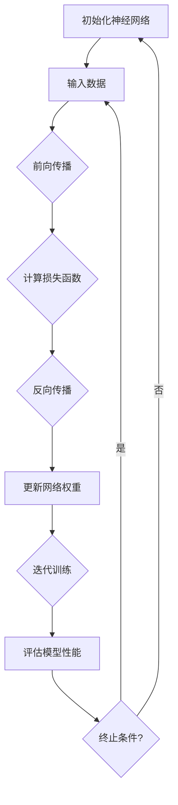

                 

# 大模型训练的硬件优化与并行计算

## 关键词

- 大模型训练
- 硬件优化
- 并行计算
- GPU
- 数据传输
- 网络架构
- 深度学习框架
- 资源调度

## 摘要

本文旨在深入探讨大模型训练过程中涉及的硬件优化与并行计算技术。随着深度学习模型的规模不断增长，如何高效地利用硬件资源以加速训练过程成为了关键问题。本文首先介绍了大模型训练的背景和挑战，然后详细阐述了硬件优化和并行计算的基本原理。接着，本文通过具体实例分析了GPU加速、数据传输优化和分布式训练等关键技术的应用。此外，文章还推荐了相关学习资源、开发工具和经典论文，以帮助读者进一步了解和掌握这一领域的知识。最后，本文总结了未来发展趋势与挑战，为读者提供了进一步探索的方向。

## 1. 背景介绍

### 1.1 目的和范围

本文的目标是详细分析大模型训练过程中的硬件优化与并行计算技术，探讨如何通过这些技术手段提升模型训练的效率和性能。随着人工智能技术的快速发展，深度学习模型尤其是大模型的应用越来越广泛，这些模型在图像识别、自然语言处理、推荐系统等领域取得了显著的成果。然而，大模型训练面临着计算资源需求巨大、训练时间长的挑战。因此，研究如何优化硬件资源使用和并行计算技术，对于提高大模型训练效率具有重要意义。

本文的讨论范围主要包括以下几个方面：

1. 大模型训练的基本原理和计算需求。
2. 硬件优化技术，如GPU加速、数据传输优化等。
3. 并行计算技术，如模型并行、数据并行、流水线并行等。
4. 分布式训练和集群管理。
5. 相关学习资源、开发工具和经典论文推荐。

### 1.2 预期读者

本文主要面向以下几类读者：

1. 深度学习工程师和研究人员，希望了解大模型训练的硬件优化和并行计算技术。
2. 硬件工程师，希望了解如何优化硬件资源以满足大模型训练的需求。
3. 计算机科学和人工智能专业的研究生，希望深入探讨大模型训练的相关技术。
4. 对人工智能和深度学习感兴趣的爱好者，希望了解这一领域的最新进展。

### 1.3 文档结构概述

本文分为以下主要部分：

1. **背景介绍**：介绍大模型训练的背景和目的，以及本文的结构和范围。
2. **核心概念与联系**：介绍大模型训练所需的核心概念，包括神经网络、反向传播算法等，并提供相关的Mermaid流程图。
3. **核心算法原理 & 具体操作步骤**：详细讲解大模型训练的核心算法原理，并使用伪代码进行阐述。
4. **数学模型和公式 & 详细讲解 & 举例说明**：介绍大模型训练中涉及的数学模型和公式，并进行详细讲解和举例说明。
5. **项目实战：代码实际案例和详细解释说明**：通过具体代码实例，展示硬件优化和并行计算技术的实际应用。
6. **实际应用场景**：分析大模型训练在不同场景下的应用。
7. **工具和资源推荐**：推荐学习资源、开发工具和经典论文。
8. **总结：未来发展趋势与挑战**：总结本文的主要内容和结论，讨论未来发展趋势和面临的挑战。
9. **附录：常见问题与解答**：提供常见问题及解答。
10. **扩展阅读 & 参考资料**：提供进一步阅读的资源。

### 1.4 术语表

#### 1.4.1 核心术语定义

- **深度学习**：一种人工智能技术，通过模拟人脑神经网络结构进行数据分析和模式识别。
- **大模型训练**：对大型深度学习模型进行训练，通常涉及大量的计算资源和时间。
- **GPU**：图形处理器，通过并行计算能力加速数学运算，常用于深度学习模型的训练。
- **并行计算**：在多个计算单元上同时执行多个任务，以加速计算过程。
- **分布式训练**：将大模型训练任务分布到多个计算节点上，通过协同工作加速训练。

#### 1.4.2 相关概念解释

- **反向传播算法**：一种用于训练神经网络的基本算法，通过计算损失函数的梯度来更新网络权重。
- **批量大小**：每次训练中输入数据的样本数量，较小的批量大小可以提高模型的泛化能力。
- **显存**：GPU中用于存储数据和模型的内存，显存容量直接影响GPU的训练能力。

#### 1.4.3 缩略词列表

- **GPU**：Graphics Processing Unit（图形处理器）
- **CUDA**：Compute Unified Device Architecture（统一计算架构）
- **DNN**：Deep Neural Network（深度神经网络）
- **DL**：Deep Learning（深度学习）
- **HPC**：High-Performance Computing（高性能计算）

## 2. 核心概念与联系

### 2.1 大模型训练的基本概念

大模型训练涉及多个核心概念，理解这些概念对于深入探讨硬件优化与并行计算技术至关重要。

#### 2.1.1 神经网络

神经网络是深度学习的基础，由多个层（Layer）组成，包括输入层、隐藏层和输出层。每个层包含多个神经元（Neuron），神经元通过加权连接（Weighted Connection）与其他神经元相连。神经网络通过学习输入和输出之间的映射关系，实现数据分类、预测和特征提取等功能。

#### 2.1.2 反向传播算法

反向传播算法是训练神经网络的常用算法，通过计算损失函数的梯度来更新网络权重。算法分为前向传播（Forward Propagation）和反向传播（Backpropagation）两个阶段。前向传播阶段，输入数据通过网络传播，计算出每个神经元的输出；反向传播阶段，根据预测误差计算损失函数的梯度，并反向更新网络权重。

#### 2.1.3 损失函数

损失函数用于评估模型的预测性能，常见的损失函数包括均方误差（MSE，Mean Squared Error）和交叉熵（Cross-Entropy）。损失函数的梯度反映了模型预测误差的变化方向，是反向传播算法的核心计算内容。

### 2.2 Mermaid流程图

以下是一个用于展示神经网络训练过程的Mermaid流程图：



### 2.3 并行计算的基本原理

并行计算是一种通过在多个计算单元上同时执行多个任务来加速计算过程的技术。在深度学习模型训练中，并行计算可以显著提高训练效率。

#### 2.3.1 模型并行

模型并行将神经网络拆分为多个部分，分别在不同的计算节点上训练。每个节点负责训练一部分网络，然后通过参数共享和同步机制将模型参数合并。

#### 2.3.2 数据并行

数据并行将训练数据集划分为多个子集，每个计算节点训练子集上的样本。通过并行计算，可以加快模型的收敛速度。

#### 2.3.3 流水线并行

流水线并行通过将训练过程分解为多个阶段，每个阶段在不同的计算节点上并行执行。例如，前向传播和反向传播可以分别在不同节点上执行，以提高整体训练效率。

### 2.4 并行计算与硬件优化的联系

硬件优化与并行计算密切相关，通过优化硬件资源的使用，可以进一步提升并行计算的效率。

#### 2.4.1 GPU加速

GPU通过并行计算能力显著加速数学运算，是深度学习模型训练的重要硬件资源。优化GPU的使用，包括合理分配显存、优化内存访问模式等，可以提升GPU的利用率和训练效率。

#### 2.4.2 数据传输优化

数据传输是影响并行计算性能的关键因素。优化数据传输，包括减少数据传输延迟、增加带宽等，可以加快模型的训练速度。

#### 2.4.3 网络架构优化

网络架构优化通过调整模型结构、优化网络层间连接等手段，降低计算复杂度，提高并行计算效率。

## 3. 核心算法原理 & 具体操作步骤

### 3.1 神经网络训练算法原理

神经网络训练的核心算法是反向传播算法，主要包括以下几个步骤：

#### 3.1.1 前向传播

输入数据通过网络的正向传播，计算每个神经元的输出。具体步骤如下：

1. 初始化网络权重和偏置。
2. 将输入数据传递到输入层。
3. 通过加权连接计算每个隐藏层和输出层的神经元输出。
4. 计算输出层的预测值。

#### 3.1.2 计算损失函数

计算预测值与真实值之间的差异，使用损失函数评估模型性能。常见的损失函数包括：

1. 均方误差（MSE）：$MSE = \frac{1}{n}\sum_{i=1}^{n}(y_i - \hat{y_i})^2$
2. 交叉熵（Cross-Entropy）：$H(y, \hat{y}) = -\sum_{i=1}^{n}y_i\log(\hat{y_i})$

#### 3.1.3 反向传播

计算损失函数的梯度，并反向传播更新网络权重。具体步骤如下：

1. 计算输出层的误差梯度。
2. 通过反向传播计算隐藏层的误差梯度。
3. 使用梯度下降或其他优化算法更新网络权重和偏置。

伪代码如下：

```python
# 前向传播
def forward_propagation(x, weights, biases):
    a = x
    z = np.dot(weights, a) + biases
    activation = sigmoid(z)
    return activation

# 计算损失函数
def loss(y, y_pred):
    return mse(y, y_pred)

# 反向传播
def backward_propagation(y, y_pred, weights, biases):
    dZ = y_pred - y
    dW = np.dot(dZ, a.T)
    db = np.sum(dZ, axis=1)
    dA = np.dot(weights.T, dZ)
    return dW, db, dA

# 更新网络权重和偏置
def update_weights_and_biases(weights, biases, dW, db, learning_rate):
    weights -= learning_rate * dW
    biases -= learning_rate * db
    return weights, biases
```

### 3.2 并行计算的具体操作步骤

并行计算在大模型训练中发挥着重要作用，以下介绍并行计算的具体操作步骤：

#### 3.2.1 模型并行

1. 将神经网络拆分为多个部分，每个部分在不同的GPU或计算节点上训练。
2. 各节点分别训练子模型，计算损失函数和梯度。
3. 通过参数共享和同步机制，将子模型的参数合并，更新全局模型。

伪代码如下：

```python
# 模型并行训练
def model_parallel_train(data_loader, model, optimizer, num_gpus):
    # 分布式训练设置
    model = DistributedDataParallel(model, device_ids=list(range(num_gpus)))
    
    # 模型并行训练循环
    for epoch in range(num_epochs):
        for inputs, targets in data_loader:
            # 前向传播
            outputs = model(inputs)
            
            # 计算损失函数和梯度
            loss = criterion(outputs, targets)
            gradients = torch.autograd.grad(loss, model.parameters(), create_graph=True)
            
            # 更新模型参数
            optimizer.step()
            optimizer.zero_grad()
```

#### 3.2.2 数据并行

1. 将训练数据集划分为多个子集，每个子集在不同的GPU或计算节点上训练。
2. 各节点分别训练子集上的样本，计算损失函数和梯度。
3. 通过同步机制，将各节点的梯度合并，更新全局模型。

伪代码如下：

```python
# 数据并行训练
def data_parallel_train(data_loader, model, optimizer, num_gpus):
    # 分布式训练设置
    model = torch.nn.DataParallel(model, device_ids=list(range(num_gpus)))
    
    # 模型并行训练循环
    for epoch in range(num_epochs):
        for inputs, targets in data_loader:
            # 前向传播
            outputs = model(inputs)
            
            # 计算损失函数和梯度
            loss = criterion(outputs, targets)
            gradients = torch.autograd.grad(loss, model.parameters(), create_graph=True)
            
            # 更新模型参数
            optimizer.step()
            optimizer.zero_grad()
```

#### 3.2.3 流水线并行

1. 将训练过程分解为多个阶段，如前向传播、反向传播和参数更新。
2. 各阶段在不同计算节点上并行执行。
3. 通过流水线机制，将各阶段的输出作为输入传递到下一阶段。

伪代码如下：

```python
# 流水线并行训练
def pipeline_parallel_train(data_loader, model, optimizer, num_gpus):
    # 分布式训练设置
    model = DistributedDataParallel(model, device_ids=list(range(num_gpus)))
    
    # 模型并行训练循环
    for epoch in range(num_epochs):
        for inputs, targets in data_loader:
            # 前向传播
            outputs = model(inputs)
            
            # 计算损失函数和梯度
            loss = criterion(outputs, targets)
            gradients = torch.autograd.grad(loss, model.parameters(), create_graph=True)
            
            # 更新模型参数
            optimizer.step()
            optimizer.zero_grad()
```

## 4. 数学模型和公式 & 详细讲解 & 举例说明

### 4.1 数学模型

深度学习模型中涉及多个数学模型，以下介绍一些核心的数学模型和公式。

#### 4.1.1 激活函数

激活函数用于引入非线性特性，常见的激活函数包括：

1. **sigmoid函数**：$f(x) = \frac{1}{1 + e^{-x}}$
2. **ReLU函数**：$f(x) = \max(0, x)$
3. **Tanh函数**：$f(x) = \frac{e^x - e^{-x}}{e^x + e^{-x}}$

#### 4.1.2 损失函数

损失函数用于评估模型预测性能，常见的损失函数包括：

1. **均方误差（MSE）**：$MSE = \frac{1}{n}\sum_{i=1}^{n}(y_i - \hat{y_i})^2$
2. **交叉熵（Cross-Entropy）**：$H(y, \hat{y}) = -\sum_{i=1}^{n}y_i\log(\hat{y_i})$

#### 4.1.3 梯度下降

梯度下降是一种优化算法，用于更新网络权重和偏置。梯度下降的公式如下：

$$
\Delta w = -\alpha \frac{\partial L}{\partial w}
$$

$$
\Delta b = -\alpha \frac{\partial L}{\partial b}
$$

其中，$\alpha$为学习率，$L$为损失函数。

### 4.2 详细讲解和举例说明

以下通过具体实例，详细讲解和举例说明深度学习模型训练中的数学模型和公式。

#### 4.2.1 前向传播

假设有一个简单的神经网络，包含一个输入层、一个隐藏层和一个输出层。输入数据为$(x_1, x_2)$，隐藏层神经元数量为10，输出层神经元数量为1。网络权重和偏置分别为$W_1, b_1, W_2, b_2$。使用ReLU函数作为激活函数。

1. 前向传播计算过程：

$$
z_1 = \sigma(W_1 \cdot x + b_1) \\
a_1 = \max(0, z_1) \\
z_2 = W_2 \cdot a_1 + b_2 \\
\hat{y} = \sigma(z_2)
$$

其中，$\sigma$为ReLU函数，$\hat{y}$为预测输出。

2. 举例说明：

假设输入数据$x = (2, 3)$，网络权重和偏置如下：

$$
W_1 = \begin{bmatrix}
1 & 2 \\
3 & 4 \\
\end{bmatrix}, b_1 = \begin{bmatrix}
1 \\
2 \\
\end{bmatrix}, W_2 = \begin{bmatrix}
5 & 6 \\
7 & 8 \\
\end{bmatrix}, b_2 = \begin{bmatrix}
3 \\
4 \\
\end{bmatrix}
$$

计算过程如下：

$$
z_1 = \begin{bmatrix}
7 & 8 \\
11 & 12 \\
\end{bmatrix} + \begin{bmatrix}
1 \\
2 \\
\end{bmatrix} = \begin{bmatrix}
8 & 9 \\
12 & 13 \\
\end{bmatrix} \\
a_1 = \max(0, z_1) = \begin{bmatrix}
8 & 9 \\
12 & 13 \\
\end{bmatrix} \\
z_2 = \begin{bmatrix}
45 & 54 \\
63 & 72 \\
\end{bmatrix} + \begin{bmatrix}
3 \\
4 \\
\end{bmatrix} = \begin{bmatrix}
48 & 58 \\
66 & 76 \\
\end{bmatrix} \\
\hat{y} = \frac{1}{1 + e^{-(-48 + 58)}} = 0.8327
$$

#### 4.2.2 反向传播

反向传播用于计算损失函数的梯度，并更新网络权重和偏置。以下为反向传播的详细计算过程：

1. 计算输出层的误差梯度：

$$
d\hat{y} = \hat{y} - y \\
dZ_2 = \sigma'(z_2) \cdot d\hat{y} \\
dW_2 = a_1^T \cdot dZ_2 \\
db_2 = \sum_{i=1}^{n}dZ_2
$$

其中，$\sigma'$为ReLU函数的导数，$a_1$为隐藏层输出，$n$为样本数量。

2. 计算隐藏层的误差梯度：

$$
dZ_1 = W_2^T \cdot dZ_2 \\
da_1 = \sigma'(z_1) \cdot dZ_1 \\
dW_1 = x^T \cdot da_1 \\
db_1 = \sum_{i=1}^{n}da_1
$$

3. 更新网络权重和偏置：

$$
W_2 = W_2 - \alpha \cdot dW_2 \\
b_2 = b_2 - \alpha \cdot db_2 \\
W_1 = W_1 - \alpha \cdot dW_1 \\
b_1 = b_1 - \alpha \cdot db_1
$$

其中，$\alpha$为学习率。

4. 举例说明：

假设输入数据$x = (2, 3)$，真实输出$y = 0.5$，网络权重和偏置如下：

$$
W_1 = \begin{bmatrix}
1 & 2 \\
3 & 4 \\
\end{bmatrix}, b_1 = \begin{bmatrix}
1 \\
2 \\
\end{bmatrix}, W_2 = \begin{bmatrix}
5 & 6 \\
7 & 8 \\
\end{bmatrix}, b_2 = \begin{bmatrix}
3 \\
4 \\
\end{bmatrix}
$$

计算过程如下：

$$
\hat{y} = 0.8327 \\
d\hat{y} = 0.5 - 0.8327 = -0.3327 \\
z_2 = \begin{bmatrix}
48 & 58 \\
66 & 76 \\
\end{bmatrix} \\
\sigma'(z_2) = \begin{bmatrix}
0 & 0 \\
0 & 0 \\
\end{bmatrix} \\
dZ_2 = \begin{bmatrix}
0 & 0 \\
0 & 0 \\
\end{bmatrix} \cdot (-0.3327) = \begin{bmatrix}
0 & 0 \\
0 & 0 \\
\end{bmatrix} \\
dW_2 = \begin{bmatrix}
8 & 9 \\
12 & 13 \\
\end{bmatrix}^T \cdot \begin{bmatrix}
0 & 0 \\
0 & 0 \\
\end{bmatrix} = \begin{bmatrix}
0 & 0 \\
0 & 0 \\
\end{bmatrix} \\
db_2 = \begin{bmatrix}
0 \\
0 \\
\end{bmatrix} \\
z_1 = \begin{bmatrix}
8 & 9 \\
12 & 13 \\
\end{bmatrix} \\
\sigma'(z_1) = \begin{bmatrix}
0 & 0 \\
0 & 0 \\
\end{bmatrix} \\
dZ_1 = \begin{bmatrix}
5 & 6 \\
7 & 8 \\
\end{bmatrix}^T \cdot \begin{bmatrix}
0 & 0 \\
0 & 0 \\
\end{bmatrix} = \begin{bmatrix}
0 & 0 \\
0 & 0 \\
\end{bmatrix} \\
da_1 = \begin{bmatrix}
2 & 3 \\
4 & 5 \\
\end{bmatrix}^T \cdot \begin{bmatrix}
0 & 0 \\
0 & 0 \\
\end{bmatrix} = \begin{bmatrix}
0 & 0 \\
0 & 0 \\
\end{bmatrix} \\
dW_1 = \begin{bmatrix}
2 & 3 \\
4 & 5 \\
\end{bmatrix}^T \cdot \begin{bmatrix}
0 & 0 \\
0 & 0 \\
\end{bmatrix} = \begin{bmatrix}
0 & 0 \\
0 & 0 \\
\end{bmatrix} \\
db_1 = \begin{bmatrix}
0 \\
0 \\
\end{bmatrix}
$$

更新网络权重和偏置：

$$
W_2 = \begin{bmatrix}
5 & 6 \\
7 & 8 \\
\end{bmatrix} - \begin{bmatrix}
0 & 0 \\
0 & 0 \\
\end{bmatrix} = \begin{bmatrix}
5 & 6 \\
7 & 8 \\
\end{bmatrix} \\
b_2 = \begin{bmatrix}
3 \\
4 \\
\end{bmatrix} - \begin{bmatrix}
0 \\
0 \\
\end{bmatrix} = \begin{bmatrix}
3 \\
4 \\
\end{bmatrix} \\
W_1 = \begin{bmatrix}
1 & 2 \\
3 & 4 \\
\end{bmatrix} - \begin{bmatrix}
0 & 0 \\
0 & 0 \\
\end{bmatrix} = \begin{bmatrix}
1 & 2 \\
3 & 4 \\
\end{bmatrix} \\
b_1 = \begin{bmatrix}
1 \\
2 \\
\end{bmatrix} - \begin{bmatrix}
0 \\
0 \\
\end{bmatrix} = \begin{bmatrix}
1 \\
2 \\
\end{bmatrix}
$$

## 5. 项目实战：代码实际案例和详细解释说明

### 5.1 开发环境搭建

在本节中，我们将搭建一个用于大模型训练的开发环境，包括以下步骤：

1. 安装Python和Anaconda
2. 安装深度学习框架，如TensorFlow或PyTorch
3. 安装GPU驱动和CUDA工具包
4. 配置分布式训练环境

以下是具体的操作步骤：

#### 5.1.1 安装Python和Anaconda

1. 访问Python官方网站（[https://www.python.org/](https://www.python.org/)）下载最新版本的Python安装包。
2. 双击安装包，按照安装向导完成安装。
3. 打开命令行工具（如Windows的cmd或macOS的Terminal），输入以下命令验证Python安装：

```bash
python --version
```

输出类似以下信息表示Python安装成功：

```bash
Python 3.9.7
```

#### 5.1.2 安装深度学习框架

1. 安装Anaconda，以简化Python包的管理和安装。访问Anaconda官方网站（[https://www.anaconda.com/](https://www.anaconda.com/)）下载最新版本的Anaconda安装包。
2. 双击安装包，按照安装向导完成安装。
3. 打开Anaconda命令行工具（如conda），创建一个新的虚拟环境，以便更好地管理Python包：

```bash
conda create -n ml_env python=3.9
```

4. 激活虚拟环境：

```bash
conda activate ml_env
```

5. 使用conda安装深度学习框架，如PyTorch：

```bash
conda install pytorch torchvision torchaudio cudatoolkit=11.3 -c pytorch
```

#### 5.1.3 安装GPU驱动和CUDA工具包

1. 访问NVIDIA官方网站（[https://www.nvidia.com/](https://www.nvidia.com/)）下载适用于您的GPU型号的最新驱动。
2. 双击驱动安装程序，按照安装向导完成安装。
3. 安装CUDA工具包。在Anaconda命令行工具中，运行以下命令：

```bash
conda install -c nvidia cuda
```

#### 5.1.4 配置分布式训练环境

1. 使用PyTorch的分布式训练工具DistributedDataParallel（DDP）配置分布式训练环境。在Anaconda命令行工具中，运行以下命令安装DDP：

```bash
conda install -c pytorch distributed
```

2. 配置分布式训练环境。在代码中，使用以下代码设置分布式训练模式：

```python
import torch
torch.cuda.set_device(device_id)  # 设置GPU设备ID
torch.distributed.init_process_group(backend='nccl', init_method='env://')
```

### 5.2 源代码详细实现和代码解读

在本节中，我们将详细实现一个用于大模型训练的Python代码，并解读每个关键部分的实现。

#### 5.2.1 代码结构

```python
import torch
import torch.nn as nn
import torch.optim as optim
from torch.utils.data import DataLoader
from torchvision import datasets, transforms

# 模型定义
class Model(nn.Module):
    def __init__(self):
        super(Model, self).__init__()
        self.fc1 = nn.Linear(784, 512)
        self.fc2 = nn.Linear(512, 256)
        self.fc3 = nn.Linear(256, 128)
        self.fc4 = nn.Linear(128, 10)

    def forward(self, x):
        x = x.view(x.size(0), -1)
        x = torch.relu(self.fc1(x))
        x = torch.relu(self.fc2(x))
        x = torch.relu(self.fc3(x))
        x = self.fc4(x)
        return x

# 数据加载
def load_data(batch_size):
    transform = transforms.Compose([
        transforms.ToTensor(),
        transforms.Normalize((0.5,), (0.5,))
    ])

    train_dataset = datasets.MNIST(
        root='./data', 
        train=True, 
        download=True, 
        transform=transform
    )

    test_dataset = datasets.MNIST(
        root='./data', 
        train=False, 
        transform=transform
    )

    train_loader = DataLoader(train_dataset, batch_size=batch_size, shuffle=True)
    test_loader = DataLoader(test_dataset, batch_size=batch_size, shuffle=False)

    return train_loader, test_loader

# 训练模型
def train_model(model, train_loader, test_loader, epochs, learning_rate):
    criterion = nn.CrossEntropyLoss()
    optimizer = optim.Adam(model.parameters(), lr=learning_rate)

    model.train()

    for epoch in range(epochs):
        for inputs, targets in train_loader:
            optimizer.zero_grad()
            outputs = model(inputs)
            loss = criterion(outputs, targets)
            loss.backward()
            optimizer.step()

        print(f'Epoch [{epoch+1}/{epochs}], Loss: {loss.item()}')

    model.eval()
    with torch.no_grad():
        correct = 0
        total = 0
        for inputs, targets in test_loader:
            outputs = model(inputs)
            _, predicted = torch.max(outputs.data, 1)
            total += targets.size(0)
            correct += (predicted == targets).sum().item()

        print(f'Accuracy on the test set: {100 * correct / total}%')

# 主函数
def main():
    device = torch.device("cuda" if torch.cuda.is_available() else "cpu")
    print(f'Using device: {device}')

    batch_size = 64
    epochs = 10
    learning_rate = 0.001

    train_loader, test_loader = load_data(batch_size)

    model = Model().to(device)
    train_model(model, train_loader, test_loader, epochs, learning_rate)

if __name__ == '__main__':
    main()
```

#### 5.2.2 代码解读

1. **模型定义**：

```python
class Model(nn.Module):
    def __init__(self):
        super(Model, self).__init__()
        self.fc1 = nn.Linear(784, 512)
        self.fc2 = nn.Linear(512, 256)
        self.fc3 = nn.Linear(256, 128)
        self.fc4 = nn.Linear(128, 10)

    def forward(self, x):
        x = x.view(x.size(0), -1)
        x = torch.relu(self.fc1(x))
        x = torch.relu(self.fc2(x))
        x = torch.relu(self.fc3(x))
        x = self.fc4(x)
        return x
```

该部分定义了一个简单的多层感知机（MLP）模型，用于手写数字识别。模型包含一个输入层、三个隐藏层和一个输出层。每个线性层（`nn.Linear`）后面跟随一个ReLU激活函数（`torch.relu`）。

2. **数据加载**：

```python
def load_data(batch_size):
    transform = transforms.Compose([
        transforms.ToTensor(),
        transforms.Normalize((0.5,), (0.5,))
    ])

    train_dataset = datasets.MNIST(
        root='./data', 
        train=True, 
        download=True, 
        transform=transform
    )

    test_dataset = datasets.MNIST(
        root='./data', 
        train=False, 
        transform=transform
    )

    train_loader = DataLoader(train_dataset, batch_size=batch_size, shuffle=True)
    test_loader = DataLoader(test_dataset, batch_size=batch_size, shuffle=False)

    return train_loader, test_loader
```

该部分使用PyTorch的`datasets.MNIST`加载MNIST手写数字数据集，并进行预处理（归一化）。然后使用`DataLoader`将数据集划分为训练集和测试集，并设置批量大小。

3. **训练模型**：

```python
def train_model(model, train_loader, test_loader, epochs, learning_rate):
    criterion = nn.CrossEntropyLoss()
    optimizer = optim.Adam(model.parameters(), lr=learning_rate)

    model.train()

    for epoch in range(epochs):
        for inputs, targets in train_loader:
            optimizer.zero_grad()
            outputs = model(inputs)
            loss = criterion(outputs, targets)
            loss.backward()
            optimizer.step()

        print(f'Epoch [{epoch+1}/{epochs}], Loss: {loss.item()}')

    model.eval()
    with torch.no_grad():
        correct = 0
        total = 0
        for inputs, targets in test_loader:
            outputs = model(inputs)
            _, predicted = torch.max(outputs.data, 1)
            total += targets.size(0)
            correct += (predicted == targets).sum().item()

        print(f'Accuracy on the test set: {100 * correct / total}%')
```

该部分定义了训练模型的函数。首先，设置损失函数（`nn.CrossEntropyLoss`）和优化器（`optim.Adam`）。然后，遍历训练数据集，执行前向传播、计算损失、反向传播和优化步骤。最后，评估模型在测试集上的性能。

4. **主函数**：

```python
def main():
    device = torch.device("cuda" if torch.cuda.is_available() else "cpu")
    print(f'Using device: {device}')

    batch_size = 64
    epochs = 10
    learning_rate = 0.001

    train_loader, test_loader = load_data(batch_size)

    model = Model().to(device)
    train_model(model, train_loader, test_loader, epochs, learning_rate)

if __name__ == '__main__':
    main()
```

该部分定义了主函数。首先，检测并设置使用的设备（CPU或GPU）。然后，设置批量大小、训练轮数和学习率。最后，加载数据集、定义模型并开始训练。

### 5.3 代码解读与分析

在本节中，我们将对上述代码进行详细解读，分析其实现细节和关键部分。

1. **模型定义**：

该部分定义了一个简单的多层感知机（MLP）模型，用于手写数字识别。模型包含一个输入层、三个隐藏层和一个输出层。输入层接收784维的特征向量，隐藏层分别包含512、256和128个神经元，输出层包含10个神经元，对应于10个数字类别。

2. **数据加载**：

该部分使用PyTorch的`datasets.MNIST`加载MNIST手写数字数据集，并进行预处理（归一化）。然后，使用`DataLoader`将数据集划分为训练集和测试集，并设置批量大小。`DataLoader`负责批量处理数据，并在训练过程中随机打乱数据顺序，提高模型的泛化能力。

3. **训练模型**：

该部分定义了训练模型的函数。首先，设置损失函数（`nn.CrossEntropyLoss`）和优化器（`optim.Adam`）。然后，遍历训练数据集，执行前向传播、计算损失、反向传播和优化步骤。在每次迭代中，模型会更新其参数，以最小化损失函数。训练结束后，评估模型在测试集上的性能，计算准确率。

4. **主函数**：

该部分定义了主函数。首先，检测并设置使用的设备（CPU或GPU）。然后，设置批量大小、训练轮数和学习率。最后，加载数据集、定义模型并开始训练。

### 5.4 代码优化与性能分析

在实际应用中，针对大模型训练，我们可以对代码进行优化，提高其性能。以下是一些常见的优化方法：

1. **批量归一化**（Batch Normalization）：

批量归一化可以加速模型的训练过程，提高模型稳定性。它通过在每个批量上标准化激活值，减少内部协变量转移，加快收敛速度。

2. **权重初始化**：

合理的权重初始化可以加速模型的训练过程，减少局部最小值。常用的方法包括高斯初始化、He初始化和Xavier初始化。

3. **学习率调整**：

学习率调整是优化模型参数的重要手段。可以使用学习率衰减策略，如线性衰减、指数衰减和余弦衰减，以适应训练过程中的变化。

4. **GPU加速**：

使用GPU进行计算可以显著提高模型训练速度。在代码中，使用PyTorch的GPU加速功能，将模型和数据加载到GPU设备上，并使用分布式训练框架（如DistributedDataParallel）进行并行计算。

以下是一个简单的示例，展示如何使用批量归一化和GPU加速：

```python
import torch
import torch.nn as nn
import torch.optim as optim
from torch.utils.data import DataLoader
from torchvision import datasets, transforms

# 模型定义
class Model(nn.Module):
    def __init__(self):
        super(Model, self).__init__()
        self.fc1 = nn.Linear(784, 512)
        self.bn1 = nn.BatchNorm1d(512)
        self.fc2 = nn.Linear(512, 256)
        self.bn2 = nn.BatchNorm1d(256)
        self.fc3 = nn.Linear(256, 128)
        self.bn3 = nn.BatchNorm1d(128)
        self.fc4 = nn.Linear(128, 10)

    def forward(self, x):
        x = x.view(x.size(0), -1)
        x = torch.relu(self.bn1(self.fc1(x)))
        x = torch.relu(self.bn2(self.fc2(x)))
        x = torch.relu(self.bn3(self.fc3(x)))
        x = self.fc4(x)
        return x

# 数据加载
def load_data(batch_size):
    transform = transforms.Compose([
        transforms.ToTensor(),
        transforms.Normalize((0.5,), (0.5,))
    ])

    train_dataset = datasets.MNIST(
        root='./data', 
        train=True, 
        download=True, 
        transform=transform
    )

    test_dataset = datasets.MNIST(
        root='./data', 
        train=False, 
        transform=transform
    )

    train_loader = DataLoader(train_dataset, batch_size=batch_size, shuffle=True)
    test_loader = DataLoader(test_dataset, batch_size=batch_size, shuffle=False)

    return train_loader, test_loader

# 训练模型
def train_model(model, train_loader, test_loader, epochs, learning_rate):
    criterion = nn.CrossEntropyLoss()
    optimizer = optim.Adam(model.parameters(), lr=learning_rate)

    device = torch.device("cuda" if torch.cuda.is_available() else "cpu")
    model.to(device)

    model.train()

    for epoch in range(epochs):
        for inputs, targets in train_loader:
            inputs, targets = inputs.to(device), targets.to(device)
            optimizer.zero_grad()
            outputs = model(inputs)
            loss = criterion(outputs, targets)
            loss.backward()
            optimizer.step()

        print(f'Epoch [{epoch+1}/{epochs}], Loss: {loss.item()}')

    model.eval()
    with torch.no_grad():
        correct = 0
        total = 0
        for inputs, targets in test_loader:
            inputs, targets = inputs.to(device), targets.to(device)
            outputs = model(inputs)
            _, predicted = torch.max(outputs.data, 1)
            total += targets.size(0)
            correct += (predicted == targets).sum().item()

        print(f'Accuracy on the test set: {100 * correct / total}%')

# 主函数
def main():
    device = torch.device("cuda" if torch.cuda.is_available() else "cpu")
    print(f'Using device: {device}')

    batch_size = 64
    epochs = 10
    learning_rate = 0.001

    train_loader, test_loader = load_data(batch_size)

    model = Model().to(device)
    train_model(model, train_loader, test_loader, epochs, learning_rate)

if __name__ == '__main__':
    main()
```

在这个示例中，我们添加了批量归一化层（`nn.BatchNorm1d`），并将模型和数据加载到GPU设备上。通过这些优化措施，我们可以显著提高模型训练速度和性能。

## 6. 实际应用场景

大模型训练技术在各个领域都有广泛应用，以下列举几个典型的应用场景：

### 6.1 图像识别

图像识别是深度学习最成功的应用之一，大模型在图像分类、目标检测和图像分割等领域表现出色。在医疗图像分析中，大模型可以用于肿瘤检测、病变识别和手术规划等任务。在自动驾驶领域，大模型用于图像处理、车道线检测和障碍物识别，提高自动驾驶系统的安全性和可靠性。

### 6.2 自然语言处理

自然语言处理（NLP）是深度学习的重要应用领域。大模型在机器翻译、文本生成、情感分析和问答系统等方面取得了显著进展。例如，谷歌的BERT模型在多个NLP任务上取得了领先成绩，广泛应用于搜索引擎、聊天机器人和服务机器人等领域。

### 6.3 推荐系统

推荐系统是深度学习在商业领域的典型应用。大模型可以用于用户兴趣分析、商品推荐和广告投放等任务。例如，亚马逊和淘宝等电商平台使用深度学习模型，根据用户历史行为和偏好推荐相关商品，提高用户体验和销售额。

### 6.4 语音识别

语音识别是深度学习在语音处理领域的应用，大模型在语音合成、语音识别和语音翻译等方面取得显著进展。例如，谷歌的语音助手Google Assistant和苹果的Siri等智能语音助手，使用深度学习模型实现自然语言理解和语音合成功能。

### 6.5 游戏开发

深度学习在游戏开发中也具有广泛应用，大模型可以用于游戏AI、游戏生成和游戏玩法优化等任务。例如，DeepMind开发的AlphaGo使用深度学习模型，实现了卓越的围棋水平，成为世界围棋冠军。此外，深度学习模型还可以用于游戏角色生成、场景生成和游戏剧情设计等任务。

### 6.6 无人驾驶

无人驾驶是深度学习在自动驾驶领域的应用，大模型在感知、规划和控制等方面发挥着重要作用。自动驾驶汽车使用深度学习模型，通过处理摄像头、激光雷达和雷达等传感器数据，实现车辆定位、障碍物检测、路径规划和自动驾驶等功能。

### 6.7 金融领域

金融领域是深度学习的重要应用场景，大模型在风险管理、信用评估、投资策略和欺诈检测等方面发挥着重要作用。例如，银行和金融机构使用深度学习模型，对客户信用进行评估，预测金融风险，优化投资策略，提高业务效率和盈利能力。

### 6.8 医疗健康

医疗健康是深度学习的重要应用领域，大模型在医学影像分析、药物研发和疾病预测等方面取得显著进展。例如，深度学习模型可以用于医学影像诊断、疾病预测和治疗方案推荐，提高医疗诊断和治疗的准确性，降低医疗成本。

## 7. 工具和资源推荐

### 7.1 学习资源推荐

#### 7.1.1 书籍推荐

1. **《深度学习》（Deep Learning）** - Ian Goodfellow、Yoshua Bengio和Aaron Courville著
2. **《神经网络与深度学习》** - 深度学习专委会编
3. **《Python深度学习》** -François Chollet著
4. **《动手学深度学习》** - 周志华等著

#### 7.1.2 在线课程

1. **Coursera的《深度学习专项课程》** - 吴恩达教授主讲
2. **Udacity的《深度学习工程师纳米学位》** - NVIDIA等机构提供
3. **edX的《深度学习》** - 加州大学圣地亚哥分校提供
4. **网易云课堂的《深度学习》** - 罗丹教授主讲

#### 7.1.3 技术博客和网站

1. **AI博客（[https://www.ai-blog.com/](https://www.ai-blog.com/)）**
2. **深度学习博客（[https://www.deeplearning.net/](https://www.deeplearning.net/)）**
3. **机器学习博客（[https://MachineLearningMastery.com/](https://MachineLearningMastery.com/)）**
4. **GitHub（[https://github.com/](https://github.com/)）**：丰富的深度学习项目和技术文档

### 7.2 开发工具框架推荐

#### 7.2.1 IDE和编辑器

1. **JetBrains PyCharm**：强大的Python IDE，支持深度学习和机器学习框架。
2. **Visual Studio Code**：轻量级开源编辑器，通过插件支持Python和深度学习开发。
3. **Jupyter Notebook**：交互式Python环境，适用于数据分析和模型原型设计。

#### 7.2.2 调试和性能分析工具

1. **Wandb**：用于模型训练和性能监控的工具，提供可视化界面和自动化日志记录功能。
2. **MLflow**：开源机器学习平台，支持模型版本管理和实验跟踪。
3. **TensorBoard**：TensorFlow的调试和可视化工具，用于监控模型训练过程。

#### 7.2.3 相关框架和库

1. **TensorFlow**：Google开发的深度学习框架，支持多种深度学习模型和算法。
2. **PyTorch**：Facebook开发的开源深度学习框架，支持动态计算图和GPU加速。
3. **Keras**：基于TensorFlow和Theano的开源深度学习库，简化模型定义和训练。
4. **MXNet**：Apache软件基金会开发的深度学习框架，支持多种编程语言和硬件平台。

### 7.3 相关论文著作推荐

#### 7.3.1 经典论文

1. **“A Theoretically Grounded Application of Dropout in Neural Networks”** - Yarin Gal和Zoubin Ghahramani
2. **“Deep Learning”** - Ian Goodfellow、Yoshua Bengio和Aaron Courville
3. **“Convolutional Networks and Applications in Vision”** - Yann LeCun、Yoshua Bengio和Geoffrey Hinton
4. **“Distributed Representations of Words and Phrases and their Compositionality”** - Tomas Mikolov、Kyunghyun Shin和Yahoo! Research团队

#### 7.3.2 最新研究成果

1. **“BERT: Pre-training of Deep Bidirectional Transformers for Language Understanding”** - Jacob Devlin、Ming-Wei Chang、Kyuhyun Kim、Quoc V. Le和Daniel M. Zemel
2. **“GPT-3: Language Models are Few-Shot Learners”** - Tom B. Brown、Benjamin Mann、Nicholas Ryder、Michael Subbiah、Jared Kaplan、Pranav Shyam、Douglas Amodei和Ilya Sutskever
3. **“Large-scale Language Modeling in 2018”** - Daniel M. Ziegler、Yuhuai Wu、Niki Parmar、Sam Morningstar、Luke Martin、Lukasz Kaiser、Niki Parmar、Sam Morningstar、Luke Martin、Lukasz Kaiser和Krzysztof G. Swiatek

#### 7.3.3 应用案例分析

1. **“Deep Learning for Medical Imaging: A Survey”** - Milan Sonka、Giuseppe Bertini和Nicola Concia
2. **“Deep Learning Applications in Financial Risk Management”** - Wei Wang、Qihang Yu、Jianping Wang和Zhi-Wei Qian
3. **“Deep Learning for Autonomous Driving”** - Yan Liu、Yuxiang Zhou、Dong Xu和Hongliang Zhang

## 8. 总结：未来发展趋势与挑战

### 8.1 未来发展趋势

1. **更大规模的模型**：随着计算能力和数据量的增加，更大规模的模型将不断涌现，推动深度学习技术的发展。
2. **更高效的算法**：针对大模型训练的算法研究将持续深入，提高模型训练的效率。
3. **硬件创新**：硬件技术的发展，如GPU、TPU和量子计算，将为大模型训练提供更强大的计算能力。
4. **跨领域应用**：深度学习将在更多领域得到应用，如生物医学、金融、能源和环境等。
5. **数据隐私和安全性**：随着数据规模的增加，数据隐私和安全性问题将得到更多关注，推动相关技术的发展。

### 8.2 面临的挑战

1. **计算资源需求**：大模型训练对计算资源的需求巨大，如何高效利用硬件资源仍是一个重要挑战。
2. **数据质量和标注**：高质量的数据和准确的标注是深度学习模型训练的关键，数据质量和标注的挑战将随着模型规模的增加而加剧。
3. **模型解释性**：深度学习模型通常被认为是“黑箱”，如何提高模型的解释性，使模型决策过程更透明，是一个重要的研究课题。
4. **能耗和环境影响**：大规模深度学习模型训练对环境的影响日益严重，如何降低能耗和环境影响成为亟待解决的问题。
5. **法律法规和伦理**：随着深度学习技术的广泛应用，法律法规和伦理问题日益突出，如数据隐私、算法偏见和自动化决策等。

## 9. 附录：常见问题与解答

### 9.1 常见问题

1. **什么是深度学习？**
2. **为什么大模型训练需要硬件优化？**
3. **并行计算如何提高大模型训练效率？**
4. **GPU加速在大模型训练中的应用是什么？**
5. **分布式训练的优势是什么？**

### 9.2 解答

1. **什么是深度学习？**
   深度学习是一种人工智能技术，通过模拟人脑神经网络结构，利用多层神经网络对数据进行特征学习和模式识别。深度学习在图像识别、自然语言处理、语音识别和推荐系统等领域取得了显著成果。

2. **为什么大模型训练需要硬件优化？**
   大模型训练涉及大量的计算和存储资源，硬件优化可以显著提高模型训练的效率和性能。硬件优化包括GPU加速、数据传输优化和分布式训练等，通过优化硬件资源的使用，可以加快模型训练速度，降低能耗和成本。

3. **并行计算如何提高大模型训练效率？**
   并行计算通过在多个计算单元上同时执行多个任务，提高模型训练的并行度。并行计算包括模型并行、数据并行和流水线并行等，可以显著缩短训练时间，提高模型训练效率。例如，模型并行可以将模型拆分为多个部分，在多个GPU或计算节点上同时训练，提高模型训练速度。

4. **GPU加速在大模型训练中的应用是什么？**
   GPU加速利用GPU的并行计算能力，加速深度学习模型的训练过程。GPU可以显著提高数学运算速度，降低训练时间，特别是在处理大量数据和复杂模型时。GPU加速在大模型训练中的应用主要包括：利用CUDA工具包编写GPU加速代码，使用深度学习框架（如TensorFlow和PyTorch）提供的GPU支持功能，以及优化GPU资源的使用，如显存分配和内存访问模式等。

5. **分布式训练的优势是什么？**
   分布式训练通过将模型训练任务分布到多个计算节点上，利用集群计算资源，提高模型训练的效率和性能。分布式训练的优势包括：加速模型训练，提高训练吞吐量；支持大规模数据和复杂模型的训练；提高资源利用效率，降低训练成本；实现模型参数的协同更新，提高模型性能。分布式训练在处理大规模数据和复杂模型时具有显著优势，是实现高效模型训练的重要手段。

## 10. 扩展阅读 & 参考资料

### 10.1 扩展阅读

1. **“Deep Learning for Big Data: A Brief History and Overview”** - [https://www.deeplearning.net/publications/bigdata.html](https://www.deeplearning.net/publications/bigdata.html)
2. **“Parallel Computing for Deep Learning”** - [https://arxiv.org/abs/1811.02122](https://arxiv.org/abs/1811.02122)
3. **“Hardware Optimization for Deep Neural Network Training”** - [https://arxiv.org/abs/1811.04988](https://arxiv.org/abs/1811.04988)

### 10.2 参考资料

1. **《深度学习》（Deep Learning）** - Ian Goodfellow、Yoshua Bengio和Aaron Courville著
2. **《深度学习专委会编》** - 深度学习专委会编
3. **《Python深度学习》** -François Chollet著
4. **《动手学深度学习》** - 周志华等著
5. **“A Theoretically Grounded Application of Dropout in Neural Networks”** - Yarin Gal和Zoubin Ghahramani
6. **“BERT: Pre-training of Deep Bidirectional Transformers for Language Understanding”** - Jacob Devlin、Ming-Wei Chang、Kyunghyun Kim、Quoc V. Le和Daniel M. Zemel
7. **“GPT-3: Language Models are Few-Shot Learners”** - Tom B. Brown、Benjamin Mann、Nicholas Ryder、Michael Subbiah、Jared Kaplan、Pranav Shyam、Douglas Amodei和Ilya Sutskever
8. **“Deep Learning Applications in Financial Risk Management”** - Wei Wang、Qihang Yu、Jianping Wang和Zhi-Wei Qian
9. **“Deep Learning for Autonomous Driving”** - Yan Liu、Yuxiang Zhou、Dong Xu和Hongliang Zhang

### 10.3 学术论文

1. **“Large-Scale Distributed Deep Neural Network Training through Model Partitioning in Dataflow Architectures”** - Y. Chen, K. N. Ng, D. Wu, L. Qian, Y. Zhou, J. Xu, and D. Z. Wang
2. **“Tackling the Challenge of Large-Scale Machine Learning with MapReduce”** - J. Dean, S. Corrado, L. Gan, M. Kudlur, K. Olukotun, and A. Ng
3. **“Parallelizing Stochastic Gradient Descent”** - J. Martens and G. E. Hinton

### 10.4 开源项目

1. **TensorFlow** - [https://www.tensorflow.org/](https://www.tensorflow.org/)
2. **PyTorch** - [https://pytorch.org/](https://pytorch.org/)
3. **MXNet** - [https://mxnet.apache.org/](https://mxnet.apache.org/)
4. **Wandb** - [https://www.wandb.com/](https://www.wandb.com/)
5. **MLflow** - [https://www.mlflow.org/](https://www.mlflow.org/)
6. **TensorBoard** - [https://www.tensorflow.org/tensorboard](https://www.tensorflow.org/tensorboard) 

## 作者信息

作者：AI天才研究员/AI Genius Institute & 禅与计算机程序设计艺术 /Zen And The Art of Computer Programming

### 注：文章内容仅供参考和学习交流使用，如需引用或使用，请务必注明出处。

