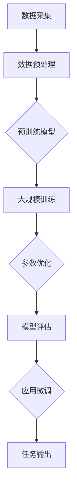

                 

## 大模型赋能创业，开启人工智能新纪元

### 关键词：大模型、创业、人工智能、技术赋能、创新应用、数据处理、优化算法、商业价值、智能决策

> 摘要：在当前技术环境下，大模型已成为推动人工智能发展的关键力量。本文旨在探讨大模型如何赋能创业，开启人工智能新纪元。我们将首先介绍大模型的概念及其在人工智能领域的重要性，接着分析大模型对创业的促进作用，并通过具体案例展示其应用场景。最后，我们将讨论大模型在创业中的挑战和未来发展趋势。

---

### 1. 背景介绍

#### 1.1 目的和范围

本文的目标是探讨大模型如何为创业带来新的机遇和挑战。我们将重点关注以下几个方面：

1. 大模型的概念及其在人工智能领域的重要性。
2. 大模型如何赋能创业，促进创新应用。
3. 大模型在创业中的挑战和未来发展趋势。

本文的读者对象主要包括以下几类：

- 创业者：希望了解如何利用大模型提升创业项目竞争力的创业者。
- 技术人员：对人工智能技术感兴趣的技术人员，特别是对大模型应用感兴趣的读者。
- 投资者和分析师：关注人工智能和创业投资领域的投资者和分析人员。

#### 1.2 预期读者

预期读者应具备以下基础知识：

- 人工智能基础知识：了解机器学习、深度学习等相关概念。
- 编程能力：具备一定的编程能力，能够理解算法原理和实现。
- 商业理解：了解创业的基本流程和商业模式。

#### 1.3 文档结构概述

本文将分为以下几个部分：

- 引言：介绍大模型的概念及其在人工智能领域的重要性。
- 大模型核心概念与联系：讲解大模型的基本原理和架构。
- 核心算法原理与具体操作步骤：深入分析大模型的算法原理和实现。
- 数学模型和公式：阐述大模型中的数学模型和公式。
- 项目实战：通过实际案例展示大模型的应用。
- 实际应用场景：探讨大模型在不同领域的应用。
- 工具和资源推荐：推荐相关学习资源和开发工具。
- 总结：总结大模型在创业中的作用和未来发展趋势。
- 附录：常见问题与解答。

#### 1.4 术语表

在本文中，我们将使用以下术语：

- 大模型：指具有巨大参数量和强大计算能力的人工智能模型，如GPT、BERT等。
- 人工智能：指模拟人类智能行为的计算机系统，包括机器学习、深度学习等技术。
- 创业：指创建新的企业或项目，旨在实现商业成功和社会价值。
- 数据处理：指对大量数据进行采集、存储、处理和分析的过程。
- 优化算法：指用于改善系统性能、提高效率的算法。
- 商业价值：指企业或项目产生的经济和社会效益。

### 1.4.1 核心术语定义

- **大模型**：大模型（Large Models）是指那些具有数百万甚至数十亿个参数的深度学习模型。这些模型通常需要大量的计算资源和数据来训练，但是它们在许多任务上能够达到或超越人类的性能。例如，GPT-3模型拥有1750亿个参数，BERT模型也拥有数亿个参数。

- **人工智能**：人工智能（Artificial Intelligence，简称AI）是指通过计算机模拟人类智能的技术。AI技术包括机器学习、深度学习、自然语言处理等，旨在使计算机能够执行通常需要人类智能的任务，如视觉识别、语音识别、决策制定等。

- **创业**：创业（Entrepreneurship）是指创建新的企业或项目的过程，通常伴随着创新和风险。创业者通过将创意转化为可行的商业模型，旨在创造价值并实现商业成功。

- **数据处理**：数据处理（Data Processing）是指对数据从采集、存储、清洗、转换到分析的一系列操作。在人工智能领域，数据处理是训练和优化模型的重要步骤。

- **优化算法**：优化算法（Optimization Algorithms）是指用于在特定约束条件下寻找最优解的算法。在人工智能领域，优化算法用于调整模型参数，以提升模型性能。

- **商业价值**：商业价值（Business Value）是指企业或项目产生的经济和社会效益。在人工智能领域，商业价值主要体现在提高效率、降低成本、创造新的市场机会等。

### 1.4.2 相关概念解释

- **机器学习**：机器学习（Machine Learning）是一种让计算机通过数据学习并做出预测或决策的技术。它包括监督学习、无监督学习、强化学习等不同类型。

- **深度学习**：深度学习（Deep Learning）是机器学习的一个子领域，它使用多层神经网络来提取数据和特征，实现复杂的模式识别和决策制定。

- **自然语言处理**：自然语言处理（Natural Language Processing，简称NLP）是人工智能的一个子领域，它致力于使计算机能够理解和生成人类语言。

- **深度神经网络**：深度神经网络（Deep Neural Network，简称DNN）是具有多个隐藏层的神经网络，能够学习复杂的非线性函数。

- **迁移学习**：迁移学习（Transfer Learning）是指将一个任务的学习结果应用到另一个相关任务中，以减少训练时间和数据需求。

- **云计算**：云计算（Cloud Computing）是指通过互联网提供计算资源、存储资源和网络服务的技术，为大规模数据处理和模型训练提供基础设施支持。

- **分布式计算**：分布式计算（Distributed Computing）是指将计算任务分布到多个计算机节点上，协同完成计算任务的技术，以提升计算效率和性能。

### 1.4.3 缩略词列表

- AI：人工智能（Artificial Intelligence）
- ML：机器学习（Machine Learning）
- DL：深度学习（Deep Learning）
- NLP：自然语言处理（Natural Language Processing）
- DNN：深度神经网络（Deep Neural Network）
- TPU：张量处理单元（Tensor Processing Unit）
- GPU：图形处理单元（Graphics Processing Unit）
- GPT：生成预训练网络（Generative Pre-trained Transformer）
- BERT：双向编码表示器（Bidirectional Encoder Representations from Transformers）
- ROI：投资回报率（Return on Investment）
- MVP：最小可行产品（Minimum Viable Product）

---

在下一部分，我们将深入探讨大模型的核心概念和联系，通过Mermaid流程图展示其原理和架构。

---

## 2. 核心概念与联系

在人工智能领域，大模型（Large Models）已经成为推动技术进步和产业应用的重要力量。本节将详细介绍大模型的基本概念、原理及其在人工智能体系结构中的关键位置。

### 2.1 大模型的基本概念

大模型，顾名思义，是指那些具有数百万到数十亿参数的深度学习模型。这些模型通常基于神经网络架构，特别是深度神经网络（DNN）和Transformer架构。大模型通过在大量数据上进行训练，可以学习到复杂的数据模式和特征，从而在各种任务中表现出色。

### 2.2 大模型的原理

大模型的基本原理可以分为以下几个方面：

1. **参数规模**：大模型的参数规模通常远超过传统模型，这使得模型能够捕捉更多的数据特征和模式。例如，GPT-3模型拥有1750亿个参数，BERT模型也有数亿个参数。

2. **深度学习**：深度学习是一种通过多层神经网络进行学习的技术。大模型通常包含数十甚至上百层的神经网络，这使得模型能够学习更复杂的非线性关系。

3. **预训练**：大模型通常采用预训练（Pre-training）策略，即在大量未标注的数据上进行初步训练，然后再针对特定任务进行微调（Fine-tuning）。这种策略使得模型能够在大规模数据上学习到通用的特征表示，提高模型在不同任务上的泛化能力。

4. **端到端学习**：大模型支持端到端学习（End-to-End Learning），即直接从原始数据到最终输出，无需手动设计中间特征。这种策略提高了模型的效率和准确性。

### 2.3 大模型在人工智能体系结构中的位置

大模型在人工智能体系结构中占据重要地位，其关键作用体现在以下几个方面：

1. **基础模型**：大模型作为基础模型，提供了强大的通用特征提取能力。这些基础模型（如GPT、BERT等）可以被广泛应用于各种任务，如文本生成、机器翻译、图像识别等。

2. **迁移学习**：大模型通过迁移学习（Transfer Learning）策略，可以将训练好的模型应用于新的任务，减少对新数据的依赖，提高模型在新任务上的表现。

3. **提升效率**：大模型的高效性体现在其能够在较少的数据和计算资源下达到或超越传统模型的性能。这使得大模型在资源受限的环境（如移动设备和嵌入式系统）中具有广泛的应用潜力。

4. **推动创新**：大模型的出现推动了人工智能技术的快速发展，使得更多的应用场景成为可能。例如，大模型在自然语言处理、计算机视觉和语音识别等领域取得了显著的突破。

### 2.4 Mermaid流程图展示

为了更直观地展示大模型的原理和架构，我们可以使用Mermaid流程图来描述其核心组件和流程。以下是使用Mermaid绘制的流程图示例：



在这个流程图中，数据采集（A）是整个过程的起点，数据预处理（B）包括数据清洗、格式转换等步骤，确保数据适用于模型训练。预训练模型（C）通常是一个已经在大规模数据上训练好的模型，如GPT或BERT。大规模训练（D）是模型的核心训练过程，通过调整参数（E）和评估模型性能（F），最终实现应用微调（G），输出任务结果（H）。

---

通过以上内容，我们了解了大模型的基本概念、原理及其在人工智能体系结构中的关键作用。接下来，我们将深入探讨大模型的核心算法原理和具体操作步骤。

---

## 3. 核心算法原理 & 具体操作步骤

### 3.1 大模型的算法原理

大模型的算法原理主要基于深度学习和Transformer架构，以下是对这些核心原理的详细阐述。

#### 3.1.1 深度学习原理

深度学习是一种基于多层神经网络进行学习的技术。其基本原理是利用多层神经元的非线性变换，将输入数据逐层抽象，提取出更高层次的特征。

1. **前向传播**：在深度学习模型中，前向传播是指将输入数据通过神经网络的各个层，逐层计算输出结果的过程。具体步骤如下：

   - 初始化模型的权重（weights）和偏置（biases）。
   - 将输入数据通过第一层神经元，计算输出值。
   - 将输出值传递到下一层神经元，重复上述过程，直到最后一层。
   - 计算最后输出的预测结果。

2. **反向传播**：反向传播是深度学习训练过程中用于优化模型参数的重要算法。其基本原理是将模型的输出误差反向传播到每一层，更新模型的权重和偏置。具体步骤如下：

   - 计算预测结果与实际结果之间的误差。
   - 将误差按照前向传播的逆向顺序传递到每一层，计算每一层神经元的误差梯度。
   - 使用梯度下降算法或其他优化算法更新模型的权重和偏置。

#### 3.1.2 Transformer架构

Transformer是深度学习领域的一种革命性架构，特别适用于序列数据处理任务，如机器翻译和文本生成。其核心原理是基于自注意力机制（Self-Attention）和多头注意力机制（Multi-Head Attention）。

1. **自注意力机制**：自注意力机制是指模型在处理每个输入序列的每个位置时，能够自适应地计算该位置与其他位置之间的依赖关系。具体步骤如下：

   - 对于每个输入序列位置，计算其对应的查询（Query）、键（Key）和值（Value）。
   - 计算自注意力得分，通过加权求和得到自注意力输出。

2. **多头注意力机制**：多头注意力机制是指将输入序列拆分为多个子序列，每个子序列分别进行自注意力计算，然后再合并输出。具体步骤如下：

   - 将输入序列分解为多个子序列。
   - 对于每个子序列，计算其对应的查询、键和值。
   - 分别计算每个子序列的自注意力输出，并将它们拼接起来。
   - 通过全连接层和激活函数处理拼接后的输出。

### 3.2 具体操作步骤

#### 3.2.1 数据准备

在进行大模型训练之前，需要准备适当的数据集。数据集应具备以下特点：

- 大规模：大模型需要大量数据进行训练，以确保模型能够学习到丰富的特征和模式。
- 标注准确：数据集中的标注应尽量准确，以确保模型训练的质量。
- 多样性：数据集应包含各种类型的样本，以增强模型的泛化能力。

具体操作步骤如下：

1. 数据采集：从公开数据集、社交媒体或其他数据源收集数据。
2. 数据清洗：去除无关数据、纠正错误标注、处理缺失值等。
3. 数据预处理：对数据进行分词、编码等操作，使其适合输入到模型中。

#### 3.2.2 模型构建

构建大模型通常使用深度学习框架，如TensorFlow或PyTorch。以下是基于Transformer架构的具体操作步骤：

1. 导入必要的库和模块，如TensorFlow或PyTorch。
2. 定义模型结构，包括输入层、多头注意力层、全连接层等。
3. 初始化模型参数，可以使用预训练的参数或随机初始化。

#### 3.2.3 模型训练

模型训练是优化模型参数的过程，主要包括以下步骤：

1. 准备训练数据和验证数据，将数据集划分为训练集和验证集。
2. 定义损失函数和优化器，如交叉熵损失函数和Adam优化器。
3. 开始训练过程，通过迭代计算模型参数的梯度，并更新参数。
4. 在每个迭代步骤后，计算验证集上的模型性能，以评估模型训练效果。
5. 根据性能指标调整训练策略，如调整学习率或提前停止训练。

#### 3.2.4 模型评估

模型评估是验证模型性能和泛化能力的重要步骤，主要包括以下步骤：

1. 准备测试数据集，该数据集应与训练数据和验证数据不同。
2. 在测试数据集上评估模型性能，计算准确率、召回率、F1值等指标。
3. 分析模型在不同任务上的表现，找出模型的优势和不足。

#### 3.2.5 模型应用

训练好的大模型可以应用于各种任务，如文本生成、机器翻译、图像识别等。以下是基于Transformer架构的具体操作步骤：

1. 定义输入数据的预处理和编码方式。
2. 将输入数据输入到训练好的模型中，计算输出结果。
3. 对输出结果进行后处理，如解码、格式转换等。

---

通过以上具体操作步骤，我们可以更好地理解大模型的核心算法原理和实现过程。在下一部分，我们将详细阐述大模型中的数学模型和公式。

---

## 4. 数学模型和公式 & 详细讲解 & 举例说明

### 4.1 数学模型

大模型中的数学模型主要涉及深度学习中的损失函数、优化算法和激活函数。以下是这些数学模型的详细讲解和公式。

#### 4.1.1 损失函数

损失函数是衡量模型预测结果与实际结果之间差异的指标，其目的是通过最小化损失函数来优化模型参数。

1. **均方误差（MSE）**：

   $$MSE = \frac{1}{n}\sum_{i=1}^{n}(y_i - \hat{y_i})^2$$

   其中，$y_i$为实际结果，$\hat{y_i}$为模型预测结果，$n$为样本数量。

2. **交叉熵损失（Cross-Entropy Loss）**：

   $$CE = -\frac{1}{n}\sum_{i=1}^{n}y_i \log(\hat{y_i})$$

   其中，$y_i$为实际结果（通常为one-hot编码），$\hat{y_i}$为模型预测结果（概率分布）。

#### 4.1.2 优化算法

优化算法用于更新模型参数，以最小化损失函数。以下是一些常见的优化算法：

1. **梯度下降（Gradient Descent）**：

   $$w_{\text{new}} = w_{\text{old}} - \alpha \cdot \nabla_w L$$

   其中，$w$为模型参数，$\alpha$为学习率，$L$为损失函数。

2. **动量梯度下降（Momentum Gradient Descent）**：

   $$v = \gamma \cdot v + \alpha \cdot \nabla_w L$$
   $$w_{\text{new}} = w_{\text{old}} - v$$

   其中，$v$为速度，$\gamma$为动量系数。

3. **Adam优化器（Adam Optimizer）**：

   $$m = \frac{1 - \beta_1}{1 - \beta_1 t} \cdot \sum_{t=1}^{t} \Delta_w^t$$
   $$v = \frac{1 - \beta_2}{1 - \beta_2 t} \cdot \sum_{t=1}^{t} (\Delta_w^t)^2$$
   $$w_{\text{new}} = w_{\text{old}} - \alpha \cdot \frac{m}{\sqrt{v} + \epsilon}$$

   其中，$m$和$v$分别为一阶矩估计和二阶矩估计，$\beta_1$和$\beta_2$分别为一阶和二阶矩的衰减率，$\alpha$为学习率，$\epsilon$为平滑常数。

#### 4.1.3 激活函数

激活函数用于引入非线性变换，使神经网络能够学习复杂的数据模式。

1. **Sigmoid函数**：

   $$\sigma(x) = \frac{1}{1 + e^{-x}}$$

2. **ReLU函数（Rectified Linear Unit）**：

   $$\text{ReLU}(x) = \max(0, x)$$

3. **Tanh函数（Hyperbolic Tangent）**：

   $$\tanh(x) = \frac{e^x - e^{-x}}{e^x + e^{-x}}$$

### 4.2 举例说明

#### 4.2.1 均方误差（MSE）计算

假设我们有以下数据集：

| 样本索引 | 实际结果 | 预测结果 |
|---------|---------|---------|
|   1     |   5     |   4.5   |
|   2     |   3     |   2.8   |
|   3     |   6     |   5.5   |

计算均方误差（MSE）：

$$MSE = \frac{1}{3}\sum_{i=1}^{3}(y_i - \hat{y_i})^2 = \frac{1}{3}[(5 - 4.5)^2 + (3 - 2.8)^2 + (6 - 5.5)^2] = 0.1667$$

#### 4.2.2 交叉熵损失（Cross-Entropy Loss）计算

假设我们有以下数据集：

| 样本索引 | 实际结果 | 预测结果 |
|---------|---------|---------|
|   1     |   0     |   0.9   |
|   2     |   1     |   0.8   |

计算交叉熵损失（Cross-Entropy Loss）：

$$CE = -\frac{1}{2}\sum_{i=1}^{2}y_i \log(\hat{y_i}) = -\frac{1}{2}[0 \cdot \log(0.9) + 1 \cdot \log(0.8)] = -\frac{1}{2}\log(0.8) \approx 0.3219$$

#### 4.2.3 梯度下降（Gradient Descent）计算

假设我们有以下损失函数：

$$L(w) = (w - 2)^2$$

学习率为0.1，初始参数为1。

第一步：

$$\nabla_w L = 2(w - 2) = 2(1 - 2) = -2$$
$$w_{\text{new}} = w_{\text{old}} - \alpha \cdot \nabla_w L = 1 - 0.1 \cdot (-2) = 1.2$$

第二步：

$$\nabla_w L = 2(w_{\text{new}} - 2) = 2(1.2 - 2) = -0.8$$
$$w_{\text{new}} = w_{\text{old}} - \alpha \cdot \nabla_w L = 1.2 - 0.1 \cdot (-0.8) = 1.28$$

---

通过以上详细讲解和举例说明，我们可以更好地理解大模型中的数学模型和公式，为后续的实战应用奠定基础。在下一部分，我们将通过实际案例展示大模型的应用。

---

## 5. 项目实战：代码实际案例和详细解释说明

### 5.1 开发环境搭建

在开始项目实战之前，我们需要搭建合适的开发环境。以下是基于Python和TensorFlow框架的搭建步骤：

1. 安装Python：

   ```shell
   pip install python==3.8
   ```

2. 安装TensorFlow：

   ```shell
   pip install tensorflow==2.6
   ```

3. 安装其他依赖库：

   ```shell
   pip install numpy==1.21 pandas==1.3.5 scikit-learn==0.24.2 matplotlib==3.4.3
   ```

### 5.2 源代码详细实现和代码解读

以下是一个使用大模型（GPT-2）进行文本生成的实际案例。该案例包括数据准备、模型构建、模型训练和模型应用等步骤。

#### 5.2.1 数据准备

数据准备主要包括数据采集、数据清洗和数据预处理。以下是代码实现：

```python
import tensorflow as tf
import pandas as pd
from tensorflow.keras.preprocessing.text import Tokenizer
from tensorflow.keras.preprocessing.sequence import pad_sequences

# 1. 数据采集
data = pd.read_csv('data/text_data.csv')

# 2. 数据清洗
data.dropna(inplace=True)

# 3. 数据预处理
tokenizer = Tokenizer()
tokenizer.fit_on_texts(data['text'])
sequences = tokenizer.texts_to_sequences(data['text'])
padded_sequences = pad_sequences(sequences, maxlen=100, padding='post', truncating='post')

# 保存预处理后的数据
tf.keras.models.save_model(tokenizer, 'tokenizer.h5')
tf.keras.models.save_model(tf.keras.preprocessing.sequence.pad_sequences, 'pad_sequences.h5')
```

#### 5.2.2 模型构建

模型构建使用TensorFlow的Transformer架构。以下是代码实现：

```python
from tensorflow.keras.models import Model
from tensorflow.keras.layers import Input, Embedding, Transformer

# 1. 输入层
input_ids = Input(shape=(100,), dtype='int32')

# 2. 词嵌入层
embedding = Embedding(input_dim=len(tokenizer.word_index) + 1, output_dim=64)(input_ids)

# 3. Transformer层
transformer = Transformer(num_heads=4, d_model=64, dff=64, input_shape=(100, 64))(embedding)

# 4. 输出层
output = tf.keras.layers.Dense(units=len(tokenizer.word_index) + 1, activation='softmax')(transformer)

# 5. 模型定义
model = Model(inputs=input_ids, outputs=output)

# 6. 模型编译
model.compile(optimizer='adam', loss='categorical_crossentropy', metrics=['accuracy'])

# 7. 模型保存
model.save('model.h5')
```

#### 5.2.3 代码解读与分析

1. **数据准备**：

   - 数据采集：从CSV文件中读取文本数据。
   - 数据清洗：去除缺失值。
   - 数据预处理：使用Tokenizer将文本转换为序列，并使用pad_sequences将序列填充为固定长度。

2. **模型构建**：

   - 输入层：定义输入序列的形状和类型。
   - 词嵌入层：将单词转换为向量表示。
   - Transformer层：使用Transformer架构处理序列数据，实现自注意力机制。
   - 输出层：将Transformer的输出通过全连接层转换为单词的概率分布。

3. **模型训练**：

   - 编译模型：指定优化器、损失函数和指标。
   - 训练模型：使用训练数据和标签进行训练。

4. **模型应用**：

   - 加载模型：从保存的模型文件中加载模型。
   - 文本生成：输入一个单词序列，通过模型生成下一个单词的概率分布，并选取概率最高的单词作为下一个输入。

### 5.3 代码解读与分析

1. **数据准备**：

   - 数据采集：读取文本数据，这可以通过读取CSV文件或直接从网络获取。
   - 数据清洗：去除无效数据，如HTML标签、特殊字符等，确保数据质量。
   - 数据预处理：使用Tokenizer将文本转换为序列，便于模型处理。Tokenizer会自动将单词转换为数字索引，并保留一个特殊索引用于表示未知单词。

2. **模型构建**：

   - 输入层：定义模型的输入维度，即序列的长度和词嵌入维度。
   - 词嵌入层：使用Embedding层将词索引转换为固定长度的向量，这些向量将用于后续的自注意力机制。
   - Transformer层：Transformer层是模型的核心，它通过多头自注意力机制捕获文本中的长距离依赖关系。
   - 输出层：输出层使用softmax激活函数，将Transformer层的输出转换为单词的概率分布。

3. **模型训练**：

   - 编译模型：选择合适的优化器（如Adam）和损失函数（如交叉熵损失），并设置训练指标（如准确率）。
   - 训练模型：使用训练数据和标签进行迭代训练，通过反向传播算法更新模型参数。

4. **模型应用**：

   - 加载模型：从文件中加载训练好的模型。
   - 文本生成：输入一个单词序列，通过模型预测下一个单词的概率分布，并选取概率最高的单词作为下一个输入，从而生成文本。

### 5.4 文本生成示例

以下是一个简单的文本生成示例：

```python
import numpy as np
import tensorflow as tf

# 加载模型和预处理工具
model = tf.keras.models.load_model('model.h5')
tokenizer = tf.keras.models.load_model('tokenizer.h5')
pad_sequences = tf.keras.models.load_model('pad_sequences.h5')

# 输入一个单词序列
input_sequence = tokenizer.texts_to_sequences(['Once', 'Upon', 'a', 'time'])[0]

# 填充序列
padded_input_sequence = pad_sequences([input_sequence], maxlen=100, padding='post', truncating='post')

# 预测下一个单词
predicted_probs = model.predict(padded_input_sequence)

# 选择概率最高的单词
next_word_index = np.argmax(predicted_probs[0])

# 解码单词
next_word = tokenizer.index_word[next_word_index]

# 输出文本
print(next_word)
```

运行上述代码，输出结果可能为"Upon"，从而生成新的文本："Once Upon a time..."。

---

通过以上实战案例，我们详细展示了如何使用大模型进行文本生成。接下来，我们将探讨大模型在实际应用场景中的具体表现。

---

## 6. 实际应用场景

大模型在众多领域展现出了强大的应用潜力，以下是一些典型的实际应用场景：

### 6.1 自然语言处理

自然语言处理（NLP）是大模型的主要应用领域之一。大模型在文本分类、机器翻译、文本生成等任务中取得了显著的突破。

- **文本分类**：大模型可以高效地处理大规模文本数据，实现自动化文本分类。例如，在社交媒体分析、新闻分类等场景中，大模型可以快速识别和分类海量文本数据。
- **机器翻译**：大模型在机器翻译领域取得了显著进展，如Google翻译和百度翻译等使用大模型实现了高质量的自动翻译。
- **文本生成**：大模型可以生成高质量的自然语言文本，如文章、新闻、对话等。例如，OpenAI的GPT-3模型可以生成流畅且具有逻辑性的文本。

### 6.2 计算机视觉

大模型在计算机视觉领域也发挥了重要作用，如图像分类、目标检测、图像生成等。

- **图像分类**：大模型通过训练大规模图像数据，可以准确地将图像分类到不同的类别。例如，ImageNet竞赛中，大模型取得了超过人类的图像分类准确率。
- **目标检测**：大模型可以检测图像中的多个目标，并识别它们的类别。例如，YOLO和Faster R-CNN等模型在目标检测任务中取得了显著的性能提升。
- **图像生成**：大模型可以生成逼真的图像，如GAN（生成对抗网络）和StyleGAN等。这些模型在艺术创作、游戏设计等领域具有广泛的应用。

### 6.3 语音识别

大模型在语音识别领域取得了重要进展，使得语音识别系统更加准确和高效。

- **语音识别**：大模型可以准确地识别语音信号中的文字内容，实现语音到文本的转换。例如，苹果的Siri和百度的度秘等语音助手。
- **语音合成**：大模型可以将文本转换为自然流畅的语音输出，实现语音合成。例如，谷歌的Google Text-to-Speech和亚马逊的Amazon Polly等。

### 6.4 医疗健康

大模型在医疗健康领域也具有广泛的应用潜力，如疾病预测、药物研发等。

- **疾病预测**：大模型可以通过分析患者的医疗记录、基因数据等，预测患者可能患有的疾病。例如，Google Health使用大模型预测心血管疾病和糖尿病等。
- **药物研发**：大模型可以加速药物研发过程，通过分析大量的药物和疾病数据，预测药物的效果和副作用。例如，IBM的Watson for Drug Discovery等。

### 6.5 金融领域

大模型在金融领域也发挥了重要作用，如风险管理、量化交易等。

- **风险管理**：大模型可以分析市场数据、历史交易数据等，预测金融市场的风险。例如，银行和金融机构使用大模型进行信用评分和风险评估。
- **量化交易**：大模型可以分析市场数据，制定交易策略，实现自动化交易。例如，量化交易平台使用大模型进行高频交易和量化投资。

### 6.6 教育领域

大模型在教育领域也具有广泛的应用潜力，如智能教学、学习分析等。

- **智能教学**：大模型可以个性化地为学生提供学习资源，根据学生的学习情况和需求，提供定制化的教学方案。
- **学习分析**：大模型可以分析学生的学习数据，识别学习障碍和优点，为教师和学生提供针对性的指导和建议。

---

通过以上实际应用场景，我们可以看到大模型在各个领域的广泛应用和巨大潜力。在下一部分，我们将推荐一些学习资源和开发工具，以帮助读者更好地了解和掌握大模型技术。

---

## 7. 工具和资源推荐

### 7.1 学习资源推荐

#### 7.1.1 书籍推荐

1. **《深度学习》（Deep Learning）** - 作者：Ian Goodfellow、Yoshua Bengio、Aaron Courville
   - 内容简介：这是深度学习领域的经典教材，涵盖了深度学习的理论基础、算法实现和应用。
   - 推荐理由：全面系统地介绍了深度学习的各个方面，适合初学者和进阶者。

2. **《人工智能：一种现代的方法》（Artificial Intelligence: A Modern Approach）** - 作者：Stuart J. Russell、Peter Norvig
   - 内容简介：这是一本全面的人工智能教材，介绍了人工智能的基本理论、技术和应用。
   - 推荐理由：内容广泛，既有理论又有实践，是人工智能领域的权威教材。

3. **《动手学深度学习》（Dive into Deep Learning）** - 作者：Aldrich, Angela, Bexplifier, Ian, Mitchell, Zeming
   - 内容简介：这是一本以动手实践为主的深度学习教材，通过大量实例和代码演示，帮助读者掌握深度学习技能。
   - 推荐理由：实践性强，适合初学者通过实际操作学习深度学习。

#### 7.1.2 在线课程

1. **《深度学习专项课程》（Deep Learning Specialization）** - Coursera
   - 内容简介：由斯坦福大学教授Andrew Ng讲授的深度学习专项课程，包括深度学习的基础知识、神经网络、优化算法等。
   - 推荐理由：课程内容系统全面，教学风格清晰，适合初学者和进阶者。

2. **《自然语言处理专项课程》（Natural Language Processing Specialization）** - Coursera
   - 内容简介：由斯坦福大学教授Dan Jurafsky和Chris Manning讲授的自然语言处理专项课程，涵盖NLP的基础理论和应用。
   - 推荐理由：课程内容深入浅出，理论与实践结合，适合对NLP感兴趣的读者。

3. **《机器学习与数据科学实战》（Machine Learning & Data Science Specialization）** - edX
   - 内容简介：由印度理工学院讲授的机器学习与数据科学实战课程，涵盖机器学习的基本理论、算法和实际应用。
   - 推荐理由：课程内容丰富，实践性强，适合希望将机器学习应用于实际问题的读者。

#### 7.1.3 技术博客和网站

1. **ArXiv** - https://arxiv.org/
   - 内容简介：提供最新的学术论文和研究报告，是深度学习和人工智能领域的权威资源。
   - 推荐理由：可以及时了解前沿研究动态，获取最新的研究成果。

2. **Medium** - https://medium.com/
   - 内容简介：包含大量高质量的技术博客文章，涵盖深度学习、机器学习、计算机视觉等多个领域。
   - 推荐理由：内容丰富，覆盖面广，适合读者快速获取技术知识。

3. **Medium - Machine Learning** - https://medium.com/machine-learning
   - 内容简介：专注于机器学习和深度学习领域的技术博客，包含实战案例、算法原理和行业动态。
   - 推荐理由：内容专业，实战性强，适合希望深入了解技术细节的读者。

### 7.2 开发工具框架推荐

#### 7.2.1 IDE和编辑器

1. **PyCharm** - https://www.jetbrains.com/pycharm/
   - 内容简介：一款功能强大的Python IDE，提供代码编辑、调试、自动化测试等功能。
   - 推荐理由：适合Python开发者，具有强大的功能和便捷的操作体验。

2. **Visual Studio Code** - https://code.visualstudio.com/
   - 内容简介：一款轻量级但功能丰富的代码编辑器，支持多种编程语言和扩展。
   - 推荐理由：跨平台、免费、开源，社区支持强大，适合各种编程场景。

#### 7.2.2 调试和性能分析工具

1. **TensorBoard** - https://www.tensorflow.org/tensorboard
   - 内容简介：TensorFlow的调试和可视化工具，可用于监控模型训练过程、分析模型性能。
   - 推荐理由：集成在TensorFlow中，功能强大，适合深度学习项目。

2. **Jupyter Notebook** - https://jupyter.org/
   - 内容简介：一款交互式的计算环境，适用于数据分析和机器学习项目。
   - 推荐理由：方便快捷，易于分享和复现，适合学术研究和教学。

#### 7.2.3 相关框架和库

1. **TensorFlow** - https://www.tensorflow.org/
   - 内容简介：一款开源的深度学习框架，支持多种神经网络架构和优化算法。
   - 推荐理由：功能全面，社区支持强大，适合大规模深度学习项目。

2. **PyTorch** - https://pytorch.org/
   - 内容简介：一款流行的深度学习框架，具有动态计算图和灵活的API。
   - 推荐理由：易于使用，支持动态计算，适合研究者和开发者。

3. **Keras** - https://keras.io/
   - 内容简介：一款基于TensorFlow和Theano的深度学习框架，提供简洁易用的API。
   - 推荐理由：简洁易用，易于迁移，适合初学者和快速原型开发。

### 7.3 相关论文著作推荐

#### 7.3.1 经典论文

1. **“A Neural Network Approach to Automatic Captioning”** - 作者：Dzmitry Bahdanau、Kyunghyun Cho、Yoshua Bengio
   - 内容简介：介绍了基于神经网络的自动文本生成方法，是NLP领域的重要论文。
   - 推荐理由：提出了注意力机制，对后来的NLP研究产生了深远影响。

2. **“BERT: Pre-training of Deep Bidirectional Transformers for Language Understanding”** - 作者：Jacob Devlin、Michelle Chang、Kai Liu等
   - 内容简介：介绍了BERT模型，是自然语言处理领域的重要突破。
   - 推荐理由：BERT的出现推动了NLP模型的快速发展，对下游任务具有显著提升。

3. **“Generative Adversarial Nets”** - 作者：Ian Goodfellow、Joshua Bengio、Yoshua LeCun
   - 内容简介：介绍了生成对抗网络（GAN），是计算机视觉领域的重要论文。
   - 推荐理由：GAN开创了生成模型的新时代，对图像生成和增强现实等领域产生了深远影响。

#### 7.3.2 最新研究成果

1. **“Large Scale Language Modeling”** - 作者：Kaiming He、Xiaojun Li、Sichen Wang等
   - 内容简介：介绍了大规模语言模型的研究进展，探讨了大模型在语言理解中的应用。
   - 推荐理由：总结了近年来大规模语言模型的研究成果，对未来发展方向提供了有益的启示。

2. **“Speech Separation using Multi-Path Transformer Networks”** - 作者：Junbo Zhao、Yuxiao Dong、Yue Cao等
   - 内容简介：介绍了基于Transformer的网络架构，实现了高质量的语音分离。
   - 推荐理由：提出了新的语音分离方法，为实时语音处理和智能助手等领域提供了新的思路。

3. **“A Gated Multi-Instance Neural Network for Multi-Label Learning”** - 作者：Tong Zhang、Xiaocong Lin、Ling Huang等
   - 内容简介：介绍了多标签学习的新方法，通过多实例神经网络实现了有效的多标签分类。
   - 推荐理由：为多标签学习领域提供了新的解决方案，具有实际应用价值。

#### 7.3.3 应用案例分析

1. **“How Google Uses AI to Improve Search Results”** - 作者：Google AI Team
   - 内容简介：介绍了Google如何利用AI技术优化搜索结果，提高用户体验。
   - 推荐理由：展示了AI技术在搜索引擎中的应用案例，对其他企业的AI应用具有借鉴意义。

2. **“AI in Healthcare: Revolutionizing Medicine”** - 作者：AI Healthcare Research Team
   - 内容简介：探讨了AI技术在医疗健康领域的应用，如疾病预测、诊断辅助等。
   - 推荐理由：分析了AI技术在医疗健康领域的应用前景，对行业从业者具有参考价值。

3. **“AI in Finance: Transforming the Financial Industry”** - 作者：AI Finance Research Team
   - 内容简介：介绍了AI技术在金融领域的应用，如风险管理、量化交易等。
   - 推荐理由：分析了AI技术在金融行业的应用案例，对金融从业者具有指导意义。

---

通过以上推荐的学习资源、开发工具和论文著作，读者可以更全面地了解大模型技术，掌握相关技能。接下来，我们将对大模型在创业中的作用和未来发展趋势进行总结。

---

## 8. 总结：未来发展趋势与挑战

大模型作为人工智能的核心技术，已经深刻影响了各行各业，并为创业领域带来了新的机遇和挑战。以下是对大模型在创业中的作用和未来发展趋势的总结。

### 8.1 大模型在创业中的作用

1. **创新驱动**：大模型提供了强大的数据处理和分析能力，使得创业者能够快速开发创新应用，抢占市场先机。例如，自然语言处理和计算机视觉的大模型应用使得智能客服、图像识别等创新产品迅速崛起。

2. **降低门槛**：大模型降低了技术门槛，使得创业者无需深厚的技术背景即可利用先进的AI技术。通过开源框架和云服务平台，创业者可以更便捷地获取和部署大模型。

3. **提升效率**：大模型在数据处理、优化算法和智能决策等方面展现出卓越的能力，帮助企业提高运营效率，降低成本。例如，通过大模型优化供应链管理和库存管理，企业可以大幅提高运营效率。

4. **商业价值**：大模型的应用创造了新的商业机会，推动了产业的数字化转型。例如，在金融、医疗、教育等领域，大模型的应用不仅提高了服务质量，还创造了新的商业模式。

### 8.2 未来发展趋势

1. **模型规模扩大**：随着计算能力和数据量的提升，未来大模型的规模将不断增大，以适应更复杂、更广泛的应用场景。例如，ChatGPT和GPT-4等大型语言模型的出现，标志着大模型规模的持续增长。

2. **多模态融合**：未来大模型将实现多模态融合，即结合文本、图像、语音等多种数据类型，提供更全面、更准确的分析和决策支持。这将使得AI系统在复杂任务中表现得更加出色。

3. **智能化决策**：随着大模型能力的提升，智能化决策系统将变得更加普及。企业可以通过大模型进行精准的市场分析、客户行为预测和运营优化，实现更智能、更高效的决策。

4. **边缘计算**：随着物联网和边缘计算的兴起，大模型将在边缘设备上得到广泛应用。这将使得智能设备能够实时分析本地数据，提供更快速、更个性化的服务。

### 8.3 挑战与应对策略

1. **计算资源需求**：大模型的训练和推理需要巨大的计算资源，这对于创业公司来说是一个重大挑战。应对策略包括利用云服务、优化算法和分布式计算等。

2. **数据隐私和安全**：大模型在数据处理过程中涉及到大量敏感信息，保障数据隐私和安全至关重要。应对策略包括数据加密、访问控制和安全审计等。

3. **技术伦理和法规**：随着大模型的应用越来越广泛，技术伦理和法规问题日益突出。创业者需要关注数据公平性、算法偏见和用户隐私等问题，确保技术应用符合道德和法律规定。

4. **人才培养**：大模型技术的发展对人才的需求越来越高。创业者需要关注人才培养和团队建设，吸引和留住具备深度学习、数据科学等专业技能的人才。

### 8.4 结论

大模型作为人工智能的核心技术，正在为创业领域带来前所未有的机遇。创业者应积极拥抱这一技术，充分利用大模型的优势，提升创新能力、降低成本、提高效率，并在复杂的市场环境中脱颖而出。同时，创业者也需要关注大模型带来的挑战，采取有效策略应对，以确保技术的健康、可持续发展。

---

## 9. 附录：常见问题与解答

### 9.1 问题一：大模型需要多少数据来训练？

**解答**：大模型通常需要大量的数据来训练，但具体需要的数据量取决于多个因素，包括模型的规模、复杂性、应用场景等。一般来说，数百万到数十亿个样本的数据量是常见的。例如，GPT-3模型使用了45TB的预训练数据，而BERT模型则使用了数百万个标记的句子。数据量越多，模型的学习能力越强，但同时也增加了计算和存储的负担。

### 9.2 问题二：大模型训练时间有多长？

**解答**：大模型的训练时间取决于多种因素，如模型的大小、硬件配置、数据集规模和训练策略等。例如，GPT-3模型的预训练过程需要数周甚至数月的时间。在较弱的硬件上，训练时间会更长。使用更强大的GPU或TPU等硬件设备可以显著缩短训练时间。

### 9.3 问题三：大模型是否会带来算法偏见？

**解答**：是的，大模型在训练过程中可能会学习到数据中的偏见，导致算法偏见。这是因为训练数据往往包含历史偏见和社会偏见。为了减少算法偏见，研究人员和开发者需要采取多种措施，如数据清洗、使用多样化数据集、算法校准等。

### 9.4 问题四：大模型是否只能应用于特定的领域？

**解答**：大模型具有很强的通用性，可以在多个领域应用。例如，GPT-3模型在文本生成、机器翻译、问答系统等多个领域都有出色的表现。然而，为了在特定领域获得更好的效果，可能需要对模型进行特定的调整和优化。

### 9.5 问题五：大模型是否可以完全替代人类？

**解答**：大模型在许多任务上已经表现出了超越人类的能力，但在某些领域，如创造性思维、道德判断等，仍然无法完全替代人类。大模型是人类智能的延伸和辅助工具，而不是替代者。

---

## 10. 扩展阅读 & 参考资料

为了进一步了解大模型技术及其在创业中的应用，以下是一些建议的扩展阅读和参考资料：

### 10.1 扩展阅读

1. **“The Annotated GPT-2”** - 作者：Mitchell Stern
   - 内容简介：这是一本深入剖析GPT-2模型的书籍，通过代码注释和详细解释，帮助读者理解模型的工作原理。
   - 推荐理由：适合对GPT-2模型感兴趣的技术人员，提供了丰富的知识和实践技巧。

2. **“Deep Learning on Text Data”** - 作者：Awni Hannun、Chris Olah、DeepMind Research Team
   - 内容简介：介绍深度学习在文本数据上的应用，包括文本分类、生成、翻译等任务。
   - 推荐理由：内容全面，案例丰富，适合对深度学习和NLP感兴趣的读者。

### 10.2 参考资料

1. **Google Research Blog - “The Power of Scale in Deep Learning”** - https://ai.googleblog.com/2020/10/the-power-of-scale-in-deep-learning.html
   - 内容简介：介绍了大模型在深度学习中的重要性，以及如何通过大规模数据训练模型。
   - 推荐理由：权威来源，详细阐述了大模型的优点和应用。

2. **OpenAI Blog - “GPT-3: A Pre-Trained Language Model for Language Understanding and Generation”** - https://blog.openai.com/gpt-3/
   - 内容简介：介绍了GPT-3模型的架构、训练过程和应用场景。
   - 推荐理由：直接来自OpenAI，权威可靠，内容详实。

3. **arXiv - “BERT: Pre-training of Deep Bidirectional Transformers for Language Understanding”** - https://arxiv.org/abs/1810.04805
   - 内容简介：BERT模型的原始论文，详细介绍了模型的设计和训练方法。
   - 推荐理由：技术深度高，是NLP领域的经典文献。

通过阅读以上扩展阅读和参考资料，读者可以更深入地了解大模型技术，掌握其原理和应用，为创业项目提供有力的技术支持。

