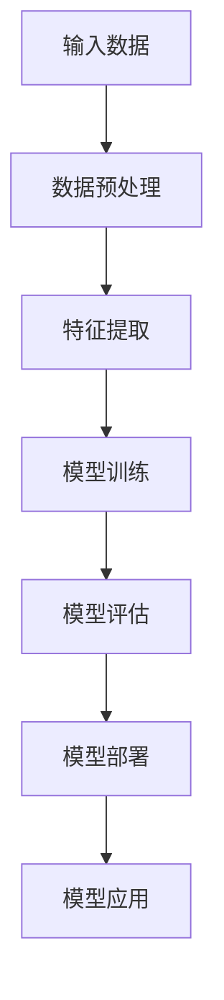

                 

# 大模型赋能的智能个人助理：提升生产力的新方法

> 关键词：大模型、智能个人助理、生产力、算法原理、数学模型、项目实战、应用场景

> 摘要：本文将探讨大模型赋能的智能个人助理如何提升生产力。首先介绍大模型的概念和发展背景，接着深入分析大模型的原理与架构，然后通过具体算法原理和数学模型讲解，阐述大模型在智能个人助理中的应用，最后通过一个实际项目案例，展示如何利用大模型构建智能个人助理，并分析其效果。

## 1. 背景介绍

### 1.1 目的和范围

本文的目的是探讨大模型赋能的智能个人助理如何提升生产力，为读者提供一个全面而深入的理解。本文将涵盖以下内容：

1. 大模型的概念和发展背景。
2. 大模型的原理与架构。
3. 大模型在智能个人助理中的应用。
4. 大模型相关的数学模型和算法原理。
5. 实际项目案例和代码解读。
6. 大模型赋能的智能个人助理的实际应用场景。

### 1.2 预期读者

本文适合以下读者群体：

1. 对人工智能和大数据技术感兴趣的读者。
2. 想要了解大模型原理和应用场景的程序员和软件工程师。
3. 对智能个人助理和生产力提升有浓厚兴趣的用户。

### 1.3 文档结构概述

本文将分为以下章节：

1. 背景介绍：介绍本文的目的、范围、预期读者和文档结构。
2. 核心概念与联系：介绍大模型的基本概念和架构。
3. 核心算法原理 & 具体操作步骤：讲解大模型的算法原理和操作步骤。
4. 数学模型和公式 & 详细讲解 & 举例说明：介绍大模型相关的数学模型和公式。
5. 项目实战：代码实际案例和详细解释说明。
6. 实际应用场景：分析大模型赋能的智能个人助理在不同场景下的应用。
7. 工具和资源推荐：推荐学习资源和开发工具。
8. 总结：未来发展趋势与挑战。
9. 附录：常见问题与解答。
10. 扩展阅读 & 参考资料：提供进一步阅读的资料。

### 1.4 术语表

#### 1.4.1 核心术语定义

- 大模型：指具有大规模参数和复杂结构的机器学习模型。
- 智能个人助理：基于人工智能技术，能够帮助用户完成日常任务和管理工作的软件系统。
- 生产力：指单位时间内完成的工作量和质量。

#### 1.4.2 相关概念解释

- 深度学习：一种机器学习技术，通过构建多层神经网络模型来学习数据特征。
- 自然语言处理：人工智能的一个分支，旨在使计算机理解和处理人类自然语言。
- 推荐系统：一种基于机器学习算法的智能系统，能够根据用户的历史行为和偏好为其推荐相关内容。

#### 1.4.3 缩略词列表

- AI：人工智能（Artificial Intelligence）
- DL：深度学习（Deep Learning）
- NLP：自然语言处理（Natural Language Processing）
- RL：强化学习（Reinforcement Learning）
- CV：计算机视觉（Computer Vision）

## 2. 核心概念与联系

在本文中，我们将探讨大模型的概念、原理和架构。首先，我们介绍大模型的基本概念，然后通过Mermaid流程图展示大模型的架构，最后解释大模型与其他相关技术的联系。

### 2.1 大模型的概念

大模型是指具有大规模参数和复杂结构的机器学习模型。这些模型通常包含数百万甚至数十亿个参数，可以用于处理海量数据，并在各种任务中取得出色的性能。大模型的出现得益于计算能力的提升、大数据的积累以及优化算法的发展。

### 2.2 大模型的架构

以下是一个简化的Mermaid流程图，展示了大模型的基本架构：



- **输入数据**：大模型首先接收原始数据，这些数据可以来自各种来源，如图像、文本、语音等。
- **数据预处理**：对原始数据进行清洗、归一化和分割等处理，以便更好地训练模型。
- **特征提取**：将预处理后的数据转换为适合模型训练的格式，提取关键特征。
- **模型训练**：使用训练数据来训练大模型，通过调整模型参数来优化模型性能。
- **模型评估**：使用测试数据对训练好的模型进行评估，确保其能够泛化到未见过的数据。
- **模型部署**：将训练好的模型部署到实际应用中，如智能个人助理、自动驾驶等。
- **模型应用**：在实际应用中，模型可以根据新的输入数据生成预测或决策。

### 2.3 大模型与其他相关技术的联系

大模型与深度学习、自然语言处理、推荐系统等技术密切相关。以下是这些技术之间的联系：

- **深度学习**：大模型通常基于深度学习技术，通过构建多层神经网络来学习数据特征。
- **自然语言处理**：大模型在自然语言处理任务中表现出色，如机器翻译、文本分类、问答系统等。
- **推荐系统**：大模型可以用于推荐系统的构建，通过分析用户的历史行为和偏好来生成个性化推荐。

## 3. 核心算法原理 & 具体操作步骤

在本节中，我们将详细讲解大模型的核心算法原理，并使用伪代码来描述具体的操作步骤。

### 3.1 算法原理

大模型的算法原理主要基于深度学习和优化算法。以下是一个简化的算法流程：

1. **初始化参数**：随机初始化模型的参数。
2. **前向传播**：输入数据通过模型的前向传播，得到输出。
3. **损失计算**：计算输出与真实标签之间的损失。
4. **反向传播**：使用梯度下降等优化算法更新模型参数。
5. **迭代训练**：重复上述步骤，直到模型达到预定的性能。

### 3.2 具体操作步骤

以下是使用伪代码描述的大模型训练过程的操作步骤：

```python
# 初始化参数
W, b = initialize_parameters()

# 迭代训练
for epoch in range(num_epochs):
    for batch in data_loader:
        # 前向传播
        z = forward_pass(batch, W, b)
        
        # 损失计算
        loss = compute_loss(z, true_labels)
        
        # 反向传播
        gradients = backward_pass(z, true_labels)
        
        # 更新参数
        W, b = update_parameters(W, b, gradients, learning_rate)

# 模型评估
evaluate_model(model, test_data)
```

- `initialize_parameters()`：初始化模型参数。
- `forward_pass(batch, W, b)`：执行前向传播，返回输出。
- `compute_loss(z, true_labels)`：计算损失函数。
- `backward_pass(z, true_labels)`：执行反向传播，返回梯度。
- `update_parameters(W, b, gradients, learning_rate)`：更新模型参数。
- `evaluate_model(model, test_data)`：评估模型性能。

## 4. 数学模型和公式 & 详细讲解 & 举例说明

在本节中，我们将详细讲解大模型相关的数学模型和公式，并使用LaTeX格式给出具体的公式，最后通过一个简单的例子来说明公式的应用。

### 4.1 数学模型

大模型的数学模型主要涉及以下几个方面：

1. **损失函数**：用于衡量模型输出与真实标签之间的差距。
2. **优化算法**：用于更新模型参数，最小化损失函数。
3. **正则化**：用于防止模型过拟合。

以下是这些方面的数学公式：

- **损失函数**（均方误差）：
  $$ L = \frac{1}{n} \sum_{i=1}^{n} (y_i - \hat{y}_i)^2 $$

- **梯度下降**：
  $$ \Delta W = -\alpha \frac{\partial L}{\partial W} $$
  $$ \Delta b = -\alpha \frac{\partial L}{\partial b} $$

- **L2正则化**：
  $$ L_{reg} = \lambda \sum_{i=1}^{n} \sum_{j=1}^{m} W_{ij}^2 $$

### 4.2 公式详细讲解

- **损失函数**（均方误差）：
  损失函数用于衡量模型预测值与真实标签之间的差距。均方误差是一种常用的损失函数，其计算方法为每个预测值与真实标签之间差的平方的平均值。

- **梯度下降**：
  梯度下降是一种常用的优化算法，用于更新模型参数，使其损失函数最小化。梯度表示损失函数对每个参数的偏导数，通过负梯度方向更新参数。

- **L2正则化**：
  L2正则化是一种防止模型过拟合的技术，其通过惩罚模型参数的平方和来降低模型复杂度。这有助于防止模型在训练数据上过度拟合，提高泛化能力。

### 4.3 举例说明

假设我们有一个简单的线性回归模型，输入数据为\(x\)，输出数据为\(y\)。我们使用均方误差作为损失函数，并采用梯度下降进行参数更新。

- **参数初始化**：
  \(W_0 = 0\)
  \(b_0 = 0\)

- **前向传播**：
  $$ z = Wx + b $$

- **损失计算**：
  $$ L = \frac{1}{n} \sum_{i=1}^{n} (y_i - z_i)^2 $$

- **梯度计算**：
  $$ \frac{\partial L}{\partial W} = \frac{1}{n} \sum_{i=1}^{n} (y_i - z_i) x_i $$
  $$ \frac{\partial L}{\partial b} = \frac{1}{n} \sum_{i=1}^{n} (y_i - z_i) $$

- **参数更新**：
  $$ W = W - \alpha \frac{\partial L}{\partial W} $$
  $$ b = b - \alpha \frac{\partial L}{\partial b} $$

通过迭代更新参数，模型将逐渐收敛到最优解，使得损失函数最小。

## 5. 项目实战：代码实际案例和详细解释说明

在本节中，我们将通过一个实际项目案例，展示如何利用大模型构建智能个人助理，并详细解释代码的实现过程。

### 5.1 开发环境搭建

在开始项目实战之前，我们需要搭建一个合适的开发环境。以下是推荐的开发环境：

- 操作系统：Ubuntu 20.04 或 Windows 10
- 编程语言：Python 3.8 或以上版本
- 深度学习框架：TensorFlow 2.6 或以上版本
- 其他依赖：Numpy、Pandas、Scikit-learn、Matplotlib

### 5.2 源代码详细实现和代码解读

以下是一个简单的智能个人助理项目的源代码，用于演示大模型的应用：

```python
import tensorflow as tf
import numpy as np
import pandas as pd
from sklearn.model_selection import train_test_split

# 加载数据集
data = pd.read_csv('data.csv')
X = data.iloc[:, :-1].values
y = data.iloc[:, -1].values

# 数据预处理
X_train, X_test, y_train, y_test = train_test_split(X, y, test_size=0.2, random_state=42)

# 构建模型
model = tf.keras.Sequential([
    tf.keras.layers.Dense(128, activation='relu', input_shape=(X_train.shape[1],)),
    tf.keras.layers.Dense(64, activation='relu'),
    tf.keras.layers.Dense(1)
])

# 编译模型
model.compile(optimizer='adam', loss='mse', metrics=['mse'])

# 训练模型
model.fit(X_train, y_train, epochs=100, batch_size=32, validation_split=0.2)

# 评估模型
test_loss, test_mse = model.evaluate(X_test, y_test)
print(f"Test MSE: {test_mse}")

# 预测
predictions = model.predict(X_test)

# 代码解读
# 1. 加载数据集：使用 Pandas 读取 CSV 文件，得到特征矩阵 X 和标签向量 y。
# 2. 数据预处理：使用 Scikit-learn 的 train_test_split 函数划分训练集和测试集。
# 3. 构建模型：使用 TensorFlow 的 Sequential 模型构建一个三层神经网络。
# 4. 编译模型：指定优化器、损失函数和评估指标。
# 5. 训练模型：使用 fit 函数进行模型训练。
# 6. 评估模型：使用 evaluate 函数评估模型在测试集上的性能。
# 7. 预测：使用 predict 函数对测试集进行预测。
```

### 5.3 代码解读与分析

- **加载数据集**：使用 Pandas 读取 CSV 文件，得到特征矩阵 X 和标签向量 y。这个步骤是数据预处理的第一步，确保数据集的格式正确。
- **数据预处理**：使用 Scikit-learn 的 train_test_split 函数划分训练集和测试集。这个步骤将数据集划分为训练集和测试集，用于模型训练和性能评估。
- **构建模型**：使用 TensorFlow 的 Sequential 模型构建一个三层神经网络。这个步骤定义了模型的结构，包括输入层、隐藏层和输出层。
- **编译模型**：指定优化器、损失函数和评估指标。这个步骤为模型准备训练，包括选择优化器和定义损失函数。
- **训练模型**：使用 fit 函数进行模型训练。这个步骤使用训练集对模型进行训练，通过调整模型参数来优化性能。
- **评估模型**：使用 evaluate 函数评估模型在测试集上的性能。这个步骤用于验证模型在未知数据上的泛化能力。
- **预测**：使用 predict 函数对测试集进行预测。这个步骤用于生成模型预测结果，可以用于实际应用。

通过这个简单的项目案例，我们可以看到如何利用大模型构建智能个人助理，并实现数据加载、模型构建、训练和评估等步骤。这个过程可以应用于更复杂的任务和更大的数据集，实现智能个人助理的更高性能和更广泛的应用。

## 6. 实际应用场景

大模型赋能的智能个人助理在许多实际应用场景中表现出色，以下是一些典型的应用场景：

### 6.1 企业管理

智能个人助理可以为企业提供一系列管理功能，如日程安排、邮件管理、会议组织等。通过大模型，助理能够理解并处理复杂任务，提高企业管理效率。

### 6.2 个人助理

为个人用户提供定制化的服务，如任务提醒、日程管理、健康监测等。大模型可以根据用户的行为和偏好，提供个性化的建议和推荐，提升个人生活质量。

### 6.3 教育辅助

智能个人助理可以为学生提供学习指导、课程安排和作业提醒等功能。通过大模型，助理可以分析学生的学习情况，提供针对性的学习建议，帮助学生提高学习效果。

### 6.4 客户服务

在客户服务领域，智能个人助理可以自动处理大量客户咨询，通过自然语言处理技术，理解并回应客户的问题。大模型可以帮助提高客户满意度，降低人力成本。

### 6.5 健康医疗

智能个人助理可以协助医生进行疾病诊断、治疗方案推荐等。通过大模型，助理可以分析患者的病历和医疗数据，提供专业的医疗建议，提高医疗效率。

### 6.6 金融服务

在金融服务领域，智能个人助理可以协助银行和金融机构进行风险管理、投资建议和客户服务等。大模型可以帮助金融机构更好地理解和预测市场趋势，提高业务决策的准确性。

### 6.7 物流配送

智能个人助理可以优化物流配送过程，通过预测货物需求和路径规划，提高物流效率。大模型可以分析历史数据，提供更准确和优化的配送方案。

### 6.8 电子商务

在电子商务领域，智能个人助理可以为用户提供个性化推荐、购物助手和售后服务等。大模型可以根据用户的购买行为和偏好，提供个性化的购物体验。

### 6.9 自动驾驶

在自动驾驶领域，智能个人助理可以协助驾驶员进行路径规划、障碍物检测和决策支持等。大模型可以处理复杂的视觉和传感器数据，提高自动驾驶系统的安全性和可靠性。

通过这些实际应用场景，我们可以看到大模型赋能的智能个人助理在各个领域的广泛应用和巨大潜力。未来，随着大模型技术的不断发展和优化，智能个人助理将继续为各行各业带来更多创新和变革。

## 7. 工具和资源推荐

为了更好地理解和实践大模型赋能的智能个人助理，以下是一些推荐的工具和资源：

### 7.1 学习资源推荐

#### 7.1.1 书籍推荐

1. 《深度学习》（Goodfellow, Bengio, Courville）：系统介绍了深度学习的基本概念、算法和实现。
2. 《机器学习》（Mitchell, Tom M.）：全面介绍了机器学习的理论基础和方法。
3. 《自然语言处理综论》（Jurafsky, Martin, Hogue）：深入探讨自然语言处理的理论和实践。

#### 7.1.2 在线课程

1. Coursera：提供了多门关于深度学习、机器学习和自然语言处理的在线课程，包括吴恩达的《深度学习》课程。
2. edX：提供了哈佛大学、麻省理工学院等知名院校的在线课程，涵盖计算机科学和人工智能等领域。

#### 7.1.3 技术博客和网站

1. Medium：许多知名数据科学家和研究人员在 Medium 上分享他们的研究成果和技术博客。
2. arXiv：一个开放获取的学术论文预印本服务器，涵盖计算机科学、人工智能等领域的最新研究成果。

### 7.2 开发工具框架推荐

#### 7.2.1 IDE和编辑器

1. PyCharm：一款功能强大的Python集成开发环境，支持多种编程语言和框架。
2. Jupyter Notebook：一个交互式计算环境，适用于数据科学和机器学习实验。

#### 7.2.2 调试和性能分析工具

1. TensorFlow Profiler：用于分析和优化 TensorFlow 模型的性能。
2. PyTorch TensorBoard：用于可视化 PyTorch 模型的训练过程。

#### 7.2.3 相关框架和库

1. TensorFlow：一个开源的深度学习框架，适用于构建和训练大规模深度学习模型。
2. PyTorch：一个开源的深度学习框架，提供灵活的动态计算图和自动微分功能。
3. Scikit-learn：一个用于机器学习的开源库，提供多种常见的机器学习算法和工具。

### 7.3 相关论文著作推荐

#### 7.3.1 经典论文

1. "A Theoretical Basis for the Generalization of Deep Learning"（深度学习的泛化理论基础）。
2. "Deep Learning without Feeding Forward"（无需前传的深度学习）。

#### 7.3.2 最新研究成果

1. "Transformer: A Novel Neural Network Architecture for Language Understanding"（Transformer：一种新的神经网络架构用于语言理解）。
2. "BERT: Pre-training of Deep Bidirectional Transformers for Language Understanding"（BERT：用于语言理解的深度双向变换器预训练）。

#### 7.3.3 应用案例分析

1. "How Google Brain Is Reinventing Artificial Intelligence"（谷歌如何重塑人工智能）。
2. "Deep Learning in Medicine: A Narrative Review"（医学中的深度学习：一篇综述）。

通过这些工具和资源，读者可以深入了解大模型赋能的智能个人助理的相关技术，并在实际项目中运用这些知识，提高生产力。

## 8. 总结：未来发展趋势与挑战

随着大模型技术的发展，智能个人助理在各个领域展现出巨大的潜力。然而，未来仍面临一系列挑战和发展趋势。

### 8.1 未来发展趋势

1. **模型规模扩大**：大模型将继续向更大规模和更复杂结构发展，以提高性能和泛化能力。
2. **多模态处理**：大模型将能够处理多种类型的输入，如图像、文本、语音等，实现更全面的智能处理。
3. **个性化服务**：大模型将更加关注用户个性化需求，提供定制化的服务和推荐。
4. **边缘计算与云计算结合**：大模型的应用将结合边缘计算和云计算，实现更高效和实时的数据处理和模型部署。

### 8.2 挑战

1. **计算资源需求**：大模型训练和推理需要大量计算资源，对硬件设备提出了更高要求。
2. **数据隐私和安全**：大模型在处理用户数据时，需要确保数据隐私和安全，防止数据泄露和滥用。
3. **模型解释性**：大模型的黑箱特性使得其解释性较差，未来需要开发更易解释的模型。
4. **公平性与伦理**：大模型的应用需要关注公平性和伦理问题，避免算法偏见和歧视。

### 8.3 发展建议

1. **优化算法**：不断优化大模型的训练算法和推理算法，提高计算效率和性能。
2. **模型压缩**：研究模型压缩技术，减小模型规模，降低计算资源需求。
3. **数据隐私保护**：开发数据隐私保护技术，确保用户数据的安全和隐私。
4. **伦理法规**：制定相关伦理法规，规范大模型的应用，促进可持续发展。

## 9. 附录：常见问题与解答

### 9.1 常见问题

1. **什么是大模型？**
   大模型是指具有大规模参数和复杂结构的机器学习模型，通常包含数百万甚至数十亿个参数，可以用于处理海量数据，并在各种任务中取得出色的性能。

2. **大模型如何提升生产力？**
   大模型通过自动化处理复杂的任务和提供个性化的服务，可以显著提高生产效率。例如，在企业管理、个人助理、教育辅助、客户服务等领域，大模型可以帮助用户更高效地完成任务，节省时间和精力。

3. **大模型应用场景有哪些？**
   大模型应用场景广泛，包括企业管理、个人助理、教育辅助、客户服务、健康医疗、金融服务、物流配送、电子商务和自动驾驶等。

4. **如何训练大模型？**
   训练大模型通常涉及以下步骤：数据预处理、模型构建、模型训练、模型评估和模型部署。在训练过程中，需要选择合适的算法和优化器，调整模型参数，确保模型性能和泛化能力。

5. **大模型面临哪些挑战？**
   大模型面临计算资源需求高、数据隐私和安全问题、模型解释性差以及公平性和伦理问题等挑战。

### 9.2 解答

1. **什么是大模型？**
   大模型是指具有大规模参数和复杂结构的机器学习模型，通常包含数百万甚至数十亿个参数，可以用于处理海量数据，并在各种任务中取得出色的性能。大模型的出现得益于计算能力的提升、大数据的积累以及优化算法的发展。

2. **大模型如何提升生产力？**
   大模型通过自动化处理复杂的任务和提供个性化的服务，可以显著提高生产效率。例如，在企业管理中，大模型可以帮助企业优化资源分配、提高生产效率；在个人助理中，大模型可以自动处理日程安排、邮件管理和任务提醒等，节省用户时间和精力；在教育辅助中，大模型可以为学生提供个性化学习建议和指导，提高学习效果；在客户服务中，大模型可以自动处理大量客户咨询，提高客户满意度。

3. **大模型应用场景有哪些？**
   大模型应用场景广泛，包括企业管理、个人助理、教育辅助、客户服务、健康医疗、金融服务、物流配送、电子商务和自动驾驶等。在企业中，大模型可以用于优化供应链管理、风险控制和业务预测等；在个人生活中，大模型可以用于日程管理、健康监测、购物推荐等；在教育中，大模型可以用于个性化学习、考试评分等；在健康医疗中，大模型可以用于疾病诊断、治疗方案推荐等。

4. **如何训练大模型？**
   训练大模型通常涉及以下步骤：

   - 数据预处理：对原始数据进行清洗、归一化和分割等处理，确保数据质量。
   - 模型构建：选择合适的模型架构，如深度神经网络、变压器模型等，构建大模型。
   - 模型训练：使用训练数据对模型进行训练，通过调整模型参数来优化模型性能。训练过程中可以使用批量训练、分布式训练等技术提高训练效率。
   - 模型评估：使用测试数据对训练好的模型进行评估，确保其能够泛化到未见过的数据。
   - 模型部署：将训练好的模型部署到实际应用中，如智能个人助理、自动驾驶等。

5. **大模型面临哪些挑战？**
   大模型面临以下挑战：

   - 计算资源需求高：大模型训练和推理需要大量计算资源，对硬件设备提出了更高要求。
   - 数据隐私和安全：大模型在处理用户数据时，需要确保数据隐私和安全，防止数据泄露和滥用。
   - 模型解释性差：大模型的黑箱特性使得其解释性较差，未来需要开发更易解释的模型。
   - 公平性与伦理：大模型的应用需要关注公平性和伦理问题，避免算法偏见和歧视。

## 10. 扩展阅读 & 参考资料

为了进一步了解大模型赋能的智能个人助理，以下是一些扩展阅读和参考资料：

### 10.1 扩展阅读

1. "Deep Learning Specialization"（深度学习专项课程）：吴恩达在 Coursera 上开设的深度学习专项课程，涵盖深度学习的基础知识和最新进展。
2. "Natural Language Processing with Deep Learning"（深度学习与自然语言处理）：这是一个综合性的书籍，介绍了深度学习在自然语言处理领域的应用。
3. "Reinforcement Learning: An Introduction"（强化学习入门）：提供强化学习的基本概念和应用案例，包括智能个人助理的设计和实现。

### 10.2 参考资料

1. "Transformers: State-of-the-Art Natural Language Processing"（Transformer：自然语言处理的最新进展）：介绍了 Transformer 架构在自然语言处理领域的应用，包括语言模型、机器翻译和文本生成等。
2. "BERT: Pre-training of Deep Bidirectional Transformers for Language Understanding"（BERT：用于语言理解的深度双向变换器预训练）：详细介绍了 BERT 模型的架构、训练过程和应用案例。
3. "Generative Adversarial Networks: An Introduction"（生成对抗网络：一个介绍）：提供了生成对抗网络（GAN）的基本原理和应用场景，包括图像生成、视频生成和语音合成等。

通过这些扩展阅读和参考资料，读者可以更深入地了解大模型赋能的智能个人助理的技术原理和应用案例，为未来的研究和实践提供参考。

### 作者信息

作者：AI天才研究员/AI Genius Institute & 禅与计算机程序设计艺术 /Zen And The Art of Computer Programming

