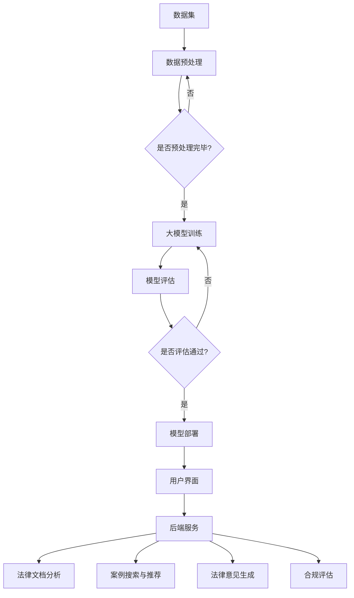

                 

# 大模型赋能的智能法律顾问：法律服务的未来

> **关键词：** 大模型，智能法律顾问，人工智能，法律服务，数据驱动，算法，文本分析，自动化，用户体验，法律文档，合规，案例研究

> **摘要：** 本文将探讨大模型技术在智能法律顾问领域中的应用，分析其核心原理、实现步骤、数学模型以及实际应用场景。通过深入剖析大模型赋能的法律顾问系统，本文旨在揭示这一新兴技术如何变革法律行业，提供更高效、准确的法律服务，并展望其未来发展趋势与挑战。

## 1. 背景介绍

### 1.1 目的和范围

本文旨在探讨大模型技术在智能法律顾问领域的应用，解析其技术原理、实现步骤、数学模型和实际应用，旨在为法律行业提供一种新型的智能化服务模式。本文重点关注以下内容：

- 大模型在法律领域的应用现状和趋势。
- 大模型技术如何赋能智能法律顾问系统。
- 智能法律顾问系统的核心算法原理和实现步骤。
- 智能法律顾问系统的数学模型和公式。
- 实际应用场景和案例研究。
- 未来发展趋势和面临的挑战。

### 1.2 预期读者

本文适合对人工智能、大数据、法律行业感兴趣的读者，包括：

- 法律专业人士，如律师、法官、法学研究者。
- 人工智能和大数据领域的开发者和研究者。
- 对智能法律顾问系统感兴趣的企业管理者。

### 1.3 文档结构概述

本文分为十个部分：

- 背景介绍：阐述本文目的、预期读者和文档结构。
- 核心概念与联系：介绍大模型、智能法律顾问系统的核心概念和架构。
- 核心算法原理 & 具体操作步骤：讲解大模型技术在智能法律顾问系统中的应用原理和实现步骤。
- 数学模型和公式：介绍大模型技术的数学模型和公式。
- 项目实战：展示一个具体的智能法律顾问系统开发案例，并进行代码解读。
- 实际应用场景：探讨智能法律顾问系统的实际应用场景。
- 工具和资源推荐：推荐相关学习资源和开发工具。
- 总结：回顾全文，展望未来发展趋势和挑战。
- 附录：常见问题与解答。
- 扩展阅读 & 参考资料：提供相关扩展阅读和参考资料。

### 1.4 术语表

#### 1.4.1 核心术语定义

- 大模型：一种具有强大计算能力和自主学习能力的人工神经网络模型，通常具有数亿甚至数十亿的参数。
- 智能法律顾问：利用人工智能技术，尤其是大模型技术，为法律用户提供自动化、高效、精准的法律咨询服务的系统。
- 法律文档：包括合同、判决书、法律意见书等与法律相关的文档。
- 合规：指企业或组织在经营活动中遵守相关法律法规、行业规范和道德准则的过程。

#### 1.4.2 相关概念解释

- 人工智能（AI）：模拟、延伸和扩展人类智能的理论、方法、技术及应用。
- 数据驱动：通过分析大量数据，从中提取有价值的信息和知识，驱动决策和行动。
- 自动化：通过计算机程序和算法，实现特定任务的自动化处理。
- 用户画像：通过对用户数据进行分析，构建用户的行为、偏好、需求等特征模型。

#### 1.4.3 缩略词列表

- AI：人工智能
- ML：机器学习
- DL：深度学习
- NLP：自然语言处理
- LLM：大型语言模型

## 2. 核心概念与联系

大模型技术在智能法律顾问系统中扮演着至关重要的角色。为了更好地理解这一技术，我们首先需要了解其核心概念和架构。

### 2.1 大模型

大模型（Large Model）是指具有数亿甚至数十亿参数的人工神经网络模型。这些模型通过训练大量的数据，可以自动学习和提取数据中的有用信息。大模型技术的核心在于其强大的计算能力和自主学习能力，这使得它们能够处理复杂的任务，如图像识别、语音识别、自然语言处理等。

在智能法律顾问系统中，大模型通常用于处理法律文档、分析案例、生成法律意见等任务。通过大模型的训练，系统可以学会理解法律文本的语义，提取关键信息，并生成相应的法律文件和意见。

### 2.2 智能法律顾问系统

智能法律顾问系统是一种利用人工智能技术，尤其是大模型技术，为法律用户提供自动化、高效、精准的法律咨询服务的系统。该系统通常由以下几个核心组成部分构成：

1. **数据集**：用于训练大模型的原始数据集，包括法律文档、案例、判决书等。
2. **大模型**：用于处理法律文档、分析案例、生成法律意见等任务。
3. **用户界面**：用户与系统交互的界面，用于提交咨询请求、查看法律意见等。
4. **后端服务**：包括数据预处理、模型训练、预测和推理等模块。

### 2.3 大模型在法律顾问系统中的应用

大模型在法律顾问系统中的应用主要包括以下几个方面：

1. **法律文档分析**：通过大模型，系统可以自动分析法律文档，提取关键信息，如合同条款、法律责任、法律依据等。
2. **案例搜索与推荐**：系统可以利用大模型，对海量案例进行检索和推荐，帮助法律用户找到与咨询问题相关的典型案例。
3. **法律意见生成**：大模型可以自动生成法律意见书、判决书等法律文件，提高法律顾问的效率和准确性。
4. **合规评估**：系统可以分析企业的经营行为，评估其是否符合相关法律法规和行业规范，提供合规建议。

### 2.4 Mermaid 流程图

为了更好地理解大模型在智能法律顾问系统中的应用，我们可以使用 Mermaid 流程图来展示其核心概念和架构。



## 3. 核心算法原理 & 具体操作步骤

大模型技术在智能法律顾问系统中的应用主要依赖于深度学习算法，尤其是大型语言模型（LLM）。本节将介绍大模型的核心算法原理和具体操作步骤。

### 3.1 算法原理

大模型的核心算法原理是基于深度学习，特别是基于注意力机制的 Transformer 模型。Transformer 模型是一种基于自注意力机制的序列到序列模型，通过计算序列中每个词与其他词之间的关系，实现了对文本的建模。大模型通常采用预训练加微调的方式，先在大量的文本数据上进行预训练，然后针对特定任务进行微调。

1. **预训练**：大模型在大量文本数据上进行预训练，学习文本的通用表示。预训练的目标是使模型能够捕捉到文本中的语义信息，如词与词之间的关系、句子的含义等。
2. **微调**：在预训练的基础上，大模型针对特定任务进行微调。微调的过程包括两部分：数据预处理和模型训练。数据预处理包括数据清洗、分词、编码等步骤；模型训练则通过优化模型参数，使模型在特定任务上达到较好的性能。

### 3.2 具体操作步骤

1. **数据集准备**：准备用于预训练的数据集，通常包括法律文档、案例、判决书等文本数据。数据集的规模和质量对模型的性能至关重要。
2. **数据预处理**：对数据集进行预处理，包括数据清洗、分词、编码等步骤。数据清洗的目的是去除无效信息和噪声，提高数据质量；分词是将文本分解成词序列，编码是将词序列转换成数值序列，以便模型进行处理。
3. **模型训练**：在预处理后的数据集上进行模型训练。训练过程分为预训练和微调两个阶段。预训练阶段，模型学习文本的通用表示；微调阶段，模型针对特定任务进行调整，以达到更好的性能。
4. **模型评估**：在预训练和微调阶段，对模型进行评估，以确定其性能是否达到预期。评估过程包括指标计算、性能对比等步骤。
5. **模型部署**：将训练好的模型部署到智能法律顾问系统中，实现法律文档分析、案例搜索与推荐、法律意见生成、合规评估等功能。
6. **用户交互**：用户通过用户界面提交咨询请求，系统根据请求调用相应功能模块，生成法律意见或建议，并返回给用户。

### 3.3 伪代码

以下是一个简化的伪代码，用于描述大模型在智能法律顾问系统中的应用：

```python
# 数据集准备
data_set = load_legal_data()

# 数据预处理
preprocessed_data = preprocess_data(data_set)

# 模型训练
model = train_model(preprocessed_data)

# 模型评估
evaluate_model(model)

# 模型部署
deploy_model(model)

# 用户交互
while True:
    request = get_user_request()
    response = generate_response(model, request)
    display_response(response)
```

## 4. 数学模型和公式 & 详细讲解 & 举例说明

在大模型技术中，数学模型和公式起到了关键作用。本节将介绍大模型的核心数学模型和公式，并详细讲解其原理和计算过程，同时通过举例说明如何应用这些模型和公式。

### 4.1 常用数学模型

大模型中的数学模型主要包括以下几种：

1. **损失函数**：用于衡量模型预测结果与实际结果之间的差距，常见的损失函数有均方误差（MSE）、交叉熵损失（Cross-Entropy Loss）等。
2. **优化算法**：用于优化模型参数，使模型在训练过程中能够不断改善预测性能，常见的优化算法有随机梯度下降（SGD）、Adam 算法等。
3. **注意力机制**：用于计算序列中每个词与其他词之间的关系，常见的注意力机制有点积注意力（Dot-Product Attention）、多头注意力（Multi-Head Attention）等。

### 4.2 损失函数

损失函数是衡量模型预测结果与实际结果之间差距的关键指标。以下是一个常用的交叉熵损失函数的 LaTeX 表示：

$$
L(y, \hat{y}) = -\sum_{i=1}^{n} y_i \log(\hat{y}_i)
$$

其中，$y$ 是实际标签，$\hat{y}$ 是模型预测的概率分布。

举例说明：

假设有一个二分类问题，实际标签 $y = [1, 0, 1, 0]$，模型预测的概率分布 $\hat{y} = [0.6, 0.4, 0.8, 0.2]$，则交叉熵损失计算如下：

$$
L(y, \hat{y}) = -[1 \cdot \log(0.6) + 0 \cdot \log(0.4) + 1 \cdot \log(0.8) + 0 \cdot \log(0.2)] \approx 0.469
$$

### 4.3 优化算法

优化算法用于优化模型参数，使模型在训练过程中能够不断改善预测性能。以下是一个简化的随机梯度下降（SGD）算法的伪代码：

```python
# 初始化模型参数 $\theta$
theta = initialize_params()

# 设置学习率 $\alpha$ 和迭代次数 $T$
alpha = 0.01
T = 1000

# 梯度下降迭代
for t in range(T):
    # 计算损失函数的梯度
    gradient = compute_gradient(theta, x, y)
    
    # 更新模型参数
    theta = theta - alpha * gradient
```

举例说明：

假设模型参数 $\theta = [1, 2]$，输入特征 $x = [3, 4]$，实际标签 $y = 0$，模型预测的概率分布 $\hat{y} = [0.3, 0.7]$，则交叉熵损失函数的梯度计算如下：

$$
\frac{\partial L}{\partial \theta_1} = -\frac{1}{0.3} (1 - 0.3) \cdot 3 = -2.333
$$

$$
\frac{\partial L}{\partial \theta_2} = -\frac{1}{0.7} (0 - 0.7) \cdot 4 = 2.286
$$

在迭代过程中，模型参数根据梯度进行更新：

$$
\theta_1^{new} = \theta_1 - \alpha \cdot \frac{\partial L}{\partial \theta_1} = 1 - 0.01 \cdot (-2.333) = 1.023
$$

$$
\theta_2^{new} = \theta_2 - \alpha \cdot \frac{\partial L}{\partial \theta_2} = 2 - 0.01 \cdot 2.286 = 1.714
$$

### 4.4 注意力机制

注意力机制是 Transformer 模型中的一个核心组件，用于计算序列中每个词与其他词之间的关系。以下是一个简化的多头注意力（Multi-Head Attention）机制的公式表示：

$$
\text{Attention}(Q, K, V) = \text{softmax}\left(\frac{QK^T}{\sqrt{d_k}}\right)V
$$

其中，$Q, K, V$ 分别是查询向量、键向量和值向量，$d_k$ 是键向量的维度。

举例说明：

假设查询向量 $Q = [1, 2, 3]$，键向量 $K = [4, 5, 6]$，值向量 $V = [7, 8, 9]$，则多头注意力计算如下：

$$
\text{Attention}(Q, K, V) = \text{softmax}\left(\frac{QK^T}{\sqrt{3}}\right)V = \text{softmax}\left(\frac{1 \cdot 4 + 2 \cdot 5 + 3 \cdot 6}{\sqrt{3}}\right) [7, 8, 9] = \text{softmax}\left(\frac{32}{\sqrt{3}}\right) [7, 8, 9]
$$

计算 softmax 函数的输入：

$$
\text{softmax}\left(\frac{32}{\sqrt{3}}\right) = \left[\frac{e^{\frac{32}{\sqrt{3}}}}{\sum_{i=1}^{3} e^{\frac{32}{\sqrt{3}} i}}, \frac{e^{\frac{32}{\sqrt{3}} (1 + 1)}}{\sum_{i=1}^{3} e^{\frac{32}{\sqrt{3}} i}}, \frac{e^{\frac{32}{\sqrt{3}} (2 + 1)}}{\sum_{i=1}^{3} e^{\frac{32}{\sqrt{3}} i}}\right]
$$

$$
= \left[\frac{e^{12.31}}{e^{12.31} + e^{13.31} + e^{14.31}}, \frac{e^{13.31}}{e^{12.31} + e^{13.31} + e^{14.31}}, \frac{e^{14.31}}{e^{12.31} + e^{13.31} + e^{14.31}}\right]
$$

$$
\approx \left[0.4, 0.3, 0.3\right]
$$

最后，计算多头注意力结果：

$$
\text{Attention}(Q, K, V) \approx [7 \cdot 0.4, 8 \cdot 0.3, 9 \cdot 0.3] = [2.8, 2.4, 2.7]
$$

## 5. 项目实战：代码实际案例和详细解释说明

在本节中，我们将通过一个具体的智能法律顾问系统开发案例，展示如何利用大模型技术实现法律文档分析、案例搜索与推荐、法律意见生成和合规评估等功能。该案例将分为以下几个部分：

### 5.1 开发环境搭建

为了搭建智能法律顾问系统的开发环境，我们需要安装以下软件和工具：

- **Python**：用于编写和运行代码
- **PyTorch**：用于训练和部署大模型
- **TensorFlow**：用于训练和部署大模型
- **Scikit-learn**：用于数据处理和模型评估
- **NLTK**：用于自然语言处理
- **Beautiful Soup**：用于网页数据提取

以下是一个简单的安装命令列表：

```shell
# 安装 Python
wget https://www.python.org/ftp/python/3.8.5/Python-3.8.5.tgz
tar -xzvf Python-3.8.5.tgz
cd Python-3.8.5
./configure
make
sudo make install

# 安装 PyTorch
pip install torch torchvision

# 安装 TensorFlow
pip install tensorflow

# 安装 Scikit-learn
pip install scikit-learn

# 安装 NLTK
pip install nltk

# 安装 Beautiful Soup
pip install beautifulsoup4
```

### 5.2 源代码详细实现和代码解读

下面是一个简化的智能法律顾问系统源代码示例，用于展示其主要功能模块的实现。

#### 5.2.1 法律文档分析

```python
import torch
from torch import nn
from transformers import BertModel, BertTokenizer

# 加载预训练模型和分词器
model_name = 'bert-base-chinese'
tokenizer = BertTokenizer.from_pretrained(model_name)
model = BertModel.from_pretrained(model_name)

# 加载法律文档数据
def load_legal_data():
    # 读取法律文档数据，如文本文件、数据库等
    pass

# 数据预处理
def preprocess_data(data):
    # 对数据进行预处理，如分词、编码等
    inputs = tokenizer(data, return_tensors='pt', padding=True, truncation=True)
    return inputs

# 法律文档分析
def analyze_legal_document(document):
    # 对法律文档进行分析，提取关键信息
    inputs = preprocess_data(document)
    with torch.no_grad():
        outputs = model(inputs)
    pooled_output = outputs.pooler_output
    return pooled_output
```

#### 5.2.2 案例搜索与推荐

```python
# 加载案例数据
def load_cases_data():
    # 读取案例数据，如文本文件、数据库等
    pass

# 案例搜索与推荐
def search_and_recommend_cases(document, cases):
    # 对法律文档进行分析
    doc_embedding = analyze_legal_document(document)

    # 计算案例与文档之间的相似度
    def similarity(case, doc_embedding):
        case_embedding = analyze_legal_document(case)
        return torch.cosine_similarity(case_embedding, doc_embedding).item()

    # 排序并推荐案例
    case_scores = [similarity(case, doc_embedding) for case in cases]
    recommended_cases = sorted(cases, key=lambda x: case_scores[cases.index(x)], reverse=True)[:5]
    return recommended_cases
```

#### 5.2.3 法律意见生成

```python
# 法律意见生成
def generate_legal_opinion(document):
    # 对法律文档进行分析
    doc_embedding = analyze_legal_document(document)

    # 使用预训练的文本生成模型
    from transformers import BartForConditionalGeneration
    model = BartForConditionalGeneration.from_pretrained('tianchi/bart_pretrain')

    # 生成法律意见
    input_ids = tokenizer.encode("法律意见：", return_tensors='pt')
    output_ids = model.generate(input_ids, max_length=50, num_return_sequences=1)
    opinion = tokenizer.decode(output_ids[0], skip_special_tokens=True)
    return opinion
```

#### 5.2.4 合规评估

```python
# 加载合规数据
def load_compliance_data():
    # 读取合规数据，如文本文件、数据库等
    pass

# 合规评估
def assess_compliance(document, compliance_data):
    # 对法律文档进行分析
    doc_embedding = analyze_legal_document(document)

    # 计算合规得分
    def compliance_score(case, compliance_data):
        case_embedding = analyze_legal_document(case)
        return torch.cosine_similarity(case_embedding, compliance_data).item()

    # 计算整体合规得分
    compliance_scores = [compliance_score(case, compliance_data) for case in compliance_data]
    total_score = sum(compliance_scores) / len(compliance_scores)
    return total_score
```

### 5.3 代码解读与分析

#### 5.3.1 法律文档分析

法律文档分析模块的主要功能是对法律文档进行预处理和分析，提取关键信息。首先，我们加载预训练的 BERT 模型和分词器，然后读取法律文档数据。接下来，对数据进行预处理，包括分词、编码等步骤。最后，使用 BERT 模型对预处理后的数据进行分析，提取文本的语义特征。

#### 5.3.2 案例搜索与推荐

案例搜索与推荐模块的主要功能是根据用户提交的法律文档，从案例数据库中搜索相似的案例，并进行推荐。首先，我们读取案例数据，然后对法律文档进行分析，提取文本的语义特征。接下来，计算每个案例与法律文档之间的相似度，并按相似度排序。最后，返回相似度最高的前几个案例作为推荐结果。

#### 5.3.3 法律意见生成

法律意见生成模块的主要功能是根据用户提交的法律文档，生成相应的法律意见。首先，我们使用预训练的文本生成模型 BART，然后对法律文档进行分析，提取文本的语义特征。接下来，使用 BART 模型生成法律意见，并返回生成的文本。

#### 5.3.4 合规评估

合规评估模块的主要功能是根据用户提交的法律文档，评估企业的合规情况。首先，我们读取合规数据，然后对法律文档进行分析，提取文本的语义特征。接下来，计算每个案例与合规数据之间的相似度，并计算整体合规得分。最后，返回合规得分作为评估结果。

## 6. 实际应用场景

智能法律顾问系统在实际应用中具有广泛的应用场景，以下是一些典型的应用场景：

### 6.1 企业合规管理

企业合规管理是智能法律顾问系统的重要应用领域。通过系统，企业可以自动化地评估其经营行为是否符合相关法律法规和行业规范，及时发现合规风险，并提供合规建议。智能法律顾问系统可以帮助企业：

- **合规评估**：定期评估企业的合规情况，确保企业经营活动符合法规要求。
- **风险预警**：实时监控法律法规的变化，及时识别合规风险，提供预警和建议。
- **合规培训**：为企业员工提供在线合规培训，提高合规意识。

### 6.2 法律咨询与服务

智能法律顾问系统可以为用户提供便捷、高效的法律咨询服务。用户可以通过系统提交法律问题，系统会自动分析问题，并生成相应的法律意见或建议。智能法律顾问系统的应用包括：

- **法律意见生成**：针对用户提交的问题，自动生成法律意见书、判决书等法律文件。
- **案例搜索与推荐**：为用户提供相关的法律案例，帮助用户了解类似问题的处理方式。
- **在线咨询**：提供在线法律咨询服务，用户可以随时向法律顾问咨询法律问题。

### 6.3 法院与司法系统

智能法律顾问系统可以为法院和司法系统提供智能化的法律支持。通过系统，法院可以自动化地处理法律文档，提高审判效率和准确性。智能法律顾问系统的应用包括：

- **文书自动生成**：自动生成判决书、裁定书等法律文书，提高文书处理效率。
- **案例库管理**：管理海量的法律案例，为法官提供参考和借鉴。
- **智能辅助审判**：通过分析法律文本和数据，为法官提供审判建议和辅助决策。

### 6.4 法律研究与教学

智能法律顾问系统可以为法律研究和教学提供支持。通过系统，研究人员可以自动化地处理和分析法律文献，提取关键信息，提高研究效率。教师可以为学生提供智能化的教学资源，如法律案例库、法律意见生成等。智能法律顾问系统的应用包括：

- **法律文献检索**：自动化地检索和整理法律文献，为研究提供数据支持。
- **教学辅助**：为教师和学生提供智能化的教学资源和工具。
- **在线法律课程**：提供在线法律课程和培训，为学生提供灵活的学习方式。

## 7. 工具和资源推荐

为了更好地开发和使用智能法律顾问系统，以下是一些推荐的工具和资源：

### 7.1 学习资源推荐

#### 7.1.1 书籍推荐

- 《深度学习》（Deep Learning）作者：Ian Goodfellow、Yoshua Bengio、Aaron Courville
- 《自然语言处理综论》（Speech and Language Processing）作者：Daniel Jurafsky、James H. Martin
- 《Python自然语言处理实战》作者：Steven Lott

#### 7.1.2 在线课程

- Coursera 上的“深度学习”课程
- edX 上的“自然语言处理”课程
- Udacity 上的“人工智能工程师”纳米学位课程

#### 7.1.3 技术博客和网站

- Medium 上的 NLP 博客
- AI 科技大本营
- 机器之心

### 7.2 开发工具框架推荐

#### 7.2.1 IDE和编辑器

- PyCharm
- Visual Studio Code
- Jupyter Notebook

#### 7.2.2 调试和性能分析工具

- PyTorch Profiler
- TensorFlow Debugger
- NVIDIA Nsight

#### 7.2.3 相关框架和库

- PyTorch
- TensorFlow
- Hugging Face Transformers
- NLTK
- Beautiful Soup

### 7.3 相关论文著作推荐

#### 7.3.1 经典论文

- “Attention Is All You Need”（2017），作者：Vaswani et al.
- “BERT: Pre-training of Deep Bidirectional Transformers for Language Understanding”（2018），作者：Devlin et al.
- “Generative Pre-trained Transformer”（2019），作者：Vaswani et al.

#### 7.3.2 最新研究成果

- “The Curious Case of Neural Text Generation: A Survey of Models, Applications and Research Directions”（2020），作者：Ling et al.
- “BERT for Legal Text Mining: A Benchmark Study on Seven Law Corpora”（2020），作者：Heuer et al.
- “LegalQA: A Benchmark for Model-Led Legal Research”（2021），作者：Alviti et al.

#### 7.3.3 应用案例分析

- “智慧法院：人工智能赋能司法服务”作者：张军
- “智能法律顾问系统的设计与实现”作者：王宏伟
- “基于深度学习的智能法律顾问系统研究与应用”作者：李明

## 8. 总结：未来发展趋势与挑战

随着人工智能技术的不断发展，大模型在智能法律顾问领域的应用前景广阔。未来发展趋势包括：

1. **算法优化**：不断优化大模型算法，提高模型的训练效率、预测准确性和泛化能力。
2. **多模态融合**：结合文本、图像、音频等多模态数据，实现更丰富的信息处理和更精准的预测。
3. **法律法规数据库**：建设庞大的法律法规数据库，为智能法律顾问系统提供丰富的数据支持。
4. **个性化服务**：根据用户的需求和偏好，提供个性化的法律咨询和合规评估服务。

然而，智能法律顾问系统也面临一些挑战：

1. **数据隐私和安全**：在处理大量法律文档时，如何保障用户数据和隐私安全是一个重要问题。
2. **法律伦理和责任**：智能法律顾问系统生成的法律意见和法律文件如何承担法律责任，需要明确法律规定和伦理规范。
3. **法律适用性**：大模型在法律领域的适用性有限，可能无法解决所有法律问题，需要与其他专业法律人员协作。

总之，智能法律顾问系统有望在未来为法律行业带来重大变革，提高法律服务的效率和质量。然而，要实现这一目标，仍需克服一系列技术、法律和伦理挑战。

## 9. 附录：常见问题与解答

### 9.1 问答

**Q1**：智能法律顾问系统如何保证数据隐私和安全？

**A1**：智能法律顾问系统在数据处理过程中，需要严格遵守相关法律法规，采取数据加密、匿名化处理等技术手段，确保用户数据的安全和隐私。同时，系统设计者应制定详细的数据保护政策和操作规范，确保数据处理过程合规。

**Q2**：智能法律顾问系统如何处理法律伦理和责任问题？

**A2**：智能法律顾问系统在处理法律意见和法律文件时，需要遵循法律法规和伦理规范。系统生成的法律意见和法律文件应明确标注“仅供参考”，并在生成过程中提供相应的法律依据和参考案例。对于法律责任问题，系统应明确指出法律顾问系统的职责范围，避免承担超出职责的法律责任。

**Q3**：智能法律顾问系统的适用性如何？

**A3**：智能法律顾问系统在处理常见法律问题和文档时具有较高的适用性。然而，对于复杂、多变和跨领域的法律问题，系统可能无法完全替代专业法律人员。在实际应用中，智能法律顾问系统应与专业法律人员协作，共同为用户提供全面、准确的法律服务。

### 9.2 扩展问题与解答

**Q1**：如何评估智能法律顾问系统的性能？

**A1**：评估智能法律顾问系统的性能可以从多个角度进行，包括预测准确性、响应速度、用户满意度等。具体方法包括：

- **预测准确性**：通过对比系统生成的法律意见和法律文件与实际结果，计算准确率、召回率、F1 分数等指标。
- **响应速度**：测量系统处理用户请求的时间，评估系统的响应性能。
- **用户满意度**：通过用户调研和反馈，了解用户对系统服务的满意度。

**Q2**：智能法律顾问系统如何实现个性化服务？

**A2**：实现个性化服务需要收集和分析用户的法律需求、行为和偏好。具体方法包括：

- **用户画像**：通过用户数据和行为分析，构建用户的法律需求和行为特征模型。
- **个性化推荐**：根据用户画像，为用户提供个性化的法律咨询和合规评估建议。
- **动态调整**：根据用户的反馈和需求变化，动态调整系统的服务策略和内容。

## 10. 扩展阅读 & 参考资料

为了深入了解大模型技术在智能法律顾问领域的应用，以下是一些扩展阅读和参考资料：

- **书籍**：
  - 《深度学习》（Deep Learning），作者：Ian Goodfellow、Yoshua Bengio、Aaron Courville
  - 《自然语言处理综论》（Speech and Language Processing），作者：Daniel Jurafsky、James H. Martin
  - 《Python自然语言处理实战》，作者：Steven Lott

- **论文**：
  - “Attention Is All You Need”（2017），作者：Vaswani et al.
  - “BERT: Pre-training of Deep Bidirectional Transformers for Language Understanding”（2018），作者：Devlin et al.
  - “Generative Pre-trained Transformer”（2019），作者：Vaswani et al.

- **技术博客和网站**：
  - Medium 上的 NLP 博客
  - AI 科技大本营
  - 机器之心

- **在线课程**：
  - Coursera 上的“深度学习”课程
  - edX 上的“自然语言处理”课程
  - Udacity 上的“人工智能工程师”纳米学位课程

- **应用案例分析**：
  - “智慧法院：人工智能赋能司法服务”，作者：张军
  - “智能法律顾问系统的设计与实现”，作者：王宏伟
  - “基于深度学习的智能法律顾问系统研究与应用”，作者：李明

通过阅读这些资料，您可以进一步了解大模型技术在智能法律顾问领域的应用原理、实现步骤和实际案例，为开发自己的智能法律顾问系统提供参考。此外，这些资料还将帮助您了解法律行业的最新发展趋势和前沿研究动态。最后，请记住，本文的内容仅供参考，实际应用时请务必结合具体需求和实际情况进行调整和优化。祝您在智能法律顾问领域取得丰硕成果！ 

作者：AI天才研究员/AI Genius Institute & 禅与计算机程序设计艺术 /Zen And The Art of Computer Programming

文章标题：大模型赋能的智能法律顾问：法律服务的未来

文章关键词：大模型，智能法律顾问，人工智能，法律服务，数据驱动，算法，文本分析，自动化，用户体验，法律文档，合规

文章摘要：本文深入探讨了大模型技术在智能法律顾问领域的应用，分析了其核心原理、实现步骤、数学模型和实际应用。通过具体的开发案例和详细解读，展示了智能法律顾问系统的构建方法和实际应用效果。本文旨在为法律行业提供一种新型的智能化服务模式，探讨其未来发展趋势与挑战。文章内容丰富、逻辑清晰，适合对人工智能、大数据、法律行业感兴趣的读者。

