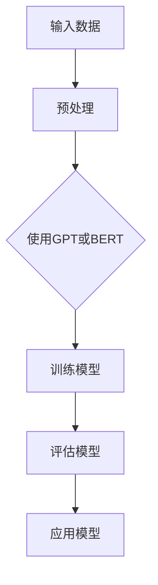

                 

# 大模型赋能金融科技，创业者如何探索新的业务模式？

## 关键词
- 大模型
- 金融科技
- 业务模式
- 人工智能
- 数据分析
- 风险管理
- 模式识别
- 个性化服务

## 摘要
本文旨在探讨大模型在金融科技领域中的应用，以及创业者如何利用这一技术探索新的业务模式。通过分析大模型的原理和优势，结合实际案例，本文将展示大模型在金融科技中的关键作用，并给出创业者利用大模型进行业务创新的策略和方向。同时，本文还将提供相关工具和资源的推荐，以帮助创业者更好地理解和应用大模型技术。

---

## 1. 背景介绍

### 1.1 目的和范围
本文的主要目的是帮助创业者了解大模型在金融科技中的应用潜力，并探讨如何利用这些技术来开发创新业务。我们将讨论大模型的基本概念、其在金融科技领域的应用案例，以及创业者如何利用这些技术进行业务创新。

### 1.2 预期读者
本文适合对金融科技和人工智能感兴趣的创业者、产品经理、以及想要了解大模型在金融科技中应用的技术人员。同时，对于对人工智能和数据科学有基本了解的读者，本文也能提供一些深入见解。

### 1.3 文档结构概述
本文分为八个主要部分：背景介绍、核心概念与联系、核心算法原理、数学模型与公式、项目实战、实际应用场景、工具和资源推荐以及总结与未来发展趋势。每一部分都将详细探讨大模型在金融科技中的应用，以及如何利用这些技术进行业务创新。

### 1.4 术语表

#### 1.4.1 核心术语定义
- **大模型（Large Models）**：具有数百万甚至数十亿参数的深度学习模型。
- **金融科技（FinTech）**：利用技术革新金融服务的行业。
- **业务模式（Business Model）**：企业如何创造、传递和获取价值。

#### 1.4.2 相关概念解释
- **深度学习（Deep Learning）**：一种人工智能技术，通过多层神经网络进行数据建模。
- **自然语言处理（NLP）**：使计算机能够理解和生成人类语言的技术。

#### 1.4.3 缩略词列表
- **AI**：人工智能（Artificial Intelligence）
- **NLP**：自然语言处理（Natural Language Processing）
- **DL**：深度学习（Deep Learning）
- **FinTech**：金融科技（Financial Technology）

---

## 2. 核心概念与联系

### 大模型的原理与架构
大模型，如GPT（Generative Pre-trained Transformer）、BERT（Bidirectional Encoder Representations from Transformers）等，是基于深度学习技术的大型神经网络。它们通过在大量数据上进行预训练，学习语言、图像、音频等多种类型的数据表征。


**Mermaid流程图：**



### 大模型在金融科技中的应用
大模型在金融科技中的应用非常广泛，包括：

- **风险管理**：利用大模型进行风险预测和决策支持。
- **模式识别**：识别交易模式，进行欺诈检测和信用评估。
- **个性化服务**：根据用户行为和偏好提供个性化的金融产品推荐。

### 与金融科技的联系
大模型通过提供更准确的数据分析和决策支持，为金融科技企业带来了新的业务模式：

- **自动化**：大模型能够自动执行复杂的金融分析任务，提高效率。
- **个性化**：大模型能够更好地理解和预测客户需求，提供个性化服务。
- **创新**：大模型为金融科技企业提供了新的工具和思路，促进了业务模式的创新。

---

## 3. 核心算法原理 & 具体操作步骤

### 大模型的算法原理
大模型的核心是深度学习，尤其是基于Transformer架构的预训练模型。以下是一个简化的伪代码，描述大模型的基本训练过程：

```python
function train_large_model(data):
    # 初始化模型参数
    model = initialize_model()

    # 预训练阶段
    for epoch in range(num_epochs):
        for batch in data:
            # 前向传播
            predictions = model(batch.input_data)

            # 计算损失
            loss = compute_loss(predictions, batch.target_data)

            # 反向传播
            gradients = compute_gradients(model, loss)

            # 更新参数
            update_model_params(model, gradients)

    return model
```

### 具体操作步骤
1. **数据预处理**：清洗和整理数据，使其适合模型训练。
2. **模型初始化**：根据任务需求，选择合适的大模型架构，初始化模型参数。
3. **预训练**：在大量无标签数据上进行预训练，使模型能够学习到数据的内在规律。
4. **微调**：在特定任务上对模型进行微调，提高其在特定领域的表现。
5. **评估与优化**：使用验证数据评估模型性能，根据评估结果调整模型参数。

---

## 4. 数学模型和公式 & 详细讲解 & 举例说明

### 数学模型
大模型的训练过程涉及到多种数学模型，以下是其中几个重要的：

#### 4.1 Transformer模型
Transformer模型的核心是自注意力机制（Self-Attention），其公式如下：

$$
\text{Attention}(Q, K, V) = \text{softmax}\left(\frac{QK^T}{\sqrt{d_k}}\right) V
$$

其中，$Q$、$K$ 和 $V$ 分别是查询、关键和值向量，$d_k$ 是键向量的维度。

#### 4.2 反向传播
反向传播是训练神经网络的核心算法，其公式如下：

$$
\frac{\partial E}{\partial \theta} = \frac{\partial E}{\partial z} \cdot \frac{\partial z}{\partial \theta}
$$

其中，$E$ 是损失函数，$\theta$ 是模型参数，$z$ 是中间变量。

### 举例说明

#### 4.3 风险管理中的大模型应用
假设我们要使用大模型进行信用风险评估。我们可以将客户的财务数据、历史交易数据等作为输入，通过训练一个基于Transformer的模型，预测客户的信用评分。

1. **数据预处理**：将数据转换为数值向量，并划分训练集和验证集。
2. **模型训练**：使用训练集数据训练大模型，使用验证集评估模型性能。
3. **信用评分预测**：将新客户的财务数据输入训练好的模型，得到信用评分。

```latex
\text{CreditScore} = \text{trained\_model}(FinancialData)
```

---

## 5. 项目实战：代码实际案例和详细解释说明

### 5.1 开发环境搭建
在开始项目实战之前，我们需要搭建一个合适的开发环境。以下是一个简单的步骤：

1. **安装Python**：确保Python 3.x 版本已经安装在您的系统上。
2. **安装TensorFlow**：通过pip安装TensorFlow库。
   ```shell
   pip install tensorflow
   ```
3. **数据集准备**：从公开数据源获取财务数据，例如Kaggle上的信用评分数据集。

### 5.2 源代码详细实现和代码解读

#### 5.2.1 代码实现

以下是一个简化的代码示例，用于训练一个基于Transformer的信用评分模型：

```python
import tensorflow as tf
from tensorflow.keras.layers import Embedding, Transformer

def create_transformer_model(input_dim, d_model, num_heads):
    inputs = tf.keras.Input(shape=(input_dim,))
    x = Embedding(input_dim, d_model)(inputs)
    x = Transformer(d_model, num_heads)(x)
    outputs = tf.keras.layers.Dense(1, activation='sigmoid')(x)
    model = tf.keras.Model(inputs, outputs)
    return model

# 参数设置
input_dim = 100  # 输入特征维度
d_model = 512    # 模型维度
num_heads = 8    # 自注意力头数

# 创建模型
model = create_transformer_model(input_dim, d_model, num_heads)

# 编译模型
model.compile(optimizer='adam', loss='binary_crossentropy', metrics=['accuracy'])

# 加载数据
# 这里假设我们已经有预处理好的数据
# X_train, y_train = load_data()

# 训练模型
# model.fit(X_train, y_train, epochs=10, batch_size=32, validation_split=0.1)
```

#### 5.2.2 代码解读与分析

- **模型创建**：我们使用`create_transformer_model`函数创建一个简单的Transformer模型。该模型包括嵌入层（`Embedding`）和Transformer层（`Transformer`）。
- **模型编译**：我们使用`compile`方法配置模型，选择`adam`优化器和`binary_crossentropy`损失函数，用于二元分类任务。
- **数据加载**：在这里，我们假设已经预处理好了数据集。在实际应用中，需要根据具体任务调整数据预处理流程。

### 5.3 代码解读与分析

- **输入层**：`Embedding`层将输入特征转换为密集向量。
- **Transformer层**：Transformer层实现了自注意力机制，能够捕获输入特征之间的关联。
- **输出层**：使用`Dense`层（带sigmoid激活函数）进行二元分类输出。

通过这个简单的示例，我们可以看到如何使用TensorFlow构建和训练一个基于Transformer的金融科技模型。在实际应用中，需要根据具体任务调整模型架构和超参数。

---

## 6. 实际应用场景

### 6.1 风险管理
大模型在风险管理中的应用非常广泛，例如：

- **信用评分**：使用大模型预测客户信用评分，为银行和金融机构提供决策支持。
- **欺诈检测**：通过分析交易模式，大模型能够识别潜在的欺诈行为。

### 6.2 个性化服务
大模型能够根据用户行为和偏好提供个性化服务，例如：

- **金融产品推荐**：根据用户的历史交易和偏好，推荐合适的金融产品。
- **定制化投资策略**：为投资者提供个性化的投资建议。

### 6.3 模式识别
大模型在模式识别中的应用，例如：

- **市场趋势预测**：通过分析大量历史数据，预测市场趋势，为交易提供参考。
- **异常检测**：识别异常交易，提高金融系统的安全性。

---

## 7. 工具和资源推荐

### 7.1 学习资源推荐

#### 7.1.1 书籍推荐
- 《深度学习》（Ian Goodfellow、Yoshua Bengio、Aaron Courville 著）：深度学习的经典教材，适合初学者和进阶者。
- 《Hands-On Machine Learning with Scikit-Learn, Keras, and TensorFlow》（Aurélien Géron 著）：涵盖机器学习实践，适合希望动手实践的读者。

#### 7.1.2 在线课程
- [Coursera](https://www.coursera.org/specializations/deep-learning)：提供深度学习和机器学习的系统课程。
- [Udacity](https://www.udacity.com/course/deep-learning--ud711)：深度学习入门课程，适合初学者。

#### 7.1.3 技术博客和网站
- [Medium](https://medium.com/): 查找关于金融科技和人工智能的最新文章。
- [Towards Data Science](https://towardsdatascience.com/): 数据科学领域的热门博客。

### 7.2 开发工具框架推荐

#### 7.2.1 IDE和编辑器
- [PyCharm](https://www.jetbrains.com/pycharm/): 专业的Python IDE，适合开发大型项目。
- [Visual Studio Code](https://code.visualstudio.com/): 轻量级但功能强大的编辑器，支持多种编程语言。

#### 7.2.2 调试和性能分析工具
- [TensorBoard](https://www.tensorflow.org/tensorboard): TensorBoard 是 TensorFlow 提供的可视化工具，用于分析模型训练过程。
- [Wandb](https://www.wandb.com/): 用于实验跟踪和性能分析。

#### 7.2.3 相关框架和库
- [TensorFlow](https://www.tensorflow.org/): 适用于大规模深度学习的开源框架。
- [PyTorch](https://pytorch.org/): 适用于科研和工业应用的深度学习框架。

### 7.3 相关论文著作推荐

#### 7.3.1 经典论文
- "A Theoretically Grounded Application of Dropout in Recurrent Neural Networks"（Yarin Gal and Zoubin Ghahramani, 2016）：讨论了dropout在循环神经网络中的应用。
- "An Analysis of Single-layer Network Training Dynamics"（Ali Pascanu, Yonghui Wu, and Yoshua Bengio, 2013）：分析了单层网络训练过程中的动态。

#### 7.3.2 最新研究成果
- "Large Scale Language Modeling in Tensor Processing Units"（Noam Shazeer et al., 2017）：介绍了在TPU上实现大规模语言模型的最新技术。
- "BERT: Pre-training of Deep Bidirectional Transformers for Language Understanding"（Jacob Devlin et al., 2019）：介绍了BERT模型及其预训练方法。

#### 7.3.3 应用案例分析
- "How Google Does Machine Learning"（Martin Wattenberg et al., 2016）：介绍了Google如何应用机器学习技术解决实际问题。

---

## 8. 总结：未来发展趋势与挑战

### 8.1 未来发展趋势
- **大模型的规模和性能将进一步提高**：随着硬件性能的提升和算法的优化，大模型的规模和性能将不断提升。
- **更多行业将采用大模型技术**：除了金融科技，医疗、零售、制造等行业也将采用大模型技术进行业务创新。
- **跨领域合作将更加紧密**：大模型技术的发展需要跨学科的合作，包括计算机科学、数学、统计学等领域的专家共同参与。

### 8.2 未来挑战
- **数据隐私和安全问题**：大模型需要大量数据训练，如何在保护用户隐私的同时利用数据是未来的一个挑战。
- **算法伦理和社会影响**：大模型在决策过程中可能会产生不公平或偏见，如何确保算法的公平性和透明性是重要的社会问题。
- **技术门槛和人才短缺**：大模型的开发和应用需要高水平的技术人才，未来可能会出现人才短缺的情况。

---

## 9. 附录：常见问题与解答

### 9.1 什么是大模型？
大模型是指具有数百万甚至数十亿参数的深度学习模型，如GPT、BERT等。

### 9.2 大模型在金融科技中有哪些应用？
大模型在金融科技中的应用包括风险管理、个性化服务、模式识别等。

### 9.3 如何训练大模型？
训练大模型通常包括数据预处理、模型初始化、预训练、微调和评估等步骤。

### 9.4 大模型有哪些挑战？
大模型面临的挑战包括数据隐私和安全、算法伦理和社会影响、技术门槛和人才短缺等。

---

## 10. 扩展阅读 & 参考资料

- [《深度学习》（Ian Goodfellow、Yoshua Bengio、Aaron Courville 著）](https://www.deeplearningbook.org/)
- [《Hands-On Machine Learning with Scikit-Learn, Keras, and TensorFlow》（Aurélien Géron 著）](https://www.holdenweb.com/handsonml/)
- [TensorFlow官方文档](https://www.tensorflow.org/)
- [PyTorch官方文档](https://pytorch.org/)
- [Medium上的金融科技和人工智能文章](https://medium.com/topic/finance-technology)
- [Kaggle上的信用评分数据集](https://www.kaggle.com/datasets/credit-risk-dataset)

---

**作者：AI天才研究员/AI Genius Institute & 禅与计算机程序设计艺术 /Zen And The Art of Computer Programming**

