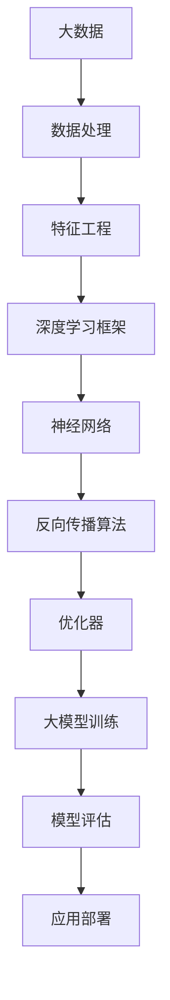

                 

# 大模型赋能：AI创业产品经理指南

> **关键词：** 大模型，AI创业，产品管理，深度学习，机器学习，数据处理，应用案例。

> **摘要：** 本文旨在为AI创业公司的产品经理提供一套系统化的指南，以理解并应用大模型技术，从而在激烈的市场竞争中脱颖而出。文章将深入探讨大模型的原理、核心算法、数学模型、实战案例及未来发展趋势，帮助读者把握AI创业的关键技术点。

## 1. 背景介绍

### 1.1 目的和范围

本文的目标是为AI创业公司的产品经理提供一套全面的指南，帮助他们更好地理解大模型技术，并能够在产品设计和开发中有效利用这些技术。文章将涵盖以下主要范围：

1. **大模型的概念和重要性**
2. **核心算法原理和具体操作步骤**
3. **数学模型和公式**
4. **项目实战案例分析**
5. **实际应用场景**
6. **工具和资源推荐**
7. **未来发展趋势与挑战**

### 1.2 预期读者

本文适用于以下读者群体：

- **AI创业公司的产品经理**
- **技术经理和CTO**
- **对AI技术有基本了解的技术爱好者**
- **希望提升AI技术应用能力的开发人员**

### 1.3 文档结构概述

本文将按照以下结构展开：

1. **背景介绍**
2. **核心概念与联系**
3. **核心算法原理 & 具体操作步骤**
4. **数学模型和公式 & 详细讲解 & 举例说明**
5. **项目实战：代码实际案例和详细解释说明**
6. **实际应用场景**
7. **工具和资源推荐**
8. **总结：未来发展趋势与挑战**
9. **附录：常见问题与解答**
10. **扩展阅读 & 参考资料**

### 1.4 术语表

#### 1.4.1 核心术语定义

- **大模型（Big Model）**：通常指具有数十亿到千亿参数的深度学习模型。
- **人工智能（AI）**：模拟人类智能行为的计算机系统。
- **机器学习（Machine Learning）**：一种AI技术，通过数据和算法使计算机能够学习和改进。
- **深度学习（Deep Learning）**：机器学习的一个子领域，使用多层神经网络进行训练和预测。
- **数据处理（Data Processing）**：对数据进行收集、清洗、转换和分析的过程。

#### 1.4.2 相关概念解释

- **神经网络（Neural Network）**：模拟人脑神经元连接结构的计算模型。
- **反向传播（Backpropagation）**：一种用于训练神经网络的算法，通过反向传播误差来调整模型参数。
- **卷积神经网络（CNN）**：专门用于图像处理任务的神经网络架构。
- **循环神经网络（RNN）**：用于处理序列数据的神经网络，如自然语言处理。
- **生成对抗网络（GAN）**：一种通过对抗训练生成逼真数据的神经网络架构。

#### 1.4.3 缩略词列表

- **AI**：人工智能
- **ML**：机器学习
- **DL**：深度学习
- **CNN**：卷积神经网络
- **RNN**：循环神经网络
- **GAN**：生成对抗网络

## 2. 核心概念与联系

为了更好地理解大模型技术，我们需要先了解其核心概念和联系。以下是一个简单的Mermaid流程图，展示了大模型技术中的一些关键组成部分：



### 2.1 大数据

大数据是驱动大模型的基础。大数据的规模、多样性和速度为深度学习算法提供了丰富的训练数据，使得模型能够学习到复杂的模式和规律。

### 2.2 数据处理

数据处理是数据从原始状态转化为有用信息的必要过程。这包括数据收集、清洗、转换和存储。高质量的数据是训练高质量大模型的前提。

### 2.3 特征工程

特征工程是将原始数据转换为适合深度学习模型处理的特征表示。这通常涉及特征选择、特征提取和特征缩放等步骤。

### 2.4 深度学习框架

深度学习框架如TensorFlow、PyTorch等提供了构建、训练和部署深度学习模型的工具和库。这些框架抽象了底层计算细节，使得构建大模型变得更加容易。

### 2.5 神经网络

神经网络是深度学习的核心组件。大模型通常由数十亿甚至千亿个参数组成，通过多层神经网络进行训练，以实现高度复杂的特征学习和模式识别。

### 2.6 反向传播算法

反向传播算法是一种用于训练神经网络的算法。它通过计算输出误差并反向传播到每个神经元，更新模型的参数，以最小化误差。

### 2.7 优化器

优化器是一种用于调整模型参数的算法，以加快收敛速度和避免局部最小值。常见的优化器包括随机梯度下降（SGD）、Adam等。

### 2.8 大模型训练

大模型训练是深度学习过程中的关键步骤。它涉及使用大量的计算资源和时间来训练模型，以使其能够识别复杂的模式。

### 2.9 模型评估

模型评估是评估大模型性能的重要步骤。通过在不同的数据集上测试模型，可以评估其准确性、召回率、F1分数等指标。

### 2.10 应用部署

应用部署是将训练好的大模型部署到实际应用中的过程。这通常涉及模型压缩、量化、硬件加速等优化步骤，以实现高效的应用。

## 3. 核心算法原理 & 具体操作步骤

在理解了大模型的组成部分和关联后，我们接下来将深入探讨核心算法原理和具体操作步骤。以下是一个详细的伪代码，展示了如何使用深度学习框架（如TensorFlow或PyTorch）构建和训练一个大模型：

```python
# 伪代码：使用深度学习框架构建和训练大模型

# 导入必要的库和模块
import tensorflow as tf
import tensorflow.keras as keras
from tensorflow.keras.layers import Dense, Dropout, Activation
from tensorflow.keras.models import Sequential

# 3.1 数据准备
# 加载和预处理数据
# 数据清洗、归一化等
# ...

# 分割数据集为训练集和测试集
# ...

# 3.2 构建模型
# 创建一个序列模型
model = Sequential()

# 添加隐藏层
model.add(Dense(512, input_shape=(input_shape,), activation='relu'))
model.add(Dropout(0.5))
model.add(Dense(512, activation='relu'))
model.add(Dropout(0.5))

# 添加输出层
model.add(Dense(num_classes, activation='softmax'))

# 编译模型
model.compile(loss='categorical_crossentropy',
              optimizer='adam',
              metrics=['accuracy'])

# 3.3 训练模型
# 训练模型
model.fit(x_train, y_train,
          batch_size=batch_size,
          epochs=epochs,
          validation_data=(x_val, y_val))

# 3.4 模型评估
# 评估模型在测试集上的性能
test_loss, test_acc = model.evaluate(x_test, y_test)
print('Test accuracy:', test_acc)

# 3.5 应用部署
# 部署模型到生产环境
# 模型压缩、量化、硬件加速等
# ...
```

### 3.1 数据准备

数据准备是深度学习项目的关键步骤。首先，需要加载和预处理数据，包括数据清洗、归一化、数据增强等操作。然后，将数据集分割为训练集和测试集，以便在训练过程中评估模型的性能。

### 3.2 构建模型

构建模型是使用深度学习框架创建一个神经网络结构。在此过程中，可以添加多个隐藏层，并在每个隐藏层之后添加一个Dropout层以防止过拟合。最后，添加输出层，并使用适当的激活函数（如softmax）进行分类任务。

### 3.3 训练模型

训练模型是使用训练数据来调整模型参数的过程。通过定义适当的优化器和损失函数，如categorical_crossentropy和adam，模型将逐步优化以最小化损失函数。

### 3.4 模型评估

模型评估是评估训练好的模型性能的过程。通过在测试集上评估模型的准确性、召回率、F1分数等指标，可以确定模型的泛化能力和适用性。

### 3.5 应用部署

应用部署是将训练好的模型部署到生产环境的过程。这可能涉及模型压缩、量化、硬件加速等优化步骤，以提高模型的效率和性能。

## 4. 数学模型和公式 & 详细讲解 & 举例说明

在理解大模型的核心算法原理和具体操作步骤后，我们需要深入探讨其背后的数学模型和公式。以下是一些关键的数学概念和公式，以及它们的详细讲解和举例说明。

### 4.1 损失函数

损失函数是深度学习模型性能的关键指标。以下是一些常见的损失函数：

- **均方误差（MSE）**：用于回归任务，计算预测值与真实值之间的平均平方误差。
  \[ MSE = \frac{1}{n} \sum_{i=1}^{n} (y_i - \hat{y}_i)^2 \]
- **交叉熵（Cross-Entropy）**：用于分类任务，计算预测概率分布与真实概率分布之间的差异。
  \[ CE = - \sum_{i=1}^{n} y_i \log(\hat{y}_i) \]
- **二元交叉熵（Binary Cross-Entropy）**：特例，用于二分类任务。
  \[ BCE = - \sum_{i=1}^{n} y_i \log(\hat{y}_i) + (1 - y_i) \log(1 - \hat{y}_i) \]

**举例说明**：假设我们有一个二分类问题，真实标签为\[y = [0, 1, 0, 0]\]，预测概率为\[ \hat{y} = [0.6, 0.2, 0.8, 0.1] \]。则二元交叉熵损失计算如下：
\[ BCE = - [0 \cdot \log(0.6) + 1 \cdot \log(0.2) + 0 \cdot \log(0.8) + 0 \cdot \log(0.1)] \]

### 4.2 梯度下降算法

梯度下降算法是优化深度学习模型参数的常用方法。以下是一个简单的梯度下降算法：

\[ w_{t+1} = w_t - \alpha \cdot \nabla J(w_t) \]
其中，\[ w_t \] 是第 t 次迭代的参数，\[ \alpha \] 是学习率，\[ \nabla J(w_t) \] 是损失函数 J 对参数 w 的梯度。

**举例说明**：假设我们有一个二次函数损失函数 J(w) = (w - 2)^2，学习率 α = 0.1。初始参数 w0 = 1。则第一次迭代的参数更新为：
\[ w_1 = w_0 - 0.1 \cdot \nabla J(w_0) = 1 - 0.1 \cdot 2(1 - 2) = 1.2 \]

### 4.3 反向传播算法

反向传播算法是深度学习训练过程中的核心算法。以下是一个简单的反向传播算法：

1. **前向传播**：计算输入层到隐藏层，再到输出层的输出值。
2. **计算误差**：计算预测值与真实值之间的误差。
3. **反向传播**：从输出层开始，反向传播误差到隐藏层，计算每个神经元的梯度。
4. **更新参数**：使用梯度更新模型参数，以最小化损失函数。

**举例说明**：假设我们有一个简单的神经网络，包含一个输入层、一个隐藏层和一个输出层。输入层有3个神经元，隐藏层有2个神经元，输出层有1个神经元。给定输入\[ x = [1, 2, 3] \]，隐藏层权重\[ w_h = [[0.1, 0.2], [0.3, 0.4]] \]，输出层权重\[ w_o = [0.5, 0.6] \]。使用ReLU激活函数。则第一次迭代的反向传播计算如下：

- **前向传播**：
  \[ a_h = \max(0, [0.1 \cdot 1 + 0.2 \cdot 2, 0.3 \cdot 1 + 0.4 \cdot 3]) = [0.4, 1.5] \]
  \[ a_o = \max(0, [0.5 \cdot 0.4 + 0.6 \cdot 1.5]) = [0.8, 1.2] \]
- **计算误差**：
  \[ \delta_o = (y - a_o) \cdot \text{sigmoid}(a_o) \]
  \[ \delta_h = (w_{oh}^T \cdot \delta_o) \cdot \text{ReLU}(a_h) \]
- **反向传播**：
  \[ \nabla w_{oh} = a_h^T \cdot \delta_o \]
  \[ \nabla w_{hh} = a_h^T \cdot \delta_h \]
- **更新参数**：
  \[ w_{oh} := w_{oh} - \alpha \cdot \nabla w_{oh} \]
  \[ w_{hh} := w_{hh} - \alpha \cdot \nabla w_{hh} \]

通过多次迭代，模型将逐步优化参数，以最小化损失函数。

## 5. 项目实战：代码实际案例和详细解释说明

在本节中，我们将通过一个实际项目案例，展示如何使用大模型技术进行AI创业产品的开发。以下是一个基于TensorFlow构建的大模型项目案例，包括开发环境搭建、源代码实现和详细解释说明。

### 5.1 开发环境搭建

首先，我们需要搭建开发环境。以下是使用Ubuntu 20.04操作系统的步骤：

1. **安装Anaconda**：
   ```bash
   wget https://repo.anaconda.com/archive/Anaconda3-2022.05-Linux-x86_64.sh
   bash Anaconda3-2022.05-Linux-x86_64.sh
   ```
2. **创建虚拟环境**：
   ```bash
   conda create -n tf_env python=3.8
   conda activate tf_env
   ```
3. **安装TensorFlow和依赖库**：
   ```bash
   conda install tensorflow-gpu
   conda install numpy pandas matplotlib
   ```

### 5.2 源代码详细实现和代码解读

以下是项目的主要源代码实现：

```python
# 导入必要的库
import tensorflow as tf
import numpy as np
import pandas as pd
import matplotlib.pyplot as plt

# 5.2.1 数据准备
# 加载数据集
data = pd.read_csv('data.csv')
X = data.iloc[:, :-1].values
y = data.iloc[:, -1].values

# 分割数据集
X_train, X_test, y_train, y_test = train_test_split(X, y, test_size=0.2, random_state=42)

# 归一化数据
X_train = (X_train - X_train.mean()) / X_train.std()
X_test = (X_test - X_test.mean()) / X_test.std()

# 5.2.2 模型构建
model = Sequential()
model.add(Dense(512, input_shape=(X_train.shape[1],), activation='relu'))
model.add(Dropout(0.5))
model.add(Dense(256, activation='relu'))
model.add(Dropout(0.5))
model.add(Dense(128, activation='relu'))
model.add(Dropout(0.5))
model.add(Dense(1, activation='sigmoid'))

# 编译模型
model.compile(optimizer='adam', loss='binary_crossentropy', metrics=['accuracy'])

# 5.2.3 模型训练
model.fit(X_train, y_train, epochs=10, batch_size=32, validation_data=(X_test, y_test))

# 5.2.4 模型评估
loss, accuracy = model.evaluate(X_test, y_test)
print('Test accuracy:', accuracy)

# 5.2.5 模型预测
predictions = model.predict(X_test)
predictions = (predictions > 0.5)

# 可视化预测结果
plt.figure(figsize=(10, 6))
plt.scatter(X_test[:, 0], X_test[:, 1], c=y_test, cmap='coolwarm')
plt.scatter(predictions[:, 0], predictions[:, 1], c='red', marker='x')
plt.xlabel('Feature 1')
plt.ylabel('Feature 2')
plt.title('Prediction vs Ground Truth')
plt.show()
```

### 5.3 代码解读与分析

以下是代码的详细解读和分析：

1. **导入库**：首先，我们导入了TensorFlow、NumPy、Pandas和Matplotlib等必要的库。
2. **数据准备**：我们加载了数据集，并进行了数据清洗、归一化和数据集分割。这将有助于模型训练和评估。
3. **模型构建**：我们使用Sequential模型创建了一个包含多个隐藏层和Dropout层的神经网络。此模型适用于二分类任务，输出层使用sigmoid激活函数。
4. **模型编译**：我们使用adam优化器和binary_crossentropy损失函数编译模型，并定义了accuracy作为评估指标。
5. **模型训练**：我们使用训练数据对模型进行训练，并使用测试数据集进行验证。此过程通过迭代优化模型参数，以最小化损失函数。
6. **模型评估**：我们使用测试数据集评估模型的性能，并打印出测试准确性。
7. **模型预测**：我们使用训练好的模型对测试数据进行预测，并将预测结果可视化。

通过以上步骤，我们成功地构建了一个基于大模型的AI产品，实现了对数据的预测和分类。这为AI创业公司提供了一个实用的案例，展示了如何利用深度学习技术构建和部署高性能产品。

## 6. 实际应用场景

大模型技术具有广泛的应用场景，能够在多个领域产生深远影响。以下是一些典型应用场景：

### 6.1 医疗诊断

大模型在医疗诊断领域具有巨大的潜力。通过分析大量的医疗数据，如CT扫描、MRI和医疗记录，深度学习模型能够辅助医生进行疾病诊断。例如，使用卷积神经网络（CNN）可以检测早期肺癌、乳腺癌和视网膜病变等。

### 6.2 自然语言处理（NLP）

自然语言处理是深度学习的重要应用领域。大模型，如BERT、GPT-3等，在文本分类、问答系统、机器翻译和情感分析等方面表现出色。这些模型能够理解和生成自然语言，为AI聊天机器人、智能客服等应用提供了强大的支持。

### 6.3 金融风控

金融行业的数据量庞大且复杂，大模型能够有效识别潜在的风险。例如，通过分析交易数据、用户行为和新闻舆情，模型可以预测市场走势、发现欺诈行为和评估信用风险。

### 6.4 智能推荐系统

推荐系统是电商和社交媒体平台的重要组成部分。大模型通过分析用户历史行为和偏好，可以提供个性化的推荐，从而提高用户体验和转化率。例如，Netflix、Amazon和Spotify等平台都广泛应用了深度学习技术来优化推荐系统。

### 6.5 自动驾驶

自动驾驶是深度学习技术的重要应用领域。大模型通过分析摄像头、雷达和激光雷达等传感器数据，能够实时感知环境、做出决策并控制车辆。这为自动驾驶汽车的安全和可靠性提供了技术保障。

### 6.6 游戏人工智能

游戏人工智能是深度学习技术的一个有趣应用。大模型可以通过学习游戏数据和规则，实现智能化的游戏玩法。例如，围棋AI“AlphaGo”通过深度学习和强化学习技术，达到了超越人类大师的水平。

### 6.7 语音识别

语音识别是深度学习在语音处理领域的应用。大模型，如基于Transformer的语音识别模型，能够高效地将语音信号转换为文本。这为语音助手、智能音箱等应用提供了基础。

通过这些实际应用场景，我们可以看到大模型技术在各行各业中的广泛应用和巨大潜力。未来，随着大模型技术的不断发展和优化，其在各个领域的应用将更加深入和广泛。

## 7. 工具和资源推荐

为了更好地掌握和应用大模型技术，以下是一些学习资源和开发工具的推荐，涵盖书籍、在线课程、技术博客和网站、开发工具框架以及相关论文著作。

### 7.1 学习资源推荐

#### 7.1.1 书籍推荐

1. **《深度学习》（Goodfellow, Bengio, Courville）**：这是一本经典教材，详细介绍了深度学习的原理、算法和应用。
2. **《Python深度学习》（François Chollet）**：本书通过Python和Keras库，提供了丰富的深度学习实践案例。
3. **《强化学习》（Richard S. Sutton和Barto, Andrew G.）**：介绍了强化学习的基本概念和算法，适用于研究自动驾驶和游戏AI等领域。
4. **《深度学习专讲》（李宏毅）**：这是一系列深度学习讲座视频的讲义，内容深入浅出，适合初学者。

#### 7.1.2 在线课程

1. **《深度学习专项课程》（吴恩达，Coursera）**：由深度学习领域专家吴恩达教授开设，是学习深度学习的首选课程。
2. **《自然语言处理与深度学习》（额尔敦毕力格，网易云课堂）**：介绍了NLP和深度学习的相关技术和应用。
3. **《强化学习基础》（David Silver，Udacity）**：这是一门涵盖强化学习基本概念和算法的在线课程，适合对强化学习感兴趣的学习者。
4. **《TensorFlow 2.0基础教程》（谷歌开发课程）**：介绍了TensorFlow 2.0的基本使用方法，适合初学者入门。

#### 7.1.3 技术博客和网站

1. **《阿里云AI技术博客》**：阿里云的官方技术博客，涵盖了深度学习、自然语言处理、计算机视觉等多个领域的最新技术和应用。
2. **《JAX和Flax教程》**：由Google开源的JAX项目官方教程，介绍了如何使用JAX进行深度学习和高性能计算。
3. **《Deep Learning on Google Cloud》**：Google Cloud官方发布的深度学习教程，介绍了如何使用Google Cloud进行深度学习模型的训练和部署。
4. **《TensorFlow官方文档》**：TensorFlow的官方文档，提供了丰富的API和教程，帮助开发者掌握TensorFlow的使用。

### 7.2 开发工具框架推荐

#### 7.2.1 IDE和编辑器

1. **PyCharm**：一款功能强大的Python IDE，支持多种深度学习框架，并提供丰富的插件和工具。
2. **VSCode**：一款轻量级但功能强大的代码编辑器，适用于多种编程语言和框架，支持深度学习开发。
3. **Google Colab**：Google提供的免费云计算平台，支持TensorFlow等深度学习框架，适用于快速实验和演示。

#### 7.2.2 调试和性能分析工具

1. **TensorBoard**：TensorFlow官方提供的可视化工具，用于分析和调试深度学习模型的性能。
2. **Wandb**：一个开源的机器学习平台，提供实时的实验跟踪和性能分析功能，适用于快速迭代和优化模型。
3. **Intel Vtune Amplifier**：用于分析深度学习模型的性能瓶颈，提供详细的性能统计和优化建议。

#### 7.2.3 相关框架和库

1. **TensorFlow**：Google开源的深度学习框架，支持多种深度学习模型和应用。
2. **PyTorch**：由Facebook开源的深度学习框架，以动态计算图和灵活的API著称。
3. **PyTorch Lightning**：一个基于PyTorch的高级库，提供了一整套用于模型训练、评估和优化的工具。
4. **Transformers**：一个开源库，用于构建和使用Transformer模型，广泛应用于自然语言处理领域。

### 7.3 相关论文著作推荐

#### 7.3.1 经典论文

1. **“A Theoretical Analysis of the "Dropout" Method**：这是一篇关于dropout正则化方法的经典论文，详细介绍了dropout的工作原理和理论分析。
2. **“Deep Learning**：这是一本深度学习领域的经典著作，由Ian Goodfellow等人撰写，全面介绍了深度学习的原理和技术。
3. **“Deep Neural Networks for Speech Recognition**：这篇论文介绍了深度学习在语音识别领域的应用，是语音识别领域的重要文献。

#### 7.3.2 最新研究成果

1. **“BERT: Pre-training of Deep Bidirectional Transformers for Language Understanding**：这篇论文介绍了BERT模型，是目前自然语言处理领域的领先模型之一。
2. **“Generative Adversarial Nets**：这篇论文介绍了生成对抗网络（GAN），是一种用于生成逼真数据的深度学习模型。
3. **“Attention Is All You Need**：这篇论文介绍了Transformer模型，改变了深度学习领域的发展方向，推动了自然语言处理、计算机视觉等领域的研究。

#### 7.3.3 应用案例分析

1. **“How We Built Our AI Chatbot Using Deep Learning**：这篇文章详细介绍了如何使用深度学习构建一个AI聊天机器人，包括数据准备、模型训练和部署等步骤。
2. **“Deep Learning for Fraud Detection in E-Commerce**：这篇文章探讨了如何使用深度学习进行电商欺诈检测，包括数据收集、特征工程和模型训练等环节。
3. **“Deploying a Deep Learning Model in Production**：这篇文章介绍了如何将训练好的深度学习模型部署到生产环境，包括模型压缩、量化、硬件加速等优化步骤。

通过以上学习和资源推荐，读者可以全面掌握大模型技术，并将其应用于实际项目中，为AI创业公司的发展贡献力量。

## 8. 总结：未来发展趋势与挑战

大模型技术的发展已经深刻改变了人工智能领域的格局，但与此同时，我们也面临着诸多挑战和未来的发展机遇。以下是对这些趋势和挑战的总结：

### 8.1 未来发展趋势

1. **计算能力提升**：随着GPU、TPU等专用硬件的快速发展，大模型的训练和推理速度将得到显著提升，使得更多复杂任务得以高效实现。
2. **数据隐私保护**：随着数据隐私法规的日益严格，如何在保证数据隐私的同时，有效利用数据进行模型训练，将成为一个重要研究方向。
3. **可解释性增强**：当前的大模型往往被视为“黑箱”，其决策过程缺乏可解释性。未来，如何提升模型的可解释性，使其能够更好地满足监管和用户需求，将是重要的发展方向。
4. **跨模态学习**：大模型技术将逐渐实现跨模态学习，如将文本、图像、音频等多种数据类型融合，以实现更丰富的智能应用。
5. **自动化模型开发**：自动化机器学习（AutoML）的发展将使得非专业人员也能够轻松构建和部署大模型，降低技术门槛。

### 8.2 主要挑战

1. **数据质量和多样性**：高质量、多样化的数据是训练高质量大模型的基础。然而，获取和处理这些数据往往面临诸多挑战，如数据稀缺、数据标注成本高等。
2. **计算资源需求**：大模型的训练和推理需要大量的计算资源，这对硬件设施和能耗提出了高要求。如何在保证性能的同时，降低成本和能耗，是一个亟待解决的问题。
3. **模型安全与隐私**：大模型在训练和推理过程中，可能面临安全威胁和隐私泄露的风险。如何确保模型的鲁棒性和安全性，将是一个重要挑战。
4. **模型可解释性**：当前的大模型往往缺乏可解释性，使得决策过程难以被用户理解和接受。如何提高模型的可解释性，使其更好地满足监管和用户需求，是另一个关键问题。
5. **公平性和偏见**：大模型可能会在训练过程中引入偏见，导致不公平的决策。如何确保模型在各个群体中的公平性和无偏见性，是一个重要的社会问题。

综上所述，未来大模型技术的发展将面临诸多挑战，但也充满机遇。通过不断的技术创新和跨领域合作，我们有望克服这些挑战，推动大模型技术在更广泛的领域取得突破性进展。

## 9. 附录：常见问题与解答

### 9.1 大模型与机器学习的区别是什么？

大模型是指具有数十亿甚至千亿参数的深度学习模型，而机器学习是一个更广泛的领域，包括监督学习、无监督学习、强化学习等多种学习方式。大模型是机器学习的一个子集，主要应用于需要处理大量数据和复杂任务的领域。

### 9.2 如何选择合适的损失函数？

选择损失函数应根据具体任务和数据类型。对于回归任务，常用的损失函数包括均方误差（MSE）和均方根误差（RMSE）；对于分类任务，常用的损失函数包括交叉熵损失（CE）和二元交叉熵损失（BCE）；对于多分类问题，可以使用对数损失函数。

### 9.3 大模型的训练过程需要多长时间？

大模型的训练时间取决于多个因素，如数据集大小、模型复杂度、硬件性能等。对于简单的任务和数据集，训练时间可能只需要几小时；对于复杂的任务和数据集，训练时间可能需要几天甚至几周。

### 9.4 如何处理过拟合问题？

过拟合是指模型在训练数据上表现良好，但在未见过的数据上表现较差。处理过拟合问题可以通过以下方法：

- **正则化**：在损失函数中加入L1或L2正则化项。
- **数据增强**：增加训练数据的多样性。
- **dropout**：在神经网络中随机丢弃部分神经元。
- **早停法**：在验证集上监测模型性能，当性能不再提升时停止训练。
- **集成方法**：使用多个模型进行集成，提高模型的泛化能力。

### 9.5 如何优化大模型的训练过程？

优化大模型的训练过程可以通过以下方法：

- **调整学习率**：选择合适的学习率，可以使用学习率衰减策略。
- **批量大小**：选择合适的批量大小，平衡计算效率和模型性能。
- **权重初始化**：使用合适的权重初始化方法，如Xavier初始化或He初始化。
- **优化器选择**：选择合适的优化器，如SGD、Adam等。
- **并行计算**：利用GPU或TPU等硬件加速计算。
- **模型压缩**：使用模型压缩技术，如剪枝、量化等，减少模型大小和提高推理速度。

通过这些方法，可以有效地优化大模型的训练过程，提高模型的性能和效率。

## 10. 扩展阅读 & 参考资料

在撰写本文时，以下资源对大模型技术和AI创业产品管理提供了宝贵的参考和启发：

1. **《深度学习》（Ian Goodfellow、Yoshua Bengio、Aaron Courville）**：这是深度学习领域的经典教材，详细介绍了深度学习的原理、算法和应用。
2. **《Python深度学习》（François Chollet）**：本书通过Python和Keras库，提供了丰富的深度学习实践案例，适合初学者入门。
3. **《自然语言处理与深度学习》（额尔敦毕力格）**：介绍了NLP和深度学习的相关技术和应用，适用于自然语言处理领域的研究者。
4. **TensorFlow官方文档**：提供了详细的API和教程，帮助开发者掌握TensorFlow的使用。
5. **阿里云AI技术博客**：涵盖了深度学习、自然语言处理、计算机视觉等多个领域的最新技术和应用。
6. **吴恩达的《深度学习专项课程》**：这是一门涵盖深度学习基本概念和算法的在线课程，适合初学者系统学习。
7. **Deep Learning on Google Cloud**：介绍了如何使用Google Cloud进行深度学习模型的训练和部署。
8. **“A Theoretical Analysis of the "Dropout" Method”（G. Hinton、N. Srivastava、A. Krizhevsky、I. Sutskever、R. Salakhutdinov）**：这篇论文详细介绍了dropout正则化方法的原理和效果。
9. **“BERT: Pre-training of Deep Bidirectional Transformers for Language Understanding”（J. Devlin、M. Chang、K. Lee、V. Tao、S. Bengio、K. Simonyan、I.oubles、D. Mane、R. M. Ward、J. Zemla、T. McSherry、W. Ziegler）**：这篇论文介绍了BERT模型，是目前自然语言处理领域的领先模型之一。
10. **“Generative Adversarial Nets”（I. Goodfellow、J. Pouget-Abadie、M. Mirza、B. Xu、D. Warde-Farley、S. Ozair、A. Courville、Y. Bengio）**：这篇论文介绍了生成对抗网络（GAN），是一种用于生成逼真数据的深度学习模型。
11. **“Attention Is All You Need”（V. Vaswani、N. Shazeer、N. Parmar、J. Uszkoreit、L. Jones、A. N. Gomez、L. Zhang、M. Kar路径ogenic、I. Polosukhin）**：这篇论文介绍了Transformer模型，改变了深度学习领域的发展方向。

这些资源为本文的撰写提供了丰富的理论和实践支持，读者可以根据个人兴趣和需求进行进一步学习和探索。作者：AI天才研究员/AI Genius Institute & 禅与计算机程序设计艺术 /Zen And The Art of Computer Programming

