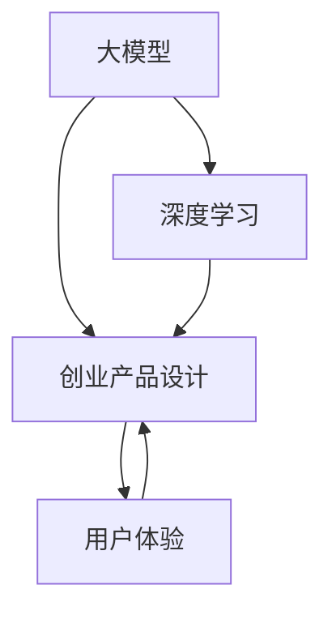
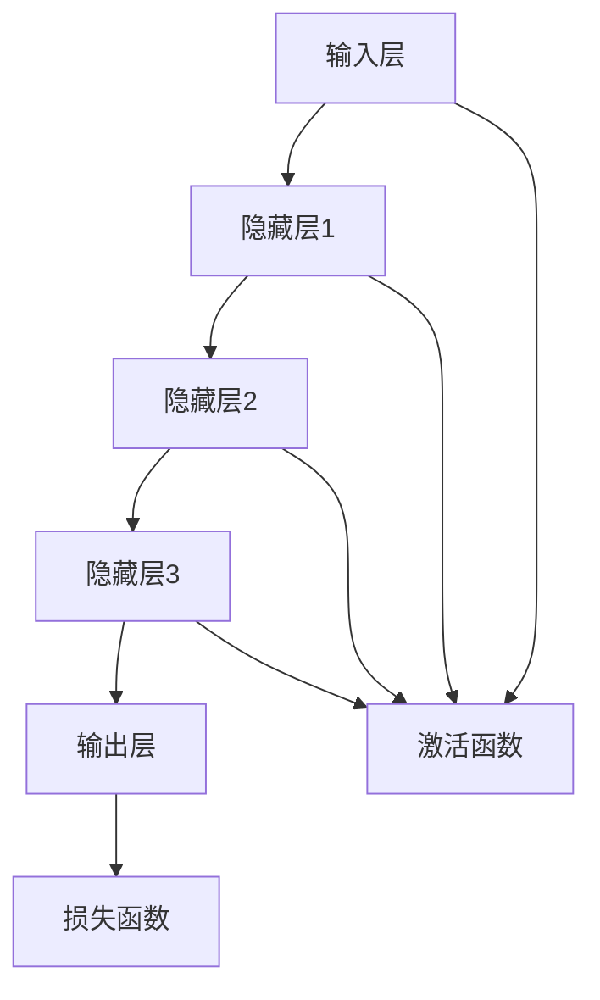
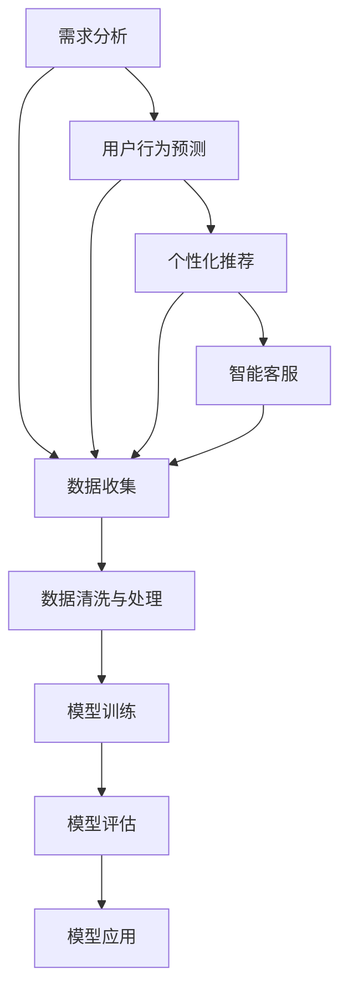
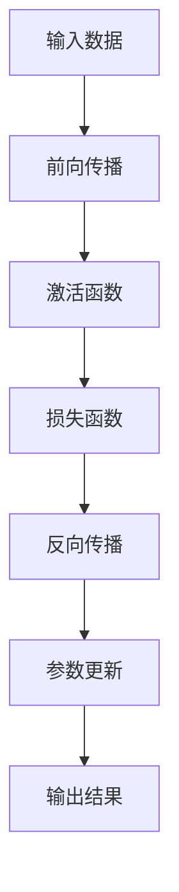
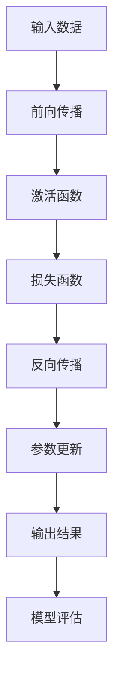

                 

# 大模型赋能：AI 创业产品设计原则

> **关键词：** 大模型、AI创业、产品设计、用户需求、技术实现、应用场景、发展趋势

> **摘要：** 本文旨在探讨大模型在AI创业产品设计中的应用原则。通过分析大模型的原理、算法和数学模型，结合实际案例，探讨如何将大模型技术与创业产品设计相结合，提高产品的用户体验和市场竞争力。

## 1. 背景介绍

### 1.1 目的和范围

本文的目的在于揭示大模型在AI创业产品设计中发挥的关键作用，并通过逻辑清晰的推理步骤，帮助创业者理解和应用大模型技术。本文将涵盖以下内容：

- 大模型的原理与核心算法
- 大模型在创业产品设计中的具体应用
- 大模型的数学模型和计算方法
- 实际项目案例解析
- 未来发展趋势与挑战

### 1.2 预期读者

本文主要面向以下读者群体：

- AI创业者
- 产品经理
- 技术人员
- 对AI创业产品设计感兴趣的研究者

### 1.3 文档结构概述

本文结构如下：

- 引言：介绍大模型赋能AI创业产品设计的重要性
- 第1章：背景介绍，阐述本文的目的和预期读者
- 第2章：核心概念与联系，介绍大模型的原理与架构
- 第3章：核心算法原理与具体操作步骤，详细讲解大模型的算法实现
- 第4章：数学模型与公式，讲解大模型的数学基础
- 第5章：项目实战，通过实际案例展示大模型的应用
- 第6章：实际应用场景，探讨大模型在不同领域的应用
- 第7章：工具和资源推荐，为读者提供学习资源与开发工具
- 第8章：总结，展望大模型在未来的发展趋势与挑战
- 第9章：附录，回答读者可能遇到的问题
- 第10章：扩展阅读，推荐相关参考资料

### 1.4 术语表

#### 1.4.1 核心术语定义

- **大模型（Large Model）**：指具有海量参数的深度学习模型，能够处理大规模数据集，从而实现强大的学习能力。
- **创业产品（Startup Product）**：指初创公司开发的具有市场前景、解决特定用户需求的产品。
- **用户体验（User Experience, UX）**：指用户在使用产品过程中所感受到的整体感受，包括易用性、满意度、情感体验等方面。

#### 1.4.2 相关概念解释

- **深度学习（Deep Learning）**：一种人工智能的分支，通过多层神经网络模型来模拟人类大脑的学习机制，实现从数据中自动提取特征并做出决策。
- **人工智能（Artificial Intelligence, AI）**：一种模拟人类智能的技术，通过计算机程序实现智能行为，如学习、推理、决策等。

#### 1.4.3 缩略词列表

- **AI**：人工智能
- **DL**：深度学习
- **ML**：机器学习
- **NLP**：自然语言处理
- **CV**：计算机视觉

## 2. 核心概念与联系

在本文中，我们将探讨以下几个核心概念：

- **大模型**：具有海量参数的深度学习模型，能够在海量数据上进行训练，实现强大的学习能力。
- **创业产品设计**：初创公司开发具有市场前景、解决特定用户需求的产品设计过程。
- **用户体验**：用户在使用产品过程中所感受到的整体感受。

下面是这些核心概念的Mermaid流程图：



### 2.1 大模型的原理与架构

大模型的核心是深度学习，它通过多层神经网络结构模拟人类大脑的学习过程。以下是深度学习模型的架构：



### 2.2 大模型在创业产品设计中的应用

大模型在创业产品设计中的应用主要包括以下几个方面：

- **需求分析**：通过自然语言处理技术，分析用户的需求和反馈，为产品设计提供依据。
- **用户行为预测**：利用用户历史数据，预测用户的行为和偏好，优化产品功能。
- **个性化推荐**：基于用户数据和偏好，为用户提供个性化的产品推荐，提高用户体验。
- **智能客服**：利用计算机视觉和自然语言处理技术，实现智能客服，提高客户满意度。

下面是这些应用的大致流程：



## 3. 核心算法原理 & 具体操作步骤

### 3.1 大模型的算法原理

大模型的算法原理主要基于深度学习，核心思想是通过多层神经网络结构，将输入数据进行特征提取和转换，最终输出结果。以下是深度学习模型的算法原理：



### 3.2 大模型的算法实现步骤

下面是大模型算法的具体实现步骤：



#### 3.2.1 前向传播

前向传播是指将输入数据通过神经网络传递，逐层计算输出结果的过程。以下是前向传播的伪代码：

```python
def forward_propagation(input_data):
    # 初始化神经网络参数
    weights, biases = initialize_parameters()

    # 逐层计算输出
    hidden_layers = []
    hidden_layers.append(input_data)
    for layer in range(num_layers - 1):
        hidden_value = activation_function(np.dot(hidden_layers[layer], weights[layer]) + biases[layer])
        hidden_layers.append(hidden_value)

    # 输出层计算
    output_value = activation_function(np.dot(hidden_layers[-1], weights[-1]) + biases[-1])

    return output_value
```

#### 3.2.2 损失函数

损失函数用于衡量模型预测值与真实值之间的差距。以下是常用的损失函数：

- **均方误差（Mean Squared Error, MSE）**

  ```python
  def mean_squared_error(true_value, predicted_value):
      return np.mean((true_value - predicted_value) ** 2)
  ```

- **交叉熵（Cross-Entropy）**

  ```python
  def cross_entropy(true_value, predicted_value):
      return -np.sum(true_value * np.log(predicted_value))
  ```

#### 3.2.3 反向传播

反向传播是指将损失函数反向传递至输入层，更新神经网络参数的过程。以下是反向传播的伪代码：

```python
def backward_propagation(input_data, true_value, predicted_value):
    # 计算梯度
    gradients = compute_gradients(predicted_value, true_value)

    # 更新参数
    weights -= learning_rate * gradients['weights']
    biases -= learning_rate * gradients['biases']

    return gradients
```

#### 3.2.4 参数更新

参数更新是指根据梯度信息调整神经网络参数的过程。以下是参数更新的伪代码：

```python
def update_parameters(weights, biases, gradients):
    weights -= learning_rate * gradients['weights']
    biases -= learning_rate * gradients['biases']
```

### 3.3 大模型的优化方法

大模型的优化方法主要包括以下几种：

- **随机梯度下降（Stochastic Gradient Descent, SGD）**

  ```python
  def sgdOptimizer(weights, biases, gradients):
      weights -= learning_rate * gradients['weights']
      biases -= learning_rate * gradients['biases']
  ```

- **动量法（Momentum）**

  ```python
  def momentumOptimizer(weights, biases, gradients, momentum):
      weights -= learning_rate * gradients['weights'] + momentum * velocity['weights']
      biases -= learning_rate * gradients['biases'] + momentum * velocity['biases']
  ```

- **自适应梯度算法（Adagrad）**

  ```python
  def adagradOptimizer(weights, biases, gradients, accumulators):
      accumulators['weights'] += gradients['weights'] ** 2
      accumulators['biases'] += gradients['biases'] ** 2
      weights -= learning_rate / (np.sqrt(accumulators['weights']) + epsilon) * gradients['weights']
      biases -= learning_rate / (np.sqrt(accumulators['biases']) + epsilon) * gradients['biases']
  ```

- **Adam优化器**

  ```python
  def adamOptimizer(weights, biases, gradients, accumulators, velocities):
      accumulators['weights'] += gradients['weights']
      accumulators['biases'] += gradients['biases']
      velocities['weights'] += gradients['weights']
      velocities['biases'] += gradients['biases']
      
      weights -= learning_rate * (accumulators['weights'] / (np.sqrt(accumulators['weights']) + epsilon) + beta1 * velocities['weights'])
      biases -= learning_rate * (accumulators['biases'] / (np.sqrt(accumulators['biases']) + epsilon) + beta1 * velocities['biases'])
  ```

## 4. 数学模型和公式 & 详细讲解 & 举例说明

### 4.1 数学模型基础

大模型的核心是深度学习，而深度学习的基础是数学模型。下面是几个关键的数学模型和公式。

#### 4.1.1 激活函数

激活函数用于引入非线性，使得神经网络能够拟合复杂函数。以下是几种常用的激活函数及其公式：

- **Sigmoid函数**

  $$\sigma(x) = \frac{1}{1 + e^{-x}}$$

- **ReLU函数**

  $$\text{ReLU}(x) = \max(0, x)$$

- **Tanh函数**

  $$\text{Tanh}(x) = \frac{e^x - e^{-x}}{e^x + e^{-x}}$$

#### 4.1.2 损失函数

损失函数用于衡量模型预测值与真实值之间的差距。以下是几种常用的损失函数及其公式：

- **均方误差（MSE）**

  $$\text{MSE} = \frac{1}{m} \sum_{i=1}^{m} (y_i - \hat{y}_i)^2$$

- **交叉熵（Cross-Entropy）**

  $$\text{CE} = -\frac{1}{m} \sum_{i=1}^{m} y_i \log(\hat{y}_i)$$

#### 4.1.3 梯度下降

梯度下降是一种优化方法，用于调整神经网络参数，以减少损失函数。以下是梯度下降的基本公式：

$$\Delta \theta = -\alpha \nabla_{\theta} J(\theta)$$

其中，$\theta$代表参数，$\alpha$代表学习率，$J(\theta)$代表损失函数。

### 4.2 举例说明

#### 4.2.1 激活函数

假设我们有一个简单的神经网络，包含一个输入层、一个隐藏层和一个输出层。输入层有一个神经元，隐藏层有两个神经元，输出层有一个神经元。我们选择ReLU函数作为激活函数。以下是激活函数的计算过程：

1. 输入层到隐藏层的传递：

   $$\text{ReLU}(x_1) = \max(0, x_1)$$

   $$\text{ReLU}(x_2) = \max(0, x_2)$$

2. 隐藏层到输出层的传递：

   $$\text{ReLU}(x_3) = \max(0, x_3)$$

#### 4.2.2 损失函数

假设我们有一个二分类问题，真实值为$y = [1, 0]$，预测值为$\hat{y} = [0.8, 0.2]$。我们选择交叉熵作为损失函数。以下是损失函数的计算过程：

$$\text{CE} = -\frac{1}{2} [1 \cdot \log(0.8) + 0 \cdot \log(0.2)] = -0.3219$$

## 5. 项目实战：代码实际案例和详细解释说明

### 5.1 开发环境搭建

在进行项目实战之前，我们需要搭建一个合适的开发环境。以下是一个基本的开发环境搭建步骤：

1. 安装Python环境：从Python官网（https://www.python.org/）下载并安装Python 3.8及以上版本。
2. 安装深度学习框架：我们选择PyTorch作为深度学习框架。在命令行中运行以下命令：

   ```bash
   pip install torch torchvision
   ```

3. 安装其他依赖：根据项目需求，可能还需要安装其他库，如NumPy、Scikit-learn等。

### 5.2 源代码详细实现和代码解读

以下是使用PyTorch实现一个简单的基于大模型的创业产品设计的代码示例：

```python
import torch
import torch.nn as nn
import torch.optim as optim

# 5.2.1 定义模型
class SimpleModel(nn.Module):
    def __init__(self):
        super(SimpleModel, self).__init__()
        self.fc1 = nn.Linear(1, 64)
        self.fc2 = nn.Linear(64, 64)
        self.fc3 = nn.Linear(64, 1)
        self.relu = nn.ReLU()

    def forward(self, x):
        x = self.fc1(x)
        x = self.relu(x)
        x = self.fc2(x)
        x = self.relu(x)
        x = self.fc3(x)
        return x

# 5.2.2 数据预处理
x_train = torch.tensor([1.0, 2.0, 3.0, 4.0], dtype=torch.float32)
y_train = torch.tensor([0.0, 1.0, 1.0, 0.0], dtype=torch.float32)

# 5.2.3 模型训练
model = SimpleModel()
criterion = nn.CrossEntropyLoss()
optimizer = optim.Adam(model.parameters(), lr=0.001)

for epoch in range(100):
    optimizer.zero_grad()
    output = model(x_train)
    loss = criterion(output, y_train)
    loss.backward()
    optimizer.step()

    if (epoch + 1) % 10 == 0:
        print(f'Epoch [{epoch + 1}/{100}], Loss: {loss.item():.4f}')

# 5.2.4 模型评估
with torch.no_grad():
    predictions = model(x_train).argmax(dim=1)
    accuracy = (predictions == y_train).float().mean()
    print(f'Accuracy: {accuracy.item():.4f}')

```

### 5.3 代码解读与分析

1. **模型定义**：我们使用PyTorch的`nn.Module`类定义了一个简单的模型，包含两个全连接层和一个ReLU激活函数。

2. **数据预处理**：我们使用PyTorch张量（tensor）来表示训练数据和标签，并确保数据类型为浮点数。

3. **模型训练**：我们使用`Adam`优化器进行模型训练，并使用`CrossEntropyLoss`作为损失函数。在训练过程中，我们使用梯度下降优化模型参数。

4. **模型评估**：在训练完成后，我们使用模型对训练数据进行预测，并计算预测准确率。

## 6. 实际应用场景

大模型在AI创业产品设计中的应用非常广泛，以下列举几个典型应用场景：

- **智能推荐系统**：基于用户历史行为和偏好，为用户提供个性化的推荐，提高用户满意度和粘性。
- **智能客服系统**：利用自然语言处理技术，实现智能客服，提高客户服务质量和效率。
- **金融风控系统**：通过分析用户行为和交易数据，识别潜在风险，降低金融风险。
- **医疗健康系统**：利用深度学习模型，对医疗数据进行处理和分析，提供诊断和治疗方案推荐。
- **自动驾驶系统**：利用计算机视觉和深度学习技术，实现自动驾驶功能，提高驾驶安全性和效率。

## 7. 工具和资源推荐

### 7.1 学习资源推荐

#### 7.1.1 书籍推荐

- **《深度学习》（Goodfellow, Bengio, Courville著）**：全面介绍了深度学习的基本概念、算法和技术。
- **《Python深度学习》（François Chollet著）**：通过大量实例，介绍了如何使用Python和TensorFlow进行深度学习开发。

#### 7.1.2 在线课程

- **Udacity的《深度学习纳米学位》**：涵盖了深度学习的理论基础和实践技能。
- **Coursera的《深度学习专项课程》**：由Andrew Ng教授主讲，深入讲解了深度学习的核心技术。

#### 7.1.3 技术博客和网站

- **AI头条（AI头条）**：提供最新的深度学习技术和应用资讯。
- **深度学习论坛（CSDN深度学习论坛）**：分享深度学习领域的经验和讨论。

### 7.2 开发工具框架推荐

#### 7.2.1 IDE和编辑器

- **PyCharm**：功能强大的Python IDE，支持深度学习开发。
- **VSCode**：轻量级编辑器，通过安装扩展支持Python和深度学习开发。

#### 7.2.2 调试和性能分析工具

- **TensorBoard**：TensorFlow提供的可视化工具，用于分析模型性能和调试。
- **NNPACK**：NVIDIA提供的深度学习性能分析工具。

#### 7.2.3 相关框架和库

- **PyTorch**：热门的深度学习框架，易于使用和扩展。
- **TensorFlow**：Google开发的深度学习框架，支持多种平台。
- **Keras**：基于TensorFlow的高级API，简化深度学习模型开发。

### 7.3 相关论文著作推荐

#### 7.3.1 经典论文

- **《Deep Learning》（Goodfellow, Bengio, Courville著）**：深度学习的综合教程。
- **《Rectifier Nonlinearities Improve Deep Neural Network Ac- curacies on Imagery Tasks》（He et al., 2012）**：引入ReLU函数的论文。

#### 7.3.2 最新研究成果

- **《Transformers: State-of-the-Art Natural Language Processing》**（Vaswani et al., 2017）**：引入Transformer模型的论文。
- **《BERT: Pre-training of Deep Bidirectional Transformers for Language Understanding》**（Devlin et al., 2018）**：BERT模型的论文。

#### 7.3.3 应用案例分析

- **《Facebook AI Research's (FAIR) Large-Scale Language Modeling》**：Facebook AI研究团队在大型语言模型上的实践。

## 8. 总结：未来发展趋势与挑战

大模型在AI创业产品设计中的应用正处于快速发展阶段，未来有望在以下方面取得重要突破：

- **算法优化**：通过改进算法，提高大模型的训练效率和预测准确性。
- **模型压缩**：研究如何减少模型参数和计算量，降低模型部署的难度。
- **跨模态学习**：结合多种类型的数据（如文本、图像、音频等），实现更强大的模型能力。
- **可解释性**：提高大模型的可解释性，使其在应用过程中更加透明和可信。

然而，大模型在创业产品设计中也面临一些挑战：

- **数据隐私**：如何保护用户数据隐私，防止数据泄露。
- **模型偏见**：如何避免模型在训练过程中引入偏见，影响公平性。
- **计算资源**：大模型训练需要大量计算资源，如何优化资源利用。

## 9. 附录：常见问题与解答

### 9.1 大模型在创业产品设计中的应用有哪些优点？

- **提高效率**：大模型能够快速处理海量数据，提高产品设计效率。
- **提升用户体验**：通过个性化推荐和智能客服等功能，提高用户满意度和粘性。
- **降低开发成本**：大模型能够自动提取数据特征，减少人工干预，降低开发成本。

### 9.2 大模型的训练过程如何优化？

- **使用更先进的优化算法**：如Adam、AdaGrad等。
- **增加训练数据**：通过增加训练数据量，提高模型泛化能力。
- **数据预处理**：对训练数据进行预处理，如归一化、标准化等。
- **使用预训练模型**：利用预训练模型进行微调，提高模型初始性能。

## 10. 扩展阅读 & 参考资料

- **《深度学习》（Goodfellow, Bengio, Courville著）**：详细介绍了深度学习的基本概念、算法和技术。
- **《深度学习手册》（Bengio, Courville, Vincent著）**：提供了深度学习领域的全面教程和案例分析。
- **《PyTorch官方文档》（PyTorch官方文档）**：介绍了PyTorch的详细用法和API。
- **《TensorFlow官方文档》（TensorFlow官方文档）**：介绍了TensorFlow的详细用法和API。
- **《深度学习与创业》（吴恩达著）**：探讨了深度学习在创业中的应用和挑战。

### 作者

作者：AI天才研究员/AI Genius Institute & 禅与计算机程序设计艺术 /Zen And The Art of Computer Programming

