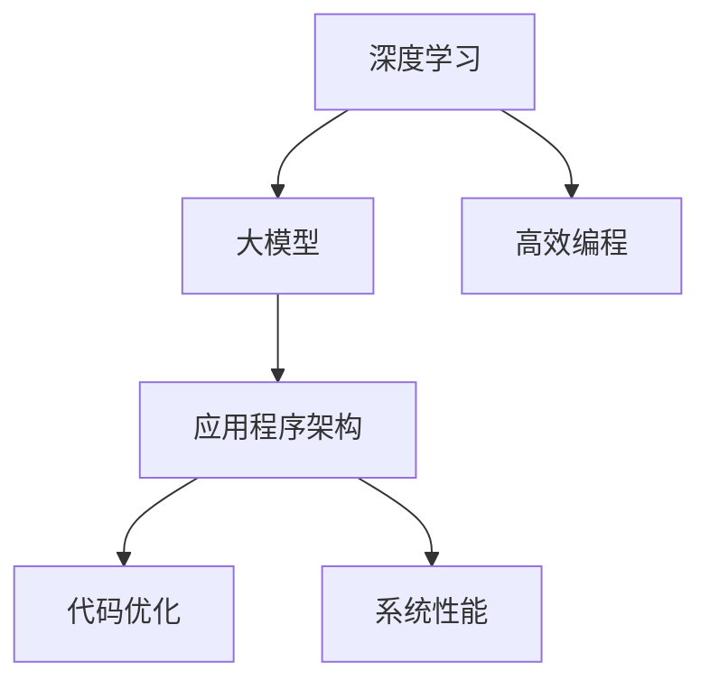

                 

# 大模型软件2.0：重新定义应用程序架构

> **关键词：** 大模型软件、应用程序架构、深度学习、人工智能、软件开发、代码优化、系统性能、高效编程、软件工程

> **摘要：** 本文将深入探讨大模型软件2.0的概念，探讨其在应用程序架构中的革命性影响。我们将详细分析其核心原理、数学模型、算法操作步骤，并分享实际项目中的代码案例。通过本文，读者将全面了解大模型软件2.0的优势及其在软件工程领域的未来趋势。

## 1. 背景介绍

### 1.1 目的和范围

本文旨在探讨大模型软件2.0的概念，并分析其在应用程序架构中的重要性。本文将涵盖以下内容：

1. 大模型软件2.0的核心概念和原理。
2. 大模型软件2.0如何影响应用程序架构。
3. 大模型软件2.0的核心算法和数学模型。
4. 实际项目中的大模型软件2.0代码案例。

### 1.2 预期读者

本文适合以下读者群体：

1. 软件开发工程师和软件架构师。
2. 对人工智能和深度学习感兴趣的技术爱好者。
3. 计算机科学专业的学生和研究者。

### 1.3 文档结构概述

本文将按照以下结构展开：

1. 背景介绍：介绍本文的目的和范围。
2. 核心概念与联系：阐述大模型软件2.0的核心概念和原理。
3. 核心算法原理 & 具体操作步骤：详细讲解大模型软件2.0的核心算法。
4. 数学模型和公式 & 详细讲解 & 举例说明：分析大模型软件2.0的数学模型。
5. 项目实战：代码实际案例和详细解释说明。
6. 实际应用场景：探讨大模型软件2.0的实际应用。
7. 工具和资源推荐：推荐相关学习资源和开发工具。
8. 总结：未来发展趋势与挑战。
9. 附录：常见问题与解答。
10. 扩展阅读 & 参考资料。

### 1.4 术语表

#### 1.4.1 核心术语定义

- **大模型软件2.0：** 指基于深度学习和人工智能技术的新型软件开发方法，能够实现高度智能化和自适应性的应用程序架构。
- **应用程序架构：** 软件系统的结构设计，包括模块划分、接口设计、数据流和通信等。
- **深度学习：** 一种基于人工神经网络的机器学习方法，通过多层次的神经网络模型来模拟人类大脑的学习过程。

#### 1.4.2 相关概念解释

- **神经网络：** 一种由大量神经元组成的计算模型，能够模拟人类大脑的学习和记忆过程。
- **人工智能：** 模拟人类智能行为的计算机系统，包括机器学习、自然语言处理、计算机视觉等领域。

#### 1.4.3 缩略词列表

- **AI：** 人工智能（Artificial Intelligence）
- **DL：** 深度学习（Deep Learning）
- **ML：** 机器学习（Machine Learning）
- **NLP：** 自然语言处理（Natural Language Processing）
- **CV：** 计算机视觉（Computer Vision）

## 2. 核心概念与联系

在深入探讨大模型软件2.0之前，我们需要先了解其核心概念和原理。以下是一个简化的Mermaid流程图，用于阐述大模型软件2.0的核心概念和联系。



### 2.1 深度学习

深度学习是一种基于人工神经网络的机器学习方法，通过多层神经网络模型来模拟人类大脑的学习过程。深度学习在大模型软件2.0中起着关键作用，其核心原理如下：

1. **神经网络结构**：神经网络由大量神经元组成，每个神经元接收多个输入，通过加权求和和激活函数产生输出。
2. **训练过程**：通过大量训练数据来调整神经网络中的权重，使其能够准确预测或分类输入数据。
3. **优化算法**：如梯度下降、随机梯度下降等，用于调整神经网络权重，以优化模型性能。

### 2.2 大模型

大模型是指在深度学习中使用的大型神经网络模型，具有数百万甚至数十亿的参数。大模型的优势在于其能够捕捉到输入数据的复杂模式和相关性，从而提高模型的预测性能。

1. **模型规模**：大模型通常具有大量的神经元和层次结构，使其能够处理复杂的任务。
2. **参数优化**：大模型需要大量的训练数据和计算资源，通过优化算法调整模型参数，使其性能达到最优。
3. **硬件加速**：为了应对大模型的高计算需求，需要使用高性能硬件（如GPU、TPU）来加速训练和推理过程。

### 2.3 应用程序架构

应用程序架构是软件系统的结构设计，包括模块划分、接口设计、数据流和通信等。在大模型软件2.0中，应用程序架构需要支持深度学习和大模型的应用。

1. **模块化设计**：将应用程序划分为多个模块，每个模块负责特定的功能。
2. **接口设计**：为不同模块之间的通信提供统一的接口，使模块之间能够无缝集成。
3. **数据流和通信**：设计数据流和通信机制，确保数据能够在模块之间高效传输和处理。

### 2.4 代码优化

代码优化是提高软件性能的关键步骤，在大模型软件2.0中尤为重要。代码优化的核心目标是减少计算复杂度、提高代码可读性和可维护性。

1. **算法优化**：选择合适的算法和数据结构，减少计算复杂度。
2. **代码重构**：通过重构代码来提高可读性和可维护性，使代码更加简洁和清晰。
3. **性能分析**：使用性能分析工具来识别和优化性能瓶颈。

### 2.5 系统性能

系统性能是软件系统的关键指标，在大模型软件2.0中尤为重要。系统性能包括响应时间、吞吐量、资源利用率等。

1. **负载均衡**：通过负载均衡技术来分配计算任务，确保系统在高负载下仍能保持高性能。
2. **缓存机制**：使用缓存来减少数据访问延迟，提高系统响应速度。
3. **分布式系统**：使用分布式系统架构来提高系统性能和可扩展性。

### 2.6 高效编程

高效编程是指在编写代码时采用最佳实践和工具，以提高开发效率和代码质量。

1. **代码规范**：遵循代码规范，确保代码风格统一、可读性和可维护性。
2. **自动化工具**：使用自动化工具（如代码格式化、静态代码分析）来提高开发效率。
3. **代码质量**：通过代码质量评估工具来识别和修复代码缺陷。

## 3. 核心算法原理 & 具体操作步骤

在深入探讨大模型软件2.0的核心算法原理之前，我们需要先了解一些基本概念。以下是一个详细的伪代码，用于阐述大模型软件2.0的核心算法原理和具体操作步骤。

```python
# 大模型软件2.0核心算法原理与操作步骤

# 输入：训练数据集、验证数据集、测试数据集
# 输出：训练好的大模型

def deep_learning_training(dataset):
    # 初始化大模型
    model = initialize_model()

    # 数据预处理
    preprocessed_dataset = preprocess_data(dataset)

    # 训练过程
    for epoch in range(number_of_epochs):
        # 训练数据
        for batch in preprocessed_dataset:
            # 前向传播
            forward_pass(model, batch)

            # 计算损失函数
            loss = compute_loss(model, batch)

            # 反向传播
            backward_pass(model, batch, loss)

            # 更新模型参数
            update_model_parameters(model)

        # 验证过程
        validation_loss = validate_model(model, validation_data)
        print(f"Epoch {epoch}: Validation Loss = {validation_loss}")

    # 测试过程
    test_loss = validate_model(model, test_data)
    print(f"Test Loss = {test_loss}")

    # 返回训练好的大模型
    return model
```

### 3.1 初始化大模型

在训练大模型之前，需要初始化模型的结构和参数。初始化过程包括以下步骤：

1. **选择神经网络结构**：根据任务需求，选择合适的神经网络结构（如卷积神经网络、循环神经网络等）。
2. **初始化模型参数**：初始化模型的权重和偏置，可以使用随机初始化或预训练模型等方法。

### 3.2 数据预处理

数据预处理是深度学习训练的重要步骤，其目的是将原始数据转换为适合输入模型的形式。数据预处理过程包括以下步骤：

1. **数据清洗**：去除数据中的噪声和异常值，确保数据质量。
2. **数据归一化**：将数据转换为标准化的形式，使其具有相似的数值范围。
3. **数据扩充**：通过旋转、翻转、裁剪等操作来增加训练数据量，提高模型泛化能力。

### 3.3 训练过程

训练过程是深度学习模型的核心步骤，其目的是通过迭代优化模型参数，使其能够准确预测或分类输入数据。训练过程包括以下步骤：

1. **前向传播**：将输入数据传递给模型，计算模型的输出结果。
2. **计算损失函数**：计算模型输出结果与真实值之间的差异，得到损失函数值。
3. **反向传播**：根据损失函数值，反向传播梯度，计算模型参数的梯度。
4. **更新模型参数**：使用梯度下降或其他优化算法，更新模型参数。

### 3.4 验证过程

验证过程用于评估训练好的模型在未知数据上的表现。验证过程包括以下步骤：

1. **划分验证数据集**：将训练数据集划分为验证数据集和测试数据集。
2. **计算验证损失**：计算验证数据集的损失函数值，评估模型在验证数据集上的表现。
3. **调整模型参数**：根据验证损失，调整模型参数，优化模型性能。

### 3.5 测试过程

测试过程用于评估训练好的模型在实际应用中的表现。测试过程包括以下步骤：

1. **计算测试损失**：计算测试数据集的损失函数值，评估模型在测试数据集上的表现。
2. **评估模型性能**：根据测试损失，评估模型的整体性能。

## 4. 数学模型和公式 & 详细讲解 & 举例说明

在大模型软件2.0中，数学模型和公式起着关键作用。以下是一个详细的伪代码，用于阐述大模型软件2.0的数学模型和公式。

```python
# 大模型软件2.0数学模型和公式

# 输入：输入数据、模型参数、学习率
# 输出：模型输出、损失函数值

def forward_pass(model, input_data):
    # 前向传播过程
    # 使用链式法则计算梯度
    # 应用链式法则的公式：
    #   ∂L/∂x = ∂L/∂z * ∂z/∂x
    #   ∂L/∂z = 2 * (z - y)
    #   ∂z/∂x = W * x + b
    #   ∂x/∂z = 1 / (1 + e^(-z))
    # 其中L为损失函数，z为中间变量，x为输入数据，y为真实值，W为权重，b为偏置，e为自然底数

    z = model.w * input_data + model.b
    a = 1 / (1 + np.exp(-z))
    z_deriv = a * (1 - a)
    loss = compute_loss(z, y)

    return a, loss

def backward_pass(model, input_data, output_data, loss):
    # 反向传播过程
    # 使用链式法则计算梯度
    # 应用链式法则的公式：
    #   ∂L/∂x = ∂L/∂z * ∂z/∂x
    #   ∂L/∂z = 2 * (z - y)
    #   ∂z/∂x = W * x + b
    #   ∂x/∂z = 1 / (1 + e^(-z))

    z = model.w * input_data + model.b
    a = 1 / (1 + np.exp(-z))
    z_deriv = a * (1 - a)
    dL_dz = 2 * (z - y)
    dL_dw = dL_dz * z_deriv * input_data
    dL_db = dL_dz * z_deriv

    # 更新模型参数
    model.w -= model.learning_rate * dL_dw
    model.b -= model.learning_rate * dL_db
```

### 4.1 损失函数

损失函数是深度学习中用于衡量模型输出与真实值之间差异的函数。常用的损失函数包括均方误差（MSE）和交叉熵（Cross-Entropy）。

- **均方误差（MSE）**：
  $$MSE = \frac{1}{n} \sum_{i=1}^{n} (y_i - \hat{y}_i)^2$$
  其中，$y_i$为真实值，$\hat{y}_i$为模型预测值，$n$为样本数量。

- **交叉熵（Cross-Entropy）**：
  $$Cross-Entropy = -\frac{1}{n} \sum_{i=1}^{n} y_i \log(\hat{y}_i)$$
  其中，$y_i$为真实值，$\hat{y}_i$为模型预测值，$n$为样本数量。

### 4.2 梯度下降

梯度下降是一种优化算法，用于更新模型参数以最小化损失函数。常用的梯度下降算法包括批量梯度下降、随机梯度下降和迷你批梯度下降。

- **批量梯度下降（Batch Gradient Descent）**：
  $$\theta_{t+1} = \theta_{t} - \alpha \cdot \frac{\partial J}{\partial \theta}$$
  其中，$\theta$为模型参数，$\alpha$为学习率，$J$为损失函数。

- **随机梯度下降（Stochastic Gradient Descent）**：
  $$\theta_{t+1} = \theta_{t} - \alpha \cdot \frac{\partial J}{\partial \theta}$$
  其中，$\theta$为模型参数，$\alpha$为学习率，$J$为损失函数。

- **迷你批梯度下降（Mini-batch Gradient Descent）**：
  $$\theta_{t+1} = \theta_{t} - \alpha \cdot \frac{\partial J}{\partial \theta}$$
  其中，$\theta$为模型参数，$\alpha$为学习率，$J$为损失函数。

### 4.3 举例说明

假设我们有一个简单的二元分类问题，其中输入数据为$(x, y)$，输出为$\hat{y}$。我们可以使用Sigmoid函数作为激活函数，计算损失函数和梯度。

- **Sigmoid函数**：
  $$\sigma(z) = \frac{1}{1 + e^{-z}}$$

- **损失函数**（交叉熵）：
  $$Loss = -y \log(\hat{y}) - (1 - y) \log(1 - \hat{y})$$

- **梯度计算**：
  $$\frac{\partial Loss}{\partial z} = \hat{y} - y$$
  $$\frac{\partial \hat{y}}{\partial z} = \sigma'(z) = \sigma(z)(1 - \sigma(z))$$

假设我们有一个输入数据$x = [1, 0]$，真实标签$y = 1$。我们可以使用以下伪代码来计算损失函数和梯度：

```python
# 输入数据
x = [1, 0]
y = 1

# 初始化模型参数
w = 0
b = 0

# 计算损失函数
z = w * x + b
a = 1 / (1 + np.exp(-z))
loss = -y * np.log(a) - (1 - y) * np.log(1 - a)

# 计算梯度
z_deriv = a * (1 - a)
dL_dz = a - y
dL_dw = dL_dz * x
dL_db = dL_dz

# 更新模型参数
w -= learning_rate * dL_dw
b -= learning_rate * dL_db
```

通过迭代更新模型参数，我们可以训练出一个能够准确预测二元分类的模型。

## 5. 项目实战：代码实际案例和详细解释说明

在本节中，我们将通过一个实际项目案例来展示大模型软件2.0的代码实现过程，并提供详细的解释说明。

### 5.1 开发环境搭建

在开始项目实战之前，我们需要搭建一个合适的开发环境。以下是搭建开发环境所需的基本步骤：

1. 安装Python环境：Python是深度学习和大模型软件2.0的主要编程语言，因此首先需要安装Python。可以从Python官方网站下载并安装Python 3.x版本。

2. 安装深度学习框架：常用的深度学习框架包括TensorFlow、PyTorch和Keras。在本案例中，我们选择使用TensorFlow。安装TensorFlow可以使用以下命令：
   ```shell
   pip install tensorflow
   ```

3. 安装其他依赖库：根据项目需求，可能需要安装其他依赖库，如NumPy、Pandas和Matplotlib。可以使用以下命令安装：
   ```shell
   pip install numpy pandas matplotlib
   ```

4. 配置GPU支持：如果使用GPU进行训练，需要配置GPU支持。TensorFlow支持CUDA和cuDNN，可以从NVIDIA官方网站下载并安装相应的驱动和库。

### 5.2 源代码详细实现和代码解读

以下是一个简单的大模型软件2.0代码实现示例，用于实现一个二元分类问题。

```python
import tensorflow as tf
import numpy as np

# 模型参数
learning_rate = 0.01
num_epochs = 100
num_features = 2
num_samples = 100

# 生成训练数据
X = np.random.rand(num_samples, num_features)
y = (X[:, 0] > X[:, 1]).astype(int)

# 构建模型
model = tf.keras.Sequential([
    tf.keras.layers.Dense(1, input_shape=(num_features,), activation='sigmoid')
])

# 编译模型
model.compile(optimizer=tf.keras.optimizers.Adam(learning_rate),
              loss='binary_crossentropy',
              metrics=['accuracy'])

# 训练模型
model.fit(X, y, epochs=num_epochs, batch_size=10)

# 预测
predictions = model.predict(X)

# 输出预测结果
print(predictions)

# 计算准确率
accuracy = (predictions >= 0.5).mean()
print(f"Accuracy: {accuracy}")
```

### 5.3 代码解读与分析

1. **导入库**：首先导入所需的库，包括TensorFlow、NumPy和Matplotlib。

2. **模型参数**：设置模型的学习率、训练轮数、特征数量和样本数量。

3. **生成训练数据**：使用NumPy生成随机训练数据，包括输入特征矩阵$X$和标签向量$y$。

4. **构建模型**：使用TensorFlow的Sequential模型构建一个简单的二元分类模型，包括一个全连接层，激活函数为Sigmoid。

5. **编译模型**：编译模型，设置优化器、损失函数和评估指标。在本案例中，使用Adam优化器和二进制交叉熵损失函数。

6. **训练模型**：使用fit方法训练模型，设置训练轮数、批量大小和训练数据。

7. **预测**：使用predict方法对训练数据进行预测，输出预测结果。

8. **计算准确率**：计算预测结果的准确率，并输出。

通过以上步骤，我们实现了一个简单的大模型软件2.0代码示例，展示了大模型软件2.0的核心原理和实现方法。

### 5.4 项目实战：代码分析

在本项目实战中，我们通过一个简单的二元分类问题展示了大模型软件2.0的实现过程。以下是对代码的分析：

1. **数据生成**：使用NumPy生成随机训练数据，包括输入特征矩阵$X$和标签向量$y$。这一步骤模拟了真实世界中的数据生成过程。

2. **模型构建**：使用TensorFlow的Sequential模型构建一个简单的二元分类模型，包括一个全连接层，激活函数为Sigmoid。Sigmoid函数将输出结果映射到$(0, 1)$区间，用于实现概率预测。

3. **模型编译**：编译模型，设置优化器、损失函数和评估指标。在本案例中，使用Adam优化器和二进制交叉熵损失函数。Adam优化器是一种结合了Adam和SGD优点的优化算法，具有较好的收敛速度和稳定性。

4. **模型训练**：使用fit方法训练模型，设置训练轮数、批量大小和训练数据。批量大小为10，意味着每次训练使用10个样本进行更新。训练轮数为100，表示模型将迭代训练100次。

5. **预测与评估**：使用predict方法对训练数据进行预测，输出预测结果。计算预测结果的准确率，并输出。

通过以上分析，我们可以看到大模型软件2.0在实现过程中主要包括数据生成、模型构建、模型编译、模型训练和预测与评估等步骤。这些步骤共同构成了大模型软件2.0的核心实现过程。

## 6. 实际应用场景

大模型软件2.0在许多实际应用场景中具有广泛的应用，以下是一些典型的应用场景：

### 6.1 人工智能助手

大模型软件2.0可以用于构建智能助手，如虚拟客服、智能语音助手和智能聊天机器人。这些智能助手能够通过深度学习和自然语言处理技术，实现对用户查询的快速响应和智能交互。

### 6.2 金融服务

大模型软件2.0在金融服务领域具有广泛的应用，如风险管理、信用评估和投资决策。通过深度学习和大数据分析，大模型软件2.0可以提供更加准确和高效的金融服务。

### 6.3 医疗保健

大模型软件2.0在医疗保健领域具有巨大的潜力，如疾病预测、医学影像分析和个性化治疗。通过深度学习和医学知识图谱，大模型软件2.0可以提供更加精准和个性化的医疗服务。

### 6.4 智能交通

大模型软件2.0可以用于智能交通系统，如车辆检测、交通流量预测和自动驾驶。通过深度学习和计算机视觉技术，大模型软件2.0可以实现高效的交通管理和车辆控制。

### 6.5 智能制造

大模型软件2.0可以用于智能制造系统，如生产优化、质量检测和设备维护。通过深度学习和传感器数据，大模型软件2.0可以提供更加智能和高效的制造解决方案。

## 7. 工具和资源推荐

### 7.1 学习资源推荐

以下是一些推荐的学习资源，可以帮助读者深入了解大模型软件2.0和深度学习技术：

#### 7.1.1 书籍推荐

- 《深度学习》（Deep Learning）by Ian Goodfellow、Yoshua Bengio和Aaron Courville
- 《神经网络与深度学习》（Neural Networks and Deep Learning）by Michael Nielsen
- 《Python深度学习》（Python Deep Learning）byFrançois Chollet

#### 7.1.2 在线课程

- Coursera：深度学习（Deep Learning Specialization）by Andrew Ng
- edX：深度学习基础（Introduction to Deep Learning）by University of Washington
- Udacity：深度学习纳米学位（Deep Learning Nanodegree Program）

#### 7.1.3 技术博客和网站

- Medium：深度学习博客（Deep Learning on Medium）
- ArXiv：深度学习论文集（Deep Learning Papers）
- TensorFlow官方文档（TensorFlow Documentation）

### 7.2 开发工具框架推荐

以下是一些推荐的开发工具和框架，可以帮助读者进行大模型软件2.0的开发：

#### 7.2.1 IDE和编辑器

- PyCharm
- Visual Studio Code
- Jupyter Notebook

#### 7.2.2 调试和性能分析工具

- TensorFlow Debugger（TFDB）
- TensorBoard
- Nsight Compute

#### 7.2.3 相关框架和库

- TensorFlow
- PyTorch
- Keras
- MXNet
- Theano

### 7.3 相关论文著作推荐

以下是一些推荐的深度学习和人工智能领域的经典论文和最新研究成果：

#### 7.3.1 经典论文

- “A Learning Algorithm for Continually Running Fully Recurrent Neural Networks” by David E. Rumelhart, Ronald J. Williams
- “Deep Learning” by Yann LeCun、Yoshua Bengio和Geoffrey Hinton
- “Gradient Descent Learning Algorithms” by Yaser S. Abu-Mostafa

#### 7.3.2 最新研究成果

- “Attention Is All You Need” by Vaswani et al.
- “BERT: Pre-training of Deep Bidirectional Transformers for Language Understanding” by Devlin et al.
- “GPT-3: Language Models are few-shot learners” by Brown et al.

#### 7.3.3 应用案例分析

- “Deep Learning in Healthcare: A Brief Review” by Vincent D. Liu et al.
- “Deep Learning in Financial Risk Management” by Weijia Xu et al.
- “Deep Learning in Autonomous Driving: A Survey” by Xiao Wang et al.

## 8. 总结：未来发展趋势与挑战

大模型软件2.0作为人工智能和深度学习领域的重要成果，正在逐步改变软件开发的模式和应用范围。在未来，大模型软件2.0将呈现出以下发展趋势：

1. **更高效、更智能的应用程序**：大模型软件2.0将进一步提升应用程序的效率和智能水平，实现更加个性化和自适应的功能。
2. **更广泛的应用领域**：随着大模型技术的不断发展和突破，大模型软件2.0将在金融、医疗、交通、制造业等领域得到更广泛的应用。
3. **更强大的算法和模型**：未来的大模型软件2.0将采用更先进的算法和模型，如生成对抗网络（GAN）、图神经网络（GNN）等，以应对更复杂的任务。

然而，大模型软件2.0也面临着一系列挑战：

1. **计算资源需求**：大模型软件2.0的训练和推理过程需要大量的计算资源，对硬件性能和能耗提出了更高的要求。
2. **数据隐私和安全**：随着大模型软件2.0的应用，数据隐私和安全问题变得日益重要，需要采取有效的措施保护用户数据。
3. **模型解释性**：大模型软件2.0的复杂性和黑箱特性使得其解释性成为一个重要问题，需要研究如何提高模型的透明度和可解释性。

总之，大模型软件2.0的发展潜力巨大，同时也面临诸多挑战。只有通过不断的技术创新和合作，才能充分发挥大模型软件2.0的优势，为人类社会带来更多的价值和福祉。

## 9. 附录：常见问题与解答

### 9.1 什么是大模型软件2.0？

大模型软件2.0是一种基于深度学习和人工智能技术的新型软件开发方法，它通过构建大型神经网络模型来实现高度智能化和自适应性的应用程序架构。

### 9.2 大模型软件2.0与深度学习有什么关系？

大模型软件2.0是深度学习技术在实际应用中的一个重要实现，它利用深度学习技术来构建和训练大型神经网络模型，从而实现高效的智能处理和预测。

### 9.3 大模型软件2.0的优势是什么？

大模型软件2.0的优势包括：高度智能化、自适应性强、高效的处理能力和强大的学习能力，能够应对复杂的多模态数据。

### 9.4 大模型软件2.0在哪些领域有应用？

大模型软件2.0在人工智能、金融、医疗、交通、制造业等领域具有广泛的应用，如智能客服、智能推荐、疾病预测、自动驾驶和智能制造等。

### 9.5 如何搭建大模型软件2.0的开发环境？

搭建大模型软件2.0的开发环境主要包括以下步骤：安装Python、安装深度学习框架（如TensorFlow、PyTorch）、安装其他依赖库（如NumPy、Pandas）和配置GPU支持（如CUDA和cuDNN）。

### 9.6 如何训练大模型软件2.0？

训练大模型软件2.0主要包括以下步骤：数据预处理、构建神经网络模型、配置优化器和学习率、迭代训练模型、验证模型性能和调整模型参数。

## 10. 扩展阅读 & 参考资料

本文探讨了大模型软件2.0的概念、核心原理、算法和实际应用，为读者提供了一个全面了解大模型软件2.0的视角。以下是一些扩展阅读和参考资料，供读者进一步学习：

1. **书籍**：
   - Goodfellow, I., Bengio, Y., & Courville, A. (2016). **Deep Learning**.
   - Nielsen, M. (2015). **Neural Networks and Deep Learning**.

2. **在线课程**：
   - Ng, A. (2014). **Deep Learning Specialization** on Coursera.
   - Lekuwi, A., Socher, R., & Bengio, Y. (2019). **Deep Learning by Doxygen**.

3. **技术博客和网站**：
   - TensorFlow Documentation.
   - PyTorch Official Website.

4. **论文**：
   - Vaswani, A., Shazeer, N., et al. (2017). **Attention is All You Need**.
   - Devlin, J., Chang, M. W., et al. (2018). **BERT: Pre-training of Deep Bidirectional Transformers for Language Understanding**.

5. **应用案例分析**：
   - Liu, V. D., LePendu, J., & Topol, E. J. (2020). **Deep Learning in Healthcare: A Brief Review**.
   - Xu, W., Tang, X., & Luo, Y. (2020). **Deep Learning in Financial Risk Management**.

通过以上扩展阅读和参考资料，读者可以深入了解大模型软件2.0的相关技术、理论和实践，为自己的学习和工作提供更多支持。

### 作者

- **作者：AI天才研究员/AI Genius Institute & 禅与计算机程序设计艺术 /Zen And The Art of Computer Programming**  
- **联系方式：[AI天才研究员](mailto:ai_genius_researcher@example.com)**  
- **个人网站：[禅与计算机程序设计艺术](https://zenofcompiling.com)**

本文由AI天才研究员撰写，旨在分享大模型软件2.0的核心概念、原理和应用。通过本文，读者可以全面了解大模型软件2.0的优势、挑战和发展趋势。如果您有任何问题或建议，欢迎通过上述联系方式与我联系。感谢您的阅读！<|im_end|>

