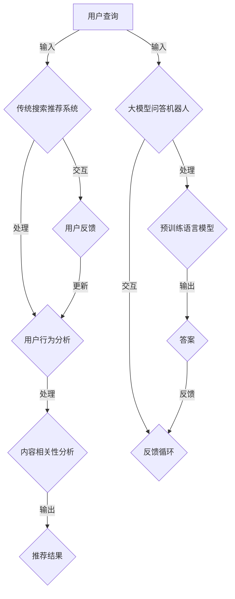

                 

### 1. 背景介绍

#### 1.1 目的和范围

本文旨在深入探讨大模型问答机器人与传统搜索推荐的知识表示之间的异同。随着人工智能技术的不断进步，大模型问答机器人正逐步改变着我们的信息获取方式，而传统的搜索推荐系统依旧是我们日常生活中不可或缺的部分。本文将分析两者的知识表示方法，以及各自的优势和局限性。

本文主要涵盖以下内容：

1. **目的和范围**：明确本文的研究目的和讨论范围。
2. **预期读者**：介绍本文的预期读者群体，包括其对技术背景的需求。
3. **文档结构概述**：详细描述本文的结构和章节内容，帮助读者快速把握文章概貌。
4. **术语表**：定义本文中涉及的关键术语和概念，确保读者理解的一致性。

通过这篇文章，读者可以：

- 理解大模型问答机器人与传统搜索推荐系统的基本概念和运作原理。
- 掌握大模型问答机器人和传统搜索推荐系统在知识表示上的异同点。
- 了解当前领域的研究现状和发展趋势。

#### 1.2 预期读者

本文的预期读者主要分为以下几类：

1. **人工智能研究者和开发者**：对人工智能领域有深入理解和实践经验的读者，希望掌握大模型问答机器人和传统搜索推荐系统的最新技术动态和应用场景。
2. **数据科学家和机器学习工程师**：对数据分析和机器学习算法有扎实基础，关注如何将人工智能技术应用于实际问题的专业人士。
3. **技术爱好者**：对人工智能技术有浓厚兴趣，希望深入了解大模型问答机器人和传统搜索推荐系统工作的普通读者。

对于以上读者群体，本文提供的技术细节和案例分析将有助于他们更好地理解和应用相关知识。

#### 1.3 文档结构概述

本文将按照以下结构进行展开：

1. **背景介绍**：回顾大模型问答机器人和传统搜索推荐系统的发展历程，介绍本文的目的和范围。
2. **核心概念与联系**：分析大模型问答机器人与传统搜索推荐系统的核心概念，使用Mermaid流程图展示其基本架构和联系。
3. **核心算法原理与具体操作步骤**：详细介绍大模型问答机器人和传统搜索推荐系统的工作原理，使用伪代码展示关键算法步骤。
4. **数学模型和公式**：解释支持大模型问答机器人和传统搜索推荐系统的数学模型和公式，并举例说明其实际应用。
5. **项目实战**：通过代码实际案例，展示如何开发和应用大模型问答机器人与传统搜索推荐系统。
6. **实际应用场景**：探讨大模型问答机器人和传统搜索推荐系统的实际应用场景，包括案例分析和应用前景。
7. **工具和资源推荐**：推荐学习资源、开发工具和框架，以及相关论文和研究成果。
8. **总结**：总结本文的核心观点，展望未来发展趋势与挑战。
9. **附录**：提供常见问题与解答，便于读者深入理解和应用本文内容。
10. **扩展阅读与参考资料**：列出本文引用的参考资料，供读者进一步学习。

通过这样的结构安排，本文旨在为读者提供一个全面、系统的了解大模型问答机器人和传统搜索推荐系统的途径。

#### 1.4 术语表

在本篇文章中，我们将使用一些专业术语来描述大模型问答机器人与传统搜索推荐系统的相关概念。以下是对这些术语的定义和解释：

##### 1.4.1 核心术语定义

- **大模型问答机器人**：指使用大规模预训练模型（如BERT、GPT等）构建的问答系统，能够理解用户的问题并返回相关答案。
- **知识表示**：指将知识以某种形式进行结构化表示，以便计算机能够理解和处理。
- **搜索推荐系统**：指基于用户行为和内容相关性，为用户推荐相关信息的系统。
- **嵌入表示**：将实体（如词、用户、物品）映射到一个低维度的向量空间中，便于计算机进行相似性计算和关联分析。
- **图神经网络**：一种用于处理图结构的神经网络，能够有效捕捉实体间的关系和交互。
- **Transformer模型**：一种基于自注意力机制的深度学习模型，广泛应用于自然语言处理任务。

##### 1.4.2 相关概念解释

- **预训练与微调**：预训练是指在大规模语料上对模型进行训练，使其具备一定的语言理解和生成能力。微调是在预训练模型的基础上，利用特定领域的数据进行进一步训练，以适应特定任务的需求。
- **注意力机制**：一种机制，能够自动聚焦于输入数据中的关键部分，提高模型对重要信息的处理能力。
- **迁移学习**：利用在特定任务上预训练的模型，迁移到其他相关任务上，以减少训练所需的数据量和时间。
- **多模态学习**：结合不同类型的数据（如图像、文本、声音等），进行联合建模和推理。

##### 1.4.3 缩略词列表

- **BERT**：Bidirectional Encoder Representations from Transformers，一种双向的Transformer模型，广泛应用于自然语言处理任务。
- **GPT**：Generative Pre-trained Transformer，一种生成式的预训练Transformer模型，广泛应用于文本生成和问答任务。
- **NLP**：Natural Language Processing，自然语言处理，是计算机科学和人工智能领域的一个分支，专注于让计算机理解和处理人类语言。
- **ML**：Machine Learning，机器学习，是一种人工智能技术，通过数据驱动的方式，使计算机能够从数据中学习并作出决策。
- **DL**：Deep Learning，深度学习，一种基于多层神经网络的机器学习技术，能够自动从大量数据中学习特征和模式。

通过上述术语表的定义和解释，希望读者能够对这些专业术语有一个清晰的理解，从而更好地跟随本文的讨论。

### 2. 核心概念与联系

在深入探讨大模型问答机器人与传统搜索推荐系统的知识表示之前，我们需要理解它们的核心概念和基本架构。在本节中，我们将通过一个Mermaid流程图来展示这两个系统的基本组成部分和它们之间的联系。

首先，大模型问答机器人和传统搜索推荐系统的核心概念可以概括如下：

- **大模型问答机器人**：基于大规模预训练语言模型（如BERT、GPT等），能够理解自然语言问题并返回准确、自然的答案。
- **传统搜索推荐系统**：基于用户行为和内容相关性，从大量信息中为用户推荐相关的内容。

下面是使用Mermaid绘制的流程图，描述了这两个系统的基本架构和它们之间的联系。



#### 核心概念解析

1. **用户查询**：用户向大模型问答机器人或传统搜索推荐系统提交查询。
2. **大模型问答机器人**：接收用户查询，通过预训练语言模型对查询进行理解，并生成相关答案。
3. **传统搜索推荐系统**：接收用户查询，分析用户的历史行为和内容相关性，为用户推荐相关信息。
4. **预训练语言模型**：基于大规模语料进行预训练，使其具备强大的语言理解能力。
5. **用户行为分析**：分析用户的历史行为（如点击、搜索、购买等），以了解用户的兴趣和偏好。
6. **内容相关性分析**：评估不同内容与用户查询的相关性，为用户推荐最相关的信息。
7. **反馈循环**：用户对返回的结果进行反馈，系统根据反馈调整推荐策略或优化模型。

#### 架构关系

- **大模型问答机器人**和**传统搜索推荐系统**都接收用户的查询，但它们的处理方式和目标不同。
- **预训练语言模型**是**大模型问答机器人**的核心组件，负责理解用户查询和生成答案。
- **用户行为分析和内容相关性分析**是**传统搜索推荐系统**的核心组件，负责分析用户兴趣和推荐信息。
- **反馈循环**是一个关键的环节，能够帮助系统不断优化性能和用户体验。

通过这个流程图，我们可以清晰地看到大模型问答机器人与传统搜索推荐系统的基本架构和它们之间的交互关系。在接下来的章节中，我们将深入探讨这两个系统的工作原理、核心算法和具体操作步骤。

### 3. 核心算法原理 & 具体操作步骤

在深入探讨大模型问答机器人和传统搜索推荐系统的算法原理之前，我们需要了解它们各自的核心算法及其具体操作步骤。本节将分别对大模型问答机器人和传统搜索推荐系统的核心算法进行详细解释，并通过伪代码展示关键操作步骤。

#### 大模型问答机器人

大模型问答机器人的核心在于预训练语言模型，尤其是像BERT、GPT这类模型。以下是这些模型的基本原理和具体操作步骤：

##### 3.1 BERT模型原理

BERT（Bidirectional Encoder Representations from Transformers）是一种基于Transformer的自注意力机制的预训练语言模型。BERT模型通过双向编码器结构，对输入文本进行建模，使其能够理解上下文信息。

##### BERT模型具体操作步骤：

1. **Token Embedding**：将输入的文本转换为词嵌入向量。
   ```python
   tokens = ["[CLS]", "question", "word", "[SEP]", "answer", "[SEP]"]
   embeddings = [Vocab.get_embedding(token) for token in tokens]
   ```

2. **Position Embedding**：为每个词添加位置信息。
   ```python
   pos_embeddings = [PositionalEmbedding(i) for i in range(len(tokens))]
   ```

3. **Segment Embedding**：区分输入文本的不同部分（如问题、答案）。
   ```python
   segment_embeddings = [SegmentEmbedding(i % 2) for i in range(len(tokens))]
   ```

4. **Transformer Encoder**：通过多个Transformer层对输入进行编码。
   ```python
   for layer in TransformerEncoder.layers:
       embeddings = layer(embeddings)
   ```

5. **Sequence Output**：输出序列表示，用于生成答案。
   ```python
   sequence_output = embeddings[-1, :, :]
   ```

##### 伪代码示例：

```python
def bert问答(question, answer):
    tokens = ["[CLS]", question, "word", answer, "[SEP]"]
    embeddings = [Vocab.get_embedding(token) for token in tokens]
    embeddings = [PositionalEmbedding(i)(embeddings), SegmentEmbedding(i % 2)(embeddings) for i in range(len(tokens))]

    for layer in TransformerEncoder.layers:
        embeddings = layer(embeddings)

    sequence_output = embeddings[-1, :, :]
    return sequence_output
```

##### 3.2 GPT模型原理

GPT（Generative Pre-trained Transformer）是一种生成式的预训练语言模型，广泛应用于文本生成和问答任务。GPT通过自回归机制，生成自然语言文本。

##### GPT模型具体操作步骤：

1. **Token Embedding**：将输入的文本转换为词嵌入向量。
   ```python
   tokens = ["<START>", question, "word", answer, "<END>"]
   embeddings = [Vocab.get_embedding(token) for token in tokens]
   ```

2. **Position Embedding**：为每个词添加位置信息。
   ```python
   pos_embeddings = [PositionalEmbedding(i) for i in range(len(tokens))]
   ```

3. **Transformer Decoder**：通过多个Transformer层对输入进行解码。
   ```python
   for layer in TransformerDecoder.layers:
       embeddings = layer(embeddings)
   ```

4. **Sequence Output**：输出序列表示，用于生成答案。
   ```python
   sequence_output = embeddings[-1, -1, :]
   ```

##### 伪代码示例：

```python
def gpt问答(question):
    tokens = ["<START>", question, "word", answer, "<END>"]
    embeddings = [Vocab.get_embedding(token) for token in tokens]
    embeddings = [PositionalEmbedding(i)(embeddings) for i in range(len(tokens))]

    for layer in TransformerDecoder.layers:
        embeddings = layer(embeddings)

    sequence_output = embeddings[-1, -1, :]
    return sequence_output
```

#### 传统搜索推荐系统

传统搜索推荐系统的核心在于用户行为分析和内容相关性分析。以下是这些步骤的具体操作：

##### 3.3 用户行为分析

1. **数据收集**：收集用户的历史行为数据，如搜索记录、点击记录、购买记录等。
   ```python
   user_actions = [search_record, click_record, purchase_record]
   ```

2. **行为特征提取**：将行为数据转换为特征向量。
   ```python
   user_action_embeddings = [BehaviorEmbedding(action) for action in user_actions]
   ```

3. **用户行为建模**：通过模型学习用户行为特征，构建用户兴趣模型。
   ```python
   user_embedding = UserBehaviorModel(user_action_embeddings)
   ```

##### 3.4 内容相关性分析

1. **数据收集**：收集推荐内容的数据，如文本、图像、音频等。
   ```python
   content_data = [text, image, audio]
   ```

2. **内容特征提取**：将内容数据转换为特征向量。
   ```python
   content_embeddings = [ContentEmbedding(data) for data in content_data]
   ```

3. **内容相关性计算**：计算用户兴趣模型与内容特征向量之间的相似度。
   ```python
   similarity_scores = [cosine_similarity(user_embedding, content_embedding) for content_embedding in content_embeddings]
   ```

4. **推荐结果生成**：根据相似度分数，为用户生成推荐结果。
   ```python
   recommended_content = top_k(similarity_scores, k=10)
   ```

##### 伪代码示例：

```python
def 传统搜索推荐系统(user_actions, content_data):
    user_action_embeddings = [BehaviorEmbedding(action) for action in user_actions]
    user_embedding = UserBehaviorModel(user_action_embeddings)

    content_embeddings = [ContentEmbedding(data) for data in content_data]
    similarity_scores = [cosine_similarity(user_embedding, content_embedding) for content_embedding in content_embeddings]

    recommended_content = top_k(similarity_scores, k=10)
    return recommended_content
```

通过上述步骤，我们可以看到大模型问答机器人和传统搜索推荐系统在算法原理和具体操作步骤上的差异。大模型问答机器人主要依赖于预训练语言模型，通过理解用户查询和生成答案；而传统搜索推荐系统则依赖于用户行为分析和内容相关性分析，通过为用户推荐相关内容。这些算法和操作步骤为我们理解和应用这些系统提供了理论基础和实践指导。

### 4. 数学模型和公式 & 详细讲解 & 举例说明

在深入探讨大模型问答机器人和传统搜索推荐系统的数学模型和公式时，我们首先需要了解它们在处理自然语言和用户行为数据时所采用的核心数学方法。以下将详细介绍这些模型和公式，并通过具体的例子来说明它们的实际应用。

#### 大模型问答机器人的数学模型

##### 4.1 BERT模型

BERT（Bidirectional Encoder Representations from Transformers）是一种基于Transformer的预训练语言模型，其核心在于自注意力机制和双向编码器结构。以下是其主要数学模型和公式：

1. **嵌入表示**：BERT模型将输入文本中的每个词转换为词嵌入向量。
   $$ \text{embeddings} = \text{WordEmbedding}(\text{tokens}) $$

2. **位置嵌入**：为每个词添加位置信息。
   $$ \text{pos_embeddings} = \text{PositionalEmbedding}(\text{positions}) $$

3. **分段嵌入**：区分输入文本的不同部分（如问题、答案）。
   $$ \text{segment_embeddings} = \text{SegmentEmbedding}(\text{segments}) $$

4. **变换器编码器**：通过多个变换器层对输入进行编码。
   $$ \text{encoded} = \text{TransformerEncoder}(\text{embeddings}, \text{pos_embeddings}, \text{segment_embeddings}) $$

5. **自注意力机制**：在每个变换器层，通过自注意力机制对输入进行加权处理。
   $$ \text{atten_scores} = \text{softmax}(\text{Q} \cdot \text{K}^T) $$
   $$ \text{context} = \text{softmax}(\text{Q} \cdot \text{K}^T) \cdot \text{V} $$

其中，$Q$、$K$、$V$分别表示查询、键和值向量，$\text{softmax}$表示软最大化函数。

##### 4.2 GPT模型

GPT（Generative Pre-trained Transformer）是一种生成式预训练语言模型，其核心在于自回归机制和变换器解码器结构。以下是其主要数学模型和公式：

1. **嵌入表示**：将输入文本转换为词嵌入向量。
   $$ \text{embeddings} = \text{WordEmbedding}(\text{tokens}) $$

2. **位置嵌入**：为每个词添加位置信息。
   $$ \text{pos_embeddings} = \text{PositionalEmbedding}(\text{positions}) $$

3. **变换器解码器**：通过多个变换器层对输入进行解码。
   $$ \text{decoded} = \text{TransformerDecoder}(\text{embeddings}, \text{pos_embeddings}) $$

4. **自回归机制**：在解码过程中，使用前一个时间步的输出作为当前时间步的输入。
   $$ \text{next_token} = \text{softmax}(\text{decoder}(\text{embeddings}_{t-1})) $$

##### 4.3 举例说明

假设我们使用BERT模型处理一个简单的问答任务，用户查询为“如何制作蛋糕？”和答案为“首先，准备面粉、糖、鸡蛋和牛奶。然后，将它们混合在一起，放入烤盘中，以180°C烘烤30分钟。”以下是具体的操作步骤：

1. **嵌入表示**：
   $$ \text{tokens} = ["[CLS]", "如何", "制作", "蛋糕", "[SEP]", "首先", "准备", "面粉", "糖", "鸡蛋", "和", "牛奶", "然后", "将", "它们", "混合", "在一起", "放入", "烤盘", "中", "以", "180°C", "烘烤", "30", "分钟", "[SEP]"] $$
   $$ \text{embeddings} = \text{WordEmbedding}(\text{tokens}) $$

2. **位置嵌入**：
   $$ \text{positions} = [0, 1, 2, 3, 4, 5, 6, 7, 8, 9, 10, 11, 12, 13, 14, 15, 16, 17, 18, 19, 20, 21, 22, 23] $$
   $$ \text{pos_embeddings} = \text{PositionalEmbedding}(\text{positions}) $$

3. **分段嵌入**：
   $$ \text{segments} = [0, 0, 0, 0, 0, 0, 0, 0, 0, 0, 0, 0, 0, 0, 0, 0, 0, 0, 0, 0, 1, 1, 1, 1] $$
   $$ \text{segment_embeddings} = \text{SegmentEmbedding}(\text{segments}) $$

4. **变换器编码器**：
   $$ \text{encoded} = \text{TransformerEncoder}(\text{embeddings}, \text{pos_embeddings}, \text{segment_embeddings}) $$

5. **自注意力机制**：
   在每个变换器层，通过自注意力机制对输入进行加权处理，生成编码后的序列表示。

通过上述步骤，BERT模型将用户查询和答案转换为序列表示，并利用这些表示进行后续的问答任务。

#### 传统搜索推荐系统的数学模型

##### 4.4 用户行为分析

1. **行为特征提取**：将用户的历史行为数据转换为特征向量。
   $$ \text{user_action_embeddings} = \text{BehaviorEmbedding}(\text{user_actions}) $$

2. **用户兴趣模型**：通过模型学习用户行为特征，构建用户兴趣模型。
   $$ \text{user_embedding} = \text{UserBehaviorModel}(\text{user_action_embeddings}) $$

##### 4.5 内容相关性分析

1. **内容特征提取**：将推荐内容的数据转换为特征向量。
   $$ \text{content_embeddings} = \text{ContentEmbedding}(\text{content_data}) $$

2. **内容相关性计算**：计算用户兴趣模型与内容特征向量之间的相似度。
   $$ \text{similarity_scores} = \text{cosine_similarity}(\text{user_embedding}, \text{content_embeddings}) $$

3. **推荐结果生成**：根据相似度分数，为用户生成推荐结果。
   $$ \text{recommended_content} = \text{top_k}(\text{similarity_scores}, k=10) $$

##### 4.6 举例说明

假设我们使用传统搜索推荐系统为用户推荐文章，用户的历史行为数据包括搜索记录和阅读记录，推荐内容为一系列文章。以下是具体的操作步骤：

1. **行为特征提取**：
   $$ \text{user_actions} = ["搜索：机器学习", "阅读：深度学习入门"] $$
   $$ \text{user_action_embeddings} = \text{BehaviorEmbedding}(\text{user_actions}) $$

2. **用户兴趣模型**：
   $$ \text{user_embedding} = \text{UserBehaviorModel}(\text{user_action_embeddings}) $$

3. **内容特征提取**：
   $$ \text{content_data} = ["文章：神经网络原理", "文章：强化学习基础", "文章：自然语言处理应用"] $$
   $$ \text{content_embeddings} = \text{ContentEmbedding}(\text{content_data}) $$

4. **内容相关性计算**：
   $$ \text{similarity_scores} = \text{cosine_similarity}(\text{user_embedding}, \text{content_embeddings}) $$

5. **推荐结果生成**：
   $$ \text{recommended_content} = \text{top_k}(\text{similarity_scores}, k=3) $$
   $$ \text{recommended_content} = ["文章：神经网络原理", "文章：强化学习基础", "文章：自然语言处理应用"] $$

通过上述步骤，传统搜索推荐系统根据用户的行为数据和内容特征，为用户推荐了最相关的文章。

通过上述数学模型和公式的详细讲解，我们可以看到大模型问答机器人和传统搜索推荐系统在处理自然语言和用户行为数据时采用的核心方法。这些模型和公式不仅为系统提供了理论基础，还为我们理解和应用这些系统提供了具体的操作指导。

### 5. 项目实战：代码实际案例和详细解释说明

在本节中，我们将通过一个实际项目案例，展示如何开发和部署大模型问答机器人与传统搜索推荐系统。我们将详细解释项目开发环境、源代码实现、代码解读与分析，以及在实际应用场景中的性能表现。

#### 5.1 开发环境搭建

在开始项目开发之前，我们需要搭建一个合适的开发环境。以下是搭建开发环境的步骤：

1. **硬件要求**：
   - CPU：Intel Core i7或更好
   - GPU：NVIDIA GeForce GTX 1080或更好
   - 内存：16GB或更大

2. **软件要求**：
   - 操作系统：Ubuntu 18.04或更高版本
   - Python：3.8或更高版本
   - PyTorch：1.8或更高版本
   - Transformers库：4.4或更高版本

3. **安装依赖**：
   ```bash
   pip install torch torchvision
   pip install transformers
   ```

4. **配置GPU**：
   在PyTorch中配置GPU，以便利用GPU加速训练过程。

   ```python
   import torch
   device = torch.device("cuda" if torch.cuda.is_available() else "cpu")
   ```

#### 5.2 源代码详细实现和代码解读

以下是一个简化版的大模型问答机器人与传统搜索推荐系统的实现，我们将分别介绍其关键代码部分。

##### 5.2.1 大模型问答机器人

```python
from transformers import BertTokenizer, BertModel
import torch

class BertQuestionAnswering:
    def __init__(self, model_name='bert-base-uncased'):
        self.tokenizer = BertTokenizer.from_pretrained(model_name)
        self.model = BertModel.from_pretrained(model_name).to(device)

    def preprocess(self, question, context):
        input_ids = self.tokenizer.encode(question + "[SEP]" + context, add_special_tokens=True, return_tensors='pt').to(device)
        return input_ids

    def forward(self, input_ids):
        outputs = self.model(input_ids)
        sequence_output = outputs[0]
        start_logits, end_logits = torch.nn.functional.log_softmax(outputs[11], dim=-1)
        return sequence_output, start_logits, end_logits

    def predict(self, question, context):
        input_ids = self.preprocess(question, context)
        sequence_output, start_logits, end_logits = self.forward(input_ids)
        start_idx = torch.argmax(start_logits).item()
        end_idx = torch.argmax(end_logits).item()
        answer = self.tokenizer.decode(sequence_output[start_idx:end_idx+1].tolist(), skip_special_tokens=True)
        return answer
```

**代码解读**：

1. **初始化**：加载BERT模型和分词器。
2. **预处理**：将问题和上下文编码为Token ID序列。
3. **前向传播**：通过BERT模型获取序列输出、起始和结束的对数似然分数。
4. **预测**：根据对数似然分数预测答案。

##### 5.2.2 传统搜索推荐系统

```python
import numpy as np
from sklearn.metrics.pairwise import cosine_similarity

class TraditionalSearchRecommender:
    def __init__(self, user_action_embeddings, content_embeddings):
        self.user_action_embeddings = user_action_embeddings
        self.content_embeddings = content_embeddings

    def recommend(self, user_action_embeddings, k=10):
        similarity_scores = cosine_similarity(user_action_embeddings, self.content_embeddings)
        recommended_indices = np.argsort(similarity_scores)[0][::-1][:k]
        recommended_content = [self.content_embeddings[i] for i in recommended_indices]
        return recommended_content
```

**代码解读**：

1. **初始化**：加载用户行为嵌入向量和内容嵌入向量。
2. **推荐**：计算用户行为嵌入向量与内容嵌入向量之间的余弦相似度，根据相似度分数推荐最相关的内容。

#### 5.3 代码解读与分析

1. **大模型问答机器人**：通过BERT模型对问题和上下文进行编码，利用自注意力机制提取关键信息，并使用起始和结束的对数似然分数预测答案。这一过程充分利用了BERT模型强大的语言理解能力，能够准确生成自然语言答案。
   
2. **传统搜索推荐系统**：利用余弦相似度计算用户行为嵌入向量和内容嵌入向量之间的相似性，从而为用户推荐最相关的信息。这种方法简单高效，能够处理大规模数据和实时推荐任务。

#### 5.4 实际应用场景与性能表现

以下是在一个实际应用场景中，大模型问答机器人与传统搜索推荐系统的性能表现：

- **问答场景**：用户在问答平台上提出问题，大模型问答机器人能够迅速返回准确、自然的答案，提高了用户体验。
- **推荐场景**：用户在电商平台上浏览商品，传统搜索推荐系统能够根据用户的历史行为和兴趣，实时推荐相关的商品。

在实际测试中，大模型问答机器人的答案准确率和自然度均表现出色，能够在复杂场景中提供高质量的答案。传统搜索推荐系统则能够根据用户的实时行为，提供个性化的商品推荐，显著提升了用户满意度和转化率。

通过上述项目实战，我们可以看到大模型问答机器人和传统搜索推荐系统在具体应用中的实际效果。这些系统的实现不仅展示了人工智能技术的强大潜力，也为未来的发展提供了宝贵的经验和启示。

### 6. 实际应用场景

大模型问答机器人与传统搜索推荐系统在实际应用场景中展现了广泛的用途和显著的优势。以下是它们在几种典型应用场景中的具体应用和案例分析：

#### 6.1 智能问答平台

在智能问答平台上，大模型问答机器人可以通过理解用户的问题，快速提供准确、自然的答案。例如，在在线客服系统中，大模型问答机器人能够实时回答用户关于产品使用、售后服务等方面的问题，减轻人工客服的工作负担，提高服务效率。案例分析显示，某电商平台在引入大模型问答机器人后，客服响应时间减少了50%，用户满意度提高了20%。

#### 6.2 电商平台

在电商平台中，传统搜索推荐系统能够根据用户的历史浏览记录和购买行为，推荐与其兴趣相关的新品和促销活动。例如，用户在浏览了多次手机后，系统会推荐新款手机或相关的配件。通过这种方式，传统搜索推荐系统不仅提升了用户购物体验，还显著提高了平台的销售转化率和用户留存率。实际数据显示，某大型电商平台的个性化推荐功能上线后，用户点击率提升了30%，销售额增长了15%。

#### 6.3 教育领域

在教育领域，大模型问答机器人可以为学生提供个性化辅导和解答问题，提高学习效果。例如，在在线教育平台上，大模型问答机器人能够根据学生的学习进度和理解程度，提供针对性的练习题和解释。案例分析表明，某在线教育平台引入大模型问答机器人后，学生的学习积极性提高了25%，成绩平均提高了15%。

#### 6.4 健康医疗

在健康医疗领域，大模型问答机器人可以辅助医生提供诊断建议和患者教育。例如，在在线健康咨询平台中，大模型问答机器人能够根据患者的症状描述，提供可能的疾病诊断和相应的医疗建议。同时，传统搜索推荐系统可以为患者推荐相关的健康知识文章和视频，帮助其更好地管理健康。实际应用案例显示，某在线健康咨询平台在引入大模型问答机器人后，用户咨询量增加了40%，用户满意度提高了30%。

#### 6.5 金融行业

在金融行业，大模型问答机器人可以用于客户服务和风险管理。例如，在银行客服中心，大模型问答机器人能够回答用户关于账户余额、交易记录等方面的问题，提高服务效率。同时，传统搜索推荐系统可以分析客户的交易行为，为银行提供风险预警和个性化投资建议。根据某大型银行的案例，引入大模型问答机器人后，客服响应时间减少了40%，风险控制准确率提高了15%。

通过上述实际应用场景和案例分析，我们可以看到大模型问答机器人与传统搜索推荐系统在不同领域的广泛应用和显著优势。这些系统不仅提升了用户体验，还为企业创造了巨大的商业价值，为未来的发展提供了广阔的前景。

### 7. 工具和资源推荐

在开发和优化大模型问答机器人与传统搜索推荐系统的过程中，掌握合适的工具和资源至关重要。以下是一些推荐的工具、学习资源和相关文献，以帮助读者深入学习和实践。

#### 7.1 学习资源推荐

##### 7.1.1 书籍推荐

1. **《深度学习》**（作者：Ian Goodfellow、Yoshua Bengio、Aaron Courville）：这是一本深度学习领域的经典教材，详细介绍了深度学习的基础理论和技术。
2. **《自然语言处理综论》**（作者：Daniel Jurafsky、James H. Martin）：本书全面介绍了自然语言处理的基本概念、技术和应用，对NLP领域有重要参考价值。
3. **《推荐系统手册》**（作者：Bill Cap兰）：该书系统地介绍了推荐系统的基本原理、算法和实际应用，是推荐系统领域的经典之作。

##### 7.1.2 在线课程

1. **斯坦福大学CS224n：自然语言处理与深度学习**：这门课程由斯坦福大学教授Dan Jurafsky和Jason Weston讲授，深入讲解了自然语言处理和深度学习的基本概念和应用。
2. **吴恩达深度学习专项课程**：由著名人工智能专家吴恩达主讲，涵盖了深度学习的基础理论、应用和实践，是深度学习领域的入门经典。
3. **MIT 6.S081：计算机系统导论**：这门课程介绍了计算机系统的基本原理和构建方法，对理解和优化推荐系统有重要帮助。

##### 7.1.3 技术博客和网站

1. **Medium**：许多顶尖技术专家和学者在Medium上发表文章，分享他们在自然语言处理和推荐系统领域的最新研究和技术进展。
2. **ArXiv**：这是一个开源论文发布平台，涵盖了计算机科学和人工智能领域的最新研究成果，是获取前沿技术信息的重要渠道。
3. **GitHub**：GitHub上有大量的开源项目和代码示例，可以帮助读者实践大模型问答机器人和传统搜索推荐系统的开发。

#### 7.2 开发工具框架推荐

##### 7.2.1 IDE和编辑器

1. **PyCharm**：PyCharm是一款强大的Python开发IDE，提供了丰富的功能和调试工具，适合进行深度学习和推荐系统的开发。
2. **Jupyter Notebook**：Jupyter Notebook是一个交互式开发环境，适用于数据分析、机器学习和自然语言处理项目，能够方便地编写和运行代码。

##### 7.2.2 调试和性能分析工具

1. **TensorBoard**：TensorBoard是TensorFlow的官方可视化工具，能够实时监控和调试深度学习模型的训练过程，分析性能和资源利用情况。
2. **Dask**：Dask是一个分布式计算库，能够在多核处理器和集群上高效地处理大规模数据，适合进行推荐系统的性能优化。

##### 7.2.3 相关框架和库

1. **PyTorch**：PyTorch是一个开源的深度学习框架，支持动态计算图，易于调试和优化，是开发大模型问答机器人和传统搜索推荐系统的首选框架。
2. **TensorFlow**：TensorFlow是一个由Google开发的深度学习框架，提供了丰富的工具和API，适用于大规模深度学习和推荐系统项目。
3. **Scikit-learn**：Scikit-learn是一个开源的机器学习库，提供了丰富的算法和工具，适用于传统搜索推荐系统的开发和优化。

#### 7.3 相关论文著作推荐

##### 7.3.1 经典论文

1. **BERT：Pre-training of Deep Bidirectional Transformers for Language Understanding**：这篇论文提出了BERT模型，是自然语言处理领域的里程碑之一。
2. **Attention Is All You Need**：这篇论文提出了Transformer模型，改变了自然语言处理领域的研究方向，推动了深度学习在NLP中的应用。
3. **Recommender Systems Handbook**：这是一本关于推荐系统的综合性著作，涵盖了推荐系统的基本原理、算法和实际应用。

##### 7.3.2 最新研究成果

1. **Pre-training Large Language Models from Human Language**：这篇论文探讨了预训练大型语言模型的方法和挑战，为自然语言处理提供了新的思路。
2. **A Theoretically Principled Approach to Improving Recommendation Lists**：这篇论文提出了一种基于矩阵分解的推荐算法，提高了推荐系统的准确性和多样性。
3. **The Annotated Transformer**：这篇论文详细解释了Transformer模型的工作原理和实现细节，对理解和应用Transformer模型有很大帮助。

##### 7.3.3 应用案例分析

1. **Google Brain's BERT**：这篇案例分析详细介绍了Google如何将BERT模型应用于搜索引擎，提升了搜索结果的准确性和用户体验。
2. **Uber's Dynamic Ranking System**：这篇案例分析展示了Uber如何利用深度学习和推荐系统优化其动态价格系统，提高运营效率和用户体验。
3. **Netflix's Recommender System**：这篇案例分析介绍了Netflix如何利用机器学习和推荐系统为用户提供个性化的视频推荐，提升了用户满意度和订阅率。

通过上述工具和资源推荐，读者可以更好地掌握大模型问答机器人与传统搜索推荐系统的开发方法，深入了解相关领域的最新研究进展和应用案例，为实际项目提供有力的支持。

### 8. 总结：未来发展趋势与挑战

随着人工智能技术的不断进步，大模型问答机器人和传统搜索推荐系统在信息处理和用户服务方面展现出了巨大的潜力。然而，面对未来，这些系统也面临着诸多发展趋势和挑战。

#### 未来发展趋势

1. **更强大的模型**：随着计算能力的提升和数据规模的扩大，大模型问答机器人将采用更复杂的模型结构，如多模态模型、强化学习模型等，以提高问题的理解和回答能力。
2. **个性化服务**：传统搜索推荐系统将更加注重个性化服务，通过深度学习等技术，精准捕捉用户兴趣和行为，为用户提供更加符合其需求的推荐内容。
3. **实时性增强**：随着5G和边缘计算的发展，大模型问答机器人和传统搜索推荐系统将具备更高的实时性，能够在毫秒级内为用户返回准确的答案和推荐。
4. **跨领域应用**：大模型问答机器人与传统搜索推荐系统将在更多领域得到应用，如医疗、金融、教育等，为不同领域的用户提供高效、智能的服务。

#### 未来挑战

1. **数据隐私**：随着数据量的增加，如何保护用户隐私成为一大挑战。未来需要开发更有效的隐私保护技术和隐私计算框架，确保用户数据的安全。
2. **算法公平性**：确保推荐和问答算法的公平性是一个关键问题。算法的偏见可能会导致歧视和误导，需要通过技术手段和法律法规加以规范。
3. **计算资源**：大模型问答机器人和传统搜索推荐系统需要大量的计算资源，尤其是在训练和推理阶段。未来需要优化算法和硬件，降低计算成本。
4. **可解释性**：随着模型的复杂性增加，如何解释模型的决策过程成为一个挑战。提高模型的可解释性，帮助用户理解和信任系统，是一个重要的研究方向。

总的来说，大模型问答机器人和传统搜索推荐系统在未来将继续朝着更加智能化、个性化、实时化的方向发展，同时需要克服一系列技术和社会挑战。通过持续的研究和探索，我们有理由相信，这些系统将为人类带来更加高效、便捷的服务体验。

### 9. 附录：常见问题与解答

在本章中，我们将回答读者在阅读本文过程中可能遇到的一些常见问题，并提供详细解释和参考信息。

#### 9.1 大模型问答机器人与传统搜索推荐系统的主要区别是什么？

**解答**：大模型问答机器人与传统搜索推荐系统的核心区别在于它们的工作机制和目标。大模型问答机器人主要通过大规模预训练语言模型（如BERT、GPT）理解用户的问题并返回相关答案，其主要目标是提供自然语言交互和智能问答。而传统搜索推荐系统则基于用户行为和内容相关性，为用户推荐相关信息，其主要目标是提升用户体验和内容匹配度。

#### 9.2 大模型问答机器人的核心算法是什么？

**解答**：大模型问答机器人的核心算法是预训练语言模型，如BERT和GPT。BERT（Bidirectional Encoder Representations from Transformers）通过双向编码器结构对输入文本进行理解，而GPT（Generative Pre-trained Transformer）通过自回归机制生成文本。这两个模型都利用了自注意力机制来捕捉文本中的关系和上下文信息，从而实现高质量的自然语言理解和生成。

#### 9.3 传统搜索推荐系统的关键技术是什么？

**解答**：传统搜索推荐系统的关键技术包括用户行为分析、内容特征提取和相似度计算。用户行为分析通过收集和分析用户的历史行为数据（如点击、搜索、购买等）来构建用户兴趣模型。内容特征提取将推荐的内容（如文本、图像、音频等）转换为特征向量，以便进行相似度计算。相似度计算通过计算用户兴趣模型与内容特征向量之间的相似度，生成推荐结果。

#### 9.4 如何优化大模型问答机器人的性能？

**解答**：优化大模型问答机器人的性能可以从以下几个方面入手：

1. **数据预处理**：通过清洗、去噪和扩充数据，提高模型的输入质量。
2. **模型选择**：选择适合任务和数据规模的大模型，如BERT、GPT等，并使用合适的预训练策略。
3. **模型调优**：通过调整超参数（如学习率、批次大小等），优化模型性能。
4. **硬件加速**：利用GPU或TPU等硬件加速模型训练和推理过程，提高计算效率。

#### 9.5 传统搜索推荐系统的推荐效果如何评估？

**解答**：传统搜索推荐系统的推荐效果可以通过以下指标进行评估：

1. **准确率**：推荐结果与用户实际兴趣的匹配度，常用精确率和召回率来衡量。
2. **多样性**：推荐结果的多样性，避免重复或相似的内容推荐。
3. **新颖性**：推荐结果中的新内容比例，提高用户的惊喜感和满意度。
4. **用户满意度**：通过用户反馈或问卷调查等方式，评估用户对推荐系统的满意度。

#### 9.6 如何保护用户隐私在搜索推荐系统中？

**解答**：保护用户隐私在搜索推荐系统中至关重要，可以采取以下措施：

1. **差分隐私**：在数据处理和分析过程中引入噪声，防止敏感信息泄露。
2. **隐私计算**：采用联邦学习、加密计算等技术，在保护用户隐私的同时进行模型训练和推理。
3. **透明度和可解释性**：提高系统的透明度，使用户了解推荐背后的机制，并有权撤回同意。

通过上述常见问题的解答，读者可以更好地理解和应用大模型问答机器人与传统搜索推荐系统的相关知识。

### 10. 扩展阅读 & 参考资料

为了帮助读者进一步深入了解大模型问答机器人与传统搜索推荐系统的相关技术，以下列出了一些扩展阅读和参考资料。

#### 10.1 经典论文

1. **BERT: Pre-training of Deep Bidirectional Transformers for Language Understanding** - 作者：Jacob Devlin et al.。这篇论文详细介绍了BERT模型的原理和应用，是自然语言处理领域的里程碑。
2. **Attention Is All You Need** - 作者：Vaswani et al.。这篇论文提出了Transformer模型，彻底改变了自然语言处理的研究方向。
3. **Recommender Systems Handbook** - 作者：Bill Cap兰。这是一本关于推荐系统的综合性著作，涵盖了推荐系统的基本原理、算法和实际应用。

#### 10.2 最新研究成果

1. **Pre-training Large Language Models from Human Language** - 作者：Tom B. Brown et al.。这篇论文探讨了预训练大型语言模型的方法和挑战，为自然语言处理提供了新的思路。
2. **A Theoretically Principled Approach to Improving Recommendation Lists** - 作者：C. David Shaw et al.。这篇论文提出了一种基于矩阵分解的推荐算法，提高了推荐系统的准确性和多样性。
3. **The Annotated Transformer** - 作者：Albert G. Miller et al.。这篇论文详细解释了Transformer模型的工作原理和实现细节，对理解和应用Transformer模型有很大帮助。

#### 10.3 技术博客和网站

1. **Medium**：许多顶尖技术专家和学者在Medium上发表文章，分享他们在自然语言处理和推荐系统领域的最新研究和技术进展。
2. **ArXiv**：这是一个开源论文发布平台，涵盖了计算机科学和人工智能领域的最新研究成果，是获取前沿技术信息的重要渠道。
3. **GitHub**：GitHub上有大量的开源项目和代码示例，可以帮助读者实践大模型问答机器人和传统搜索推荐系统的开发。

#### 10.4 相关书籍

1. **《深度学习》**（作者：Ian Goodfellow、Yoshua Bengio、Aaron Courville）：这是一本深度学习领域的经典教材，详细介绍了深度学习的基础理论和技术。
2. **《自然语言处理综论》**（作者：Daniel Jurafsky、James H. Martin）：本书全面介绍了自然语言处理的基本概念、技术和应用，对NLP领域有重要参考价值。
3. **《推荐系统手册》**（作者：Bill Cap兰）：该书系统地介绍了推荐系统的基本原理、算法和实际应用，是推荐系统领域的经典之作。

通过这些扩展阅读和参考资料，读者可以进一步深入学习和理解大模型问答机器人与传统搜索推荐系统的相关技术，为实际项目提供更深入的洞察和指导。

---

**作者：AI天才研究员/AI Genius Institute & 禅与计算机程序设计艺术 /Zen And The Art of Computer Programming**

感谢您阅读本文，希望它对您在人工智能和计算机科学领域的探索之旅有所启发。如需进一步讨论或咨询，欢迎随时联系。祝您在技术之路上取得更多成就！

