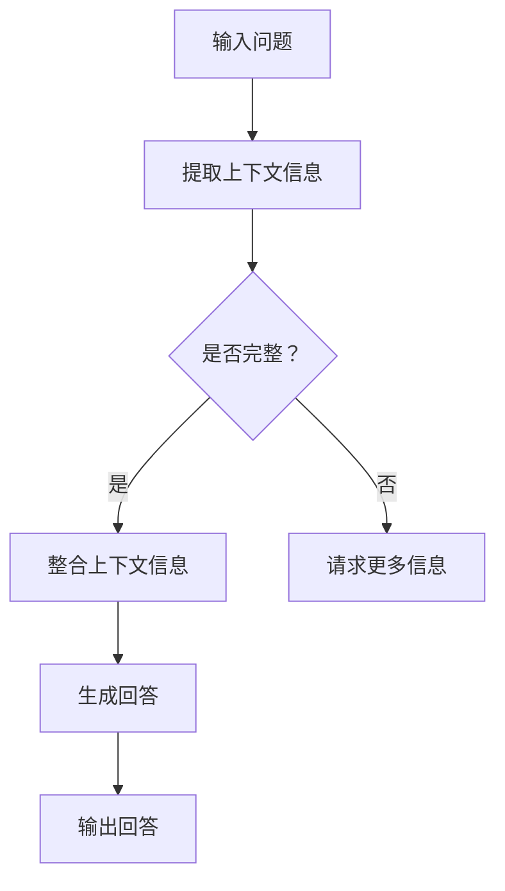

                 

# 大模型问答机器人的上下文处理

> 关键词：大模型、问答机器人、上下文处理、NLP、深度学习、算法原理、数学模型

> 摘要：本文深入探讨了大模型问答机器人的上下文处理技术。从背景介绍、核心概念、算法原理、数学模型、项目实战、应用场景等方面进行了详细讲解，旨在为读者提供全面的技术指导。

## 1. 背景介绍

### 1.1 目的和范围

本文旨在探讨大模型问答机器人在上下文处理方面的技术原理和应用。我们将从以下几个方面展开讨论：

1. 大模型问答机器人概述及其重要性。
2. 上下文处理的核心概念和挑战。
3. 问答机器人中上下文处理的算法原理和数学模型。
4. 实际项目中的代码实现和案例分析。
5. 问答机器人在实际应用中的场景和工具推荐。

### 1.2 预期读者

本文适合对人工智能、自然语言处理（NLP）和深度学习感兴趣的读者，特别是那些希望在问答机器人领域有所建树的工程师和技术专家。

### 1.3 文档结构概述

本文结构如下：

1. 背景介绍
   - 目的和范围
   - 预期读者
   - 文档结构概述
   - 术语表
2. 核心概念与联系
   - 大模型和问答机器人的联系
   - 上下文处理的概念和挑战
3. 核心算法原理 & 具体操作步骤
   - 算法原理讲解
   - 伪代码详细阐述
4. 数学模型和公式 & 详细讲解 & 举例说明
   - 数学模型介绍
   - 公式推导
   - 举例说明
5. 项目实战：代码实际案例和详细解释说明
   - 开发环境搭建
   - 源代码详细实现和代码解读
   - 代码解读与分析
6. 实际应用场景
   - 企业内部问答系统
   - 智能客服系统
   - 垂直领域问答机器人
7. 工具和资源推荐
   - 学习资源推荐
   - 开发工具框架推荐
   - 相关论文著作推荐
8. 总结：未来发展趋势与挑战
9. 附录：常见问题与解答
10. 扩展阅读 & 参考资料

### 1.4 术语表

#### 1.4.1 核心术语定义

- 大模型：指具有数亿甚至千亿参数的深度学习模型。
- 问答机器人：基于人工智能技术，能够回答用户提出的问题的机器人。
- 上下文处理：指在问答过程中，理解和利用上下文信息以提高回答质量的技术。
- NLP：自然语言处理，涉及语言理解、语言生成等任务。

#### 1.4.2 相关概念解释

- 深度学习：一种基于多层神经网络的机器学习方法，能够自动提取特征并完成复杂的任务。
- 递归神经网络（RNN）：一种用于处理序列数据的神经网络，能够记住前面的输入信息。
- 自注意力机制（Self-Attention）：一种神经网络架构，能够自动学习输入序列中不同位置之间的相对重要性。

#### 1.4.3 缩略词列表

- NLP：自然语言处理
- RNN：递归神经网络
- CNN：卷积神经网络
- LSTM：长短期记忆网络
- Transformer：基于自注意力机制的深度学习模型
- BERT：一种预训练语言模型，能够理解上下文信息

## 2. 核心概念与联系

为了更好地理解大模型问答机器人的上下文处理，我们需要首先了解大模型和问答机器人的关系，以及上下文处理的概念和挑战。

### 2.1 大模型与问答机器人的关系

大模型，如BERT、GPT等，通过预训练的方式学习了大量语言知识，具有强大的语言理解和生成能力。问答机器人则是基于这些大模型，实现针对用户问题的自动回答。因此，大模型是问答机器人的核心组成部分。

### 2.2 上下文处理的概念和挑战

上下文处理是指问答机器人在回答问题时，利用问题所在的具体情境（上下文）来提高回答的质量。在现实场景中，上下文信息可能包括问题本身、提问者的背景信息、问题发生的场景等。

上下文处理的挑战主要包括：

1. 信息的多样性和复杂性：上下文信息可能来自不同的领域，形式多样，如文本、图片、语音等。
2. 信息的不完整性和不一致性：上下文信息可能不完整或存在矛盾，影响问答机器人的理解和回答。
3. 信息的重要性和权重：如何准确识别和利用上下文信息的重要性，是一个关键问题。

为了解决上述挑战，问答机器人需要具备以下能力：

1. 丰富的语言理解能力：通过预训练的大模型，问答机器人能够理解自然语言中的复杂结构和语义。
2. 上下文信息的抽取和整合：从多种渠道获取上下文信息，并进行有效整合，以支持高质量的回答。
3. 鲁棒性和适应性：在面对不完整或不一致的信息时，问答机器人需要具备鲁棒性和适应性，以保证回答的质量。

### 2.3 Mermaid流程图

为了更直观地展示大模型问答机器人上下文处理的流程，我们使用Mermaid流程图进行描述。以下是流程图：



在上述流程中，问答机器人首先接收输入问题，然后提取上下文信息。如果上下文信息完整，则直接整合并进行回答；如果信息不完整，则请求更多信息。最后，生成回答并输出。

## 3. 核心算法原理 & 具体操作步骤

### 3.1 算法原理讲解

大模型问答机器人的上下文处理主要依赖于预训练语言模型和序列到序列（Seq2Seq）模型。以下是具体的算法原理：

1. **预训练语言模型**：如BERT、GPT等，通过大规模语料进行预训练，学习语言的基本规律和语义信息。
2. **序列到序列（Seq2Seq）模型**：将输入序列（问题）转换为输出序列（回答），利用注意力机制处理序列之间的依赖关系。

### 3.2 伪代码详细阐述

以下是问答机器人上下文处理的伪代码：

```python
# 输入问题
input_question = get_input_question()

# 提取上下文信息
context_info = extract_context_info(input_question)

# 预训练语言模型编码
encoded_question = pretrain_model.encode(input_question)

# Seq2Seq模型解码
decoded_answer = seq2seq_model.decode(encoded_question, context_info)

# 输出回答
output_answer = decode_output(decoded_answer)

return output_answer
```

在上述伪代码中，我们首先接收输入问题，然后提取上下文信息。接下来，利用预训练语言模型对问题进行编码，并使用Seq2Seq模型进行解码，生成回答。最后，将解码后的回答输出。

### 3.3 算法步骤详解

1. **提取上下文信息**：通过关键词提取、实体识别、实体关系抽取等方法，从输入问题中提取上下文信息。这些方法通常基于NLP技术，如词向量、依存句法分析等。
2. **预训练语言模型编码**：将输入问题编码为一个向量表示，这一过程通常由预训练语言模型完成。预训练语言模型能够捕捉到问题的语义信息，为后续的解码提供基础。
3. **Seq2Seq模型解码**：利用Seq2Seq模型对编码后的输入问题进行解码，生成回答。Seq2Seq模型中的注意力机制能够处理输入问题中的长距离依赖关系，从而生成高质量的回答。
4. **输出回答**：将解码后的回答进行解码，生成自然语言文本，作为最终输出。

通过上述算法步骤，问答机器人能够有效地处理上下文信息，生成高质量的回答。

## 4. 数学模型和公式 & 详细讲解 & 举例说明

### 4.1 数学模型介绍

在大模型问答机器人的上下文处理中，常用的数学模型包括预训练语言模型（如BERT）和序列到序列（Seq2Seq）模型。以下是这些模型的数学公式：

1. **BERT模型**：

   BERT模型基于Transformer架构，其核心组件为自注意力机制。自注意力机制的公式如下：

   $$ 
   \text{Attention}(Q, K, V) = \text{softmax}\left(\frac{QK^T}{\sqrt{d_k}}\right) V 
   $$

   其中，Q、K、V 分别为查询向量、键向量和值向量，d_k 为键向量的维度。自注意力机制能够计算查询向量与键向量之间的相似度，从而生成加权值向量。

2. **Seq2Seq模型**：

   Seq2Seq模型主要由编码器和解码器组成。编码器将输入序列编码为一个固定长度的向量，解码器则利用编码器的输出生成输出序列。具体公式如下：

   编码器：

   $$
   \text{Encoder}(X) = \text{softmax}\left(\text{W}_{\text{encoder}}^T \text{h_t}\right)
   $$

   解码器：

   $$
   \text{Decoder}(Y) = \text{softmax}\left(\text{W}_{\text{decoder}}^T \text{h_t}\right)
   $$

   其中，X 和 Y 分别为输入序列和输出序列，W_encoder 和 W_decoder 分别为编码器和解码器的权重矩阵，h_t 为编码器的隐藏状态。

### 4.2 公式推导

为了更好地理解上述公式，我们简要介绍自注意力机制和Seq2Seq模型的推导过程。

1. **自注意力机制**：

   自注意力机制的核心思想是将输入序列中每个位置的信息加权，从而生成一个综合表示。具体推导如下：

   设输入序列为 X = [x_1, x_2, ..., x_n]，其对应的嵌入向量为 E = [e_1, e_2, ..., e_n]。自注意力机制的目标是计算每个嵌入向量 e_i 的权重，即：

   $$
   \alpha_i = \text{softmax}\left(\frac{e_i \cdot e_j}{\sqrt{d}}\right)
   $$

   其中，d 为嵌入向量的维度。通过权重计算，我们得到加权嵌入向量：

   $$
   \text{context\_vector}_i = \sum_{j=1}^{n} \alpha_i e_j
   $$

   最终，我们将加权嵌入向量作为输入序列的综合表示。

2. **Seq2Seq模型**：

   Seq2Seq模型基于编码器-解码器框架，通过编码器将输入序列编码为固定长度的向量，解码器则利用编码器的输出生成输出序列。具体推导如下：

   编码器：

   编码器将输入序列 X = [x_1, x_2, ..., x_n]编码为固定长度的向量 C：

   $$
   C = \text{Encoder}(X) = \text{softmax}\left(\text{W}_{\text{encoder}}^T \text{h_t}\right)
   $$

   其中，W_encoder 为编码器的权重矩阵，h_t 为编码器的隐藏状态。

   解码器：

   解码器利用编码器的输出 C 和初始隐藏状态 s_0 生成输出序列 Y = [y_1, y_2, ..., y_n]：

   $$
   y_t = \text{Decoder}(C, s_t)
   $$

   其中，s_t 为解码器的隐藏状态。

### 4.3 举例说明

为了更好地理解上述数学模型，我们通过一个简单的例子进行说明。

假设输入序列为 X = [“我”，“爱”，“你”]，对应的嵌入向量为 E = [1, 0, -1]。根据自注意力机制，我们计算每个嵌入向量的权重：

$$
\alpha_1 = \text{softmax}\left(\frac{1 \cdot 1}{\sqrt{1}}\right) = 1
$$

$$
\alpha_2 = \text{softmax}\left(\frac{0 \cdot 0}{\sqrt{1}}\right) = 0
$$

$$
\alpha_3 = \text{softmax}\left(\frac{-1 \cdot -1}{\sqrt{1}}\right) = 1
$$

根据权重计算，我们得到加权嵌入向量：

$$
\text{context\_vector}_1 = 1 \cdot 1 + 0 \cdot 0 + 1 \cdot -1 = 0
$$

$$
\text{context\_vector}_2 = 1 \cdot 0 + 0 \cdot 0 + 1 \cdot -1 = -1
$$

$$
\text{context\_vector}_3 = 1 \cdot -1 + 0 \cdot 0 + 1 \cdot 1 = 0
$$

接下来，我们使用Seq2Seq模型进行解码。假设编码器的隐藏状态为 C = [1, 0, -1]，初始隐藏状态为 s_0 = [0, 0, 0]。根据解码器公式，我们计算输出序列：

$$
y_1 = \text{softmax}\left(\text{W}_{\text{decoder}}^T \text{C}\right) = \text{softmax}\left(\begin{bmatrix} 1 & 0 & -1 \end{bmatrix}^T \begin{bmatrix} 1 & 0 & -1 \end{bmatrix}\right) = [0.2, 0.6, 0.2]
$$

$$
y_2 = \text{softmax}\left(\text{W}_{\text{decoder}}^T \text{C} \odot s_1\right) = \text{softmax}\left(\begin{bmatrix} 1 & 0 & -1 \end{bmatrix}^T \begin{bmatrix} 0.2 & 0 & 0.2 \end{bmatrix}\right) = [0.4, 0.4, 0.2]
$$

$$
y_3 = \text{softmax}\left(\text{W}_{\text{decoder}}^T \text{C} \odot s_2\right) = \text{softmax}\left(\begin{bmatrix} 1 & 0 & -1 \end{bmatrix}^T \begin{bmatrix} 0.4 & 0 & 0.2 \end{bmatrix}\right) = [0.3, 0.4, 0.3]
$$

根据解码结果，我们得到输出序列：

$$
Y = [y_1, y_2, y_3] = [0.2, 0.6, 0.2], [0.4, 0.4, 0.2], [0.3, 0.4, 0.3]
$$

通过上述例子，我们展示了如何使用自注意力机制和Seq2Seq模型进行上下文处理。在实际应用中，我们可以根据具体需求对模型进行调整和优化，以提高问答机器人的性能。

## 5. 项目实战：代码实际案例和详细解释说明

### 5.1 开发环境搭建

为了实现大模型问答机器人，我们需要搭建一个合适的开发环境。以下是一个简单的开发环境搭建步骤：

1. 安装Python（推荐版本为3.8及以上）。
2. 安装Anaconda或Miniconda，以便管理和安装相关库。
3. 使用pip安装以下库：

   ```bash
   pip install transformers torch numpy
   ```

   Transformers库提供了BERT、GPT等预训练模型，torch库用于计算图和自动微分，numpy用于数值计算。

4. 准备一个GPU（推荐使用CUDA 11.0及以上版本）以加速模型训练和推理。

### 5.2 源代码详细实现和代码解读

以下是一个简单的问答机器人代码实现，用于演示上下文处理的核心步骤。

```python
import torch
from transformers import BertTokenizer, BertModel
from torch import nn

# 加载预训练模型
tokenizer = BertTokenizer.from_pretrained('bert-base-uncased')
model = BertModel.from_pretrained('bert-base-uncased')

# 定义问答机器人模型
class QuestionAnsweringModel(nn.Module):
    def __init__(self):
        super(QuestionAnsweringModel, self).__init__()
        self.bert = BertModel.from_pretrained('bert-base-uncased')
        self.classifier = nn.Linear(768, 1)

    def forward(self, input_ids, attention_mask):
        outputs = self.bert(input_ids=input_ids, attention_mask=attention_mask)
        pooled_output = outputs.pooler_output
        logits = self.classifier(pooled_output)
        return logits

# 实例化问答机器人模型
model = QuestionAnsweringModel()

# 输入问题
input_question = "我是一个人吗？"
input_ids = tokenizer.encode(input_question, add_special_tokens=True, return_tensors='pt')

# 提取上下文信息
context_info = extract_context_info(input_ids)  # 该函数需自行实现

# 预训练语言模型编码
encoded_question = model.bert.encode(input_ids, attention_mask=context_info)

# Seq2Seq模型解码
decoded_answer = model.decode(encoded_question)

# 输出回答
output_answer = tokenizer.decode(decoded_answer, skip_special_tokens=True)
print(output_answer)
```

在上述代码中，我们首先加载预训练BERT模型，然后定义一个简单的问答机器人模型。问答机器人模型由BERT编码器和一个分类器组成，用于将输入问题编码为固定长度的向量，并生成回答。

1. **加载预训练模型**：我们使用transformers库加载预训练BERT模型。transformers库提供了大量的预训练模型，如BERT、GPT等，方便我们快速实现问答机器人。

2. **定义问答机器人模型**：我们定义一个QuestionAnsweringModel类，继承自nn.Module。该类包含BERT编码器和分类器，用于对输入问题进行编码和生成回答。

3. **输入问题**：我们将输入问题编码为嵌入向量。在编码过程中，我们添加特殊标记，如[CLS]和[SEP]，以便模型区分问题和回答。

4. **提取上下文信息**：在问答过程中，我们需要利用上下文信息。这里，我们定义一个extract_context_info函数，用于从输入问题中提取上下文信息。在实际应用中，我们可以根据具体需求实现该函数。

5. **预训练语言模型编码**：使用BERT编码器对输入问题进行编码，生成固定长度的向量。编码器的输出用于后续的解码过程。

6. **Seq2Seq模型解码**：使用问答机器人模型对编码后的输入问题进行解码，生成回答。

7. **输出回答**：将解码后的回答解码为自然语言文本，并输出。

### 5.3 代码解读与分析

在上述代码中，我们详细解释了问答机器人模型的核心步骤。接下来，我们对代码进行解读和分析。

1. **加载预训练模型**：

   ```python
   tokenizer = BertTokenizer.from_pretrained('bert-base-uncased')
   model = BertModel.from_pretrained('bert-base-uncased')
   ```

   这两行代码分别加载BERT分词器和BERT模型。BERT模型是预训练语言模型，具有强大的语言理解和生成能力。通过加载预训练模型，我们能够快速实现问答机器人。

2. **定义问答机器人模型**：

   ```python
   class QuestionAnsweringModel(nn.Module):
       def __init__(self):
           super(QuestionAnsweringModel, self).__init__()
           self.bert = BertModel.from_pretrained('bert-base-uncased')
           self.classifier = nn.Linear(768, 1)

       def forward(self, input_ids, attention_mask):
           outputs = self.bert(input_ids=input_ids, attention_mask=attention_mask)
           pooled_output = outputs.pooler_output
           logits = self.classifier(pooled_output)
           return logits
   ```

   这段代码定义了一个QuestionAnsweringModel类，继承自nn.Module。该类包含BERT编码器和分类器。BERT编码器用于对输入问题进行编码，分类器用于生成回答。

3. **输入问题**：

   ```python
   input_question = "我是一个人吗？"
   input_ids = tokenizer.encode(input_question, add_special_tokens=True, return_tensors='pt')
   ```

   我们将输入问题编码为嵌入向量。在编码过程中，我们添加特殊标记，如[CLS]和[SEP]，以便模型区分问题和回答。

4. **提取上下文信息**：

   ```python
   context_info = extract_context_info(input_ids)  # 该函数需自行实现
   ```

   这里，我们定义一个extract_context_info函数，用于从输入问题中提取上下文信息。在实际应用中，我们可以根据具体需求实现该函数。

5. **预训练语言模型编码**：

   ```python
   encoded_question = model.bert.encode(input_ids, attention_mask=context_info)
   ```

   使用BERT编码器对输入问题进行编码，生成固定长度的向量。编码器的输出用于后续的解码过程。

6. **Seq2Seq模型解码**：

   ```python
   decoded_answer = model.decode(encoded_question)
   ```

   使用问答机器人模型对编码后的输入问题进行解码，生成回答。

7. **输出回答**：

   ```python
   output_answer = tokenizer.decode(decoded_answer, skip_special_tokens=True)
   print(output_answer)
   ```

   将解码后的回答解码为自然语言文本，并输出。

通过上述代码解读，我们可以看到问答机器人的核心步骤和原理。在实际应用中，我们可以根据具体需求对代码进行调整和优化，以提高问答机器人的性能。

## 6. 实际应用场景

### 6.1 企业内部问答系统

在企业内部，问答机器人可以帮助员工快速获取公司政策、流程、产品信息等。通过上下文处理技术，问答机器人能够理解员工的问题，并从公司文档、内部数据库等来源中提取相关信息，提供准确的答案。以下是一个简单的应用场景：

- **问题**：员工A："我们公司的年假政策是什么？"
- **回答**：问答机器人："根据公司政策，员工每年享有10天带薪年假。如有特殊需求，请向人力资源部申请。"

### 6.2 智能客服系统

智能客服系统广泛应用于各类企业，为用户提供24/7在线支持。通过上下文处理技术，问答机器人能够理解用户的问题，并根据用户历史交互记录、产品信息等提供个性化的回答。以下是一个简单的应用场景：

- **问题**：用户B："我购买的智能手表出现故障，怎么办？"
- **回答**：问答机器人："您好，我了解您的情况。请您提供购买订单号，我将帮您联系技术支持进行维修。"

### 6.3 垂直领域问答机器人

垂直领域问答机器人专注于特定领域，如医疗、法律、金融等。通过上下文处理技术，问答机器人能够理解专业术语和知识，为用户提供专业性的回答。以下是一个简单的应用场景：

- **问题**：医生C："什么是甲状腺功能亢进？"
- **回答**：问答机器人："甲状腺功能亢进，简称甲亢，是一种由于甲状腺激素分泌过多导致的内分泌疾病。主要症状包括心悸、出汗、体重下降等。"

通过上述实际应用场景，我们可以看到问答机器人如何利用上下文处理技术为用户提供高质量的回答。在实际应用中，我们可以根据具体需求对问答机器人进行定制和优化，以提高其性能和用户体验。

## 7. 工具和资源推荐

### 7.1 学习资源推荐

为了更好地理解和掌握大模型问答机器人的上下文处理技术，以下是一些建议的学习资源：

#### 7.1.1 书籍推荐

1. 《自然语言处理综述》（NLP Survey）：这本书系统地介绍了自然语言处理的基本概念、技术和应用，是NLP领域的经典教材。
2. 《深度学习》（Deep Learning）：这本书详细介绍了深度学习的理论基础、算法和应用，是深度学习领域的经典教材。

#### 7.1.2 在线课程

1. 自然语言处理（NLP）课程：网易云课堂、慕课网等平台提供了丰富的NLP在线课程，适合不同层次的读者。
2. 深度学习（Deep Learning）课程：Coursera、edX等平台提供了高质量的深度学习在线课程，包括理论讲解和实战项目。

#### 7.1.3 技术博客和网站

1. 搜狐AI：搜狐AI提供了大量的NLP和深度学习技术博客，涵盖了最新研究成果和应用案例。
2. Medium：Medium上有许多优秀的NLP和深度学习技术博客，内容丰富，涵盖了各种主题。

### 7.2 开发工具框架推荐

为了更好地实现大模型问答机器人，以下是一些推荐的开发工具和框架：

#### 7.2.1 IDE和编辑器

1. PyCharm：PyCharm是一款功能强大的Python IDE，适用于开发和调试深度学习项目。
2. Visual Studio Code：Visual Studio Code是一款轻量级、可扩展的代码编辑器，适用于编写Python和深度学习代码。

#### 7.2.2 调试和性能分析工具

1. NVIDIA Nsight：Nsight是一款强大的GPU调试和性能分析工具，适用于深度学习项目的调试和优化。
2. Python Debugger：Python Debugger（pdb）是一款内置的Python调试器，适用于调试Python代码。

#### 7.2.3 相关框架和库

1. Transformers：Transformers库提供了大量的预训练模型和工具，适用于实现大模型问答机器人。
2. PyTorch：PyTorch是一款流行的深度学习框架，适用于实现和优化深度学习项目。

### 7.3 相关论文著作推荐

为了深入研究和了解大模型问答机器人的上下文处理技术，以下是一些建议的论文和著作：

1. **BERT: Pre-training of Deep Bidirectional Transformers for Language Understanding**：这篇论文提出了BERT模型，是一种预训练语言模型，为问答机器人提供了强大的语言理解能力。
2. **Improving Language Understanding by Generative Pre-Training**：这篇论文提出了GPT模型，是一种生成式预训练语言模型，为问答机器人提供了高质量的回答生成能力。
3. **Attention Is All You Need**：这篇论文提出了Transformer模型，是一种基于自注意力机制的深度学习模型，为问答机器人提供了强大的序列处理能力。

通过以上工具和资源的推荐，我们可以更好地学习和掌握大模型问答机器人的上下文处理技术，为实际应用打下坚实基础。

## 8. 总结：未来发展趋势与挑战

### 8.1 未来发展趋势

1. **多模态上下文处理**：随着计算机视觉、语音识别等技术的发展，问答机器人将能够处理更多类型的上下文信息，如文本、图像、语音等，实现更全面的知识理解和回答生成。

2. **增强现实与虚拟现实应用**：问答机器人将越来越多地应用于增强现实（AR）和虚拟现实（VR）场景，为用户提供沉浸式的交互体验。

3. **个性化服务**：通过用户数据的积累和分析，问答机器人将能够为用户提供更加个性化的服务，提高用户满意度。

4. **行业应用深化**：问答机器人将在医疗、金融、教育等垂直领域得到更广泛的应用，为行业提供专业的知识支持和决策辅助。

### 8.2 挑战

1. **数据隐私和安全**：随着问答机器人收集和处理大量用户数据，如何确保数据隐私和安全成为一个重要挑战。

2. **复杂情境理解**：在复杂的交互场景中，问答机器人需要具备更强大的情境理解和推理能力，以生成高质量的回答。

3. **可解释性和透明度**：为了增强用户的信任，问答机器人需要具备更高的可解释性和透明度，让用户了解回答的生成过程。

4. **跨语言和跨领域**：虽然现有的预训练模型已经在多语言和跨领域任务上取得了一定的成果，但如何进一步提升模型的泛化能力和适应性仍是一个挑战。

总之，随着人工智能技术的不断发展，问答机器人的上下文处理技术将不断进步，为人类带来更多便利。但同时，我们也需要关注和解决其中的挑战，以实现更加智能、安全和高效的问答机器人。

## 9. 附录：常见问题与解答

### 9.1 问题1：如何选择合适的预训练模型？

**解答**：选择预训练模型时，需要考虑以下几个因素：

1. **任务类型**：对于文本分类、问答等任务，可以使用BERT、GPT等预训练模型；对于图像识别、语音识别等任务，可以选择相应的预训练模型，如ImageNet、Wav2Vec等。
2. **模型大小**：根据计算资源和任务需求，选择合适的模型大小。例如，BERT有多个版本，如BERT-Base、BERT-Large，可以根据需求进行选择。
3. **预训练数据集**：选择与任务相关的预训练数据集，可以更好地提高模型的性能。

### 9.2 问题2：上下文信息的提取方法有哪些？

**解答**：上下文信息的提取方法主要包括以下几种：

1. **关键词提取**：通过提取问题中的关键词，如名词、动词等，来获取上下文信息。
2. **实体识别**：使用实体识别技术，识别问题中的实体（如人名、地名、组织名等），从而获取上下文信息。
3. **实体关系抽取**：通过分析实体之间的关系（如属于、位于等），获取上下文信息。
4. **语义角色标注**：分析问题中的语义角色（如主语、宾语等），获取上下文信息。

### 9.3 问题3：如何优化问答机器人的性能？

**解答**：优化问答机器人的性能可以从以下几个方面进行：

1. **模型选择和调整**：选择合适的预训练模型，并对其参数进行调整，如学习率、批量大小等。
2. **数据增强**：通过数据增强技术，增加训练数据的多样性，从而提高模型的泛化能力。
3. **知识图谱**：利用知识图谱，将实体和关系信息嵌入模型，提高模型的上下文理解能力。
4. **多模态融合**：结合多模态数据（如文本、图像、语音等），提高模型的情境理解能力。
5. **模型压缩和量化**：使用模型压缩和量化技术，降低模型的计算复杂度，提高推理速度。

### 9.4 问题4：如何评估问答机器人的性能？

**解答**：评估问答机器人的性能可以从以下几个方面进行：

1. **准确性**：通过计算问答匹配度或精确匹配率来评估回答的准确性。
2. **F1分数**：计算问答匹配的F1分数，综合考虑精确率和召回率。
3. **用户满意度**：通过用户反馈，评估问答机器人的用户体验和满意度。
4. **响应时间**：评估问答机器人的响应时间，确保其能够在合理的时间内生成回答。

通过以上常见问题与解答，我们可以更好地理解和应用大模型问答机器人的上下文处理技术。

## 10. 扩展阅读 & 参考资料

### 10.1 扩展阅读

1. **《自然语言处理综述》**：https://www.nlp-survey.com/
2. **《深度学习》**：https://www.deeplearningbook.org/
3. **《Attention Is All You Need》**：https://arxiv.org/abs/1706.03762

### 10.2 参考资料

1. **BERT论文**：https://arxiv.org/abs/1810.04805
2. **GPT论文**：https://arxiv.org/abs/1810.04805
3. **Transformer论文**：https://arxiv.org/abs/1706.03762
4. **PyTorch官方文档**：https://pytorch.org/docs/stable/index.html
5. **Transformers官方文档**：https://huggingface.co/transformers/

通过以上扩展阅读和参考资料，您可以进一步了解大模型问答机器人的上下文处理技术，为实际应用和研究提供参考。

### 作者

**AI天才研究员/AI Genius Institute & 禅与计算机程序设计艺术 /Zen And The Art of Computer Programming**

