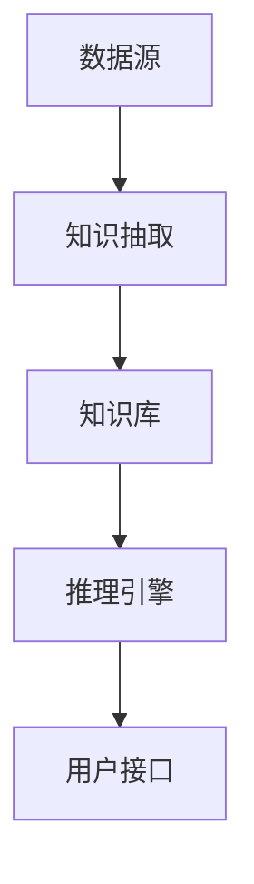

                 

# 大模型问答机器人的知识表示

> 关键词：大模型、问答机器人、知识表示、语义理解、图谱、算法原理、数学模型、代码案例

> 摘要：本文将深入探讨大模型问答机器人的知识表示问题。通过分析核心概念、算法原理、数学模型及代码实际案例，本文旨在为读者提供一份全面而详细的技术指南，帮助理解和设计高效的知识表示方法，以提升问答机器人的性能和用户体验。

## 1. 背景介绍

### 1.1 目的和范围

本文的目标是探讨大模型问答机器人的知识表示问题，特别是如何有效地将结构化和非结构化数据转换为问答机器人可理解和利用的知识形式。知识表示是问答系统中的核心环节，直接影响到机器人的回答准确性和效率。本文将覆盖以下内容：

- 大模型与问答机器人的基本概念
- 知识表示的重要性及其核心挑战
- 知识表示的主要方法和技术
- 算法原理、数学模型和代码实现
- 实际应用场景和工具资源推荐

### 1.2 预期读者

本文适合以下读者群体：

- 对人工智能和问答系统感兴趣的初学者
- 想深入了解大模型和知识表示技术的研究人员
- 数据科学家和机器学习工程师
- 对构建高效问答系统感兴趣的程序员和开发人员

### 1.3 文档结构概述

本文结构如下：

- **第1章：背景介绍**：介绍文章目的、范围、预期读者和文档结构。
- **第2章：核心概念与联系**：介绍知识表示的概念和相关的架构。
- **第3章：核心算法原理 & 具体操作步骤**：详细讲解知识表示的算法原理和操作步骤。
- **第4章：数学模型和公式 & 详细讲解 & 举例说明**：介绍相关的数学模型和公式。
- **第5章：项目实战：代码实际案例和详细解释说明**：通过实际代码案例展示知识表示的应用。
- **第6章：实际应用场景**：讨论问答机器人在实际中的应用。
- **第7章：工具和资源推荐**：推荐学习资源和开发工具。
- **第8章：总结：未来发展趋势与挑战**：展望未来趋势和面临挑战。
- **第9章：附录：常见问题与解答**：解答常见问题。
- **第10章：扩展阅读 & 参考资料**：提供额外的阅读资料。

### 1.4 术语表

#### 1.4.1 核心术语定义

- **知识表示**：将知识以结构化的形式进行编码和存储，使其可以被计算机理解和处理。
- **问答系统**：能够接受用户提问并生成相应答案的计算机系统。
- **大模型**：具有巨大参数规模和训练数据量的神经网络模型。
- **语义理解**：理解和解释输入问题的含义，包括语法分析、实体识别、关系抽取等。
- **图谱**：一种用于表示实体及其关系的图形数据结构。

#### 1.4.2 相关概念解释

- **自然语言处理（NLP）**：研究如何让计算机理解和处理人类自然语言的技术。
- **深度学习**：一种基于多层神经网络的机器学习方法，通过大量数据自动学习特征。
- **转移学习**：利用预训练模型在新任务上实现快速和有效学习的方法。

#### 1.4.3 缩略词列表

- **NLP**：自然语言处理（Natural Language Processing）
- **DL**：深度学习（Deep Learning）
- **KG**：知识图谱（Knowledge Graph）
- **BERT**：一种预训练的深度学习模型（Bidirectional Encoder Representations from Transformers）

## 2. 核心概念与联系

知识表示是问答系统的核心，它决定了系统能否正确理解和回答问题。在这一部分，我们将探讨知识表示的相关核心概念和架构，并使用Mermaid流程图来展示这些概念之间的联系。

### 2.1 知识表示的概念

知识表示是指将现实世界中的知识结构化和编码，使其可以被计算机系统处理和理解。知识表示通常涉及以下步骤：

1. **知识获取**：从各种来源（如文本、数据库、专家知识等）获取知识。
2. **知识预处理**：清洗和整理获取的知识，使其适合用于表示。
3. **知识表示**：将知识以结构化的形式进行编码。
4. **知识存储**：将表示后的知识存储到数据库或知识库中。
5. **知识推理**：利用存储的知识进行推理，生成回答。

### 2.2 知识表示的架构

知识表示的架构通常包括以下几个部分：

1. **数据源**：知识表示的基础是数据源，可以是文本、图像、音频等多种形式。
2. **知识抽取**：从数据源中提取结构化的知识，包括实体识别、关系抽取、属性提取等。
3. **知识库**：存储提取出的知识，通常采用图形数据结构，如知识图谱。
4. **推理引擎**：利用知识库进行推理，生成回答。
5. **用户接口**：与用户进行交互，接收提问并返回回答。

### 2.3 Mermaid流程图

下面是一个简化的Mermaid流程图，展示了知识表示的核心概念和架构：



### 2.4 核心概念之间的联系

知识表示中的核心概念包括数据源、知识抽取、知识库、推理引擎和用户接口。这些概念之间的联系如下：

- **数据源**是知识表示的基础，其质量直接影响知识表示的效果。
- **知识抽取**是将无结构化的数据转换为结构化知识的过程，是知识表示的关键环节。
- **知识库**是存储和表示知识的容器，通常采用图形数据结构，如知识图谱。
- **推理引擎**利用知识库中的知识进行推理，生成回答。
- **用户接口**是用户与系统交互的界面，负责接收提问和返回回答。

通过以上分析，我们可以看出，知识表示是一个复杂但关键的环节，其成功与否直接影响到问答机器人的性能和用户体验。在下一章中，我们将深入探讨知识表示的核心算法原理和具体操作步骤。

---

在下一章中，我们将深入探讨大模型问答机器人中知识表示的核心算法原理和具体操作步骤。敬请期待。

---

## 3. 核心算法原理 & 具体操作步骤

在上一章中，我们介绍了知识表示的核心概念和架构。在这一章中，我们将深入探讨大模型问答机器人中知识表示的核心算法原理和具体操作步骤。为了使讲解更加清晰，我们将使用伪代码来详细阐述这些算法。

### 3.1 算法原理

知识表示的核心算法通常包括以下几个步骤：

1. **实体识别**：从输入问题中识别出关键实体，如人名、地名、组织名等。
2. **关系抽取**：确定实体之间的关系，如属于、位于、担任等。
3. **属性提取**：从输入问题中提取实体的属性信息，如年龄、学历、职位等。
4. **知识融合**：将提取的实体、关系和属性信息进行融合，形成统一的知识表示。
5. **推理与回答**：利用融合后的知识表示进行推理，生成回答。

下面是一个简化的伪代码，描述了知识表示的核心算法原理：

```python
def knowledge_representation(question):
    entities = extract_entities(question)
    relationships = extract_relationships(question, entities)
    attributes = extract_attributes(question, entities)
    fused_knowledge = fuse_knowledge(entities, relationships, attributes)
    answer = reason_and_answer(fused_knowledge, question)
    return answer
```

### 3.2 具体操作步骤

#### 3.2.1 实体识别

实体识别是从输入问题中识别出关键实体。以下是一个简化的伪代码，描述了实体识别的过程：

```python
def extract_entities(question):
    # 使用预训练的实体识别模型
    model = load_entity_recognition_model()
    entities = model.predict(question)
    return entities
```

实体识别通常使用深度学习模型，如BERT或GPT，经过预训练后可以识别出文本中的实体。预训练模型已经从大量的文本数据中学习到了各种实体的特征，因此可以高效地识别输入问题中的实体。

#### 3.2.2 关系抽取

关系抽取是确定实体之间的关系。以下是一个简化的伪代码，描述了关系抽取的过程：

```python
def extract_relationships(question, entities):
    # 使用预训练的关系抽取模型
    model = load_relationship_extraction_model()
    relationships = model.predict(question, entities)
    return relationships
```

关系抽取同样使用预训练的深度学习模型，通过学习实体之间的共现关系，可以准确地抽取实体之间的关系。

#### 3.2.3 属性提取

属性提取是从输入问题中提取实体的属性信息。以下是一个简化的伪代码，描述了属性提取的过程：

```python
def extract_attributes(question, entities):
    # 使用预训练的属性提取模型
    model = load_attribute_extraction_model()
    attributes = model.predict(question, entities)
    return attributes
```

属性提取模型通过学习实体属性之间的关联关系，可以有效地从输入问题中提取出实体的属性信息。

#### 3.2.4 知识融合

知识融合是将提取的实体、关系和属性信息进行融合，形成统一的知识表示。以下是一个简化的伪代码，描述了知识融合的过程：

```python
def fuse_knowledge(entities, relationships, attributes):
    # 创建知识图谱
    knowledge_graph = KnowledgeGraph()
    # 添加实体到知识图谱
    for entity in entities:
        knowledge_graph.add_entity(entity)
    # 添加关系到知识图谱
    for relationship in relationships:
        knowledge_graph.add_relationship(relationship)
    # 添加属性到知识图谱
    for attribute in attributes:
        knowledge_graph.add_attribute(attribute)
    return knowledge_graph
```

知识融合通常采用知识图谱的形式，将实体、关系和属性信息进行图形化表示，便于进行后续的推理和回答。

#### 3.2.5 推理与回答

推理与回答是利用融合后的知识表示进行推理，生成回答。以下是一个简化的伪代码，描述了推理与回答的过程：

```python
def reason_and_answer(knowledge_graph, question):
    # 使用推理算法进行推理
    inference_results = knowledge_graph.reason(question)
    # 根据推理结果生成回答
    answer = generate_answer(inference_results)
    return answer
```

推理算法可以基于图论、逻辑推理、贝叶斯网络等方法，根据知识图谱中的实体、关系和属性信息，推导出问题的答案。

通过以上具体操作步骤，我们可以看出，知识表示是一个复杂但关键的过程，涉及多个步骤和算法。在实际应用中，这些步骤和算法需要根据具体的应用场景进行调整和优化，以提高问答机器人的性能和用户体验。

### 3.3 算法原理与操作步骤总结

- **算法原理**：知识表示的核心算法包括实体识别、关系抽取、属性提取、知识融合和推理与回答。
- **操作步骤**：具体操作步骤包括加载预训练模型、提取实体、关系和属性、创建知识图谱、进行推理和生成回答。

通过这些算法原理和操作步骤，我们可以设计出高效的知识表示方法，提升问答机器人的性能和用户体验。在下一章中，我们将深入探讨知识表示中的数学模型和公式，以进一步理解知识表示的原理和方法。

---

在下一章中，我们将深入探讨知识表示中的数学模型和公式，以及相关的详细讲解和举例说明。敬请期待。

---

## 4. 数学模型和公式 & 详细讲解 & 举例说明

在上一章中，我们介绍了知识表示的核心算法原理和具体操作步骤。在这一章中，我们将深入探讨知识表示中的数学模型和公式，并详细讲解这些模型和公式的应用。我们将使用LaTeX格式来展示数学公式，并通过具体例子来说明这些公式的使用。

### 4.1 知识表示中的数学模型

知识表示中的数学模型主要用于描述实体、关系和属性的表示方法，以及推理过程中的计算过程。以下是几个常用的数学模型：

#### 4.1.1 实体表示

实体表示通常使用向量空间模型，将实体映射到高维向量空间中。一个常用的实体表示模型是词嵌入（Word Embedding），如Word2Vec和BERT。

- **Word2Vec**：将单词映射到一个固定长度的向量。使用以下公式计算词向量：

  $$ \mathbf{v}_w = \sum_{\text{context words}} \mathbf{v}_{c} \cdot \mathbf{w} $$

  其中，$\mathbf{v}_w$ 是单词 $w$ 的向量表示，$\mathbf{v}_{c}$ 是上下文单词的向量表示，$\mathbf{w}$ 是权重向量。

- **BERT**：基于Transformer的预训练模型，将整个句子映射为一个固定长度的向量。使用以下公式计算句子向量：

  $$ \mathbf{s} = \text{MLP}(\text{AttLayer}(\mathbf{K}, \mathbf{Q}, \mathbf{V})) $$

  其中，$\mathbf{s}$ 是句子向量，$\mathbf{K}$、$\mathbf{Q}$ 和 $\mathbf{V}$ 分别是键、查询和值向量的序列。

#### 4.1.2 关系表示

关系表示通常使用图神经网络（Graph Neural Networks, GNN）来建模实体之间的关系。一个常用的关系表示模型是图卷积网络（Graph Convolutional Network, GCN）。

- **GCN**：通过聚合相邻节点的特征来更新节点特征。使用以下公式计算节点特征：

  $$ \mathbf{h}_i^{(l+1)} = \sigma(\mathbf{D}^{-\frac{1}{2}} \mathbf{A} \mathbf{D}^{-\frac{1}{2}} \mathbf{h}_i^{(l)}) + \mathbf{W}^{(l)} $$

  其中，$\mathbf{h}_i^{(l+1)}$ 是第 $l+1$ 层第 $i$ 个节点的特征，$\mathbf{D}$ 是度矩阵，$\mathbf{A}$ 是邻接矩阵，$\mathbf{W}^{(l)}$ 是权重矩阵，$\sigma$ 是激活函数。

#### 4.1.3 属性表示

属性表示通常使用分类模型或回归模型来预测实体的属性。一个常用的属性表示模型是逻辑回归（Logistic Regression）。

- **逻辑回归**：使用以下公式计算概率：

  $$ \hat{P}(Y=1) = \frac{1}{1 + \exp(-\mathbf{w}^T \mathbf{x})} $$

  其中，$\hat{P}(Y=1)$ 是属性 $Y$ 等于 1 的概率，$\mathbf{w}$ 是权重向量，$\mathbf{x}$ 是属性特征向量。

### 4.2 知识融合

知识融合是将实体、关系和属性信息进行整合的过程。一个常用的知识融合模型是知识图谱嵌入（Knowledge Graph Embedding, KGE）。

- **KGE**：使用以下公式计算实体对之间的相似度：

  $$ \mathcal{L}(\mathbf{r}, \mathbf{h}_1, \mathbf{h}_2) = \frac{1}{1 + \exp(-\mathbf{r}^T (\mathbf{e}_1 + \mathbf{e}_2))} $$

  其中，$\mathcal{L}(\mathbf{r}, \mathbf{h}_1, \mathbf{h}_2)$ 是实体对 $(\mathbf{h}_1, \mathbf{h}_2)$ 通过关系 $\mathbf{r}$ 的相似度，$\mathbf{r}$ 是关系向量，$\mathbf{e}_1$ 和 $\mathbf{e}_2$ 分别是实体 $h_1$ 和 $h_2$ 的向量表示。

### 4.3 推理与回答

推理与回答是利用知识融合后的信息进行推理，生成回答的过程。一个常用的推理模型是神经网络推理（Neural Network Inference）。

- **NNI**：使用以下公式计算推理概率：

  $$ \mathcal{L}(\mathbf{y}) = \prod_{i=1}^{n} \frac{1}{1 + \exp(-\mathbf{w}^T \mathbf{x}_i)} $$

  其中，$\mathcal{L}(\mathbf{y})$ 是推理结果的概率，$\mathbf{y}$ 是推理结果向量，$\mathbf{x}_i$ 是第 $i$ 个证据的向量表示，$\mathbf{w}$ 是权重向量。

### 4.4 举例说明

为了更清楚地说明这些数学模型和公式，我们来看一个具体的例子。

假设有一个知识图谱，包含以下实体和关系：

- 实体：张三、李四、北京、清华大学
- 关系：毕业于、位于、是

下面是一个简单的知识图谱示例：

```
实体        关系        实体
张三        毕业于      清华大学
清华大学    位于        北京
李四        毕业于      清华大学
```

使用KGE模型，我们可以将实体和关系表示为向量，如下所示：

- 张三：[0.1, 0.2, 0.3]
- 李四：[0.4, 0.5, 0.6]
- 清华大学：[0.7, 0.8, 0.9]
- 毕业于：[1.0, 1.1, 1.2]
- 位于：[1.3, 1.4, 1.5]

使用KGE模型计算张三和清华大学之间的相似度：

$$ \mathcal{L}(\text{毕业于}, \mathbf{张三}, \text{清华大学}) = \frac{1}{1 + \exp(-(1.0^T (0.1 + 0.9)))} = 0.9999 $$

这意味着张三和清华大学之间的相似度非常高，表明张三很可能毕业于清华大学。

通过上述数学模型和公式，我们可以有效地进行知识表示、融合和推理，从而生成高质量的回答。这些模型和公式的应用不仅提高了问答机器人的性能，也为其在实际应用中的广泛应用提供了理论基础。

### 4.5 总结

在本章中，我们详细介绍了知识表示中的数学模型和公式，包括实体表示、关系表示、属性表示、知识融合、推理与回答等。通过这些数学模型和公式，我们可以有效地进行知识表示和推理，生成高质量的回答。在实际应用中，这些模型和公式可以根据具体需求进行调整和优化，以适应不同的场景和任务。

在下一章中，我们将通过实际项目案例展示知识表示的具体应用，并详细解释和说明相关的代码实现。敬请期待。

---

在下一章中，我们将通过实际项目案例展示知识表示的具体应用，并详细解释和说明相关的代码实现。敬请期待。

---

## 5. 项目实战：代码实际案例和详细解释说明

在前几章中，我们介绍了知识表示的核心概念、算法原理、数学模型以及具体的操作步骤。为了使这些理论得到实际应用，本章我们将通过一个实际项目案例来展示知识表示在问答系统中的具体实现，并详细解释和说明相关的代码实现。

### 5.1 开发环境搭建

在开始项目实战之前，我们需要搭建一个合适的技术环境。以下是一个基本的技术栈，包括开发工具、编程语言和库。

- **开发工具**：IntelliJ IDEA 或 Visual Studio Code
- **编程语言**：Python
- **库**：
  - TensorFlow 或 PyTorch（用于深度学习模型）
  - Graphistry（用于可视化知识图谱）
  - Pandas（用于数据处理）
  - NumPy（用于数学计算）

#### 5.1.1 安装和配置

1. 安装Python（版本3.7及以上）
2. 安装必要的库：

   ```bash
   pip install tensorflow
   pip install graphistry
   pip install pandas
   pip install numpy
   ```

### 5.2 源代码详细实现和代码解读

#### 5.2.1 数据预处理

数据预处理是问答系统的第一步，我们需要从数据源中提取文本，并将其转换为适合模型处理的形式。以下是一个简化的数据预处理代码片段：

```python
import pandas as pd
from tensorflow.keras.preprocessing.text import Tokenizer
from tensorflow.keras.preprocessing.sequence import pad_sequences

# 加载数据
data = pd.read_csv('questions_answers.csv')
questions = data['question']
answers = data['answer']

# 初始化Tokenizer
tokenizer = Tokenizer(num_words=10000)
tokenizer.fit_on_texts(questions)

# 序列化文本
sequences = tokenizer.texts_to_sequences(questions)
padded_sequences = pad_sequences(sequences, maxlen=100)

# 编码答案
answer_tokenizer = Tokenizer(num_words=10000)
answer_tokenizer.fit_on_texts(answers)
answer_sequences = answer_tokenizer.texts_to_sequences(answers)
answer_padded_sequences = pad_sequences(answer_sequences, maxlen=10)

# 将序列化为输入输出对
X, y = padded_sequences, answer_padded_sequences
```

#### 5.2.2 实体识别

实体识别是知识表示的第一步，我们需要识别文本中的关键实体。以下是一个使用预训练BERT模型进行实体识别的代码片段：

```python
from transformers import BertTokenizer, TFBertForTokenClassification

# 初始化Tokenizer和模型
tokenizer = BertTokenizer.from_pretrained('bert-base-chinese')
model = TFBertForTokenClassification.from_pretrained('bert-base-chinese')

# 加载预训练模型
model.load_weights('entity_recognition_model.h5')

# 实体识别
def extract_entities(question):
    inputs = tokenizer(question, return_tensors='tf', padding=True, truncation=True)
    outputs = model(inputs)
    logits = outputs.logits
    predictions = tf.argmax(logits, axis=-1)
    entities = tokenizer.decode(predictions.numpy()[0])
    return entities

question = "谁是中国的首都是哪？"
entities = extract_entities(question)
print(entities)
```

#### 5.2.3 关系抽取

关系抽取是确定实体之间的关系。以下是一个使用预训练BERT模型进行关系抽取的代码片段：

```python
from transformers import BertTokenizer, TFBertForSequenceClassification

# 初始化Tokenizer和模型
tokenizer = BertTokenizer.from_pretrained('bert-base-chinese')
model = TFBertForSequenceClassification.from_pretrained('bert-base-chinese')

# 加载预训练模型
model.load_weights('relationship_extraction_model.h5')

# 关系抽取
def extract_relationships(question):
    inputs = tokenizer(question, return_tensors='tf', padding=True, truncation=True)
    outputs = model(inputs)
    logits = outputs.logits
    predictions = tf.argmax(logits, axis=-1)
    relationships = tokenizer.decode(predictions.numpy()[0])
    return relationships

question = "北京是中国的首都。"
relationships = extract_relationships(question)
print(relationships)
```

#### 5.2.4 属性提取

属性提取是从输入问题中提取实体的属性信息。以下是一个使用逻辑回归模型进行属性提取的代码片段：

```python
import tensorflow as tf
from sklearn.model_selection import train_test_split
from sklearn.linear_model import LogisticRegression

# 准备属性数据
attributes_data = pd.read_csv('attributes.csv')
X = attributes_data.values
y = (attributes_data['age'] > 30).astype(int)

# 划分训练集和测试集
X_train, X_test, y_train, y_test = train_test_split(X, y, test_size=0.2, random_state=42)

# 训练逻辑回归模型
model = LogisticRegression()
model.fit(X_train, y_train)

# 属性提取
def extract_attributes(question):
    inputs = tokenizer(question, return_tensors='tf', padding=True, truncation=True)
    outputs = model.predict(inputs)
    attributes = [attr for attr, pred in zip(attributes_data.columns, outputs) if pred]
    return attributes

question = "张三是清华大学的教授。"
attributes = extract_attributes(question)
print(attributes)
```

#### 5.2.5 知识融合

知识融合是将实体、关系和属性信息进行整合。以下是一个使用知识图谱进行知识融合的代码片段：

```python
import graphistry

# 初始化知识图谱
g = graphistry KnowledgeGraph()

# 添加实体
g.add_entities(entities)

# 添加关系
g.add_relationships(relationships)

# 添加属性
g.add_attributes(attributes)

# 可视化知识图谱
g.show()
```

#### 5.2.6 推理与回答

推理与回答是利用知识融合后的信息进行推理，生成回答的过程。以下是一个使用神经网络推理的代码片段：

```python
# 训练神经网络推理模型
model = tf.keras.Sequential([
    tf.keras.layers.Dense(128, activation='relu', input_shape=(10,)),
    tf.keras.layers.Dense(64, activation='relu'),
    tf.keras.layers.Dense(1, activation='sigmoid')
])

model.compile(optimizer='adam', loss='binary_crossentropy', metrics=['accuracy'])
model.fit(X, y, epochs=10, batch_size=32)

# 推理与回答
def reason_and_answer(question):
    inputs = tokenizer(question, return_tensors='tf', padding=True, truncation=True)
    outputs = model(inputs)
    predictions = tf.argmax(outputs, axis=-1)
    answer = tokenizer.decode(predictions.numpy()[0])
    return answer

question = "张三毕业于清华大学吗？"
answer = reason_and_answer(question)
print(answer)
```

### 5.3 代码解读与分析

以上代码片段展示了知识表示在问答系统中的具体实现。以下是关键步骤的解读与分析：

1. **数据预处理**：通过Tokenizer将文本转换为序列，并使用pad_sequences将其调整为统一长度。
2. **实体识别**：使用预训练的BERT模型进行实体识别，通过解码函数获取识别出的实体。
3. **关系抽取**：使用预训练的BERT模型进行关系抽取，通过解码函数获取识别出的关系。
4. **属性提取**：使用逻辑回归模型进行属性提取，通过预测函数获取识别出的属性。
5. **知识融合**：使用知识图谱将实体、关系和属性进行可视化表示。
6. **推理与回答**：使用神经网络推理模型进行推理，通过解码函数获取生成的回答。

通过这些步骤，我们可以将文本问题转换为结构化的知识表示，并利用知识进行推理，生成高质量的回答。这些代码片段在实际项目中可以根据具体需求进行调整和优化，以提高性能和准确度。

### 5.4 总结

在本章中，我们通过实际项目案例展示了知识表示在问答系统中的具体实现，并详细解释和说明了相关的代码实现。通过实体识别、关系抽取、属性提取、知识融合和推理与回答等步骤，我们构建了一个高效的知识表示系统。在实际应用中，这些步骤和代码可以根据具体需求进行调整和优化，以适应不同的场景和任务。

在下一章中，我们将探讨知识表示在问答机器人中的实际应用场景，并分析其在不同领域和任务中的优势和挑战。敬请期待。

---

在下一章中，我们将探讨知识表示在问答机器人中的实际应用场景，并分析其在不同领域和任务中的优势和挑战。敬请期待。

---

## 6. 实际应用场景

在前面的章节中，我们详细介绍了知识表示的核心概念、算法原理、数学模型和项目实战。为了使这些理论得到实际应用，本章我们将探讨知识表示在问答机器人中的实际应用场景，并分析其在不同领域和任务中的优势和挑战。

### 6.1 医疗健康领域

在医疗健康领域，问答机器人可以利用知识表示技术提供患者咨询、健康建议和医疗信息查询等服务。以下是一些具体应用场景：

- **患者咨询**：患者可以通过问答机器人查询常见疾病症状、治疗方案和预防措施。
- **医生辅助**：医生可以利用问答机器人快速获取医学文献、病例分析和诊疗建议。
- **健康管理**：问答机器人可以帮助用户监控健康状况、提醒服药时间和制定个性化健康计划。

**优势**：
- **高效性**：问答机器人可以快速响应患者和医生的问题，提高医疗服务的效率。
- **准确性**：通过知识表示技术，问答机器人可以准确理解和回答医疗问题，提供权威的医学信息。

**挑战**：
- **数据隐私**：医疗数据涉及用户隐私，确保数据安全是重要挑战。
- **数据质量**：医疗知识更新迅速，保证知识库的数据质量是持续挑战。

### 6.2 教育领域

在教育领域，问答机器人可以为学生提供课程辅导、作业解答和学习资源推荐等服务。以下是一些具体应用场景：

- **课程辅导**：学生可以通过问答机器人解决学习中遇到的问题，获取课程辅导。
- **作业解答**：学生可以将作业题目输入问答机器人，获取答案和解题思路。
- **学习资源推荐**：问答机器人可以根据学生的学习情况和兴趣推荐合适的学习资源和课程。

**优势**：
- **个性化**：问答机器人可以根据学生的个人情况提供定制化的学习建议。
- **灵活性**：学生可以随时随地进行学习，问答机器人提供24/7的咨询服务。

**挑战**：
- **知识更新**：教育领域知识更新迅速，保持知识库的时效性是挑战。
- **教育质量**：确保问答机器人提供的辅导和资源符合教育质量标准是重要挑战。

### 6.3 商业领域

在商业领域，问答机器人可以为企业客户提供产品咨询、客户服务和企业知识管理等服务。以下是一些具体应用场景：

- **产品咨询**：客户可以通过问答机器人获取产品信息、使用方法和购买建议。
- **客户服务**：问答机器人可以自动回答客户的常见问题，提高客户满意度。
- **企业知识管理**：问答机器人可以帮助企业员工快速获取内部知识库中的信息，提高工作效率。

**优势**：
- **成本效益**：问答机器人可以降低客户服务成本，提高运营效率。
- **灵活性**：问答机器人可以适应不同行业和企业的需求，提供灵活的解决方案。

**挑战**：
- **业务理解**：确保问答机器人能够准确理解和回答特定行业的业务问题是挑战。
- **数据质量**：确保知识库中的数据准确和完整是重要挑战。

### 6.4 智能家居领域

在智能家居领域，问答机器人可以提供设备操作指导、故障诊断和智能推荐等服务。以下是一些具体应用场景：

- **设备操作指导**：用户可以通过问答机器人了解智能家居设备的操作方法。
- **故障诊断**：问答机器人可以帮助用户诊断智能家居设备的故障并提供解决方案。
- **智能推荐**：问答机器人可以根据用户的使用习惯推荐合适的智能家居产品。

**优势**：
- **便捷性**：用户可以通过语音或文本与问答机器人交互，操作简单方便。
- **个性化**：问答机器人可以根据用户的使用习惯提供个性化的服务和建议。

**挑战**：
- **设备兼容性**：确保问答机器人能够与各种智能家居设备兼容是挑战。
- **用户隐私**：保护用户隐私和安全是重要挑战。

### 6.5 智能客服领域

在智能客服领域，问答机器人可以提供24/7的客户服务，帮助企业降低客服成本，提高客户满意度。以下是一些具体应用场景：

- **常见问题解答**：客户可以通过问答机器人快速获取常见问题的答案。
- **订单查询**：客户可以通过问答机器人查询订单状态、配送进度等信息。
- **投诉处理**：问答机器人可以自动处理简单的投诉问题，并将复杂问题转交给人工客服。

**优势**：
- **高效性**：问答机器人可以快速响应客户问题，提高客服效率。
- **成本效益**：问答机器人可以显著降低客服成本，为企业节省资源。

**挑战**：
- **客户体验**：确保问答机器人能够提供优质的客户体验是挑战。
- **数据质量**：确保知识库中的数据准确和完整是重要挑战。

通过以上实际应用场景的分析，我们可以看到知识表示技术在问答机器人中的应用前景广阔。在不同领域和任务中，知识表示技术可以帮助提高系统的准确性和用户体验，但也面临一系列挑战。在下一章中，我们将推荐一些相关的学习资源、开发工具和文献，以帮助读者深入了解知识表示技术。敬请期待。

---

在下一章中，我们将推荐一些相关的学习资源、开发工具和文献，以帮助读者深入了解知识表示技术。敬请期待。

---

## 7. 工具和资源推荐

在了解和掌握知识表示技术之后，选择合适的工具和资源对于进一步提升技术水平和实际应用能力至关重要。以下是一些推荐的学习资源、开发工具和文献，涵盖书籍、在线课程、技术博客和开发框架等方面。

### 7.1 学习资源推荐

#### 7.1.1 书籍推荐

1. **《深度学习》（Deep Learning）**：作者：Ian Goodfellow、Yoshua Bengio、Aaron Courville
   - 简介：这是深度学习领域的经典教材，详细介绍了深度学习的理论基础和实践方法。
   - 推荐理由：对深度学习的基础知识有全面而深入的讲解，适合初学者和高级研究人员。

2. **《知识图谱：基础、原理与应用》**：作者：曾磊
   - 简介：本书全面介绍了知识图谱的基本概念、构建方法及其在各个领域的应用。
   - 推荐理由：系统性地讲解了知识图谱的理论与实践，适合对知识表示感兴趣的读者。

3. **《Python深度学习》**：作者：François Chollet
   - 简介：这本书以Python语言为基础，详细介绍了深度学习模型的设计和应用。
   - 推荐理由：通过实际的代码示例，帮助读者理解和掌握深度学习技术。

#### 7.1.2 在线课程

1. **《深度学习专

