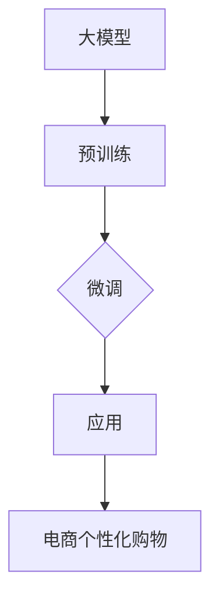
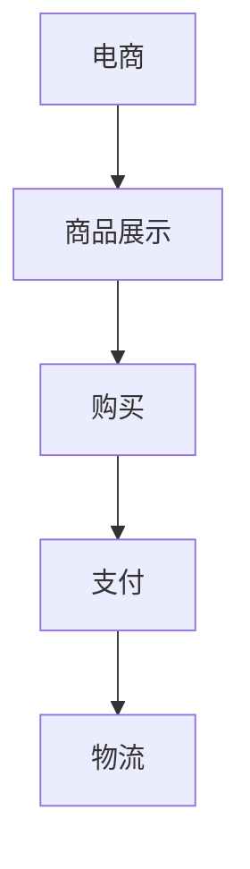
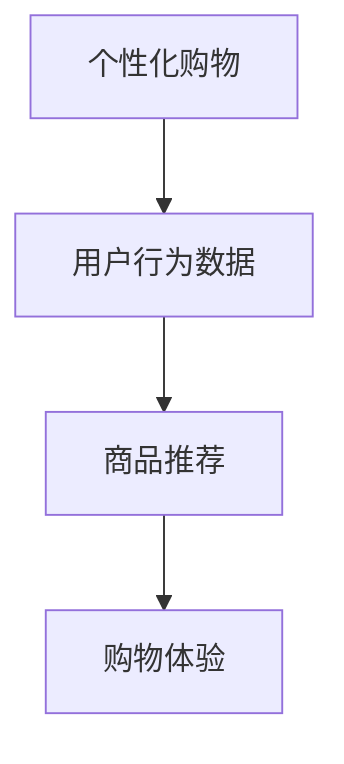
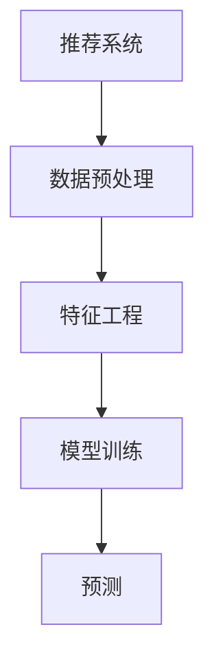
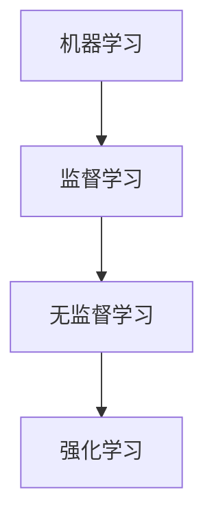
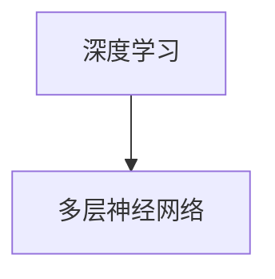

                 

# 大模型驱动的电商个性化购物指南

> **关键词：** 大模型、电商、个性化购物、机器学习、推荐系统、深度学习
> 
> **摘要：** 本文旨在深入探讨大模型在电商个性化购物领域中的应用，通过分析核心概念、算法原理、数学模型、实际案例和未来发展趋势，为读者提供一份全面的技术指南。文章将分为多个部分，详细讲解大模型在电商个性化购物中的具体应用及其带来的变革。

## 1. 背景介绍

### 1.1 目的和范围

本文的目标是探讨如何利用大模型技术来驱动电商个性化购物体验，从而提升用户的购物满意度和商家的销售转化率。我们将涵盖以下内容：

- 大模型的定义及其在电商领域的应用。
- 个性化购物的概念及其重要性。
- 机器学习和深度学习在推荐系统中的作用。
- 大模型在电商个性化购物中的具体实现。
- 未来发展趋势与面临的挑战。

### 1.2 预期读者

本文适合对电商、机器学习和深度学习有一定了解的技术人员、产品经理和研究学者。无论是初学者还是资深从业者，都将从本文中获得新的见解和实践指导。

### 1.3 文档结构概述

本文结构如下：

- **第1章**：背景介绍，包括目的、预期读者、文档结构和核心术语。
- **第2章**：核心概念与联系，介绍大模型、电商、个性化购物等核心概念，并使用Mermaid流程图展示其架构。
- **第3章**：核心算法原理与具体操作步骤，讲解推荐系统的算法原理和操作流程。
- **第4章**：数学模型与公式，详细阐述大模型中的数学模型及其应用。
- **第5章**：项目实战，提供实际代码案例，并进行详细解释。
- **第6章**：实际应用场景，分析大模型在电商中的具体应用。
- **第7章**：工具和资源推荐，介绍相关学习资源、开发工具和框架。
- **第8章**：总结，探讨未来发展趋势与挑战。
- **第9章**：附录，提供常见问题与解答。
- **第10章**：扩展阅读，推荐相关参考资料。

### 1.4 术语表

#### 1.4.1 核心术语定义

- **大模型**：指的是具有数十亿甚至千亿参数的神经网络模型，如BERT、GPT等。
- **电商**：指的是通过互联网进行的商品交易活动。
- **个性化购物**：根据用户的购物行为和偏好，提供个性化的商品推荐。
- **推荐系统**：用于预测用户对某些商品的兴趣和偏好，从而推荐相关商品的系统。
- **机器学习**：一种人工智能技术，通过训练数据模型来预测或分类新数据。
- **深度学习**：一种机器学习技术，通过多层神经网络进行数据建模。

#### 1.4.2 相关概念解释

- **深度神经网络**：由多个隐层神经元的神经网络。
- **神经网络**：一种由大量神经元组成的网络，通过调整权重来学习数据。
- **用户行为数据**：用户的浏览、购买、评价等行为记录。

#### 1.4.3 缩略词列表

- **BERT**：Bidirectional Encoder Representations from Transformers
- **GPT**：Generative Pre-trained Transformer
- **API**：Application Programming Interface

## 2. 核心概念与联系

在这一章中，我们将介绍本文的核心概念，并使用Mermaid流程图展示其架构。

### 2.1 大模型

大模型，如BERT和GPT，是通过预训练和微调来学习的深度神经网络。它们具有数十亿甚至千亿参数，能够捕获语言和知识的深层结构。



### 2.2 电商

电商是通过互联网进行的商品交易活动。它包括商品展示、购买、支付和物流等环节。



### 2.3 个性化购物

个性化购物是根据用户的购物行为和偏好，提供个性化的商品推荐。它利用用户的历史数据和偏好来定制购物体验。



### 2.4 推荐系统

推荐系统是一种预测用户对某些商品的兴趣和偏好，从而推荐相关商品的系统。它通常包括数据预处理、特征工程、模型训练和预测等步骤。



### 2.5 机器学习

机器学习是一种通过训练数据模型来预测或分类新数据的技术。它包括监督学习、无监督学习和强化学习等不同类型。



### 2.6 深度学习

深度学习是一种通过多层神经网络进行数据建模的机器学习技术。它能够自动提取数据的深层特征。



## 3. 核心算法原理 & 具体操作步骤

在这一章中，我们将详细讲解推荐系统的算法原理和具体操作步骤。

### 3.1 算法原理

推荐系统通常基于以下两个核心原理：

- **协同过滤（Collaborative Filtering）**：通过分析用户的历史行为和偏好，发现相似用户并推荐他们喜欢的商品。
- **基于内容的推荐（Content-Based Recommendation）**：根据用户的历史购买记录和偏好，推荐具有相似属性的商品。

#### 3.1.1 协同过滤

协同过滤分为两种类型：

- **用户基于的协同过滤（User-Based Collaborative Filtering）**：通过分析用户之间的相似性来推荐商品。
- **模型基于的协同过滤（Model-Based Collaborative Filtering）**：使用机器学习模型（如矩阵分解、KNN等）来预测用户对商品的偏好。

#### 3.1.2 基于内容的推荐

基于内容的推荐通过分析商品的属性和用户的历史偏好来推荐商品。它通常包括以下步骤：

1. **特征提取**：从商品和用户的历史数据中提取特征。
2. **相似度计算**：计算商品和用户之间的相似度。
3. **推荐生成**：根据相似度计算结果生成推荐列表。

### 3.2 操作步骤

以下是推荐系统的基本操作步骤：

1. **数据收集**：收集用户的历史行为数据，如浏览记录、购买记录、评价等。
2. **数据预处理**：清洗数据，包括去除缺失值、噪声数据和标准化处理。
3. **特征工程**：从原始数据中提取有用特征，如商品类别、品牌、价格等。
4. **模型选择**：选择合适的推荐算法，如协同过滤、基于内容的推荐、混合推荐等。
5. **模型训练**：使用训练数据训练推荐模型。
6. **模型评估**：使用验证集评估模型性能，调整模型参数。
7. **推荐生成**：使用训练好的模型为用户生成个性化推荐列表。
8. **推荐反馈**：收集用户对推荐的反馈，用于模型优化和更新。

### 3.3 伪代码

以下是协同过滤算法的伪代码：

```python
# 输入：用户行为矩阵R，用户数m，商品数n，相似度阈值θ
# 输出：推荐列表

def collaborative_filtering(R, m, n, θ):
    recommendations = []

    for user in range(m):
        neighbors = find_similar_users(R, user, θ)
        user_rated_items = R[user, :]
        predicted_ratings = []

        for item in range(n):
            if item in user_rated_items:
                continue

            neighbor_ratings = [R[neighbor, item] for neighbor in neighbors]
            average_rating = sum(neighbor_ratings) / len(neighbor_ratings)
            predicted_ratings.append(average_rating)

        recommended_items = [item for item, rating in enumerate(predicted_ratings) if rating > θ]
        recommendations.append(recommended_items)

    return recommendations
```

## 4. 数学模型和公式 & 详细讲解 & 举例说明

在这一章中，我们将详细讲解大模型在电商个性化购物中的数学模型和公式，并使用具体例子进行说明。

### 4.1 数学模型

推荐系统中的数学模型通常包括以下几个部分：

- **用户行为矩阵（User-Item Interaction Matrix）**：表示用户和商品之间的交互关系。
- **相似度计算公式**：用于计算用户之间的相似度或商品之间的相似度。
- **预测公式**：用于预测用户对商品的偏好。

#### 4.1.1 用户行为矩阵

用户行为矩阵 \( R \) 是一个 \( m \times n \) 的矩阵，其中 \( m \) 表示用户数，\( n \) 表示商品数。矩阵中的元素 \( R_{ui} \) 表示用户 \( u \) 对商品 \( i \) 的行为，如购买、浏览或评价等。

#### 4.1.2 相似度计算公式

相似度计算是推荐系统中的关键步骤，常用的相似度计算方法包括：

- **余弦相似度（Cosine Similarity）**：
  $$ \text{cosine\_similarity}(u, v) = \frac{u \cdot v}{\|u\|\|v\|} $$
  其中 \( u \) 和 \( v \) 分别表示两个用户或商品的特征向量。

- **皮尔逊相关系数（Pearson Correlation Coefficient）**：
  $$ \text{pearson\_correlation}(u, v) = \frac{\sum_{i=1}^{n} (u_i - \bar{u})(v_i - \bar{v})}{\sqrt{\sum_{i=1}^{n} (u_i - \bar{u})^2 \sum_{i=1}^{n} (v_i - \bar{v})^2}} $$
  其中 \( u \) 和 \( v \) 分别表示两个用户或商品的行为向量，\( \bar{u} \) 和 \( \bar{v} \) 分别表示它们的行为均值。

#### 4.1.3 预测公式

预测公式用于预测用户对商品的偏好，常用的预测方法包括：

- **基于用户的协同过滤（User-Based Collaborative Filtering）**：
  $$ R_{ui}^* = \sum_{j \in N(u)} R_{uj} \cdot \text{similarity}(u, j) $$
  其中 \( N(u) \) 表示与用户 \( u \) 相似的一组用户，\( \text{similarity}(u, j) \) 表示用户 \( u \) 和 \( j \) 之间的相似度。

- **基于模型的协同过滤（Model-Based Collaborative Filtering）**：
  $$ R_{ui}^* = \text{similarity}(u, \text{latent\_features}_{i}) $$
  其中 \( \text{latent\_features}_{i} \) 表示商品 \( i \) 的潜在特征向量。

### 4.2 举例说明

#### 4.2.1 余弦相似度计算

假设有两个用户 \( u \) 和 \( v \)，他们的行为向量如下：

- 用户 \( u \)：\[ [4, 5, 2, 1] \]
- 用户 \( v \)：\[ [3, 4, 3, 2] \]

计算用户 \( u \) 和 \( v \) 之间的余弦相似度：

1. 计算向量的点积：
   $$ u \cdot v = 4 \times 3 + 5 \times 4 + 2 \times 3 + 1 \times 2 = 26 $$

2. 计算向量的模长：
   $$ \|u\| = \sqrt{4^2 + 5^2 + 2^2 + 1^2} = \sqrt{30} $$
   $$ \|v\| = \sqrt{3^2 + 4^2 + 3^2 + 2^2} = \sqrt{30} $$

3. 计算余弦相似度：
   $$ \text{cosine\_similarity}(u, v) = \frac{u \cdot v}{\|u\|\|v\|} = \frac{26}{\sqrt{30} \times \sqrt{30}} = \frac{26}{30} \approx 0.866 $$

#### 4.2.2 预测用户对商品的偏好

假设用户 \( u \) 和商品 \( i \) 的特征向量如下：

- 用户 \( u \)：\[ [0.5, 0.3, 0.2] \]
- 商品 \( i \)：\[ [0.4, 0.4, 0.2] \]

计算用户 \( u \) 对商品 \( i \) 的偏好：

$$ R_{ui}^* = \text{similarity}(u, \text{latent\_features}_{i}) = 0.5 \times 0.4 + 0.3 \times 0.4 + 0.2 \times 0.2 = 0.26 $$

由于 \( R_{ui}^* \) 小于阈值 \( θ \)，因此不会向用户 \( u \) 推荐商品 \( i \)。

## 5. 项目实战：代码实际案例和详细解释说明

在本章中，我们将通过一个实际项目案例，详细讲解如何使用大模型技术构建一个电商个性化购物推荐系统。我们将从开发环境搭建开始，逐步介绍源代码的实现和代码解读。

### 5.1 开发环境搭建

在进行项目开发之前，我们需要搭建一个合适的环境。以下是一个基本的开发环境搭建步骤：

1. 安装Python环境：
   - 安装Python 3.x版本，建议使用Anaconda来管理Python环境和包。
   - 安装pip，用于安装和管理Python包。

2. 安装必备库：
   - 使用pip安装以下库：NumPy、Pandas、Scikit-learn、TensorFlow、PyTorch等。

3. 配置GPU支持（可选）：
   - 如果使用GPU进行深度学习训练，需要安装CUDA和cuDNN库。

### 5.2 源代码详细实现和代码解读

以下是推荐系统的主要代码实现，我们将逐段进行解读。

#### 5.2.1 数据准备

```python
import numpy as np
import pandas as pd

# 读取用户行为数据
data = pd.read_csv('user_behavior.csv')
users = data['user_id'].unique()
items = data['item_id'].unique()

# 构建用户行为矩阵
R = pd.pivot_table(data, index='user_id', columns='item_id', values='rating').fillna(0).astype(float)
R_matrix = R.values
```

这段代码首先读取用户行为数据，然后构建用户行为矩阵 \( R \)。用户行为数据通常包括用户的ID、商品的ID和用户对商品的评分。在这里，我们使用Pandas库读取CSV文件，并使用pivot_table函数构建用户行为矩阵。未评分的数据用0填充，并将数据类型转换为浮点数。

#### 5.2.2 特征工程

```python
from sklearn.preprocessing import StandardScaler

# 标准化用户行为矩阵
scaler = StandardScaler()
R_scaled = scaler.fit_transform(R_matrix)

# 构建用户和商品特征矩阵
user_features = R_scaled.mean(axis=1)
item_features = R_scaled.mean(axis=0)

# 保存特征矩阵
np.save('user_features.npy', user_features)
np.save('item_features.npy', item_features)
```

在这段代码中，我们使用Scikit-learn库的StandardScaler对用户行为矩阵进行标准化处理。标准化处理有助于改善模型性能。接下来，我们计算用户和商品的特征向量，并将它们保存到文件中。

#### 5.2.3 模型训练

```python
import tensorflow as tf
from tensorflow.keras.models import Model
from tensorflow.keras.layers import Input, Embedding, Dot, Flatten, Dense

# 设置模型参数
embedding_size = 50
hidden_size = 100

# 构建用户和商品嵌入层
user_embedding = Embedding(input_dim=len(users), output_dim=embedding_size)
item_embedding = Embedding(input_dim=len(items), output_dim=embedding_size)

# 构建模型
user_input = Input(shape=(1,))
item_input = Input(shape=(1,))

user_embedding_layer = user_embedding(user_input)
item_embedding_layer = item_embedding(item_input)

dot_product = Dot(axes=1)([user_embedding_layer, item_embedding_layer])
flatten = Flatten()(dot_product)
hidden = Dense(hidden_size, activation='relu')(flatten)
output = Dense(1, activation='sigmoid')(hidden)

model = Model(inputs=[user_input, item_input], outputs=output)
model.compile(optimizer='adam', loss='binary_crossentropy', metrics=['accuracy'])

# 加载用户和商品特征矩阵
user_features = np.load('user_features.npy')
item_features = np.load('item_features.npy')

# 训练模型
model.fit([user_features, item_features], R_scaled[:, -1], epochs=10, batch_size=32)
```

在这段代码中，我们使用TensorFlow构建一个简单的神经网络模型。模型包括用户和商品嵌入层、全连接层和输出层。用户和商品特征矩阵作为模型输入。我们使用Adam优化器和二进制交叉熵损失函数来训练模型。训练完成后，模型可以用于预测用户对商品的偏好。

#### 5.2.4 预测与推荐

```python
def predict(user_id, item_id, model, user_features, item_features):
    user_feature = user_features[user_id]
    item_feature = item_features[item_id]
    prediction = model.predict([[user_feature], [item_feature]])[0][0]
    return prediction

# 测试预测
user_id = 0
item_id = 10
prediction = predict(user_id, item_id, model, user_features, item_features)
print(f"Prediction for user {user_id} and item {item_id}: {prediction}")
```

在这段代码中，我们定义了一个预测函数，用于根据用户ID和商品ID预测用户对商品的偏好。测试中，我们为用户0和商品10进行预测，并打印预测结果。

### 5.3 代码解读与分析

- **数据准备**：读取用户行为数据，构建用户行为矩阵。
- **特征工程**：对用户行为矩阵进行标准化处理，提取用户和商品特征向量。
- **模型训练**：使用TensorFlow构建神经网络模型，训练模型以预测用户对商品的偏好。
- **预测与推荐**：定义预测函数，为用户和商品生成个性化推荐。

这个简单的案例展示了如何使用大模型技术构建一个电商个性化购物推荐系统。在实际应用中，可以根据需求进行模型优化和扩展，以提高推荐系统的性能和准确性。

## 6. 实际应用场景

大模型在电商个性化购物领域有着广泛的应用，下面我们将分析几个实际应用场景，并探讨其优势和挑战。

### 6.1 商品推荐

商品推荐是电商个性化购物中最常见的应用场景。通过分析用户的历史购买记录、浏览行为和评价，大模型可以生成个性化的商品推荐列表。这种推荐方式有助于提高用户的购物满意度和转化率，从而提升电商平台的销售额。

**优势**：

- **个性化推荐**：根据用户的兴趣和行为，提供个性化的商品推荐，提高用户粘性和忠诚度。
- **实时推荐**：大模型可以实时处理用户行为数据，快速生成推荐列表，提升用户体验。
- **提高销售额**：通过推荐用户感兴趣的商品，提高购买转化率和销售额。

**挑战**：

- **数据隐私**：用户行为数据涉及个人隐私，如何在保证用户隐私的前提下进行个性化推荐是一个挑战。
- **推荐准确性**：如何提高推荐系统的准确性，减少推荐偏差和冷启动问题。

### 6.2 购物车优化

购物车优化是另一个重要应用场景。通过分析用户的购物车数据，大模型可以优化购物车的商品排序，提高用户的购物体验。例如，将用户最感兴趣的商品放在购物车顶部，或者为用户提供相关商品的推荐。

**优势**：

- **提升购物体验**：优化购物车商品排序，提高用户的购物体验和满意度。
- **增加交叉销售**：通过推荐相关商品，增加交叉销售机会，提升销售额。
- **降低购物车放弃率**：通过优化购物车，降低用户购物车放弃率。

**挑战**：

- **购物车数据多样性**：购物车数据多样性高，如何处理不同类型的数据和商品是挑战。
- **实时计算性能**：购物车优化需要实时计算，如何在保证性能的前提下进行优化。

### 6.3 个性化营销

个性化营销是电商企业通过分析用户数据，为用户提供定制化的营销活动。大模型可以帮助电商企业识别高价值用户，设计个性化的营销策略，提高营销效果。

**优势**：

- **提高营销效果**：通过个性化营销，提高营销活动的转化率和投入回报率。
- **降低营销成本**：精准定位高价值用户，降低营销成本。
- **增强用户忠诚度**：提供个性化的营销活动，增强用户对品牌的忠诚度。

**挑战**：

- **用户隐私保护**：个性化营销涉及用户隐私，如何在保护用户隐私的前提下进行营销是挑战。
- **数据安全性**：如何确保用户数据的安全性和保密性。

### 6.4 新品推荐

新品推荐是电商企业推广新商品的重要手段。通过分析用户的历史购买数据和偏好，大模型可以为用户提供个性化的新品推荐。

**优势**：

- **提高新品曝光率**：通过个性化推荐，提高新品的曝光率和点击率。
- **增加销售机会**：通过推荐用户感兴趣的新品，增加销售机会。
- **提升品牌形象**：新品推荐有助于提升电商平台的品牌形象。

**挑战**：

- **新品数据不足**：新品数据通常不足，如何处理数据缺失是挑战。
- **推荐准确性**：如何提高新品的推荐准确性，减少推荐偏差。

### 6.5 个性化客服

个性化客服是电商企业通过分析用户数据，为用户提供定制化的客服服务。大模型可以帮助电商企业识别用户需求，生成个性化的客服回答。

**优势**：

- **提高客服效率**：通过个性化客服，提高客服效率和用户满意度。
- **降低客服成本**：通过自动化客服，降低客服成本。
- **提升用户体验**：提供个性化的客服服务，提升用户体验和忠诚度。

**挑战**：

- **客服数据多样性**：客服数据多样性高，如何处理不同类型的数据是挑战。
- **模型适应性**：如何确保模型适应不同场景和用户需求。

总之，大模型在电商个性化购物领域具有广泛的应用场景。通过个性化推荐、购物车优化、个性化营销、新品推荐和个性化客服等技术，电商企业可以提升用户购物体验和满意度，提高销售额和市场份额。然而，在实际应用中，还需要解决数据隐私、推荐准确性、数据安全性和模型适应性等挑战。

## 7. 工具和资源推荐

为了更好地学习和实践大模型在电商个性化购物领域的应用，以下是一些建议的学习资源、开发工具和框架。

### 7.1 学习资源推荐

#### 7.1.1 书籍推荐

- **《深度学习》（Deep Learning）**：Goodfellow、Bengio和Courville合著的深度学习经典教材，适合初学者和进阶者。
- **《机器学习实战》（Machine Learning in Action）**：Basson编写的实践指南，涵盖了各种机器学习算法的实现和应用。
- **《数据科学入门》（Data Science from Scratch）**：Micheal Bowles编写的适合初学者的数据科学入门书籍，内容浅显易懂。

#### 7.1.2 在线课程

- **Coursera的《深度学习专项课程》**：由吴恩达教授主讲，包含深度学习的基础理论和应用实践。
- **Udacity的《深度学习工程师纳米学位》**：提供从基础到高级的深度学习课程，适合有一定编程基础的学习者。
- **edX的《机器学习》**：由斯坦福大学教授Andrew Ng主讲，涵盖机器学习的核心概念和算法。

#### 7.1.3 技术博客和网站

- **Medium的《机器学习和深度学习》专栏**：涵盖了各种机器学习和深度学习主题，适合进阶者。
- **GitHub上的深度学习项目**：GitHub上有很多优秀的深度学习项目，可以借鉴和学习。
- **Reddit的r/MachineLearning和r/DeepLearning论坛**：交流和学习深度学习和机器学习的好去处。

### 7.2 开发工具框架推荐

#### 7.2.1 IDE和编辑器

- **Visual Studio Code**：一款功能强大的开源代码编辑器，支持多种编程语言和框架。
- **PyCharm**：一款专业的Python集成开发环境（IDE），适用于大型项目和团队合作。
- **Jupyter Notebook**：适用于数据科学和机器学习项目的交互式开发环境，支持Python、R等多种编程语言。

#### 7.2.2 调试和性能分析工具

- **TensorBoard**：TensorFlow提供的可视化工具，用于分析和优化深度学习模型。
- **PyTorch Profiler**：用于分析PyTorch模型性能的工具，帮助开发者优化代码。
- **Wekit**：一款开源的代码调试和性能分析工具，支持多种编程语言。

#### 7.2.3 相关框架和库

- **TensorFlow**：一款开源的深度学习框架，广泛应用于各种机器学习和深度学习项目。
- **PyTorch**：另一款流行的深度学习框架，具有灵活的动态计算图和强大的社区支持。
- **Scikit-learn**：一款用于机器学习的Python库，提供了丰富的算法和工具。
- **Pandas**：一款强大的数据操作和分析库，广泛用于数据预处理和清洗。

### 7.3 相关论文著作推荐

#### 7.3.1 经典论文

- **“A Theoretically Optimal Algorithm for Collaborative Filtering”**：提出基于模型的协同过滤算法，是协同过滤领域的重要研究。
- **“Latent Factor Models for Collaborative Filtering”**：介绍矩阵分解方法在推荐系统中的应用。
- **“Deep Learning for Recommender Systems”**：讨论深度学习在推荐系统中的应用和挑战。

#### 7.3.2 最新研究成果

- **“Neural Collaborative Filtering”**：提出基于神经网络的协同过滤算法，是近年来推荐系统领域的重要突破。
- **“Contextual Bandits and Sequential Decision Making”**：讨论基于上下文的推荐系统和决策算法。
- **“Attention-Based Neural Surrogate Models for Personalized Recommendation”**：介绍注意力机制在个性化推荐中的应用。

#### 7.3.3 应用案例分析

- **“Google's Universal Recommender”**：分析Google的个性化推荐系统架构和应用场景。
- **“Netflix's Recommender System”**：介绍Netflix的推荐系统架构和优化策略。
- **“Amazon's Personalized Shopping Experience”**：分析Amazon的个性化购物体验和推荐策略。

通过这些学习资源、开发工具和框架，读者可以更好地掌握大模型在电商个性化购物领域的应用，并在实际项目中取得更好的成果。

## 8. 总结：未来发展趋势与挑战

随着人工智能技术的不断进步，大模型在电商个性化购物领域的应用前景广阔。未来，我们将见证以下几个发展趋势：

1. **深度学习的进一步优化**：深度学习模型将在性能、效率和可解释性方面持续优化，使得大模型在电商个性化购物中的应用更加广泛和精准。

2. **多模态数据的融合**：未来的推荐系统将不仅仅依赖于文本数据，还将融合图像、声音和视频等多模态数据，提供更加丰富和个性化的购物体验。

3. **个性化营销策略的深化**：基于用户画像和行为分析，电商企业将制定更加精细化的个性化营销策略，提高用户参与度和忠诚度。

4. **实时推荐系统的普及**：随着5G和边缘计算技术的发展，实时推荐系统将得到广泛应用，为用户提供更加迅速和个性化的商品推荐。

然而，面对这些机遇，我们也需要应对一系列挑战：

1. **数据隐私保护**：在个性化推荐中，用户隐私保护至关重要。如何平衡个性化推荐和数据隐私保护，是未来需要解决的重要问题。

2. **推荐系统的公平性和可解释性**：推荐系统需要保证公平性，避免算法偏见。同时，提高推荐系统的可解释性，让用户了解推荐背后的原因，也是未来的一大挑战。

3. **计算资源和能耗**：大模型训练和推荐系统需要大量的计算资源和能源，如何在保证性能的前提下降低能耗，是可持续发展的重要课题。

4. **跨平台的兼容性**：电商业务涉及多个平台和设备，如何实现跨平台的兼容性和一致性，是未来需要解决的技术难题。

总之，大模型驱动的电商个性化购物将在未来发挥越来越重要的作用。通过不断优化算法、保护用户隐私、提高可解释性和跨平台兼容性，我们将迎来一个更加智能、个性化和高效的电商购物体验。

## 9. 附录：常见问题与解答

### Q1：大模型在电商个性化购物中如何工作？

A1：大模型在电商个性化购物中通过以下步骤工作：

1. **数据收集**：收集用户的购物行为数据，如浏览记录、购买历史、评价等。
2. **数据处理**：对原始数据进行清洗、去噪和特征提取。
3. **模型训练**：使用机器学习和深度学习算法对数据进行训练，构建用户和商品的潜在特征向量。
4. **推荐生成**：根据用户特征和商品特征，计算用户对商品的偏好，生成个性化推荐列表。

### Q2：如何评估推荐系统的效果？

A2：评估推荐系统的效果通常从以下几个指标进行：

1. **准确性（Accuracy）**：推荐列表中实际用户喜欢的商品比例。
2. **覆盖率（Coverage）**：推荐列表中包含的独特商品比例。
3. **新颖性（Novelty）**：推荐列表中与用户历史偏好不同的商品比例。
4. **多样性（Diversity）**：推荐列表中不同类型商品的分布情况。
5. **用户满意度**：用户对推荐系统的满意度，可以通过问卷调查、用户评分等方式评估。

### Q3：大模型在推荐系统中的优势是什么？

A3：大模型在推荐系统中的优势包括：

1. **强大的特征学习能力**：大模型能够自动从海量数据中提取深层特征，提高推荐准确性。
2. **高效的模型训练**：大模型在训练过程中能够利用并行计算和分布式训练技术，提高训练效率。
3. **灵活的扩展性**：大模型可以轻松地扩展到多模态数据和跨平台应用，提供多样化的推荐服务。
4. **自动调整参数**：大模型通过自我调整参数，能够适应不断变化的数据和环境。

### Q4：如何解决推荐系统中的冷启动问题？

A4：冷启动问题是指在用户或商品数据较少时，推荐系统难以生成有效推荐的问题。以下是一些解决方法：

1. **基于内容的推荐**：通过分析商品的属性和用户的历史偏好，提供初步的推荐。
2. **利用用户社交网络**：参考用户社交网络中的行为数据，提供初始推荐。
3. **利用迁移学习**：从其他相似领域迁移已有的大模型，用于推荐系统。
4. **逐步优化**：在用户使用推荐系统过程中，不断收集用户反馈，逐步优化推荐策略。

### Q5：大模型在电商个性化购物中的潜在风险是什么？

A5：大模型在电商个性化购物中可能带来的潜在风险包括：

1. **数据隐私泄露**：大模型在处理用户数据时，可能存在隐私泄露的风险。
2. **算法偏见**：如果训练数据存在偏差，大模型可能会产生不公平的推荐结果。
3. **过度个性化**：过度个性化的推荐可能导致用户的信息茧房，降低用户获取多样化信息的机会。
4. **计算资源消耗**：大模型的训练和推理过程需要大量的计算资源和能源。

通过合理的隐私保护措施、公平性检测和持续优化，可以降低这些风险，实现更加安全、公平和高效的电商个性化购物体验。

## 10. 扩展阅读 & 参考资料

### 10.1 经典著作

- **《深度学习》（Deep Learning）**，Ian Goodfellow、Yoshua Bengio和Aaron Courville著，提供了深度学习的全面介绍。
- **《机器学习》（Machine Learning）**，Tom M. Mitchell著，介绍了机器学习的基本概念和方法。
- **《数据科学入门》（Data Science from Scratch）**，Micheal Bowles著，适合初学者理解和实践数据科学。

### 10.2 开源项目和资源

- **TensorFlow**：[https://www.tensorflow.org/](https://www.tensorflow.org/)
- **PyTorch**：[https://pytorch.org/](https://pytorch.org/)
- **Scikit-learn**：[https://scikit-learn.org/](https://scikit-learn.org/)
- **Pandas**：[https://pandas.pydata.org/](https://pandas.pydata.org/)

### 10.3 技术博客和论文

- **《A Theoretically Optimal Algorithm for Collaborative Filtering》**：提供了基于模型的协同过滤算法的理论基础。
- **《Latent Factor Models for Collaborative Filtering》**：介绍了矩阵分解方法在推荐系统中的应用。
- **《Deep Learning for Recommender Systems》**：讨论了深度学习在推荐系统中的应用和挑战。

### 10.4 在线课程和教程

- **Coursera的《深度学习专项课程》**：由吴恩达教授主讲。
- **Udacity的《深度学习工程师纳米学位》**：提供深度学习的系统培训。
- **edX的《机器学习》**：由斯坦福大学教授Andrew Ng主讲。

### 10.5 论坛和社区

- **Reddit的r/MachineLearning和r/DeepLearning论坛**：讨论和分享机器学习和深度学习的最新进展。
- **GitHub上的深度学习项目**：提供了大量的深度学习开源项目和代码示例。

通过这些扩展阅读和参考资料，读者可以深入了解大模型在电商个性化购物领域的应用，并探索更多相关技术和实践。

