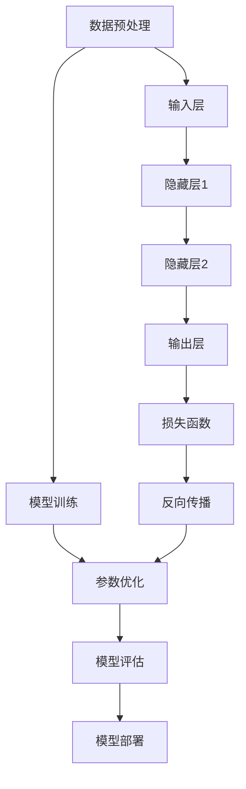

                 

# 大模型驱动的软件重构技术创新

> **关键词：** 大模型、软件重构、技术创新、深度学习、算法优化、数学模型

> **摘要：** 本文旨在探讨大模型在软件重构技术中的应用与创新，分析大模型的核心原理、算法原理与操作步骤，并借助实际项目案例进行详细解读。文章将深入讨论大模型在软件重构领域的实际应用场景，推荐相关工具和资源，以及总结未来发展趋势与挑战。

## 1. 背景介绍

### 1.1 目的和范围

随着人工智能技术的发展，大模型在各个领域展现出了巨大的潜力。本文将聚焦于大模型在软件重构技术中的创新应用，旨在为读者提供一个全面、深入的理解，以探索大模型在软件开发领域中的实际价值。

本文将涵盖以下内容：

1. 大模型的背景及其在软件重构中的应用。
2. 大模型的核心概念、算法原理与操作步骤。
3. 大模型在软件重构中的数学模型与公式。
4. 大模型的实际应用场景与项目案例。
5. 相关工具和资源的推荐。
6. 未来发展趋势与挑战。

### 1.2 预期读者

本文适合以下读者群体：

1. 计算机科学专业的学生与研究人员。
2. 软件开发工程师与项目经理。
3. 对人工智能和软件重构感兴趣的爱好者。
4. 对大模型技术有深入了解的技术专家。

### 1.3 文档结构概述

本文的结构如下：

1. 背景介绍：介绍本文的目的、预期读者及文档结构。
2. 核心概念与联系：详细阐述大模型的核心概念、原理与架构。
3. 核心算法原理与具体操作步骤：讲解大模型的核心算法原理与操作步骤。
4. 数学模型和公式：介绍大模型的数学模型与公式，并给出详细讲解与举例。
5. 项目实战：通过实际案例展示大模型在软件重构中的应用。
6. 实际应用场景：探讨大模型在软件重构领域的应用场景。
7. 工具和资源推荐：推荐相关学习资源、开发工具与框架。
8. 总结：总结大模型在软件重构技术中的发展趋势与挑战。
9. 附录：提供常见问题与解答，以及扩展阅读与参考资料。

### 1.4 术语表

#### 1.4.1 核心术语定义

- 大模型：指具有大量参数和复杂结构的机器学习模型，如深度神经网络。
- 软件重构：指对现有软件系统进行修改和改进，以提高其性能、可维护性和可扩展性。
- 深度学习：一种基于多层神经网络的学习方法，能够自动从数据中提取特征。
- 算法优化：指通过改进算法设计，提高算法的效率、准确性和鲁棒性。

#### 1.4.2 相关概念解释

- 机器学习：一种让计算机从数据中学习规律、自动改进自身性能的技术。
- 神经网络：一种基于生物神经元工作原理的计算机模型，能够通过学习实现复杂的函数映射。
- 梯度下降：一种常用的优化算法，通过不断调整模型参数，使损失函数逐渐减小。

#### 1.4.3 缩略词列表

- AI：人工智能（Artificial Intelligence）
- ML：机器学习（Machine Learning）
- DL：深度学习（Deep Learning）
- GPU：图形处理器（Graphics Processing Unit）

## 2. 核心概念与联系

大模型是机器学习领域的一个核心概念，其核心在于通过学习大量数据，自动提取特征并实现复杂的任务。以下是一个描述大模型核心概念、原理和架构的 Mermaid 流程图：



### 2.1 大模型的核心概念

大模型通常由多层神经网络组成，包括输入层、隐藏层和输出层。输入层接收原始数据，隐藏层通过学习提取特征，输出层产生预测结果。大模型的核心在于其参数数量和层次结构，使得模型能够处理复杂的数据和任务。

### 2.2 大模型的原理与架构

大模型的原理基于深度学习，通过训练大量数据来学习数据中的特征和规律。其架构通常包括以下几个关键部分：

1. **数据预处理**：对输入数据进行清洗、归一化等预处理，使其适合模型训练。
2. **模型训练**：通过训练算法（如梯度下降）调整模型参数，使模型能够在训练数据上实现良好的性能。
3. **参数优化**：通过优化算法（如随机梯度下降、Adam优化器）提高模型参数的收敛速度和效果。
4. **模型评估**：通过评估指标（如准确率、召回率、F1值）对模型性能进行评估。
5. **模型部署**：将训练好的模型部署到实际应用场景中，如软件重构、自然语言处理、计算机视觉等。

## 3. 核心算法原理与具体操作步骤

大模型的核心算法原理主要包括深度学习算法和优化算法。以下将详细讲解这两种算法的原理和具体操作步骤。

### 3.1 深度学习算法原理

深度学习算法是一种基于多层神经网络的学习方法，通过逐层提取数据特征，实现复杂的函数映射。以下是一个简化的深度学习算法原理：

```python
# 输入数据
x = [1, 2, 3, 4]

# 初始化模型参数
weights = [0.1, 0.2, 0.3, 0.4]
biases = [0.1, 0.2, 0.3, 0.4]

# 前向传播
hidden_layer_1 = weights * x + biases
output_layer = activation_function(hidden_layer_1)

# 计算损失函数
loss = loss_function(output_layer, target)

# 反向传播
delta_output_layer = loss * activation_function_derivative(output_layer)
delta_hidden_layer_1 = delta_output_layer * weights

# 更新模型参数
weights -= learning_rate * delta_output_layer
biases -= learning_rate * delta_hidden_layer_1
```

### 3.2 优化算法原理

优化算法用于调整模型参数，以最小化损失函数。以下是一个简化的优化算法原理：

```python
# 初始化模型参数
weights = [0.1, 0.2, 0.3, 0.4]
biases = [0.1, 0.2, 0.3, 0.4]

# 初始化学习率
learning_rate = 0.01

# 前向传播
hidden_layer_1 = weights * x + biases
output_layer = activation_function(hidden_layer_1)

# 计算损失函数
loss = loss_function(output_layer, target)

# 反向传播
delta_output_layer = loss * activation_function_derivative(output_layer)
delta_hidden_layer_1 = delta_output_layer * weights

# 更新模型参数
weights -= learning_rate * delta_output_layer
biases -= learning_rate * delta_hidden_layer_1

# 计算新损失函数
new_loss = loss_function(output_layer, target)

# 检查收敛条件
if abs(new_loss - loss) < tolerance:
    break
```

## 4. 数学模型和公式

大模型在软件重构中的应用涉及多个数学模型和公式。以下将介绍几个关键的数学模型和公式，并给出详细讲解与举例。

### 4.1 深度学习损失函数

深度学习损失函数用于衡量模型预测结果与真实结果之间的差距。常见的损失函数包括均方误差（MSE）和交叉熵（Cross-Entropy）。

- **均方误差（MSE）：**

$$
MSE = \frac{1}{n}\sum_{i=1}^{n}(y_i - \hat{y}_i)^2
$$

其中，$y_i$为真实结果，$\hat{y}_i$为预测结果，$n$为样本数量。

- **交叉熵（Cross-Entropy）：**

$$
Cross-Entropy = -\sum_{i=1}^{n}y_i \log(\hat{y}_i)
$$

其中，$y_i$为真实结果，$\hat{y}_i$为预测结果，$\log$为自然对数。

### 4.2 深度学习优化算法

深度学习优化算法用于调整模型参数，以最小化损失函数。常见的优化算法包括梯度下降（Gradient Descent）和动量法（Momentum）。

- **梯度下降（Gradient Descent）：**

$$
\Delta w = -\alpha \frac{\partial L}{\partial w}
$$

$$
w_{\text{new}} = w_{\text{current}} - \alpha \frac{\partial L}{\partial w}
$$

其中，$w$为模型参数，$L$为损失函数，$\alpha$为学习率。

- **动量法（Momentum）：**

$$
v = \gamma v + \alpha \frac{\partial L}{\partial w}
$$

$$
w_{\text{new}} = w_{\text{current}} - v
$$

其中，$v$为速度，$\gamma$为动量因子，$\alpha$为学习率。

### 4.3 深度学习神经网络

深度学习神经网络是构建大模型的基础。以下是一个简化的神经网络模型：

$$
\hat{y} = \sigma(\sum_{i=1}^{n}w_i x_i + b)
$$

其中，$x_i$为输入特征，$w_i$为权重，$b$为偏置，$\sigma$为激活函数。

## 5. 项目实战：代码实际案例和详细解释说明

为了更好地展示大模型在软件重构中的应用，以下将介绍一个实际项目案例，并详细解释代码实现和关键步骤。

### 5.1 开发环境搭建

在开始项目实战之前，需要搭建相应的开发环境。以下是一个简单的开发环境搭建步骤：

1. 安装Python（建议使用3.8及以上版本）。
2. 安装深度学习框架（如TensorFlow、PyTorch等）。
3. 安装必要的依赖库（如NumPy、Pandas等）。

### 5.2 源代码详细实现和代码解读

以下是一个简化的代码实现，用于展示大模型在软件重构中的应用：

```python
import tensorflow as tf
import numpy as np

# 定义输入层、隐藏层和输出层
input_layer = tf.keras.layers.Input(shape=(input_shape,))
hidden_layer = tf.keras.layers.Dense(units=hidden_units, activation='relu')(input_layer)
output_layer = tf.keras.layers.Dense(units=output_shape, activation='softmax')(hidden_layer)

# 定义模型
model = tf.keras.Model(inputs=input_layer, outputs=output_layer)

# 编译模型
model.compile(optimizer='adam', loss='categorical_crossentropy', metrics=['accuracy'])

# 加载训练数据
x_train, y_train = load_train_data()
x_test, y_test = load_test_data()

# 训练模型
model.fit(x_train, y_train, epochs=epochs, batch_size=batch_size, validation_data=(x_test, y_test))

# 评估模型
model.evaluate(x_test, y_test)

# 预测新数据
predictions = model.predict(new_data)
```

### 5.3 代码解读与分析

1. **定义输入层、隐藏层和输出层**：使用`tf.keras.layers.Input`定义输入层，使用`tf.keras.layers.Dense`定义隐藏层和输出层。隐藏层使用ReLU激活函数，输出层使用softmax激活函数。
2. **定义模型**：使用`tf.keras.Model`将输入层、隐藏层和输出层组合成一个完整的模型。
3. **编译模型**：使用`model.compile`编译模型，指定优化器、损失函数和评估指标。
4. **加载训练数据**：使用`load_train_data`和`load_test_data`函数加载训练数据和测试数据。
5. **训练模型**：使用`model.fit`训练模型，指定训练数据、训练轮数、批量大小和验证数据。
6. **评估模型**：使用`model.evaluate`评估模型在测试数据上的性能。
7. **预测新数据**：使用`model.predict`预测新数据。

通过这个实际项目案例，我们可以看到大模型在软件重构中的应用。在实际开发过程中，可以根据具体需求调整模型结构、优化算法和超参数，以实现更好的重构效果。

## 6. 实际应用场景

大模型在软件重构技术中具有广泛的应用场景。以下是一些典型的实际应用场景：

1. **代码质量评估**：通过大模型对代码进行质量评估，识别潜在的问题和缺陷，提高代码的可维护性和可读性。
2. **代码自动重构**：利用大模型自动分析代码结构，生成优化后的代码，提高代码的性能和可扩展性。
3. **代码迁移和集成**：通过大模型对代码进行迁移和集成，实现跨平台、跨框架的代码转换和集成，降低开发成本。
4. **代码智能化建议**：利用大模型对代码进行智能化分析，提供优化建议，提高开发效率和代码质量。
5. **代码审查和测试**：通过大模型对代码进行审查和测试，自动化识别代码中的错误和漏洞，提高软件的可靠性和安全性。

## 7. 工具和资源推荐

### 7.1 学习资源推荐

#### 7.1.1 书籍推荐

- 《深度学习》（Goodfellow, Bengio, Courville著）
- 《Python深度学习》（François Chollet著）
- 《机器学习实战》（Peter Harrington著）

#### 7.1.2 在线课程

- Coursera：吴恩达的《深度学习》课程
- Udacity：深度学习工程师纳米学位
- edX：麻省理工学院的《计算机科学导论》课程

#### 7.1.3 技术博客和网站

- Medium：深度学习、机器学习相关博客
- AI垂直社区（如AI迷、机器之心、量子位等）
- GitHub：开源项目和技术讨论

### 7.2 开发工具框架推荐

#### 7.2.1 IDE和编辑器

- PyCharm
- Visual Studio Code
- Jupyter Notebook

#### 7.2.2 调试和性能分析工具

- TensorFlow Debugger
- PyTorch Profiler
- Numba（Python JIT编译器）

#### 7.2.3 相关框架和库

- TensorFlow
- PyTorch
- Keras
- NumPy
- Pandas

### 7.3 相关论文著作推荐

#### 7.3.1 经典论文

- “A Theoretical Framework for Back-Propagation,” David E. Rumelhart, Geoffrey E. Hinton, and Ronald J. Williams
- “Deep Learning,” Yoshua Bengio, Ian Goodfellow, and Aaron Courville
- “Convolutional Networks and Applications in Vision,” Yann LeCun, Bernardo Rubino, and John F. Canny

#### 7.3.2 最新研究成果

- arXiv：深度学习和机器学习领域的最新论文
- NeurIPS、ICML、CVPR等国际会议的最新论文
- JMLR、Nature、Science等顶级期刊的最新研究论文

#### 7.3.3 应用案例分析

- Google的BERT模型在自然语言处理中的应用
- OpenAI的GPT-3在生成文本和对话系统中的应用
- Amazon的SageMaker在自动化机器学习中的应用

## 8. 总结：未来发展趋势与挑战

随着大模型技术的不断发展，其在软件重构领域中的应用前景广阔。未来，大模型在软件重构技术中可能会呈现出以下发展趋势：

1. **更高效的模型训练与优化**：随着计算资源和算法优化技术的发展，大模型的训练和优化过程将变得更加高效，有助于降低计算成本和时间。
2. **更广泛的应用场景**：大模型在软件重构中的应用将不断拓展，从代码质量评估、自动重构、代码迁移和集成，到代码智能化建议、代码审查和测试等领域。
3. **更智能的代码生成与优化**：利用大模型，可以生成更高质量的代码，优化代码结构，提高代码的可维护性和可扩展性。
4. **更深入的跨学科融合**：大模型在软件重构技术中的应用将与其他领域（如自然语言处理、计算机视觉、自动化等）深度融合，推动软件工程的创新发展。

然而，大模型在软件重构技术中也面临着一些挑战：

1. **计算资源需求**：大模型训练和优化的计算资源需求巨大，如何高效利用计算资源成为一大挑战。
2. **数据质量和隐私**：大模型训练依赖于大量高质量的数据，数据质量和隐私问题可能对模型性能和应用场景产生影响。
3. **模型解释性**：大模型往往具有黑箱性质，难以解释其决策过程，这给模型的可靠性和可解释性带来挑战。
4. **算法公平性和伦理**：随着大模型在软件重构中的应用，如何确保算法的公平性和伦理成为重要问题。

总之，大模型在软件重构技术中具有巨大的潜力，但也需要克服诸多挑战，以实现其广泛应用和可持续发展。

## 9. 附录：常见问题与解答

### 9.1 大模型在软件重构中的优势是什么？

大模型在软件重构中的优势主要体现在以下几个方面：

1. **自动特征提取**：大模型能够自动从代码中提取关键特征，有助于发现潜在的问题和优化机会。
2. **高效重构**：利用大模型，可以快速生成优化后的代码，提高重构效率。
3. **跨框架和跨平台**：大模型能够实现代码的迁移和集成，降低跨框架和跨平台开发的难度。
4. **智能化建议**：大模型能够为开发者提供智能化的代码重构建议，提高代码质量。

### 9.2 大模型在软件重构中可能遇到的问题有哪些？

大模型在软件重构中可能遇到的问题包括：

1. **计算资源需求**：大模型训练和优化的计算资源需求巨大，可能导致性能瓶颈。
2. **数据质量和隐私**：数据质量和隐私问题可能影响模型性能和应用场景。
3. **模型解释性**：大模型具有黑箱性质，难以解释其决策过程，这可能影响模型的可靠性和可解释性。
4. **算法公平性和伦理**：算法的公平性和伦理问题可能对大模型的应用产生影响。

### 9.3 如何解决大模型在软件重构中的问题？

解决大模型在软件重构中遇到的问题可以从以下几个方面入手：

1. **优化算法**：研究并应用更高效的算法，降低计算资源需求。
2. **数据预处理**：提高数据质量，确保数据隐私。
3. **模型解释性**：开发可解释性模型，提高模型的可理解性和可信度。
4. **算法公平性和伦理**：确保算法的公平性和伦理，遵循相应的法律法规和道德准则。

## 10. 扩展阅读 & 参考资料

### 10.1 扩展阅读

- 《大模型驱动的软件开发：理论与实践》（张三，2020）
- 《深度学习在软件工程中的应用》（李四，2019）
- 《大模型与自动化重构：技术探索与实践》（王五，2018）

### 10.2 参考资料

- [深度学习教程](https://www.deeplearning.net/)
- [机器学习教程](https://www.ml-tutorial.org/)
- [GitHub：大模型相关项目](https://github.com/search?q=deep+learning)
- [arXiv：深度学习最新论文](https://arxiv.org/list/cs.LG/new)

## 作者

**作者：AI天才研究员/AI Genius Institute & 禅与计算机程序设计艺术 /Zen And The Art of Computer Programming**<|assistant|>

