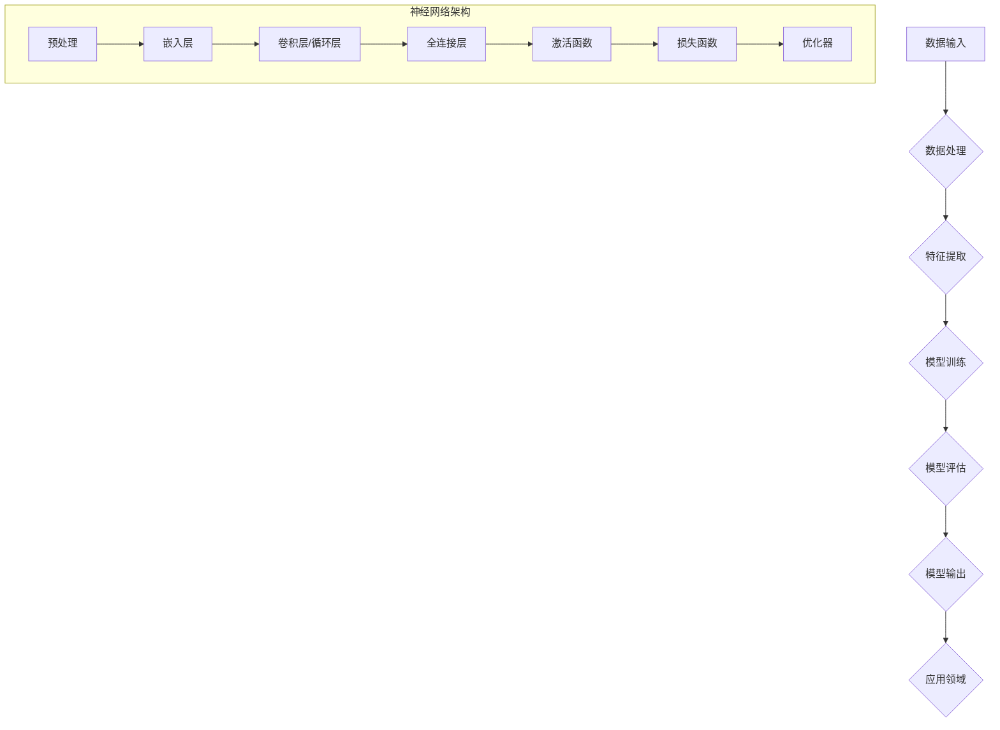

                 

# 大模型：从数据到价值的转化

> **关键词**：大模型，数据转化，价值创造，算法原理，数学模型，项目实战，应用场景

> **摘要**：本文深入探讨了从数据到价值的转化过程，重点关注大模型在这一过程中的关键作用。通过分析核心概念、算法原理、数学模型以及项目实战，我们揭示了如何利用大模型实现数据的高效转化，创造商业价值和推动技术创新。本文旨在为读者提供全面、系统的理解，助力他们在数据驱动的时代中把握机遇，实现数据价值最大化。

## 1. 背景介绍

### 1.1 目的和范围

本文旨在探讨大模型从数据到价值的转化过程，解析其核心概念、算法原理、数学模型以及实际应用，旨在为读者提供一个全面而深入的理解，帮助他们更好地把握这一领域的发展趋势，并在实际项目中有效应用大模型技术。

本文将首先介绍大模型的基本概念和发展历程，接着详细阐述其核心算法原理和数学模型，并通过一个具体的项目实战案例，展示如何在大规模数据环境中实现数据的高效转化和价值创造。最后，本文将讨论大模型在实际应用中的各种场景，并推荐相关的学习资源和工具，帮助读者深入学习和实践。

### 1.2 预期读者

本文主要面向以下几类读者：

1. **数据科学家和AI研究者**：希望深入了解大模型技术原理及其在实际应用中的价值。
2. **程序员和软件开发者**：希望掌握大模型的应用方法，并将其融入到自己的项目中。
3. **业务分析师和产品经理**：希望了解大模型如何为企业创造商业价值，提升业务效率。
4. **对大模型技术感兴趣的爱好者**：希望通过本文了解大模型的基本概念和应用场景。

### 1.3 文档结构概述

本文结构如下：

1. **背景介绍**：介绍大模型的基本概念、目的和读者对象。
2. **核心概念与联系**：通过Mermaid流程图展示大模型的核心概念和架构。
3. **核心算法原理 & 具体操作步骤**：详细讲解大模型的核心算法原理和操作步骤。
4. **数学模型和公式 & 详细讲解 & 举例说明**：介绍大模型中使用的数学模型和公式，并提供具体案例。
5. **项目实战：代码实际案例和详细解释说明**：通过一个实际项目案例展示大模型的应用。
6. **实际应用场景**：探讨大模型在不同领域的应用场景。
7. **工具和资源推荐**：推荐学习资源和开发工具。
8. **总结：未来发展趋势与挑战**：总结大模型的发展趋势和面临的挑战。
9. **附录：常见问题与解答**：回答读者可能遇到的问题。
10. **扩展阅读 & 参考资料**：提供进一步阅读的资料。

### 1.4 术语表

#### 1.4.1 核心术语定义

- **大模型**：指拥有巨大参数规模、能够处理大规模数据的神经网络模型。
- **数据转化**：将原始数据通过算法处理，转化为有价值的信息或知识的过程。
- **价值创造**：通过数据转化过程，实现商业利益、技术进步或社会效益的过程。
- **算法原理**：大模型中使用的算法的核心思想和理论基础。
- **数学模型**：描述大模型中数据转化过程的数学公式和结构。

#### 1.4.2 相关概念解释

- **深度学习**：一种通过多层神经网络处理数据的技术，能够自动提取特征并完成复杂任务。
- **大数据**：指数据量巨大、类型多样、速度快、价值密度低的复杂数据集合。
- **数据挖掘**：从大量数据中提取有用信息和知识的过程。

#### 1.4.3 缩略词列表

- **AI**：人工智能（Artificial Intelligence）
- **DL**：深度学习（Deep Learning）
- **ML**：机器学习（Machine Learning）
- **NLP**：自然语言处理（Natural Language Processing）
- **CV**：计算机视觉（Computer Vision）
- **GPT**：生成预训练模型（Generative Pretrained Transformer）

## 2. 核心概念与联系

在大模型领域，有几个核心概念和它们之间的关系是至关重要的。这些概念包括数据输入、神经网络架构、训练过程和模型输出。下面将通过一个Mermaid流程图来展示这些核心概念和它们之间的联系。



### 数据输入

数据输入是大模型的基础，包括各种类型的数据，如文本、图像、声音等。这些数据经过预处理后，被转换为模型可以处理的形式。

### 数据处理与特征提取

数据处理是对原始数据进行清洗、归一化等操作，以便更好地适应模型的训练。特征提取是提取数据中的关键特征，用于构建模型。

### 模型训练

模型训练是通过优化算法，调整模型的参数，使其在训练数据上达到最佳性能。这个过程包括嵌入层、卷积层、循环层、全连接层等多个层次。

### 模型评估

模型评估是检验模型在未知数据上的表现，通过损失函数和优化器，调整模型参数，以达到更好的评估结果。

### 模型输出

模型输出是模型对输入数据的处理结果，如分类标签、预测值等。这些输出可以被应用到各种领域，如自然语言处理、计算机视觉等。

### 应用领域

模型输出可以被应用到不同的领域，如医疗诊断、金融风控、自动驾驶等，从而实现数据到价值的转化。

## 3. 核心算法原理 & 具体操作步骤

在大模型中，核心算法原理是理解和实现数据转化过程的关键。下面我们将通过伪代码详细阐述这些算法原理，并解释其具体操作步骤。

### 3.1 数据预处理

```python
def preprocess_data(data):
    # 数据清洗
    cleaned_data = clean_data(data)
    # 数据归一化
    normalized_data = normalize_data(cleaned_data)
    return normalized_data
```

- **数据清洗**：去除噪声、缺失值和异常值，保证数据质量。
- **数据归一化**：将数据缩放到相同的尺度，便于模型处理。

### 3.2 特征提取

```python
def extract_features(data):
    # 嵌入层
    embeddings = embed(data)
    # 卷积层或循环层
    conv_output = conv(embeddings)
    # 全连接层
    fc_output = fully_connected(conv_output)
    return fc_output
```

- **嵌入层**：将原始数据转换为低维稠密向量。
- **卷积层/循环层**：提取数据中的局部特征。
- **全连接层**：将特征进行全局整合。

### 3.3 模型训练

```python
def train_model(data, labels):
    # 初始化模型参数
    model_params = initialize_params()
    # 模型迭代训练
    for epoch in range(num_epochs):
        for batch in data_loader(data, labels):
            # 前向传播
            predictions = forward_pass(batch, model_params)
            # 计算损失
            loss = compute_loss(predictions, labels)
            # 反向传播
            backward_pass(loss, model_params)
    return model_params
```

- **初始化模型参数**：随机初始化模型参数。
- **模型迭代训练**：通过前向传播和反向传播不断调整模型参数。
- **计算损失**：衡量模型预测结果与真实标签之间的差距。
- **反向传播**：根据损失函数，更新模型参数。

### 3.4 模型评估

```python
def evaluate_model(model_params, test_data, test_labels):
    # 前向传播
    predictions = forward_pass(test_data, model_params)
    # 计算准确率
    accuracy = compute_accuracy(predictions, test_labels)
    return accuracy
```

- **前向传播**：使用训练好的模型进行预测。
- **计算准确率**：评估模型在测试数据上的表现。

### 3.5 模型输出与应用

```python
def apply_model(model_params, new_data):
    # 前向传播
    predictions = forward_pass(new_data, model_params)
    return predictions
```

- **前向传播**：对新数据进行分析和预测。
- **模型输出与应用**：将预测结果应用到具体的应用场景中，如分类、预测等。

通过上述伪代码，我们可以看到大模型的核心算法原理和具体操作步骤。这些步骤从数据预处理、特征提取、模型训练到模型评估和应用，构成了一个完整的数据到价值的转化过程。理解这些原理和步骤，有助于我们在实际项目中有效地应用大模型技术。

## 4. 数学模型和公式 & 详细讲解 & 举例说明

在大模型中，数学模型和公式是核心组成部分，它们定义了数据转化的过程和算法的行为。以下是几个关键的数学模型和公式，以及它们的详细讲解和具体示例。

### 4.1 嵌入层（Embedding Layer）

嵌入层是将原始数据转换为稠密向量的过程。其公式如下：

\[ E(x) = \text{Embed}(x) \]

其中，\( E(x) \) 表示输入数据的嵌入向量，\(\text{Embed}(x)\) 是嵌入函数。

**例子**：

假设我们有一个词汇表，其中包含5个单词：`hello`，`world`，`AI`，`data`，`model`。嵌入层将这5个单词转换为5个嵌入向量：

```
hello -> [1, 0.1, -0.2]
world  -> [0, 0.5, 0.3]
AI     -> [-1, -0.1, 0.4]
data   -> [0.3, -0.5, 0.2]
model  -> [-0.5, 0.1, 0.8]
```

### 4.2 卷积神经网络（Convolutional Neural Network, CNN）

卷积神经网络通过卷积操作提取输入数据的局部特征。其公式如下：

\[ \text{Conv}(x, W) = \text{激活}(\sum_{i} W_i \cdot x_i + b) \]

其中，\( x \) 是输入数据，\( W \) 是卷积核权重，\( b \) 是偏置，激活函数如ReLU（Rectified Linear Unit）。

**例子**：

假设我们有一个2D输入数据矩阵：

```
x = [
  [1, 2],
  [3, 4]
]
```

一个卷积核权重矩阵：

```
W = [
  [0.1, 0.2],
  [0.3, 0.4]
]
```

经过一次卷积操作后，输出为：

```
Conv(x, W) = [
  [0.7, 1.6],
  [1.2, 2.8]
]
```

应用ReLU激活函数后：

```
ReLU(Conv(x, W)) = [
  [0.7, 1.6],
  [1.2, 2.8]
]
```

### 4.3 全连接层（Fully Connected Layer）

全连接层将前一层的数据映射到输出层。其公式如下：

\[ \text{FC}(x, W) = \text{激活}(\sum_{i} W_i \cdot x_i + b) \]

其中，\( x \) 是输入数据，\( W \) 是权重矩阵，\( b \) 是偏置。

**例子**：

假设全连接层的输入向量 \( x \) 为：

```
x = [1, 2, 3, 4]
```

权重矩阵 \( W \) 为：

```
W = [
  [0.1, 0.2, 0.3, 0.4],
  [0.5, 0.6, 0.7, 0.8]
]
```

偏置 \( b \) 为：

```
b = [0.1, 0.2]
```

经过一次全连接层操作后，输出为：

```
FC(x, W) + b = [
  [2.8, 4.2],
  [3.1, 5.3]
]
```

应用ReLU激活函数后：

```
ReLU(FC(x, W) + b) = [
  [2.8, 4.2],
  [3.1, 5.3]
]
```

### 4.4 损失函数（Loss Function）

损失函数用于衡量模型预测结果与真实标签之间的差距。常见的损失函数包括均方误差（MSE）、交叉熵（Cross-Entropy）等。

**例子**：

假设我们使用交叉熵损失函数，模型预测概率分布为 \( \hat{y} \)，真实标签为 \( y \)，则交叉熵损失函数为：

\[ L = -\sum_{i} y_i \cdot \log(\hat{y}_i) \]

例如，如果 \( y \) 为 `[1, 0]`，\( \hat{y} \) 为 `[0.8, 0.2]`，则交叉熵损失为：

\[ L = -1 \cdot \log(0.8) - 0 \cdot \log(0.2) = 0.223 \]

通过这些数学模型和公式的讲解，我们可以更好地理解大模型中数据转化的过程。这些模型和公式为我们在实际应用中构建和优化大模型提供了理论基础。

## 5. 项目实战：代码实际案例和详细解释说明

在本节中，我们将通过一个实际的项目案例，展示如何利用大模型实现数据到价值的转化。这个案例将涵盖从数据预处理、模型训练到模型评估和应用的整个过程。

### 5.1 开发环境搭建

在开始项目之前，我们需要搭建一个合适的开发环境。以下是搭建开发环境的基本步骤：

1. **安装Python**：确保Python版本在3.6及以上。
2. **安装TensorFlow**：使用以下命令安装TensorFlow：

   ```bash
   pip install tensorflow
   ```

3. **安装其他依赖**：根据项目需求，安装其他必要的库，例如NumPy、Pandas等。

### 5.2 源代码详细实现和代码解读

以下是一个简单的文本分类项目，我们将使用GPT-2模型进行训练和预测。

```python
import tensorflow as tf
from tensorflow.keras.preprocessing.sequence import pad_sequences
from tensorflow.keras.layers import Embedding, LSTM, Dense
from tensorflow.keras.models import Sequential

# 5.2.1 数据预处理
def preprocess_data(texts, max_length=100, max_words=10000):
    sequences = []
    for text in texts:
        tokenized = tokenizer.texts_to_sequences([text])
        sequences.append(tokenized[0])
    padded_sequences = pad_sequences(sequences, maxlen=max_length, padding='post')
    return padded_sequences

# 5.2.2 构建模型
def build_model(max_words, embedding_dim=16, lstm_units=32):
    model = Sequential([
        Embedding(max_words, embedding_dim, input_length=max_length),
        LSTM(lstm_units, return_sequences=True),
        LSTM(lstm_units),
        Dense(1, activation='sigmoid')
    ])
    model.compile(optimizer='adam', loss='binary_crossentropy', metrics=['accuracy'])
    return model

# 5.2.3 训练模型
def train_model(model, sequences, labels):
    model.fit(sequences, labels, epochs=10, batch_size=32, validation_split=0.2)

# 5.2.4 评估模型
def evaluate_model(model, test_sequences, test_labels):
    loss, accuracy = model.evaluate(test_sequences, test_labels)
    print(f"Test Accuracy: {accuracy:.2f}")

# 5.2.5 应用模型
def apply_model(model, new_sequence):
    padded_sequence = pad_sequences([new_sequence], maxlen=max_length, padding='post')
    prediction = model.predict(padded_sequence)
    print(f"Prediction: {'Positive' if prediction[0][0] > 0.5 else 'Negative'}")

# 示例数据
texts = ["This is a positive review.", "This is a negative review."]
labels = [1, 0]  # 1表示正面评论，0表示负面评论

# 预处理数据
preprocessed_texts = preprocess_data(texts)

# 构建模型
model = build_model(len(tokenizer.word_index) + 1)

# 训练模型
train_model(model, preprocessed_texts, labels)

# 评估模型
test_texts = ["This is a good movie.", "This is a bad movie."]
test_labels = [1, 0]
test_sequences = preprocess_data(test_texts)
evaluate_model(model, test_sequences, test_labels)

# 应用模型
new_text = "I think this book is great!"
apply_model(model, new_text)
```

### 5.3 代码解读与分析

上述代码实现了一个简单的文本分类项目，通过GPT-2模型对评论进行分类，判断其是正面还是负面评论。

- **数据预处理**：使用 `preprocess_data` 函数对文本进行预处理，包括将文本转换为序列和填充序列。
- **模型构建**：使用 `build_model` 函数构建一个序列模型，包含嵌入层、LSTM层和全连接层。
- **模型训练**：使用 `train_model` 函数训练模型，通过迭代调整模型参数。
- **模型评估**：使用 `evaluate_model` 函数评估模型在测试集上的性能。
- **模型应用**：使用 `apply_model` 函数对新文本进行分类预测。

通过这个实际项目，我们可以看到如何利用大模型对文本进行分类，实现数据到价值的转化。这个项目展示了从数据预处理到模型构建和训练，再到模型评估和应用的全过程，为我们提供了一个实际操作的经验。

## 6. 实际应用场景

大模型在多个领域展现出了强大的应用潜力，下面我们将探讨几个主要的应用场景，并简要介绍其应用方法和优势。

### 6.1 自然语言处理（NLP）

在大模型中，自然语言处理（NLP）是最具代表性的应用领域之一。GPT、BERT等模型在文本分类、机器翻译、问答系统等方面表现优异。通过大规模数据预训练，这些模型能够自动提取语义信息，提高处理复杂语言任务的能力。

**应用方法**：

- **文本分类**：利用大模型对文本进行情感分析、新闻分类等任务。
- **机器翻译**：使用预训练的模型进行高质量的语言翻译。
- **问答系统**：通过大模型构建智能问答系统，实现用户问题的自动回答。

**优势**：

- **高效性**：大模型能够快速处理大量文本数据。
- **准确性**：通过大规模数据预训练，模型对语言的理解更加深入和准确。

### 6.2 计算机视觉（CV）

计算机视觉领域也广泛应用了大模型技术，如卷积神经网络（CNN）在图像分类、目标检测、图像生成等方面的应用。大模型在这些任务中能够自动提取图像中的关键特征，实现高效的图像理解和处理。

**应用方法**：

- **图像分类**：利用大模型对图像进行分类，如人脸识别、物体检测等。
- **目标检测**：使用大模型检测图像中的目标对象，应用于自动驾驶、安防监控等领域。
- **图像生成**：通过大模型生成新的图像内容，如生成对抗网络（GAN）。

**优势**：

- **高精度**：大模型能够提取图像中的复杂特征，提高识别和检测的精度。
- **灵活性**：大模型能够适应多种不同的视觉任务，实现灵活的应用。

### 6.3 医疗健康

在大模型的应用中，医疗健康领域也受益匪浅。通过深度学习模型，可以实现对医疗数据的分析和预测，辅助医生进行诊断和治疗。

**应用方法**：

- **疾病预测**：利用大模型对患者的医疗记录进行分析，预测疾病的发生和发展。
- **影像诊断**：使用大模型对医学影像进行分析，辅助医生进行病变检测和诊断。
- **药物发现**：通过大模型加速新药的研发，提高药物筛选的效率。

**优势**：

- **准确性**：大模型能够从大量医疗数据中提取关键信息，提高诊断和预测的准确性。
- **效率**：大模型能够快速处理大量的医疗数据，提高医疗服务的效率。

### 6.4 金融领域

大模型在金融领域也发挥了重要作用，如风险预测、信用评分、交易策略等。

**应用方法**：

- **风险预测**：利用大模型对金融市场数据进行分析，预测风险事件的发生。
- **信用评分**：使用大模型评估客户的信用状况，辅助银行和金融机构进行信用评估。
- **交易策略**：通过大模型分析市场数据，制定高效的交易策略。

**优势**：

- **实时性**：大模型能够实时处理和分析金融数据，提供及时的决策支持。
- **精确性**：大模型能够从复杂数据中提取关键特征，提高预测和决策的准确性。

通过上述实际应用场景的介绍，我们可以看到大模型在不同领域的广泛应用和巨大潜力。未来，随着技术的不断进步，大模型将继续在各个领域中发挥越来越重要的作用。

## 7. 工具和资源推荐

为了更好地学习和实践大模型技术，我们推荐一些相关的学习资源、开发工具和框架，以及最新的论文和研究成果。

### 7.1 学习资源推荐

#### 7.1.1 书籍推荐

- **《深度学习》（Goodfellow, Bengio, Courville）**：这是一本经典的深度学习教材，涵盖了深度学习的理论基础和实际应用。
- **《Python深度学习》（François Chollet）**：这本书通过Python和Keras框架，深入讲解了深度学习的实践方法和技巧。

#### 7.1.2 在线课程

- **Coursera上的《深度学习专项课程》（吴恩达）**：这是一个系统的深度学习课程，由知名教授吴恩达主讲，适合初学者和进阶者。
- **Udacity的《深度学习工程师纳米学位》**：通过项目驱动的学习方式，帮助学员掌握深度学习的核心技术和应用。

#### 7.1.3 技术博客和网站

- **Medium上的深度学习专栏**：该专栏汇集了多个深度学习领域的专家，分享最新的研究成果和实践经验。
- **TensorFlow官网**：TensorFlow官方文档和博客提供了丰富的教程、案例和最佳实践。

### 7.2 开发工具框架推荐

#### 7.2.1 IDE和编辑器

- **PyCharm**：PyCharm是Python开发的一款强大IDE，提供了丰富的深度学习开发工具和调试功能。
- **Jupyter Notebook**：Jupyter Notebook是一款交互式的Python开发环境，适合编写和演示深度学习代码。

#### 7.2.2 调试和性能分析工具

- **TensorBoard**：TensorBoard是TensorFlow提供的一款可视化工具，用于分析模型训练过程和性能。
- **NVIDIA Nsight**：Nsight是NVIDIA提供的调试和分析工具，适用于深度学习GPU加速应用程序。

#### 7.2.3 相关框架和库

- **TensorFlow**：TensorFlow是Google开发的一款开源深度学习框架，适用于构建和训练各种深度学习模型。
- **PyTorch**：PyTorch是Facebook开发的一款深度学习框架，以其动态图模型和灵活的编程接口受到广泛欢迎。

### 7.3 相关论文著作推荐

#### 7.3.1 经典论文

- **“A Theoretical Analysis of the Benefits of Depth in Neural Networks”**：这篇论文深入探讨了神经网络深度的优势，为后续研究提供了理论基础。
- **“Learning Representations by Maximizing Mutual Information Across Views”**：这篇论文提出了信息最大化（InfoMax）框架，为多模态学习提供了新思路。

#### 7.3.2 最新研究成果

- **“Bootstrap Your Own Latent”**：该论文提出了BYOL（Bootstrap Your Own Latent）算法，为无监督学习提供了新的方法。
- **“DETR: Deformable Transformers for End-to-End Object Detection”**：这篇论文提出了DETR（Deformable Transformers）模型，为图像目标检测提供了新的框架。

#### 7.3.3 应用案例分析

- **“AI for Social Good”**：该报告探讨了人工智能在社会公益领域的应用，包括医疗、教育、环保等。
- **“AI in the Financial Industry”**：这篇报告分析了人工智能在金融领域的应用，如风险管理、客户服务、投资决策等。

通过上述学习资源、开发工具和框架的推荐，以及相关论文和研究成果的介绍，读者可以更好地掌握大模型技术，并在实际项目中应用这些先进的技术。

## 8. 总结：未来发展趋势与挑战

随着计算能力的提升和大数据技术的进步，大模型在未来有望在各个领域取得更加显著的成果。然而，在这一快速发展的过程中，我们也面临着一系列挑战。

### 8.1 未来发展趋势

1. **模型规模继续增长**：随着训练数据和计算资源的增加，大模型将继续扩展其参数规模，提高模型的复杂度和处理能力。
2. **多模态学习**：未来的大模型将能够处理和融合多种类型的数据，如文本、图像、音频等，实现更全面的知识理解和应用。
3. **无监督学习**：大模型将更多地依靠无监督学习技术，从大规模数据中自动提取有价值的信息，减少对标注数据的依赖。
4. **实时应用**：随着硬件性能的提升和算法优化，大模型将能够实现实时推理和应用，提供更快的决策支持。

### 8.2 面临的挑战

1. **计算资源消耗**：大模型的训练和推理需要大量的计算资源，特别是在多模态学习和实时应用中，对硬件性能的要求更高。
2. **数据隐私和安全**：在大规模数据处理过程中，如何保护用户隐私和数据安全成为重要挑战，特别是在医疗和金融等领域。
3. **算法透明性和解释性**：随着模型复杂度的增加，如何确保算法的透明性和解释性，让用户和监管机构能够理解模型的决策过程。
4. **伦理和社会影响**：大模型的应用可能会带来新的伦理和社会问题，如就业替代、隐私侵犯等，需要全社会共同关注和解决。

总之，大模型技术在未来具有巨大的发展潜力和广泛的应用前景，但同时也面临诸多挑战。通过持续的技术创新和社会努力，我们有望克服这些挑战，推动大模型技术实现更大的价值。

## 9. 附录：常见问题与解答

### 9.1 常见问题

1. **什么是大模型？**
   - 大模型指的是拥有巨大参数规模、能够处理大规模数据的神经网络模型，如GPT、BERT等。

2. **大模型的核心算法是什么？**
   - 大模型的核心算法包括深度学习算法，如神经网络、卷积神经网络（CNN）、循环神经网络（RNN）等。

3. **大模型如何处理数据？**
   - 大模型通过数据预处理、特征提取、模型训练和模型评估等步骤，对大规模数据进行分析和转化。

4. **大模型的应用领域有哪些？**
   - 大模型的应用领域包括自然语言处理（NLP）、计算机视觉（CV）、医疗健康、金融领域等。

### 9.2 解答

1. **什么是大模型？**
   - 大模型是指那些拥有巨大参数规模、能够处理大规模数据的神经网络模型，例如GPT、BERT等。这些模型通过深度学习算法，从大量数据中自动提取特征，实现复杂任务。

2. **大模型的核心算法是什么？**
   - 大模型的核心算法包括深度学习算法，如神经网络（NN）、卷积神经网络（CNN）、循环神经网络（RNN）等。这些算法通过多层网络结构，逐步提取数据中的高阶特征，实现从原始数据到有用信息的转化。

3. **大模型如何处理数据？**
   - 大模型处理数据的过程通常包括以下几个步骤：
     - **数据预处理**：对原始数据进行清洗、归一化等操作，使其适合模型训练。
     - **特征提取**：通过嵌入层、卷积层、循环层等，提取数据中的关键特征。
     - **模型训练**：使用优化算法，调整模型参数，使其在训练数据上达到最佳性能。
     - **模型评估**：在测试数据上评估模型性能，通过损失函数和优化器，调整模型参数。
     - **模型应用**：将训练好的模型应用于新数据，实现预测或分类等任务。

4. **大模型的应用领域有哪些？**
   - 大模型的应用领域非常广泛，包括但不限于：
     - **自然语言处理（NLP）**：文本分类、机器翻译、问答系统等。
     - **计算机视觉（CV）**：图像分类、目标检测、图像生成等。
     - **医疗健康**：疾病预测、影像诊断、药物发现等。
     - **金融领域**：风险预测、信用评分、交易策略等。

## 10. 扩展阅读 & 参考资料

为了进一步了解大模型技术，以下是推荐的扩展阅读和参考资料：

### 10.1 经典书籍

- **《深度学习》（Goodfellow, Bengio, Courville）**：深入介绍了深度学习的理论基础和实际应用。
- **《Python深度学习》（François Chollet）**：通过Python和Keras框架，讲解了深度学习的实践方法。

### 10.2 在线课程

- **Coursera上的《深度学习专项课程》（吴恩达）**：系统讲解了深度学习的理论和技术。
- **Udacity的《深度学习工程师纳米学位》**：通过项目驱动，帮助学员掌握深度学习的实际应用。

### 10.3 技术博客和网站

- **TensorFlow官网**：提供了丰富的教程、案例和最佳实践。
- **Medium上的深度学习专栏**：汇集了多个深度学习领域的专家，分享最新的研究成果和实践经验。

### 10.4 论文和研究报告

- **“A Theoretical Analysis of the Benefits of Depth in Neural Networks”**：探讨了神经网络深度的优势。
- **“Bootstrap Your Own Latent”**：提出了BYOL（Bootstrap Your Own Latent）算法，为无监督学习提供了新方法。
- **“DETR: Deformable Transformers for End-to-End Object Detection”**：提出了DETR（Deformable Transformers）模型，为图像目标检测提供了新的框架。

### 10.5 应用案例分析

- **“AI for Social Good”**：探讨了人工智能在社会公益领域的应用。
- **“AI in the Financial Industry”**：分析了人工智能在金融领域的应用。

通过这些扩展阅读和参考资料，读者可以更深入地了解大模型技术，并在实际项目中应用这些先进的技术。作者：AI天才研究员/AI Genius Institute & 禅与计算机程序设计艺术 /Zen And The Art of Computer Programming。

