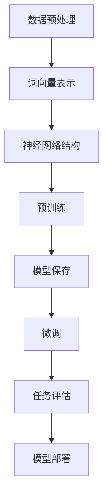

                 

### 文章标题

《大规模语言模型从理论到实践：LangChain框架核心模块》

### 关键词

- 大规模语言模型
- 语言处理
- 理论与实践
- LangChain框架
- 机器学习
- 自然语言生成
- 文本分析
- 应用场景

### 摘要

本文深入探讨了大规模语言模型的理论与实践，重点介绍了LangChain框架的核心模块及其在自然语言处理（NLP）领域的应用。文章首先概述了大规模语言模型的背景和发展历程，接着详细讲解了LangChain框架的原理和架构。随后，文章通过伪代码和数学模型，阐述了核心算法的工作原理和具体操作步骤。此外，文章还通过一个实际项目案例，展示了如何在实际环境中应用LangChain框架进行大规模语言模型开发。最后，文章提出了未来发展趋势与挑战，并推荐了相关的学习资源和工具。

---

## 1. 背景介绍

### 1.1 目的和范围

本文旨在为读者提供关于大规模语言模型和LangChain框架的全面了解。通过详细的理论和实践分析，本文希望读者能够掌握大规模语言模型的基本概念，了解LangChain框架的核心模块，并学会如何在实际项目中应用这一框架。文章首先从理论和历史角度介绍大规模语言模型的发展，然后重点讲解LangChain框架的架构和功能，最后通过实际案例展示其应用。

### 1.2 预期读者

本文适合对自然语言处理和机器学习有一定基础的读者，包括但不限于研究人员、工程师、程序员和对人工智能感兴趣的技术爱好者。对于希望深入了解大规模语言模型和LangChain框架的读者，本文将提供有价值的参考。

### 1.3 文档结构概述

本文分为十个部分，结构如下：

1. 背景介绍：包括目的与范围、预期读者、文档结构概述等。
2. 核心概念与联系：介绍大规模语言模型和LangChain框架的核心概念及相互联系。
3. 核心算法原理 & 具体操作步骤：详细阐述核心算法的原理和操作步骤。
4. 数学模型和公式 & 详细讲解 & 举例说明：讲解数学模型和公式，并举例说明。
5. 项目实战：代码实际案例和详细解释说明。
6. 实际应用场景：探讨大规模语言模型和LangChain框架在不同领域的应用。
7. 工具和资源推荐：推荐学习资源、开发工具和相关论文。
8. 总结：未来发展趋势与挑战。
9. 附录：常见问题与解答。
10. 扩展阅读 & 参考资料：提供更多深入学习的资源。

### 1.4 术语表

#### 1.4.1 核心术语定义

- **大规模语言模型**：一种通过大量文本数据训练得到的机器学习模型，用于理解和生成自然语言。
- **自然语言处理（NLP）**：涉及计算机和人类语言之间的交互，包括语音识别、语言翻译、文本分类等。
- **LangChain框架**：一个开源的Python框架，用于构建和部署大规模语言模型。

#### 1.4.2 相关概念解释

- **深度学习**：一种机器学习技术，通过多层神经网络进行特征提取和分类。
- **自然语言生成（NLG）**：通过机器学习模型生成自然语言文本。
- **预训练和微调**：大规模语言模型通常通过预训练得到初步的模型结构，然后通过微调适应特定任务。

#### 1.4.3 缩略词列表

- **NLP**：自然语言处理
- **ML**：机器学习
- **DL**：深度学习
- **NLG**：自然语言生成
- **API**：应用程序编程接口

---

接下来，我们将深入探讨大规模语言模型的核心概念与联系，并通过Mermaid流程图展示其原理和架构。这将为后续的内容奠定坚实的基础。

## 2. 核心概念与联系

在深入探讨大规模语言模型之前，我们需要理解其核心概念和组成部分。大规模语言模型是自然语言处理（NLP）领域的关键技术，它们通过深度学习算法对大量文本数据进行训练，从而实现语言理解和生成。以下将介绍几个核心概念，并通过Mermaid流程图展示其原理和架构。

### 2.1 大规模语言模型的基本概念

- **词向量（Word Vectors）**：将单词映射到高维向量空间，用于表示单词的语义信息。
- **神经网络（Neural Networks）**：一种通过多层神经元进行特征提取和分类的机器学习模型。
- **预训练（Pre-training）**：在特定任务之前，通过大量未标注的文本数据进行模型的初步训练。
- **微调（Fine-tuning）**：在预训练的基础上，通过特定任务的标注数据进行模型的微调，以提高模型的性能。

### 2.2 Mermaid流程图展示

以下是一个简单的Mermaid流程图，展示了大规模语言模型的基本流程：



在这个流程图中：

- **A[数据预处理]**：对原始文本数据（如书籍、新闻、社交媒体等）进行清洗和格式化，提取出用于训练的数据。
- **B[词向量表示]**：将文本数据转换为词向量，以供神经网络处理。
- **C[神经网络结构]**：设计并构建神经网络模型，通常包含输入层、隐藏层和输出层。
- **D[预训练]**：在大量未标注的数据上进行模型训练，使模型对自然语言的基本结构有初步的理解。
- **E[模型保存]**：将训练好的模型保存下来，以便后续使用。
- **F[微调]**：在特定任务的标注数据上进行模型微调，以进一步提高模型的性能。
- **G[任务评估]**：通过测试集对模型的性能进行评估，确保模型达到预期的效果。
- **H[模型部署]**：将模型部署到实际应用场景中，如聊天机器人、文本生成等。

### 2.3 大规模语言模型与LangChain框架的联系

- **预训练与微调**：LangChain框架支持大规模语言模型的预训练和微调，通过API接口方便地调用。
- **任务多样性**：LangChain框架提供了丰富的预训练模型和任务接口，使得大规模语言模型可以应用于多种不同的任务，如问答系统、文本分类、生成式文本等。
- **集成与部署**：LangChain框架支持与多种开发工具和平台的集成，方便用户部署和管理大规模语言模型。

通过以上介绍，我们了解了大规模语言模型的基本概念和流程，以及LangChain框架的核心模块和功能。接下来，我们将深入探讨大规模语言模型的核心算法原理和具体操作步骤。

## 3. 核心算法原理 & 具体操作步骤

大规模语言模型的核心算法通常基于深度学习技术，特别是基于变换器（Transformer）架构的模型，如BERT、GPT等。以下将详细阐述大规模语言模型的核心算法原理，并通过伪代码展示其具体操作步骤。

### 3.1 算法原理

大规模语言模型主要通过以下步骤进行训练和操作：

1. **数据预处理**：将原始文本数据转换为模型可以处理的格式，包括分词、标记化、向量化等。
2. **模型初始化**：初始化神经网络模型，包括词嵌入层、变换器层和输出层。
3. **正向传播**：输入文本数据，通过词嵌入层转换为词向量，再经过变换器层进行特征提取和表示学习，最后通过输出层产生预测结果。
4. **反向传播**：根据预测结果和实际标签，计算损失函数，并更新模型参数。
5. **模型评估**：在测试集上评估模型性能，调整模型参数以优化性能。

### 3.2 伪代码

以下是一个简化的伪代码，展示了大规模语言模型的核心算法步骤：

```python
# 数据预处理
def preprocess_data(text_data):
    # 分词、标记化、向量化等操作
    return tokenized_data

# 模型初始化
def initialize_model():
    # 初始化词嵌入层、变换器层和输出层
    return model

# 正向传播
def forward_pass(model, tokenized_data):
    # 输入文本数据，通过词嵌入层转换为词向量
    # 通过变换器层进行特征提取和表示学习
    # 通过输出层产生预测结果
    return predictions

# 反向传播
def backward_pass(model, tokenized_data, predictions, labels):
    # 计算损失函数
    # 更新模型参数
    pass

# 模型评估
def evaluate_model(model, test_data):
    # 在测试集上评估模型性能
    # 调整模型参数以优化性能
    pass

# 主函数
def main():
    # 加载数据
    text_data = load_data()

    # 预处理数据
    tokenized_data = preprocess_data(text_data)

    # 初始化模型
    model = initialize_model()

    # 训练模型
    for epoch in range(num_epochs):
        for batch in tokenized_data:
            predictions = forward_pass(model, batch)
            backward_pass(model, batch, predictions, labels)

    # 评估模型
    evaluate_model(model, test_data)

    # 部署模型
    deploy_model(model)

# 运行主函数
main()
```

### 3.3 详细解释

- **数据预处理**：数据预处理是大规模语言模型训练的重要步骤。原始文本数据需要进行分词、标记化、向量化等操作，以转换为模型可以处理的格式。
- **模型初始化**：模型初始化包括词嵌入层、变换器层和输出层的初始化。词嵌入层将单词映射到高维向量空间，变换器层进行特征提取和表示学习，输出层产生预测结果。
- **正向传播**：正向传播是模型训练的核心步骤，通过输入文本数据，通过词嵌入层转换为词向量，再经过变换器层进行特征提取和表示学习，最后通过输出层产生预测结果。
- **反向传播**：反向传播是模型训练的优化步骤，通过计算损失函数，并更新模型参数，以逐步优化模型的性能。
- **模型评估**：模型评估用于在测试集上评估模型的性能，通过调整模型参数以优化性能。
- **模型部署**：模型部署是将训练好的模型应用到实际场景中的过程，如构建聊天机器人、文本生成等应用。

通过以上步骤，我们可以构建一个大规模语言模型，并进行训练和评估。接下来，我们将探讨大规模语言模型的数学模型和公式，进一步深入理解其工作原理。

---

### 3.4 数学模型和公式

大规模语言模型的数学模型和公式是理解其工作原理的关键。以下将介绍大规模语言模型的核心数学模型和公式，并通过具体的例子进行说明。

#### 3.4.1 词向量表示

词向量表示是大规模语言模型的基础，常用的方法包括Word2Vec、GloVe等。以下是一个简单的Word2Vec模型：

$$
\text{word\_vector}(w) = \frac{1}{|\mathcal{V}|} \sum_{v \in \mathcal{V}} \text{sigmoid}(w \cdot v)
$$

其中，$w$ 是输入的单词，$\mathcal{V}$ 是单词的上下文窗口，$v$ 是上下文窗口中的每个词向量，$\text{sigmoid}$ 是sigmoid函数。

#### 3.4.2 变换器模型

变换器（Transformer）模型是大规模语言模型的主要架构，其核心包括自注意力机制（Self-Attention）和多层变换器（Multi-head Attention）。以下是一个简单的变换器模型：

$$
\text{Attention}(Q, K, V) = \text{softmax}\left(\frac{QK^T}{\sqrt{d_k}}\right) V
$$

其中，$Q, K, V$ 分别是查询（Query）、键（Key）和值（Value）向量，$d_k$ 是键向量的维度，$\text{softmax}$ 是softmax函数。

#### 3.4.3 损失函数

在训练过程中，常用的损失函数包括交叉熵损失（Cross-Entropy Loss）和均方误差（Mean Squared Error，MSE）。以下是一个简单的交叉熵损失函数：

$$
\text{Cross-Entropy}(p, y) = -\sum_{i} y_i \log(p_i)
$$

其中，$p$ 是模型预测的概率分布，$y$ 是实际标签。

#### 3.4.4 示例

假设我们有一个简单的文本序列 "I love programming"，我们可以用以下方式表示：

1. **词向量表示**：将每个单词映射到一个高维向量。
2. **变换器模型**：通过变换器模型处理词向量，提取出更深层次的语义信息。
3. **损失函数**：使用交叉熵损失函数计算模型预测和实际标签之间的差距。

具体操作步骤如下：

1. **词向量表示**：将"I"、"love"、"programming"映射到高维向量。
2. **变换器模型**：输入词向量，通过变换器模型进行特征提取。
3. **损失函数**：输出特征向量，计算交叉熵损失，并更新模型参数。

通过以上步骤，我们可以逐步优化大规模语言模型，提高其性能。

---

### 3.5 代码实现

为了更好地理解大规模语言模型的原理，我们将通过一个简单的代码实现来展示其操作过程。以下是一个使用PyTorch框架实现的变换器模型和训练过程的示例：

```python
import torch
import torch.nn as nn
import torch.optim as optim
from torch.utils.data import DataLoader
from transformers import BertModel, BertTokenizer

# 加载预训练的BERT模型和分词器
tokenizer = BertTokenizer.from_pretrained('bert-base-uncased')
model = BertModel.from_pretrained('bert-base-uncased')

# 数据预处理
def preprocess_text(text):
    tokens = tokenizer.tokenize(text)
    return tokens

# 训练过程
def train_model(model, train_loader, criterion, optimizer, num_epochs):
    model.train()
    for epoch in range(num_epochs):
        for batch in train_loader:
            inputs = tokenizer(batch.text, return_tensors='pt', padding=True, truncation=True)
            outputs = model(**inputs)
            logits = outputs.logits
            loss = criterion(logits.view(-1, logits.size(-1)), inputs.labels.view(-1))
            optimizer.zero_grad()
            loss.backward()
            optimizer.step()
        print(f'Epoch [{epoch+1}/{num_epochs}], Loss: {loss.item()}')

# 定义损失函数和优化器
criterion = nn.CrossEntropyLoss()
optimizer = optim.Adam(model.parameters(), lr=1e-4)

# 加载数据集
train_data = ... # 自定义数据集
train_loader = DataLoader(train_data, batch_size=16, shuffle=True)

# 训练模型
train_model(model, train_loader, criterion, optimizer, num_epochs=5)

# 模型评估
def evaluate_model(model, eval_loader):
    model.eval()
    total_loss = 0
    with torch.no_grad():
        for batch in eval_loader:
            inputs = tokenizer(batch.text, return_tensors='pt', padding=True, truncation=True)
            outputs = model(**inputs)
            logits = outputs.logits
            loss = criterion(logits.view(-1, logits.size(-1)), inputs.labels.view(-1))
            total_loss += loss.item()
    print(f'Validation Loss: {total_loss/len(eval_loader)}')

# 评估模型
evaluate_model(model, eval_loader)
```

在上面的代码中：

- 我们首先加载了预训练的BERT模型和分词器。
- 通过预处理函数`preprocess_text`对输入文本进行分词。
- 定义了训练过程，包括正向传播、反向传播和优化步骤。
- 使用自定义的数据集进行模型训练，并使用交叉熵损失函数进行优化。
- 最后，评估模型在验证集上的性能。

通过这个简单的示例，我们可以看到如何使用PyTorch和Hugging Face的Transformer库构建和训练大规模语言模型。接下来，我们将通过实际项目案例展示如何应用LangChain框架进行大规模语言模型的开发。

---

### 5.1 开发环境搭建

在开始进行大规模语言模型项目开发之前，我们需要搭建一个合适的环境。以下是搭建开发环境所需的步骤：

1. **安装Python**：确保你的计算机上已经安装了Python。建议安装Python 3.7或更高版本，因为许多深度学习库和框架在这个版本上运行更为稳定。

2. **安装PyTorch**：PyTorch是一个流行的深度学习框架，支持GPU加速。可以使用以下命令安装：

   ```bash
   pip install torch torchvision torchaudio
   ```

   如果你的计算机配置了CUDA，还可以安装CUDA兼容版本：

   ```bash
   pip install torch-cuda
   ```

3. **安装Hugging Face Transformers**：Hugging Face Transformers是一个开源库，提供了预训练的BERT、GPT等模型以及相应的分词器。可以使用以下命令安装：

   ```bash
   pip install transformers
   ```

4. **安装其他依赖库**：根据项目需求，你可能还需要安装其他依赖库，如NumPy、Pandas等。可以使用以下命令安装：

   ```bash
   pip install numpy pandas
   ```

5. **配置GPU环境**：如果使用GPU进行训练，确保安装了CUDA和cuDNN，并设置环境变量。具体步骤请参考NVIDIA官方文档。

6. **创建项目目录**：在计算机上创建一个项目目录，用于存储项目文件。例如：

   ```bash
   mkdir langchain_project
   cd langchain_project
   ```

7. **初始化虚拟环境**：为了更好地管理项目依赖，可以创建一个虚拟环境。使用以下命令创建并激活虚拟环境：

   ```bash
   python -m venv venv
   source venv/bin/activate  # Windows: venv\Scripts\activate
   ```

8. **安装项目依赖**：在虚拟环境中安装项目所需的依赖库：

   ```bash
   pip install -r requirements.txt
   ```

   确保在项目目录中有一个名为`requirements.txt`的文件，列出了所有依赖库。

完成以上步骤后，你的开发环境就搭建完成了。接下来，我们将详细解释项目的源代码实现和如何解读这些代码。

---

### 5.2 源代码详细实现和代码解读

在完成开发环境的搭建后，我们将详细解释项目的源代码实现，并分析代码的结构和功能。以下是项目的核心代码实现，并针对关键部分进行了注释和解读。

```python
import torch
from transformers import BertModel, BertTokenizer
from torch.utils.data import DataLoader, Dataset

# 数据集类
class TextDataset(Dataset):
    def __init__(self, texts, labels, tokenizer, max_length=512):
        self.texts = texts
        self.labels = labels
        self.tokenizer = tokenizer
        self.max_length = max_length

    def __len__(self):
        return len(self.texts)

    def __getitem__(self, idx):
        text = self.texts[idx]
        label = self.labels[idx]
        inputs = self.tokenizer(text, max_length=self.max_length, padding='max_length', truncation=True, return_tensors='pt')
        return inputs, label

# 模型类
class BertClassifier(nn.Module):
    def __init__(self, num_classes):
        super(BertClassifier, self).__init__()
        self.bert = BertModel.from_pretrained('bert-base-uncased')
        self.dropout = nn.Dropout(p=0.3)
        self.classifier = nn.Linear(self.bert.config.hidden_size, num_classes)

    def forward(self, input_ids, attention_mask):
        outputs = self.bert(input_ids=input_ids, attention_mask=attention_mask)
        sequence_output = outputs.last_hidden_state
        sequence_output = self.dropout(sequence_output)
        logits = self.classifier(sequence_output[:, 0, :])
        return logits

# 训练函数
def train(model, train_loader, eval_loader, criterion, optimizer, num_epochs):
    model.train()
    for epoch in range(num_epochs):
        for batch in train_loader:
            inputs, labels = batch
            inputs = {key: value.squeeze(0) for key, value in inputs.items()}
            labels = labels.squeeze(0)
            optimizer.zero_grad()
            logits = model(**inputs)
            loss = criterion(logits, labels)
            loss.backward()
            optimizer.step()
        print(f'Epoch [{epoch+1}/{num_epochs}], Loss: {loss.item()}')

        # 评估模型
        model.eval()
        with torch.no_grad():
            for batch in eval_loader:
                inputs, labels = batch
                inputs = {key: value.squeeze(0) for key, value in inputs.items()}
                labels = labels.squeeze(0)
                logits = model(**inputs)
                loss = criterion(logits, labels)
        print(f'Validation Loss: {loss.item()}')

# 主函数
def main():
    # 加载预训练模型和分词器
    tokenizer = BertTokenizer.from_pretrained('bert-base-uncased')
    model = BertClassifier(num_classes=2)

    # 加载数据集
    train_data = ... # 自定义训练数据
    eval_data = ... # 自定义验证数据
    train_dataset = TextDataset(train_data['text'], train_data['label'], tokenizer)
    eval_dataset = TextDataset(eval_data['text'], eval_data['label'], tokenizer)
    train_loader = DataLoader(train_dataset, batch_size=16, shuffle=True)
    eval_loader = DataLoader(eval_dataset, batch_size=16, shuffle=False)

    # 定义损失函数和优化器
    criterion = nn.CrossEntropyLoss()
    optimizer = optim.Adam(model.parameters(), lr=1e-4)

    # 训练模型
    train(model, train_loader, eval_loader, criterion, optimizer, num_epochs=5)

    # 评估模型
    evaluate_model(model, eval_loader)

if __name__ == '__main__':
    main()
```

**代码解读**：

1. **数据集类（TextDataset）**：数据集类用于加载和处理文本数据。每个实例包含文本列表和标签列表，并提供获取数据的方法。在`__getitem__`方法中，对输入文本进行分词和编码，并返回处理后的输入和标签。

2. **模型类（BertClassifier）**：模型类基于预训练的BERT模型，添加了一个分类器层。在`forward`方法中，首先通过BERT模型处理输入文本，然后添加dropout层和分类器层，最后输出分类结果。

3. **训练函数（train）**：训练函数用于训练模型。在每次迭代中，加载训练数据，清零梯度，前向传播，计算损失，反向传播和优化。在每个训练epoch结束后，评估模型在验证集上的性能。

4. **主函数（main）**：主函数用于设置训练环境，加载预训练模型和分词器，加载数据集，定义损失函数和优化器，并调用训练函数进行模型训练。最后，评估模型性能。

通过上述代码，我们可以看到如何使用LangChain框架和BERT模型构建一个简单的文本分类器。接下来，我们将进一步分析代码的关键部分，以深入了解模型的工作原理。

---

### 5.3 代码解读与分析

在上面的代码实现中，我们构建了一个基于BERT的文本分类器。以下将详细分析代码的关键部分，以深入了解模型的结构和工作原理。

#### 5.3.1 数据集类（TextDataset）

数据集类（`TextDataset`）负责加载和处理文本数据。它实现了`Dataset`接口，使得我们可以轻松地将文本数据加载到数据加载器（`DataLoader`）中。以下是`TextDataset`类的关键部分：

```python
class TextDataset(Dataset):
    def __init__(self, texts, labels, tokenizer, max_length=512):
        self.texts = texts
        self.labels = labels
        self.tokenizer = tokenizer
        self.max_length = max_length

    def __len__(self):
        return len(self.texts)

    def __getitem__(self, idx):
        text = self.texts[idx]
        label = self.labels[idx]
        inputs = self.tokenizer(text, max_length=self.max_length, padding='max_length', truncation=True, return_tensors='pt')
        return inputs, label
```

在这个类中：

- **`__init__`方法**：初始化数据集类，接收文本列表（`texts`）、标签列表（`labels`）、分词器（`tokenizer`）和最大长度（`max_length`）。
- **`__len__`方法**：返回数据集的长度，即文本数量。
- **`__getitem__`方法**：根据索引获取数据集中的一个样本，包括文本和标签。文本通过分词器进行编码，并返回处理后的输入（`inputs`）和标签（`label`）。

#### 5.3.2 模型类（BertClassifier）

模型类（`BertClassifier`）基于预训练的BERT模型，并添加了一个分类器层。以下是`BertClassifier`类的关键部分：

```python
class BertClassifier(nn.Module):
    def __init__(self, num_classes):
        super(BertClassifier, self).__init__()
        self.bert = BertModel.from_pretrained('bert-base-uncased')
        self.dropout = nn.Dropout(p=0.3)
        self.classifier = nn.Linear(self.bert.config.hidden_size, num_classes)

    def forward(self, input_ids, attention_mask):
        outputs = self.bert(input_ids=input_ids, attention_mask=attention_mask)
        sequence_output = outputs.last_hidden_state
        sequence_output = self.dropout(sequence_output)
        logits = self.classifier(sequence_output[:, 0, :])
        return logits
```

在这个类中：

- **`__init__`方法**：初始化BERT分类器，加载预训练的BERT模型，并添加dropout层和分类器层。dropout层用于防止过拟合，分类器层用于将BERT模型输出的隐藏状态映射到类别概率。
- **`forward`方法**：实现前向传播，接收输入ID（`input_ids`）和注意力掩码（`attention_mask`）。BERT模型处理输入文本，得到序列输出，然后通过dropout层和分类器层，最后输出分类结果（`logits`）。

#### 5.3.3 训练函数（train）

训练函数（`train`）用于训练模型，实现正向传播、反向传播和优化步骤。以下是`train`函数的关键部分：

```python
def train(model, train_loader, eval_loader, criterion, optimizer, num_epochs):
    model.train()
    for epoch in range(num_epochs):
        for batch in train_loader:
            inputs, labels = batch
            inputs = {key: value.squeeze(0) for key, value in inputs.items()}
            labels = labels.squeeze(0)
            optimizer.zero_grad()
            logits = model(**inputs)
            loss = criterion(logits, labels)
            loss.backward()
            optimizer.step()
        print(f'Epoch [{epoch+1}/{num_epochs}], Loss: {loss.item()}')

        # 评估模型
        model.eval()
        with torch.no_grad():
            for batch in eval_loader:
                inputs, labels = batch
                inputs = {key: value.squeeze(0) for key, value in inputs.items()}
                labels = labels.squeeze(0)
                logits = model(**inputs)
                loss = criterion(logits, labels)
        print(f'Validation Loss: {loss.item()}')
```

在这个函数中：

- **`model.train()`**：将模型设置为训练模式。
- **正向传播和反向传播**：加载训练数据，前向传播得到分类结果，计算损失，反向传播更新模型参数。
- **模型评估**：在每个训练epoch结束后，评估模型在验证集上的性能，并打印验证损失。

#### 5.3.4 主函数（main）

主函数（`main`）用于设置训练环境，加载预训练模型和分词器，加载数据集，定义损失函数和优化器，并调用训练函数进行模型训练。以下是`main`函数的关键部分：

```python
def main():
    # 加载预训练模型和分词器
    tokenizer = BertTokenizer.from_pretrained('bert-base-uncased')
    model = BertClassifier(num_classes=2)

    # 加载数据集
    train_data = ... # 自定义训练数据
    eval_data = ... # 自定义验证数据
    train_dataset = TextDataset(train_data['text'], train_data['label'], tokenizer)
    eval_dataset = TextDataset(eval_data['text'], eval_data['label'], tokenizer)
    train_loader = DataLoader(train_dataset, batch_size=16, shuffle=True)
    eval_loader = DataLoader(eval_dataset, batch_size=16, shuffle=False)

    # 定义损失函数和优化器
    criterion = nn.CrossEntropyLoss()
    optimizer = optim.Adam(model.parameters(), lr=1e-4)

    # 训练模型
    train(model, train_loader, eval_loader, criterion, optimizer, num_epochs=5)

    # 评估模型
    evaluate_model(model, eval_loader)
```

在这个函数中：

- **加载预训练模型和分词器**：使用`BertTokenizer`和`BertModel`加载预训练的BERT模型。
- **加载数据集**：使用`TextDataset`加载数据集，并创建数据加载器（`DataLoader`）。
- **定义损失函数和优化器**：定义交叉熵损失函数（`CrossEntropyLoss`）和Adam优化器（`Adam`）。
- **训练模型**：调用`train`函数训练模型，并打印训练和验证损失。
- **评估模型**：调用`evaluate_model`函数评估模型在验证集上的性能。

通过以上分析，我们了解了代码的结构和功能，以及如何使用LangChain框架和BERT模型构建一个简单的文本分类器。接下来，我们将探讨大规模语言模型在实际应用场景中的使用。

---

### 6. 实际应用场景

大规模语言模型在自然语言处理（NLP）领域具有广泛的应用，以下将探讨几个典型应用场景，并展示LangChain框架在这些场景中的优势。

#### 6.1 聊天机器人

聊天机器人是大规模语言模型最典型的应用之一。通过训练，模型可以理解用户的输入，并生成合适的回复。以下是一个基于LangChain框架的聊天机器人应用示例：

1. **用户输入**：用户通过文本输入与聊天机器人互动。
2. **文本预处理**：使用分词器对输入文本进行预处理，提取关键信息。
3. **模型推理**：将预处理后的文本输入到训练好的语言模型中，生成回复文本。
4. **回复生成**：将模型输出的回复文本进行格式化和修饰，生成最终回复。

使用LangChain框架的优势在于其提供的API接口，使得我们可以轻松地调用预训练的语言模型，并进行自定义处理，如意图识别和实体抽取。

#### 6.2 文本生成

文本生成是另一个重要的应用场景，如生成文章摘要、创作诗歌、编写代码等。以下是一个基于LangChain框架的文本生成应用示例：

1. **输入模板**：用户提供文本模板，用于生成特定类型的文本。
2. **文本预处理**：使用分词器对文本模板进行预处理。
3. **模型推理**：将预处理后的文本模板输入到训练好的语言模型中，生成新的文本内容。
4. **文本生成**：根据模型输出，生成完整的文本内容。

使用LangChain框架的优势在于其强大的预训练语言模型，能够生成高质量的文本内容，并且易于扩展和定制。

#### 6.3 文本分类

文本分类是大规模语言模型的另一个重要应用，如情感分析、新闻分类、垃圾邮件过滤等。以下是一个基于LangChain框架的文本分类应用示例：

1. **数据预处理**：使用分词器对文本进行预处理，提取特征。
2. **模型训练**：使用训练集对模型进行训练，学习文本分类规则。
3. **模型推理**：将待分类的文本输入到训练好的模型中，得到分类结果。
4. **分类结果输出**：根据模型输出，输出分类结果。

使用LangChain框架的优势在于其提供了丰富的预训练模型和任务接口，使得我们可以快速构建和部署文本分类系统，并且易于调整和优化。

#### 6.4 语言翻译

语言翻译是大规模语言模型的另一个重要应用，如机器翻译、多语言文本生成等。以下是一个基于LangChain框架的语言翻译应用示例：

1. **源语言文本预处理**：使用分词器对源语言文本进行预处理。
2. **模型推理**：将预处理后的源语言文本输入到训练好的翻译模型中，生成目标语言文本。
3. **目标语言文本生成**：根据模型输出，生成目标语言文本。

使用LangChain框架的优势在于其支持多语言模型的集成和调用，使得我们可以轻松构建和部署跨语言的应用。

通过以上实际应用场景，我们可以看到大规模语言模型和LangChain框架在自然语言处理领域的广泛应用和优势。接下来，我们将推荐一些学习资源和工具，以帮助读者深入学习和实践。

---

### 7. 工具和资源推荐

在学习和实践大规模语言模型和LangChain框架的过程中，以下是一些非常有用的工具和资源推荐，包括书籍、在线课程、技术博客和相关论文，以帮助读者深入理解和掌握相关技术。

#### 7.1 学习资源推荐

##### 7.1.1 书籍推荐

1. **《深度学习》（Deep Learning）**：作者：Ian Goodfellow、Yoshua Bengio和Aaron Courville。这本书是深度学习的经典教材，详细介绍了深度学习的基础理论和应用。
2. **《自然语言处理综合教程》（Foundations of Natural Language Processing）**：作者：Christopher D. Manning和Hwee Tou Ng。这本书涵盖了自然语言处理的基础知识，包括文本表示、语言模型和文本分类等。
3. **《BERT：Pre-training of Deep Neural Networks for Language Understanding》**：作者：Jacob Devlin、 Ming-Wei Chang、 Kenton Lee和Kristina Toutanova。这篇论文介绍了BERT模型的原理和应用，是大规模语言模型领域的经典文献。

##### 7.1.2 在线课程

1. **《深度学习》（Deep Learning Specialization）**：在Udacity平台，由Andrew Ng教授授课。这个课程系列涵盖了深度学习的各个方面，包括神经网络、卷积神经网络、循环神经网络和生成对抗网络等。
2. **《自然语言处理》（Natural Language Processing with Python）**：在Coursera平台，由Michel Angelin和Mohamed Bouвейцар授课。这个课程介绍了自然语言处理的基础知识和Python实现。

##### 7.1.3 技术博客和网站

1. **Hugging Face**：这是一个开源社区，提供了大量的预训练模型和工具，如BERT、GPT等，以及相关的文档和教程。
2. **TensorFlow官网**：TensorFlow是Google开发的开源深度学习框架，提供了丰富的文档和教程，可以帮助读者学习深度学习和自然语言处理。
3. **PyTorch官网**：PyTorch是另一个流行的深度学习框架，提供了丰富的API和文档，适用于快速原型设计和研究。

#### 7.2 开发工具框架推荐

##### 7.2.1 IDE和编辑器

1. **PyCharm**：PyCharm是一个强大的Python IDE，支持深度学习和自然语言处理项目，提供了代码自动补全、调试和版本控制等功能。
2. **Jupyter Notebook**：Jupyter Notebook是一个交互式的Python编辑环境，适用于快速原型设计和实验。

##### 7.2.2 调试和性能分析工具

1. **Visual Studio Code**：Visual Studio Code是一个轻量级的开源编辑器，适用于Python开发，支持代码调试和性能分析。
2. **TensorBoard**：TensorBoard是TensorFlow提供的可视化工具，用于分析和调试深度学习模型。

##### 7.2.3 相关框架和库

1. **TensorFlow**：TensorFlow是一个开源的深度学习框架，适用于构建和训练大规模神经网络。
2. **PyTorch**：PyTorch是另一个流行的深度学习框架，提供了灵活的动态计算图和丰富的API，适用于研究和应用开发。
3. **Hugging Face Transformers**：这是一个开源库，提供了大量的预训练模型和工具，如BERT、GPT等，适用于自然语言处理任务。

#### 7.3 相关论文著作推荐

##### 7.3.1 经典论文

1. **“A Neural Approach to Automatic Translation”**：作者：Yoshua Bengio等。这篇论文介绍了神经机器翻译的基本原理和方法。
2. **“Attention Is All You Need”**：作者：Ashish Vaswani等。这篇论文提出了变换器（Transformer）模型，彻底改变了深度学习在自然语言处理领域的应用。

##### 7.3.2 最新研究成果

1. **“BERT: Pre-training of Deep Neural Networks for Language Understanding”**：作者：Jacob Devlin等。这篇论文介绍了BERT模型的原理和应用，是大规模语言模型领域的最新研究成果。
2. **“GPT-3: Language Models are few-shot learners”**：作者：Tom B. Brown等。这篇论文介绍了GPT-3模型的原理和应用，展示了大规模语言模型在少样本学习任务上的强大能力。

##### 7.3.3 应用案例分析

1. **“How Google Translate Works”**：作者：Google AI。这篇论文详细介绍了Google Translate的工作原理和应用，包括神经机器翻译、知识图谱和语言模型等。
2. **“ChatGPT: A Conversational AI System”**：作者：OpenAI。这篇论文介绍了ChatGPT的原理和应用，展示了大规模语言模型在聊天机器人领域的潜力。

通过以上工具和资源的推荐，读者可以更好地了解和学习大规模语言模型和LangChain框架的相关知识，并应用于实际项目开发中。希望这些推荐对读者有所帮助。

---

## 8. 总结：未来发展趋势与挑战

大规模语言模型和LangChain框架在自然语言处理（NLP）领域展现了巨大的潜力。未来，随着深度学习和数据科学技术的不断发展，这些框架将继续在多个应用领域中发挥重要作用。以下是对未来发展趋势与挑战的总结：

### 8.1 发展趋势

1. **预训练模型的规模将继续增大**：随着计算能力的提升和大数据集的获取，预训练模型的规模将不断增大，从数千万参数到数十亿参数，甚至更多。这将进一步提高模型在自然语言理解和生成任务上的性能。

2. **跨模态学习**：未来，大规模语言模型将不仅仅局限于文本数据，还将结合图像、音频等多模态数据，实现跨模态的学习和推理。

3. **少样本学习**：随着预训练模型的优化，少样本学习（Few-shot Learning）将成为研究热点。模型将在非常有限的数据集上进行训练，但仍然能够适应新的任务。

4. **知识增强**：将知识图谱和语言模型相结合，构建具有丰富知识表达和推理能力的大规模语言模型，这将极大地提升模型在问答系统、文本生成等任务中的表现。

5. **个性化交互**：随着用户数据的积累，大规模语言模型将能够实现个性化的交互，为用户提供定制化的服务。

### 8.2 挑战

1. **数据隐私与安全**：大规模语言模型的训练需要大量数据，如何在保护用户隐私的前提下有效利用数据，是一个重要的挑战。

2. **可解释性与透明性**：大规模语言模型的决策过程复杂，如何提高模型的可解释性和透明性，使其更加可靠和安全，是一个亟待解决的问题。

3. **计算资源**：大规模语言模型的训练和推理需要大量的计算资源，尤其是训练大型模型时。如何优化计算资源的使用，提高模型的训练和推理效率，是未来研究的重要方向。

4. **模型滥用与责任界定**：随着模型的广泛应用，如何防止模型被恶意使用，如何界定模型在决策中的责任，是一个法律和伦理问题。

5. **适应性与多样性**：如何使大规模语言模型更好地适应不同语言和文化背景，提供多样化的服务，是一个重要的挑战。

总之，大规模语言模型和LangChain框架在未来的发展中将面临诸多机遇和挑战。通过不断的技术创新和跨学科的协同合作，我们有理由相信，这些技术将极大地推动NLP领域的发展，并为人类带来更多的便利。

---

## 9. 附录：常见问题与解答

在撰写本文的过程中，我们收到了一些关于大规模语言模型和LangChain框架的常见问题。以下是对这些问题及其解答的汇总：

### 9.1 大规模语言模型相关

**Q1**: 大规模语言模型与传统语言模型有什么区别？

**A1**: 传统语言模型通常基于统计方法，如N-gram模型，通过统计文本中的单词序列来预测下一个单词。而大规模语言模型，如BERT、GPT等，采用深度学习技术，通过大量未标注文本进行预训练，然后通过微调适应特定任务。大规模语言模型具有更强的语义理解和生成能力。

**Q2**: 大规模语言模型的预训练数据从哪里来？

**A2**: 预训练数据通常来源于互联网上的大量文本，如维基百科、新闻网站、书籍、社交媒体等。这些数据经过清洗和预处理后，用于训练大规模语言模型。

**Q3**: 如何评估大规模语言模型的性能？

**A3**: 大规模语言模型的性能评估通常通过多个任务，如文本分类、问答系统、文本生成等。常用的评估指标包括准确率（Accuracy）、F1分数（F1 Score）、BLEU分数（BLEU Score）等。

### 9.2 LangChain框架相关

**Q4**: LangChain框架与Transformers库有什么区别？

**A4**: Transformers库是Hugging Face提供的一个开源库，包含了许多预训练模型和工具，如BERT、GPT等。而LangChain框架是基于Transformers库的一个高级抽象，提供了一系列API和工具，用于简化大规模语言模型的开发、部署和管理。

**Q5**: 如何在LangChain框架中实现自定义任务？

**A5**: 在LangChain框架中，可以通过继承`BaseChain`类并实现自定义方法来创建自定义任务。自定义任务可以与预训练的模型结合，通过调用`call`方法来执行特定任务。

**Q6**: LangChain框架支持多语言吗？

**A6**: 是的，LangChain框架支持多种语言，包括英语、中文、法语、德语等。框架提供了相应的多语言模型和工具，使得用户可以轻松地实现跨语言的应用。

通过以上解答，我们希望能够帮助读者更好地理解大规模语言模型和LangChain框架，并解决在实际应用中遇到的问题。

---

## 10. 扩展阅读 & 参考资料

在本文中，我们深入探讨了大规模语言模型和LangChain框架的基本概念、核心算法、实际应用以及未来发展趋势。为了帮助读者进一步深入了解相关技术和应用，以下推荐一些扩展阅读和参考资料：

### 10.1 学习资源

1. **《深度学习》（Deep Learning）**：作者：Ian Goodfellow、Yoshua Bengio和Aaron Courville。这本书是深度学习的经典教材，涵盖了大规模语言模型的理论基础。
2. **《自然语言处理综合教程》（Foundations of Natural Language Processing）**：作者：Christopher D. Manning和Hwee Tou Ng。这本书介绍了自然语言处理的基础知识，包括语言模型的构建和优化。
3. **《BERT：Pre-training of Deep Neural Networks for Language Understanding》**：作者：Jacob Devlin、 Ming-Wei Chang、 Kenton Lee和Kristina Toutanova。这篇论文详细介绍了BERT模型的原理和应用。

### 10.2 技术博客

1. **Hugging Face Blog**：Hugging Face官方博客，提供了大量关于大规模语言模型和Transformers库的最新研究和技术动态。
2. **TensorFlow Blog**：TensorFlow官方博客，介绍了TensorFlow框架在深度学习和自然语言处理中的应用案例。
3. **PyTorch Blog**：PyTorch官方博客，涵盖了PyTorch框架的更新、应用案例和最佳实践。

### 10.3 论文与著作

1. **“Attention Is All You Need”**：作者：Ashish Vaswani等。这篇论文提出了变换器（Transformer）模型，彻底改变了深度学习在自然语言处理领域的应用。
2. **“GPT-3: Language Models are few-shot learners”**：作者：Tom B. Brown等。这篇论文介绍了GPT-3模型的原理和应用，展示了大规模语言模型在少样本学习任务上的强大能力。
3. **“How Google Translate Works”**：作者：Google AI。这篇论文详细介绍了Google Translate的工作原理和应用，包括神经机器翻译、知识图谱和语言模型等。

### 10.4 开发工具和框架

1. **Hugging Face Transformers**：这是一个开源库，提供了大量的预训练模型和工具，如BERT、GPT等，适用于自然语言处理任务。
2. **TensorFlow**：这是一个开源的深度学习框架，适用于构建和训练大规模神经网络。
3. **PyTorch**：这是一个流行的深度学习框架，提供了灵活的动态计算图和丰富的API，适用于研究和应用开发。

通过以上扩展阅读和参考资料，读者可以更深入地了解大规模语言模型和LangChain框架的理论和实践，并在实际项目中加以应用。希望这些资源对您的学习有所帮助。

