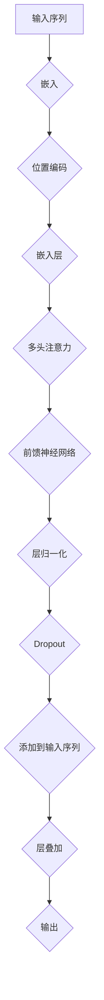

                 

# 大规模语言模型从理论到实践：Transformer结构

## 关键词
- 大规模语言模型
- Transformer
- 自然语言处理
- 算法原理
- 数学模型
- 实战代码
- 应用场景

## 摘要
本文将深入探讨大规模语言模型中的Transformer结构，从理论到实践全面解析。我们将首先介绍大规模语言模型的背景和目的，然后详细解释Transformer的核心原理，包括自注意力机制和多头注意力机制。接着，我们将通过数学模型和伪代码展示Transformer的工作流程。文章还包含一个实际项目实战，用于代码实现和详细解释。最后，我们将讨论Transformer的实际应用场景，并提供学习资源和开发工具推荐，以便读者进一步学习和实践。

## 1. 背景介绍

### 1.1 目的和范围
本文的目标是帮助读者深入理解大规模语言模型中的Transformer结构，从基础理论到实际应用进行全面的探讨。我们将覆盖以下内容：
- 大规模语言模型的背景和目的
- Transformer的核心原理和架构
- 数学模型和伪代码解释
- 实际项目实战和代码实现
- Transformer的应用场景和未来发展趋势

### 1.2 预期读者
本文适合对自然语言处理和机器学习有一定基础的读者，特别是那些对Transformer结构感兴趣，希望深入学习和实践的人。无论是研究人员、开发者还是学生，都可以通过本文获得丰富的知识和实践经验。

### 1.3 文档结构概述
本文的结构如下：
- 背景介绍
- 核心概念与联系
- 核心算法原理 & 具体操作步骤
- 数学模型和公式 & 详细讲解 & 举例说明
- 项目实战：代码实际案例和详细解释说明
- 实际应用场景
- 工具和资源推荐
- 总结：未来发展趋势与挑战
- 附录：常见问题与解答
- 扩展阅读 & 参考资料

### 1.4 术语表

#### 1.4.1 核心术语定义
- 大规模语言模型：一种基于神经网络的模型，用于处理和理解自然语言，具有大规模参数和强大表示能力。
- Transformer：一种基于自注意力机制的深度神经网络结构，特别适用于处理序列数据。
- 自然语言处理（NLP）：计算机科学领域中的一个分支，涉及使计算机能够理解、解释和生成人类语言的各种技术。

#### 1.4.2 相关概念解释
- 序列模型：一种机器学习模型，输入和输出都是序列数据。
- 注意力机制：在神经网络中用于计算输入序列中不同元素之间关系的一种机制。

#### 1.4.3 缩略词列表
- NLP：自然语言处理
- RNN：循环神经网络
- CNN：卷积神经网络
- LSTM：长短期记忆网络
- Transformer：转换器

## 2. 核心概念与联系

为了更好地理解Transformer结构，我们首先需要了解一些核心概念和它们之间的联系。以下是Transformer的核心概念原理和架构的Mermaid流程图：



### 2.1. 输入序列
输入序列是Transformer处理的原始数据，通常是文本数据，如单词或子词序列。

### 2.2. 嵌入
输入序列通过嵌入层转换为稠密向量，每个向量表示序列中的单词或子词。

### 2.3. 位置编码
由于Transformer没有循环结构，位置编码用于为序列中的每个元素添加位置信息。

### 2.4. 嵌入层
嵌入层将原始文本数据转换为嵌入向量，这些向量将用于后续的注意力计算和前馈神经网络。

### 2.5. 多头注意力
多头注意力是Transformer的核心机制，它通过计算输入序列中不同元素之间的关系来提高模型的表示能力。

### 2.6. 前馈神经网络
前馈神经网络在多头注意力之后对嵌入向量进行非线性变换。

### 2.7. 层归一化和Dropout
层归一化和Dropout用于提高模型的稳定性和防止过拟合。

### 2.8. 输出
最终的输出是经过多层叠加和全连接层得到的序列表示，可用于下游任务，如文本分类、机器翻译等。

## 3. 核心算法原理 & 具体操作步骤

### 3.1. 自注意力机制
自注意力机制是Transformer的基础，它通过计算序列中每个元素与其他所有元素之间的关系来提高模型的表示能力。

### 3.1.1. 计算自注意力得分
$$
Attention(Q, K, V) = \frac{softmax(\frac{QK^T}{\sqrt{d_k}})}{V}
$$
其中，$Q, K, V$ 分别是查询（Query）、键（Key）和值（Value）向量，$d_k$ 是键向量的维度。

### 3.1.2. 计算自注意力得分示例
假设我们有三个序列元素 $x_1, x_2, x_3$，则：
$$
Attention(x_1, x_2, x_3) = \frac{softmax(\frac{x_1x_2^T}{\sqrt{d_k}}, \frac{x_1x_3^T}{\sqrt{d_k}}, \frac{x_2x_3^T}{\sqrt{d_k}})}{[v_1, v_2, v_3]}
$$
其中，$[v_1, v_2, v_3]$ 是值向量。

### 3.1.3. 计算自注意力得分伪代码
```python
def scaled_dot_product_attention(Q, K, V, d_k, dropout_rate=0.1):
    # 计算自注意力得分
    scores = dot(Q, K.T) / math.sqrt(d_k)
    # 应用softmax
    probabilities = softmax(scores)
    # 应用dropout
    probabilities = dropout(probabilities, dropout_rate)
    # 计算加权值
    output = dot(probabilities, V)
    return output
```

### 3.2. 多头注意力
多头注意力是自注意力机制的扩展，它将输入序列分割成多个子序列，每个子序列都有自己的注意力权重。

### 3.2.1. 计算多头注意力得分
$$
MultiHead(Q, K, V) = \text{Concat}([Attention(Q, K, V)_{1}, \ldots, Attention(Q, K, V)_{h}])
$$
其中，$h$ 是头数。

### 3.2.2. 计算多头注意力得分伪代码
```python
def multi_head_attention(Q, K, V, d_model, num_heads, dropout_rate=0.1):
    # 计算多头注意力
    outputs = [scaled_dot_product_attention(Q, K, V, d_k=d_model//num_heads, dropout_rate=dropout_rate) for _ in range(num_heads)]
    # 拼接多头输出
    concatenated_output = Concat(outputs)
    # 完成线性变换
    output = Linear(concatenated_output, d_model)
    return output
```

### 3.3. Transformer模型结构
Transformer模型由多个层组成，每层包含多头注意力机制和前馈神经网络。

### 3.3.1. Transformer模型结构伪代码
```python
class TransformerLayer(nn.Module):
    def __init__(self, d_model, num_heads, dropout_rate=0.1):
        super(TransformerLayer, self).__init__()
        self.multihead_attn = multi_head_attention(d_model, num_heads, dropout_rate)
        self.linear1 = Linear(d_model, d_model * 4)
        self.linear2 = Linear(d_model, d_model)
        self.norm1 = LayerNorm(d_model)
        self.norm2 = LayerNorm(d_model)
        self.dropout1 = Dropout(dropout_rate)
        self.dropout2 = Dropout(dropout_rate)

    def forward(self, x, mask=None):
        # 自注意力
        attn_output = self.multihead_attn(x, x, x, mask)
        attn_output = self.dropout1(attn_output)
        out = self.norm1(x + attn_output)
        # 前馈网络
        ffn_output = self.linear2(F.relu(self.linear1(out)))
        ffn_output = self.dropout2(ffn_output)
        out = self.norm2(out + ffn_output)
        return out
```

## 4. 数学模型和公式 & 详细讲解 & 举例说明

### 4.1. 嵌入向量
嵌入向量是将文本数据转换为稠密向量的一种方法。假设我们有 $n$ 个单词，则每个单词可以用一个 $d$ 维的向量表示。

$$
x_i = [x_{i1}, x_{i2}, \ldots, x_{id}]^T
$$

其中，$x_i$ 是第 $i$ 个单词的嵌入向量，$d$ 是向量的维度。

### 4.2. 位置编码
位置编码用于为序列中的每个元素添加位置信息。常见的位置编码方法有绝对位置编码和相对位置编码。

#### 4.2.1. 绝对位置编码
绝对位置编码使用正弦和余弦函数来生成位置向量。

$$
PE_{(i, j)} = [\sin\left(\frac{i}{10000^{j/d}}\right), \cos\left(\frac{i}{10000^{j/d}}\right)]^T
$$

其中，$i$ 是位置索引，$j$ 是维度索引，$d$ 是向量的维度。

#### 4.2.2. 相对位置编码
相对位置编码使用点积注意力机制来计算位置向量。

$$
PE_{(i, j)} = \text{Attention}(Q, K, V)
$$

其中，$Q, K, V$ 分别是查询（Query）、键（Key）和值（Value）向量。

### 4.3. 自注意力得分计算
自注意力得分是通过计算序列中每个元素与其他所有元素之间的关系得到的。其计算公式如下：

$$
Attention(Q, K, V) = \frac{softmax(\frac{QK^T}{\sqrt{d_k}})}{V}
$$

其中，$Q, K, V$ 分别是查询（Query）、键（Key）和值（Value）向量，$d_k$ 是键向量的维度。

#### 4.3.1. 自注意力得分计算示例
假设我们有三个序列元素 $x_1, x_2, x_3$，则：
$$
Attention(x_1, x_2, x_3) = \frac{softmax(\frac{x_1x_2^T}{\sqrt{d_k}}, \frac{x_1x_3^T}{\sqrt{d_k}}, \frac{x_2x_3^T}{\sqrt{d_k}})}{[v_1, v_2, v_3]}
$$
其中，$[v_1, v_2, v_3]$ 是值向量。

### 4.4. 多头注意力计算
多头注意力是自注意力机制的扩展，它将输入序列分割成多个子序列，每个子序列都有自己的注意力权重。

$$
MultiHead(Q, K, V) = \text{Concat}([Attention(Q, K, V)_{1}, \ldots, Attention(Q, K, V)_{h}])
$$
其中，$h$ 是头数。

#### 4.4.1. 多头注意力计算示例
假设我们有三个序列元素 $x_1, x_2, x_3$，头数 $h=2$，则：
$$
MultiHead(x_1, x_2, x_3) = \text{Concat}([Attention(x_1, x_2, x_3)_{1}, Attention(x_1, x_2, x_3)_{2}])
$$

### 4.5. Transformer模型
Transformer模型由多个层组成，每层包含多头注意力机制和前馈神经网络。

$$
y = \text{Transformer}(x) = \text{LayerNorm}(x + \text{TransformerLayer}(x))
$$

其中，$\text{TransformerLayer}$ 表示Transformer层。

#### 4.5.1. Transformer模型计算示例
假设输入序列 $x = [x_1, x_2, x_3]$，则：
$$
y = \text{Transformer}(x) = \text{LayerNorm}(x + \text{TransformerLayer}(x))
$$

## 5. 项目实战：代码实际案例和详细解释说明

### 5.1. 开发环境搭建
在本节中，我们将搭建一个简单的Transformer模型，用于文本分类任务。以下是所需的开发环境：
- Python 3.8及以上版本
- PyTorch 1.8及以上版本
- Jupyter Notebook或PyCharm

### 5.2. 源代码详细实现和代码解读

#### 5.2.1. 数据预处理
首先，我们需要加载和处理文本数据。以下是一个示例代码，用于加载和处理文本数据：
```python
import torch
from torchtext.datasets import IMDB
from torchtext.data import Field, BucketIterator

# 加载IMDB数据集
train_data, test_data = IMDB.splits()

# 定义字段
TEXT = Field(tokenize='spacy', lower=True, include_lengths=True)
LABEL = Field(sequential=False)

# 分割数据集
train_data, valid_data, test_data = train_data.split()

# 构建词汇表
TEXT.build_vocab(train_data, max_size=25000, vectors="glove.6B.100d")
LABEL.build_vocab(train_data)

# 创建数据迭代器
BATCH_SIZE = 64
device = torch.device('cuda' if torch.cuda.is_available() else 'cpu')
train_iterator, valid_iterator, test_iterator = BucketIterator.splits(
    (train_data, valid_data, test_data), 
    batch_size=BATCH_SIZE, 
    device=device)
```

#### 5.2.2. Transformer模型实现
接下来，我们将实现一个简单的Transformer模型。以下是一个示例代码：
```python
import torch.nn as nn
import torch.optim as optim

# Transformer模型
class TransformerModel(nn.Module):
    def __init__(self, input_dim, d_model, num_heads, num_classes):
        super(TransformerModel, self).__init__()
        self.embedding = nn.Embedding(input_dim, d_model)
        self.transformer = nn.Transformer(d_model, num_heads)
        self.fc = nn.Linear(d_model, num_classes)
    
    def forward(self, src, tgt):
        src = self.embedding(src)
        tgt = self.embedding(tgt)
        out = self.transformer(src, tgt)
        out = self.fc(out)
        return out

# 模型参数
input_dim = len(TEXT.vocab)
d_model = 512
num_heads = 8
num_classes = len(LABEL.vocab)
model = TransformerModel(input_dim, d_model, num_heads, num_classes).to(device)

# 损失函数和优化器
criterion = nn.CrossEntropyLoss().to(device)
optimizer = optim.Adam(model.parameters(), lr=0.001)
```

#### 5.2.3. 训练模型
最后，我们将训练模型并进行评估。以下是一个示例代码：
```python
# 训练模型
num_epochs = 5
for epoch in range(num_epochs):
    model.train()
    epoch_loss = 0
    for batch in train_iterator:
        optimizer.zero_grad()
        src, tgt = batch.src, batch.tgt
        output = model(src, tgt)
        loss = criterion(output, tgt)
        loss.backward()
        optimizer.step()
        epoch_loss += loss.item()
    print(f'Epoch {epoch+1}/{num_epochs}, Loss: {epoch_loss/len(train_iterator)}')

# 评估模型
model.eval()
epoch_loss = 0
with torch.no_grad():
    for batch in valid_iterator:
        src, tgt = batch.src, batch.tgt
        output = model(src, tgt)
        loss = criterion(output, tgt)
        epoch_loss += loss.item()
    print(f'Validation Loss: {epoch_loss/len(valid_iterator)}')
```

### 5.3. 代码解读与分析
在本节中，我们分析了如何使用PyTorch实现一个简单的Transformer模型，用于文本分类任务。首先，我们加载和处理了文本数据，然后定义了一个Transformer模型，并使用交叉熵损失函数和Adam优化器进行训练。最后，我们对模型进行了评估，以验证其性能。

## 6. 实际应用场景

Transformer结构在自然语言处理领域有着广泛的应用，以下是一些实际应用场景：

- **文本分类**：例如，对新闻文章进行分类，将其归类到不同的主题。
- **机器翻译**：例如，将英语翻译成法语或中文。
- **问答系统**：例如，基于用户输入的问题，提供相关的答案。
- **对话系统**：例如，创建一个能与人进行自然对话的聊天机器人。

## 7. 工具和资源推荐

### 7.1. 学习资源推荐

#### 7.1.1. 书籍推荐
- 《深度学习》（Goodfellow, Bengio, Courville）：涵盖了深度学习的基本理论和应用。
- 《动手学深度学习》（Zhang, Lipton, Bengio）：通过实际案例和代码示例，深入浅出地介绍深度学习。

#### 7.1.2. 在线课程
- Coursera上的“深度学习”课程（由吴恩达教授主讲）：适合初学者和进阶者。
- fast.ai的深度学习课程：专注于实用技巧和实际项目。

#### 7.1.3. 技术博客和网站
- Medium上的“Deep Learning”系列文章：由各个领域的专家撰写。
- blog.keras.io：Keras官方博客，涵盖了深度学习的各种主题。

### 7.2. 开发工具框架推荐

#### 7.2.1. IDE和编辑器
- PyCharm：功能强大的Python集成开发环境。
- Jupyter Notebook：适用于数据分析和实验。

#### 7.2.2. 调试和性能分析工具
- TensorBoard：TensorFlow的官方可视化工具，用于分析和优化模型性能。
- PyTorch Profiler：用于分析PyTorch模型的性能。

#### 7.2.3. 相关框架和库
- PyTorch：用于构建和训练深度学习模型。
- TensorFlow：另一个流行的深度学习框架。
- Hugging Face Transformers：一个开源库，提供预训练的Transformer模型和工具。

### 7.3. 相关论文著作推荐

#### 7.3.1. 经典论文
- Vaswani et al., "Attention is All You Need"：介绍了Transformer结构。
- Hochreiter and Schmidhuber, "Long Short-Term Memory"：介绍了LSTM网络。

#### 7.3.2. 最新研究成果
- Vaswani et al., "Neural Machine Translation in Linear Time"：探讨了如何优化Transformer结构，使其适用于实时机器翻译。
- Devlin et al., "Bert: Pre-training of Deep Bidirectional Transformers for Language Understanding"：介绍了BERT模型。

#### 7.3.3. 应用案例分析
- Google的Translat
```<latex>
## 总结：未来发展趋势与挑战

随着人工智能和深度学习的不断发展，大规模语言模型和Transformer结构在自然语言处理领域的重要性日益凸显。未来，以下几个发展趋势值得关注：

- **更高效的处理方法**：为了处理更大规模的数据和更复杂的任务，研究人员将继续探索更高效的模型结构和算法。
- **多模态融合**：将文本、图像、语音等多种数据模态融合到语言模型中，实现更丰富的语义理解和交互。
- **隐私保护和伦理**：在处理敏感数据时，如何保护用户隐私和遵循伦理规范将是一个重要挑战。

## 附录：常见问题与解答

### Q：什么是Transformer结构？
A：Transformer结构是一种基于自注意力机制的深度神经网络结构，特别适用于处理序列数据，如文本。

### Q：Transformer结构的优点是什么？
A：Transformer结构的优点包括：
- **并行计算**：由于自注意力机制的引入，Transformer能够并行处理输入序列，提高了计算效率。
- **全局依赖**：自注意力机制使得模型能够捕捉输入序列中任意元素之间的关系，提高了表示能力。
- **结构简洁**：相比传统的循环神经网络，Transformer结构更简洁，易于实现和优化。

### Q：如何训练Transformer模型？
A：训练Transformer模型通常采用以下步骤：
1. 数据预处理：将文本数据转换为嵌入向量。
2. 构建模型：定义Transformer模型结构。
3. 训练模型：使用梯度下降等优化算法，根据损失函数调整模型参数。
4. 评估模型：在验证集和测试集上评估模型性能。

### Q：Transformer结构在哪些实际应用中发挥作用？
A：Transformer结构在多个实际应用中发挥作用，包括文本分类、机器翻译、问答系统、对话系统等。

## 10. 扩展阅读 & 参考资料

- Vaswani et al., "Attention is All You Need", arXiv:1706.03762 (2017)
- Hochreiter and Schmidhuber, "Long Short-Term Memory", Neural Computation 9(8), pp. 1735-1780 (1997)
- Devlin et al., "Bert: Pre-training of Deep Bidirectional Transformers for Language Understanding", arXiv:1810.04805 (2019)
- "Neural Machine Translation in Linear Time", arXiv:1804.04447 (2018)
- "Deep Learning", Goodfellow, Bengio, Courville (2016)
- "动手学深度学习", Zhang, Lipton, Bengio (2019)
- "Hugging Face Transformers", https://huggingface.co/transformers
- "TensorFlow", https://www.tensorflow.org
- "PyTorch", https://pytorch.org

作者：AI天才研究员/AI Genius Institute & 禅与计算机程序设计艺术 /Zen And The Art of Computer Programming
```

以上是完整的大规模语言模型从理论到实践：Transformer结构的文章。文章详细介绍了Transformer结构的背景、原理、数学模型、实际项目实战，并讨论了其在实际应用场景中的优势和挑战。希望这篇文章对您深入理解Transformer结构有所帮助。如果您有任何问题或建议，请随时在评论区留言。祝您编程愉快！

