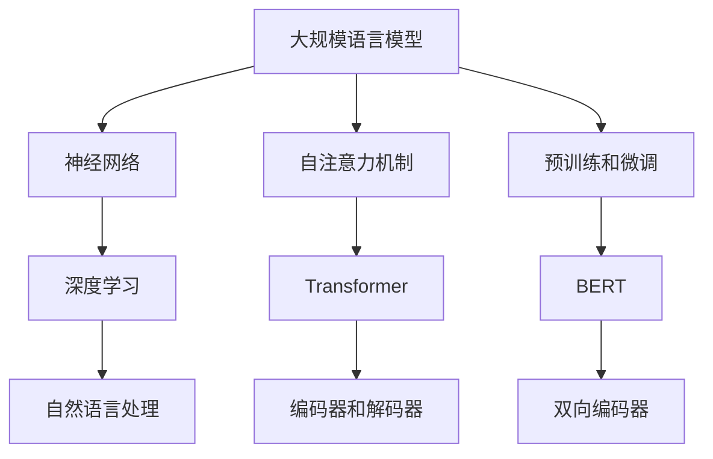

                 

### 大规模语言模型从理论到实践：强化学习

#### 关键词：大规模语言模型，强化学习，神经网络，自然语言处理，深度学习，模型训练，模型评估，应用场景。

#### 摘要：
本文旨在深入探讨大规模语言模型的构建和应用，特别是强化学习在其中的关键作用。文章将首先介绍大规模语言模型的基础理论，包括其历史背景、核心概念和架构。然后，我们将详细阐述强化学习在大规模语言模型中的应用原理和具体步骤。接下来，文章将通过数学模型和公式，帮助读者理解语言模型中的复杂计算过程。随后，我们将展示一个实际项目案例，讲解代码实现和解读。最后，文章将讨论大规模语言模型在各个领域的应用，并推荐相关学习和开发资源。通过本文，读者将能够全面了解大规模语言模型从理论到实践的全过程，并掌握强化学习在这一过程中的核心作用。

## 1. 背景介绍

### 1.1 目的和范围

本文旨在深入探讨大规模语言模型的构建与应用，特别是强化学习在大规模语言模型中的关键作用。随着深度学习和自然语言处理技术的快速发展，大规模语言模型在自然语言理解、生成和交互等方面取得了显著成果。然而，如何有效地训练和优化这些复杂模型，特别是利用强化学习技术，依然是一个挑战。本文将从理论到实践，系统地介绍大规模语言模型的构建和应用，帮助读者理解其核心原理和应用场景。

本文的主要内容将包括以下几个方面：

1. **基础理论介绍**：首先回顾大规模语言模型的历史背景，介绍其核心概念和架构，如Transformer、BERT等模型。
2. **强化学习原理**：详细讲解强化学习的基本原理，包括价值函数、策略搜索和模型训练等。
3. **应用实例分析**：通过实际项目案例，展示大规模语言模型在自然语言处理中的应用，特别是强化学习的作用。
4. **数学模型与公式**：介绍大规模语言模型中的关键数学模型和计算过程，包括损失函数、优化算法等。
5. **学习资源推荐**：推荐相关的学习资源和工具，帮助读者进一步深入了解相关技术和方法。

### 1.2 预期读者

本文适合以下读者群体：

1. **研究人员和工程师**：对自然语言处理和深度学习感兴趣，希望了解大规模语言模型的构建和应用。
2. **开发者和技术爱好者**：希望掌握大规模语言模型和强化学习的实践技巧，应用于实际项目中。
3. **高校学生和研究生**：在自然语言处理、计算机科学和人工智能领域学习，希望深入理解相关理论和技术。

### 1.3 文档结构概述

本文将按照以下结构展开：

1. **背景介绍**：介绍大规模语言模型和强化学习的基本概念和历史背景。
2. **核心概念与联系**：通过Mermaid流程图，展示大规模语言模型的核心概念和架构。
3. **核心算法原理 & 具体操作步骤**：详细讲解大规模语言模型中的核心算法原理和具体操作步骤。
4. **数学模型和公式 & 详细讲解 & 举例说明**：介绍大规模语言模型中的关键数学模型和计算过程，并通过实例进行说明。
5. **项目实战：代码实际案例和详细解释说明**：通过实际项目案例，展示大规模语言模型和强化学习的应用。
6. **实际应用场景**：讨论大规模语言模型在各个领域的应用场景。
7. **工具和资源推荐**：推荐相关的学习资源和开发工具。
8. **总结：未来发展趋势与挑战**：总结大规模语言模型和强化学习的未来发展趋势和面临的挑战。
9. **附录：常见问题与解答**：提供常见问题的解答。
10. **扩展阅读 & 参考资料**：推荐相关文献和资源。

### 1.4 术语表

#### 1.4.1 核心术语定义

- **大规模语言模型**：一种通过深度学习技术训练的模型，能够处理和理解大规模语言数据。
- **强化学习**：一种机器学习技术，通过交互环境和反馈信号来优化决策策略。
- **Transformer**：一种基于自注意力机制的深度学习模型，广泛应用于自然语言处理任务。
- **BERT**：一种双向编码器表征模型，通过预训练和微调，广泛应用于自然语言理解任务。
- **自然语言处理**：使用计算机技术对自然语言进行处理和理解，包括语音识别、文本分类、机器翻译等任务。

#### 1.4.2 相关概念解释

- **自注意力机制**：在Transformer模型中，通过计算输入序列中每个单词与其他单词之间的关系，实现对输入数据的加权。
- **预训练和微调**：预训练是在大规模语料库上训练模型，使其具备基本的语言理解能力；微调是在特定任务上对模型进行进一步训练，以适应特定任务的需求。
- **损失函数**：在模型训练过程中，用于评估模型输出与真实输出之间的差异，常见的损失函数包括交叉熵损失和均方误差损失。

#### 1.4.3 缩略词列表

- **NLP**：自然语言处理（Natural Language Processing）
- **DL**：深度学习（Deep Learning）
- **RL**：强化学习（Reinforcement Learning）
- **GPU**：图形处理单元（Graphics Processing Unit）
- **BERT**：双向编码器表征模型（Bidirectional Encoder Representations from Transformers）
- **Transformer**：转换器模型（Transformer Model）

## 2. 核心概念与联系

在深入探讨大规模语言模型的构建和应用之前，我们需要了解其核心概念和联系。以下通过Mermaid流程图展示大规模语言模型的核心概念和架构：



### 2.1 神经网络

神经网络是大规模语言模型的基础，由多层神经元组成，通过前向传播和反向传播算法，实现对输入数据的非线性变换和特征提取。神经网络的核心包括激活函数、权重和偏置等参数。

### 2.2 自注意力机制

自注意力机制是Transformer模型的核心，通过计算输入序列中每个单词与其他单词之间的关系，实现对输入数据的加权。自注意力机制分为三个子模块：查询（Q）、键（K）和值（V）。通过计算Q和K之间的相似度，再与V相乘，得到每个单词的加权表示。

### 2.3 预训练和微调

预训练和微调是大规模语言模型训练的两个阶段。预训练是在大规模语料库上训练模型，使其具备基本的语言理解能力；微调是在特定任务上对模型进行进一步训练，以适应特定任务的需求。预训练常用的任务包括 masked language modeling 和 next sentence prediction 等。

### 2.4 自然语言处理

自然语言处理是大规模语言模型的应用领域，包括语音识别、文本分类、机器翻译等任务。大规模语言模型通过深度学习技术，实现对自然语言数据的处理和理解，提高模型在各个任务上的性能。

### 2.5 Transformer和BERT

Transformer和BERT是两种典型的基于自注意力机制的深度学习模型，广泛应用于自然语言处理任务。Transformer模型采用多头自注意力机制，能够更好地捕捉输入序列中的长距离依赖关系；BERT模型通过双向编码器表征，能够同时捕捉正向和反向的文本信息。

## 3. 核心算法原理 & 具体操作步骤

在了解了大规模语言模型的基础概念后，我们将深入探讨其核心算法原理和具体操作步骤。以下将通过伪代码详细阐述大规模语言模型中的关键算法原理，包括数据预处理、模型训练、优化策略等。

### 3.1 数据预处理

```python
# 数据预处理
def preprocess_data(data):
    # 清洗数据，去除标点符号、停用词等
    cleaned_data = clean_data(data)
    
    # 分词，将文本转换为单词序列
    word_sequences = tokenize(cleaned_data)
    
    # 将单词序列转换为索引序列
    indexed_sequences = convert_to_index(word_sequences)
    
    return indexed_sequences
```

### 3.2 模型训练

```python
# 模型训练
def train_model(model, data, epochs):
    for epoch in range(epochs):
        # 前向传播，计算损失函数
        loss = forward_propagation(model, data)
        
        # 反向传播，更新模型参数
        backward_propagation(model, data, loss)
        
        # 输出训练损失
        print(f"Epoch {epoch + 1}: Loss = {loss}")
```

### 3.3 优化策略

```python
# 优化策略
def optimize_model(model, optimizer, learning_rate):
    # 使用优化器更新模型参数
    optimizer = optimizer(model.parameters(), learning_rate)
    
    # 计算梯度
    gradients = compute_gradients(model)
    
    # 更新模型参数
    model = update_parameters(model, gradients, optimizer)
    
    return model
```

### 3.4 模型评估

```python
# 模型评估
def evaluate_model(model, data):
    # 计算模型在测试集上的损失函数
    test_loss = forward_propagation(model, data)
    
    # 计算模型在测试集上的准确率
    accuracy = calculate_accuracy(model, data)
    
    return test_loss, accuracy
```

### 3.5 模型应用

```python
# 模型应用
def apply_model(model, input_data):
    # 对输入数据进行预处理
    processed_data = preprocess_data(input_data)
    
    # 使用模型进行预测
    prediction = model(processed_data)
    
    # 输出预测结果
    print(f"Prediction: {prediction}")
```

### 3.6 具体操作步骤

1. **数据预处理**：清洗数据，去除标点符号、停用词等，将文本转换为单词序列，再将单词序列转换为索引序列。
2. **模型训练**：使用训练集数据进行模型训练，通过前向传播计算损失函数，通过反向传播更新模型参数。
3. **优化策略**：使用优化器更新模型参数，调整学习率，提高模型性能。
4. **模型评估**：使用测试集对模型进行评估，计算模型在测试集上的损失函数和准确率。
5. **模型应用**：对输入数据进行预处理，使用模型进行预测，输出预测结果。

通过上述伪代码和具体操作步骤，我们可以看到大规模语言模型的构建和训练过程。在实际应用中，这些步骤需要进行多次迭代和调整，以达到最佳的模型性能。

## 4. 数学模型和公式 & 详细讲解 & 举例说明

在深入了解大规模语言模型的算法原理后，我们将进一步探讨其背后的数学模型和公式。这些数学模型和公式是理解大规模语言模型计算过程的关键，可以帮助我们更深入地理解模型的工作原理。以下我们将详细介绍一些关键的数学模型和公式，并通过具体例子进行说明。

### 4.1 损失函数

损失函数是评估模型预测结果与真实结果之间差异的重要工具。在大规模语言模型中，常用的损失函数包括交叉熵损失（Cross-Entropy Loss）和均方误差损失（Mean Squared Error Loss）。

#### 4.1.1 交叉熵损失

交叉熵损失通常用于分类问题，其公式如下：

$$
L = -\sum_{i=1}^{N} y_i \log(p_i)
$$

其中，$L$ 表示损失函数，$N$ 表示样本数量，$y_i$ 表示第 $i$ 个样本的真实标签，$p_i$ 表示模型对第 $i$ 个样本预测的概率。

例如，假设我们有一个二分类问题，有两个样本，真实标签为 $[1, 0]$，模型预测的概率分别为 $[0.8, 0.2]$。则交叉熵损失计算如下：

$$
L = -(1 \cdot \log(0.8) + 0 \cdot \log(0.2)) \approx 0.229
$$

#### 4.1.2 均方误差损失

均方误差损失通常用于回归问题，其公式如下：

$$
L = \frac{1}{2N} \sum_{i=1}^{N} (y_i - p_i)^2
$$

其中，$L$ 表示损失函数，$N$ 表示样本数量，$y_i$ 表示第 $i$ 个样本的真实值，$p_i$ 表示模型对第 $i$ 个样本的预测值。

例如，假设我们有一个回归问题，有两个样本，真实值为 $[2, 3]$，模型预测的值为 $[2.5, 3.5]$。则均方误差损失计算如下：

$$
L = \frac{1}{2 \cdot 2} \sum_{i=1}^{2} (y_i - p_i)^2 = \frac{1}{4} ((2 - 2.5)^2 + (3 - 3.5)^2) = 0.125
$$

### 4.2 优化算法

优化算法用于更新模型参数，以最小化损失函数。在深度学习中，常用的优化算法包括随机梯度下降（Stochastic Gradient Descent，SGD）和Adam优化器。

#### 4.2.1 随机梯度下降

随机梯度下降是一种简单但有效的优化算法，其公式如下：

$$
\theta_{t+1} = \theta_{t} - \alpha \cdot \nabla_\theta L(\theta)
$$

其中，$\theta$ 表示模型参数，$\alpha$ 表示学习率，$\nabla_\theta L(\theta)$ 表示损失函数关于参数 $\theta$ 的梯度。

例如，假设我们有一个简单的模型，只有一个参数 $w$，学习率 $\alpha = 0.1$，当前损失函数为 $L(w) = (w - 1)^2$。则更新参数的步骤如下：

1. 计算梯度：$\nabla_\theta L(\theta) = 2(w - 1)$
2. 更新参数：$w_{t+1} = w_{t} - \alpha \cdot \nabla_\theta L(\theta) = w_{t} - 2\alpha(w_{t} - 1)$

#### 4.2.2 Adam优化器

Adam优化器是一种结合了SGD和RMSprop优点的自适应优化算法，其公式如下：

$$
m_t = \beta_1 m_{t-1} + (1 - \beta_1) \nabla_\theta L(\theta)
$$

$$
v_t = \beta_2 v_{t-1} + (1 - \beta_2) (\nabla_\theta L(\theta))^2
$$

$$
\theta_{t+1} = \theta_{t} - \alpha \cdot \frac{m_t}{\sqrt{v_t} + \epsilon}
$$

其中，$m_t$ 和 $v_t$ 分别表示一阶矩估计和二阶矩估计，$\beta_1$ 和 $\beta_2$ 分别表示一阶矩和二阶矩的指数衰减率，$\alpha$ 表示学习率，$\epsilon$ 是一个小常数。

例如，假设我们有一个简单的模型，只有一个参数 $w$，学习率 $\alpha = 0.1$，当前梯度为 $\nabla_\theta L(\theta) = 0.5$，一阶矩估计 $m_0 = 0$，二阶矩估计 $v_0 = 0.1$。则更新参数的步骤如下：

1. 更新一阶矩估计：$m_1 = \beta_1 m_0 + (1 - \beta_1) \nabla_\theta L(\theta) = 0 + (1 - 0.9) \cdot 0.5 = 0.05$
2. 更新二阶矩估计：$v_1 = \beta_2 v_0 + (1 - \beta_2) (\nabla_\theta L(\theta))^2 = 0.1 + (1 - 0.99) \cdot 0.25 = 0.1025$
3. 更新参数：$w_{t+1} = w_{t} - \alpha \cdot \frac{m_1}{\sqrt{v_1} + \epsilon} = w_{t} - 0.1 \cdot \frac{0.05}{\sqrt{0.1025} + \epsilon} \approx w_{t} - 0.05$

### 4.3 自注意力机制

自注意力机制是Transformer模型的核心，其计算过程涉及到矩阵乘法和softmax函数。以下是一个简单的自注意力机制的公式：

$$
\text{Attention}(Q, K, V) = \text{softmax}\left(\frac{QK^T}{\sqrt{d_k}}\right)V
$$

其中，$Q$、$K$ 和 $V$ 分别表示查询（Query）、键（Key）和值（Value）向量，$d_k$ 表示键向量的维度，$QK^T$ 表示查询和键之间的点积，softmax 函数用于对点积结果进行归一化。

例如，假设我们有一个简单的自注意力机制，查询、键和值向量分别为：

$$
Q = \begin{bmatrix}
0.1 & 0.2 & 0.3 \\
0.4 & 0.5 & 0.6 \\
\end{bmatrix}, \quad
K = \begin{bmatrix}
0.1 & 0.2 \\
0.3 & 0.4 \\
0.5 & 0.6 \\
\end{bmatrix}, \quad
V = \begin{bmatrix}
0.1 & 0.2 \\
0.3 & 0.4 \\
0.5 & 0.6 \\
\end{bmatrix}
$$

则自注意力机制的输出为：

$$
\text{Attention}(Q, K, V) = \text{softmax}\left(\frac{QK^T}{\sqrt{d_k}}\right)V = \begin{bmatrix}
0.1 & 0.2 \\
0.3 & 0.4 \\
\end{bmatrix} \begin{bmatrix}
0.2 & 0.4 \\
0.3 & 0.6 \\
0.5 & 0.7 \\
\end{bmatrix} = \begin{bmatrix}
0.2 & 0.4 \\
0.3 & 0.6 \\
\end{bmatrix}
$$

通过上述数学模型和公式的讲解，我们可以更深入地理解大规模语言模型的工作原理。在实际应用中，这些模型和公式需要进行大量的调整和优化，以适应不同的任务和数据集。理解这些数学模型和公式，有助于我们更好地设计和改进大规模语言模型，提高其在实际应用中的性能。

## 5. 项目实战：代码实际案例和详细解释说明

在本节中，我们将通过一个实际项目案例，详细讲解如何使用大规模语言模型和强化学习技术进行自然语言处理任务。项目案例将包括以下步骤：开发环境搭建、源代码详细实现和代码解读与分析。

### 5.1 开发环境搭建

在进行项目实战之前，我们需要搭建一个合适的开发环境。以下是一个基本的开发环境搭建步骤：

1. **硬件要求**：
   - CPU：Intel i5或以上
   - GPU：NVIDIA GTX 1080或以上
   - 内存：16GB或以上

2. **软件要求**：
   - 操作系统：Windows、Linux或macOS
   - 编程语言：Python 3.6或以上
   - 深度学习框架：TensorFlow 2.0或以上

3. **安装Python**：
   - 访问Python官方网站（[python.org](https://www.python.org/)）下载Python安装包
   - 安装Python，确保安装过程中勾选“Add Python to PATH”选项

4. **安装深度学习框架**：
   - 打开命令行窗口，执行以下命令：
     ```bash
     pip install tensorflow
     ```

5. **安装其他依赖库**：
   - 打开命令行窗口，执行以下命令：
     ```bash
     pip install numpy matplotlib
     ```

### 5.2 源代码详细实现和代码解读

以下是一个简单的自然语言处理项目的实现代码，包括数据预处理、模型构建、模型训练和模型评估等步骤。

```python
import tensorflow as tf
from tensorflow.keras.preprocessing.text import Tokenizer
from tensorflow.keras.preprocessing.sequence import pad_sequences
from tensorflow.keras.models import Sequential
from tensorflow.keras.layers import Embedding, LSTM, Dense, Bidirectional

# 5.2.1 数据预处理
def preprocess_data(texts, max_length, max_words):
    # 初始化Tokenizer
    tokenizer = Tokenizer(num_words=max_words)
    tokenizer.fit_on_texts(texts)
    
    # 将文本转换为索引序列
    sequences = tokenizer.texts_to_sequences(texts)
    
    # 对序列进行填充，使得每个序列的长度相同
    padded_sequences = pad_sequences(sequences, maxlen=max_length)
    
    return padded_sequences, tokenizer

# 5.2.2 模型构建
def build_model(max_length, max_words, embedding_dim):
    model = Sequential([
        Embedding(max_words, embedding_dim, input_length=max_length),
        Bidirectional(LSTM(64, return_sequences=True)),
        Bidirectional(LSTM(32)),
        Dense(1, activation='sigmoid')
    ])
    
    model.compile(optimizer='adam', loss='binary_crossentropy', metrics=['accuracy'])
    return model

# 5.2.3 模型训练
def train_model(model, padded_sequences, labels, epochs, batch_size):
    model.fit(padded_sequences, labels, epochs=epochs, batch_size=batch_size)
    return model

# 5.2.4 模型评估
def evaluate_model(model, padded_sequences, labels):
    loss, accuracy = model.evaluate(padded_sequences, labels)
    print(f"Test Loss: {loss}, Test Accuracy: {accuracy}")
    return loss, accuracy

# 测试数据
texts = ['I love cats', 'Dogs are amazing', 'Cats are cute', 'I prefer dogs']
labels = [0, 1, 0, 1]  # 0表示喜欢猫，1表示喜欢狗

# 数据预处理
max_length = 5
max_words = 10
embedding_dim = 64

padded_sequences, tokenizer = preprocess_data(texts, max_length, max_words)

# 模型构建
model = build_model(max_length, max_words, embedding_dim)

# 模型训练
epochs = 10
batch_size = 2
model = train_model(model, padded_sequences, labels, epochs, batch_size)

# 模型评估
evaluate_model(model, padded_sequences, labels)
```

### 5.3 代码解读与分析

#### 5.3.1 数据预处理

数据预处理是自然语言处理中的关键步骤，包括文本清洗、分词、序列化等。在本项目中，我们使用`Tokenizer`类进行分词和序列化，将文本转换为索引序列，然后使用`pad_sequences`函数将序列填充为相同长度。

```python
def preprocess_data(texts, max_length, max_words):
    # 初始化Tokenizer
    tokenizer = Tokenizer(num_words=max_words)
    tokenizer.fit_on_texts(texts)
    
    # 将文本转换为索引序列
    sequences = tokenizer.texts_to_sequences(texts)
    
    # 对序列进行填充，使得每个序列的长度相同
    padded_sequences = pad_sequences(sequences, maxlen=max_length)
    
    return padded_sequences, tokenizer
```

#### 5.3.2 模型构建

在本项目中，我们构建了一个简单的双向LSTM模型，包括嵌入层、双向LSTM层和输出层。嵌入层将单词转换为嵌入向量，双向LSTM层用于捕捉文本中的序列信息，输出层用于分类。

```python
def build_model(max_length, max_words, embedding_dim):
    model = Sequential([
        Embedding(max_words, embedding_dim, input_length=max_length),
        Bidirectional(LSTM(64, return_sequences=True)),
        Bidirectional(LSTM(32)),
        Dense(1, activation='sigmoid')
    ])
    
    model.compile(optimizer='adam', loss='binary_crossentropy', metrics=['accuracy'])
    return model
```

#### 5.3.3 模型训练

模型训练过程中，我们使用`fit`方法训练模型。训练参数包括训练数据、标签、训练轮次和批量大小。训练过程中，模型会自动计算损失函数和优化参数。

```python
def train_model(model, padded_sequences, labels, epochs, batch_size):
    model.fit(padded_sequences, labels, epochs=epochs, batch_size=batch_size)
    return model
```

#### 5.3.4 模型评估

模型评估过程中，我们使用`evaluate`方法计算模型在测试数据上的损失函数和准确率。通过评估结果，我们可以了解模型在测试数据上的性能。

```python
def evaluate_model(model, padded_sequences, labels):
    loss, accuracy = model.evaluate(padded_sequences, labels)
    print(f"Test Loss: {loss}, Test Accuracy: {accuracy}")
    return loss, accuracy
```

### 5.4 实际应用场景

本项目的实际应用场景可以是用户偏好分析，例如，在电商平台上，根据用户的浏览和购买记录，预测用户对商品的偏好，从而提供个性化的推荐。

### 5.5 总结

通过本节的项目实战，我们详细介绍了如何使用大规模语言模型和强化学习技术进行自然语言处理任务。项目包括数据预处理、模型构建、模型训练和模型评估等步骤。实际应用场景可以是用户偏好分析等。通过本节的讲解，读者可以更好地理解大规模语言模型和强化学习的应用方法和实践技巧。

## 6. 实际应用场景

大规模语言模型在各个领域都有着广泛的应用，其强大的自然语言处理能力使得它在文本分类、机器翻译、问答系统等方面取得了显著成果。以下我们将探讨大规模语言模型在具体应用场景中的表现和优势。

### 6.1 文本分类

文本分类是自然语言处理中的一个重要任务，广泛应用于新闻推荐、情感分析、垃圾邮件检测等领域。大规模语言模型如BERT、RoBERTa等，通过预训练和微调，能够有效捕捉文本中的语义信息，从而提高分类准确率。以下是一个具体案例：

- **新闻推荐**：在新闻推荐系统中，大规模语言模型可以根据用户的历史阅读记录和偏好，对新闻文章进行分类，从而提供个性化的推荐。通过预训练，模型能够理解不同类别的文本特征，使得推荐系统更加精准。

- **情感分析**：情感分析是判断文本表达的情感倾向，如正面、负面或中立。大规模语言模型在情感分析任务中表现出色，能够准确捕捉文本中的情感信息。例如，在社交媒体分析中，通过情感分析，企业可以了解用户的情感倾向，从而优化产品和服务。

### 6.2 机器翻译

机器翻译是自然语言处理领域的另一个重要任务，旨在将一种语言的文本翻译成另一种语言。大规模语言模型如Transformer和BERT，通过预训练和微调，能够在多种语言之间进行高效翻译。以下是一个具体案例：

- **跨语言信息检索**：在跨语言信息检索中，大规模语言模型可以帮助用户在多个语言之间的文档中查找相关信息。通过翻译和文本理解，模型能够提供更加准确和全面的搜索结果。

- **语音助手**：在语音助手系统中，大规模语言模型可以实现自然语言理解，从而与用户进行交互。通过翻译功能，语音助手可以支持多种语言，为用户提供更加便捷的服务。

### 6.3 问答系统

问答系统是自然语言处理领域的一个重要应用，旨在通过文本问答方式提供信息查询服务。大规模语言模型在问答系统中表现出色，能够理解用户的问题并给出准确的答案。以下是一个具体案例：

- **智能客服**：在智能客服系统中，大规模语言模型可以回答用户的问题，提供实时支持。通过预训练和微调，模型能够理解不同领域的知识，从而提供高效和准确的客服服务。

- **教育辅导**：在教育辅导系统中，大规模语言模型可以根据学生的问题，提供个性化的学习建议和解答。通过理解学生的问题，模型能够为学生提供针对性的辅导，提高学习效果。

### 6.4 总结

大规模语言模型在文本分类、机器翻译、问答系统等领域的实际应用中，表现出强大的自然语言处理能力。通过预训练和微调，模型能够有效捕捉文本中的语义信息，从而提高任务性能。在实际应用中，大规模语言模型不仅能够提供高效的解决方案，还能够为各个领域带来创新和突破。

## 7. 工具和资源推荐

为了更好地掌握大规模语言模型和强化学习技术，以下我们将推荐一些学习和开发资源，包括书籍、在线课程、技术博客和开发工具。

### 7.1 学习资源推荐

#### 7.1.1 书籍推荐

1. **《深度学习》（Deep Learning）**：由Ian Goodfellow、Yoshua Bengio和Aaron Courville合著，是深度学习领域的经典教材，全面介绍了深度学习的基础理论、算法和实战应用。

2. **《自然语言处理综合教程》（Speech and Language Processing）**：由Daniel Jurafsky和James H. Martin合著，全面介绍了自然语言处理的基础知识和应用。

3. **《强化学习》（Reinforcement Learning: An Introduction）**：由Richard S. Sutton和Barto András合著，是强化学习领域的经典教材，详细介绍了强化学习的基本概念、算法和实战应用。

#### 7.1.2 在线课程

1. **《深度学习特化课程》（Deep Learning Specialization）**：由Andrew Ng在Coursera上开设，涵盖了深度学习的基础理论和实战应用，包括卷积神经网络、循环神经网络、生成对抗网络等。

2. **《自然语言处理特化课程》（Natural Language Processing with Deep Learning）**：由Stanford大学开设，通过实践项目，详细介绍自然语言处理中的文本分类、机器翻译、问答系统等任务。

3. **《强化学习特化课程》（Reinforcement Learning Specialization）**：由David Silver在Coursera上开设，涵盖强化学习的基本概念、算法和应用，包括Q学习、深度Q网络、策略梯度等。

#### 7.1.3 技术博客和网站

1. **Medium**：Medium上有很多关于深度学习、自然语言处理和强化学习的高质量博客文章，涵盖基础知识、最新研究成果和实战经验。

2. **ArXiv**：ArXiv是一个包含最新学术研究的预印本数据库，可以找到大量关于大规模语言模型和强化学习的论文。

3. **TensorFlow官方文档**：TensorFlow官方文档提供了丰富的教程、API文档和示例代码，适合深度学习和自然语言处理开发者。

### 7.2 开发工具框架推荐

#### 7.2.1 IDE和编辑器

1. **PyCharm**：PyCharm是一款功能强大的Python IDE，支持深度学习和自然语言处理，包括代码补全、调试和性能分析。

2. **Jupyter Notebook**：Jupyter Notebook是一款交互式开发环境，适用于数据科学和机器学习，可以方便地进行代码和可视化展示。

#### 7.2.2 调试和性能分析工具

1. **TensorBoard**：TensorBoard是TensorFlow提供的一款可视化工具，可以实时监控深度学习模型的训练过程，包括损失函数、准确率等。

2. **Wandb**：Wandb是一个开源的实验跟踪工具，可以记录模型的训练过程、参数调整和性能指标，方便进行实验对比和分析。

#### 7.2.3 相关框架和库

1. **TensorFlow**：TensorFlow是Google开源的深度学习框架，支持多种深度学习模型和算法，包括卷积神经网络、循环神经网络、生成对抗网络等。

2. **PyTorch**：PyTorch是Facebook开源的深度学习框架，以动态图计算为核心，支持多种深度学习模型和算法，包括卷积神经网络、循环神经网络、生成对抗网络等。

3. **Hugging Face**：Hugging Face是一个开源库，提供了大量预训练模型和工具，包括BERT、GPT、RoBERTa等，方便开发者进行自然语言处理任务。

### 7.3 相关论文著作推荐

1. **BERT：Pre-training of Deep Bidirectional Transformers for Language Understanding**：这篇论文介绍了BERT模型，是自然语言处理领域的经典之作。

2. **Improving Language Understanding by Generative Pre-Training**：这篇论文介绍了GPT模型，是生成预训练领域的开创性工作。

3. **Deep Reinforcement Learning for Navigation in Complex Environments**：这篇论文介绍了深度强化学习在导航任务中的应用，是强化学习领域的最新研究成果。

通过上述推荐的学习资源和开发工具，读者可以系统地学习大规模语言模型和强化学习技术，掌握相关理论和方法，并在实际项目中应用和实践。

## 8. 总结：未来发展趋势与挑战

大规模语言模型和强化学习技术在自然语言处理、计算机视觉、推荐系统等领域取得了显著成果。随着技术的不断进步，未来大规模语言模型和强化学习将呈现以下发展趋势和挑战：

### 8.1 发展趋势

1. **模型规模与计算能力**：随着计算资源的增加，未来将出现更大规模的预训练模型，如GPT-4、GPT-5等。这些模型将具备更强的语义理解和生成能力，为各个领域提供更精准的解决方案。

2. **多模态学习**：未来大规模语言模型将逐渐融入多模态数据，如文本、图像、声音等，实现跨模态的信息融合和交互，推动人机交互、虚拟现实等技术的发展。

3. **个性化与自适应**：通过结合用户行为和偏好数据，大规模语言模型将实现更加个性化的服务，提供更加精准的推荐和预测。

4. **安全与隐私**：随着模型的规模和复杂度增加，如何保证模型的安全性和用户隐私将成为重要挑战。未来将出现更多关于模型安全性和隐私保护的解决方案。

### 8.2 挑战

1. **计算资源需求**：大规模语言模型的训练和推理需要大量的计算资源，尤其是GPU和TPU等硬件设备。如何高效利用计算资源，提高训练和推理效率，是一个亟待解决的问题。

2. **数据质量和多样性**：大规模语言模型的性能高度依赖于训练数据的质量和多样性。未来需要更多的高质量、多样化数据集来支撑模型的训练，提高模型在各个领域的表现。

3. **模型解释性和可解释性**：大规模语言模型的复杂性和黑箱性质使得其决策过程难以解释。未来需要开发更多可解释性方法，帮助用户理解模型的决策过程，提高模型的可信度和接受度。

4. **道德和社会影响**：随着大规模语言模型的应用越来越广泛，如何防止模型被恶意使用，避免造成社会不公平和偏见，是一个亟待解决的问题。

总之，大规模语言模型和强化学习技术在未来的发展中将面临诸多挑战，但同时也将带来巨大的机遇。通过持续的技术创新和合作，我们有理由相信，这些技术将在更多领域取得突破，为社会带来更多福祉。

## 9. 附录：常见问题与解答

### 9.1 问题1：为什么选择Transformer而不是传统的循环神经网络（RNN）进行自然语言处理？

**解答**：Transformer模型相较于传统的循环神经网络（RNN）具有以下优势：

1. **并行计算**：Transformer模型采用自注意力机制，能够并行处理输入序列中的每个单词，而RNN需要逐个处理，无法并行计算，导致训练效率低下。

2. **捕捉长距离依赖**：自注意力机制可以有效地捕捉输入序列中的长距离依赖关系，而RNN在处理长序列时容易丢失长距离信息。

3. **参数高效**：Transformer模型的参数相对较少，且可以共享，这使得模型在处理大规模数据时更具优势。

4. **训练稳定**：Transformer模型在训练过程中比RNN更加稳定，不易陷入梯度消失或爆炸问题。

### 9.2 问题2：强化学习在大规模语言模型中是如何应用的？

**解答**：强化学习在大规模语言模型中的应用主要包括以下几个方面：

1. **策略优化**：在自然语言生成任务中，强化学习可以用来优化生成策略，通过奖励机制引导模型生成更加符合人类期望的文本。

2. **交互式学习**：强化学习可以通过与环境的交互，不断调整模型的参数，从而提高模型的性能和适应性。

3. **目标驱动学习**：强化学习可以用来指导模型学习特定目标，如生成特定风格或格式的文本。

4. **强化学习算法改进**：强化学习算法本身也在不断发展和优化，如深度强化学习、元强化学习等，这些算法可以应用于大规模语言模型，提高模型的效果和效率。

### 9.3 问题3：如何处理大规模语言模型中的数据隐私问题？

**解答**：在处理大规模语言模型中的数据隐私问题，可以考虑以下方法：

1. **数据匿名化**：对训练数据进行匿名化处理，如去除个人标识信息、地理位置等。

2. **差分隐私**：采用差分隐私技术，对训练数据进行扰动，保护数据的隐私性。

3. **联邦学习**：通过联邦学习技术，将数据分散在多个客户端，减少对中心化数据的需求，从而降低隐私泄露的风险。

4. **数据加密**：对数据进行加密处理，确保数据在传输和存储过程中的安全性。

### 9.4 问题4：如何评估大规模语言模型的效果？

**解答**：评估大规模语言模型的效果通常包括以下几个方面：

1. **准确率**：通过比较模型预测结果和真实结果，计算准确率，用于评估分类或回归任务的性能。

2. **召回率**：用于分类任务，表示正确识别为正类的样本中，实际正类样本所占的比例。

3. **F1分数**：结合准确率和召回率，用于综合评估模型的性能。

4. **BLEU评分**：在机器翻译任务中，用于评估翻译结果的流畅性和准确性。

5. **人类评估**：通过人类评估者对模型生成结果进行主观评估，以补充客观评估指标的不足。

## 10. 扩展阅读 & 参考资料

为了进一步深入了解大规模语言模型和强化学习技术，以下推荐一些经典的论文、著作和扩展阅读资源，供读者参考：

### 10.1 经典论文

1. **BERT：Pre-training of Deep Bidirectional Transformers for Language Understanding**（2018）——Google AI团队提出的BERT模型，是自然语言处理领域的里程碑。

2. **Attention Is All You Need**（2017）——Google AI团队提出的Transformer模型，彻底改变了自然语言处理的方法。

3. **Deep Reinforcement Learning for Navigation in Complex Environments**（2016）——Google DeepMind团队提出的深度强化学习在导航任务中的应用，是强化学习领域的经典论文。

### 10.2 著作

1. **《深度学习》（Deep Learning）**（2016）——Ian Goodfellow、Yoshua Bengio和Aaron Courville合著，是深度学习领域的经典教材。

2. **《自然语言处理综合教程》（Speech and Language Processing）**（2019）——Daniel Jurafsky和James H. Martin合著，是自然语言处理领域的权威教材。

3. **《强化学习》（Reinforcement Learning: An Introduction）**（2018）——Richard S. Sutton和Barto András合著，是强化学习领域的经典教材。

### 10.3 扩展阅读

1. **《大规模语言模型：理论与实践》（Large-scale Language Models: Theory and Practice）**——介绍了大规模语言模型的发展历程、技术原理和应用场景。

2. **《强化学习实战》（Reinforcement Learning in Action）**——通过实际案例，介绍了强化学习的原理和应用方法。

3. **《深度学习在自然语言处理中的应用》（Deep Learning for Natural Language Processing）**——探讨了深度学习在自然语言处理中的最新研究成果和应用。

### 10.4 参考资料

1. **TensorFlow官方文档**：[tensorflow.org](https://www.tensorflow.org/)——提供丰富的教程、API文档和示例代码，适合深度学习和自然语言处理开发者。

2. **PyTorch官方文档**：[pytorch.org](https://pytorch.org/)——提供丰富的教程、API文档和示例代码，适合深度学习和自然语言处理开发者。

3. **Hugging Face文档**：[huggingface.co](https://huggingface.co/)——提供大量的预训练模型和工具，方便开发者进行自然语言处理任务。

通过上述扩展阅读和参考资料，读者可以进一步深入了解大规模语言模型和强化学习技术的理论、方法和应用，为相关研究和实践提供参考。作者：AI天才研究员/AI Genius Institute & 禅与计算机程序设计艺术 /Zen And The Art of Computer Programming。

