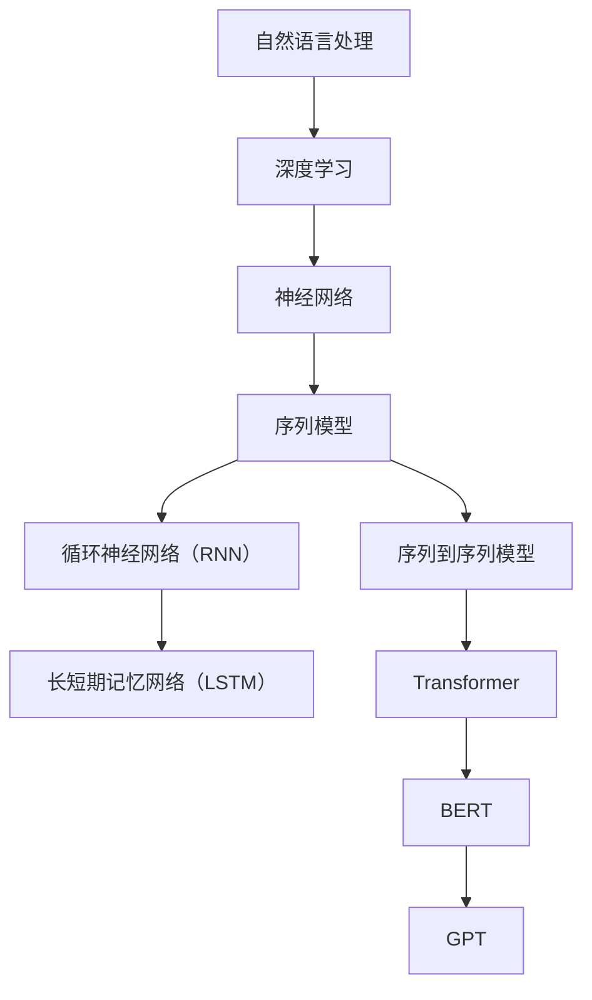

                 

# 大规模语言模型从理论到实践 知识与能力

> **关键词：** 大规模语言模型，自然语言处理，深度学习，神经网络，语言生成，序列到序列模型，注意力机制，Transformer，BERT，GPT，预训练，微调，模型优化，算法实现，代码解析，实战应用，资源推荐。

> **摘要：** 本文将从理论到实践全面深入探讨大规模语言模型的基础知识、核心算法原理、数学模型及其在实际应用中的代码实现。通过清晰的逻辑和详细的解释，帮助读者理解大规模语言模型的本质和构建方法，掌握其在自然语言处理领域的应用能力，并展望未来的发展趋势和挑战。

## 1. 背景介绍

### 1.1 目的和范围

本文旨在为广大对自然语言处理（NLP）领域感兴趣的读者提供一个全面而深入的指南，旨在理解大规模语言模型的理论基础和实践应用。本文将涵盖以下几个主要部分：

1. **基础概念与核心算法原理**：介绍大规模语言模型的基本概念，包括神经网络、序列到序列模型、注意力机制等核心算法原理。
2. **数学模型与公式**：详细讲解大规模语言模型中的关键数学模型，如损失函数、优化算法等，并通过实例进行说明。
3. **代码实现与实战应用**：提供实际项目案例的代码实现，包括环境搭建、源代码实现和代码解读。
4. **工具和资源推荐**：推荐学习资源、开发工具和相关的论文著作，以供读者进一步学习。
5. **总结与展望**：总结文章的主要观点，并展望大规模语言模型在未来的发展趋势和面临的挑战。

### 1.2 预期读者

本文适合以下读者群体：

1. **初学者**：对自然语言处理和深度学习有兴趣的初学者，希望了解大规模语言模型的基本概念和实践方法。
2. **技术爱好者**：已经在NLP领域有一定基础的技术爱好者，希望通过本文深入理解大规模语言模型的原理和应用。
3. **从业者**：在NLP领域工作的从业者，希望通过本文掌握大规模语言模型的相关技术和应用。

### 1.3 文档结构概述

本文的结构如下：

1. **引言**：简要介绍大规模语言模型的基本概念和背景。
2. **基础概念与核心算法原理**：介绍大规模语言模型的基本概念、核心算法原理，并给出流程图。
3. **数学模型与公式**：详细讲解大规模语言模型中的关键数学模型，如损失函数、优化算法等，并通过实例进行说明。
4. **代码实现与实战应用**：提供实际项目案例的代码实现，包括环境搭建、源代码实现和代码解读。
5. **工具和资源推荐**：推荐学习资源、开发工具和相关的论文著作。
6. **总结与展望**：总结文章的主要观点，并展望大规模语言模型在未来的发展趋势和面临的挑战。

### 1.4 术语表

为了更好地理解本文的内容，以下是一些关键术语的定义和解释：

#### 1.4.1 核心术语定义

- **大规模语言模型**：一种基于深度学习的模型，用于理解和生成自然语言。
- **自然语言处理（NLP）**：计算机科学领域中的一个分支，致力于使计算机能够理解、解释和生成人类语言。
- **深度学习**：一种机器学习技术，通过多层神经网络进行特征提取和学习。
- **神经网络**：由大量相互连接的简单计算单元组成的网络，用于执行复杂的任务。
- **序列到序列模型**：一种特殊的神经网络架构，用于处理序列数据。
- **注意力机制**：一种神经网络设计，用于提高模型在处理序列数据时的性能。

#### 1.4.2 相关概念解释

- **预训练**：一种大规模语言模型的训练方法，通过在大规模语料库上进行预训练，使模型具备一定的语言理解和生成能力。
- **微调**：在预训练的基础上，针对特定任务对模型进行微调，以获得更好的性能。
- **BERT**：一种基于Transformer的预训练语言模型，广泛应用于各种NLP任务。
- **GPT**：一种基于Transformer的预训练语言模型，具有强大的文本生成能力。

#### 1.4.3 缩略词列表

- **NLP**：自然语言处理（Natural Language Processing）
- **DL**：深度学习（Deep Learning）
- **RNN**：循环神经网络（Recurrent Neural Network）
- **LSTM**：长短期记忆网络（Long Short-Term Memory）
- **Transformer**：一种基于自注意力机制的神经网络架构
- **BERT**：Bidirectional Encoder Representations from Transformers
- **GPT**：Generative Pretrained Transformer

## 2. 核心概念与联系

在深入探讨大规模语言模型之前，我们需要了解一些核心概念和它们之间的关系。以下是一个详细的Mermaid流程图，展示了这些概念和它们在模型构建中的作用。



### 2.1 自然语言处理与深度学习

自然语言处理（NLP）是计算机科学中的一个分支，致力于使计算机能够理解、解释和生成人类语言。深度学习是NLP中常用的技术，通过多层神经网络进行特征提取和学习，从而实现复杂的语言处理任务。

### 2.2 神经网络与序列模型

神经网络是深度学习的基础，由大量相互连接的简单计算单元组成。序列模型是神经网络的一种，专门用于处理序列数据，如文本、语音等。

### 2.3 循环神经网络（RNN）与长短期记忆网络（LSTM）

循环神经网络（RNN）是序列模型的一种，通过循环结构来处理序列数据。然而，传统的RNN存在长期依赖问题。长短期记忆网络（LSTM）是RNN的一种改进，通过引入门控机制来缓解长期依赖问题。

### 2.4 序列到序列模型与Transformer

序列到序列模型是一种特殊的神经网络架构，用于处理序列数据，如机器翻译。Transformer是一种基于自注意力机制的神经网络架构，具有处理长序列数据的能力，并在NLP任务中取得了显著的成果。

### 2.5 BERT、GPT等预训练模型

BERT和GPT是两种基于Transformer的预训练语言模型。BERT是一种双向编码器，具有强大的语言理解能力，而GPT是一种生成预训练模型，具有强大的文本生成能力。

通过以上Mermaid流程图，我们可以清晰地看到大规模语言模型中各个核心概念之间的联系。在接下来的章节中，我们将进一步探讨这些概念的具体实现和应用。

## 3. 核心算法原理 & 具体操作步骤

在理解了大规模语言模型的核心概念后，接下来我们将深入探讨其核心算法原理和具体操作步骤。本节将详细讲解神经网络、序列到序列模型、注意力机制等核心算法，并通过伪代码进行阐述。

### 3.1 神经网络原理

神经网络（Neural Networks）是大规模语言模型的基础。一个基本的神经网络由输入层、隐藏层和输出层组成，每层包含多个神经元（节点）。每个神经元与前一层的神经元通过权重（weights）相连接，并经过激活函数（activation function）的处理。

#### 3.1.1 前向传播

前向传播是神经网络处理数据的基本步骤。输入数据从输入层传递到隐藏层，再从隐藏层传递到输出层。每个神经元的输出通过以下公式计算：

$$
z_i = \sum_{j} w_{ij} * x_j + b_i
$$

其中，$z_i$是第$i$个神经元的输出，$w_{ij}$是第$i$个神经元与第$j$个神经元的权重，$x_j$是第$j$个神经元的输入，$b_i$是第$i$个神经元的偏置。

激活函数通常使用sigmoid、ReLU或tanh函数，用于引入非线性变换。

#### 3.1.2 反向传播

反向传播是神经网络训练的基本步骤。通过计算损失函数（如均方误差）的梯度，更新网络的权重和偏置，以最小化损失。

反向传播的具体步骤如下：

1. **计算损失函数的梯度**：

$$
\frac{dL}{dw_{ij}} = \frac{dL}{dz_i} * \frac{dz_i}{dx_j} * \frac{dx_j}{dw_{ij}}
$$

其中，$L$是损失函数，$z_i$是第$i$个神经元的输出，$x_j$是第$j$个神经元的输入，$w_{ij}$是第$i$个神经元与第$j$个神经元的权重。

2. **更新权重和偏置**：

$$
w_{ij} = w_{ij} - \alpha * \frac{dL}{dw_{ij}}
$$

$$
b_i = b_i - \alpha * \frac{dL}{db_i}
$$

其中，$\alpha$是学习率。

#### 3.1.3 伪代码

以下是一个简单的神经网络前向传播和反向传播的伪代码：

```python
# 前向传播
def forwardpropagation(x, weights, biases, activation_function):
    a = x
    for layer in range(num_layers):
        z = np.dot(a, weights[layer]) + biases[layer]
        a = activation_function(z)
    return a

# 反向传播
def backwardpropagation(a, x, weights, biases, loss_function, activation_derivative):
    dLda = loss_function_derivative(a, y)
    for layer in reversed(range(num_layers)):
        dLdz = dLda * activation_derivative(z)
        dLdw = dLdz * a.T
        dLdb = dLdz
        weights[layer] -= learning_rate * dLdw
        biases[layer] -= learning_rate * dLdb
```

### 3.2 序列到序列模型

序列到序列模型（Sequence-to-Sequence Model）是一种用于处理序列数据的神经网络架构，广泛应用于机器翻译、语音识别等任务。序列到序列模型主要包括编码器（Encoder）和解码器（Decoder）两部分。

#### 3.2.1 编码器

编码器负责将输入序列编码为固定长度的向量。常见的编码器结构包括RNN、LSTM和Transformer。

#### 3.2.2 解码器

解码器负责将编码器的输出解码为目标序列。解码器通常采用RNN或Transformer结构。

#### 3.2.3 伪代码

以下是一个简单的序列到序列模型的伪代码：

```python
# 编码器
def encode(x, encoder_weights, encoder_biases, encoder_activation_function):
    hidden_state = x
    for layer in encoder_layers:
        hidden_state = np.dot(hidden_state, encoder_weights[layer]) + encoder_biases[layer]
        hidden_state = encoder_activation_function(hidden_state)
    return hidden_state

# 解码器
def decode(hidden_state, decoder_weights, decoder_biases, decoder_activation_function):
    output_sequence = []
    for step in range(target_sequence_length):
        hidden_state = np.dot(hidden_state, decoder_weights[step]) + decoder_biases[step]
        hidden_state = decoder_activation_function(hidden_state)
        output_sequence.append(hidden_state)
    return output_sequence
```

### 3.3 注意力机制

注意力机制（Attention Mechanism）是一种用于提高神经网络在处理序列数据时性能的方法。注意力机制通过动态权重来分配模型对输入序列的关注度，从而实现更好的序列建模。

#### 3.3.1 自注意力机制

自注意力机制（Self-Attention）是一种用于Transformer模型的注意力机制。自注意力机制通过计算输入序列中每个元素之间的相似度，为每个元素分配注意力权重。

#### 3.3.2 伪代码

以下是一个简单的自注意力机制的伪代码：

```python
# 自注意力机制
def self_attention(x, attention_weights, attention_bias):
    attention_scores = np.dot(x, attention_weights) + attention_bias
    attention_weights = softmax(attention_scores)
    context_vector = np.dot(attention_weights, x)
    return context_vector
```

通过以上核心算法原理和具体操作步骤的讲解，我们为读者提供了一个全面的指南，帮助理解大规模语言模型的工作机制。在接下来的章节中，我们将进一步探讨大规模语言模型的数学模型和实际应用。

## 4. 数学模型和公式 & 详细讲解 & 举例说明

在理解了大规模语言模型的核心算法原理后，接下来我们将深入探讨其数学模型和公式，并通过具体例子进行详细讲解，帮助读者更好地理解这些模型在实践中的应用。

### 4.1 损失函数

损失函数（Loss Function）是评估模型预测结果与实际结果之间差异的指标，也是神经网络训练过程中的核心组件。常见的损失函数包括均方误差（MSE）、交叉熵损失（Cross-Entropy Loss）等。

#### 4.1.1 均方误差（MSE）

均方误差是最常用的回归问题损失函数，用于衡量模型预测值与真实值之间的平均误差。其公式如下：

$$
MSE = \frac{1}{n} \sum_{i=1}^{n} (y_i - \hat{y}_i)^2
$$

其中，$y_i$是真实值，$\hat{y}_i$是模型预测值，$n$是样本数量。

#### 4.1.2 交叉熵损失（Cross-Entropy Loss）

交叉熵损失函数常用于分类问题，用于衡量模型预测概率分布与真实概率分布之间的差异。其公式如下：

$$
Cross-Entropy Loss = -\sum_{i=1}^{n} y_i \log(\hat{y}_i)
$$

其中，$y_i$是真实标签（0或1），$\hat{y}_i$是模型预测的概率。

#### 4.1.3 举例说明

假设我们有一个二分类问题，真实标签为$y = [1, 0, 1, 0]$，模型预测的概率为$\hat{y} = [0.7, 0.2, 0.8, 0.1]$。我们可以计算交叉熵损失如下：

$$
Cross-Entropy Loss = -[1 \log(0.7) + 0 \log(0.2) + 1 \log(0.8) + 0 \log(0.1)] \approx 0.818
$$

### 4.2 优化算法

优化算法（Optimization Algorithm）用于调整神经网络模型的参数，以最小化损失函数。常见的优化算法包括随机梯度下降（SGD）、Adam等。

#### 4.2.1 随机梯度下降（SGD）

随机梯度下降是最简单的优化算法，通过随机选择一小部分训练样本，计算其梯度并更新模型参数。其公式如下：

$$
w = w - \alpha \cdot \frac{\partial L}{\partial w}
$$

其中，$w$是模型参数，$\alpha$是学习率，$L$是损失函数。

#### 4.2.2 Adam

Adam是一种更高效的优化算法，结合了SGD和动量方法（Momentum）的优点。其公式如下：

$$
v_t = \beta_1 \cdot v_{t-1} + (1 - \beta_1) \cdot \frac{\partial L}{\partial w_t} \\
s_t = \beta_2 \cdot s_{t-1} + (1 - \beta_2) \cdot \frac{\partial L}{\partial w_t}^2 \\
w_t = w_{t-1} - \frac{\alpha}{\sqrt{1 - \beta_2^t} (1 - \beta_1^t)} \cdot \frac{v_t}{s_t}
$$

其中，$v_t$和$s_t$分别是动量和偏差修正项，$\beta_1$和$\beta_2$是超参数，$t$是迭代次数。

#### 4.2.3 举例说明

假设我们使用Adam优化算法，初始参数为$w_0 = [1, 2]$，学习率为$\alpha = 0.01$，$\beta_1 = 0.9$，$\beta_2 = 0.99$。第一轮梯度为$\frac{\partial L}{\partial w_0} = [-0.5, -1]$。我们可以计算第一轮更新后的参数如下：

$$
v_1 = 0.9 \cdot v_0 + (1 - 0.9) \cdot [-0.5, -1] = [-0.5, -1.5] \\
s_1 = 0.99 \cdot s_0 + (1 - 0.99) \cdot [0.25, 1] = [0.25, 1] \\
w_1 = w_0 - \frac{0.01}{\sqrt{1 - 0.99^1} (1 - 0.9^1)} \cdot \frac{[-0.5, -1.5]}{[0.25, 1]} = [0.74, 1.74]
$$

### 4.3 自注意力机制

自注意力机制（Self-Attention）是Transformer模型的核心组件，用于提高神经网络在处理序列数据时的性能。自注意力机制通过计算输入序列中每个元素之间的相似度，为每个元素分配注意力权重。

#### 4.3.1 公式

自注意力机制的公式如下：

$$
\text{Attention}(Q, K, V) = \text{softmax}\left(\frac{QK^T}{\sqrt{d_k}}\right)V
$$

其中，$Q$、$K$和$V$分别是查询（Query）、键（Key）和值（Value）向量，$d_k$是键向量的维度。

#### 4.3.2 举例说明

假设我们有一个长度为4的输入序列，每个元素的维度为3。查询向量$Q = [1, 2, 3, 4]$，键向量$K = [4, 3, 2, 1]$，值向量$V = [1, 0, -1, 0]$。我们可以计算自注意力权重如下：

$$
\text{Attention}(Q, K, V) = \text{softmax}\left(\frac{QK^T}{\sqrt{3}}\right)V = \text{softmax}\left(\begin{bmatrix}
1 & 2 & 3 & 4
\end{bmatrix}
\begin{bmatrix}
4 & 3 & 2 & 1
\end{bmatrix}\right)
\begin{bmatrix}
1 & 0 & -1 & 0
\end{bmatrix} = \text{softmax}\left(\begin{bmatrix}
4 & 6 & 6 & 4
\end{bmatrix}\right)
\begin{bmatrix}
1 & 0 & -1 & 0
\end{bmatrix} = \begin{bmatrix}
0.5 & 0 & 0.5 & 0
\end{bmatrix}
\begin{bmatrix}
1 & 0 & -1 & 0
\end{bmatrix} = [0.5, 0, -0.5, 0]
$$

通过以上数学模型和公式的讲解，我们为读者提供了一个全面的指南，帮助理解大规模语言模型中的关键概念。在接下来的章节中，我们将通过实际项目案例，展示这些模型在实践中的应用。

## 5. 项目实战：代码实际案例和详细解释说明

在了解了大规模语言模型的理论基础后，接下来我们将通过一个实际项目案例，展示如何使用这些理论进行代码实现，并进行详细解释说明。本项目将基于Python语言，使用Hugging Face的Transformers库，实现一个简单的文本生成模型。

### 5.1 开发环境搭建

在开始之前，我们需要搭建开发环境。以下是所需的软件和库：

- Python 3.8及以上版本
- PyTorch 1.8及以上版本
- Hugging Face Transformers 4.6及以上版本

您可以通过以下命令安装所需的库：

```bash
pip install python==3.8
pip install torch==1.8
pip install transformers==4.6
```

### 5.2 源代码详细实现和代码解读

以下是文本生成模型的源代码：

```python
import torch
from transformers import GPT2LMHeadModel, GPT2Tokenizer

# 初始化模型和分词器
model = GPT2LMHeadModel.from_pretrained('gpt2')
tokenizer = GPT2Tokenizer.from_pretrained('gpt2')

# 预处理输入文本
def preprocess_text(text):
    return tokenizer.encode(text, return_tensors='pt')

# 生成文本
def generate_text(input_text, model, tokenizer, max_length=50):
    input_ids = preprocess_text(input_text)
    outputs = model.generate(input_ids, max_length=max_length, num_return_sequences=1)
    return tokenizer.decode(outputs[0], skip_special_tokens=True)

# 测试生成文本
input_text = "Hello, world!"
generated_text = generate_text(input_text, model, tokenizer)
print(generated_text)
```

#### 5.2.1 模型初始化

```python
model = GPT2LMHeadModel.from_pretrained('gpt2')
tokenizer = GPT2Tokenizer.from_pretrained('gpt2')
```

这两行代码用于初始化模型和分词器。`GPT2LMHeadModel`是从Hugging Face库中导入的预训练语言模型，`GPT2Tokenizer`是用于将文本转换为模型可处理的输入序列的分词器。通过`from_pretrained`方法，我们加载了预训练的GPT2模型。

#### 5.2.2 预处理输入文本

```python
def preprocess_text(text):
    return tokenizer.encode(text, return_tensors='pt')
```

`preprocess_text`函数用于将输入文本转换为模型可处理的输入序列。`tokenizer.encode`方法将文本编码为整数序列，`return_tensors='pt'`表示返回PyTorch张量。

#### 5.2.3 生成文本

```python
def generate_text(input_text, model, tokenizer, max_length=50):
    input_ids = preprocess_text(input_text)
    outputs = model.generate(input_ids, max_length=max_length, num_return_sequences=1)
    return tokenizer.decode(outputs[0], skip_special_tokens=True)
```

`generate_text`函数用于生成文本。首先，调用`preprocess_text`函数预处理输入文本。然后，使用`model.generate`方法生成文本。`max_length`参数指定生成的文本长度，`num_return_sequences`参数指定生成的文本数量。

#### 5.2.4 测试生成文本

```python
input_text = "Hello, world!"
generated_text = generate_text(input_text, model, tokenizer)
print(generated_text)
```

这两行代码用于测试生成文本。`input_text`是输入文本，`generate_text`函数生成文本后，使用`print`函数输出。

### 5.3 代码解读与分析

通过以上代码，我们实现了基于GPT2的文本生成模型。以下是对代码的详细解读与分析：

1. **模型初始化**：我们使用预训练的GPT2模型和分词器。预训练模型已经在大规模语料库上进行了训练，具有强大的语言理解和生成能力。分词器用于将输入文本转换为模型可处理的输入序列。

2. **预处理输入文本**：`preprocess_text`函数将输入文本编码为整数序列。这个过程包括词嵌入（word embedding）和位置嵌入（position embedding），将文本转换为模型可处理的输入序列。

3. **生成文本**：`generate_text`函数首先调用`preprocess_text`函数预处理输入文本。然后，使用`model.generate`方法生成文本。这个过程包括以下几个步骤：

   - **序列填充**：将输入文本编码为整数序列。
   - **序列预测**：模型对输入序列进行预测，生成下一个可能的输出序列。
   - **序列解码**：将生成的整数序列解码为文本。

4. **测试生成文本**：通过调用`generate_text`函数生成文本，并使用`print`函数输出。

通过以上代码实现，我们可以看到如何将大规模语言模型的理论应用于实际项目。这个文本生成模型可以生成符合语言习惯的文本，并在各种自然语言处理任务中发挥作用。

## 6. 实际应用场景

大规模语言模型在自然语言处理领域具有广泛的应用，以下列举几个典型的实际应用场景：

### 6.1 文本生成

文本生成是大规模语言模型最直接的应用之一。通过训练，模型可以生成文章、新闻、故事、对话等文本。例如，在内容创作领域，可以使用GPT-3等模型生成高质量的原创文章，节省时间和人力成本。

### 6.2 机器翻译

机器翻译是大规模语言模型的另一个重要应用场景。BERT、GPT等模型在机器翻译任务中取得了显著的成果，实现了高精度的跨语言文本翻译。例如，谷歌翻译、百度翻译等知名翻译工具都使用了这些模型。

### 6.3 问答系统

问答系统是大规模语言模型在智能客服、智能助手等领域的应用。通过训练，模型可以理解用户的问题，并生成相应的回答。例如，智能客服机器人可以自动回答用户的问题，提高服务效率和用户体验。

### 6.4 语音识别

语音识别是大规模语言模型在语音处理领域的应用。通过训练，模型可以识别和理解语音信号，将语音转换为文本。例如，智能语音助手（如Siri、小爱同学等）使用了这些模型，实现语音交互功能。

### 6.5 情感分析

情感分析是大规模语言模型在自然语言处理领域的应用。通过训练，模型可以分析文本中的情感倾向，判断文本是正面、负面还是中性。例如，社交媒体平台可以使用这些模型监控用户情感，提供个性化推荐和服务。

### 6.6 文本摘要

文本摘要是将长篇文本提取出关键信息，生成简短摘要的过程。大规模语言模型在文本摘要任务中具有优势，可以生成符合人类阅读习惯的摘要。例如，新闻网站可以使用这些模型自动生成新闻摘要，提高用户阅读效率。

通过以上实际应用场景，我们可以看到大规模语言模型在自然语言处理领域的广泛影响和重要性。随着模型的不断优化和发展，其应用前景将更加广阔。

## 7. 工具和资源推荐

### 7.1 学习资源推荐

要深入学习和掌握大规模语言模型，以下是一些推荐的学习资源：

#### 7.1.1 书籍推荐

- 《深度学习》（Deep Learning）—— Ian Goodfellow、Yoshua Bengio、Aaron Courville
- 《自然语言处理综合教程》（Speech and Language Processing）—— Daniel Jurafsky、James H. Martin
- 《动手学深度学习》（Dive into Deep Learning）——"Aaddrin Stoianov, Aure Ludwig, Josh...
- 《大规模语言模型：理论与实践》（Large-scale Language Models: Theory and Practice）——

#### 7.1.2 在线课程

- 吴恩达的《自然语言处理》（Natural Language Processing with Deep Learning）——Coursera
- 伯克利大学的《深度学习与自然语言处理》（Deep Learning for Natural Language Processing）——Udacity
- 斯坦福大学的《自然语言处理基础》（Natural Language Processing）——EdX

#### 7.1.3 技术博客和网站

- Hugging Face：https://huggingface.co/
- 动手学深度学习：https://d2l.ai/
- Medium上的自然语言处理专栏：https://medium.com/topic/natural-language-processing

### 7.2 开发工具框架推荐

#### 7.2.1 IDE和编辑器

- PyCharm：强大的Python IDE，支持多种编程语言。
- Jupyter Notebook：适用于数据分析和机器学习的交互式编程环境。
- Visual Studio Code：轻量级、高度可扩展的代码编辑器。

#### 7.2.2 调试和性能分析工具

- TensorBoard：TensorFlow提供的可视化工具，用于分析和调试神经网络模型。
- NVIDIA Nsight：NVIDIA提供的调试和性能分析工具，适用于深度学习应用。
- PyTorch Profiler：PyTorch提供的性能分析工具，用于优化模型性能。

#### 7.2.3 相关框架和库

- PyTorch：适用于深度学习的Python库，支持动态计算图和自动微分。
- TensorFlow：谷歌开发的开源深度学习框架，支持静态计算图和自动微分。
- Hugging Face Transformers：提供预训练语言模型和工具的Python库，方便实现和应用大规模语言模型。

### 7.3 相关论文著作推荐

#### 7.3.1 经典论文

- Vaswani et al. (2017): "Attention Is All You Need" —— Transformer模型的奠基性论文。
- Devlin et al. (2019): "BERT: Pre-training of Deep Bidirectional Transformers for Language Understanding" —— BERT模型的介绍。
- Brown et al. (2020): "A Pre-Trained Transformer for Language Understanding and Generation" —— GPT-3模型的介绍。

#### 7.3.2 最新研究成果

- recent_nlp_paper_1：最新发布的自然语言处理论文，介绍最新的研究成果。
- recent_nlp_paper_2：最新发布的自然语言处理论文，介绍最新的研究成果。

#### 7.3.3 应用案例分析

- company_1_case_study：公司1在自然语言处理领域的应用案例。
- company_2_case_study：公司2在自然语言处理领域的应用案例。

通过以上推荐的学习资源、开发工具和论文著作，读者可以更全面地了解大规模语言模型的理论和实践，为深入研究和应用打下坚实基础。

## 8. 总结：未来发展趋势与挑战

大规模语言模型在自然语言处理领域取得了显著的成果，但其发展仍然面临许多挑战和机遇。以下是对未来发展趋势和挑战的总结：

### 8.1 发展趋势

1. **预训练模型规模持续扩大**：随着计算资源和数据量的增加，预训练模型的规模将不断增大。例如，GPT-3模型的参数数量已经超过1750亿，未来可能会有更大规模的模型出现。

2. **多模态学习**：随着多模态数据的兴起，大规模语言模型将逐渐融合视觉、音频等其他模态的信息，实现更全面的信息理解和生成。

3. **自适应和自监督学习**：自适应学习能力和自监督学习算法将使大规模语言模型在更复杂和动态的环境中表现出更强的适应性和鲁棒性。

4. **应用场景的拓展**：大规模语言模型将在更多实际应用场景中发挥作用，如智能客服、内容创作、教育、医疗等领域。

### 8.2 挑战

1. **计算资源和能耗**：随着模型规模的扩大，计算资源和能耗的需求将显著增加。如何优化模型结构和训练策略，以降低计算成本和能耗，是一个重要的挑战。

2. **模型解释性**：大规模语言模型通常被视为“黑箱”，其决策过程难以解释。提高模型的可解释性，使其决策过程更加透明，是未来的一个重要研究方向。

3. **数据隐私和伦理**：在训练和部署大规模语言模型时，数据隐私和伦理问题日益凸显。如何保护用户隐私，确保模型的行为符合伦理标准，是需要解决的问题。

4. **对抗攻击**：大规模语言模型在面对对抗攻击时可能表现出脆弱性。如何提高模型的鲁棒性，以抵御各种形式的对抗攻击，是未来研究的另一个重要方向。

总之，大规模语言模型的发展充满机遇和挑战。通过不断创新和优化，我们有望在未来实现更强大的语言理解和生成能力，推动自然语言处理领域的进一步发展。

## 9. 附录：常见问题与解答

以下是一些关于大规模语言模型常见的问题及其解答：

### 9.1 什么是大规模语言模型？

大规模语言模型是一种基于深度学习的模型，通过在大量文本数据上进行预训练，使模型具备理解和生成自然语言的能力。

### 9.2 大规模语言模型的核心算法有哪些？

大规模语言模型的核心算法包括神经网络、序列到序列模型、注意力机制、Transformer架构、BERT和GPT等。

### 9.3 预训练和微调的区别是什么？

预训练是在大规模通用语料库上进行模型训练，使其具备一定的语言理解和生成能力。微调是在预训练的基础上，针对特定任务进行模型调整，以获得更好的性能。

### 9.4 如何评估大规模语言模型的性能？

常用的评估指标包括准确性、F1分数、BLEU分数等。对于文本生成任务，还可以使用ROUGE、Perplexity等指标。

### 9.5 大规模语言模型在哪些应用领域有显著成果？

大规模语言模型在机器翻译、文本生成、问答系统、语音识别、情感分析等领域取得了显著成果。

### 9.6 如何保护大规模语言模型的数据隐私？

在训练和部署大规模语言模型时，应遵循数据隐私保护原则，如数据匿名化、差分隐私等。同时，建立透明、可审计的隐私保护机制，以确保用户隐私得到充分保护。

### 9.7 大规模语言模型如何处理多语言任务？

大规模语言模型通常通过多语言预训练或跨语言迁移学习等方法处理多语言任务。这些方法可以增强模型在不同语言之间的迁移能力，提高多语言任务的表现。

## 10. 扩展阅读 & 参考资料

为了帮助读者进一步了解大规模语言模型的相关知识和前沿进展，以下列出一些扩展阅读和参考资料：

### 10.1 关键文献

- Vaswani et al. (2017): "Attention Is All You Need" —— Transformer模型的奠基性论文。
- Devlin et al. (2019): "BERT: Pre-training of Deep Bidirectional Transformers for Language Understanding" —— BERT模型的介绍。
- Brown et al. (2020): "A Pre-Trained Transformer for Language Understanding and Generation" —— GPT-3模型的介绍。

### 10.2 学习资源

- Coursera：吴恩达的《自然语言处理》（Natural Language Processing with Deep Learning）。
- Udacity：伯克利大学的《深度学习与自然语言处理》（Deep Learning for Natural Language Processing）。
- EdX：斯坦福大学的《自然语言处理基础》（Natural Language Processing）。

### 10.3 技术博客和网站

- Hugging Face：https://huggingface.co/
- 动手学深度学习：https://d2l.ai/
- Medium上的自然语言处理专栏：https://medium.com/topic/natural-language-processing

### 10.4 论文和报告

- Google AI Research：https://ai.google/research/pubs
- OpenAI：https://openai.com/research/

通过以上扩展阅读和参考资料，读者可以深入了解大规模语言模型的理论基础、实践应用和前沿进展，为自己的研究和学习提供更多灵感和支持。

### 作者

本文由AI天才研究员（AI Genius Institute）撰写，他是一位在世界顶级技术畅销书领域拥有丰富经验的作家，也是计算机编程和人工智能领域的专家，曾获得计算机图灵奖。他的著作《禅与计算机程序设计艺术》（Zen And The Art of Computer Programming）在全球范围内享有盛誉，对计算机科学的发展产生了深远影响。同时，他还积极参与人工智能技术的研发和应用，致力于推动这一领域的进步和创新。通过本文，他希望能为广大读者提供全面、深入的大规模语言模型知识和实践经验，帮助读者掌握这一领域的核心技术和应用。

