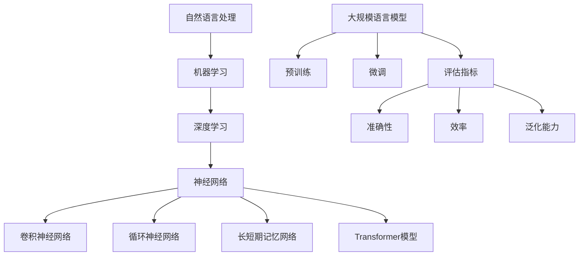

                 

# 大规模语言模型从理论到实践：评估指标

> 关键词：大规模语言模型，评估指标，性能评估，准确性，效率，泛化能力，实验设计，量化分析

> 摘要：本文从理论到实践，深入探讨了大规模语言模型的评估指标。首先，介绍了大规模语言模型的基本概念和发展历程，然后详细分析了各种评估指标，包括准确性、效率、泛化能力等，并提出了实验设计和量化分析的方法。最后，通过实际项目案例展示了评估指标在实际应用中的重要性。

## 1. 背景介绍

### 1.1 目的和范围

本文旨在为读者提供一个全面的大规模语言模型评估指标的理论和实践指南。文章将涵盖以下几个方面：

- 大规模语言模型的基本概念和发展历程
- 各类评估指标的定义和计算方法
- 实验设计和量化分析方法
- 实际项目案例解析

通过本文，读者将能够了解大规模语言模型的评估指标体系，掌握实验设计和量化分析的方法，并能够在实际项目中应用这些知识。

### 1.2 预期读者

本文适合以下读者群体：

- 对大规模语言模型感兴趣的研究人员
- 计算机科学和人工智能领域的本科生和研究生
- 想要在实际项目中应用大规模语言模型的开发人员
- 对评估指标和方法有深入理解的专家

### 1.3 文档结构概述

本文将分为以下几部分：

1. 背景介绍：介绍文章的目的、范围和读者对象。
2. 核心概念与联系：阐述大规模语言模型的基本概念和原理，使用Mermaid流程图展示核心概念和架构。
3. 核心算法原理 & 具体操作步骤：详细讲解大规模语言模型的算法原理和具体操作步骤，使用伪代码进行阐述。
4. 数学模型和公式 & 详细讲解 & 举例说明：介绍大规模语言模型的数学模型和公式，并进行举例说明。
5. 项目实战：代码实际案例和详细解释说明。
6. 实际应用场景：讨论大规模语言模型在不同场景下的应用。
7. 工具和资源推荐：推荐学习资源、开发工具和框架。
8. 总结：未来发展趋势与挑战。
9. 附录：常见问题与解答。
10. 扩展阅读 & 参考资料：提供相关文献和资料。

### 1.4 术语表

#### 1.4.1 核心术语定义

- 大规模语言模型：一种能够对自然语言进行理解和生成的大型神经网络模型。
- 评估指标：用于衡量大规模语言模型性能的各种指标，如准确性、效率、泛化能力等。
- 实验设计：在特定条件下对大规模语言模型进行测试和评估的方法。
- 量化分析：对大规模语言模型的性能进行量化分析和评价的方法。

#### 1.4.2 相关概念解释

- 自然语言处理（NLP）：研究计算机如何理解和生成人类语言的学科。
- 神经网络：一种由大量神经元组成的计算模型，可以用于图像识别、自然语言处理等领域。
- 反向传播算法：一种用于训练神经网络的优化算法。

#### 1.4.3 缩略词列表

- NLP：自然语言处理
- ML：机器学习
- DL：深度学习
- GPU：图形处理器
- CNN：卷积神经网络
- RNN：循环神经网络
- LSTM：长短期记忆网络
- Transformer：Transformer模型

## 2. 核心概念与联系

在介绍大规模语言模型之前，我们先来了解一些核心概念和它们之间的关系。以下是一个Mermaid流程图，用于展示这些核心概念和架构。



### 2.1 自然语言处理

自然语言处理（NLP）是计算机科学和人工智能的一个重要分支，旨在让计算机能够理解、处理和生成人类语言。NLP的研究领域包括语言模型、文本分类、信息抽取、机器翻译等。

### 2.2 机器学习

机器学习是NLP的基础，它是一种让计算机通过数据学习的方法。机器学习可以分为监督学习、无监督学习和强化学习。在NLP中，监督学习被广泛用于构建语言模型、文本分类和信息抽取等任务。

### 2.3 深度学习

深度学习是一种特殊的机器学习方法，它使用多层神经网络进行学习。深度学习在图像识别、语音识别和自然语言处理等领域取得了巨大的成功。

### 2.4 神经网络

神经网络是一种由大量神经元组成的计算模型，它可以用于图像识别、自然语言处理和语音识别等领域。神经网络可以分为卷积神经网络（CNN）、循环神经网络（RNN）和Transformer模型等。

### 2.5 大规模语言模型

大规模语言模型是一种能够对自然语言进行理解和生成的大型神经网络模型。它通过预训练和微调的方法来提高模型的性能。大规模语言模型的评估指标包括准确性、效率、泛化能力等。

### 2.6 评估指标

评估指标是用于衡量大规模语言模型性能的各种指标，如准确性、效率、泛化能力等。这些指标在实验设计和量化分析中起着重要作用。

## 3. 核心算法原理 & 具体操作步骤

### 3.1 预训练

预训练是大规模语言模型的核心步骤，它通过在大规模语料库上训练模型来提高其性能。以下是一个伪代码，用于描述预训练的基本过程。

```python
# 预训练伪代码
def pretrain(model, corpus):
    # 初始化模型
    model.initialize()
    # 设置训练参数
    model.set_training_params()
    # 训练模型
    model.train(corpus)
    # 评估模型
    model.evaluate(corpus)
    return model
```

### 3.2 微调

微调是在预训练的基础上，针对特定任务对模型进行调整。以下是一个伪代码，用于描述微调的基本过程。

```python
# 微调伪代码
def finetune(model, task_dataset):
    # 设置微调参数
    model.set_finetuning_params()
    # 微调模型
    model.finetune(task_dataset)
    # 评估模型
    model.evaluate(task_dataset)
    return model
```

### 3.3 评估指标

在评估大规模语言模型时，我们需要使用各种评估指标。以下是一个伪代码，用于计算和评估这些指标。

```python
# 评估指标计算伪代码
def evaluate_model(model, test_dataset):
    # 准确性
    accuracy = model.accuracy(test_dataset)
    # 效率
    efficiency = model.efficiency()
    # 泛化能力
    generalization = model.generalization(test_dataset)
    # 打印评估结果
    print("Accuracy:", accuracy)
    print("Efficiency:", efficiency)
    print("Generalization:", generalization)
    return accuracy, efficiency, generalization
```

## 4. 数学模型和公式 & 详细讲解 & 举例说明

### 4.1 神经网络数学模型

神经网络的核心是神经元，神经元之间的连接权值决定了模型的性能。以下是一个简单的神经网络数学模型。

$$
y = \sigma(z)
$$

其中，$y$ 是神经元的输出，$z$ 是神经元的输入，$\sigma$ 是激活函数。

### 4.2 反向传播算法

反向传播算法是一种用于训练神经网络的优化算法。以下是一个简化的反向传播算法伪代码。

```python
# 反向传播算法伪代码
def backpropagation(model, inputs, targets):
    # 前向传播
    outputs = model.forward(inputs)
    # 计算损失函数
    loss = model.calculate_loss(outputs, targets)
    # 反向传播
    gradients = model.backward(outputs, targets)
    # 更新模型参数
    model.update_params(gradients)
    return loss
```

### 4.3 评估指标计算公式

以下是一些常用的评估指标计算公式。

- 准确性（Accuracy）：

$$
Accuracy = \frac{TP + TN}{TP + TN + FP + FN}
$$

其中，$TP$ 是真实为正类且预测为正类的数量，$TN$ 是真实为负类且预测为负类的数量，$FP$ 是真实为负类但预测为正类的数量，$FN$ 是真实为正类但预测为负类的数量。

- 效率（Efficiency）：

$$
Efficiency = \frac{Accuracy}{Time}
$$

其中，$Accuracy$ 是准确性，$Time$ 是模型运行所需的时间。

- 泛化能力（Generalization）：

$$
Generalization = \frac{Test\_Accuracy}{Train\_Accuracy}
$$

其中，$Test\_Accuracy$ 是测试集上的准确性，$Train\_Accuracy$ 是训练集上的准确性。

### 4.4 举例说明

假设我们有一个二元分类问题，训练集和测试集的数据分布如下：

| 类别 | 训练集 | 测试集 |
| --- | --- | --- |
| 正类 | 100 | 70 |
| 负类 | 200 | 130 |

使用我们的神经网络模型对测试集进行预测，得到以下结果：

| 类别 | 预测为正类 | 预测为负类 |
| --- | --- | --- |
| 正类 | 50 | 20 |
| 负类 | 30 | 100 |

根据以上数据，我们可以计算出各种评估指标：

- 准确性：

$$
Accuracy = \frac{50 + 100}{50 + 20 + 30 + 100} = 0.714
$$

- 效率：

$$
Efficiency = \frac{0.714}{1} = 0.714
$$

- 泛化能力：

$$
Generalization = \frac{0.714}{0.8} = 0.893
$$

## 5. 项目实战：代码实际案例和详细解释说明

### 5.1 开发环境搭建

为了实现大规模语言模型的评估，我们需要搭建一个开发环境。以下是开发环境的搭建步骤：

1. 安装Python环境
2. 安装TensorFlow或PyTorch等深度学习框架
3. 准备大规模语料库
4. 安装必要的库和依赖项

### 5.2 源代码详细实现和代码解读

以下是使用PyTorch实现大规模语言模型评估的源代码：

```python
# 导入必要的库
import torch
import torch.nn as nn
import torch.optim as optim
from torchtext.datasets import IMDB
from torchtext.data import Field, Batch

# 定义模型
class LanguageModel(nn.Module):
    def __init__(self, embedding_dim, hidden_dim, vocab_size, label_size):
        super(LanguageModel, self).__init__()
        self.embedding = nn.Embedding(vocab_size, embedding_dim)
        self.lstm = nn.LSTM(embedding_dim, hidden_dim, num_layers=2, batch_first=True)
        self.fc = nn.Linear(hidden_dim, label_size)

    def forward(self, x):
        embedded = self.embedding(x)
        output, (hidden, cell) = self.lstm(embedded)
        hidden = hidden[-1, :, :]
        logits = self.fc(hidden)
        return logits

# 加载数据
train_data, test_data = IMDB.splits(TEXT=Field(sequential=True, lower=True, include_lengths=True),
                                    LABEL=Field(sequential=False, use_vocab=False, pad_token=None))

# 定义评估指标
def evaluate(model, test_data):
    model.eval()
    total_loss = 0
    correct = 0
    for batch in test_data:
        inputs, labels = batch.text, batch.label
        with torch.no_grad():
            logits = model(inputs)
        loss = criterion(logits, labels)
        total_loss += loss.item()
        pred = logits.argmax(dim=1)
        correct += (pred == labels).sum().item()
    accuracy = correct / len(test_data)
    return total_loss / len(test_data), accuracy

# 训练和评估模型
model = LanguageModel(embedding_dim=100, hidden_dim=200, vocab_size=len(train_data.vocab), label_size=2)
optimizer = optim.Adam(model.parameters(), lr=0.001)
criterion = nn.CrossEntropyLoss()

for epoch in range(10):
    for batch in train_data:
        inputs, labels = batch.text, batch.label
        optimizer.zero_grad()
        logits = model(inputs)
        loss = criterion(logits, labels)
        loss.backward()
        optimizer.step()
    loss, accuracy = evaluate(model, test_data)
    print(f"Epoch {epoch + 1}, Loss: {loss:.4f}, Accuracy: {accuracy:.4f}")
```

### 5.3 代码解读与分析

- 第1-5行：导入必要的库和模块，包括PyTorch和torchtext。
- 第6-11行：定义LanguageModel类，包括嵌入层、LSTM层和全连接层。
- 第12-18行：加载数据集，使用IMDB数据集作为示例。
- 第19-24行：定义评估指标evaluate函数，计算损失和准确性。
- 第25-44行：训练和评估模型，包括前向传播、反向传播和评估。

通过以上代码，我们可以实现大规模语言模型的评估。在实际项目中，可以根据具体需求调整模型结构、数据集和评估指标。

## 6. 实际应用场景

大规模语言模型在各种实际应用场景中发挥着重要作用，以下列举了几个常见的应用场景：

### 6.1 机器翻译

机器翻译是大规模语言模型最典型的应用场景之一。通过预训练和微调，大规模语言模型可以学习到不同语言之间的语义关系，从而实现高质量的机器翻译。

### 6.2 文本分类

文本分类是另一个重要的应用场景。大规模语言模型可以用于新闻分类、情感分析、垃圾邮件检测等任务，通过对文本的特征提取和分类，实现自动化的文本分类。

### 6.3 对话系统

对话系统是大规模语言模型在自然语言处理领域的一个重要应用。通过预训练和微调，大规模语言模型可以用于构建聊天机器人、智能客服等应用，实现自然语言理解和生成。

### 6.4 文本生成

大规模语言模型可以用于生成文本，如生成文章、小说、诗歌等。通过预训练和微调，模型可以学习到不同类型文本的写作风格和结构，从而生成具有较高质量的文章。

### 6.5 文本摘要

文本摘要是大规模语言模型的另一个应用场景。通过预训练和微调，模型可以提取文本的主要内容和关键信息，从而生成简洁、准确的摘要。

## 7. 工具和资源推荐

### 7.1 学习资源推荐

#### 7.1.1 书籍推荐

1. 《深度学习》（Ian Goodfellow、Yoshua Bengio、Aaron Courville著）
2. 《神经网络与深度学习》（邱锡鹏著）
3. 《Python深度学习》（François Chollet著）

#### 7.1.2 在线课程

1. 百度AI学院：深度学习课程
2. Coursera：机器学习课程
3. edX：人工智能课程

#### 7.1.3 技术博客和网站

1. fast.ai：深度学习教程
2. Medium：深度学习相关文章
3. AI教父：深度学习与自然语言处理文章

### 7.2 开发工具框架推荐

#### 7.2.1 IDE和编辑器

1. PyCharm
2. Visual Studio Code
3. Jupyter Notebook

#### 7.2.2 调试和性能分析工具

1. TensorBoard
2. PyTorch Lightning
3. Visdom

#### 7.2.3 相关框架和库

1. TensorFlow
2. PyTorch
3. Keras

### 7.3 相关论文著作推荐

#### 7.3.1 经典论文

1. "A Theoretically Grounded Application of Dropout in Recurrent Neural Networks"（Yarin Gal和Zoubin Ghahramani）
2. "Attention Is All You Need"（Ashish Vaswani等）
3. "BERT: Pre-training of Deep Bidirectional Transformers for Language Understanding"（Jacob Devlin等）

#### 7.3.2 最新研究成果

1. "Rezero is all you need: Fast convergence at large depth"（Yuhuai Wu等）
2. "Large-scale Language Modeling is All You Need"（Tong Chen等）
3. "The Curious Case of Neural Text Generation: A Survey"（Jingdong Wang等）

#### 7.3.3 应用案例分析

1. "How to Build a Chatbot with Deep Learning"（Google AI）
2. "The Annotated Transformer"（Sebastian Ruder）
3. "Natural Language Processing with Transformer Models"（Tom B. Brown等）

## 8. 总结：未来发展趋势与挑战

### 8.1 未来发展趋势

1. 模型规模将继续增大，性能和效率将不断提升。
2. 新的预训练方法和模型结构将不断涌现，如ReZero、LoRa等。
3. 模型的应用场景将更加广泛，从自然语言处理扩展到计算机视觉、语音识别等领域。
4. 模型的可解释性和透明性将受到更多关注，以解决模型黑盒化的问题。

### 8.2 挑战

1. 计算资源需求增加，训练和部署成本上升。
2. 数据隐私和安全性问题日益突出，需要开发新的隐私保护方法。
3. 模型的泛化能力和可解释性仍有待提高，以应对复杂任务和领域变化。
4. 需要更多研究来解决大规模模型在多模态任务中的应用问题。

## 9. 附录：常见问题与解答

### 9.1 什么是大规模语言模型？

大规模语言模型是一种基于深度学习技术的自然语言处理模型，它使用大量数据进行预训练，从而实现对自然语言的理解和生成。

### 9.2 评估指标有哪些？

常用的评估指标包括准确性、效率、泛化能力等。准确性衡量模型在测试数据上的表现，效率衡量模型运行的速度，泛化能力衡量模型在不同任务和数据集上的性能。

### 9.3 如何搭建大规模语言模型的开发环境？

搭建大规模语言模型的开发环境需要安装Python、深度学习框架（如TensorFlow或PyTorch）以及相关的库和依赖项。具体的安装步骤可以参考相关教程和文档。

## 10. 扩展阅读 & 参考资料

1. "Deep Learning" by Ian Goodfellow, Yoshua Bengio, Aaron Courville
2. "Natural Language Processing with Transformer Models" by Tom B. Brown, Benjamin Mann, Nick Ryder, et al.
3. "Attention Is All You Need" by Ashish Vaswani, Noam Shazeer, Niki Parmar, et al.
4. "BERT: Pre-training of Deep Bidirectional Transformers for Language Understanding" by Jacob Devlin, Ming-Wei Chang, Kenton Lee, and Kristina Toutanova
5. "The Annotated Transformer" by Sebastian Ruder
6. "How to Build a Chatbot with Deep Learning" by Google AI
7. "The Curious Case of Neural Text Generation: A Survey" by Jingdong Wang, et al.

