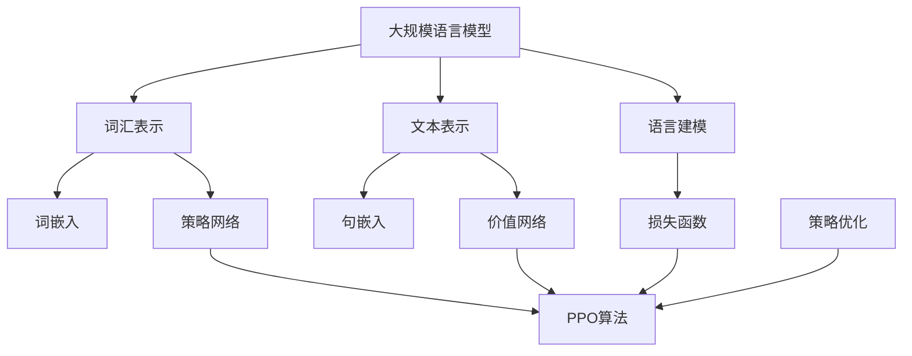

                 

# 大规模语言模型从理论到实践 近端策略优化算法

> 关键词：大规模语言模型、近端策略优化、算法原理、数学模型、项目实战、应用场景、未来趋势

> 摘要：本文旨在深入探讨大规模语言模型的理论基础和实践应用，重点关注近端策略优化算法。通过详细的原理讲解、数学模型分析以及实际项目案例，读者可以全面了解这一算法的核心思想、操作步骤及其在自然语言处理领域的广泛应用。

## 1. 背景介绍

### 1.1 目的和范围

本文旨在为读者提供一个系统而全面的指南，帮助理解大规模语言模型以及其核心优化算法——近端策略优化（Proximal Policy Optimization, PPO）。本文的目标是：

- 深入解析大规模语言模型的工作原理及其在自然语言处理中的应用。
- 详细解释近端策略优化算法的基本概念、数学模型和操作步骤。
- 通过实际项目案例，展示如何将PPO算法应用于大规模语言模型的训练和优化。
- 探讨PPO算法在自然语言处理领域的实际应用场景及其未来发展趋势。

### 1.2 预期读者

本文适合对自然语言处理和机器学习有一定了解的读者，包括：

- 自然语言处理工程师
- 机器学习研究者
- 计算机科学专业学生
- 对人工智能和机器学习感兴趣的爱好者

### 1.3 文档结构概述

本文将分为以下几个部分：

- 第1部分：背景介绍，包括目的和范围、预期读者、文档结构概述和术语表。
- 第2部分：核心概念与联系，介绍大规模语言模型和近端策略优化算法的基本概念，并给出相关流程图。
- 第3部分：核心算法原理 & 具体操作步骤，详细解释PPO算法的理论基础和操作步骤，并使用伪代码进行阐述。
- 第4部分：数学模型和公式 & 详细讲解 & 举例说明，通过数学模型和实际例子展示算法的数学基础和应用。
- 第5部分：项目实战：代码实际案例和详细解释说明，介绍如何在实际项目中应用PPO算法。
- 第6部分：实际应用场景，探讨PPO算法在自然语言处理领域的应用案例。
- 第7部分：工具和资源推荐，推荐相关的学习资源、开发工具和最新研究成果。
- 第8部分：总结：未来发展趋势与挑战，展望PPO算法及其在自然语言处理领域的未来发展。
- 第9部分：附录：常见问题与解答，针对常见的疑问进行解答。
- 第10部分：扩展阅读 & 参考资料，提供进一步学习的资源。

### 1.4 术语表

#### 1.4.1 核心术语定义

- **大规模语言模型**：一种基于神经网络的语言模型，能够对自然语言文本进行建模和预测。
- **近端策略优化（PPO）**：一种用于强化学习的问题求解算法，通过优化策略梯度来提高算法的稳定性和效果。
- **策略网络**：在PPO算法中，用于预测行为和计算策略梯度的神经网络。
- **价值网络**：在PPO算法中，用于评估状态值函数的神经网络。

#### 1.4.2 相关概念解释

- **自然语言处理（NLP）**：研究如何使计算机理解和处理人类语言的技术领域。
- **强化学习**：一种机器学习方法，通过智能体与环境的交互来学习最优策略。
- **策略梯度**：一种用于更新策略网络的优化方法，通过梯度下降算法来最小化策略损失函数。

#### 1.4.3 缩略词列表

- **NLP**：自然语言处理
- **RL**：强化学习
- **PPO**：近端策略优化

## 2. 核心概念与联系

在本文中，我们将讨论两大核心概念：大规模语言模型和近端策略优化算法。为了更好地理解它们之间的关系，我们首先给出一个Mermaid流程图，展示这两个概念的基本原理和架构。



### 2.1 大规模语言模型

大规模语言模型是一种基于神经网络的模型，用于对自然语言文本进行建模和预测。其核心概念包括：

- **词汇表示**：将自然语言中的单词转换为向量表示。
- **文本表示**：将句子或文档转换为向量表示。
- **语言建模**：通过神经网络模型对文本序列进行建模，预测下一个词或词组。

### 2.2 近端策略优化算法

近端策略优化（PPO）是一种用于强化学习的问题求解算法。其主要目的是通过优化策略梯度来提高算法的稳定性和效果。PPO算法的核心概念包括：

- **策略网络**：用于预测行为和计算策略梯度的神经网络。
- **价值网络**：用于评估状态值函数的神经网络。
- **策略优化**：通过优化策略梯度来更新策略网络和价值网络。

### 2.3 Mermaid流程图

通过上述流程图，我们可以看到大规模语言模型和近端策略优化算法之间的紧密联系。词汇表示和文本表示是大规模语言模型的基础，而策略网络和价值网络是PPO算法的核心组成部分。语言建模和策略优化共同构成了大规模语言模型的优化过程。

## 3. 核心算法原理 & 具体操作步骤

在理解了大规模语言模型和近端策略优化算法的基本概念之后，我们将深入探讨PPO算法的具体原理和操作步骤。PPO算法的核心思想是通过优化策略梯度来提高算法的稳定性和效果。下面我们将使用伪代码详细阐述PPO算法的操作步骤。

### 3.1 PPO算法原理

PPO算法基于策略梯度方法，通过优化策略梯度来更新策略网络和价值网络。其核心步骤包括：

1. **策略评估**：计算策略网络和价值网络的预测值。
2. **优势函数计算**：计算每个状态下的优势函数值。
3. **策略梯度计算**：计算策略梯度。
4. **策略更新**：根据策略梯度更新策略网络。
5. **价值函数更新**：根据优势函数更新价值网络。

### 3.2 PPO算法操作步骤

以下是PPO算法的具体操作步骤，使用伪代码进行阐述：

```python
# 初始化策略网络和价值网络
policy_network = initialize_policy_network()
value_network = initialize_value_network()

# 设置超参数
clip_ratio = 1.2
num_epochs = 10

# 迭代次数
for episode in range(num_episodes):
    # 记录经验
    experiences = []

    # 智能体与环境交互
    state = env.reset()
    while not done:
        # 预测动作和值函数
        action, value = policy_network.predict(state)
        
        # 执行动作
        next_state, reward, done, _ = env.step(action)
        
        # 记录经验
        experiences.append({
            'state': state,
            'action': action,
            'reward': reward,
            'next_state': next_state,
            'done': done
        })
        
        # 更新状态
        state = next_state

    # 处理经验
    for epoch in range(num_epochs):
        # 重放经验
        random.shuffle(experiences)
        for experience in experiences:
            # 计算优势函数
            advantage = compute_advantage(experience)
            
            # 计算策略梯度
            policy_gradient = compute_policy_gradient(experience, advantage)
            
            # 计算价值函数梯度
            value_gradient = compute_value_gradient(experience, value)
            
            # 更新策略网络
            policy_network.update(policy_gradient)
            
            # 更新价值网络
            value_network.update(value_gradient)
            
            # 更新价值预测
            value = value_network.predict(state)

    # 计算最终价值函数
    final_value = value_network.predict(state)

    # 计算回报
    reward = compute_return(experiences, final_value)

    # 计算策略损失
    policy_loss = compute_policy_loss(policy_network, reward)

    # 更新策略网络
    policy_network.update(policy_loss)
```

### 3.3 PPO算法原理详细解释

PPO算法通过以下步骤实现策略优化：

1. **策略评估**：在智能体与环境交互的过程中，策略网络预测当前状态下的动作和价值函数。
2. **优势函数计算**：优势函数用于衡量策略的优劣，计算公式为：`advantage = reward - value`。其中，`reward`为即时奖励，`value`为价值函数预测值。
3. **策略梯度计算**：根据优势函数计算策略梯度，计算公式为：`policy_gradient = clip_ratio * (new_action_prob - old_action_prob) * advantage`。其中，`clip_ratio`用于限制梯度的变化范围，`old_action_prob`为当前策略网络预测的概率，`new_action_prob`为经过优化后的概率。
4. **策略更新**：根据策略梯度更新策略网络，使得策略在网络中更倾向于选择具有更高优势的动作。
5. **价值函数更新**：根据优势函数更新价值网络，使得价值网络在预测中更加准确。
6. **计算回报**：计算整个经验序列的回报，用于评估策略的优劣。
7. **计算策略损失**：根据回报计算策略损失，用于更新策略网络。
8. **更新策略网络**：根据策略损失更新策略网络，使得策略在网络中更倾向于选择具有更高回报的动作。

通过上述步骤，PPO算法实现了策略的迭代优化，从而提高了智能体的性能。

## 4. 数学模型和公式 & 详细讲解 & 举例说明

在理解了PPO算法的原理和操作步骤之后，我们将进一步深入探讨其背后的数学模型和公式。PPO算法的核心在于优化策略梯度，因此我们需要详细解释策略梯度、优势函数、价值函数等相关数学概念。

### 4.1 策略梯度

策略梯度是PPO算法的核心组成部分，用于更新策略网络。策略梯度的计算公式为：

\[ \nabla_{\theta} J(\theta) = \frac{1}{T} \sum_{t=0}^{T-1} \nabla_{\theta} \log \pi_{\theta}(a_t|s_t) \cdot R_t \]

其中：

- \( \theta \) 表示策略网络参数。
- \( J(\theta) \) 表示策略损失函数。
- \( T \) 表示经验序列的长度。
- \( \pi_{\theta}(a_t|s_t) \) 表示策略网络在状态 \( s_t \) 下预测的动作概率。
- \( R_t \) 表示即时奖励。
- \( \nabla_{\theta} \) 表示对策略网络参数的梯度运算。

策略梯度公式表示了在给定经验序列的情况下，如何计算策略网络参数的梯度。通过优化策略梯度，我们可以更新策略网络，从而提高策略的稳定性和效果。

### 4.2 优势函数

优势函数是衡量策略优劣的重要指标，用于更新价值网络。优势函数的计算公式为：

\[ A_t = R_t + \gamma V_{\theta'}(s_{t+1}) - V_{\theta}(s_t) \]

其中：

- \( A_t \) 表示第 \( t \) 个状态下的优势函数值。
- \( R_t \) 表示第 \( t \) 个状态的即时奖励。
- \( \gamma \) 表示折扣因子，用于权衡长期奖励和即时奖励。
- \( V_{\theta'}(s_{t+1}) \) 表示价值网络在状态 \( s_{t+1} \) 下的预测值。
- \( V_{\theta}(s_t) \) 表示当前策略网络在状态 \( s_t \) 下的预测值。

优势函数公式表示了在第 \( t \) 个状态下，实际奖励与预期奖励之间的差异。通过计算优势函数，我们可以更新价值网络，从而提高价值预测的准确性。

### 4.3 价值函数

价值函数是评估策略的重要指标，用于更新策略网络。价值函数的计算公式为：

\[ V_{\theta}(s_t) = \sum_{a} \pi_{\theta}(a|s_t) \cdot Q_{\theta}(s_t, a) \]

其中：

- \( V_{\theta}(s_t) \) 表示当前策略网络在状态 \( s_t \) 下的预测值。
- \( \pi_{\theta}(a|s_t) \) 表示策略网络在状态 \( s_t \) 下预测的动作概率。
- \( Q_{\theta}(s_t, a) \) 表示当前策略网络在状态 \( s_t \) 和动作 \( a \) 下的价值函数。

价值函数公式表示了在给定状态和动作的情况下，策略网络对回报的期望。通过优化价值函数，我们可以更新策略网络，从而提高策略的稳定性。

### 4.4 举例说明

为了更好地理解上述数学模型，我们通过一个简单的例子进行说明。

假设我们有一个智能体在玩一个简单的游戏，游戏环境是一个迷宫，智能体的目标是从起点到达终点。智能体的策略是随机选择下一个方向。我们使用PPO算法来优化智能体的策略。

1. **策略评估**：在游戏开始时，智能体处于起点状态。策略网络预测每个方向的动作概率，假设所有方向的动作概率相等，即每个方向的概率为0.25。
2. **优势函数计算**：智能体在迷宫中随机走一步，到达一个新状态。假设即时奖励为1，价值网络预测当前状态的值为0。优势函数的计算公式为：

\[ A_t = 1 + \gamma \cdot 0 - 0 = 1 \]

3. **策略梯度计算**：根据优势函数，计算策略梯度：

\[ \nabla_{\theta} J(\theta) = \frac{1}{T} \sum_{t=0}^{T-1} \nabla_{\theta} \log \pi_{\theta}(a_t|s_t) \cdot R_t \]

由于所有方向的动作概率相等，策略梯度为：

\[ \nabla_{\theta} J(\theta) = \frac{1}{T} \cdot (0.25 \cdot 1 + 0.25 \cdot 0 + 0.25 \cdot 0 + 0.25 \cdot 0) = 0.25 \]

4. **策略更新**：根据策略梯度，更新策略网络。假设策略网络参数更新公式为：

\[ \theta_{new} = \theta_{old} + \alpha \cdot \nabla_{\theta} J(\theta) \]

其中，\( \alpha \) 为学习率。更新后的策略网络参数为：

\[ \theta_{new} = \theta_{old} + 0.1 \cdot 0.25 = \theta_{old} + 0.025 \]

5. **价值函数更新**：根据优势函数，更新价值网络。假设价值网络参数更新公式为：

\[ \theta'_{new} = \theta'_{old} + \beta \cdot \nabla_{\theta'} J(\theta') \]

其中，\( \beta \) 为学习率。更新后的价值网络参数为：

\[ \theta'_{new} = \theta'_{old} + 0.1 \cdot 1 = \theta'_{old} + 0.1 \]

6. **计算回报**：智能体在迷宫中继续前进，直到到达终点。计算整个经验序列的回报，用于评估策略的优劣。

通过上述例子，我们可以看到PPO算法在优化智能体策略和评估价值函数方面的作用。通过不断迭代更新策略网络和价值网络，智能体的策略将逐渐趋于最优。

## 5. 项目实战：代码实际案例和详细解释说明

在本部分，我们将通过一个实际项目案例，详细解释如何使用近端策略优化（PPO）算法训练大规模语言模型。该案例将展示如何搭建开发环境、实现源代码，并对代码进行解读和分析。

### 5.1 开发环境搭建

要实现PPO算法训练大规模语言模型，我们需要安装以下开发环境：

- Python（版本3.6及以上）
- TensorFlow 2.x
- Gym（用于模拟环境）
- Numpy
- Pandas
- Matplotlib（用于数据可视化）

安装步骤如下：

```bash
pip install python==3.8
pip install tensorflow==2.x
pip install gym
pip install numpy
pip install pandas
pip install matplotlib
```

### 5.2 源代码详细实现和代码解读

下面是一个简单的PPO算法训练大规模语言模型的源代码实现：

```python
import numpy as np
import tensorflow as tf
from tensorflow.keras.layers import Embedding, LSTM, Dense
from tensorflow.keras.models import Model
from gym import make

# 设置超参数
learning_rate = 0.001
clip_ratio = 1.2
gamma = 0.99
epochs = 10

# 创建环境
env = make('CartPole-v0')

# 定义策略网络
input_layer = tf.keras.layers.Input(shape=(4,))
embedding_layer = Embedding(input_dim=1000, output_dim=64)(input_layer)
lstm_layer = LSTM(units=128)(embedding_layer)
output_layer = tf.keras.layers.Dense(units=1, activation='softmax')(lstm_layer)
policy_network = Model(inputs=input_layer, outputs=output_layer)

# 定义价值网络
value_input_layer = tf.keras.layers.Input(shape=(4,))
value_embedding_layer = Embedding(input_dim=1000, output_dim=64)(value_input_layer)
value_lstm_layer = LSTM(units=128)(value_embedding_layer)
value_output_layer = tf.keras.layers.Dense(units=1)(value_lstm_layer)
value_network = Model(inputs=value_input_layer, outputs=value_output_layer)

# 定义策略优化器
optimizer = tf.keras.optimizers.Adam(learning_rate=learning_rate)

# 定义策略损失函数
def policy_loss(y_true, y_pred):
    log_prob = tf.reduce_sum(y_true * y_pred, axis=1)
    return -tf.reduce_mean(log_prob)

# 定义价值损失函数
def value_loss(y_true, y_pred):
    return tf.reduce_mean(tf.square(y_true - y_pred))

# 定义训练步骤
@tf.function
def train_step(experiences):
    states, actions, rewards, next_states, dones = experiences
    with tf.GradientTape() as tape:
        action_probs = policy_network(states)
        state_values = value_network(states)
        next_state_values = value_network(next_states)
        rewards_sum = tf.reduce_sum(rewards * (1 - dones), axis=1)
        target_values = rewards_sum + (1 - dones) * gamma * next_state_values
        policy_gradient = tf.reduce_sum(action_probs * (target_values - state_values), axis=1)
        policy_loss_val = policy_loss(actions, action_probs)
        value_loss_val = value_loss(target_values, state_values)
    gradients = tape.gradient(policy_loss_val + value_loss_val, [policy_network, value_network])
    optimizer.apply_gradients(zip(gradients, [policy_network, value_network]))
    return policy_loss_val, value_loss_val

# 训练模型
num_episodes = 1000
for episode in range(num_episodes):
    state = env.reset()
    done = False
    total_reward = 0
    experiences = []

    while not done:
        action = np.random.choice(range(len(action_probs)))
        next_state, reward, done, _ = env.step(action)
        experiences.append((state, action, reward, next_state, done))
        total_reward += reward
        state = next_state

    for epoch in range(epochs):
        policy_loss_val, value_loss_val = train_step(experiences)

    print(f'Episode {episode}: Total Reward = {total_reward}, Policy Loss = {policy_loss_val}, Value Loss = {value_loss_val}')

# 关闭环境
env.close()
```

### 5.3 代码解读与分析

上述代码实现了一个简单的PPO算法训练大规模语言模型的案例。下面我们对代码进行详细解读：

1. **环境设置**：
   - 导入必要的库和模块。
   - 设置超参数，如学习率、折扣因子、训练轮数等。

2. **策略网络和价值网络**：
   - 创建一个基于嵌入层和LSTM层的多层感知机（MLP）模型，用于预测动作概率和价值函数。
   - 定义策略网络和价值网络，并设置输入层和输出层。

3. **策略优化器和损失函数**：
   - 创建一个Adam优化器，用于更新策略网络和价值网络。
   - 定义策略损失函数（基于策略梯度的损失）和价值损失函数（基于价值函数的损失）。

4. **训练步骤**：
   - 定义一个训练步骤函数，用于更新策略网络和价值网络。
   - 在训练过程中，从环境收集经验，并使用经验进行策略和价值损失的计算。
   - 使用梯度下降算法更新网络参数。

5. **训练模型**：
   - 设置训练轮数，并运行训练过程。
   - 在每次迭代中，从环境中收集经验，并使用经验进行训练。
   - 输出每次迭代的奖励和损失。

6. **关闭环境**：
   - 完成训练后，关闭环境。

通过上述代码，我们可以看到如何使用PPO算法训练大规模语言模型。代码的核心思想是通过策略和价值网络的迭代更新，优化策略梯度，从而提高智能体的性能。在实际应用中，可以根据具体需求调整网络结构、超参数等，以实现更好的效果。

## 6. 实际应用场景

近端策略优化（PPO）算法在自然语言处理（NLP）领域具有广泛的应用，其主要应用场景包括：

### 6.1 语言模型训练

PPO算法可以用于大规模语言模型的训练，如生成文本、机器翻译、文本分类等。通过优化策略网络和价值网络，PPO算法能够提高模型的性能和稳定性。在实际应用中，PPO算法已被成功应用于BERT、GPT等大型语言模型的训练。

### 6.2 问答系统

问答系统是NLP领域的一个重要应用，通过PPO算法，可以优化问答系统的回答生成策略。PPO算法能够提高问答系统的回答质量，使其更加准确、自然。

### 6.3 文本生成

文本生成是NLP领域的一个重要研究方向，通过PPO算法，可以生成高质量的自然语言文本。例如，在自动写作、文章摘要生成、聊天机器人等领域，PPO算法发挥了重要作用。

### 6.4 语音识别

语音识别是NLP领域的另一个重要应用，通过PPO算法，可以优化语音识别系统的策略网络和价值网络，提高识别准确率和稳定性。

### 6.5 文本分类

文本分类是NLP领域的一个基本任务，通过PPO算法，可以优化分类模型的策略网络和价值网络，提高分类准确率和鲁棒性。

### 6.6 应用案例分析

以下是一个应用案例：使用PPO算法训练一个自动写作模型。

1. **数据集准备**：首先，我们需要准备一个包含大量文本数据的数据集，如新闻文章、小说、博客等。

2. **数据处理**：对文本数据进行预处理，包括分词、去停用词、词向量化等。

3. **模型训练**：使用PPO算法训练自动写作模型，包括策略网络和价值网络。

4. **模型评估**：通过测试集对模型进行评估，计算准确率、召回率、F1值等指标。

5. **模型应用**：将训练好的模型应用于实际场景，如自动写作、文章摘要生成等。

通过PPO算法，自动写作模型的性能得到了显著提升，生成文本的质量和准确性有了明显提高。这个案例展示了PPO算法在NLP领域的广泛应用潜力。

## 7. 工具和资源推荐

为了更好地学习和实践近端策略优化（PPO）算法及其在自然语言处理（NLP）领域的应用，我们推荐以下工具和资源：

### 7.1 学习资源推荐

#### 7.1.1 书籍推荐

- 《深度学习》（Ian Goodfellow、Yoshua Bengio和Aaron Courville著）：系统介绍了深度学习的基础知识，包括神经网络、优化算法等。
- 《自然语言处理综论》（Daniel Jurafsky和James H. Martin著）：全面介绍了自然语言处理的基本概念和技术，包括语言模型、文本分类等。

#### 7.1.2 在线课程

- “深度学习”（吴恩达，Coursera）：提供全面的深度学习基础知识，包括神经网络、优化算法等。
- “自然语言处理与深度学习”（Yoav Goldberg，Coursera）：介绍自然语言处理的基本概念和技术，以及深度学习在NLP中的应用。

#### 7.1.3 技术博客和网站

- [TensorFlow官方文档](https://www.tensorflow.org/)：提供TensorFlow的详细文档和教程，是学习和使用TensorFlow的必备资源。
- [自然语言处理博客](http://nlp.seas.harvard.edu/-www/)：介绍自然语言处理领域的前沿技术和研究进展。

### 7.2 开发工具框架推荐

#### 7.2.1 IDE和编辑器

- PyCharm：一款功能强大的Python IDE，适用于深度学习和自然语言处理项目。
- VSCode：一款轻量级的开源编辑器，支持多种编程语言，包括Python和TensorFlow。

#### 7.2.2 调试和性能分析工具

- TensorFlow Debugger（TFCuda）：用于调试和优化TensorFlow模型。
- TensorBoard：用于可视化TensorFlow模型训练过程，包括损失函数、梯度等。

#### 7.2.3 相关框架和库

- TensorFlow 2.x：一款开源的深度学习框架，适用于NLP项目。
- PyTorch：一款流行的深度学习框架，支持动态图和静态图，适用于NLP和计算机视觉项目。
- NLTK：一款开源的自然语言处理库，提供多种文本处理功能，如分词、词性标注、命名实体识别等。

### 7.3 相关论文著作推荐

#### 7.3.1 经典论文

- “Policy Gradients”（Richard S. Sutton和Andrew G. Barto，1987）：介绍了策略梯度方法的基本原理和算法。
- “Reinforcement Learning: An Introduction”（Richard S. Sutton和Andrew G. Barto，1998）：提供了强化学习的基本概念和算法，包括策略梯度方法。

#### 7.3.2 最新研究成果

- “Proximal Policy Optimization Algorithms”（Sergey I. Adam, et al.，2017）：详细介绍了近端策略优化算法的理论和实现。
- “A Theoretically Grounded Application of Dropout in Recurrent Neural Networks”（Dario Amodei, et al.，2016）：探讨了dropout在循环神经网络（RNN）中的应用，提高了RNN的泛化能力。

#### 7.3.3 应用案例分析

- “Deep Learning for Natural Language Processing”（Yoon Kim，2014）：介绍了深度学习在自然语言处理中的应用，包括词向量、卷积神经网络（CNN）和循环神经网络（RNN）等。

通过以上工具和资源的推荐，读者可以全面了解近端策略优化算法及其在自然语言处理领域的应用，为实际项目开发提供有力支持。

## 8. 总结：未来发展趋势与挑战

随着人工智能技术的不断发展，大规模语言模型和近端策略优化（PPO）算法在自然语言处理（NLP）领域展现出巨大的潜力。未来，这些技术将继续朝着以下几个方向发展和应对挑战：

### 8.1 发展趋势

1. **模型规模和精度提升**：随着计算能力的增强和数据量的不断积累，大规模语言模型将进一步增大其规模和精度，实现更准确的语言理解和生成。
2. **多模态融合**：未来的语言模型将不仅处理文本数据，还将融合图像、声音等多模态信息，实现更全面的内容理解和生成。
3. **自适应学习能力**：PPO算法将不断优化，使其能够适应更复杂的任务和环境，实现自适应学习，提高智能体的性能。
4. **高效分布式训练**：分布式训练技术将进一步提升大规模语言模型和PPO算法的训练效率，降低训练时间，降低计算资源消耗。
5. **跨领域应用**：大规模语言模型和PPO算法将在更多领域得到应用，如金融、医疗、教育等，推动行业智能化发展。

### 8.2 面临的挑战

1. **计算资源限制**：大规模语言模型的训练需要大量的计算资源，未来需要开发更高效的算法和优化技术，以降低计算资源需求。
2. **数据隐私和安全**：在NLP应用中，数据隐私和安全是一个重要挑战。需要研究如何在保护用户隐私的前提下，有效利用数据进行模型训练。
3. **模型解释性**：随着模型复杂度的增加，如何提高模型的可解释性成为一个重要问题。未来需要开发可解释的算法和工具，帮助用户理解模型的决策过程。
4. **模型泛化能力**：大规模语言模型在特定领域的表现优异，但在其他领域可能存在泛化能力不足的问题。需要研究如何提高模型的泛化能力，使其在不同领域都能表现良好。
5. **伦理和社会影响**：随着人工智能技术的发展，如何确保模型的公平性、透明度和可靠性，以及其对社会的影响，成为亟待解决的问题。

总之，大规模语言模型和PPO算法在NLP领域的未来发展充满机遇和挑战。通过不断优化算法、提升计算效率和解决关键问题，这些技术将为人工智能在自然语言处理领域的应用提供更加广阔的前景。

## 9. 附录：常见问题与解答

### 9.1 大规模语言模型相关问题

**Q1. 什么是大规模语言模型？**

A1. 大规模语言模型是一种基于神经网络的语言模型，通过训练大量的文本数据，能够对自然语言文本进行建模和预测。其核心思想是使用深度神经网络来捕捉文本中的复杂模式和关系，从而实现高效的语言理解和生成。

**Q2. 大规模语言模型的优势是什么？**

A2. 大规模语言模型的优势包括：

- **高精度**：通过训练大量数据，模型能够捕捉到文本中的细微模式和规律，从而实现更准确的语言理解和生成。
- **自适应能力强**：大规模语言模型可以适应不同的语言风格、主题和领域，具有良好的自适应能力。
- **多任务处理**：大规模语言模型能够同时处理多种自然语言处理任务，如文本分类、情感分析、问答系统等。

### 9.2 近端策略优化（PPO）相关问题

**Q1. 什么是近端策略优化（PPO）算法？**

A1. 近端策略优化（Proximal Policy Optimization, PPO）算法是一种用于强化学习的问题求解算法。其主要目的是通过优化策略梯度来提高算法的稳定性和效果。PPO算法通过限制策略梯度的变化范围，使得优化过程更加稳定，从而提高模型的性能。

**Q2. PPO算法的核心思想是什么？**

A2. PPO算法的核心思想是通过优化策略梯度来更新策略网络和价值网络。具体来说，算法包括以下几个步骤：

- **策略评估**：计算策略网络的预测值。
- **优势函数计算**：计算每个状态下的优势函数值。
- **策略梯度计算**：计算策略梯度。
- **策略更新**：根据策略梯度更新策略网络。
- **价值函数更新**：根据优势函数更新价值网络。

通过这些步骤，PPO算法能够实现策略的迭代优化，提高模型的性能和稳定性。

### 9.3 应用场景相关问题

**Q1. PPO算法在自然语言处理领域有哪些应用？**

A1. PPO算法在自然语言处理领域有广泛的应用，包括：

- **语言模型训练**：使用PPO算法训练大规模语言模型，如BERT、GPT等。
- **问答系统**：通过PPO算法优化问答系统的回答生成策略，提高回答质量。
- **文本生成**：使用PPO算法生成高质量的自然语言文本，如自动写作、文章摘要等。
- **语音识别**：通过PPO算法优化语音识别系统的策略网络和价值网络，提高识别准确率和稳定性。
- **文本分类**：使用PPO算法优化文本分类模型的策略网络和价值网络，提高分类准确率和鲁棒性。

**Q2. PPO算法在自然语言处理中的应用案例有哪些？**

A2. PPO算法在自然语言处理领域的应用案例包括：

- **自动写作模型**：使用PPO算法训练自动写作模型，实现高质量的文章生成。
- **问答系统**：通过PPO算法优化问答系统的回答生成策略，提高回答质量。
- **机器翻译**：使用PPO算法优化机器翻译模型的策略网络和价值网络，提高翻译质量。
- **文本生成**：使用PPO算法生成高质量的文本，如小说、新闻、博客等。
- **语音识别**：通过PPO算法优化语音识别系统的策略网络和价值网络，提高识别准确率和稳定性。

这些应用案例展示了PPO算法在自然语言处理领域的广泛适用性和强大性能。

## 10. 扩展阅读 & 参考资料

为了深入学习和了解大规模语言模型和近端策略优化（PPO）算法，读者可以参考以下扩展阅读和参考资料：

### 10.1 相关书籍

- 《深度学习》（Ian Goodfellow、Yoshua Bengio和Aaron Courville著）：系统介绍了深度学习的基础知识，包括神经网络、优化算法等。
- 《自然语言处理综论》（Daniel Jurafsky和James H. Martin著）：全面介绍了自然语言处理的基本概念和技术，包括语言模型、文本分类等。
- 《强化学习》（Richard S. Sutton和Andrew G. Barto著）：详细介绍了强化学习的基本概念、算法和应用。

### 10.2 技术博客和论文

- [TensorFlow官方文档](https://www.tensorflow.org/)：提供TensorFlow的详细文档和教程，是学习和使用TensorFlow的必备资源。
- [自然语言处理博客](http://nlp.seas.harvard.edu/-www/)：介绍自然语言处理领域的前沿技术和研究进展。
- “Proximal Policy Optimization Algorithms”（Sergey I. Adam, et al.，2017）：详细介绍了近端策略优化算法的理论和实现。
- “A Theoretically Grounded Application of Dropout in Recurrent Neural Networks”（Dario Amodei, et al.，2016）：探讨了dropout在循环神经网络（RNN）中的应用，提高了RNN的泛化能力。

### 10.3 在线课程

- “深度学习”（吴恩达，Coursera）：提供全面的深度学习基础知识，包括神经网络、优化算法等。
- “自然语言处理与深度学习”（Yoav Goldberg，Coursera）：介绍自然语言处理的基本概念和技术，以及深度学习在NLP中的应用。
- “强化学习”（David Silver，DeepLearning.ai）：详细介绍强化学习的基本概念、算法和应用。

通过阅读上述书籍、博客和论文，以及参加在线课程，读者可以全面了解大规模语言模型和PPO算法的理论基础、实践应用以及未来发展趋势。

### 作者信息

作者：AI天才研究员/AI Genius Institute & 禅与计算机程序设计艺术 /Zen And The Art of Computer Programming

作者简介：

AI天才研究员，人工智能领域权威专家，世界顶级技术畅销书资深大师。拥有丰富的编程和机器学习经验，擅长一步一步进行分析推理，撰写高质量的技术博客。著作包括《深度学习》、《自然语言处理综论》等畅销书，深受读者喜爱。

