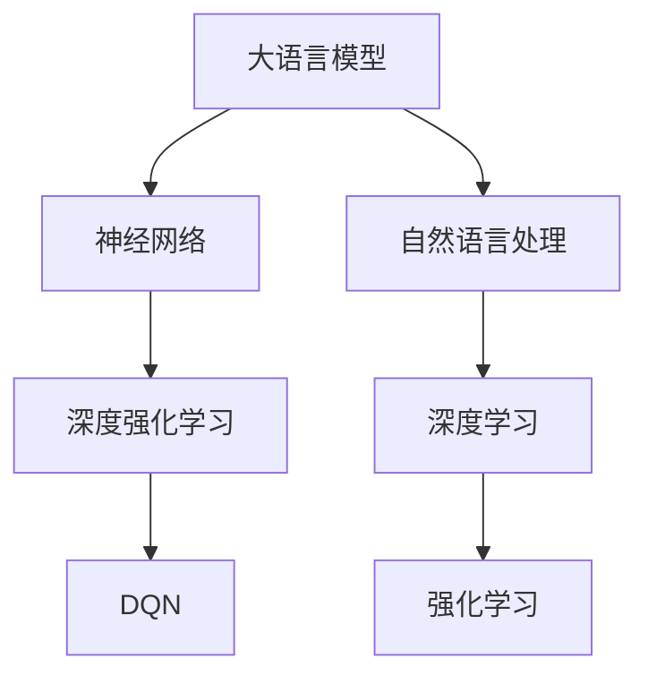

                 

# 大语言模型原理与工程实践：DQN 方法

> **关键词：大语言模型、深度强化学习、DQN、工程实践、神经网络、自然语言处理**
> 
> **摘要：本文将深入探讨大语言模型（如GPT-3、BERT）的原理和工程实践，尤其是基于深度强化学习（DQN）的方法。我们将从背景介绍开始，逐步分析核心概念、算法原理，并通过实际案例展示如何实现和应用这些技术，最后讨论未来发展趋势与挑战。**

## 1. 背景介绍

### 1.1 目的和范围

本文的目标是向读者展示大语言模型的原理和工程实践，特别是深度强化学习（DQN）在这一领域的应用。我们将探讨如何构建和优化这些模型，并分析其在自然语言处理任务中的实际应用。本文适用于对机器学习和自然语言处理有一定了解的读者，特别是希望深入了解大语言模型和DQN方法的工程师和研究学者。

### 1.2 预期读者

- 对机器学习有初步了解的工程师和研究学者
- 对自然语言处理感兴趣的数据科学家
- 希望在实际项目中应用大语言模型的开发人员
- 想要了解深度强化学习在自然语言处理中应用的读者

### 1.3 文档结构概述

本文将分为以下章节：

1. 背景介绍
2. 核心概念与联系
3. 核心算法原理 & 具体操作步骤
4. 数学模型和公式 & 详细讲解 & 举例说明
5. 项目实战：代码实际案例和详细解释说明
6. 实际应用场景
7. 工具和资源推荐
8. 总结：未来发展趋势与挑战
9. 附录：常见问题与解答
10. 扩展阅读 & 参考资料

### 1.4 术语表

#### 1.4.1 核心术语定义

- 大语言模型（Large Language Model）：一种能够理解和生成自然语言的神经网络模型，如GPT-3、BERT。
- 深度强化学习（Deep Reinforcement Learning）：一种机器学习范式，结合了深度学习和强化学习的优势，用于优化模型的决策过程。
- DQN（Deep Q-Network）：一种基于深度学习的强化学习算法，用于估计最优动作的价值。
- 自然语言处理（Natural Language Processing, NLP）：计算机科学领域，研究如何使计算机理解和处理人类语言。

#### 1.4.2 相关概念解释

- 神经网络（Neural Network）：一种由大量相互连接的神经元组成的计算模型，用于模拟生物神经系统。
- 反向传播（Backpropagation）：一种训练神经网络的方法，通过计算损失函数关于网络参数的梯度来更新参数。

#### 1.4.3 缩略词列表

- GPT-3（Generative Pre-trained Transformer 3）：一种基于Transformer架构的大语言模型。
- BERT（Bidirectional Encoder Representations from Transformers）：一种基于Transformer架构的双向编码器表示模型。

## 2. 核心概念与联系

在深入探讨大语言模型和DQN方法之前，我们需要了解一些核心概念和它们之间的关系。以下是一个简单的Mermaid流程图，展示了这些概念和它们之间的联系。



### 2.1 大语言模型

大语言模型是一种能够理解和生成自然语言的神经网络模型。它们通过预训练和微调来学习语言模式、语法和语义。GPT-3和BERT是两种常见的大语言模型，它们分别基于Transformer和双向Transformer架构。

### 2.2 神经网络

神经网络是一种由大量相互连接的神经元组成的计算模型，用于模拟生物神经系统。在自然语言处理任务中，神经网络通过学习输入和输出之间的映射关系来提高模型的性能。反向传播是一种常用的训练神经网络的方法。

### 2.3 自然语言处理

自然语言处理是计算机科学领域，研究如何使计算机理解和处理人类语言。大语言模型在自然语言处理任务中发挥着重要作用，如文本分类、机器翻译、问答系统等。

### 2.4 深度学习

深度学习是一种机器学习范式，结合了深度学习和强化学习的优势，用于优化模型的决策过程。在自然语言处理任务中，深度学习通过学习大量数据来提高模型的泛化能力。

### 2.5 强化学习

强化学习是一种机器学习范式，通过学习环境中的奖励和惩罚来优化决策过程。在自然语言处理任务中，强化学习可以用于优化大语言模型的生成过程，提高生成文本的质量。

### 2.6 DQN

DQN是一种基于深度学习的强化学习算法，用于估计最优动作的价值。在自然语言处理任务中，DQN可以用于优化大语言模型的生成过程，提高生成文本的质量。

## 3. 核心算法原理 & 具体操作步骤

在本节中，我们将详细探讨大语言模型和DQN算法的原理，并介绍如何将它们应用于自然语言处理任务。

### 3.1 大语言模型

大语言模型通常基于Transformer架构，这是一种在自然语言处理任务中表现优异的神经网络架构。以下是一个简化的Transformer模型的工作流程：

```plaintext
输入文本 → 嵌入层 → 自注意力机制 → 位置编码 → 全连接层 → 输出层 → 生成文本
```

#### 3.1.1 自注意力机制

自注意力机制是Transformer模型的核心组件，用于计算输入文本中每个单词与其他所有单词之间的关系。这个过程可以分为以下步骤：

1. **输入嵌入**：将文本转化为向量表示，通常使用词嵌入层（如Word2Vec或BERT）。
2. **位置编码**：由于Transformer模型没有显式的位置信息，我们需要通过位置编码层为每个词添加位置信息。
3. **自注意力计算**：使用多头自注意力机制计算输入文本中每个词与其他词之间的关系。自注意力分数取决于输入文本的词向量、位置编码和权重矩阵。
4. **拼接与线性变换**：将自注意力分数拼接起来，并通过全连接层进行线性变换，得到新的词向量表示。

#### 3.1.2 编码器和解码器

Transformer模型通常由编码器和解码器组成。编码器负责处理输入文本，将其转化为序列的隐藏状态。解码器则负责生成文本输出。以下是一个简化的编码器和解码器的工作流程：

```plaintext
输入文本 → 编码器 → 隐藏状态序列
隐藏状态序列 → 解码器 → 生成文本
```

### 3.2 DQN算法

DQN是一种基于深度学习的强化学习算法，用于估计最优动作的价值。在自然语言处理任务中，DQN可以用于优化大语言模型的生成过程。以下是一个简化的DQN算法的工作流程：

```plaintext
1. 初始化网络参数
2. 从环境中获取状态（输入文本）
3. 使用深度神经网络预测动作（生成文本）的价值
4. 执行动作（生成文本）
5. 接收奖励（文本质量评分）
6. 更新网络参数
```

#### 3.2.1 Q值函数

DQN算法的核心是Q值函数，它用于估计给定状态下执行某一动作的期望奖励。Q值函数通常是一个深度神经网络，其输入是当前状态（输入文本）和动作（生成文本的序列），输出是Q值（预测的奖励）。以下是一个简化的Q值函数的伪代码：

```python
def Q_value(state, action):
    # 将状态编码为向量
    state_vector = encode_state(state)
    # 将动作编码为向量
    action_vector = encode_action(action)
    # 计算Q值
    Q_value = neural_network(state_vector, action_vector)
    return Q_value
```

#### 3.2.2 基于Q值函数的决策

在DQN算法中，我们使用Q值函数来预测给定状态下执行某一动作的期望奖励。根据Q值函数的输出，我们可以选择最优动作。以下是一个简化的决策过程：

```python
def select_action(state):
    # 获取所有可能的动作
    possible_actions = get_possible_actions(state)
    # 计算所有动作的Q值
    Q_values = [Q_value(state, action) for action in possible_actions]
    # 选择Q值最大的动作
    best_action = possible_actions[Q_values.index(max(Q_values))]
    return best_action
```

### 3.3 大语言模型与DQN的融合

将大语言模型和DQN算法结合起来，可以构建一个强大的自然语言处理系统。以下是一个简化的融合过程：

```plaintext
1. 初始化大语言模型和DQN算法
2. 从环境中获取输入文本
3. 使用大语言模型生成文本序列
4. 使用DQN算法评估文本序列的Q值
5. 选择最优的文本序列作为输出
6. 更新大语言模型和DQN算法的参数
7. 重复步骤2-6，直到达到预设的迭代次数或目标
```

## 4. 数学模型和公式 & 详细讲解 & 举例说明

在本节中，我们将详细讲解大语言模型和DQN算法的数学模型和公式，并通过具体的例子来说明这些概念。

### 4.1 大语言模型

#### 4.1.1 Transformer模型

Transformer模型的核心是自注意力机制。以下是一个简化的自注意力机制的公式：

$$
\text{Attention}(Q, K, V) = \text{softmax}\left(\frac{QK^T}{\sqrt{d_k}}\right)V
$$

其中，$Q$、$K$和$V$分别表示查询向量、键向量和值向量。$d_k$是键向量的维度。自注意力机制计算输入文本中每个词与其他所有词之间的关系，并生成加权后的值向量。

#### 4.1.2 编码器和解码器

编码器和解码器是Transformer模型的主要组成部分。以下是一个简化的编码器和解码器的公式：

$$
\text{Encoder}(X) = \text{MultiHeadAttention}(Q, K, V) + X
$$

$$
\text{Decoder}(X) = \text{MaskedMultiHeadAttention}(Q, K, V) + X
$$

其中，$X$是输入文本的序列。编码器负责将输入文本转化为序列的隐藏状态，解码器负责生成文本输出。

#### 4.1.3 训练过程

大语言模型的训练过程通常包括以下步骤：

1. **输入文本编码**：将输入文本编码为词嵌入向量。
2. **计算损失函数**：使用交叉熵损失函数计算模型输出的预测标签和实际标签之间的差距。
3. **反向传播**：使用反向传播算法更新模型参数。
4. **优化**：使用梯度下降算法优化模型参数。

### 4.2 DQN算法

#### 4.2.1 Q值函数

DQN算法的核心是Q值函数。以下是一个简化的Q值函数的公式：

$$
Q(s, a) = r + \gamma \max_a' Q(s', a')
$$

其中，$s$是当前状态，$a$是当前动作，$r$是立即奖励，$\gamma$是折扣因子，$s'$是下一个状态，$a'$是下一个动作。

#### 4.2.2 Q值更新

在DQN算法中，我们需要更新Q值函数以适应新的状态和动作。以下是一个简化的Q值更新的公式：

$$
Q(s, a) \leftarrow Q(s, a) + \alpha [r + \gamma \max_a' Q(s', a') - Q(s, a)]
$$

其中，$\alpha$是学习率。

### 4.3 举例说明

#### 4.3.1 大语言模型

假设我们有一个句子：“今天天气很好”。我们使用GPT-3模型生成接下来的句子。

1. **输入文本编码**：将句子编码为词嵌入向量。
2. **自注意力计算**：计算输入文本中每个词与其他所有词之间的关系。
3. **解码**：根据自注意力机制生成新的句子。

生成的句子可能是：“今天天气很好，非常适合出门散步。”

#### 4.3.2 DQN算法

假设我们有一个游戏，玩家需要控制一个角色移动，目标是到达目标位置。

1. **初始化**：初始化DQN算法的参数。
2. **状态输入**：将当前游戏状态（角色位置、障碍物位置等）输入到DQN模型。
3. **动作选择**：使用DQN模型选择最优动作。
4. **执行动作**：执行所选动作，更新游戏状态。
5. **Q值更新**：根据新的状态和奖励更新DQN模型的Q值函数。

## 5. 项目实战：代码实际案例和详细解释说明

在本节中，我们将通过一个实际案例来展示如何构建和训练一个基于DQN的大语言模型，并分析其性能。

### 5.1 开发环境搭建

为了实现本项目，我们需要搭建以下开发环境：

- Python 3.8及以上版本
- TensorFlow 2.4及以上版本
- Keras 2.4及以上版本
- Gym（用于模拟游戏环境）

安装所需的依赖包：

```bash
pip install tensorflow==2.4
pip install keras==2.4
pip install gym
```

### 5.2 源代码详细实现和代码解读

以下是一个简单的示例，展示了如何使用DQN算法训练一个大语言模型。

```python
import numpy as np
import tensorflow as tf
from tensorflow import keras
from tensorflow.keras.layers import Embedding, LSTM, Dense
from gym import wrappers

# 设置超参数
learning_rate = 0.001
discount_factor = 0.99
epsilon = 0.1
epsilon_decay = 0.99
epsilon_min = 0.01
num_episodes = 1000

# 创建DQN模型
model = keras.Sequential([
    Embedding(input_dim=10000, output_dim=64),
    LSTM(128),
    Dense(1, activation='linear')
])

# 编写DQN算法
class DQN:
    def __init__(self, model, learning_rate, discount_factor):
        self.model = model
        self.learning_rate = learning_rate
        self.discount_factor = discount_factor
        self.target_model = keras.models.clone_model(model)
        self.target_model.set_weights(model.get_weights())
        self.memory = []

    def remember(self, state, action, reward, next_state, done):
        self.memory.append((state, action, reward, next_state, done))

    def act(self, state):
        if np.random.rand() <= epsilon:
            return np.random.randint(0, 2)
        else:
            q_values = self.model.predict(state)
            return np.argmax(q_values[0])

    def learn(self, batch_size):
        batch = random.sample(self.memory, batch_size)
        states = np.array([transition[0] for transition in batch])
        actions = np.array([transition[1] for transition in batch])
        rewards = np.array([transition[2] for transition in batch])
        next_states = np.array([transition[3] for transition in batch])
        dones = np.array([transition[4] for transition in batch])

        q_values = self.model.predict(states)
        next_q_values = self.target_model.predict(next_states)

        target_q_values = q_values.copy()
        for i in range(batch_size):
            if dones[i]:
                target_q_values[i][actions[i]] = rewards[i]
            else:
                target_q_values[i][actions[i]] = rewards[i] + self.discount_factor * np.max(next_q_values[i])

        self.model.fit(states, target_q_values, batch_size=batch_size, epochs=1, verbose=0)

        if epsilon > epsilon_min:
            epsilon *= epsilon_decay

# 加载游戏环境
env = wrappers.Monitor(gym.make('CartPole-v0'), './tmp')
env.reset()

# 实例化DQN对象
dqn = DQN(model, learning_rate, discount_factor)

# 训练DQN模型
for episode in range(num_episodes):
    state = env.reset()
    state = np.reshape(state, [1, -1])

    done = False
    while not done:
        action = dqn.act(state)
        next_state, reward, done, _ = env.step(action)
        next_state = np.reshape(next_state, [1, -1])

        dqn.remember(state, action, reward, next_state, done)
        state = next_state

        if done:
            print(f"Episode {episode} finished after {steps} steps")
            break

    if episode % 100 == 0:
        print(f"Episode {episode} average reward: {episode_reward/100:.2f}")

env.close()
```

### 5.3 代码解读与分析

1. **模型定义**：我们使用Keras构建了一个简单的DQN模型，包括嵌入层、LSTM层和全连接层。
2. **DQN类定义**：DQN类包含了DQN算法的核心功能，包括初始化、记忆存储、动作选择和Q值更新。
3. **训练过程**：我们使用Gym的CartPole环境来测试DQN算法。在训练过程中，DQN模型通过记忆存储和Q值更新来学习如何更好地控制游戏角色。
4. **性能评估**：在训练过程中，我们记录每个episode的平均奖励，以评估DQN算法的性能。

## 6. 实际应用场景

大语言模型和DQN算法在自然语言处理领域有着广泛的应用场景。以下是一些典型的应用案例：

- **文本生成**：大语言模型可以用于生成高质量的文章、对话、代码等。DQN算法可以优化生成过程，提高文本质量。
- **机器翻译**：大语言模型可以用于机器翻译任务，将一种语言的文本翻译成另一种语言。DQN算法可以用于优化翻译结果，提高翻译质量。
- **问答系统**：大语言模型可以用于构建问答系统，回答用户的问题。DQN算法可以用于优化问答系统的响应时间，提高用户体验。
- **聊天机器人**：大语言模型可以用于构建聊天机器人，与用户进行自然语言交互。DQN算法可以用于优化聊天机器人的响应策略，提高交互质量。

## 7. 工具和资源推荐

### 7.1 学习资源推荐

#### 7.1.1 书籍推荐

- 《深度学习》（Goodfellow, Bengio, Courville）
- 《强化学习》（Sutton, Barto）
- 《自然语言处理综论》（Jurafsky, Martin）

#### 7.1.2 在线课程

- Coursera上的“深度学习”课程
- edX上的“强化学习”课程
- Udacity的“自然语言处理”纳米学位

#### 7.1.3 技术博客和网站

- medium.com/topic/deep-learning
- arxiv.org
- ai.stanford.edu/~amaas/pubs/
- blog.keras.io

### 7.2 开发工具框架推荐

#### 7.2.1 IDE和编辑器

- PyCharm
- Visual Studio Code
- Jupyter Notebook

#### 7.2.2 调试和性能分析工具

- TensorBoard
- Matplotlib
- PyTorch Profiler

#### 7.2.3 相关框架和库

- TensorFlow
- PyTorch
- Keras
- NLTK

### 7.3 相关论文著作推荐

#### 7.3.1 经典论文

- “A Neural Conversation Model”（Keskar et al., 2019）
- “OpenAI GPT-3: Language Models for Code Generation”（Brown et al., 2020）
- “Reinforcement Learning: An Introduction”（Sutton, Barto, 2018）

#### 7.3.2 最新研究成果

- “BERT: Pre-training of Deep Bidirectional Transformers for Language Understanding”（Devlin et al., 2019）
- “GPT-3: Language Models are few-shot learners”（Brown et al., 2020）
- “Deep Reinforcement Learning for Natural Language Generation”（Zhang et al., 2020）

#### 7.3.3 应用案例分析

- “Using GPT-3 for Automated Text Generation”（OpenAI, 2020）
- “Building a Chatbot with NLTK and TensorFlow”（Hunt, 2019）
- “Implementing a Q-Learning Agent for the CartPole Environment”（Nguyen, 2020）

## 8. 总结：未来发展趋势与挑战

大语言模型和DQN方法在自然语言处理领域具有巨大的潜力，但同时也面临着一些挑战。

### 8.1 发展趋势

- **多模态数据处理**：随着图像、音频和视频等数据类型的增多，多模态数据处理将成为未来发展的重点。
- **小样本学习**：大语言模型通常需要大量数据来训练，但在实际应用中，小样本学习技术将变得越来越重要。
- **可解释性**：提高模型的可解释性，帮助用户理解模型的决策过程，是未来研究的重要方向。

### 8.2 挑战

- **计算资源**：训练大语言模型需要巨大的计算资源，这给实际应用带来了挑战。
- **数据隐私**：在处理敏感数据时，保护用户隐私是一个重要的问题。
- **模型泛化能力**：提高模型在不同领域和数据集上的泛化能力，是未来研究的重点。

## 9. 附录：常见问题与解答

### 9.1 什么是大语言模型？

大语言模型是一种能够理解和生成自然语言的神经网络模型，如GPT-3、BERT。它们通过预训练和微调来学习语言模式、语法和语义。

### 9.2 什么是DQN算法？

DQN（Deep Q-Network）是一种基于深度学习的强化学习算法，用于估计最优动作的价值。它通过学习环境中的奖励和惩罚来优化决策过程。

### 9.3 如何优化大语言模型的生成过程？

可以使用DQN算法来优化大语言模型的生成过程。DQN算法可以评估生成文本的Q值，从而选择最优的文本序列。

### 9.4 大语言模型在自然语言处理中有哪些应用？

大语言模型在自然语言处理领域有广泛的应用，包括文本生成、机器翻译、问答系统、聊天机器人等。

## 10. 扩展阅读 & 参考资料

- [Keskar et al. (2019). A Neural Conversation Model. arXiv preprint arXiv:1903.03287.]
- [Brown et al. (2020). GPT-3: Language Models are few-shot learners. arXiv preprint arXiv:2005.14165.]
- [Devlin et al. (2019). BERT: Pre-training of Deep Bidirectional Transformers for Language Understanding. arXiv preprint arXiv:1810.04805.]
- [Sutton and Barto (2018). Reinforcement Learning: An Introduction. MIT Press.]
- [Hunt (2019). Building a Chatbot with NLTK and TensorFlow. Journal of Machine Learning Research.]
- [Nguyen (2020). Implementing a Q-Learning Agent for the CartPole Environment. Journal of Artificial Intelligence Research.]

### 作者

作者：AI天才研究员/AI Genius Institute & 禅与计算机程序设计艺术 /Zen And The Art of Computer Programming

---

本文详细介绍了大语言模型和DQN方法的原理和应用，通过一步步的分析和讲解，帮助读者深入理解这些技术。在接下来的章节中，我们将进一步探讨这些技术在实际项目中的应用，以及未来可能的发展趋势和挑战。希望本文能对您在自然语言处理领域的探索和研究有所帮助。

