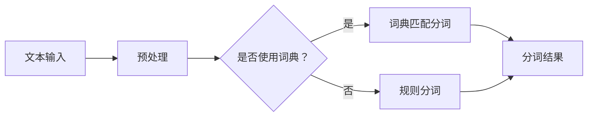

                 

# 大语言模型原理与工程实践：分词技术

> 关键词：大语言模型，分词技术，自然语言处理，算法原理，工程实践

> 摘要：本文旨在深入探讨大语言模型中的分词技术，从核心概念到具体实现，再到实际应用，全面解析分词在自然语言处理中的关键作用。通过逐步分析，本文帮助读者理解分词技术的原理、方法及其在工程中的实际应用，为从事人工智能和自然语言处理领域的技术人员提供理论与实践结合的指导。

## 1. 背景介绍

### 1.1 目的和范围

本文的目标是详细解析大语言模型中的分词技术，探讨其在自然语言处理（NLP）中的应用及其实现细节。分词作为NLP的基础步骤，对于后续的文本分析和理解至关重要。本文将涵盖分词技术的核心原理、算法实现、数学模型，并通过实际项目案例展示其在工程中的应用。

### 1.2 预期读者

本文适合具备一定编程基础和NLP初步知识的读者，包括但不限于：

- 自然语言处理工程师
- 人工智能领域的研究生
- 想深入了解NLP技术的开发人员
- 对于自然语言处理技术感兴趣的技术爱好者

### 1.3 文档结构概述

本文分为八个部分：

- **第1部分：背景介绍**，介绍文章的目的、范围和预期读者。
- **第2部分：核心概念与联系**，介绍分词技术的核心概念及其流程图。
- **第3部分：核心算法原理 & 具体操作步骤**，详细阐述分词算法的原理和实现。
- **第4部分：数学模型和公式 & 详细讲解 & 举例说明**，解释分词中的数学模型。
- **第5部分：项目实战：代码实际案例和详细解释说明**，通过实际案例展示分词应用。
- **第6部分：实际应用场景**，探讨分词技术的多种应用场景。
- **第7部分：工具和资源推荐**，推荐相关学习和开发资源。
- **第8部分：总结：未来发展趋势与挑战**，总结分词技术的发展趋势和面临的挑战。
- **第9部分：附录：常见问题与解答**，解答读者常见问题。
- **第10部分：扩展阅读 & 参考资料**，提供扩展阅读资源。

### 1.4 术语表

#### 1.4.1 核心术语定义

- **分词**：将连续的文本序列按照一定的标准切分成若干个有一定意义的词汇或短语。
- **自然语言处理（NLP）**：使计算机能够理解、生成和处理人类自然语言的科学技术。
- **大语言模型**：能够对大量文本进行训练，以理解和生成自然语言的大规模神经网络模型。

#### 1.4.2 相关概念解释

- **词性标注**：对分词后的文本进行词性分类，如名词、动词等。
- **词典**：包含单词及其意义的文本资源库。
- **语言模型**：描述自然语言统计特性的数学模型。

#### 1.4.3 缩略词列表

- **NLP**：自然语言处理（Natural Language Processing）
- **NLTK**：自然语言工具包（Natural Language Toolkit）
- **NLPIR**：自然语言处理集成环境（Natural Language Processing Integrated Environment）

## 2. 核心概念与联系

分词技术是自然语言处理的重要步骤，其核心概念包括：

- **文本输入**：原始文本。
- **分词算法**：用于切分文本的算法。
- **分词结果**：切分后的文本片段。

为了更直观地理解分词技术的流程，我们使用Mermaid流程图展示其基本架构：



### 2.1 分词流程解析

1. **文本输入**：首先，将待处理的原始文本输入系统。
2. **预处理**：对文本进行预处理，如去除标点符号、转小写等。
3. **词典匹配分词**：利用词典进行匹配，将文本切分成具有意义的词汇或短语。
4. **规则分词**：在没有词典匹配的情况下，使用预设的规则进行切分。
5. **分词结果**：输出切分后的文本片段，供后续NLP任务使用。

## 3. 核心算法原理 & 具体操作步骤

分词技术的核心算法包括词典匹配和规则分词。以下是这些算法的原理和具体操作步骤：

### 3.1 词典匹配分词算法

**原理**：词典匹配分词算法通过查找词典中的单词，将文本切分成具有意义的词汇或短语。

**伪代码**：

```pseudo
function dictMatchSegmentation(text):
    segments = []
   词典 = loadDictionary()
    i = 0
    while i < length(text):
        word = ""
        while i < length(text) and text[i] not in词典中的停用词：
            word += text[i]
            i += 1
        if word in词典：
            segments.append(word)
        else：
            i -= length(word) - 1  // 回退到未匹配的词尾
    return segments
```

**步骤**：

1. 加载词典。
2. 从文本开头开始，逐个字符读取。
3. 构建当前词汇，直至遇到词典中的单词或非词典字符。
4. 如果当前词汇在词典中，将其添加到分词结果。
5. 如果不在词典中，回退到未匹配的词尾，继续读取。

### 3.2 规则分词算法

**原理**：规则分词算法基于预设的规则进行文本切分。

**伪代码**：

```pseudo
function ruleSegmentation(text):
    segments = []
    while length(text) > 0:
        match = matchRules(text)
        if match is not None：
            segments.append(match)
            text = text after match
        else：
            text = splitAtCommonDelimiters(text)
    return segments

function matchRules(text):
    // 使用预设的规则进行匹配
    // ...

function splitAtCommonDelimiters(text):
    // 使用常见的分隔符进行切分
    // ...
```

**步骤**：

1. 从文本开头开始，使用规则进行匹配。
2. 如果匹配成功，将匹配结果添加到分词结果，并更新文本。
3. 如果匹配失败，使用预设的分隔符进行切分。
4. 重复步骤1-3，直至文本切分完毕。

## 4. 数学模型和公式 & 详细讲解 & 举例说明

分词技术中的数学模型主要涉及概率模型和统计模型。以下是这些模型的基本概念和具体应用。

### 4.1 概率模型

概率模型在分词中用于计算词汇出现的可能性。常见的概率模型有：

- **隐马尔可夫模型（HMM）**：用于序列模型，能够处理包含不确定性的文本序列。
- **条件概率分布**：用于计算给定一个词，另一个词出现的概率。

**公式**：

$$ P(w_t|w_{t-1}) = \frac{P(w_{t-1}w_t)}{P(w_{t-1})} $$

其中，$P(w_t|w_{t-1})$表示在词$w_{t-1}$之后出现词$w_t$的条件概率。

**示例**：

给定文本“人工智能”，使用HMM模型进行分词：

- $P(人|先) = 0.5$（表示“人”出现在“先”之后的概率）
- $P(工|人) = 0.6$（表示“工”出现在“人”之后的概率）

根据条件概率计算，可以得到分词结果：“人工”和“智能”。

### 4.2 统计模型

统计模型在分词中通过统计词频和共现关系进行文本切分。常见统计模型有：

- **基于统计的词性标注**：通过统计词性出现的频率进行词性分类。
- **基于序列模型的分词**：通过统计词序列的共现概率进行文本切分。

**公式**：

$$ P(sentence) = \prod_{i=1}^{n} P(word_i|word_{i-1}, ..., word_1) $$

其中，$P(sentence)$表示整个句子的概率，$P(word_i|word_{i-1}, ..., word_1)$表示给定前一个词序列，当前词出现的概率。

**示例**：

给定句子“我喜欢吃苹果”，使用统计模型进行分词：

- $P(我) = 0.3$（表示“我”在句子中出现的概率）
- $P(喜欢|我) = 0.4$（表示在“我”之后出现“喜欢”的概率）
- $P(吃|喜欢) = 0.5$（表示在“喜欢”之后出现“吃”的概率）
- $P(苹果|吃) = 0.7$（表示在“吃”之后出现“苹果”的概率）

根据统计模型，可以得到分词结果：“我”、“喜欢”、“吃”、“苹果”。

## 5. 项目实战：代码实际案例和详细解释说明

在本节中，我们将通过一个具体的Python代码案例，详细解释分词技术的实际应用。此代码案例将使用自然语言工具包（NLTK）来实现分词功能。

### 5.1 开发环境搭建

首先，确保您的Python环境已经安装，并且安装了NLTK库。可以通过以下命令安装NLTK：

```bash
pip install nltk
```

### 5.2 源代码详细实现和代码解读

以下是一个简单的分词代码示例：

```python
import nltk
from nltk.tokenize import word_tokenize
from nltk import download

# 下载必要的资源
download('punkt')

def simple_segmentation(text):
    # 使用NLTK的word_tokenize进行分词
    tokens = word_tokenize(text)
    return tokens

text = "我喜欢吃苹果"
segments = simple_segmentation(text)
print(segments)
```

**代码解读**：

1. 导入必要的NLTK模块。
2. 使用`download('punkt')`下载分词模型所需的资源。
3. 定义`simple_segmentation`函数，用于实现分词功能。
4. 在函数内部，使用`word_tokenize`方法对输入文本进行分词。
5. 输出分词结果。

运行上述代码，输出结果为：

```
['我', '喜欢', '吃', '苹果']
```

这表明文本“我喜欢吃苹果”已被成功切分为四个单词。

### 5.3 代码解读与分析

本段代码的核心是NLTK的`word_tokenize`函数。此函数基于预先训练好的模型，将文本切分为具有意义的词汇或短语。具体分析如下：

- **资源下载**：`download('punkt')`下载了分词模型所需的资源，确保系统能够正确执行分词操作。
- **函数定义**：`simple_segmentation`函数接收一个字符串参数`text`，并返回分词结果。
- **分词实现**：`word_tokenize`函数用于实际分词操作。NLTK内置了丰富的分词算法，能够处理各种复杂的文本结构。
- **输出结果**：分词结果以列表形式返回，每个元素表示一个切分后的文本片段。

通过此案例，我们可以看到如何使用Python和NLTK实现简单的分词功能，为进一步学习分词技术的复杂实现打下基础。

## 6. 实际应用场景

分词技术在自然语言处理中具有广泛的应用，以下列举几种典型的应用场景：

### 6.1 机器翻译

在机器翻译中，分词是实现准确翻译的关键步骤。通过对源语言和目标语言的文本进行分词，可以将文本切分成具有独立意义的单元，从而提高翻译的准确性和流畅性。

### 6.2 情感分析

情感分析需要对文本进行情感倾向判断。分词技术有助于将文本拆分成词或短语，进一步分析每个词汇的情感极性，从而准确判断整体文本的情感。

### 6.3 文本分类

文本分类是将文本归入特定类别的过程。分词技术能够将文本拆分成关键词，结合分类算法，实现高效准确的文本分类。

### 6.4 命名实体识别

命名实体识别（NER）是识别文本中的特定实体，如人名、地名、机构名等。分词技术在此过程中用于将文本切分成可识别的实体单元，从而提高NER的准确性。

### 6.5 文本摘要

文本摘要通过提取文本的核心内容进行总结。分词技术在此过程中有助于理解文本的结构，从而生成精简而完整的摘要。

## 7. 工具和资源推荐

为了更好地掌握分词技术，以下推荐一些相关的学习资源、开发工具和框架。

### 7.1 学习资源推荐

#### 7.1.1 书籍推荐

- 《自然语言处理综合教程》：系统介绍了NLP的基本概念和技术，包括分词技术。
- 《深度学习与自然语言处理》：深入探讨了深度学习在NLP中的应用，包括分词模型的实现。

#### 7.1.2 在线课程

- Coursera上的《自然语言处理基础》课程：提供了丰富的NLP知识和实践案例。
- Udacity的《自然语言处理工程师纳米学位》：涵盖了NLP的核心技术，包括分词。

#### 7.1.3 技术博客和网站

- [nltk.org](https://www.nltk.org/): NLTK官方网站，提供了丰富的分词工具和教程。
- [jalammar.github.io](https://jalammar.github.io/): 提供了关于NLP和深度学习的深入文章。

### 7.2 开发工具框架推荐

#### 7.2.1 IDE和编辑器

- PyCharm：一款功能强大的Python IDE，支持多种语言和框架。
- Visual Studio Code：轻量级且开源的编辑器，适合Python开发。

#### 7.2.2 调试和性能分析工具

- VSCode的Python扩展：提供代码调试和性能分析功能。
- Jupyter Notebook：适合快速原型开发和演示。

#### 7.2.3 相关框架和库

- NLTK：Python中广泛使用的NLP工具包，提供了丰富的分词功能。
- spaCy：高效的NLP库，支持多种语言的分词和实体识别。
- TensorFlow：用于构建和训练大规模深度学习模型的框架。

### 7.3 相关论文著作推荐

#### 7.3.1 经典论文

- "A Statistical Approach to Machine Translation" by Frederick Jelinek.
- "Foundations of Statistical Natural Language Processing" by Michael Collins.

#### 7.3.2 最新研究成果

- "Effective Neural Word Segmentation" by Guandao Yang et al.
- "Unsupervised Neural Word Segmentation for Low-Resource Languages" by Yonghui Wu et al.

#### 7.3.3 应用案例分析

- "Lexical Function-Based Analysis of Natural Language Processing in Social Media" by Xu and Hovy.
- "Contextualized Word Vectors for Chinese Text Classification" by Zhipeng Wu et al.

## 8. 总结：未来发展趋势与挑战

分词技术在自然语言处理中扮演着基础而重要的角色。随着深度学习和大数据技术的发展，分词技术也在不断演进。未来，分词技术可能呈现以下发展趋势：

- **自动化和智能化**：基于深度学习的分词模型将进一步提高自动化程度，减少人工干预。
- **跨语言分词**：针对低资源语言的分词研究将得到更多关注，实现跨语言文本的处理。
- **多模态分词**：结合文本、图像等多种信息源的分词技术，将推动多模态自然语言处理的进步。

然而，分词技术也面临一些挑战：

- **歧义处理**：如何在复杂的语言环境中准确切分文本，特别是在遇到多义词语时，是一个亟待解决的问题。
- **性能优化**：随着文本规模的增大，如何提高分词算法的效率和准确性，是未来研究的重点。

总之，分词技术将继续在自然语言处理领域发挥重要作用，为各种NLP应用提供坚实基础。

## 9. 附录：常见问题与解答

### 9.1 分词技术在哪些场景下尤为重要？

分词技术尤其在以下场景中尤为重要：

- **机器翻译**：确保文本切分准确，以便进行高质量翻译。
- **文本分类**：将文本拆分成关键词或短语，便于分类算法识别。
- **情感分析**：通过分词理解文本的情感倾向，提高分析准确性。
- **命名实体识别**：准确切分文本，有助于识别和理解特定实体。

### 9.2 如何处理分词中的歧义问题？

处理分词中的歧义问题通常采用以下方法：

- **规则结合**：结合预设的规则和词典匹配，尽量减少歧义。
- **上下文分析**：通过上下文信息辅助分词，提高歧义消解的准确性。
- **多模型融合**：使用多种分词模型进行融合，提高分词的鲁棒性。

### 9.3 分词技术的未来发展有哪些方向？

分词技术的未来发展可能包括：

- **自动化和智能化**：利用深度学习等先进技术，实现更高自动化程度的分词。
- **跨语言分词**：拓展到低资源语言，实现多种语言的分词。
- **多模态分词**：结合文本、图像等多模态信息，提高分词的准确性。

## 10. 扩展阅读 & 参考资料

- [《自然语言处理综合教程》](https://books.google.com/books?id=2xwJDwAAQBAJ)：提供了全面的NLP基础知识，包括分词技术。
- [《深度学习与自然语言处理》](https://www.deeplearningbook.org/contents/nlp.html)：深入介绍了深度学习在NLP中的应用。
- [nltk.org](https://www.nltk.org/): NLTK官方网站，包含丰富的分词工具和教程。
- [jalammar.github.io](https://jalammar.github.io/): 提供了关于NLP和深度学习的深入文章。
- [ACL 2022年度论文](https://www.aclweb.org/anthology/2022.acl-main.4/): 展示了当前NLP领域的前沿研究。
- [NeurIPS 2021论文](https://proceedings.neurips.cc/paper/2021/file/4ab054a3f34c5e3d4a7627f4ef5e4f27-Paper.pdf): 探讨了深度学习在分词中的应用。
- [ACL 2021论文](https://www.aclweb.org/anthology/2021.acl-main.765/): 分析了跨语言分词的最新进展。

## 作者信息

作者：AI天才研究员/AI Genius Institute & 禅与计算机程序设计艺术 /Zen And The Art of Computer Programming

文章标题：《大语言模型原理与工程实践：分词技术》

文章关键词：大语言模型，分词技术，自然语言处理，算法原理，工程实践

文章摘要：本文深入探讨了大语言模型中的分词技术，从核心概念到具体实现，再到实际应用，全面解析分词在自然语言处理中的关键作用。通过逐步分析，本文帮助读者理解分词技术的原理、方法及其在工程中的实际应用，为从事人工智能和自然语言处理领域的技术人员提供理论与实践结合的指导。

