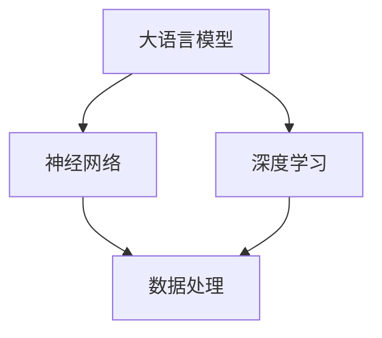
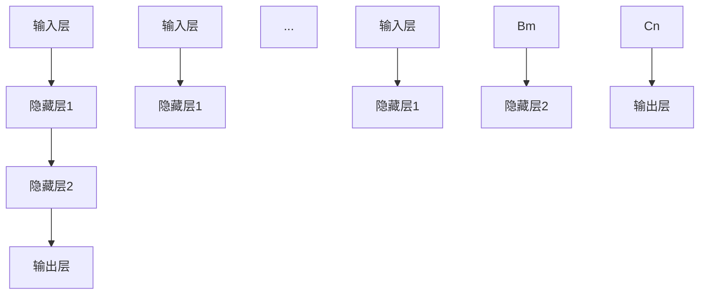

                 

# 大语言模型原理与工程实践：动态交互

> **关键词：** 大语言模型，工程实践，动态交互，神经网络，深度学习，数据处理，编程技巧

> **摘要：** 本文将深入探讨大语言模型的原理及其工程实践中的动态交互机制。通过逐步分析，本文旨在为读者提供一个全面而清晰的了解，涵盖从基本概念到实际应用的全方位内容。读者将学习到如何构建和优化大语言模型，掌握其在不同场景下的动态交互技术，并了解未来的发展趋势和挑战。

## 1. 背景介绍

### 1.1 目的和范围

本文的目的是探讨大语言模型在工程实践中的动态交互机制。我们将从基础概念出发，逐步深入探讨神经网络和深度学习在大语言模型中的应用，并详细讲解其构建和优化过程。此外，本文还将探讨大语言模型在不同应用场景中的动态交互技术，并展望其未来的发展趋势和面临的挑战。

### 1.2 预期读者

本文适合对人工智能和深度学习有一定了解的读者，包括但不限于程序员、软件工程师、数据科学家和AI研究人员。无论您是初学者还是有一定经验的专业人士，本文都将为您提供一个系统、全面的指导。

### 1.3 文档结构概述

本文分为以下主要章节：

1. 背景介绍
   - 目的和范围
   - 预期读者
   - 文档结构概述
   - 术语表
2. 核心概念与联系
   - 大语言模型的基本概念
   - 相关概念解释
   - Mermaid 流程图
3. 核心算法原理 & 具体操作步骤
   - 神经网络架构
   - 深度学习算法
   - 伪代码讲解
4. 数学模型和公式 & 详细讲解 & 举例说明
   - 激活函数
   - 损失函数
   - 数学公式和示例
5. 项目实战：代码实际案例和详细解释说明
   - 开发环境搭建
   - 源代码详细实现
   - 代码解读与分析
6. 实际应用场景
   - 自然语言处理
   - 自动问答系统
   - 语言翻译
7. 工具和资源推荐
   - 学习资源
   - 开发工具框架
   - 相关论文著作
8. 总结：未来发展趋势与挑战
9. 附录：常见问题与解答
10. 扩展阅读 & 参考资料

### 1.4 术语表

#### 1.4.1 核心术语定义

- **大语言模型（Large Language Model）**：一种基于神经网络和深度学习技术的自然语言处理模型，能够对文本进行理解和生成。
- **神经网络（Neural Network）**：一种模拟生物神经系统的计算模型，由大量相互连接的节点（或神经元）组成，用于处理和分析数据。
- **深度学习（Deep Learning）**：一种基于神经网络的机器学习技术，通过多层神经网络进行特征学习和模式识别。
- **动态交互（Dynamic Interaction）**：指大语言模型在应用过程中与外部环境的实时交互，包括输入数据的动态调整和输出结果的动态更新。

#### 1.4.2 相关概念解释

- **数据处理（Data Processing）**：指对输入数据进行的各种操作，包括数据清洗、数据转换、数据存储等，以提高数据的质量和可用性。
- **编程技巧（Programming Skills）**：指编程过程中使用的一些技巧和方法，包括代码优化、算法选择、框架使用等，以提高代码的可读性、可维护性和性能。

#### 1.4.3 缩略词列表

- **NLP**：自然语言处理（Natural Language Processing）
- **ML**：机器学习（Machine Learning）
- **DL**：深度学习（Deep Learning）
- **AI**：人工智能（Artificial Intelligence）
- **GPU**：图形处理单元（Graphics Processing Unit）

## 2. 核心概念与联系

在深入探讨大语言模型之前，我们需要了解一些核心概念和它们之间的联系。以下是一个简单的 Mermaid 流程图，用于展示这些概念之间的关系。



### 2.1 大语言模型的基本概念

大语言模型是一种基于神经网络和深度学习技术的自然语言处理模型。它能够对文本进行理解和生成，广泛应用于自然语言处理、自动问答系统、语言翻译等领域。大语言模型的核心思想是通过大量训练数据来学习语言模式，从而实现文本的理解和生成。

### 2.2 相关概念解释

- **神经网络（Neural Network）**：神经网络是一种模拟生物神经系统的计算模型，由大量相互连接的节点（或神经元）组成。每个神经元接收输入信号，通过加权求和和激活函数产生输出。神经网络通过层次结构对输入数据进行特征学习和模式识别。

- **深度学习（Deep Learning）**：深度学习是一种基于神经网络的机器学习技术，通过多层神经网络进行特征学习和模式识别。深度学习在图像识别、语音识别、自然语言处理等领域取得了显著的成果。

- **数据处理（Data Processing）**：数据处理是对输入数据进行的各种操作，包括数据清洗、数据转换、数据存储等。数据处理是构建和训练大语言模型的重要环节，旨在提高数据的质量和可用性。

### 2.3 Mermaid 流程图

以下是一个简单的 Mermaid 流程图，展示了大语言模型、神经网络、深度学习和数据处理之间的关系。


通过这个流程图，我们可以清晰地看到各个概念之间的联系。大语言模型基于神经网络和深度学习技术，通过数据处理获得高质量的输入数据，进而实现文本的理解和生成。

## 3. 核心算法原理 & 具体操作步骤

### 3.1 神经网络架构

神经网络是构建大语言模型的基础。一个基本的神经网络包括输入层、隐藏层和输出层。每个层由多个神经元组成，神经元之间通过加权连接相互连接。以下是神经网络的基本架构：



在这个架构中，输入层接收外部输入数据，隐藏层对输入数据进行特征学习和模式识别，输出层产生最终的输出结果。

### 3.2 深度学习算法

深度学习算法是通过多层神经网络进行特征学习和模式识别的过程。深度学习算法的核心是前向传播和反向传播。

#### 前向传播

前向传播是指将输入数据通过神经网络逐层传递，直到输出层的输出。在前向传播过程中，每个神经元接收前一层神经元的输出，通过加权求和和激活函数产生输出。以下是前向传播的伪代码：

```python
# 前向传播
for layer in neural_network.layers:
    layer.input = layer.prev_output
    layer.output = activation_function(np.dot(layer.input, layer.weights) + layer.bias)
```

#### 反向传播

反向传播是指根据输出结果与实际目标之间的差异，反向更新神经网络的权重和偏置。反向传播是深度学习算法的核心，用于优化神经网络模型。以下是反向传播的伪代码：

```python
# 反向传播
for layer in neural_network.layers[::-1]:
    layer.delta = (layer.output - layer.target) * activation_derivative(layer.output)
    layer.weight_gradient = np.dot(layer.delta, layer.input.T)
    layer.bias_gradient = np.sum(layer.delta)
    layer.weights -= learning_rate * layer.weight_gradient
    layer.biases -= learning_rate * layer.bias_gradient
```

### 3.3 动态交互技术

动态交互技术是指大语言模型在应用过程中与外部环境的实时交互。动态交互技术包括输入数据的动态调整和输出结果的动态更新。

#### 输入数据的动态调整

输入数据的动态调整是指根据应用场景和用户需求，实时调整输入数据的特征和格式。例如，在自然语言处理场景中，可以根据用户输入的文本内容，动态调整文本的语义和语法特征。

#### 输出结果的动态更新

输出结果的动态更新是指根据输入数据的动态调整，实时更新输出结果。例如，在自动问答系统场景中，可以根据用户输入的问题，实时更新答案。

### 3.4 编程技巧

在构建和优化大语言模型时，编程技巧至关重要。以下是一些常用的编程技巧：

- **代码优化**：通过优化代码结构、减少冗余代码和提高代码可读性，提高代码的执行效率和可维护性。
- **算法选择**：根据应用场景和需求，选择适合的算法和模型，以提高模型的性能和效果。
- **框架使用**：使用成熟的深度学习框架，如 TensorFlow、PyTorch 等，简化模型构建和优化过程。

## 4. 数学模型和公式 & 详细讲解 & 举例说明

### 4.1 激活函数

激活函数是神经网络中用于引入非线性特性的函数。常见的激活函数包括 sigmoid、ReLU 和 tanh 等。以下是这些激活函数的数学公式：

#### Sigmoid 函数

$$
\sigma(x) = \frac{1}{1 + e^{-x}}
$$

#### ReLU 函数

$$
\text{ReLU}(x) = \max(0, x)
$$

#### Tanh 函数

$$
\tanh(x) = \frac{e^x - e^{-x}}{e^x + e^{-x}}
$$

### 4.2 损失函数

损失函数是评估神经网络模型性能的重要指标。常见的损失函数包括均方误差（MSE）、交叉熵损失等。以下是这些损失函数的数学公式：

#### 均方误差（MSE）

$$
MSE = \frac{1}{n}\sum_{i=1}^{n}(y_i - \hat{y}_i)^2
$$

#### 交叉熵损失（Cross Entropy Loss）

$$
H(y, \hat{y}) = -\sum_{i=1}^{n}y_i \log(\hat{y}_i)
$$

### 4.3 数学公式和示例

以下是使用 LaTeX 格式的数学公式和示例：

$$
\begin{aligned}
    \text{激活函数：} \quad \sigma(x) &= \frac{1}{1 + e^{-x}} \\
    \text{损失函数：} \quad H(y, \hat{y}) &= -\sum_{i=1}^{n}y_i \log(\hat{y}_i)
\end{aligned}
$$

通过这些数学公式和示例，我们可以更深入地理解大语言模型的算法原理和数学基础。

## 5. 项目实战：代码实际案例和详细解释说明

### 5.1 开发环境搭建

在开始编写代码之前，我们需要搭建一个适合大语言模型开发的开发环境。以下是搭建开发环境的步骤：

1. **安装 Python**：首先，我们需要安装 Python 解释器，建议使用 Python 3.8 或更高版本。
2. **安装 TensorFlow**：TensorFlow 是一款流行的深度学习框架，用于构建和训练大语言模型。我们可以使用以下命令安装 TensorFlow：

```bash
pip install tensorflow
```

3. **安装 Jupyter Notebook**：Jupyter Notebook 是一个交互式的开发环境，方便我们编写和运行代码。我们可以使用以下命令安装 Jupyter Notebook：

```bash
pip install notebook
```

4. **配置 GPU 支持**：如果我们的计算机配备了 GPU，我们可以配置 TensorFlow 使用 GPU 加速。在配置过程中，需要安装 CUDA 和 cuDNN 库。

### 5.2 源代码详细实现和代码解读

以下是构建一个简单的大语言模型所需的源代码实现。为了提高代码的可读性和可维护性，我们使用 Python 和 TensorFlow 编写代码。

```python
import tensorflow as tf
from tensorflow.keras.layers import Embedding, LSTM, Dense
from tensorflow.keras.models import Sequential

# 设置模型参数
vocab_size = 10000
embed_dim = 256
lstm_units = 128
max_sequence_length = 100

# 构建模型
model = Sequential()
model.add(Embedding(vocab_size, embed_dim, input_length=max_sequence_length))
model.add(LSTM(lstm_units, return_sequences=True))
model.add(Dense(vocab_size, activation='softmax'))

# 编译模型
model.compile(optimizer='adam', loss='categorical_crossentropy', metrics=['accuracy'])

# 查看模型结构
model.summary()
```

#### 代码解读

1. **导入库和设置模型参数**：首先，我们导入 TensorFlow 和相关库，并设置模型的基本参数，如词汇表大小、嵌入维度、LSTM 单元数量和最大序列长度。
2. **构建模型**：使用 `Sequential` 类构建一个顺序模型，并添加嵌入层、LSTM 层和全连接层。嵌入层用于将词汇表映射到嵌入空间，LSTM 层用于处理序列数据，全连接层用于生成输出。
3. **编译模型**：使用 `compile` 方法编译模型，指定优化器、损失函数和评估指标。
4. **查看模型结构**：使用 `summary` 方法查看模型的层次结构和参数数量。

### 5.3 代码解读与分析

通过上述代码，我们可以看到如何使用 TensorFlow 构建一个简单的大语言模型。以下是对代码的进一步解读和分析：

1. **模型结构**：模型包含一个嵌入层、一个 LSTM 层和一个全连接层。嵌入层用于将词汇表映射到嵌入空间，LSTM 层用于处理序列数据，全连接层用于生成输出。
2. **参数设置**：通过设置词汇表大小、嵌入维度、LSTM 单元数量和最大序列长度，我们可以调整模型的大小和复杂度。
3. **编译模型**：通过编译模型，我们可以指定优化器、损失函数和评估指标。这些参数会影响模型的训练过程和性能。
4. **模型训练**：在完成模型构建和编译后，我们可以使用训练数据对模型进行训练。训练过程中，模型会自动调整权重和偏置，以最小化损失函数。

通过这个简单的例子，我们可以了解如何使用 TensorFlow 构建和训练一个基本的大语言模型。在实际应用中，我们可以根据需求和场景，进一步优化和调整模型的结构和参数。

## 6. 实际应用场景

大语言模型在各种实际应用场景中发挥着重要作用。以下是一些常见应用场景：

### 6.1 自然语言处理

自然语言处理（NLP）是大语言模型的重要应用领域之一。大语言模型可以用于文本分类、情感分析、命名实体识别等任务。例如，通过训练一个基于大语言模型的文本分类器，我们可以自动对新闻文章进行分类，从而提高新闻推荐的准确性。

### 6.2 自动问答系统

自动问答系统是另一个重要应用场景。大语言模型可以用于构建智能客服系统、智能搜索引擎等。例如，通过训练一个基于大语言模型的问答系统，用户可以输入问题，系统会自动生成回答，从而提供高效、准确的答案。

### 6.3 语言翻译

语言翻译是另一个充满挑战的应用场景。大语言模型可以用于机器翻译、文本摘要等任务。例如，通过训练一个基于大语言模型的机器翻译模型，我们可以实现自动翻译不同语言之间的文本，从而促进跨文化交流。

### 6.4 文本生成

文本生成是另一个热门应用场景。大语言模型可以用于生成新闻文章、小说、诗歌等。例如，通过训练一个基于大语言模型的文本生成模型，我们可以生成具有高质量和创意的文本内容，从而提高内容创作效率。

## 7. 工具和资源推荐

### 7.1 学习资源推荐

#### 7.1.1 书籍推荐

1. 《深度学习》（Goodfellow, Bengio 和 Courville 著）：一本经典且权威的深度学习入门书籍，适合初学者和专业人士。
2. 《Python 自然语言处理编程》（Ismail Hossain 著）：一本关于使用 Python 进行自然语言处理实践的综合指南。

#### 7.1.2 在线课程

1. Coursera 上的“自然语言处理与深度学习”课程：由斯坦福大学提供，涵盖自然语言处理和深度学习的基础知识。
2. Udacity 上的“深度学习工程师纳米学位”课程：包括深度学习、神经网络等核心知识，适合希望深入掌握深度学习的学员。

#### 7.1.3 技术博客和网站

1. Medium 上的“深度学习博客”：提供关于深度学习的最新研究和技术动态。
2. TensorFlow 官方文档：包含丰富的 TensorFlow 教程、案例和实践经验。

### 7.2 开发工具框架推荐

#### 7.2.1 IDE和编辑器

1. PyCharm：一款功能强大的 Python IDE，适合深度学习和自然语言处理项目。
2. Jupyter Notebook：一款交互式的开发环境，方便编写和运行代码。

#### 7.2.2 调试和性能分析工具

1. TensorBoard：TensorFlow 的可视化工具，用于调试和性能分析。
2. LineProfiler：Python 的性能分析工具，用于识别代码中的瓶颈。

#### 7.2.3 相关框架和库

1. TensorFlow：一款开源的深度学习框架，广泛用于构建和训练大语言模型。
2. PyTorch：一款流行的深度学习框架，支持动态计算图和灵活的编程接口。

### 7.3 相关论文著作推荐

#### 7.3.1 经典论文

1. “A Theoretical Analysis of the Bootstrap Method for Training Stochastic Neural Networks”（1989）：Bootstrap 方法的理论分析，对后续神经网络训练方法的发展产生了重要影响。
2. “Deep Learning”（2015）：深度学习的概述，涵盖了深度学习的基本概念和技术。

#### 7.3.2 最新研究成果

1. “BERT: Pre-training of Deep Bidirectional Transformers for Language Understanding”（2018）：BERT 模型的提出，标志着基于 Transformer 架构的大语言模型的重要突破。
2. “GPT-3: Language Models are Few-Shot Learners”（2020）：GPT-3 模型的发布，展示了大语言模型在少样本学习场景中的强大能力。

#### 7.3.3 应用案例分析

1. “ChatGPT：从零到一搭建聊天机器人”：一个关于如何使用大语言模型搭建聊天机器人的详细案例分析。
2. “自然语言处理在医疗领域的应用”：探讨自然语言处理技术在医疗领域的实际应用案例。

## 8. 总结：未来发展趋势与挑战

随着人工智能技术的不断发展，大语言模型在工程实践中的应用越来越广泛。未来，大语言模型的发展趋势主要包括以下几个方面：

1. **模型规模的持续扩大**：为了实现更高的性能和更广泛的应用，大语言模型的规模将不断增大，这需要更多的计算资源和优化算法。
2. **少样本学习的突破**：少样本学习是大语言模型的重要研究方向，通过在少量样本上进行训练，实现高精度的模型预测。
3. **跨模态交互**：大语言模型将与其他模态（如图像、音频）进行交互，实现多模态融合，进一步提升模型的应用范围和性能。
4. **伦理和隐私问题**：随着大语言模型的应用越来越广泛，其伦理和隐私问题也日益突出，如何在保证模型性能的同时，保护用户隐私和安全，是未来需要重点关注的问题。

与此同时，大语言模型在工程实践中也面临着一些挑战，包括：

1. **计算资源需求**：大语言模型的训练和推理需要大量的计算资源，如何在有限的计算资源下实现高效的模型训练和推理，是一个亟待解决的问题。
2. **数据隐私和安全**：大语言模型在处理和分析大量数据时，需要确保数据的安全性和隐私性，防止数据泄露和滥用。
3. **模型解释性**：大语言模型的黑箱特性使得其解释性较差，如何提高模型的解释性，使其在应用中更加透明和可靠，是一个重要的挑战。

总之，大语言模型在工程实践中的发展前景广阔，但也面临着一系列的挑战。通过不断探索和创新，我们有望在解决这些问题的过程中，推动大语言模型在各个领域中的应用和发展。

## 9. 附录：常见问题与解答

### 9.1 大语言模型是什么？

大语言模型是一种基于神经网络和深度学习技术的自然语言处理模型，能够对文本进行理解和生成。它通过学习大量文本数据，掌握语言模式，从而实现文本分类、自动问答、语言翻译等任务。

### 9.2 大语言模型的工作原理是什么？

大语言模型的工作原理主要包括以下几个步骤：

1. 输入处理：将输入文本数据转换为模型可以处理的格式。
2. 前向传播：将输入数据通过神经网络逐层传递，直到输出层产生输出结果。
3. 反向传播：根据输出结果与实际目标之间的差异，反向更新神经网络的权重和偏置。
4. 模型优化：通过不断调整模型参数，最小化损失函数，提高模型性能。

### 9.3 如何构建和优化大语言模型？

构建和优化大语言模型主要包括以下几个步骤：

1. 数据处理：对输入文本数据进行预处理，包括分词、去停用词、词向量化等。
2. 模型设计：选择合适的神经网络架构，包括输入层、隐藏层和输出层。
3. 模型训练：使用训练数据对模型进行训练，通过反向传播和梯度下降算法调整模型参数。
4. 模型评估：使用验证数据评估模型性能，调整模型参数，优化模型结构。
5. 模型部署：将训练好的模型部署到实际应用场景，进行文本理解和生成任务。

### 9.4 大语言模型在实际应用中面临哪些挑战？

大语言模型在实际应用中面临以下挑战：

1. 计算资源需求：大语言模型的训练和推理需要大量的计算资源，如何在有限的计算资源下实现高效的模型训练和推理，是一个亟待解决的问题。
2. 数据隐私和安全：大语言模型在处理和分析大量数据时，需要确保数据的安全性和隐私性，防止数据泄露和滥用。
3. 模型解释性：大语言模型的黑箱特性使得其解释性较差，如何提高模型的解释性，使其在应用中更加透明和可靠，是一个重要的挑战。

## 10. 扩展阅读 & 参考资料

为了深入理解大语言模型及其在工程实践中的应用，以下是一些建议的扩展阅读和参考资料：

### 10.1 基础教材和论文

1. 《深度学习》（Goodfellow, Bengio 和 Courville 著）
2. “A Theoretical Analysis of the Bootstrap Method for Training Stochastic Neural Networks”（1989）
3. “Deep Learning”（2015）

### 10.2 在线课程和教程

1. Coursera 上的“自然语言处理与深度学习”课程
2. Udacity 上的“深度学习工程师纳米学位”课程

### 10.3 技术博客和网站

1. Medium 上的“深度学习博客”
2. TensorFlow 官方文档

### 10.4 应用案例和实践

1. “ChatGPT：从零到一搭建聊天机器人”
2. “自然语言处理在医疗领域的应用”

通过阅读这些书籍、论文、课程和实践案例，读者可以进一步了解大语言模型的原理、构建和优化方法，以及其在实际应用中的广泛应用。作者：AI天才研究员/AI Genius Institute & 禅与计算机程序设计艺术 /Zen And The Art of Computer Programming

