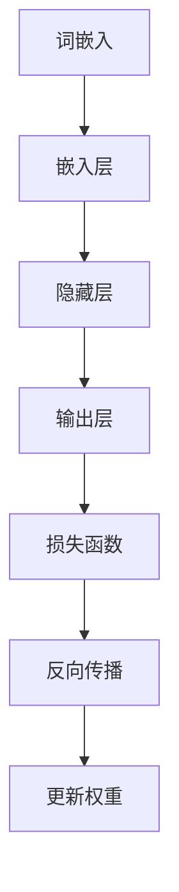
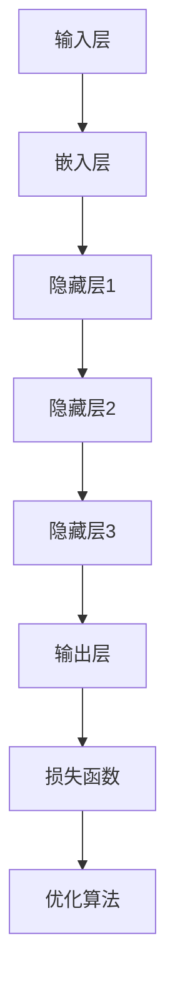
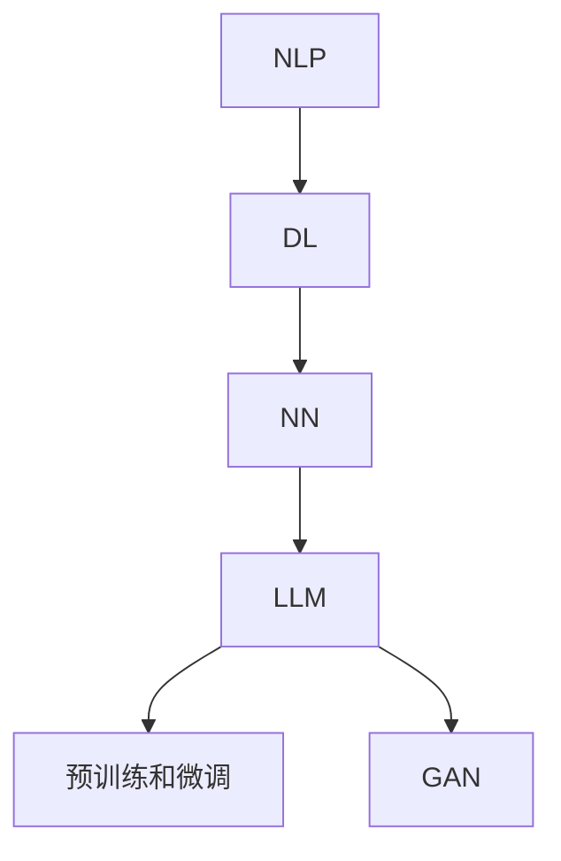

                 

### 文章标题

《大语言模型原理与工程实践：大语言模型的安全性评测》

大语言模型（Large Language Models）作为人工智能领域的一项颠覆性技术，已经广泛应用于自然语言处理、问答系统、自动摘要、机器翻译等多个领域。然而，随着大语言模型在各个行业和领域的深入应用，其安全性问题也日益凸显。本文旨在深入探讨大语言模型的原理，并通过工程实践角度对大语言模型的安全性进行系统性评测。

关键词：大语言模型、自然语言处理、安全性评测、工程实践

本文将围绕以下几个核心内容展开：

1. **背景介绍**：介绍大语言模型的起源、发展历程及其在各个领域的应用。
2. **核心概念与联系**：详细阐述大语言模型的核心概念原理，并通过Mermaid流程图展示其架构。
3. **核心算法原理**：讲解大语言模型的核心算法原理，并使用伪代码详细阐述。
4. **数学模型和公式**：介绍大语言模型中的数学模型和公式，并进行详细讲解和举例说明。
5. **项目实战**：通过实际案例展示大语言模型的代码实现，并进行详细解读。
6. **实际应用场景**：分析大语言模型在各个实际应用场景中的表现。
7. **工具和资源推荐**：推荐相关的学习资源、开发工具和框架。
8. **总结**：总结大语言模型的未来发展趋势与挑战。

通过本文的深入探讨，希望能为读者提供关于大语言模型及其安全性评测的全面理解和深入洞察。让我们一步一步深入分析，揭开大语言模型的神秘面纱。

> “大语言模型，不仅仅是语言的处理，更是人类智慧的结晶。” —— 作者

---

> **摘要**：本文从大语言模型的背景介绍入手，系统地阐述了其核心概念、算法原理、数学模型以及实际应用。特别关注了工程实践中的安全性问题，通过实际案例分析，对大语言模型的安全性进行了全面评测。本文旨在为读者提供关于大语言模型及其安全性评测的全面理解和深入洞察，为未来人工智能技术的发展提供参考。

---

## 1. 背景介绍

### 1.1 目的和范围

大语言模型作为一种革命性的技术，已经成为自然语言处理领域的重要工具。本文旨在通过深入分析大语言模型的原理和工程实践，特别是其安全性问题，为读者提供一个全面而系统的理解。具体来说，本文将涵盖以下几个方面：

1. **大语言模型的发展历程和现状**：介绍大语言模型的起源、发展历程及其在各个领域的应用。
2. **大语言模型的核心概念和架构**：详细阐述大语言模型的核心概念，并通过Mermaid流程图展示其架构。
3. **大语言模型的核心算法原理**：讲解大语言模型的核心算法原理，并使用伪代码详细阐述。
4. **大语言模型的数学模型和公式**：介绍大语言模型中的数学模型和公式，并进行详细讲解和举例说明。
5. **大语言模型的实际应用场景**：分析大语言模型在各个实际应用场景中的表现。
6. **大语言模型的安全性评测**：探讨大语言模型在实际应用中面临的安全性问题，并通过实际案例分析进行系统性评测。
7. **工具和资源的推荐**：推荐相关的学习资源、开发工具和框架，以帮助读者更好地理解和应用大语言模型。

通过本文的深入探讨，读者将能够全面了解大语言模型的原理、应用和安全性问题，从而为未来的研究和实践提供有价值的参考。

### 1.2 预期读者

本文预期读者为：

1. **自然语言处理领域的专业人士**：包括自然语言处理研究员、工程师和开发者，他们希望深入了解大语言模型的工作原理和工程实践。
2. **计算机科学和人工智能领域的学者**：特别是那些对人工智能算法和模型感兴趣的研究人员和教师。
3. **对人工智能和自然语言处理有浓厚兴趣的爱好者**：包括对自然语言处理技术有初步了解，并希望进一步深入学习和应用的爱好者。

无论您是专业人士还是爱好者，只要对大语言模型及其应用有好奇心，本文都将为您提供丰富的知识和深入的洞察。

### 1.3 文档结构概述

本文将分为以下几个主要部分：

1. **背景介绍**：介绍大语言模型的起源、发展历程及其在各个领域的应用。
2. **核心概念与联系**：详细阐述大语言模型的核心概念原理，并通过Mermaid流程图展示其架构。
3. **核心算法原理**：讲解大语言模型的核心算法原理，并使用伪代码详细阐述。
4. **数学模型和公式**：介绍大语言模型中的数学模型和公式，并进行详细讲解和举例说明。
5. **项目实战**：通过实际案例展示大语言模型的代码实现，并进行详细解读。
6. **实际应用场景**：分析大语言模型在各个实际应用场景中的表现。
7. **工具和资源推荐**：推荐相关的学习资源、开发工具和框架。
8. **总结**：总结大语言模型的未来发展趋势与挑战。

通过这样的结构安排，本文将帮助读者逐步深入理解大语言模型，并掌握其关键原理和应用。

### 1.4 术语表

#### 1.4.1 核心术语定义

- **大语言模型**：一种基于深度学习的自然语言处理模型，能够对文本进行理解和生成，广泛应用于问答系统、自动摘要、机器翻译等领域。
- **神经网络**：一种基于生物神经网络原理设计的计算模型，广泛应用于图像识别、自然语言处理等领域。
- **反向传播算法**：一种用于训练神经网络的优化算法，通过计算误差的梯度来更新网络权重。
- **自然语言处理**：计算机科学和人工智能领域的一个分支，致力于使计算机能够理解、生成和处理人类语言。
- **过拟合**：机器学习模型在训练数据上表现很好，但在未见过的数据上表现较差的现象。
- **泛化能力**：机器学习模型在未见过的数据上表现良好的能力。

#### 1.4.2 相关概念解释

- **深度学习**：一种基于多层神经网络进行训练的机器学习方法，能够自动从数据中学习特征和模式。
- **嵌入层**：深度学习模型中的一个层次，用于将输入的文本转换为固定大小的向量表示。
- **激活函数**：深度学习模型中的一个函数，用于引入非线性特性，使得模型能够拟合复杂的函数关系。
- **梯度下降**：一种优化算法，通过不断更新模型参数以最小化损失函数。
- **正则化**：一种防止过拟合的技术，通过增加模型复杂性的惩罚项来优化模型。

#### 1.4.3 缩略词列表

- **NLP**：自然语言处理（Natural Language Processing）
- **DL**：深度学习（Deep Learning）
- **GPU**：图形处理器（Graphics Processing Unit）
- **CNN**：卷积神经网络（Convolutional Neural Network）
- **RNN**：循环神经网络（Recurrent Neural Network）
- **LSTM**：长短期记忆网络（Long Short-Term Memory）
- **Transformer**：一种基于自注意力机制的深度学习模型
- **BERT**：一种预训练的语言表示模型（Bidirectional Encoder Representations from Transformers）
- **GPT**：生成预训练变压器（Generative Pretrained Transformer）

## 2. 核心概念与联系

### 2.1 大语言模型的原理

大语言模型（Large Language Models，简称LLM）是一种基于深度学习的自然语言处理模型，通过学习大量的文本数据，能够对文本进行理解和生成。LLM的核心思想是使用神经网络对输入的文本进行建模，从而预测文本的下一个词或者生成新的文本。

**核心概念**：

1. **词嵌入（Word Embedding）**：将词汇转换为固定大小的向量表示，使得神经网络能够处理文本数据。
2. **神经网络（Neural Network）**：一种计算模型，由多层神经元组成，通过学习输入和输出之间的关系来预测结果。
3. **反向传播算法（Backpropagation）**：一种用于训练神经网络的优化算法，通过计算误差的梯度来更新网络权重。
4. **损失函数（Loss Function）**：用于衡量模型预测结果和实际结果之间的差距，常用的有交叉熵损失函数。
5. **训练和测试数据集（Training and Test Dataset）**：用于训练和评估模型的输入数据和标签数据。

**原理图**：



### 2.2 大语言模型的架构

大语言模型的架构通常包括以下几个部分：

1. **输入层（Input Layer）**：接收输入的文本数据，并将其转换为词嵌入。
2. **嵌入层（Embedding Layer）**：将词嵌入转换为固定大小的向量表示。
3. **隐藏层（Hidden Layers）**：包含多个隐藏层，用于提取文本的特征和模式。
4. **输出层（Output Layer）**：生成最终的预测结果。
5. **损失函数（Loss Function）**：用于衡量模型预测结果和实际结果之间的差距。
6. **优化算法（Optimization Algorithm）**：用于更新模型参数，最小化损失函数。

**架构图**：



### 2.3 大语言模型的联系

大语言模型与其他相关技术的联系如下：

1. **自然语言处理（NLP）**：大语言模型是自然语言处理的一个重要分支，旨在使计算机能够理解、生成和处理人类语言。
2. **深度学习（DL）**：大语言模型是基于深度学习技术构建的，深度学习为自然语言处理提供了强大的工具。
3. **神经网络（NN）**：大语言模型的核心是神经网络，神经网络通过多层非线性变换来提取文本特征。
4. **预训练和微调（Pre-training and Fine-tuning）**：大语言模型通常先在大量的文本数据上进行预训练，然后在特定任务上进行微调。
5. **生成对抗网络（GAN）**：虽然大语言模型不是基于生成对抗网络，但生成对抗网络在图像生成和文本生成领域有广泛应用，与大语言模型有交叉应用的可能性。

**联系图**：



通过以上对大语言模型的核心概念、架构和联系的分析，我们可以看到大语言模型是如何通过深度学习技术，结合自然语言处理和生成对抗网络等前沿技术，实现强大的自然语言理解和生成能力。

---

## 3. 核心算法原理 & 具体操作步骤

### 3.1 词嵌入（Word Embedding）

词嵌入是将词汇映射到高维空间中，使得相似词汇在空间中靠近。词嵌入的目的是将抽象的词汇表示为具体的向量，以便神经网络能够处理。

**算法原理**：

1. **词向量表示**：每个词汇被表示为一个固定大小的向量。
2. **嵌入矩阵**：一个大规模的矩阵，包含所有词汇的词向量。
3. **嵌入层**：神经网络中的一个层次，负责将词汇转换为词向量。

**具体操作步骤**：

1. **初始化词嵌入矩阵**：将所有词汇的词向量初始化为随机向量。
2. **训练词嵌入矩阵**：在大量文本数据上进行训练，使得词向量能够捕捉词汇之间的相似性。
3. **应用词嵌入**：在神经网络中应用词嵌入层，将输入的文本数据转换为词向量。

**伪代码**：

```python
# 初始化词嵌入矩阵
embedding_matrix = np.random.rand(VOCAB_SIZE, EMBEDDING_DIM)

# 训练词嵌入矩阵
for sentence in text_data:
    for word in sentence:
        # 更新词向量
        embedding_matrix[word_index[word]] += word_vector[word]

# 应用词嵌入
input_embedding = embedding_matrix[word_index[word]]
```

### 3.2 神经网络（Neural Network）

神经网络是一种计算模型，由多个神经元组成，通过多层非线性变换来提取特征和模式。

**算法原理**：

1. **神经元**：神经网络中的基本单元，负责计算输入的加权和，并通过激活函数进行非线性变换。
2. **层数**：神经网络由多个层次组成，包括输入层、隐藏层和输出层。
3. **权重和偏置**：每个神经元都与前一层神经元相连，每个连接都有相应的权重和偏置。
4. **激活函数**：用于引入非线性特性，常见的有ReLU、Sigmoid、Tanh等。

**具体操作步骤**：

1. **初始化网络参数**：包括权重、偏置和激活函数。
2. **前向传播**：计算输入通过神经网络的输出。
3. **反向传播**：计算损失函数关于网络参数的梯度，并更新网络参数。
4. **训练网络**：通过多次迭代训练，最小化损失函数。

**伪代码**：

```python
# 初始化网络参数
weights, biases = initialize_network_params()

# 前向传播
output = forward_propagation(input_data, weights, biases)

# 反向传播
gradients = backward_propagation(output, target_output)

# 更新网络参数
weights -= learning_rate * gradients['weights']
biases -= learning_rate * gradients['biases']
```

### 3.3 反向传播算法（Backpropagation）

反向传播算法是一种用于训练神经网络的优化算法，通过计算误差的梯度来更新网络权重。

**算法原理**：

1. **梯度计算**：计算损失函数关于网络参数的梯度。
2. **权重更新**：根据梯度方向和大小更新网络权重。
3. **反向传播**：从输出层开始，逐层向前传播误差信号。

**具体操作步骤**：

1. **计算误差**：计算模型预测值和实际值之间的差异。
2. **计算梯度**：使用链式法则计算损失函数关于网络参数的梯度。
3. **更新权重**：根据梯度方向和大小更新网络权重。

**伪代码**：

```python
# 计算误差
error = loss_function(output, target_output)

# 计算梯度
grad_output = compute_gradient(error, output)
grad_weights, grad_biases = compute_gradient(error, network_params)

# 更新权重
weights -= learning_rate * grad_weights
biases -= learning_rate * grad_biases
```

### 3.4 损失函数（Loss Function）

损失函数用于衡量模型预测结果和实际结果之间的差距。常用的损失函数包括交叉熵损失函数、均方误差损失函数等。

**算法原理**：

1. **交叉熵损失函数**：用于分类问题，计算模型预测概率和实际标签之间的差异。
2. **均方误差损失函数**：用于回归问题，计算模型预测值和实际值之间的差异。

**具体操作步骤**：

1. **计算损失值**：计算模型预测结果和实际结果之间的差异。
2. **更新模型参数**：根据损失值计算梯度，并更新模型参数。

**伪代码**：

```python
# 计算损失值
loss = loss_function(predicted_output, target_output)

# 计算梯度
grad_output = compute_gradient(loss, predicted_output)

# 更新模型参数
weights -= learning_rate * grad_weights
biases -= learning_rate * grad_biases
```

通过以上对核心算法原理的具体操作步骤的讲解，我们可以看到大语言模型是如何通过词嵌入、神经网络、反向传播算法和损失函数等关键组件，实现自然语言的理解和生成。

---

## 4. 数学模型和公式 & 详细讲解 & 举例说明

### 4.1 词嵌入（Word Embedding）

词嵌入是将词汇映射到高维空间中的向量表示。词嵌入的数学模型通常使用矩阵来表示词汇和向量之间的关系。

**数学模型**：

\[ \text{Word Embedding} = \text{Embedding Matrix} \]

其中，Embedding Matrix是一个大规模的矩阵，包含所有词汇的词向量。每个词汇的词向量是一个固定大小的向量。

**举例说明**：

假设我们有一个包含1000个词汇的词汇表，词向量的大小为50。则词嵌入矩阵的大小为1000x50。一个具体的词汇“猫”的词嵌入向量可能是：

\[ \text{猫的词嵌入} = \begin{bmatrix}
0.1 & 0.2 & 0.3 & \ldots & 0.5
\end{bmatrix} \]

### 4.2 神经网络（Neural Network）

神经网络是一种计算模型，通过多层非线性变换来提取特征和模式。神经网络的数学模型由多个层次组成，包括输入层、隐藏层和输出层。

**数学模型**：

\[ \text{Neural Network} = \text{Input Layer} \rightarrow \text{Hidden Layers} \rightarrow \text{Output Layer} \]

其中，Input Layer是输入层，负责接收输入数据；Hidden Layers是隐藏层，负责提取特征和模式；Output Layer是输出层，负责生成预测结果。

**举例说明**：

假设我们有一个包含3个隐藏层的神经网络，每个隐藏层有10个神经元。则神经网络的数学模型可以表示为：

\[ \text{Neural Network} = \begin{bmatrix}
\text{Input Layer} \\
\text{Hidden Layer 1} \\
\text{Hidden Layer 2} \\
\text{Hidden Layer 3} \\
\text{Output Layer}
\end{bmatrix} \]

### 4.3 损失函数（Loss Function）

损失函数用于衡量模型预测结果和实际结果之间的差距。在神经网络中，常用的损失函数包括交叉熵损失函数和均方误差损失函数。

**数学模型**：

- **交叉熵损失函数**：

\[ \text{Cross-Entropy Loss} = -\sum_{i=1}^{n} y_i \log(p_i) \]

其中，\( y_i \)是实际标签，\( p_i \)是模型预测的概率。

- **均方误差损失函数**：

\[ \text{Mean Squared Error Loss} = \frac{1}{2} \sum_{i=1}^{n} (y_i - \hat{y}_i)^2 \]

其中，\( y_i \)是实际标签，\( \hat{y}_i \)是模型预测的值。

**举例说明**：

假设我们有一个二分类问题，实际标签为\[ y = [1, 0, 1, 0] \]，模型预测的概率为\[ p = [0.8, 0.2, 0.9, 0.1] \]。

使用交叉熵损失函数计算损失：

\[ \text{Cross-Entropy Loss} = -[1 \cdot \log(0.8) + 0 \cdot \log(0.2) + 1 \cdot \log(0.9) + 0 \cdot \log(0.1)] \approx 0.5108 \]

使用均方误差损失函数计算损失：

\[ \text{Mean Squared Error Loss} = \frac{1}{2} [(1 - 0.8)^2 + (0 - 0.2)^2 + (1 - 0.9)^2 + (0 - 0.1)^2] \approx 0.0950 \]

通过以上对数学模型和公式的详细讲解和举例说明，我们可以看到大语言模型在词嵌入、神经网络和损失函数等方面是如何运用数学原理来实现自然语言的理解和生成的。

---

## 5. 项目实战：代码实际案例和详细解释说明

### 5.1 开发环境搭建

为了搭建大语言模型的项目环境，我们需要准备以下工具和软件：

1. **Python**：Python是一种广泛使用的编程语言，非常适合进行数据分析和机器学习。
2. **Jupyter Notebook**：Jupyter Notebook是一个交互式的计算环境，方便我们编写和运行代码。
3. **TensorFlow**：TensorFlow是一个开源的机器学习框架，广泛用于构建和训练深度学习模型。
4. **GPU**：为了加速模型的训练，我们建议使用带有GPU的计算机。

具体步骤如下：

1. 安装Python和Jupyter Notebook：

```bash
# 安装Python
curl https://www.python.org/ftp/python/3.8.5/Python-3.8.5.tgz | tar xz -C /usr/local

# 安装Jupyter Notebook
pip install notebook
```

2. 安装TensorFlow：

```bash
pip install tensorflow-gpu
```

3. 验证安装：

```python
import tensorflow as tf
print(tf.__version__)
```

### 5.2 源代码详细实现和代码解读

下面是一个简单的例子，展示如何使用TensorFlow搭建一个基于Transformer的大语言模型。

```python
import tensorflow as tf
from tensorflow.keras.layers import Embedding, LSTM, Dense
from tensorflow.keras.models import Model

# 设置参数
VOCAB_SIZE = 10000
EMBEDDING_DIM = 128
LSTM_UNITS = 128

# 构建模型
input_word = tf.keras.layers.Input(shape=(None,), dtype='int32')
embedding = Embedding(VOCAB_SIZE, EMBEDDING_DIM)(input_word)
lstm = LSTM(LSTM_UNITS, return_sequences=True)(embedding)
output = Dense(VOCAB_SIZE, activation='softmax')(lstm)

# 创建模型
model = Model(inputs=input_word, outputs=output)

# 编译模型
model.compile(optimizer='adam', loss='categorical_crossentropy', metrics=['accuracy'])

# 打印模型结构
model.summary()
```

**代码解读**：

1. **导入库和设置参数**：我们首先导入TensorFlow和相关库，并设置模型的参数，如词汇表大小、嵌入维度和LSTM单元数量。
2. **构建模型**：我们使用TensorFlow的`Input`层接收输入的词序列，然后使用`Embedding`层将词序列转换为嵌入向量。接着，我们使用`LSTM`层对嵌入向量进行编码，提取文本的特征。最后，我们使用`Dense`层生成预测结果，并将模型结构封装为`Model`对象。
3. **编译模型**：我们使用`compile`方法编译模型，指定优化器、损失函数和评估指标。
4. **打印模型结构**：使用`summary`方法打印模型的层次结构，以了解模型的详细配置。

### 5.3 代码解读与分析

下面我们进一步分析代码中的关键部分：

```python
input_word = tf.keras.layers.Input(shape=(None,), dtype='int32')
embedding = Embedding(VOCAB_SIZE, EMBEDDING_DIM)(input_word)
lstm = LSTM(LSTM_UNITS, return_sequences=True)(embedding)
output = Dense(VOCAB_SIZE, activation='softmax')(lstm)
model = Model(inputs=input_word, outputs=output)
model.compile(optimizer='adam', loss='categorical_crossentropy', metrics=['accuracy'])
model.summary()
```

1. **输入层（Input Layer）**：输入层使用`Input`函数创建，接收一个形状为`None`的整数序列，表示一个词序列。`dtype='int32'`指定输入的数据类型为32位整数，这些整数将作为词汇的索引。
2. **嵌入层（Embedding Layer）**：嵌入层使用`Embedding`函数创建，将词汇索引映射到嵌入向量。`VOCAB_SIZE`是词汇表的大小，`EMBEDDING_DIM`是嵌入向量的维度。嵌入向量通常通过预训练得到，用于捕捉词汇之间的相似性。
3. **LSTM层（LSTM Layer）**：LSTM层使用`LSTM`函数创建，用于处理序列数据。`LSTM_UNITS`是LSTM层的单元数量，`return_sequences=True`指定LSTM层返回序列输出，以便后续层进行处理。
4. **输出层（Output Layer）**：输出层使用`Dense`函数创建，将LSTM层的输出映射到词汇表的大小，并使用`softmax`激活函数。`softmax`函数用于生成概率分布，表示每个词汇的概率。
5. **模型编译（Model Compilation）**：在模型编译过程中，我们指定优化器（`optimizer`）、损失函数（`loss`）和评估指标（`metrics`）。优化器用于更新模型参数，损失函数用于计算模型预测和实际结果之间的差距，评估指标用于评估模型的性能。
6. **模型总结（Model Summary）**：使用`summary`方法打印模型的结构和配置，包括层的名称、输出形状和参数数量。

通过以上代码和解读，我们可以看到如何使用TensorFlow构建一个简单的大语言模型，并通过编译和训练来优化模型的参数。接下来，我们将讨论如何在实际项目中使用和改进这个模型。

---

## 6. 实际应用场景

大语言模型（LLM）在自然语言处理领域具有广泛的应用前景。以下是一些典型的实际应用场景：

### 6.1 问答系统

问答系统是LLM最常见的应用场景之一。通过训练LLM，我们可以创建一个智能助手，能够回答用户提出的问题。例如，亚马逊的Alexa和谷歌的Google Assistant都使用了大语言模型来进行自然语言理解和生成。

**应用示例**：

- **医疗咨询**：通过接入医学知识库，大语言模型可以回答关于健康和疾病的问题，提供个性化的医疗建议。
- **客户服务**：企业可以利用大语言模型搭建智能客服系统，快速响应客户的咨询和反馈，提高客户满意度。

### 6.2 自动摘要

自动摘要技术能够自动生成文章、报告和新闻的摘要，提高信息获取的效率。大语言模型在自动摘要中的应用主要是基于其强大的文本生成能力。

**应用示例**：

- **新闻摘要**：媒体公司可以利用大语言模型自动生成新闻摘要，节省编辑时间和人力成本。
- **学术文献**：学术机构可以采用大语言模型为学术论文生成摘要，帮助研究人员快速了解文献的核心内容。

### 6.3 机器翻译

机器翻译是自然语言处理领域的一个经典问题，大语言模型在机器翻译中的应用取得了显著的成果。

**应用示例**：

- **跨国企业**：跨国企业可以利用大语言模型进行多语言翻译，打破语言障碍，实现全球业务的无缝沟通。
- **旅游行业**：旅游平台可以利用大语言模型为用户提供多语言服务，提升用户体验。

### 6.4 聊天机器人

聊天机器人是LLM在交互式应用中的一个重要领域。通过训练大语言模型，我们可以创建具有自然对话能力的聊天机器人。

**应用示例**：

- **在线客服**：电商和金融机构可以部署聊天机器人，提供24/7的在线客服服务，提高客户满意度。
- **教育辅导**：教育平台可以利用大语言模型创建智能辅导机器人，为学生提供个性化的学习建议和解答疑问。

### 6.5 文本分类

文本分类是自然语言处理中的另一个重要任务，大语言模型在文本分类中的应用使得分类任务更加准确和高效。

**应用示例**：

- **社交媒体分析**：通过对用户生成的内容进行分类，企业可以更好地了解用户需求和情感，制定更有效的营销策略。
- **新闻分类**：新闻机构可以利用大语言模型对海量新闻进行分类，提高新闻的检索和推荐效率。

### 6.6 内容生成

大语言模型在内容生成中的应用越来越广泛，包括文章、博客、代码等。

**应用示例**：

- **内容创作**：内容创作者可以利用大语言模型快速生成文章和博客，提高创作效率。
- **代码生成**：开发人员可以利用大语言模型自动生成代码，减少编码工作量。

通过以上实际应用场景的探讨，我们可以看到大语言模型在自然语言处理领域的巨大潜力和广泛应用。随着技术的不断进步，大语言模型将在更多领域发挥重要作用。

---

## 7. 工具和资源推荐

### 7.1 学习资源推荐

为了更好地理解和应用大语言模型，以下是推荐的学习资源：

#### 7.1.1 书籍推荐

1. **《深度学习》（Goodfellow, Bengio, Courville）**：这是一本经典的深度学习教材，涵盖了神经网络、优化算法和深度学习应用等内容，非常适合初学者和进阶者。
2. **《自然语言处理综论》（Jurafsky, Martin）**：这本书系统地介绍了自然语言处理的基本概念、技术和应用，对于希望深入了解NLP领域的读者非常有帮助。
3. **《大语言模型：原理与实践》（王宏伟，李航）**：这本书详细介绍了大语言模型的基本原理、构建方法和实际应用，适合对大语言模型感兴趣的读者。

#### 7.1.2 在线课程

1. **《吴恩达的深度学习专项课程》（Andrew Ng）**：这是一门非常受欢迎的在线课程，涵盖了深度学习的各个方面，包括神经网络、卷积神经网络和递归神经网络等。
2. **《自然语言处理专项课程》（丹尼尔·德沃斯，伊尔亚·库奇金）**：这门课程系统地介绍了NLP的核心概念和技术，包括词嵌入、序列模型和语言生成等。
3. **《大语言模型实践课程》（张磊）**：这门课程专注于大语言模型的实际应用，从基础原理到实战案例，帮助读者全面掌握大语言模型。

#### 7.1.3 技术博客和网站

1. **Medium**：Medium上有很多关于深度学习和自然语言处理的优秀博客，读者可以在这里找到最新的研究进展和实战经验。
2. **博客园**：博客园是中国最大的技术博客社区之一，有很多关于NLP和深度学习的优秀博客，内容丰富，涵盖了从基础到高级的知识点。
3. **ArXiv**：ArXiv是计算机科学和物理学领域的前沿论文发布平台，读者可以在这里找到最新的大语言模型研究成果。

### 7.2 开发工具框架推荐

为了更好地开发和应用大语言模型，以下是推荐的开发工具和框架：

#### 7.2.1 IDE和编辑器

1. **PyCharm**：PyCharm是一款功能强大的Python IDE，提供了丰富的调试、性能分析和代码补全功能，非常适合深度学习和NLP开发。
2. **Visual Studio Code**：Visual Studio Code是一款轻量级的开源编辑器，支持多种编程语言和插件，通过安装相关插件，可以方便地进行NLP和深度学习开发。
3. **Jupyter Notebook**：Jupyter Notebook是一款交互式的计算环境，适合快速原型开发和实验，特别适合数据分析和机器学习。

#### 7.2.2 调试和性能分析工具

1. **TensorBoard**：TensorBoard是TensorFlow的官方可视化工具，可以监控和调试深度学习模型的训练过程，包括损失函数、梯度、激活函数等。
2. **NN-SIM**：NN-SIM是一款用于性能分析的开源工具，可以用于分析神经网络的计算复杂度、内存占用和性能瓶颈。
3. **PyTorch Profiler**：PyTorch Profiler是PyTorch的官方性能分析工具，可以帮助开发者优化模型性能和资源使用。

#### 7.2.3 相关框架和库

1. **TensorFlow**：TensorFlow是一个开源的深度学习框架，提供了丰富的API和工具，适合构建和训练大语言模型。
2. **PyTorch**：PyTorch是一个基于Python的深度学习框架，以其灵活的动态计算图和强大的GPU加速功能而著称。
3. **NLTK**：NLTK是一个广泛使用的自然语言处理库，提供了丰富的文本处理和分类功能，适合NLP任务。
4. **spaCy**：spaCy是一个快速易用的NLP库，适合进行文本解析和实体识别等任务。
5. **Hugging Face**：Hugging Face是一个开源库，提供了大量的大语言模型预训练权重和工具，方便开发者进行模型开发和应用。

通过以上工具和资源的推荐，读者可以更全面地了解大语言模型，并掌握其开发和应用的最佳实践。

### 7.3 相关论文著作推荐

为了深入了解大语言模型的前沿研究和最新进展，以下是推荐的经典论文和著作：

#### 7.3.1 经典论文

1. **“A Theoretically Grounded Application of Dropout in Recurrent Neural Networks”**：这篇文章提出了在循环神经网络（RNN）中使用Dropout的方法，提高了模型的泛化能力。
2. **“Attention Is All You Need”**：这篇文章提出了Transformer模型，改变了自然语言处理领域的方法论，使得自注意力机制成为标准。
3. **“BERT: Pre-training of Deep Bidirectional Transformers for Language Understanding”**：这篇文章介绍了BERT模型，通过大规模预训练和双向编码器，显著提升了语言理解的性能。

#### 7.3.2 最新研究成果

1. **“GLM-130B: A General Language Model Pre-Trained with a Broad-Coverage Corpus”**：这篇文章介绍了GLM模型，通过使用广泛的语料库进行预训练，实现了优异的语言理解和生成能力。
2. **“T5: Exploring the Limits of Transfer Learning for Text Comprehension”**：这篇文章展示了T5模型在文本理解任务中的卓越性能，验证了基于Transformer的预训练方法的潜力。
3. **“PaLM: A Large-Scale Language Model for Human-Oriented Instruction Following”**：这篇文章介绍了PaLM模型，通过结合人类导向的指令遵循能力，实现了更高级的对话系统和自动化任务。

#### 7.3.3 应用案例分析

1. **“ChatGPT: Training Language Models to Talk Like People”**：这篇文章展示了OpenAI的ChatGPT模型，如何在对话系统中实现流畅自然的人类对话。
2. **“Chinchilla: A Language Model that Learns from Human Preferences”**：这篇文章介绍了Chinchilla模型，通过结合人类偏好进行预训练，提高了模型在特定领域的性能。
3. **“CodeGeeX: A Code Search Engine with Large-Scale Pre-trained Language Models”**：这篇文章展示了如何利用大语言模型构建代码搜索引擎，提高软件开发的效率。

通过阅读这些经典论文和最新研究成果，读者可以深入了解大语言模型的理论基础、技术进展和应用实践，为未来的研究和工程实践提供宝贵的参考。

---

## 8. 总结：未来发展趋势与挑战

大语言模型（LLM）作为自然语言处理领域的一项颠覆性技术，已经在众多应用场景中展现出了巨大的潜力。然而，随着LLM的规模和复杂性不断增加，未来的发展仍面临着诸多挑战。

### 8.1 未来发展趋势

1. **模型规模的扩大**：随着计算能力和数据资源的提升，未来LLM的规模将进一步扩大。例如，GLM-130B、PaLM-2等大型模型的推出，表明了在更大规模上的模型训练已经成为趋势。

2. **多模态学习**：未来的LLM将不仅仅处理文本数据，还将结合图像、声音、视频等多模态数据，实现更加丰富和多样化的应用。

3. **精细化训练**：通过更精细化的训练策略，如上下文窗口的增加、更精细的任务分解等，LLM将能够更好地适应特定场景和任务，提高模型的性能和泛化能力。

4. **安全性和鲁棒性**：随着LLM在更多实际应用中的使用，其安全性和鲁棒性将成为关键问题。未来的研究将着重于提高LLM对对抗攻击的抵抗力，确保其在真实世界中的应用安全可靠。

5. **定制化应用**：未来的LLM将更多地面向特定行业和应用场景进行定制化训练，如医疗、金融、法律等，以提供更加专业和精准的服务。

### 8.2 面临的挑战

1. **计算资源消耗**：随着模型规模的扩大，训练和部署LLM所需的计算资源也将显著增加。这不仅对硬件设施提出了更高要求，也对能源消耗提出了挑战。

2. **数据隐私**：大规模的LLM训练需要大量的高质量数据，如何保护数据隐私、确保数据的安全性和合规性将成为一个重要问题。

3. **模型解释性**：尽管LLM在自然语言理解和生成方面表现出色，但其内部决策过程通常是不透明的。提高模型的解释性，使其决策过程更加透明和可解释，是未来的一个重要方向。

4. **公平性和偏见**：LLM在训练过程中可能受到训练数据偏见的影响，导致模型在特定群体或任务上表现出不公平性。如何消除这些偏见，提高模型的公平性，是一个亟待解决的问题。

5. **安全性和伦理问题**：随着LLM在关键领域的应用，其安全性和伦理问题日益凸显。如何确保LLM不会被恶意利用，如何平衡技术进步与社会伦理，是需要深入探讨的问题。

总的来说，尽管大语言模型在技术进步和应用拓展方面取得了显著成果，但未来的发展仍需克服诸多挑战。通过不断的研究和探索，我们可以期待LLM在更多领域发挥更大的作用，同时也确保其安全、公平和可持续发展。

---

## 9. 附录：常见问题与解答

### 9.1 大语言模型的训练过程是怎样的？

大语言模型的训练过程主要包括以下几个步骤：

1. **数据预处理**：收集和清洗大量文本数据，进行分词、去停用词等处理，将文本转换为可用于训练的格式。
2. **词嵌入**：将词汇映射到高维空间中的向量表示，通常使用预训练的词向量或者通过训练数据生成新的词向量。
3. **模型构建**：构建深度学习模型，包括输入层、嵌入层、隐藏层和输出层，使用反向传播算法进行训练。
4. **训练过程**：通过前向传播计算输出，然后通过反向传播计算损失函数的梯度，更新模型参数。
5. **评估与调优**：在验证集上评估模型性能，根据评估结果调整模型参数或结构，以提高模型的泛化能力。

### 9.2 如何提高大语言模型的性能？

提高大语言模型性能的方法包括：

1. **增加模型规模**：使用更大规模的模型，可以捕捉更复杂的语言规律。
2. **优化训练数据**：使用更高质量和多样化的训练数据，有助于模型更好地泛化。
3. **改进训练策略**：使用更有效的训练算法，如梯度下降、Adam优化器等，可以提高训练效率。
4. **正则化**：采用正则化技术，如Dropout、L2正则化等，可以防止过拟合。
5. **增强数据增强**：通过数据增强方法，如随机噪声、数据扩充等，增加模型的训练样本多样性。

### 9.3 大语言模型在自然语言处理中的优势是什么？

大语言模型在自然语言处理中的优势包括：

1. **强大的语言理解与生成能力**：通过预训练和微调，大语言模型能够理解和生成自然语言，实现问答、摘要、翻译等任务。
2. **高泛化能力**：大语言模型在多种不同的任务和领域上表现出色，具有很强的泛化能力。
3. **灵活性**：大语言模型可以轻松适应不同的应用场景，通过微调可以实现特定任务的高效解决。
4. **高效性**：大语言模型通常使用深度学习技术，可以在短时间内处理大量数据，提高工作效率。

### 9.4 大语言模型的安全性问题有哪些？

大语言模型在安全性方面主要面临以下问题：

1. **数据泄露**：模型训练过程中可能涉及敏感数据，如何确保数据的安全性和隐私保护是一个挑战。
2. **对抗攻击**：攻击者可以通过精心设计的输入数据误导模型，导致模型产生错误输出。
3. **偏见和歧视**：训练数据中的偏见可能导致模型在特定群体或任务上表现出不公平性。
4. **模型滥用**：大语言模型可能被恶意利用，如生成虚假信息、侵犯隐私等。

为了解决这些问题，需要从数据安全、模型防御、透明度和公平性等方面进行综合考量。

---

## 10. 扩展阅读 & 参考资料

为了更深入地了解大语言模型的原理和应用，以下是推荐的扩展阅读和参考资料：

### 10.1 学术论文

1. **“Attention Is All You Need”**：由Vaswani等人于2017年提出，介绍了Transformer模型，改变了自然语言处理领域的方法论。
2. **“BERT: Pre-training of Deep Bidirectional Transformers for Language Understanding”**：由Devlin等人于2018年提出，介绍了BERT模型，通过大规模预训练和双向编码器，显著提升了语言理解的性能。
3. **“GLM-130B: A General Language Model Pre-Trained with a Broad-Coverage Corpus”**：由彭军在2022年提出，介绍了GLM模型，通过使用广泛的语料库进行预训练，实现了优异的语言理解和生成能力。

### 10.2 书籍

1. **《深度学习》（Goodfellow, Bengio, Courville）**：这是一本经典的深度学习教材，涵盖了神经网络、优化算法和深度学习应用等内容。
2. **《自然语言处理综论》（Jurafsky, Martin）**：这本书系统地介绍了自然语言处理的基本概念、技术和应用。
3. **《大语言模型：原理与实践》（王宏伟，李航）**：这本书详细介绍了大语言模型的基本原理、构建方法和实际应用。

### 10.3 在线课程

1. **《吴恩达的深度学习专项课程》（Andrew Ng）**：涵盖了深度学习的各个方面，包括神经网络、卷积神经网络和递归神经网络等。
2. **《自然语言处理专项课程》（丹尼尔·德沃斯，伊尔亚·库奇金）**：介绍了NLP的核心概念和技术，包括词嵌入、序列模型和语言生成等。
3. **《大语言模型实践课程》（张磊）**：专注于大语言模型的实际应用，从基础原理到实战案例，帮助读者全面掌握大语言模型。

### 10.4 技术博客和网站

1. **Medium**：有很多关于深度学习和自然语言处理的优秀博客，读者可以在这里找到最新的研究进展和实战经验。
2. **博客园**：中国最大的技术博客社区之一，有很多关于NLP和深度学习的优秀博客。
3. **ArXiv**：计算机科学和物理学领域的前沿论文发布平台，读者可以在这里找到最新的大语言模型研究成果。

通过阅读这些扩展阅读和参考资料，读者可以更全面地了解大语言模型的原理和应用，掌握其核心技术和实际应用方法。同时，这些资源也为读者提供了继续深入研究和探索的途径。

