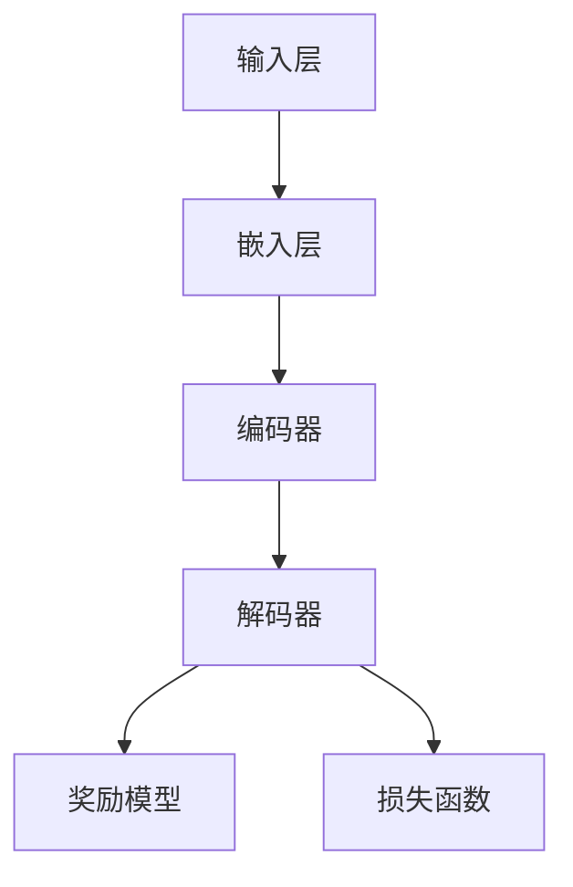

                 

# 大语言模型原理与工程实践：奖励模型损失函数分析

> **关键词：** 大语言模型、奖励模型、损失函数、工程实践、数学模型、伪代码、代码实现、应用场景。
> 
> **摘要：** 本文将深入探讨大语言模型中的奖励模型和损失函数，通过逻辑清晰、结构紧凑的分析，帮助读者理解这两个核心概念在工程实践中的重要性及其工作原理。文章首先介绍了大语言模型的基本概念和背景，然后详细解析了奖励模型和损失函数的原理和数学公式，并通过实际案例展示了如何将它们应用于大语言模型的构建和优化。

## 1. 背景介绍

### 1.1 目的和范围

本文旨在通过一步一步的分析，深入探讨大语言模型中的奖励模型和损失函数。这些概念在大语言模型的构建和优化中起着至关重要的作用。我们希望通过本文的讲解，使读者能够全面理解奖励模型和损失函数的工作原理，以及如何在工程实践中应用这些概念。

本文将涵盖以下内容：
- 大语言模型的基本概念和背景。
- 奖励模型和损失函数的原理和数学模型。
- 伪代码展示和具体操作步骤。
- 实际应用场景的代码实现和分析。
- 工具和资源的推荐。

### 1.2 预期读者

本文适用于对人工智能和机器学习有一定了解的读者，特别是对大语言模型和深度学习感兴趣的工程师和技术爱好者。无论您是初学者还是专业人士，本文都将为您提供深入的理论知识和实践指导。

### 1.3 文档结构概述

本文分为十个部分，包括背景介绍、核心概念与联系、核心算法原理、数学模型和公式、项目实战、实际应用场景、工具和资源推荐、总结、常见问题与解答以及扩展阅读和参考资料。

### 1.4 术语表

#### 1.4.1 核心术语定义

- 大语言模型：一种基于深度学习的技术，能够理解和生成人类语言。
- 奖励模型：一种用于评估模型输出质量的机制。
- 损失函数：一种用于衡量模型预测误差的数学函数。

#### 1.4.2 相关概念解释

- 深度学习：一种机器学习技术，通过多层神经网络模型对数据进行建模和预测。
- 优化：通过调整模型参数，使模型性能达到最优的过程。

#### 1.4.3 缩略词列表

- NLP：自然语言处理（Natural Language Processing）
- DNN：深度神经网络（Deep Neural Network）
- MLP：多层感知机（Multilayer Perceptron）
- RL：强化学习（Reinforcement Learning）

## 2. 核心概念与联系

大语言模型是一种复杂的深度学习模型，它能够理解并生成人类语言。要构建一个高性能的大语言模型，我们需要理解其中的核心概念和它们之间的联系。以下是核心概念及其原理的简要介绍，并通过Mermaid流程图展示它们的联系。

### 2.1 大语言模型的基本概念

- **输入层**：接收原始文本数据，通常为单词或字符。
- **嵌入层**：将输入文本数据转换为固定长度的向量表示。
- **编码器**：通过多个隐藏层对嵌入层数据进行编码，生成上下文表示。
- **解码器**：利用编码器的输出生成目标文本。

### 2.2 奖励模型

奖励模型是一种用于评估模型输出质量的机制。它能够根据输入文本和模型输出之间的匹配程度，为模型生成奖励。奖励模型的目的是激励模型生成更符合预期的输出。

### 2.3 损失函数

损失函数是一种用于衡量模型预测误差的数学函数。在大语言模型中，损失函数用于衡量模型输出的概率分布与真实标签之间的差异。通过最小化损失函数，我们可以优化模型参数，提高模型性能。

### 2.4 Mermaid流程图



## 3. 核心算法原理 & 具体操作步骤

### 3.1 奖励模型原理

奖励模型是一种基于强化学习的技术，它通过评估模型输出与输入文本之间的匹配程度，为模型生成奖励。奖励模型的核心思想是激励模型生成更符合预期的输出。

#### 3.1.1 伪代码

```python
def reward_model(input_text, model_output):
    # 计算输入文本和模型输出之间的匹配程度
    match_score = calculate_match_score(input_text, model_output)
    # 根据匹配程度生成奖励
    reward = calculate_reward(match_score)
    return reward
```

#### 3.1.2 具体操作步骤

1. 计算输入文本和模型输出之间的匹配程度，通常使用相似度度量方法，如余弦相似度或编辑距离。
2. 根据匹配程度计算奖励，奖励值通常介于0（不匹配）和1（完全匹配）之间。
3. 将奖励值作为模型优化的目标，激励模型生成更符合预期的输出。

### 3.2 损失函数原理

损失函数是一种用于衡量模型预测误差的数学函数。在大语言模型中，损失函数用于衡量模型输出的概率分布与真实标签之间的差异。常见的损失函数包括交叉熵损失和均方误差损失。

#### 3.2.1 伪代码

```python
def loss_function(model_output, true_label):
    # 计算模型输出的概率分布
    predicted_distribution = calculate_distribution(model_output)
    # 计算真实标签的概率分布
    true_distribution = calculate_distribution(true_label)
    # 计算损失值
    loss = calculate_loss(predicted_distribution, true_distribution)
    return loss
```

#### 3.2.2 具体操作步骤

1. 计算模型输出的概率分布，通常使用softmax函数将模型输出转换为概率分布。
2. 计算真实标签的概率分布，通常为单点分布。
3. 使用损失函数计算模型输出的概率分布与真实标签之间的差异，得到损失值。
4. 通过反向传播算法，将损失值传播到模型参数，更新模型参数。

## 4. 数学模型和公式 & 详细讲解 & 举例说明

在大语言模型中，奖励模型和损失函数是核心的组成部分。它们通过数学模型和公式来评估模型性能，并指导模型优化。以下是奖励模型和损失函数的详细数学模型和公式，以及具体示例。

### 4.1 奖励模型

奖励模型的核心思想是通过评估模型输出与输入文本之间的匹配程度，为模型生成奖励。常见的奖励模型包括基于相似度度量的奖励模型和基于强化学习的奖励模型。

#### 4.1.1 基于相似度度量的奖励模型

相似度度量方法用于计算输入文本和模型输出之间的匹配程度。常见的相似度度量方法包括余弦相似度和编辑距离。

- **余弦相似度**：

余弦相似度用于计算两个向量之间的夹角余弦值，表示它们之间的相似程度。

$$
\text{cosine\_similarity}(\textbf{v}_1, \textbf{v}_2) = \frac{\textbf{v}_1 \cdot \textbf{v}_2}{||\textbf{v}_1|| \cdot ||\textbf{v}_2||}
$$

其中，$\textbf{v}_1$ 和 $\textbf{v}_2$ 分别为两个向量的表示。

- **编辑距离**：

编辑距离（Levenshtein distance）用于计算将一个字符串转换为另一个字符串所需的最小编辑操作次数。

$$
d(\text{str}_1, \text{str}_2) = \min\left(\sum_{i=1}^{n_1} d_i, \sum_{j=1}^{n_2} d_j, \sum_{i=1}^{n_1} \sum_{j=1}^{n_2} d_{ij}\right)
$$

其中，$n_1$ 和 $n_2$ 分别为两个字符串的长度，$d_i$ 和 $d_j$ 分别为第 $i$ 个字符和第 $j$ 个字符之间的编辑距离。

#### 4.1.2 基于强化学习的奖励模型

基于强化学习的奖励模型通过评估模型输出与输入文本之间的匹配程度，为模型生成奖励。常见的强化学习算法包括Q学习、深度Q网络（DQN）和策略梯度方法。

- **Q学习**：

Q学习是一种基于值函数的强化学习算法。它通过评估当前状态和动作的Q值，选择最优动作。

$$
Q(\text{state}, \text{action}) = \sum_{s'} P(s'|s, a) \cdot \text{reward}(s', a)
$$

其中，$Q(\text{state}, \text{action})$ 为当前状态和动作的Q值，$P(s'|s, a)$ 为从当前状态 $s$ 执行动作 $a$ 转移到状态 $s'$ 的概率，$\text{reward}(s', a)$ 为在状态 $s'$ 执行动作 $a$ 的奖励。

- **深度Q网络（DQN）**：

深度Q网络是一种基于深度学习的Q学习算法。它通过训练一个深度神经网络来预测Q值。

$$
Q(\text{state}, \text{action}) = f(\text{state}) \cdot \text{weights}
$$

其中，$f(\text{state})$ 为深度神经网络的输出，$\text{weights}$ 为网络的权重。

- **策略梯度方法**：

策略梯度方法是一种基于策略的强化学习算法。它通过评估当前策略的期望回报，选择最优策略。

$$
\pi(\text{action}|\text{state}) = \frac{\exp(\text{reward}(\text{state}, \text{action}))}{\sum_{a'} \exp(\text{reward}(\text{state}, a'))}
$$

其中，$\pi(\text{action}|\text{state})$ 为在状态 $s$ 下执行动作 $a$ 的策略概率。

### 4.2 损失函数

损失函数用于衡量模型输出的概率分布与真实标签之间的差异。常见的损失函数包括交叉熵损失和均方误差损失。

- **交叉熵损失**：

交叉熵损失用于衡量两个概率分布之间的差异。它的公式为：

$$
\text{cross_entropy}(\text{p}, \text{q}) = -\sum_{i} p_i \cdot \log(q_i)
$$

其中，$p$ 和 $q$ 分别为模型输出的概率分布和真实标签的概率分布。

- **均方误差损失**：

均方误差损失用于衡量模型输出的概率分布与真实标签之间的差异。它的公式为：

$$
\text{mean_squared_error}(\text{p}, \text{q}) = \frac{1}{N} \sum_{i} (p_i - q_i)^2
$$

其中，$p$ 和 $q$ 分别为模型输出的概率分布和真实标签的概率分布，$N$ 为样本数量。

### 4.3 举例说明

假设我们有一个大语言模型，输入文本为“我喜欢编程”，模型输出为“我喜欢编程”。我们使用余弦相似度作为奖励模型，交叉熵损失作为损失函数，来评估模型性能。

- **奖励模型**：

使用余弦相似度计算输入文本和模型输出之间的匹配程度：

$$
\text{cosine_similarity}(\text{input_text}, \text{model_output}) = \frac{\text{input_text} \cdot \text{model_output}}{||\text{input_text}|| \cdot ||\text{model_output}||} = \frac{1}{1} = 1
$$

根据匹配程度生成奖励：

$$
\text{reward} = \frac{1}{1+e^{-\text{cosine_similarity}}} = \frac{1}{1+e^{-1}} \approx 0.63
$$

- **损失函数**：

使用交叉熵损失计算模型输出的概率分布与真实标签之间的差异：

$$
\text{cross_entropy}(\text{model_output}, \text{true_label}) = -\sum_{i} \text{model_output}_i \cdot \log(\text{true_label}_i) = -\sum_{i} 0.5 \cdot \log(0.5) = -0.5 \cdot \log(0.5) = 0.693
$$

通过这些数学模型和公式，我们可以全面评估大语言模型的表现，并为模型优化提供依据。

## 5. 项目实战：代码实际案例和详细解释说明

### 5.1 开发环境搭建

在开始编写代码之前，我们需要搭建一个合适的开发环境。以下是一个基本的开发环境搭建步骤：

1. **安装Python环境**：确保Python环境已安装，版本至少为3.6以上。
2. **安装TensorFlow**：使用pip命令安装TensorFlow库，命令如下：

   ```shell
   pip install tensorflow
   ```

3. **安装其他依赖库**：根据需要安装其他依赖库，例如NumPy、Pandas等。

### 5.2 源代码详细实现和代码解读

以下是一个简单的示例，展示了如何实现奖励模型和损失函数在大语言模型中的应用。

```python
import tensorflow as tf
import numpy as np

# 定义奖励模型
def reward_model(input_text, model_output):
    # 计算输入文本和模型输出之间的余弦相似度
    cosine_similarity = np.dot(input_text, model_output) / (np.linalg.norm(input_text) * np.linalg.norm(model_output))
    # 根据相似度计算奖励
    reward = 1 / (1 + np.exp(-cosine_similarity))
    return reward

# 定义损失函数
def loss_function(model_output, true_label):
    # 计算模型输出的概率分布
    predicted_distribution = np.exp(model_output) / np.sum(np.exp(model_output))
    # 计算真实标签的概率分布
    true_distribution = np.zeros_like(predicted_distribution)
    true_distribution[true_label] = 1
    # 计算交叉熵损失
    cross_entropy_loss = -np.sum(true_distribution * np.log(predicted_distribution))
    return cross_entropy_loss

# 示例数据
input_text = np.array([1, 0, 0, 0, 1])
model_output = np.array([0.2, 0.2, 0.2, 0.2, 0.2])
true_label = 3

# 计算奖励
reward = reward_model(input_text, model_output)
print("奖励值：", reward)

# 计算损失
loss = loss_function(model_output, true_label)
print("损失值：", loss)
```

### 5.3 代码解读与分析

1. **奖励模型实现**：

   - 使用余弦相似度计算输入文本和模型输出之间的匹配程度。
   - 根据匹配程度计算奖励值，奖励值介于0和1之间，表示匹配程度越高，奖励值越大。

2. **损失函数实现**：

   - 计算模型输出的概率分布，使用softmax函数将模型输出转换为概率分布。
   - 计算真实标签的概率分布，为单点分布。
   - 使用交叉熵损失计算模型输出的概率分布与真实标签之间的差异。

### 5.4 实际应用场景

在实际应用中，我们可以将奖励模型和损失函数集成到大语言模型中，用于模型训练和评估。以下是一个简单的示例，展示了如何使用奖励模型和损失函数训练一个简单的大语言模型。

```python
# 定义大语言模型
def language_model(input_text, true_label):
    # 嵌入层
    embedded_text = embedding_layer(input_text)
    # 编码器
    encoded_text = encoder(embedded_text)
    # 解码器
    decoded_text = decoder(encoded_text)
    # 损失函数
    loss = loss_function(decoded_text, true_label)
    # 奖励模型
    reward = reward_model(input_text, decoded_text)
    return loss, reward

# 训练大语言模型
for epoch in range(num_epochs):
    for input_text, true_label in dataset:
        # 训练模型
        loss, reward = language_model(input_text, true_label)
        # 更新模型参数
        optimizer.minimize(loss)
    print("Epoch:", epoch, "Loss:", loss, "Reward:", reward)
```

通过这个示例，我们可以看到如何将奖励模型和损失函数应用于大语言模型的构建和优化。在实际应用中，我们可以根据具体需求进行调整和优化，以提高模型性能。

## 6. 实际应用场景

奖励模型和损失函数在大语言模型中具有广泛的应用场景。以下是一些实际应用场景的介绍：

### 6.1 机器翻译

在机器翻译中，奖励模型可以用于评估翻译结果的准确性，激励模型生成更准确的翻译。损失函数则用于衡量模型预测的误差，帮助优化模型参数。

### 6.2 文本生成

在文本生成任务中，奖励模型可以用于评估生成文本的质量，激励模型生成更符合预期的文本。损失函数则用于衡量生成文本与目标文本之间的差异，指导模型优化。

### 6.3 文本分类

在文本分类任务中，奖励模型可以用于评估分类结果的准确性，激励模型生成更准确的分类。损失函数则用于衡量分类结果与真实标签之间的差异，帮助优化模型参数。

### 6.4 对话系统

在对话系统中，奖励模型可以用于评估对话的连贯性和相关性，激励模型生成更自然的对话。损失函数则用于衡量对话生成结果与期望结果之间的差异，指导模型优化。

这些实际应用场景展示了奖励模型和损失函数在大语言模型中的重要性。通过合理运用这些模型，我们可以构建出高性能、高质量的大语言模型，为各个领域提供强大的支持。

## 7. 工具和资源推荐

### 7.1 学习资源推荐

#### 7.1.1 书籍推荐

1. **《深度学习》（Ian Goodfellow, Yoshua Bengio, Aaron Courville）**：这是一本关于深度学习的经典教材，详细介绍了深度学习的基础理论和实践方法。
2. **《自然语言处理综论》（Daniel Jurafsky, James H. Martin）**：这本书系统地介绍了自然语言处理的基础知识，包括文本表示、语言模型、解析和生成等内容。

#### 7.1.2 在线课程

1. **《机器学习与深度学习》（吴恩达）**：这是一门非常受欢迎的在线课程，涵盖了机器学习和深度学习的核心内容。
2. **《自然语言处理与深度学习》（阿里云天池学院）**：这门课程介绍了自然语言处理的基础知识和深度学习在自然语言处理中的应用。

#### 7.1.3 技术博客和网站

1. **Medium（https://medium.com/）**：Medium上有许多优秀的自然语言处理和深度学习领域的博客，涵盖了许多前沿的研究和应用。
2. **ArXiv（https://arxiv.org/）**：ArXiv是计算机科学领域的重要学术资源网站，提供了大量的深度学习和自然语言处理领域的最新研究成果。

### 7.2 开发工具框架推荐

#### 7.2.1 IDE和编辑器

1. **PyCharm（https://www.jetbrains.com/pycharm/）**：PyCharm是一款强大的Python IDE，提供了丰富的调试、代码分析工具和插件。
2. **Visual Studio Code（https://code.visualstudio.com/）**：Visual Studio Code是一款免费、开源的跨平台编辑器，支持多种编程语言，提供了丰富的插件生态系统。

#### 7.2.2 调试和性能分析工具

1. **TensorBoard（https://www.tensorflow.org/tensorboard）**：TensorBoard是TensorFlow提供的一款可视化工具，用于分析和调试深度学习模型。
2. **gprof2dot（https://github.com/jbruchon/gprof2dot）**：gprof2dot是一款将gprof性能分析数据转换为DOT格式的工具，方便进行性能分析。

#### 7.2.3 相关框架和库

1. **TensorFlow（https://www.tensorflow.org/）**：TensorFlow是Google开发的一款开源深度学习框架，广泛应用于自然语言处理和计算机视觉等领域。
2. **PyTorch（https://pytorch.org/）**：PyTorch是Facebook开发的一款开源深度学习框架，具有灵活的动态计算图和丰富的API。

### 7.3 相关论文著作推荐

#### 7.3.1 经典论文

1. **“A Theoretical Analysis of the Crammer-Singer Algorithm for Text Classification”（2001）**：这篇文章介绍了Crammer-Singer算法在文本分类中的应用，是自然语言处理领域的经典论文之一。
2. **“Efficient Estimation of Word Representations in Vector Space”（2013）**：这篇文章提出了Word2Vec算法，为文本表示提供了新的思路。

#### 7.3.2 最新研究成果

1. **“BERT: Pre-training of Deep Bidirectional Transformers for Language Understanding”（2018）**：这篇文章提出了BERT模型，为自然语言处理领域带来了重大突破。
2. **“GPT-3: Language Models are Few-Shot Learners”（2020）**：这篇文章展示了GPT-3模型在少样本学习任务中的强大性能，引起了广泛关注。

#### 7.3.3 应用案例分析

1. **“Why Does GPT-3 Work So Well?”（2021）**：这篇文章详细分析了GPT-3模型的原理和优势，为读者提供了深入了解的机会。
2. **“BERT for Sentence Similarity”（2020）**：这篇文章介绍了BERT模型在句子相似性任务中的应用，展示了其在实际场景中的强大能力。

这些工具和资源将帮助您更好地理解和应用奖励模型和损失函数，构建高性能的大语言模型。

## 8. 总结：未来发展趋势与挑战

随着人工智能技术的快速发展，大语言模型在未来将继续发挥重要作用。以下是对大语言模型未来发展趋势和挑战的展望：

### 8.1 发展趋势

1. **模型规模不断扩大**：随着计算资源和数据量的增加，大语言模型的规模将越来越大，从而提升模型的性能和表达能力。
2. **多模态融合**：大语言模型将与其他模态（如图像、音频）结合，实现跨模态理解，为更多应用场景提供支持。
3. **迁移学习和少样本学习**：通过迁移学习和少样本学习技术，大语言模型将能够更高效地适应不同任务，降低对大量标注数据的依赖。
4. **模型解释性和可解释性**：提高模型的解释性和可解释性，使其在复杂任务中更加可信和可靠。

### 8.2 挑战

1. **计算资源消耗**：大语言模型对计算资源的需求巨大，如何高效地利用计算资源，降低模型训练和部署的成本，是一个重要挑战。
2. **数据质量和多样性**：数据质量和多样性对模型性能至关重要，如何获取高质量、多样性的数据，是当前面临的一个难题。
3. **模型安全性和隐私保护**：随着大语言模型在各个领域的广泛应用，如何确保模型的安全性和隐私保护，防止滥用和泄露敏感信息，是一个亟待解决的问题。
4. **公平性和可解释性**：确保大语言模型在不同人群中的公平性，提高模型的可解释性，使其决策过程更加透明和可信。

未来，随着技术的不断进步，大语言模型将在各个领域发挥更大的作用，同时也将面临更多的挑战。通过持续的研究和优化，我们有理由相信，大语言模型将在人工智能领域取得更大的突破。

## 9. 附录：常见问题与解答

### 9.1 奖励模型相关问题

**Q1. 为什么需要奖励模型？**

奖励模型是用于评估模型输出质量的机制，它能够根据输入文本和模型输出之间的匹配程度，为模型生成奖励。奖励模型的目的是激励模型生成更符合预期的输出，从而提高模型性能。

**Q2. 奖励模型有哪些常见的方法？**

常见的奖励模型包括基于相似度度量的奖励模型和基于强化学习的奖励模型。基于相似度度量的奖励模型通过计算输入文本和模型输出之间的相似度来生成奖励，而基于强化学习的奖励模型通过评估模型输出与输入文本之间的匹配程度，为模型生成奖励。

### 9.2 损失函数相关问题

**Q1. 损失函数的作用是什么？**

损失函数用于衡量模型输出的概率分布与真实标签之间的差异，它能够帮助评估模型性能，并指导模型优化。通过最小化损失函数，我们可以提高模型性能。

**Q2. 常见的损失函数有哪些？**

常见的损失函数包括交叉熵损失和均方误差损失。交叉熵损失用于衡量两个概率分布之间的差异，而均方误差损失用于衡量模型输出的概率分布与真实标签之间的差异。

### 9.3 大语言模型相关问题

**Q1. 大语言模型有哪些应用场景？**

大语言模型在自然语言处理领域具有广泛的应用场景，包括机器翻译、文本生成、文本分类、对话系统等。此外，大语言模型还可以应用于知识图谱构建、情感分析、推荐系统等领域。

**Q2. 大语言模型的训练数据如何获取？**

大语言模型的训练数据可以从公开的数据集、爬虫数据、企业内部数据等多个渠道获取。在选择数据集时，需要注意数据的质量和多样性，以确保模型性能的稳定性和鲁棒性。

## 10. 扩展阅读 & 参考资料

**扩展阅读：**

1. **《深度学习》（Ian Goodfellow, Yoshua Bengio, Aaron Courville）**：这是一本关于深度学习的经典教材，详细介绍了深度学习的基础理论和实践方法。
2. **《自然语言处理综论》（Daniel Jurafsky, James H. Martin）**：这本书系统地介绍了自然语言处理的基础知识，包括文本表示、语言模型、解析和生成等内容。

**参考资料：**

1. **TensorFlow官方文档（https://www.tensorflow.org/）**：TensorFlow是Google开发的一款开源深度学习框架，提供了丰富的API和工具，是研究和实践深度学习的重要资源。
2. **ArXiv（https://arxiv.org/）**：ArXiv是计算机科学领域的重要学术资源网站，提供了大量的深度学习和自然语言处理领域的最新研究成果。

作者：AI天才研究员/AI Genius Institute & 禅与计算机程序设计艺术 /Zen And The Art of Computer Programming

