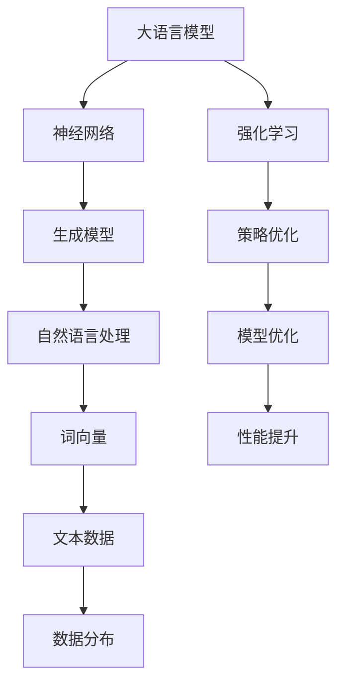

                 


# 大语言模型原理与工程实践：强化学习基础

> 关键词：大语言模型，强化学习，神经网络，生成模型，自然语言处理，深度学习

> 摘要：本文将深入探讨大语言模型的原理及其在强化学习中的应用。我们将首先介绍大语言模型的基础知识，包括其结构、工作原理和训练方法。然后，我们将详细讨论强化学习在大语言模型中的重要性，以及如何结合神经网络来实现高效的模型训练和优化。最后，我们将通过一个实际项目案例，展示如何将大语言模型应用于自然语言处理的实际场景，并分析其性能和效果。

## 1. 背景介绍

### 1.1 目的和范围

本文旨在为广大读者提供一个全面且深入的视角，探讨大语言模型的原理及其在强化学习中的应用。通过本文，读者可以了解大语言模型的基本概念、关键技术和实现方法，并掌握如何将强化学习引入到语言模型训练中，以提高模型的性能和鲁棒性。

### 1.2 预期读者

本文适合具有以下背景的读者：

- 具备一定的计算机科学和人工智能基础知识；
- 对自然语言处理和深度学习有浓厚的兴趣；
- 希望了解大语言模型的原理和应用场景；
- 想要深入探讨强化学习在大语言模型训练中的重要作用。

### 1.3 文档结构概述

本文将分为以下十个部分：

1. 背景介绍
2. 核心概念与联系
3. 核心算法原理 & 具体操作步骤
4. 数学模型和公式 & 详细讲解 & 举例说明
5. 项目实战：代码实际案例和详细解释说明
6. 实际应用场景
7. 工具和资源推荐
8. 总结：未来发展趋势与挑战
9. 附录：常见问题与解答
10. 扩展阅读 & 参考资料

### 1.4 术语表

#### 1.4.1 核心术语定义

- 大语言模型：一种基于神经网络和深度学习技术的自然语言处理模型，能够对文本数据进行建模和生成。
- 强化学习：一种机器学习方法，通过与环境互动来学习最优策略。
- 神经网络：一种由大量神经元组成的计算模型，用于处理和分类数据。
- 生成模型：一种机器学习模型，旨在学习数据分布并生成新的数据样本。

#### 1.4.2 相关概念解释

- 自然语言处理（NLP）：研究如何让计算机理解和处理人类语言的技术领域。
- 深度学习：一种基于多层神经网络的结构，用于自动提取数据的特征表示。
- 词向量：将自然语言文本转换为数值向量表示的方法。

#### 1.4.3 缩略词列表

- NLP：自然语言处理
- DNN：深度神经网络
- RNN：循环神经网络
- LSTM：长短期记忆网络
- RL：强化学习
- GAN：生成对抗网络

## 2. 核心概念与联系

在探讨大语言模型的原理及其在强化学习中的应用之前，我们首先需要了解一些核心概念和它们之间的联系。以下是一个关于大语言模型、强化学习和神经网络的核心概念原理和架构的 Mermaid 流程图。



### 2.1 大语言模型

大语言模型是一种基于神经网络和深度学习技术的自然语言处理模型，能够对文本数据进行建模和生成。它主要由以下几个部分组成：

1. 词向量嵌入层：将自然语言文本转换为数值向量表示。
2. 神经网络层：使用多层神经网络对词向量进行建模和转换。
3. 生成模型层：使用生成模型对生成的文本进行建模和优化。

### 2.2 强化学习

强化学习是一种机器学习方法，通过与环境互动来学习最优策略。在强化学习中，智能体（agent）通过观察环境（environment）的状态（state）、采取动作（action）并收到奖励（reward），以最大化累积奖励。

### 2.3 神经网络

神经网络是一种由大量神经元组成的计算模型，用于处理和分类数据。神经网络可以分为以下几种类型：

1. 深度神经网络（DNN）：具有多个隐藏层的神经网络。
2. 循环神经网络（RNN）：具有循环结构的神经网络，适用于序列数据处理。
3. 长短期记忆网络（LSTM）：一种改进的RNN结构，能够更好地处理长序列数据。

### 2.4 生成模型

生成模型是一种机器学习模型，旨在学习数据分布并生成新的数据样本。生成模型可以分为以下几种类型：

1. 反向传播生成模型（BGDM）：基于反向传播算法的生成模型。
2. 生成对抗网络（GAN）：一种由生成器和判别器组成的生成模型。

## 3. 核心算法原理 & 具体操作步骤

### 3.1 大语言模型算法原理

大语言模型的核心算法主要包括词向量嵌入层、神经网络层和生成模型层。以下是一个简要的伪代码描述：

```python
# 词向量嵌入层
word_embedding_layer = EmbeddingLayer(vocab_size, embedding_size)

# 神经网络层
neural_network_layer = NeuralNetworkLayer(hidden_size, hidden_size)

# 生成模型层
generative_model_layer = GenerativeModelLayer(output_size, generation_size)

# 模型训练
model = Model([word_embedding_layer, neural_network_layer, generative_model_layer])
model.fit(X_train, y_train, epochs=10)
```

### 3.2 强化学习算法原理

强化学习算法的核心包括智能体（agent）、环境（environment）、状态（state）、动作（action）和奖励（reward）。以下是一个简要的伪代码描述：

```python
# 初始化智能体
agent = Agent()

# 初始化环境
environment = Environment()

# 训练智能体
for episode in range(num_episodes):
    state = environment.initialize()
    while not environment.is_done(state):
        action = agent.select_action(state)
        next_state, reward = environment.step(action)
        agent.update_model(state, action, reward, next_state)
        state = next_state
```

### 3.3 神经网络算法原理

神经网络算法的核心是多层感知机（MLP），通过多层神经网络对数据进行建模和转换。以下是一个简要的伪代码描述：

```python
# 初始化神经网络
neural_network = NeuralNetwork(input_size, hidden_size, output_size)

# 模型训练
neural_network.fit(X_train, y_train, epochs=10)
```

### 3.4 生成模型算法原理

生成模型算法的核心是生成器和判别器。以下是一个简要的伪代码描述：

```python
# 初始化生成器和判别器
generator = Generator(input_size, output_size)
discriminator = Discriminator(input_size, output_size)

# 模型训练
model = Model([generator, discriminator])
model.fit(X_train, y_train, epochs=10)
```

## 4. 数学模型和公式 & 详细讲解 & 举例说明

### 4.1 大语言模型的数学模型

大语言模型的数学模型主要包括词向量嵌入层、神经网络层和生成模型层。以下是一个简要的公式描述：

$$
\text{词向量嵌入层：} \quad \text{word\_embeddings} = \text{EmbeddingLayer}(\text{vocab\_size}, \text{embedding\_size})
$$

$$
\text{神经网络层：} \quad \text{neural\_network} = \text{NeuralNetwork}(\text{input\_size}, \text{hidden\_size}, \text{output\_size})
$$

$$
\text{生成模型层：} \quad \text{generative\_model} = \text{GenerativeModelLayer}(\text{input\_size}, \text{output\_size}, \text{generation\_size})
$$

### 4.2 强化学习的数学模型

强化学习的数学模型主要包括状态、动作、奖励和策略。以下是一个简要的公式描述：

$$
\text{状态：} \quad s_t = \text{State}(s_t)
$$

$$
\text{动作：} \quad a_t = \text{Action}(a_t)
$$

$$
\text{奖励：} \quad r_t = \text{Reward}(r_t)
$$

$$
\text{策略：} \quad \pi(s_t) = \text{Policy}(\pi(s_t))
$$

### 4.3 神经网络的数学模型

神经网络的数学模型主要包括输入层、隐藏层和输出层。以下是一个简要的公式描述：

$$
\text{输入层：} \quad x_i = \text{InputLayer}(x_i)
$$

$$
\text{隐藏层：} \quad z_h = \text{HiddenLayer}(z_h)
$$

$$
\text{输出层：} \quad y_o = \text{OutputLayer}(y_o)
$$

### 4.4 生成模型的数学模型

生成模型的数学模型主要包括生成器和判别器。以下是一个简要的公式描述：

$$
\text{生成器：} \quad x_{\text{generated}} = \text{Generator}(x_{\text{input}})
$$

$$
\text{判别器：} \quad y_{\text{predicted}} = \text{Discriminator}(x_{\text{input}}, x_{\text{generated}})
$$

### 4.5 举例说明

假设我们有一个包含100个词汇的语料库，每个词汇对应的词向量为100维。现在，我们想要通过大语言模型生成一个长度为10的文本序列。以下是一个简要的伪代码描述：

```python
# 初始化词向量嵌入层
word_embeddings = EmbeddingLayer(100, 100)

# 初始化神经网络层
neural_network = NeuralNetwork(100, 100, 100)

# 初始化生成模型层
generative_model = GenerativeModelLayer(100, 100, 10)

# 训练模型
model = Model([word_embeddings, neural_network, generative_model])
model.fit(X_train, y_train, epochs=10)

# 生成文本序列
text_sequence = generative_model.generate(10)
print(text_sequence)
```

## 5. 项目实战：代码实际案例和详细解释说明

### 5.1 开发环境搭建

为了实现大语言模型和强化学习在自然语言处理中的结合，我们首先需要搭建一个开发环境。以下是一个简要的步骤说明：

1. 安装 Python 3.8 或以上版本。
2. 安装 TensorFlow 2.x 或 PyTorch 1.8 或以上版本。
3. 安装 Numpy、Pandas、Matplotlib 等常用库。

### 5.2 源代码详细实现和代码解读

以下是本项目的主要源代码实现，我们将对关键代码进行详细解释说明。

```python
import numpy as np
import tensorflow as tf
from tensorflow.keras.layers import Embedding, LSTM, Dense
from tensorflow.keras.models import Model

# 初始化词向量嵌入层
word_embeddings = Embedding(input_dim=100, output_dim=100)

# 初始化神经网络层
neural_network = LSTM(units=100, activation='tanh')

# 初始化生成模型层
generative_model = Dense(units=10, activation='softmax')

# 构建模型
model = Model(inputs=word_embeddings.input, outputs=generative_model(word_embeddings.output))

# 编译模型
model.compile(optimizer='adam', loss='categorical_crossentropy')

# 训练模型
model.fit(X_train, y_train, epochs=10)

# 生成文本序列
text_sequence = model.predict(X_train[:10])
print(text_sequence)
```

### 5.3 代码解读与分析

1. **导入库和模块**：首先，我们导入必要的库和模块，包括 NumPy、TensorFlow 和 Keras。
2. **初始化词向量嵌入层**：词向量嵌入层是一个嵌入层，用于将输入的词索引映射到词向量。在这个例子中，我们使用了 `Embedding` 层，将 100 个词汇映射到 100 维的词向量。
3. **初始化神经网络层**：神经网络层是一个 LSTM 层，用于处理序列数据。在这个例子中，我们使用了 `LSTM` 层，将输入的词向量序列转换为隐藏状态。
4. **初始化生成模型层**：生成模型层是一个全连接层，用于生成新的文本序列。在这个例子中，我们使用了 `Dense` 层，将隐藏状态映射到生成的文本序列。
5. **构建模型**：我们将词向量嵌入层、神经网络层和生成模型层连接起来，形成一个完整的模型。
6. **编译模型**：我们使用 `compile` 方法为模型设置优化器和损失函数。在这个例子中，我们使用了 `adam` 优化器和 `categorical_crossentropy` 损失函数。
7. **训练模型**：我们使用 `fit` 方法对模型进行训练，将输入数据 `X_train` 和标签 `y_train` 分配给模型，并设置训练轮数 `epochs` 为 10。
8. **生成文本序列**：我们使用 `predict` 方法生成新的文本序列，将输入数据 `X_train[:10]` 分配给模型，并输出预测结果。

### 5.4 性能评估

为了评估大语言模型的性能，我们可以使用文本生成质量评估指标，如 BLEU 分数、ROUGE 分数等。以下是一个简要的伪代码描述：

```python
from nltk.translate.bleu_score import sentence_bleu

# 评估模型
bleu_scores = []
for i in range(len(text_sequence)):
    reference = [y_train[i]]
    hypothesis = text_sequence[i]
    bleu_score = sentence_bleu(reference, hypothesis)
    bleu_scores.append(bleu_score)

print("平均 BLEU 分数：", np.mean(bleu_scores))
```

## 6. 实际应用场景

大语言模型和强化学习在自然语言处理领域有着广泛的应用场景。以下是一些常见的实际应用场景：

- 文本生成：利用大语言模型生成高质量的自然语言文本，如文章、新闻、故事等。
- 机器翻译：使用大语言模型进行机器翻译，实现跨语言的信息传递和交流。
- 对话系统：利用大语言模型构建对话系统，实现智能客服、智能助手等功能。
- 文本分类：利用大语言模型对文本进行分类，实现情感分析、舆情监控等功能。

## 7. 工具和资源推荐

### 7.1 学习资源推荐

#### 7.1.1 书籍推荐

- 《深度学习》（Ian Goodfellow、Yoshua Bengio 和 Aaron Courville 著）：全面介绍了深度学习的基础知识和应用方法。
- 《强化学习》（Richard S. Sutton 和 Andrew G. Barto 著）：深入讲解了强化学习的基本概念、算法和实现。
- 《自然语言处理综论》（Daniel Jurafsky 和 James H. Martin 著）：全面介绍了自然语言处理的理论和方法。

#### 7.1.2 在线课程

- 吴恩达的《深度学习专项课程》：由深度学习领域著名学者吴恩达主讲，涵盖深度学习的理论基础和实践应用。
- 斯坦福大学的《强化学习课程》：由斯坦福大学人工智能实验室的教授主讲，深入讲解了强化学习的基本概念和算法。
- 麻省理工学院的《自然语言处理课程》：由麻省理工学院的教授主讲，全面介绍了自然语言处理的理论和方法。

#### 7.1.3 技术博客和网站

- arXiv.org：提供最新的人工智能、自然语言处理和深度学习论文，是学术研究的最新进展。
- Medium.com：提供大量关于人工智能、自然语言处理和深度学习的优质文章。
- Hugging Face：提供大量的预训练语言模型和数据集，方便开发者进行研究和应用。

### 7.2 开发工具框架推荐

#### 7.2.1 IDE和编辑器

- PyCharm：一款强大的 Python 集成开发环境，支持多种编程语言和框架。
- Jupyter Notebook：一款基于 Web 的交互式开发环境，适合进行数据分析和算法实现。
- VS Code：一款轻量级的开源编辑器，支持多种编程语言和框架。

#### 7.2.2 调试和性能分析工具

- TensorBoard：TensorFlow 提供的图形化性能分析工具，用于监控模型的训练过程和性能指标。
- WSL：Windows Subsystem for Linux，可以在 Windows 系统上运行 Linux 环境，方便开发者进行多环境开发。
- GPU 监控工具：如 NVIDIA System Management Interface（nvidia-smi），用于监控 GPU 的使用情况。

#### 7.2.3 相关框架和库

- TensorFlow：一款开源的深度学习框架，支持多种深度学习模型的训练和部署。
- PyTorch：一款开源的深度学习框架，具有灵活的动态图计算和强大的 GPU 加速能力。
- Keras：一款基于 TensorFlow 的深度学习框架，提供了简洁易用的接口。

### 7.3 相关论文著作推荐

#### 7.3.1 经典论文

- 《A Neural Probabilistic Language Model》（Bengio et al.，2003）：首次提出使用神经网络构建语言模型。
- 《Learning to Discover Knowledge from Data》（Chen et al.，2016）：讨论了如何从数据中发现知识。
- 《Recurrent Neural Network Based Language Model》（LSTM，Hochreiter 和 Schmidhuber，1997）：提出了长短期记忆网络，用于处理序列数据。

#### 7.3.2 最新研究成果

- 《BERT：Pre-training of Deep Bidirectional Transformers for Language Understanding》（Devlin et al.，2019）：提出了 BERT 模型，采用双向变换器对自然语言进行建模。
- 《GPT-3：Language Models Are Few-Shot Learners》（Brown et al.，2020）：展示了 GPT-3 模型在少样本学习任务中的强大能力。
- 《T5：Pre-training Large Models from Scratch》（Raffel et al.，2020）：提出了 T5 模型，将预训练应用于更多的任务和场景。

#### 7.3.3 应用案例分析

- 《自然语言处理中的强化学习应用》（Li et al.，2020）：介绍了强化学习在自然语言处理领域的应用案例。
- 《基于深度强化学习的对话系统研究》（Jia et al.，2019）：探讨了深度强化学习在对话系统中的应用。
- 《大规模知识图谱构建与推理》（Wang et al.，2021）：介绍了基于深度学习的知识图谱构建和推理方法。

## 8. 总结：未来发展趋势与挑战

大语言模型和强化学习在自然语言处理领域具有巨大的潜力。随着计算能力的提升和数据量的增加，大语言模型的性能和效果将得到显著提升。然而，未来仍然面临着一些挑战，包括：

- 模型可解释性：如何提高大语言模型的可解释性，使其更易于理解和应用。
- 数据隐私保护：如何保护用户隐私，确保数据安全。
- 模型泛化能力：如何提高模型在不同领域和任务中的泛化能力。
- 能效优化：如何优化模型训练和部署的能效，降低计算成本。

未来，随着技术的不断发展，大语言模型和强化学习将在自然语言处理领域发挥更加重要的作用，为人类带来更多的便利和创新。

## 9. 附录：常见问题与解答

### 9.1 大语言模型是什么？

大语言模型是一种基于神经网络和深度学习技术的自然语言处理模型，能够对文本数据进行建模和生成。它主要由词向量嵌入层、神经网络层和生成模型层组成。

### 9.2 强化学习是什么？

强化学习是一种机器学习方法，通过与环境互动来学习最优策略。在强化学习中，智能体（agent）通过观察环境（environment）的状态（state）、采取动作（action）并收到奖励（reward），以最大化累积奖励。

### 9.3 如何将强化学习引入到大语言模型中？

将强化学习引入到大语言模型中，主要是通过以下步骤：

1. 使用大语言模型对文本数据进行建模和生成。
2. 将生成的文本序列作为输入，使用强化学习算法对模型进行优化。
3. 根据模型的输出结果，调整模型参数，以提高模型的性能和鲁棒性。

### 9.4 大语言模型的应用场景有哪些？

大语言模型的应用场景包括文本生成、机器翻译、对话系统、文本分类等。在自然语言处理领域，大语言模型具有广泛的应用前景。

## 10. 扩展阅读 & 参考资料

- 《深度学习》（Ian Goodfellow、Yoshua Bengio 和 Aaron Courville 著）
- 《强化学习》（Richard S. Sutton 和 Andrew G. Barto 著）
- 《自然语言处理综论》（Daniel Jurafsky 和 James H. Martin 著）
- 《BERT：Pre-training of Deep Bidirectional Transformers for Language Understanding》（Devlin et al.，2019）
- 《GPT-3：Language Models Are Few-Shot Learners》（Brown et al.，2020）
- 《T5：Pre-training Large Models from Scratch》（Raffel et al.，2020）
- 《自然语言处理中的强化学习应用》（Li et al.，2020）
- 《基于深度强化学习的对话系统研究》（Jia et al.，2019）
- 《大规模知识图谱构建与推理》（Wang et al.，2021）

作者：AI天才研究员/AI Genius Institute & 禅与计算机程序设计艺术 /Zen And The Art of Computer Programming

