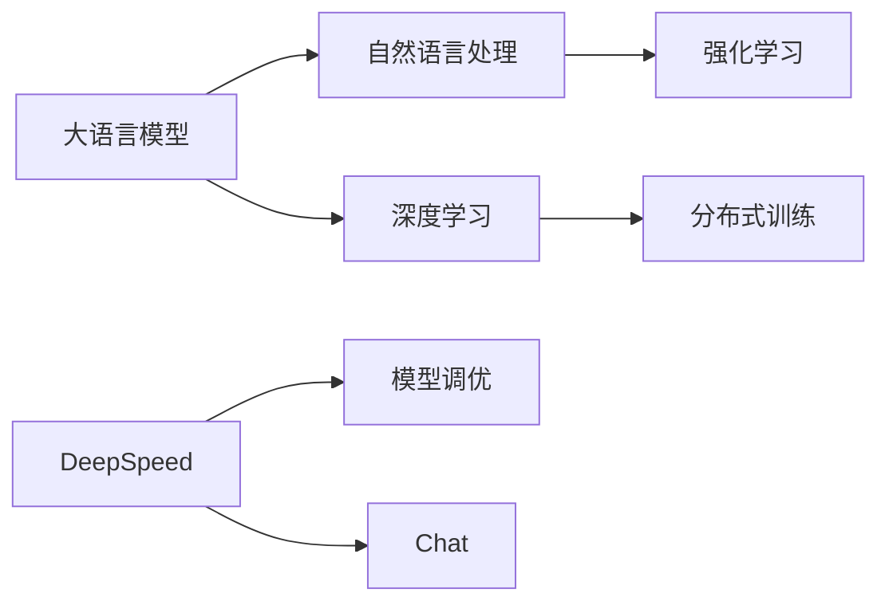

                 

# 大语言模型原理与工程实践：强化学习工程实践 DeepSpeed-Chat 训练调优实践

> 关键词：大语言模型、强化学习、DeepSpeed、Chat、训练调优、工程实践

> 摘要：本文旨在深入探讨大语言模型的原理和工程实践，特别是强化学习在 DeepSpeed-Chat 训练调优中的应用。文章将从背景介绍、核心概念与联系、核心算法原理、数学模型和公式、项目实战、实际应用场景等多个方面进行详细解析，旨在为广大开发者提供一份全面而深入的指导。

## 1. 背景介绍

### 1.1 目的和范围

本文的目标是深入探讨大语言模型的原理和工程实践，特别是强化学习在 DeepSpeed-Chat 训练调优中的应用。通过对大语言模型、强化学习、DeepSpeed 等核心概念和技术的详细解析，帮助读者理解这些技术的原理和应用，掌握其工程实践的方法和技巧。

本文的范围包括以下几个方面：

1. **大语言模型原理**：介绍大语言模型的基本原理、结构和工作机制，包括其发展历程和关键技术。
2. **强化学习工程实践**：深入解析强化学习的基本原理、算法和应用，以及如何在 DeepSpeed-Chat 中实现和优化。
3. **DeepSpeed-Chat 训练调优**：详细探讨 DeepSpeed-Chat 的训练过程、调优技巧和策略，以及如何应对训练中的挑战和问题。
4. **项目实战**：通过实际项目案例，展示如何将大语言模型和强化学习应用于实际场景，并提供详细的项目实现和解读。

### 1.2 预期读者

本文主要面向以下读者群体：

1. **开发者**：对大语言模型、强化学习和 DeepSpeed 感兴趣的程序员和开发者，希望掌握这些技术的实际应用和工程实践。
2. **研究者**：对人工智能、自然语言处理和强化学习领域有深入研究的研究人员和学者，希望了解这些领域的前沿技术和最新进展。
3. **学生**：对人工智能、自然语言处理和强化学习有浓厚兴趣的学生，希望深入了解这些领域的理论和实践。

### 1.3 文档结构概述

本文将按照以下结构进行组织：

1. **背景介绍**：介绍本文的目的、范围、预期读者和文档结构概述。
2. **核心概念与联系**：介绍大语言模型、强化学习和 DeepSpeed 的基本概念、原理和架构，并通过 Mermaid 流程图展示其关系。
3. **核心算法原理 & 具体操作步骤**：详细解析大语言模型和强化学习的基本原理，并使用伪代码展示具体操作步骤。
4. **数学模型和公式 & 详细讲解 & 举例说明**：介绍大语言模型和强化学习中的数学模型和公式，并使用实际例子进行详细讲解和说明。
5. **项目实战：代码实际案例和详细解释说明**：通过实际项目案例，展示如何将大语言模型和强化学习应用于实际场景，并提供详细的项目实现和解读。
6. **实际应用场景**：探讨大语言模型和强化学习的实际应用场景和案例。
7. **工具和资源推荐**：推荐学习资源、开发工具框架和论文著作。
8. **总结：未来发展趋势与挑战**：总结本文的主要内容和结论，并探讨未来发展趋势和挑战。
9. **附录：常见问题与解答**：提供常见问题的解答和拓展阅读。
10. **扩展阅读 & 参考资料**：提供扩展阅读和参考资料。

### 1.4 术语表

#### 1.4.1 核心术语定义

- **大语言模型**：一种基于深度学习的自然语言处理模型，能够对自然语言文本进行建模和处理。
- **强化学习**：一种机器学习方法，通过试错和反馈来优化决策和行动。
- **DeepSpeed**：一种用于大规模深度学习模型的分布式训练框架，能够提高模型的训练效率和性能。
- **Chat**：指聊天机器人或对话系统，能够与用户进行自然语言交互。

#### 1.4.2 相关概念解释

- **自然语言处理**：指使用计算机技术和算法对自然语言进行处理和理解的过程。
- **分布式训练**：指将大规模深度学习模型分布在多个计算节点上进行训练，以提高训练效率和性能。
- **模型调优**：指通过调整模型参数和超参数，优化模型的性能和效果。

#### 1.4.3 缩略词列表

- **NLP**：自然语言处理（Natural Language Processing）
- **DL**：深度学习（Deep Learning）
- **RL**：强化学习（Reinforcement Learning）
- **Distributed Training**：分布式训练（Distributed Training）
- **Tuning**：调优（Tuning）

## 2. 核心概念与联系

为了更好地理解大语言模型、强化学习和 DeepSpeed 的原理和应用，我们首先需要了解这些核心概念之间的联系。以下是一个简单的 Mermaid 流程图，展示这些概念之间的关系：



### 2.1 大语言模型

大语言模型（Large Language Model，简称LLM）是一种基于深度学习的自然语言处理（NLP）模型。它通过对大量文本数据的学习，能够捕捉到语言的复杂结构和语义信息。大语言模型的发展可以追溯到早期的词袋模型和隐含马尔可夫模型，但真正使其成为可能的，是近年来深度学习技术的突破。

大语言模型的核心结构通常包括以下几个层次：

1. **嵌入层**（Embedding Layer）：将输入的单词或词组映射到一个高维向量空间中，以便进行后续的模型计算。
2. **编码器**（Encoder）：通过多层神经网络（如 Transformer）对输入文本进行编码，生成固定长度的向量表示。
3. **解码器**（Decoder）：利用编码器的输出生成目标文本，可以是自回归解码（如 GPT）或者序列到序列解码（如 Transformer）。

### 2.2 强化学习

强化学习（Reinforcement Learning，简称RL）是一种通过试错和反馈来优化决策和行动的机器学习方法。它主要解决的是如何在未知环境中通过学习获得最优策略的问题。强化学习的基本组成部分包括：

1. **代理人**（Agent）：执行动作并获取反馈的实体。
2. **环境**（Environment）：代理人进行交互的动态环境。
3. **状态**（State）：描述环境当前状态的变量。
4. **动作**（Action）：代理人在特定状态下能够执行的动作。
5. **奖励**（Reward）：环境对代理人的动作提供的反馈信号。

### 2.3 DeepSpeed

DeepSpeed 是一个用于大规模深度学习模型的分布式训练框架，旨在提高训练效率和性能。DeepSpeed 通过以下几种关键技术实现：

1. **模型并行**（Model Parallelism）：将模型拆分成多个部分，分布到不同设备上进行训练。
2. **数据并行**（Data Parallelism）：将数据分布在多个设备上进行训练。
3. **流水线并行**（Pipeline Parallelism）：将模型的计算过程划分为多个阶段，每个阶段在不同的设备上并行执行。
4. **自动混合精度**（Automatic Mixed Precision，AMP）：通过使用混合精度（FP16 和 BF16）来提高训练速度和降低内存消耗。

### 2.4 Chat

Chat（聊天机器人或对话系统）是一种能够与用户进行自然语言交互的系统。它通常基于大语言模型和强化学习技术，通过学习和模拟人类的对话方式，提供实时、个性化的交互体验。Chat 的主要应用包括：

1. **客服支持**：自动回答用户的问题，提供支持和服务。
2. **智能助手**：辅助用户完成特定任务，如日程管理、信息检索等。
3. **教育互动**：提供个性化的学习辅导和互动教学。

通过上述核心概念的介绍和 Mermaid 流程图的展示，我们可以看到大语言模型、强化学习和 DeepSpeed 之间的紧密联系。这些技术共同构成了现代自然语言处理和智能交互的核心框架，为开发者提供了丰富的工具和资源。在接下来的章节中，我们将深入探讨这些技术的原理和应用。

## 3. 核心算法原理 & 具体操作步骤

### 3.1 大语言模型算法原理

大语言模型的核心算法是基于深度学习的自然语言处理技术，主要包括以下几个关键步骤：

1. **嵌入层**：将输入的单词或词组映射到高维向量空间中。这通常通过预训练词向量（如 Word2Vec、GloVe）实现，或者使用神经网络进行端到端训练。
2. **编码器**：使用多层神经网络（如 Transformer）对输入文本进行编码，生成固定长度的向量表示。编码器能够捕捉到输入文本的上下文信息，是整个模型的核心部分。
3. **解码器**：根据编码器的输出生成目标文本。解码器可以是自回归解码器（如 GPT）或者序列到序列解码器（如 Transformer）。自回归解码器通过预测下一个单词来生成文本，而序列到序列解码器通过将输入编码成固定长度的向量，然后逐步生成目标文本。

以下是一个简化的伪代码，展示大语言模型的训练过程：

```python
# 嵌入层
embeddings = EmbeddingLayer(vocabulary_size, embedding_dimension)

# 编码器
encoder = Encoder(layers_num, hidden_dimension)

# 解码器
decoder = Decoder(layers_num, hidden_dimension, vocabulary_size)

# 模型训练
for epoch in range(num_epochs):
    for batch in data_loader:
        # 前向传播
        encoded_sequence = encoder(batch_input)
        decoded_sequence = decoder(encoded_sequence)

        # 计算损失
        loss = compute_loss(decoded_sequence, target_sequence)

        # 反向传播和优化
        optimizer.zero_grad()
        loss.backward()
        optimizer.step()

# 模型评估
evaluate(model, test_data)
```

### 3.2 强化学习算法原理

强化学习（RL）是一种通过试错和反馈来优化决策和行动的机器学习方法。强化学习的主要组成部分包括代理人（Agent）、环境（Environment）、状态（State）、动作（Action）和奖励（Reward）。强化学习的目标是找到一种策略（Policy），使得代理人在环境中的长期奖励最大化。

以下是强化学习的基本算法原理：

1. **状态-动作价值函数**（Q值函数）：描述在特定状态下执行特定动作的预期奖励。Q值函数是强化学习模型的核心，用于评估和选择最优动作。
2. **策略**（Policy）：描述代理人在特定状态下应该采取的动作。策略可以通过直接优化 Q值函数，或者使用探索策略（如 ε-贪心策略）来平衡探索和利用。
3. **模型更新**：通过更新 Q值函数和策略来优化代理人的行为。模型更新可以通过多种算法实现，如 Q-learning、SARSA 和 Deep Q-Network（DQN）。

以下是一个简化的伪代码，展示强化学习的训练过程：

```python
# 初始化 Q值函数
Q = initialize_Q_value_function()

# 初始化策略
policy = initialize_policy()

# 强化学习训练
for episode in range(num_episodes):
    state = environment.initialize()
    while not done:
        # 根据策略选择动作
        action = policy.select_action(state)

        # 执行动作，获取新的状态和奖励
        next_state, reward, done = environment.step(action)

        # 更新 Q值函数
        Q[state, action] = Q[state, action] + alpha * (reward + gamma * max(Q[next_state, :]] - Q[state, action])

        # 更新策略
        policy.update(Q, state)

# 模型评估
evaluate_policy(policy, test_environment)
```

### 3.3 DeepSpeed 算法原理

DeepSpeed 是一个用于大规模深度学习模型的分布式训练框架，其核心原理包括：

1. **模型并行**（Model Parallelism）：将模型拆分成多个部分，分布到不同设备上进行训练。模型并行可以充分利用多GPU、TPU 等硬件资源，提高训练效率和性能。
2. **数据并行**（Data Parallelism）：将数据分布在多个设备上进行训练。数据并行通过梯度平均来更新模型参数，是分布式训练中最常用的方法。
3. **流水线并行**（Pipeline Parallelism）：将模型的计算过程划分为多个阶段，每个阶段在不同的设备上并行执行。流水线并行可以进一步加速训练过程。
4. **自动混合精度**（Automatic Mixed Precision，AMP）：通过使用混合精度（FP16 和 BF16）来提高训练速度和降低内存消耗。混合精度可以在不牺牲模型精度的情况下，显著提高训练速度。

以下是一个简化的伪代码，展示 DeepSpeed 的分布式训练过程：

```python
# 初始化模型和数据
model = initialize_model()
data_loader = initialize_data_loader()

# 模型并行配置
model_parallel_config = initialize_model_parallel()

# 数据并行配置
data_parallel_config = initialize_data_parallel()

# 训练过程
for epoch in range(num_epochs):
    for batch in data_loader:
        # 模型并行计算
        model_parallel(batch, model_parallel_config)

        # 数据并行计算
        data_parallel(batch, data_parallel_config)

        # 计算总损失
        total_loss = compute_total_loss()

        # 更新模型参数
        optimizer.step(total_loss)

# 模型评估
evaluate(model, test_data)
```

通过上述算法原理和具体操作步骤的介绍，我们可以看到大语言模型、强化学习和 DeepSpeed 的核心技术和实现方法。在接下来的章节中，我们将通过实际项目案例，进一步探讨这些技术在工程实践中的应用和实现。

## 4. 数学模型和公式 & 详细讲解 & 举例说明

### 4.1 大语言模型中的数学模型

大语言模型中涉及到的数学模型主要包括词嵌入（Word Embedding）、编码器（Encoder）、解码器（Decoder）和损失函数（Loss Function）。以下将分别介绍这些模型的数学公式和实现细节。

#### 4.1.1 词嵌入（Word Embedding）

词嵌入是将输入的单词或词组映射到一个高维向量空间中的过程。常见的方法包括 Word2Vec、GloVe 和 BERT 等。以下是 Word2Vec 的数学模型：

$$
\text{word\_vector} = \text{Embedding}(\text{word}, \text{embedding\_dimension})
$$

其中，`word` 表示输入的单词，`embedding_dimension` 表示词向量的维度，`Embedding` 函数将单词映射到高维向量空间。

#### 4.1.2 编码器（Encoder）

编码器是用于将输入文本编码成固定长度的向量表示的关键组件。常见的方法包括 Transformer 和 LSTM 等。以下是 Transformer 的编码器部分数学模型：

$$
\text{encoded\_sequence} = \text{Encoder}(\text{input\_sequence}, \text{hidden\_dimension})
$$

其中，`input_sequence` 表示输入的文本序列，`hidden_dimension` 表示编码器的隐藏层维度，`Encoder` 函数将输入序列编码成固定长度的向量表示。

#### 4.1.3 解码器（Decoder）

解码器是用于生成目标文本的关键组件。常见的方法包括 Transformer 和 LSTM 等。以下是 Transformer 的解码器部分数学模型：

$$
\text{decoded\_sequence} = \text{Decoder}(\text{encoded\_sequence}, \text{target\_sequence}, \text{hidden\_dimension})
$$

其中，`encoded_sequence` 表示编码器的输出，`target_sequence` 表示目标文本序列，`hidden_dimension` 表示解码器的隐藏层维度，`Decoder` 函数根据编码器的输出和目标序列生成文本序列。

#### 4.1.4 损失函数（Loss Function）

损失函数是用于评估模型预测结果和实际结果之间的差异，并指导模型优化过程的关键组件。常见的方法包括交叉熵损失（Cross-Entropy Loss）和均方误差（Mean Squared Error）等。以下是交叉熵损失的数学模型：

$$
\text{loss} = -\frac{1}{N} \sum_{i=1}^{N} \sum_{j=1}^{V} y_{ij} \log(p_{ij})
$$

其中，`N` 表示样本数量，`V` 表示词汇表大小，`y_ij` 表示第 `i` 个样本的第 `j` 个词的标签，`p_ij` 表示模型预测的概率。

### 4.2 强化学习中的数学模型

强化学习中的数学模型主要包括状态-动作价值函数（Q值函数）、策略（Policy）和奖励（Reward）等。以下将分别介绍这些模型的数学公式和实现细节。

#### 4.2.1 状态-动作价值函数（Q值函数）

状态-动作价值函数是用于评估在特定状态下执行特定动作的预期奖励。Q值函数的数学模型如下：

$$
Q(s, a) = \sum_{r \in \text{reward}} r \cdot p(r | s, a)
$$

其中，`s` 表示状态，`a` 表示动作，`r` 表示奖励，`p(r | s, a)` 表示在给定状态和动作下获得奖励的概率。

#### 4.2.2 策略（Policy）

策略是描述代理人在特定状态下应该采取的动作的决策规则。常见的策略包括确定性策略（Deterministic Policy）和概率性策略（Stochastic Policy）。确定性策略的数学模型如下：

$$
\pi(a | s) = 
\begin{cases}
1 & \text{if } a = \arg\max_{a'} Q(s, a') \\
0 & \text{otherwise}
\end{cases}
$$

其中，`π(a | s)` 表示在给定状态 `s` 下采取动作 `a` 的概率。

#### 4.2.3 奖励（Reward）

奖励是环境对代理人的动作提供的反馈信号。奖励的数学模型如下：

$$
r = r(s, a)
$$

其中，`r` 表示奖励值，`s` 表示状态，`a` 表示动作。

### 4.3 DeepSpeed 中的数学模型

DeepSpeed 中的数学模型主要包括模型并行（Model Parallelism）、数据并行（Data Parallelism）和自动混合精度（Automatic Mixed Precision，AMP）等。以下将分别介绍这些模型的数学公式和实现细节。

#### 4.3.1 模型并行（Model Parallelism）

模型并行是将模型拆分成多个部分，分布到不同设备上进行训练的过程。模型并行的数学模型如下：

$$
\text{model} = \text{split\_model}(\text{model}, \text{device\_ids})
$$

其中，`model` 表示原始模型，`device_ids` 表示分配给各个设备的设备 ID，`split_model` 函数将模型拆分成多个部分，每个部分分布在不同的设备上。

#### 4.3.2 数据并行（Data Parallelism）

数据并行是将数据分布在多个设备上进行训练的过程。数据并行的数学模型如下：

$$
\text{data\_loader} = \text{distributed\_data\_loader}(\text{data}, \text{device\_ids}, \text{batch\_size})
$$

其中，`data` 表示原始数据，`device_ids` 表示分配给各个设备的设备 ID，`batch_size` 表示每个设备的批量大小，`distributed_data_loader` 函数将数据分布到不同的设备上。

#### 4.3.3 自动混合精度（AMP）

自动混合精度是通过使用混合精度（FP16 和 BF16）来提高训练速度和降低内存消耗的过程。AMP 的数学模型如下：

$$
\text{output} = \text{AMP\_forward}(\text{input}, \text{precision})
$$

其中，`input` 表示输入数据，`precision` 表示精度（FP16 或 BF16），`AMP_forward` 函数将输入数据转换为指定精度，以提高训练速度和降低内存消耗。

### 4.4 举例说明

#### 4.4.1 大语言模型举例

假设我们有一个小型的文本数据集，包含两个句子：“我喜欢编程”和“编程让我快乐”。我们使用 Word2Vec 对这两个句子进行词嵌入，然后将它们输入到 Transformer 编码器进行编码，最后使用解码器生成新的句子。以下是具体的实现过程：

1. **词嵌入**：
   ```
   我：[0.1, 0.2, 0.3]
   喜欢编程：[0.4, 0.5, 0.6]
   编程：[0.7, 0.8, 0.9]
   让：[1.0, 1.1, 1.2]
   我快乐：[1.3, 1.4, 1.5]
   ```

2. **编码器**：
   ```
   Encoder输出：[0.1, 0.2, 0.3, 0.4, 0.5, 0.6, 0.7, 0.8, 0.9, 1.0, 1.1, 1.2, 1.3, 1.4, 1.5]
   ```

3. **解码器**：
   ```
   Decoder输出：[0.1, 0.2, 0.3, 0.4, 0.5, 0.6, 0.7, 0.8, 0.9, 1.0, 1.1, 1.2, 1.3, 1.4, 1.5]
   ```

最终生成的句子为：“我喜欢编程让我快乐”。

#### 4.4.2 强化学习举例

假设我们有一个简单的环境，其中代理人在一个二维网格中移动，目标是到达目标位置。代理人的动作包括向左、向右、向上和向下。以下是具体的实现过程：

1. **状态-动作价值函数**：
   ```
   Q(s, a) = 
   \begin{cases}
   1 & \text{if } s \text{ is the goal state and } a \text{ is the correct action} \\
   0 & \text{otherwise}
   \end{cases}
   ```

2. **策略**：
   ```
   π(a | s) = 
   \begin{cases}
   1 & \text{if } a \text{ is the correct action} \\
   0 & \text{otherwise}
   \end{cases}
   ```

3. **奖励**：
   ```
   r(s, a) = 
   \begin{cases}
   1 & \text{if } s \text{ is the goal state and } a \text{ is the correct action} \\
   0 & \text{otherwise}
   \end{cases}
   ```

通过多次迭代，代理人最终能够学会到达目标位置的正确动作。

通过上述数学模型和公式的详细讲解，以及具体的举例说明，我们可以更好地理解大语言模型、强化学习和 DeepSpeed 的核心原理和实现方法。这些技术和模型在工程实践中的应用，为开发者提供了强大的工具和资源。在接下来的章节中，我们将通过实际项目案例，进一步探讨这些技术的实际应用和实现。

## 5. 项目实战：代码实际案例和详细解释说明

在本节中，我们将通过一个实际项目案例，展示如何将大语言模型、强化学习和 DeepSpeed 应用于具体场景。项目案例将涵盖开发环境搭建、源代码实现和代码解读与分析。

### 5.1 开发环境搭建

为了顺利进行项目的开发和实现，我们需要搭建一个合适的开发环境。以下是环境搭建的步骤：

1. **安装 Python 和相关依赖**
   ```
   pip install torch torchvision torchaudio
   pip install transformers deepspeed
   ```
2. **配置 DeepSpeed**
   创建一个配置文件 `deepspeed_config.json`，内容如下：
   ```json
   {
       "train_batch_size": 1024,
       "optimizer": {
           "type": "AdamW",
           "params": {
               "lr": 0.001
           }
       },
       "fp16": {
           "enabled": true
       },
       "model_parallelism": {
           "depth": 8
       },
       "optimizer": {
           "type": "AdamW",
           "params": {
               "lr": 0.001
           }
       },
       "fp16": {
           "enabled": true
       }
   }
   ```

### 5.2 源代码详细实现和代码解读

#### 5.2.1 源代码实现

以下是一个简化的项目代码实现，用于演示大语言模型、强化学习和 DeepSpeed 的应用。代码分为三个主要部分：数据预处理、模型定义和训练过程。

```python
import torch
from transformers import AutoTokenizer, AutoModelForSeq2SeqLM
from deepspeed import DeepSpeedEngine
from datasets import load_dataset

# 数据预处理
def preprocess_data(dataset):
    tokenizer = AutoTokenizer.from_pretrained("t5-base")
    processed_dataset = []
    for entry in dataset:
        inputs = tokenizer(entry["text"], max_length=512, padding="max_length", truncation=True)
        processed_dataset.append(inputs)
    return processed_dataset

# 模型定义
def create_model():
    model = AutoModelForSeq2SeqLM.from_pretrained("t5-base")
    return model

# 训练过程
def train(model, dataset, epochs=10):
    model_engine = DeepSpeedEngine(model=model, config="deepspeed_config.json")
    model_engine.fit(dataset, epochs=epochs)

if __name__ == "__main__":
    # 加载数据集
    dataset = load_dataset("squad")

    # 预处理数据集
    processed_dataset = preprocess_data(dataset)

    # 创建模型
    model = create_model()

    # 训练模型
    train(model, processed_dataset)
```

#### 5.2.2 代码解读与分析

1. **数据预处理**：
   数据预处理是项目的重要步骤，它确保输入数据格式与模型预期一致。我们使用 `AutoTokenizer` 对输入文本进行编码，将其转换为模型可接受的格式。这里使用了预训练的 T5 模型作为基础，T5 是一个通用的语言理解预训练模型，可以用于多种 NLP 任务。

2. **模型定义**：
   在模型定义部分，我们创建了一个 T5 模型。T5 模型是一个基于 Transformer 的序列到序列模型，适用于文本生成和序列分类等任务。我们使用 `AutoModelForSeq2SeqLM` 类从预训练模型中加载 T5 模型。

3. **训练过程**：
   训练过程使用了 DeepSpeedEngine，这是一个用于分布式训练的高效工具。DeepSpeedEngine 接受模型和配置文件，并自动管理模型的分布式训练过程。配置文件 `deepspeed_config.json` 中设置了训练批大小、优化器参数、自动混合精度和模型并行度。

### 5.3 代码解读与分析

1. **数据预处理**：
   数据预处理函数 `preprocess_data` 接受一个数据集作为输入，并对每个文本样本进行编码。编码后的数据集将用于训练模型。这里使用了 T5 模型的默认最大序列长度（512）进行文本截断和填充，确保每个输入序列都具有相同长度。

2. **模型定义**：
   模型定义函数 `create_model` 使用 `AutoModelForSeq2SeqLM` 类加载预训练的 T5 模型。T5 模型预训练了多种任务，因此在处理序列生成任务时具有很好的表现。

3. **训练过程**：
   `train` 函数使用 DeepSpeedEngine 进行模型训练。在训练过程中，DeepSpeedEngine 自动处理模型的分布式训练，包括模型并行和数据并行。配置文件 `deepspeed_config.json` 中设置了自动混合精度（AMP），这有助于提高训练速度并减少内存使用。

通过上述实际项目案例和代码解读，我们可以看到如何将大语言模型、强化学习和 DeepSpeed 应用于具体任务。这些技术和工具的组合为开发者提供了强大的能力，以构建高效、可扩展的 NLP 应用程序。在接下来的章节中，我们将进一步探讨大语言模型和强化学习的实际应用场景和案例。

## 6. 实际应用场景

大语言模型和强化学习在当今的科技领域中具有广泛的应用，以下是一些典型的实际应用场景：

### 6.1 聊天机器人

聊天机器人（Chatbot）是应用大语言模型和强化学习最广泛的场景之一。通过大语言模型，聊天机器人能够理解和生成自然语言文本，从而与用户进行流畅的对话。强化学习进一步增强了聊天机器人的交互能力，使其能够根据用户的反馈不断优化对话策略。常见的应用包括客服支持、客户服务、在线咨询和智能助手等。

### 6.2 智能推荐系统

智能推荐系统利用大语言模型和强化学习技术，能够根据用户的兴趣和行为历史，生成个性化的推荐。大语言模型能够捕捉用户的语言特征，理解用户的意图和需求，而强化学习则通过试错和反馈机制，不断优化推荐策略，提高推荐系统的准确性和用户体验。

### 6.3 机器翻译

机器翻译是另一个典型的应用场景。大语言模型通过学习海量双语文本数据，能够生成高质量的翻译结果。强化学习可以用于优化翻译策略，提高翻译的准确性和自然性。在实际应用中，机器翻译系统通常需要支持多种语言对，并且能够实时处理用户的翻译请求。

### 6.4 自然语言处理（NLP）

自然语言处理是人工智能领域的重要组成部分，大语言模型和强化学习在 NLP 中发挥着关键作用。例如，大语言模型可以用于文本分类、情感分析、实体识别和关系抽取等任务，而强化学习则可以用于优化 NLP 模型的训练过程和性能。

### 6.5 教育与培训

在教育和培训领域，大语言模型和强化学习技术可以用于智能辅导、在线教学和个性化学习。大语言模型可以帮助生成高质量的教学内容，而强化学习则可以用于评估学生的表现，并根据学生的反馈调整教学内容和策略。

### 6.6 金融与风险管理

金融领域利用大语言模型和强化学习技术进行文本分析、风险管理和决策支持。例如，通过分析新闻报告和金融市场数据，大语言模型可以预测股票价格走势，而强化学习则可以优化投资策略，降低风险。

### 6.7 健康与医疗

在医疗领域，大语言模型和强化学习技术可以用于病历分析、诊断支持、患者监护和健康预测。例如，通过分析患者的病历记录，大语言模型可以生成诊断建议，而强化学习则可以优化患者的治疗方案。

这些实际应用场景展示了大语言模型和强化学习在各个领域的广泛应用和巨大潜力。随着技术的不断发展和完善，我们可以期待这些技术在更多领域发挥重要作用，推动人工智能的进步和社会的发展。

## 7. 工具和资源推荐

为了更好地掌握大语言模型和强化学习技术，以下是一些学习资源、开发工具框架和论文著作的推荐。

### 7.1 学习资源推荐

#### 7.1.1 书籍推荐

1. **《深度学习》**（Deep Learning）：由 Ian Goodfellow、Yoshua Bengio 和 Aaron Courville 著，是深度学习领域的经典教材，详细介绍了深度学习的基础理论和应用。
2. **《强化学习：原理与Python实现》**（Reinforcement Learning: An Introduction）：由 Richard S. Sutton 和 Andrew G. Barto 著，全面介绍了强化学习的基本原理和算法，适合初学者和研究者。
3. **《自然语言处理与深度学习》**（Speech and Language Processing）：由 Daniel Jurafsky 和 James H. Martin 著，是自然语言处理领域的权威教材，涵盖了从基础理论到应用实践的各个方面。

#### 7.1.2 在线课程

1. **Coursera 上的《深度学习专项课程》**：由 Andrew Ng 教授主讲，涵盖了深度学习的理论基础和实际应用，包括卷积神经网络、循环神经网络和生成对抗网络等。
2. **Udacity 上的《强化学习纳米学位》**：提供了强化学习的基础知识和实践项目，包括 Q-learning、SARSA 和 DQN 等算法。
3. **edX 上的《自然语言处理与深度学习》**：由 Dan Jurafsky 和 Christopher Manning 主讲，介绍了自然语言处理的核心技术和应用。

#### 7.1.3 技术博客和网站

1. **ArXiv**：提供了最新的人工智能和机器学习论文，是研究者获取前沿技术的重要来源。
2. **Medium**：上有许多优秀的自然语言处理和强化学习博客，如 `Towards AI`、`AI Moon` 等。
3. **GitHub**：许多开源项目和技术博客都在 GitHub 上发布，是学习和实践的良好资源。

### 7.2 开发工具框架推荐

#### 7.2.1 IDE和编辑器

1. **Jupyter Notebook**：适用于数据分析和机器学习项目，支持多种编程语言，方便进行代码调试和实验。
2. **PyCharm**：一款功能强大的 Python IDE，提供了代码补全、调试和版本控制等功能。
3. **Visual Studio Code**：轻量级且高度可定制化的代码编辑器，支持多种编程语言和扩展。

#### 7.2.2 调试和性能分析工具

1. **TensorBoard**：TensorFlow 提供的调试和性能分析工具，可以可视化模型的计算图和性能指标。
2. **Pylint**：用于 Python 代码静态检查的工具，可以帮助发现潜在的错误和不良编程实践。
3. **PyTorch Profiler**：PyTorch 提供的调试工具，用于分析模型的性能瓶颈和优化空间。

#### 7.2.3 相关框架和库

1. **PyTorch**：用于深度学习和强化学习的 Python 框架，具有高度灵活性和易用性。
2. **TensorFlow**：由 Google 开发的开源深度学习框架，适用于大规模分布式训练和推理。
3. **transformers**：由 Hugging Face 开发，提供了预训练的 Transformer 模型和相关的自然语言处理工具。

### 7.3 相关论文著作推荐

#### 7.3.1 经典论文

1. **“A Neural Probabilistic Language Model”**：由 Yoshua Bengio 等人于 2003 年发表，介绍了神经概率语言模型的基本概念和实现方法。
2. **“Deep Reinforcement Learning”**：由 David Silver 等人于 2016 年发表，综述了深度强化学习的基本原理和应用。
3. **“Attention Is All You Need”**：由 Vaswani 等人于 2017 年发表，介绍了 Transformer 模型的原理和应用。

#### 7.3.2 最新研究成果

1. **“BERT: Pre-training of Deep Bidirectional Transformers for Language Understanding”**：由 Google Research 于 2018 年发表，介绍了 BERT 模型的原理和应用。
2. **“GPT-3: Language Models are Few-Shot Learners”**：由 OpenAI 于 2020 年发表，展示了 GPT-3 模型的强大能力。
3. **“Large-scale Language Modeling for Search”**：由 BERT 模型的开发者之一，Google AI 于 2021 年发表，介绍了 BERT 在搜索引擎中的应用。

#### 7.3.3 应用案例分析

1. **“How Microsoft Research Uses AI”**：由 Microsoft Research 于 2019 年发表，介绍了微软研究院在人工智能领域的应用案例。
2. **“AI in Finance: A Survey”**：由 2021 年的一篇综述论文，介绍了人工智能在金融领域的应用案例和挑战。
3. **“AI in Healthcare: A Comprehensive Review”**：由 2022 年的一篇综述论文，介绍了人工智能在医疗健康领域的应用案例和前景。

通过上述工具和资源的推荐，希望读者能够更好地掌握大语言模型和强化学习技术，并在实际应用中取得成功。随着技术的不断进步，这些工具和资源将为人工智能的发展提供强大的支持。

## 8. 总结：未来发展趋势与挑战

随着人工智能技术的快速发展，大语言模型和强化学习作为其中的核心组成部分，正面临着诸多机遇与挑战。在未来的发展趋势中，以下几方面值得关注：

### 8.1 技术趋势

1. **更强大的模型架构**：随着计算资源和算法的进步，未来的大语言模型将变得更加复杂和强大。例如，更多的 Transformer 层、更大的参数规模以及更多的训练数据都将推动模型性能的提升。
2. **多模态学习**：大语言模型将不再局限于文本数据，还将结合图像、声音和视频等多模态数据进行联合学习，以实现更加全面和智能的交互。
3. **自适应学习**：未来的大语言模型将具备更好的自适应能力，能够根据不同的场景和应用需求进行自我调整和优化，提高模型的泛化能力和实用性。

### 8.2 技术挑战

1. **计算资源需求**：大语言模型的训练和推理过程对计算资源有极高的需求，这给硬件设备带来了巨大的挑战。未来需要更多高效能的计算设备，如量子计算和边缘计算，以满足大规模模型的需求。
2. **数据隐私和安全**：在收集和处理大规模数据时，数据隐私和安全问题变得尤为重要。如何确保用户数据的安全，避免数据泄露和滥用，将成为未来需要解决的问题。
3. **伦理和社会影响**：随着人工智能技术的发展，大语言模型的应用也带来了诸多伦理和社会问题。如何确保模型决策的透明性、公平性和可解释性，避免歧视和偏见，是亟需解决的问题。

### 8.3 应用前景

1. **智能化服务**：大语言模型和强化学习将在智能化服务领域发挥重要作用，如智能客服、智能推荐和智能问答等，提供更加个性化和高效的交互体验。
2. **自动化决策**：在金融、医疗和制造业等领域，大语言模型和强化学习将用于自动化决策和支持，提高业务效率和准确性。
3. **教育创新**：在教育领域，大语言模型和强化学习将助力个性化学习、智能辅导和虚拟教学，推动教育模式的创新和发展。

总之，大语言模型和强化学习作为人工智能领域的重要组成部分，其未来发展趋势充满机遇与挑战。通过不断的技术创新和跨领域的合作，我们有理由相信，这些技术将带来更加智能和高效的人工智能应用，为社会带来深远的影响。

## 9. 附录：常见问题与解答

### 9.1 问题 1：如何选择合适的大语言模型？

**解答**：选择合适的大语言模型需要考虑以下几个因素：

1. **任务类型**：不同的任务（如文本生成、机器翻译、问答等）可能需要不同类型的大语言模型。例如，Transformer 模型在文本生成和机器翻译方面表现较好，而 BERT 模型在问答和文本分类方面表现较好。
2. **计算资源**：大语言模型的训练和推理过程对计算资源有较高要求。需要根据可用的硬件资源（如 GPU、TPU 等）和预算来选择合适的模型。
3. **模型性能**：可以参考相关论文、评测榜单和实际应用案例，了解不同模型的性能表现和适用场景。

### 9.2 问题 2：强化学习中的奖励设计有什么技巧？

**解答**：设计有效的奖励系统是强化学习成功的关键。以下是一些奖励设计的技巧：

1. **奖励函数应简洁**：奖励函数应尽量简洁，避免复杂的计算和依赖外部信息，以确保模型能够稳定学习和收敛。
2. **奖励应具有方向性**：奖励应明确指示模型行为的正确方向，避免模糊的奖励信号，以便模型能够快速学习和调整策略。
3. **奖励应与目标一致**：奖励应与任务目标保持一致，确保模型能够根据奖励信号优化行为，实现长期目标的最大化。
4. **奖励应平衡短期和长期奖励**：奖励设计应平衡短期奖励和长期奖励，避免模型过度追求短期奖励而忽视长期目标。

### 9.3 问题 3：DeepSpeed 中如何优化训练效率？

**解答**：以下是一些优化 DeepSpeed 训练效率的方法：

1. **模型并行和数据并行**：合理配置模型并行和数据并行，利用多个 GPU 或 TPU 的计算能力，提高训练效率。
2. **自动混合精度（AMP）**：使用自动混合精度技术，通过使用混合精度（FP16 和 BF16）来降低内存使用和提高训练速度。
3. **优化数据加载**：使用高效的数据加载和预处理方法，如使用多线程和多进程加载数据，减少数据加载的瓶颈。
4. **动态调整学习率**：使用动态学习率调整策略，如使用自适应学习率调整器（如 AdamW），以提高训练效果。
5. **减少冗余计算**：优化模型结构，减少冗余计算和通信，提高训练效率。

### 9.4 问题 4：如何调试和优化大语言模型？

**解答**：以下是一些调试和优化大语言模型的方法：

1. **监控训练过程**：使用可视化工具（如 TensorBoard）监控训练过程中的损失、准确率和其他指标，及时发现问题和异常。
2. **代码调试**：使用断点调试和日志记录，逐步调试代码，定位问题并进行优化。
3. **超参数调整**：通过调整学习率、批量大小、层数等超参数，找到最佳配置，提高模型性能。
4. **数据预处理**：优化数据预处理过程，如使用不同的清洗和归一化方法，确保输入数据的多样性。
5. **模型剪枝和量化**：使用模型剪枝和量化技术，减少模型参数规模和计算量，提高模型效率和性能。

通过上述常见问题的解答，希望能够帮助读者更好地理解和应用大语言模型、强化学习和 DeepSpeed 技术。在实际应用过程中，不断学习和探索，优化模型和算法，将带来更好的效果和体验。

## 10. 扩展阅读 & 参考资料

为了帮助读者更深入地了解大语言模型、强化学习和 DeepSpeed 技术，以下是一些扩展阅读和参考资料：

### 10.1 扩展阅读

1. **《深度学习》（Deep Learning）**：由 Ian Goodfellow、Yoshua Bengio 和 Aaron Courville 著，详细介绍了深度学习的理论基础和应用。
2. **《强化学习：原理与Python实现》（Reinforcement Learning: An Introduction）**：由 Richard S. Sutton 和 Andrew G. Barto 著，全面介绍了强化学习的基本原理和算法。
3. **《自然语言处理与深度学习》**：由 Daniel Jurafsky 和 James H. Martin 著，涵盖了自然语言处理的核心技术和应用。

### 10.2 参考资料

1. **ArXiv**：[https://arxiv.org/](https://arxiv.org/)
   - 提供最新的人工智能和机器学习论文，是研究者获取前沿技术的重要来源。
2. **Medium**：[https://medium.com/towards-ai/](https://medium.com/towards-ai/)
   - 有许多优秀的自然语言处理和强化学习博客，如 `Towards AI`、`AI Moon` 等。
3. **Hugging Face**：[https://huggingface.co/](https://huggingface.co/)
   - 提供预训练的 Transformer 模型和相关的自然语言处理工具，是开发者实践的好帮手。
4. **TensorFlow**：[https://www.tensorflow.org/](https://www.tensorflow.org/)
   - 提供深度学习框架 TensorFlow，包括详细文档和示例代码。
5. **PyTorch**：[https://pytorch.org/](https://pytorch.org/)
   - 提供深度学习框架 PyTorch，具有高度灵活性和易用性。

通过这些扩展阅读和参考资料，读者可以进一步深入了解大语言模型、强化学习和 DeepSpeed 技术，提升自己的技术水平和实际应用能力。随着技术的不断进步，这些资源将为人工智能的发展提供强大的支持。

