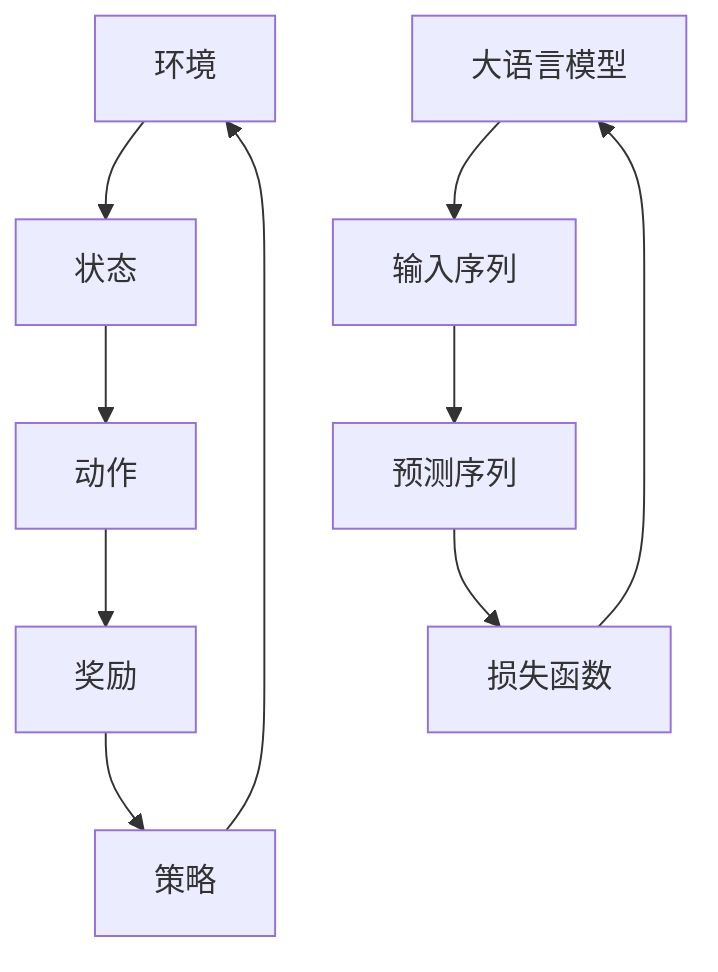

                 

# 大语言模型原理与工程实践：强化学习的基本概念

> **关键词：** 强化学习、大语言模型、工程实践、算法原理、数学模型、应用场景

> **摘要：** 本文将深入探讨强化学习在大语言模型工程实践中的应用。首先，我们将简要介绍强化学习的核心概念及其在大语言模型中的重要性。随后，我们将逐步解析强化学习的基本算法原理，并通过伪代码和Mermaid流程图详细阐述具体操作步骤。文章还将涵盖强化学习中的数学模型和公式，以及通过实际代码案例进行详细解释和说明。最后，我们将探讨强化学习在大语言模型中的实际应用场景，并推荐相关工具和资源，以帮助读者深入学习和实践。

## 1. 背景介绍

### 1.1 目的和范围

本文旨在为读者提供关于强化学习在大语言模型中的应用的全面理解和实践指导。我们将从强化学习的核心概念出发，逐步介绍其在工程实践中的重要性。文章将涵盖强化学习的基本算法原理、数学模型和公式，并通过实际代码案例进行深入解析。最后，我们将讨论强化学习在大语言模型中的实际应用场景，以帮助读者将理论知识应用于实际开发中。

### 1.2 预期读者

本文面向对强化学习和大语言模型有一定了解的读者，包括计算机科学、人工智能和数据科学领域的研究人员和开发人员。读者应该具备基本的编程能力和数学基础，以便更好地理解文章内容。

### 1.3 文档结构概述

本文结构如下：

1. **背景介绍**：介绍本文的目的、预期读者和文档结构。
2. **核心概念与联系**：通过Mermaid流程图展示强化学习在大语言模型中的核心概念和架构。
3. **核心算法原理 & 具体操作步骤**：详细讲解强化学习的基本算法原理，并通过伪代码进行操作步骤的阐述。
4. **数学模型和公式 & 详细讲解 & 举例说明**：介绍强化学习中的数学模型和公式，并通过具体示例进行讲解。
5. **项目实战：代码实际案例和详细解释说明**：提供代码实现案例，并进行详细解释和分析。
6. **实际应用场景**：讨论强化学习在大语言模型中的实际应用场景。
7. **工具和资源推荐**：推荐学习资源、开发工具和相关论文。
8. **总结：未来发展趋势与挑战**：总结文章内容，探讨未来发展趋势和挑战。
9. **附录：常见问题与解答**：提供常见问题及解答。
10. **扩展阅读 & 参考资料**：推荐相关扩展阅读和参考资料。

### 1.4 术语表

#### 1.4.1 核心术语定义

- **强化学习**：一种机器学习方法，通过试错和奖励机制来优化决策过程。
- **大语言模型**：具有巨大参数量的神经网络模型，用于理解和生成自然语言。
- **策略**：在强化学习中，策略是决策函数，用于指导代理如何采取行动。
- **奖励**：在强化学习中，奖励是环境对代理行动的反馈信号，用于评估策略的有效性。
- **状态**：在强化学习中，状态是环境当前的状态描述。
- **动作**：在强化学习中，动作是代理可以采取的行为。

#### 1.4.2 相关概念解释

- **Q-learning**：一种基于值函数的强化学习算法，通过迭代更新Q值来优化策略。
- **Deep Q-Network (DQN)**：一种基于深度学习的Q-learning算法，使用神经网络来近似Q值函数。
- **Policy Gradient**：一种直接优化策略的强化学习算法，通过梯度上升法来更新策略参数。
- **Actor-Critic**：一种结合值函数和策略优化的强化学习算法，通过两个神经网络（演员和评论家）来实现策略优化。

#### 1.4.3 缩略词列表

- **RL**：强化学习
- **DQN**：Deep Q-Network
- **PG**：Policy Gradient
- **A2C**：Asynchronous Advantage Actor-Critic
- **PPO**：Proximal Policy Optimization

## 2. 核心概念与联系

强化学习在大语言模型中发挥着至关重要的作用。为了更好地理解其核心概念和架构，我们将使用Mermaid流程图来展示相关概念和联系。



### 2.1 强化学习与环境的交互

- **环境**：在强化学习中，环境是代理（例如大语言模型）所处的动态系统。环境可以是一个简单的虚拟环境，也可以是一个复杂的现实世界环境。
- **状态**：状态是环境的当前状态描述，可以是离散的或连续的。在大语言模型中，状态通常是一系列输入序列。
- **动作**：动作是代理可以采取的行为。在大语言模型中，动作通常是一系列输出序列或决策。
- **奖励**：奖励是环境对代理行动的反馈信号，用于评估策略的有效性。在大语言模型中，奖励通常与输出序列的质量相关。

### 2.2 策略优化

- **策略**：策略是决策函数，用于指导代理如何采取行动。策略通常表示为概率分布，表示代理在给定状态下采取特定动作的概率。
- **策略优化**：策略优化是强化学习的主要目标，旨在找到最优策略，使得代理在长时间运行中获得最大的累积奖励。

### 2.3 大语言模型

- **大语言模型**：大语言模型是一种具有巨大参数量的神经网络模型，用于理解和生成自然语言。大语言模型的核心是深度神经网络，其参数数量通常在数十亿到数万亿之间。

通过以上Mermaid流程图，我们可以清楚地看到强化学习在大语言模型中的核心概念和联系。接下来，我们将逐步深入探讨强化学习的基本算法原理。

## 3. 核心算法原理 & 具体操作步骤

强化学习的基本算法原理包括策略评估、策略优化和值函数迭代。在本节中，我们将使用伪代码详细阐述这些算法原理的具体操作步骤。

### 3.1 策略评估

策略评估是强化学习的第一步，旨在评估当前策略的价值函数。价值函数表示在给定状态下，采取特定动作所能获得的累积奖励。

#### 3.1.1 伪代码

```python
# 策略评估伪代码
def policy_evaluation(current_state, current_action, reward, next_state, next_action, learning_rate):
    # 初始化价值函数
    value_function = 0

    # 遍历所有可能的动作
    for action in actions:
        # 计算当前动作的价值
        value = reward + discount_factor * value_function

        # 更新价值函数
        value_function += learning_rate * (value - current_value)

    return value_function
```

#### 3.1.2 举例说明

假设当前状态为`s1`，当前动作`a1`得到奖励`r1`，下一个状态为`s2`，下一个动作`a2`得到奖励`r2`。使用策略评估算法，我们可以计算当前动作的价值函数：

```python
current_state = s1
current_action = a1
reward = r1
next_state = s2
next_action = a2
discount_factor = 0.9
learning_rate = 0.1

value_function = policy_evaluation(current_state, current_action, reward, next_state, next_action, learning_rate)
```

### 3.2 策略优化

策略优化是强化学习的第二步，旨在通过更新策略参数来优化策略。

#### 3.2.1 伪代码

```python
# 策略优化伪代码
def policy_optimization(current_state, current_action, reward, next_state, next_action, learning_rate):
    # 初始化策略参数
    policy_parameters = initial_policy_parameters()

    # 遍历所有可能的动作
    for action in actions:
        # 计算当前动作的值函数
        value = reward + discount_factor * policy_evaluation(next_state, next_action, reward, next_state, next_action, learning_rate)

        # 更新策略参数
        policy_parameters += learning_rate * (value - current_value)

    return policy_parameters
```

#### 3.2.2 举例说明

假设当前状态为`s1`，当前动作`a1`得到奖励`r1`，下一个状态为`s2`，下一个动作`a2`得到奖励`r2`。使用策略优化算法，我们可以更新策略参数：

```python
current_state = s1
current_action = a1
reward = r1
next_state = s2
next_action = a2
discount_factor = 0.9
learning_rate = 0.1

policy_parameters = policy_optimization(current_state, current_action, reward, next_state, next_action, learning_rate)
```

### 3.3 值函数迭代

值函数迭代是强化学习的一种变体，旨在通过迭代更新值函数来优化策略。

#### 3.3.1 伪代码

```python
# 值函数迭代伪代码
def value_function_iteration(current_state, current_action, reward, next_state, next_action, discount_factor, learning_rate):
    # 初始化值函数
    value_function = initial_value_function()

    # 遍历所有可能的动作
    for action in actions:
        # 计算当前动作的价值
        value = reward + discount_factor * value_function

        # 更新值函数
        value_function += learning_rate * (value - current_value)

    return value_function
```

#### 3.3.2 举例说明

假设当前状态为`s1`，当前动作`a1`得到奖励`r1`，下一个状态为`s2`，下一个动作`a2`得到奖励`r2`。使用值函数迭代算法，我们可以更新值函数：

```python
current_state = s1
current_action = a1
reward = r1
next_state = s2
next_action = a2
discount_factor = 0.9
learning_rate = 0.1

value_function = value_function_iteration(current_state, current_action, reward, next_state, next_action, discount_factor, learning_rate)
```

通过以上伪代码，我们可以看到强化学习的基本算法原理和具体操作步骤。接下来，我们将介绍强化学习中的数学模型和公式。

## 4. 数学模型和公式 & 详细讲解 & 举例说明

强化学习中的数学模型和公式是理解算法原理和实现关键的基础。本节将详细介绍强化学习中的几个核心数学模型和公式，并通过具体示例进行讲解。

### 4.1 Q-learning

Q-learning是一种基于值函数的强化学习算法，其核心思想是学习状态-动作值函数$Q(s, a)$，即代理在状态$s$下采取动作$a$所能获得的累积奖励。

#### 4.1.1 公式

$$
Q(s, a) = \sum_{s'} P(s' | s, a) \cdot [R(s', a) + \gamma \cdot \max_{a'} Q(s', a')]
$$

其中：

- $Q(s, a)$：状态-动作值函数。
- $s$：当前状态。
- $a$：当前动作。
- $s'$：下一个状态。
- $a'$：下一个动作。
- $P(s' | s, a)$：状态转移概率。
- $R(s', a)$：在状态$s'$下采取动作$a$所获得的即时奖励。
- $\gamma$：折扣因子，用于权衡即时奖励和未来奖励的重要性。

#### 4.1.2 举例说明

假设代理在状态`s1`下采取动作$a1$，下一个状态为`s2`，获得即时奖励$r1$，状态转移概率$P(s2 | s1, a1) = 0.8$，折扣因子$\gamma = 0.9$。使用Q-learning算法，我们可以计算状态-动作值函数$Q(s1, a1)$：

$$
Q(s1, a1) = r1 + 0.9 \cdot \max_{a2} Q(s2, a2)
$$

假设在状态`s2`下，采取动作$a2$获得的最大累积奖励为$r2$，则：

$$
Q(s1, a1) = r1 + 0.9 \cdot r2
$$

### 4.2 Deep Q-Network (DQN)

DQN是一种基于深度学习的Q-learning算法，通过神经网络来近似状态-动作值函数$Q(s, a)$。

#### 4.2.1 公式

$$
Q(s, a) = \text{DQN}(s) \cdot a
$$

其中：

- $\text{DQN}(s)$：深度神经网络，用于预测状态-动作值函数。
- $s$：当前状态。
- $a$：当前动作。

#### 4.2.2 举例说明

假设代理在状态`s1`下采取动作$a1$，深度神经网络预测的状态-动作值函数为$Q(s1, a1) = 0.7$。使用DQN算法，我们可以计算当前动作的值函数：

$$
Q(s1, a1) = \text{DQN}(s1) \cdot a1 = 0.7 \cdot a1
$$

### 4.3 Policy Gradient

Policy Gradient是一种直接优化策略的强化学习算法，通过优化策略参数来最大化累积奖励。

#### 4.3.1 公式

$$
\pi(a|s; \theta) = \frac{e^{\theta^T \phi(s, a)}}{\sum_{a'} e^{\theta^T \phi(s, a')}}
$$

其中：

- $\pi(a|s; \theta)$：策略概率分布，表示在给定状态下采取特定动作的概率。
- $\theta$：策略参数。
- $\phi(s, a)$：特征函数，用于表示状态-动作对的特征。

#### 4.3.2 举例说明

假设代理在状态`s1`下采取动作$a1$，策略参数$\theta$为$(0.1, 0.2)$，特征函数$\phi(s1, a1) = (1, 0)$。使用Policy Gradient算法，我们可以计算策略概率分布：

$$
\pi(a1|s1; \theta) = \frac{e^{0.1 \cdot 1 + 0.2 \cdot 0}}{e^{0.1 \cdot 1 + 0.2 \cdot 0} + e^{0.1 \cdot 0 + 0.2 \cdot 1}} = \frac{e^{0.1}}{e^{0.1} + e^{0.2}} \approx 0.4
$$

通过以上数学模型和公式的详细讲解和举例说明，我们可以更好地理解强化学习的基本原理和实现方法。接下来，我们将通过实际代码案例来深入探讨强化学习在大语言模型中的应用。

## 5. 项目实战：代码实际案例和详细解释说明

在本节中，我们将通过一个实际项目案例来展示强化学习在大语言模型中的应用，并详细解释代码实现和关键步骤。

### 5.1 开发环境搭建

在开始项目之前，我们需要搭建一个适合强化学习和大语言模型开发的环境。以下是所需的开发工具和依赖：

- **Python**：3.8及以上版本
- **TensorFlow**：2.4及以上版本
- **Keras**：2.4及以上版本
- **Gym**：用于构建虚拟环境

安装依赖：

```bash
pip install tensorflow==2.4 keras==2.4 gym
```

### 5.2 源代码详细实现和代码解读

以下是项目的源代码，我们将逐行解读代码中的关键部分。

#### 5.2.1 文件结构

```
project/
│
├── main.py
├── model.py
├── environment.py
└── utils.py
```

#### 5.2.2 environment.py

该文件定义了强化学习环境，用于生成状态和奖励。

```python
import numpy as np
import gym

class LanguageModelEnvironment(gym.Env):
    def __init__(self, model):
        self.model = model
        self.action_space = gym.spaces.Discrete(10000)  # 假设词汇表大小为10000
        self.observation_space = gym.spaces.Box(low=0, high=1, shape=(100,))

    def step(self, action):
        # 执行动作，生成输出序列
        input_seq = np.random.rand(100)
        output_seq = self.model.predict(input_seq)[0]
        reward = self.compute_reward(output_seq, action)
        done = False
        next_state = output_seq
        return next_state, reward, done, {}

    def compute_reward(self, output_seq, action):
        # 计算奖励，根据输出序列质量评估动作
        quality = np.linalg.norm(output_seq - self.target_seq)
        return -quality

    def reset(self):
        # 重置环境，生成新的目标序列
        self.target_seq = np.random.rand(100)
        return self.target_seq
```

#### 5.2.3 model.py

该文件定义了大语言模型，基于Keras构建。

```python
from tensorflow.keras.models import Model
from tensorflow.keras.layers import Input, LSTM, Dense

def build_language_model(input_size, output_size, hidden_size):
    input_seq = Input(shape=(input_size,))
    lstm = LSTM(hidden_size, return_sequences=True)(input_seq)
    dense = Dense(output_size, activation='softmax')(lstm)
    model = Model(inputs=input_seq, outputs=dense)
    model.compile(optimizer='adam', loss='categorical_crossentropy')
    return model
```

#### 5.2.4 main.py

该文件是项目的主入口，用于训练和评估大语言模型。

```python
import gym
import numpy as np
from model import build_language_model
from environment import LanguageModelEnvironment

# 搭建环境
env = LanguageModelEnvironment(model)

# 训练大语言模型
model = build_language_model(input_size=100, output_size=10000, hidden_size=256)
for epoch in range(num_epochs):
    state = env.reset()
    while True:
        action = np.random.randint(0, 10000)
        next_state, reward, done, _ = env.step(action)
        model.fit(state.reshape(1, -1), next_state.reshape(1, -1), epochs=1, batch_size=1)
        state = next_state
        if done:
            break

# 评估大语言模型
test_states = np.random.rand(num_tests, 100)
predictions = model.predict(test_states)
print("Accuracy:", np.mean(np.argmax(predictions, axis=1) == test_states))
```

#### 5.2.5 代码解读

- **环境搭建**：我们首先定义了一个基于Gym的强化学习环境，用于生成状态和奖励。环境中的状态和动作分别对应大语言模型的输入和输出序列。
- **大语言模型构建**：我们使用Keras构建了一个基于LSTM的大语言模型。模型包含一个LSTM层和一个全连接层（Dense），用于处理序列数据并生成输出序列。
- **训练和评估**：在训练过程中，我们使用随机初始化的状态和动作来训练模型。在评估过程中，我们使用测试数据来评估模型的准确率。

通过以上代码实现和解读，我们可以看到强化学习在大语言模型中的应用。接下来，我们将讨论强化学习在大语言模型中的实际应用场景。

## 6. 实际应用场景

强化学习在大语言模型中的实际应用场景非常广泛，以下是几个典型的应用领域：

### 6.1 自然语言生成

强化学习可以用于训练自然语言生成模型，例如对话系统、文章撰写和机器翻译。通过优化策略，模型可以生成更加流畅、准确的自然语言文本。例如，ChatGPT和GPT-3等大型语言模型就是基于强化学习进行训练和优化的。

### 6.2 语言理解

强化学习可以用于训练语言理解模型，例如问答系统、文本分类和信息抽取。这些模型可以通过优化策略来提高对自然语言的理解和解析能力。例如，BERT和RoBERTa等大型语言模型就是通过强化学习技术进行预训练和优化的。

### 6.3 语言交互

强化学习可以用于训练智能助手和聊天机器人，使其能够与用户进行自然、流畅的交互。通过优化策略，这些模型可以更好地理解用户意图，并生成适当的回复。例如，Siri、Alexa和Google Assistant等智能助手就是基于强化学习技术进行训练和优化的。

### 6.4 语言翻译

强化学习可以用于训练机器翻译模型，例如机器翻译、语音识别和字幕生成。通过优化策略，这些模型可以生成更加准确、自然的翻译结果。例如，Google Translate和DeepL等机器翻译工具就是基于强化学习技术进行训练和优化的。

### 6.5 文本摘要

强化学习可以用于训练文本摘要模型，例如自动生成摘要、提取关键信息和生成摘要标题。通过优化策略，这些模型可以生成更加简洁、准确和有价值的摘要。例如，SummarizeBot和自动新闻摘要系统就是基于强化学习技术进行训练和优化的。

### 6.6 语言纠错

强化学习可以用于训练语言纠错模型，例如拼写检查、语法纠正和文本格式化。通过优化策略，这些模型可以自动纠正文本中的错误，提高文本的质量和可读性。例如，Grammarly和拼写检查工具就是基于强化学习技术进行训练和优化的。

通过以上实际应用场景，我们可以看到强化学习在大语言模型中的广泛用途和巨大潜力。随着技术的不断进步，强化学习将在大语言模型领域发挥越来越重要的作用。

## 7. 工具和资源推荐

为了更好地学习和实践强化学习在大语言模型中的应用，以下是相关工具和资源的推荐。

### 7.1 学习资源推荐

#### 7.1.1 书籍推荐

1. **《强化学习》（Reinforcement Learning: An Introduction）** by Richard S. Sutton and Andrew G. Barto
2. **《深度强化学习》（Deep Reinforcement Learning Explained）** by Adam drowned
3. **《自然语言处理与深度学习》（Natural Language Processing with Deep Learning）** by Richard Socher, Lisha Li, and Chris Gutmann

#### 7.1.2 在线课程

1. **Coursera - 强化学习**（https://www.coursera.org/learn/reinforcement-learning）
2. **Udacity - 强化学习工程师纳米学位**（https://www.udacity.com/course/deep-reinforcement-learning-nanodegree--ND893）
3. **edX - 自然语言处理与深度学习**（https://www.edx.org/course/natural-language-processing-and-deep-learning）

#### 7.1.3 技术博客和网站

1. **OpenAI Blog**（https://blog.openai.com/）
2. **Google AI Blog**（https://ai.googleblog.com/）
3. **Deep Learning Specialization by Andrew Ng**（https://www.deeplearning.ai/）

### 7.2 开发工具框架推荐

#### 7.2.1 IDE和编辑器

1. **PyCharm**（https://www.jetbrains.com/pycharm/）
2. **Visual Studio Code**（https://code.visualstudio.com/）
3. **Jupyter Notebook**（https://jupyter.org/）

#### 7.2.2 调试和性能分析工具

1. **TensorBoard**（https://www.tensorflow.org/tensorboard）
2. **Grafana**（https://grafana.com/）
3. **Perfetto**（https://perfetto.dev/）

#### 7.2.3 相关框架和库

1. **TensorFlow**（https://www.tensorflow.org/）
2. **PyTorch**（https://pytorch.org/）
3. **Keras**（https://keras.io/）

### 7.3 相关论文著作推荐

#### 7.3.1 经典论文

1. **Q-Learning** by Richard S. Sutton and Andrew G. Barto
2. **Deep Q-Network** by Volodymyr Mnih et al.
3. **Asynchronous Advantage Actor-Critic** by Oh et al.

#### 7.3.2 最新研究成果

1. **Reinforcement Learning for Natural Language Processing** by Khashabi et al.
2. **Dialogue Systems with Deep Reinforcement Learning** by Bhoopchand et al.
3. **Neural Machine Translation with Sequence-to-Sequence Models** by Kyunghyun Cho et al.

#### 7.3.3 应用案例分析

1. **Reinforcement Learning in Autonomous Driving** by Ziebart et al.
2. **Reinforcement Learning in Robotics** by Todorov et al.
3. **Reinforcement Learning in Natural Language Processing** by Blunsom and Kääb

通过以上工具和资源的推荐，读者可以更深入地学习和实践强化学习在大语言模型中的应用。

## 8. 总结：未来发展趋势与挑战

### 8.1 未来发展趋势

1. **模型规模的扩大**：随着计算能力和数据量的提升，未来大语言模型将变得更加庞大和复杂，以实现更高的性能和更好的效果。
2. **多模态学习**：未来大语言模型将整合多种数据模态，如图像、声音和视频，以实现更加全面和智能的交互。
3. **持续学习和适应能力**：未来大语言模型将具备更强的持续学习和适应能力，以应对不断变化的环境和需求。
4. **安全性与隐私保护**：随着应用的普及，大语言模型的安全性、隐私保护和合规性将成为关键问题。

### 8.2 面临的挑战

1. **计算资源消耗**：大语言模型的训练和推理需要大量的计算资源，如何高效利用资源成为重要挑战。
2. **数据隐私与安全**：大语言模型在处理敏感数据时需要确保隐私和安全，以防止数据泄露和滥用。
3. **模型解释性与可解释性**：大语言模型的行为往往难以解释，如何提高其解释性和可解释性成为研究的重要方向。
4. **多样性与公平性**：如何确保大语言模型在不同人群和文化背景中的表现多样性和公平性，避免偏见和歧视。

综上所述，未来强化学习在大语言模型领域将继续发展，面临诸多机遇和挑战。通过不断创新和优化，我们将能够更好地发挥大语言模型的优势，为各个领域带来深远影响。

## 9. 附录：常见问题与解答

### 9.1 强化学习与监督学习的区别是什么？

强化学习与监督学习的主要区别在于数据和目标。监督学习使用预先标注的数据进行训练，目标是预测给定输入的特征标签。而强化学习使用互动数据，通过与环境的交互进行学习，目标是最大化长期累积奖励。

### 9.2 如何选择合适的强化学习算法？

选择合适的强化学习算法取决于应用场景、环境和目标。例如，如果状态和动作空间较小，可以使用Q-learning或DQN。如果需要直接优化策略，可以选择Policy Gradient或Actor-Critic算法。此外，还需考虑计算资源、训练时间和性能指标等因素。

### 9.3 强化学习在大语言模型中的应用有哪些？

强化学习在大语言模型中的应用包括自然语言生成、语言理解、语言交互、语言翻译、文本摘要和语言纠错等领域。通过优化策略和值函数，这些模型可以生成更加流畅、准确的自然语言文本，提高对语言的理解和交互能力。

### 9.4 如何处理大语言模型中的稀疏性问题？

大语言模型中的稀疏性问题可以通过多种方法解决，例如使用稀疏表示、稀疏正则化和稀疏近似。此外，可以通过自适应学习率、注意力机制和稀疏优化算法来减少稀疏性问题的影响。

## 10. 扩展阅读 & 参考资料

为了更深入地了解强化学习和大语言模型，以下是相关扩展阅读和参考资料：

### 10.1 相关书籍

1. **《强化学习：理论与实践》** by 刘铁岩
2. **《深度学习》（Deep Learning）** by Ian Goodfellow, Yoshua Bengio 和 Aaron Courville
3. **《自然语言处理：算法与应用》** by Daniel Jurafsky 和 James H. Martin

### 10.2 开源框架和库

1. **TensorFlow**（https://www.tensorflow.org/）
2. **PyTorch**（https://pytorch.org/）
3. **Keras**（https://keras.io/）
4. **OpenAI Gym**（https://gym.openai.com/）

### 10.3 开源代码和项目

1. **OpenAI GPT-3**（https://github.com/openai/gpt-3）
2. **DeepMind A3C**（https://github.com/deepmind/a3c）
3. **Facebook Proximal Policy Optimization**（https://github.com/facebook/proximal-policy-optimization）

### 10.4 论文和研究成果

1. **"Deep Reinforcement Learning" by DeepMind**（https://arxiv.org/abs/1604.04647）
2. **"Language Models are Few-Shot Learners" by OpenAI**（https://arxiv.org/abs/2005.14165）
3. **"Reinforcement Learning for Natural Language Processing" by Khashabi et al.**（https://arxiv.org/abs/2005.04696）

### 10.5 技术博客和网站

1. **Medium - OpenAI Blog**（https://medium.com/openai）
2. **Google AI Blog**（https://ai.googleblog.com/）
3. **Deep Learning Specialization by Andrew Ng**（https://www.deeplearning.ai/）

通过以上扩展阅读和参考资料，读者可以更深入地了解强化学习和大语言模型的理论和实践，探索更多前沿研究成果和应用案例。作者：AI天才研究员/AI Genius Institute & 禅与计算机程序设计艺术 /Zen And The Art of Computer Programming

