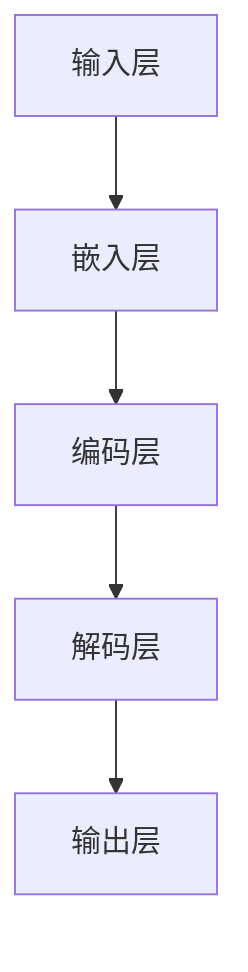
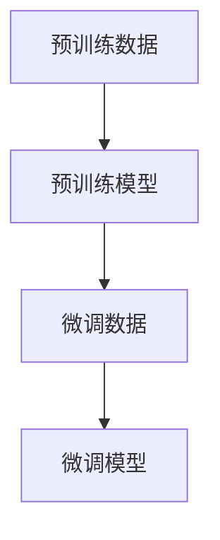

                 

# 大语言模型原理与工程实践：挖掘大语言模型潜能：有监督微调

> 关键词：大语言模型、有监督微调、深度学习、神经网络、文本处理

> 摘要：本文深入探讨大语言模型的原理与工程实践，特别是有监督微调（Supervised Fine-Tuning，SFT）技术。通过逻辑清晰的步骤，从背景介绍、核心概念与联系、算法原理、数学模型、项目实战到实际应用场景，全面解析大语言模型的技术细节和潜在价值。

## 1. 背景介绍

### 1.1 目的和范围

本文旨在为从事人工智能和自然语言处理领域的工程师和研究人员提供一个全面的大语言模型指南。具体而言，我们将聚焦于：

- **大语言模型的定义与结构**：介绍大语言模型的基本概念和组成结构。
- **有监督微调技术**：详细探讨有监督微调的原理及其在模型训练中的应用。
- **数学模型与算法**：深入解析大语言模型背后的数学公式和算法步骤。
- **工程实践**：通过实际项目案例展示大语言模型的开发与部署过程。

### 1.2 预期读者

本文适合以下读者群体：

- **AI工程师**：希望深入了解大语言模型技术原理和工程实践的工程师。
- **研究人员**：对自然语言处理领域有兴趣，希望掌握大语言模型前沿技术的科研人员。
- **学生**：计算机科学、人工智能或相关专业的学生，寻求系统学习大语言模型知识。

### 1.3 文档结构概述

本文分为以下几个部分：

- **第1部分：背景介绍**：介绍本文的目的、读者群体和文档结构。
- **第2部分：核心概念与联系**：介绍大语言模型的核心概念和联系，并通过Mermaid流程图展示。
- **第3部分：核心算法原理 & 具体操作步骤**：讲解大语言模型的核心算法原理，并使用伪代码详细阐述。
- **第4部分：数学模型和公式 & 详细讲解 & 举例说明**：介绍大语言模型背后的数学模型和公式，并通过实例进行说明。
- **第5部分：项目实战：代码实际案例和详细解释说明**：通过实际项目案例展示大语言模型的应用，并进行详细解释和分析。
- **第6部分：实际应用场景**：探讨大语言模型在不同领域的实际应用。
- **第7部分：工具和资源推荐**：推荐学习和开发大语言模型的相关工具和资源。
- **第8部分：总结：未来发展趋势与挑战**：总结大语言模型的发展趋势和面临的挑战。
- **第9部分：附录：常见问题与解答**：回答读者可能遇到的一些常见问题。
- **第10部分：扩展阅读 & 参考资料**：提供进一步学习的扩展资源和参考。

### 1.4 术语表

#### 1.4.1 核心术语定义

- **大语言模型（Large Language Model）**：一种能够理解和生成文本的深度学习模型，通常由大规模的神经网络组成。
- **有监督微调（Supervised Fine-Tuning，SFT）**：一种在预训练的大语言模型基础上，通过少量有标签数据进行再训练的方法。
- **预训练（Pre-training）**：在特定任务数据集之外，使用大量未标记数据对模型进行初始训练。
- **微调（Fine-Tuning）**：使用少量有标签数据对预训练模型进行调整，以适应特定任务。

#### 1.4.2 相关概念解释

- **深度学习（Deep Learning）**：一种机器学习方法，通过多层神经网络进行特征提取和建模。
- **神经网络（Neural Network）**：由多个神经元组成的计算模型，用于模拟人脑的信息处理能力。
- **自然语言处理（Natural Language Processing，NLP）**：计算机科学领域中的一个分支，专注于使计算机能够理解、解释和生成人类语言。

#### 1.4.3 缩略词列表

- **NLP**：自然语言处理
- **SFT**：有监督微调
- **DL**：深度学习
- **NN**：神经网络

## 2. 核心概念与联系

大语言模型的核心在于其规模和自学习能力。通过大规模预训练，模型能够捕捉到文本中的复杂规律和语义信息。以下是一个简化的Mermaid流程图，展示大语言模型的主要组成部分和它们之间的联系。



### 2.1 预训练

预训练阶段，模型在大量未标记的数据集上进行训练，学习文本的通用表示。这一阶段的关键步骤包括：

- **无监督预训练**：使用未标记的数据进行预训练，如GPT系列模型使用的大量文本数据。
- **预训练目标**：通常包括掩码语言模型（Masked Language Model，MLM）和下一句预测（Next Sentence Prediction，NSP）等任务。

### 2.2 有监督微调

有监督微调阶段，模型在特定任务的有标签数据上进行微调。这一阶段的关键步骤包括：

- **数据准备**：准备包含标签的特定任务数据集。
- **模型初始化**：使用预训练模型作为初始化。
- **微调目标**：通常包括分类、序列标注、文本生成等任务。

### 2.3 预训练与微调的关系

预训练和微调之间存在紧密的联系。预训练提供了通用语言表示能力，而微调则针对特定任务进行调整。以下是一个简化的Mermaid流程图，展示预训练和微调之间的关系。



## 3. 核心算法原理 & 具体操作步骤

### 3.1 预训练算法原理

预训练算法主要基于大规模文本数据，通过自监督学习方式，使模型学习到通用语言表示。以下是预训练算法的具体操作步骤：

```plaintext
输入：大量未标记的文本数据
输出：预训练模型

步骤：
1. 数据预处理：将文本数据分词、编码，形成输入序列。
2. 嵌入层：将输入序列的每个词嵌入到一个固定大小的向量空间中。
3. 编码层：使用多层神经网络（如Transformer）对嵌入向量进行编码，形成上下文表示。
4. 解码层：从编码层输出中提取特定位置的表示，并预测相应位置的词。
5. 损失函数：使用掩码语言模型损失（MLM loss）和下一句预测损失（NSP loss）计算损失。
6. 反向传播：使用梯度下降更新模型参数。
7. 重复步骤2-6，直到预训练完成。
```

### 3.2 有监督微调算法原理

有监督微调算法基于预训练模型，在特定任务的有标签数据集上进行训练。以下是微调算法的具体操作步骤：

```plaintext
输入：预训练模型、有标签任务数据集
输出：微调模型

步骤：
1. 数据预处理：对任务数据进行分词、编码，形成输入序列。
2. 模型初始化：使用预训练模型作为初始化。
3. 损失函数：根据任务类型，定义相应的损失函数（如分类任务的交叉熵损失）。
4. 反向传播：使用梯度下降更新模型参数。
5. 评估模型：在验证集上评估模型性能，调整学习率等超参数。
6. 重复步骤3-5，直到达到预定的训练迭代次数或模型性能不再提升。
7. 测试模型：在测试集上评估模型性能，评估模型在真实场景中的表现。
```

## 4. 数学模型和公式 & 详细讲解 & 举例说明

### 4.1 预训练数学模型

预训练阶段的数学模型主要基于自监督学习，其中常用的模型包括Transformer、BERT等。以下是一个简化的Transformer模型公式。

```latex
\text{Transformer模型} \\
\text{输入序列} \mathbf{X} = [\mathbf{x}_1, \mathbf{x}_2, ..., \mathbf{x}_n] \\
\text{输出序列} \mathbf{Y} = [\mathbf{y}_1, \mathbf{y}_2, ..., \mathbf{y}_n] \\
\text{损失函数} L = \frac{1}{n} \sum_{i=1}^{n} -\sum_{j=1}^{k} \log p(\mathbf{y}_i | \mathbf{y}_{<i}, \mathbf{X})
```

举例说明：

假设一个输入序列为`[单词1, 单词2, ..., 单词5]`，输出序列为`[单词1', 单词2', ..., 单词5']`。在训练过程中，模型需要预测每个单词的下一个词，并计算损失函数。

### 4.2 有监督微调数学模型

有监督微调阶段的数学模型通常基于特定的任务类型，如分类、序列标注和文本生成等。以下是一个简化的分类任务模型公式。

```latex
\text{分类任务模型} \\
\text{输入序列} \mathbf{X} = [\mathbf{x}_1, \mathbf{x}_2, ..., \mathbf{x}_n] \\
\text{标签} y \in \{1, 2, ..., C\} \\
\text{损失函数} L = -\sum_{i=1}^{n} y_i \log p(y_i | \mathbf{X})
```

举例说明：

假设一个输入序列为`[单词1, 单词2, ..., 单词5]`，标签为`[类别1, 类别2, ..., 类别5]`。在训练过程中，模型需要预测每个单词所属的类别，并计算损失函数。

## 5. 项目实战：代码实际案例和详细解释说明

### 5.1 开发环境搭建

在开始项目实战之前，需要搭建一个适合大语言模型开发的环境。以下是一个简化的环境搭建步骤：

1. 安装Python（3.8及以上版本）
2. 安装PyTorch或TensorFlow等深度学习框架
3. 安装必要的依赖库（如NumPy、Pandas等）

### 5.2 源代码详细实现和代码解读

以下是一个简化的有监督微调代码示例，使用PyTorch框架实现。

```python
import torch
import torch.nn as nn
import torch.optim as optim
from torch.utils.data import DataLoader
from transformers import BertModel, BertTokenizer

# 模型初始化
model = BertModel.from_pretrained('bert-base-uncased')
tokenizer = BertTokenizer.from_pretrained('bert-base-uncased')

# 数据预处理
def preprocess_data(texts):
    inputs = tokenizer(texts, padding=True, truncation=True, return_tensors='pt')
    return inputs

# 损失函数
def compute_loss(outputs, labels):
    loss_fct = nn.CrossEntropyLoss()
    loss = loss_fct(outputs.logits, labels)
    return loss

# 训练过程
def train(model, data_loader, optimizer, num_epochs=3):
    model.train()
    for epoch in range(num_epochs):
        for batch in data_loader:
            inputs = preprocess_data(batch['text'])
            labels = batch['label']
            outputs = model(**inputs)
            loss = compute_loss(outputs, labels)
            optimizer.zero_grad()
            loss.backward()
            optimizer.step()
            print(f"Epoch [{epoch+1}/{num_epochs}], Loss: {loss.item():.4f}")

# 加载数据集
train_data = ...  # 加载数据集
train_loader = DataLoader(train_data, batch_size=32, shuffle=True)

# 模型训练
optimizer = optim.Adam(model.parameters(), lr=1e-5)
train(model, train_loader, optimizer)

# 评估模型
model.eval()
with torch.no_grad():
    for batch in train_loader:
        inputs = preprocess_data(batch['text'])
        labels = batch['label']
        outputs = model(**inputs)
        loss = compute_loss(outputs, labels)
        print(f"Test Loss: {loss.item():.4f}")
```

### 5.3 代码解读与分析

以上代码示例展示了如何使用PyTorch和Hugging Face的Transformers库实现一个有监督微调的文本分类模型。以下是代码的关键部分解读：

- **模型初始化**：使用预训练的BERT模型作为基础，通过`BertModel.from_pretrained()`方法加载。
- **数据预处理**：使用BERT分词器对输入文本进行编码，包括分词、词嵌入、padding和截断等操作。
- **损失函数**：使用交叉熵损失函数计算模型的预测损失。
- **训练过程**：使用标准的训练循环进行模型训练，包括前向传播、损失计算、反向传播和参数更新等步骤。
- **模型评估**：在训练完成后，使用测试集对模型进行评估，输出测试损失。

通过以上代码示例，可以清晰地了解如何使用有监督微调技术对预训练的大语言模型进行细粒度调整，以适应特定文本分类任务。

## 6. 实际应用场景

大语言模型在多个实际应用场景中取得了显著成果。以下是一些典型的应用场景：

### 6.1 文本分类

文本分类是自然语言处理中最常见的应用之一，大语言模型通过有监督微调可以快速适应不同分类任务。例如，新闻文章分类、垃圾邮件检测和情感分析等。

### 6.2 问答系统

问答系统利用大语言模型的能力，可以生成对用户问题的准确回答。例如，智能客服系统、学术问答平台和搜索引擎等。

### 6.3 文本生成

大语言模型在文本生成方面具有显著优势，可以用于自动写作、摘要生成和对话系统等。例如，生成新闻文章、自动摘要和聊天机器人等。

### 6.4 自然语言理解

大语言模型在自然语言理解任务中，如命名实体识别、词性标注和语义角色标注等方面表现优异。这些任务在信息抽取、数据挖掘和智能问答等领域有广泛应用。

### 6.5 语言翻译

大语言模型在机器翻译领域也取得了显著进展，通过有监督微调和迁移学习技术，可以实现高质量的双语翻译。

## 7. 工具和资源推荐

### 7.1 学习资源推荐

#### 7.1.1 书籍推荐

- **《深度学习》（Goodfellow, Bengio, Courville）**：全面介绍深度学习的理论和应用。
- **《自然语言处理综论》（Jurafsky, Martin）**：系统介绍自然语言处理的基本概念和技术。
- **《Transformer：注意力机制在深度学习中的应用》（Vaswani等）**：详细介绍Transformer模型的原理和应用。

#### 7.1.2 在线课程

- **Coursera的“深度学习”课程**：由吴恩达教授主讲，系统介绍深度学习的基础知识和应用。
- **Udacity的“自然语言处理纳米学位”**：涵盖NLP的基础知识、文本处理和模型训练等。
- **edX的“自然语言处理基础”**：介绍NLP的基本概念、工具和算法。

#### 7.1.3 技术博客和网站

- **TensorFlow官网**：提供丰富的深度学习资源和教程。
- **Hugging Face官网**：提供预训练模型、工具库和文档。
- **AI Village**：一个专注于人工智能和机器学习的中文社区，提供丰富的学习资源和讨论。

### 7.2 开发工具框架推荐

#### 7.2.1 IDE和编辑器

- **Visual Studio Code**：一款轻量级、功能强大的代码编辑器，支持多种编程语言和深度学习框架。
- **PyCharm**：一款专业的Python IDE，支持深度学习和NLP框架。
- **Jupyter Notebook**：一款交互式的计算环境，适合数据科学和机器学习项目。

#### 7.2.2 调试和性能分析工具

- **tensorboard**：用于可视化深度学习模型的训练过程和性能指标。
- **Python Debugger**：用于调试Python代码，包括深度学习应用。
- **PyTorch Profiler**：用于分析PyTorch模型的性能和内存使用情况。

#### 7.2.3 相关框架和库

- **PyTorch**：一款开源的深度学习框架，支持动态图计算和灵活的模型构建。
- **TensorFlow**：一款开源的深度学习框架，支持静态图计算和强大的生态系统。
- **Hugging Face Transformers**：一个用于快速构建和微调Transformer模型的库，基于PyTorch和TensorFlow。

### 7.3 相关论文著作推荐

#### 7.3.1 经典论文

- **“A Neural Approach to Automatic Translation”（Neural Machine Translation）**：介绍神经网络机器翻译的原理和应用。
- **“Attention is All You Need”（Transformer）**：介绍Transformer模型的原理和设计。
- **“BERT: Pre-training of Deep Bidirectional Transformers for Language Understanding”（BERT）**：介绍BERT模型的原理和训练方法。

#### 7.3.2 最新研究成果

- **“Generative Pre-trained Transformer 3”（GPT-3）**：介绍GPT-3模型的原理和性能。
- **“Rezero is all you need: The Simplest Weight-Averaged Meta-Learning Method”（Rezero）**：介绍Rezero算法在元学习中的应用。
- **“UniLM: Unifying Unsupervised and Supervised Pre-training for Natural Language Processing”（UniLM）**：介绍UniLM模型的原理和训练方法。

#### 7.3.3 应用案例分析

- **“The BERT Model for Pre Training Natural Language Processing”（BERT）**：介绍BERT模型在不同NLP任务中的应用。
- **“The Illustrated Transformer”（The Illustrated Series）**：通过插图详细解释Transformer模型的工作原理。
- **“GPT-3: Language Models are Few-Shot Learners”（GPT-3）**：介绍GPT-3模型在少量数据集上的表现和潜在应用。

## 8. 总结：未来发展趋势与挑战

大语言模型在自然语言处理领域取得了显著成果，但仍面临诸多挑战和未来发展趋势：

### 8.1 未来发展趋势

- **更强大的模型**：随着计算能力的提升，未来将出现更大规模、更复杂的语言模型，如GPT-4、GPT-5等。
- **多模态融合**：大语言模型将与其他模态（如图像、视频）进行融合，实现跨模态语义理解。
- **更多应用场景**：大语言模型将在更多领域得到应用，如智能客服、内容生成、智能写作等。
- **可解释性和可靠性**：研究将进一步关注大语言模型的解释性和可靠性，提高其在实际应用中的信任度。

### 8.2 挑战

- **数据隐私和安全性**：大语言模型在处理敏感数据时，需要确保数据隐私和安全。
- **计算资源消耗**：大语言模型的训练和推理需要大量计算资源，对硬件设备提出了高要求。
- **可扩展性和可维护性**：如何构建可扩展、可维护的语言模型体系，满足不断增长的需求。
- **模型解释性**：如何提高大语言模型的解释性，使其在复杂任务中的决策过程更加透明和可理解。

## 9. 附录：常见问题与解答

### 9.1 什么是有监督微调？

有监督微调（Supervised Fine-Tuning，SFT）是一种在预训练语言模型基础上，使用少量有标签数据进行再训练的方法。通过这种方式，模型可以快速适应特定任务，提高在目标任务上的性能。

### 9.2 大语言模型的主要挑战是什么？

大语言模型的主要挑战包括计算资源消耗、数据隐私和安全、模型解释性和可维护性等。随着模型规模的扩大，如何高效训练和推理这些模型，以及如何确保其在实际应用中的可靠性和可解释性，是未来研究的重要方向。

### 9.3 如何选择预训练语言模型？

选择预训练语言模型时，需要考虑模型的规模、性能和应用场景。对于通用语言理解任务，可以使用大规模预训练模型（如BERT、GPT等）；对于特定领域的任务，可以使用领域特定预训练模型。

## 10. 扩展阅读 & 参考资料

- **《自然语言处理综论》（Jurafsky, Martin）**：提供全面的NLP基础知识和技术。
- **《深度学习》（Goodfellow, Bengio, Courville）**：介绍深度学习的基础理论和应用。
- **《Attention is All You Need》（Vaswani等）**：详细介绍Transformer模型的原理和设计。
- **《BERT: Pre-training of Deep Bidirectional Transformers for Language Understanding》（Devlin等）**：介绍BERT模型的原理和训练方法。
- **《GPT-3: Language Models are Few-Shot Learners》（Brown等）**：介绍GPT-3模型的原理和性能。
- **TensorFlow官网**：提供丰富的深度学习和自然语言处理教程。
- **Hugging Face官网**：提供预训练模型、工具库和文档。
- **AI Village**：一个专注于人工智能和机器学习的中文社区。

