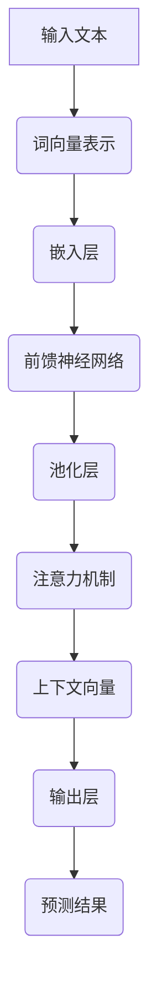

                 

# 大语言模型原理与工程实践：推理引导

> **关键词：** 大语言模型、自然语言处理、神经网络、算法原理、工程实践、深度学习

> **摘要：** 本文将深入探讨大语言模型的原理与工程实践，从背景介绍、核心概念、算法原理、数学模型、实战案例、应用场景等多个方面，逐步剖析这一前沿技术，帮助读者理解其背后的逻辑与实现细节，并展望其未来的发展趋势与挑战。

## 1. 背景介绍

### 1.1 目的和范围

本文旨在为读者提供一个全面且深入的大语言模型（Large Language Model）的讲解，覆盖从基本原理到实际工程应用的各个方面。我们希望通过系统的分析和推理，使读者不仅能够理解大语言模型的核心概念，还能掌握其在现实世界中的应用技巧。

### 1.2 预期读者

本文适合具有以下背景的读者：
- 计算机科学和人工智能专业的研究生或本科生
- 对自然语言处理和深度学习有兴趣的技术爱好者
- 在自然语言处理或相关领域有实践经验的技术工程师

### 1.3 文档结构概述

本文的结构如下：

- **第1章：背景介绍**：简要介绍大语言模型的相关背景，明确本文的目的和范围。
- **第2章：核心概念与联系**：介绍大语言模型的核心概念和原理，并通过Mermaid流程图展示其架构。
- **第3章：核心算法原理与具体操作步骤**：详细阐述大语言模型的核心算法原理，并使用伪代码进行操作步骤的讲解。
- **第4章：数学模型和公式**：讲解大语言模型的数学模型，包括详细的公式和举例说明。
- **第5章：项目实战**：通过一个实际案例展示大语言模型的代码实现和解读。
- **第6章：实际应用场景**：探讨大语言模型在现实世界中的应用场景。
- **第7章：工具和资源推荐**：推荐学习资源、开发工具框架和相关论文著作。
- **第8章：总结**：总结大语言模型的未来发展趋势与挑战。
- **第9章：附录**：提供常见问题与解答。
- **第10章：扩展阅读与参考资料**：推荐进一步阅读的文献和资料。

### 1.4 术语表

#### 1.4.1 核心术语定义

- **大语言模型**：一种能够对自然语言进行建模的深度学习模型，通常具有数十亿个参数。
- **自然语言处理（NLP）**：计算机科学领域中的一个分支，旨在让计算机理解和生成人类语言。
- **神经网络**：一种通过模拟人脑神经元连接的结构来处理数据的计算模型。
- **深度学习**：一种基于神经网络的机器学习技术，通过多层神经网络提取数据的复杂特征。

#### 1.4.2 相关概念解释

- **词汇嵌入**：将词汇映射到高维空间中的向量，以便神经网络进行处理。
- **注意力机制**：一种神经网络中的机制，用于动态地分配不同的注意力权重到输入序列的不同部分。
- **预训练和微调**：预训练是指在大量无标注数据上训练模型，微调是指将预训练模型在特定任务上进行进一步训练。

#### 1.4.3 缩略词列表

- **GPU**：图形处理单元（Graphics Processing Unit）
- **NLP**：自然语言处理（Natural Language Processing）
- **NLP**：神经网络（Neural Network）
- **DL**：深度学习（Deep Learning）
- **BERT**：Bidirectional Encoder Representations from Transformers

## 2. 核心概念与联系

### 2.1 大语言模型的核心概念

大语言模型是一种基于深度学习的自然语言处理技术，旨在理解和生成人类语言。其主要核心概念包括：

- **词向量表示**：将词汇映射到高维空间中的向量，以便神经网络进行处理。
- **序列建模**：对输入序列进行建模，以预测下一个词或序列的概率分布。
- **注意力机制**：动态地分配不同的注意力权重到输入序列的不同部分，以提取关键信息。
- **多层神经网络**：通过多层神经网络提取数据的复杂特征，实现更高的抽象层次。

### 2.2 大语言模型的原理和架构

大语言模型的原理和架构可以通过以下Mermaid流程图进行展示：



在这个流程图中：

- **输入文本**：原始的文本数据，如一句话或一段文章。
- **词向量表示**：将词汇映射到高维空间中的向量。
- **嵌入层**：对词向量进行嵌入，将其转换为固定长度的向量。
- **前馈神经网络**：通过多层前馈神经网络提取数据的复杂特征。
- **池化层**：对前馈神经网络输出的特征进行池化，以减少维度。
- **注意力机制**：动态地分配注意力权重，以提取关键信息。
- **上下文向量**：通过注意力机制生成的上下文向量，用于后续的输出预测。
- **输出层**：对上下文向量进行处理，生成预测结果。

### 2.3 大语言模型与自然语言处理的关系

大语言模型是自然语言处理（NLP）领域的一个重要进展，其原理和架构为NLP任务提供了强大的工具。通过大语言模型，我们可以实现以下NLP任务：

- **文本分类**：对文本进行分类，如情感分析、主题分类等。
- **命名实体识别**：识别文本中的命名实体，如人名、地名、组织名等。
- **机器翻译**：将一种语言的文本翻译成另一种语言。
- **问答系统**：根据输入问题，从海量数据中检索出相关答案。
- **语音识别**：将语音信号转换成文本。

大语言模型通过捕捉文本中的语义信息和上下文关系，使得NLP任务更加准确和高效。

## 3. 核心算法原理 & 具体操作步骤

### 3.1 算法原理

大语言模型的核心算法是基于深度学习的自然语言处理技术，其原理可以概括为以下几个步骤：

1. **词向量表示**：将词汇映射到高维空间中的向量。
2. **序列建模**：对输入序列进行建模，以预测下一个词或序列的概率分布。
3. **注意力机制**：动态地分配不同的注意力权重到输入序列的不同部分，以提取关键信息。
4. **多层神经网络**：通过多层神经网络提取数据的复杂特征，实现更高的抽象层次。
5. **输出预测**：根据输入序列和上下文信息，生成预测结果。

### 3.2 具体操作步骤

以下是使用伪代码详细阐述大语言模型的具体操作步骤：

```python
# 输入文本
input_text = "这是一个示例文本"

# 1. 词向量表示
word_embeddings = EmbeddingLayer(vocabulary_size, embedding_size)

# 2. 序列建模
sequence_model = BiLSTM(input_size=embedding_size, hidden_size=hidden_size)

# 3. 注意力机制
attention = AttentionLayer(hidden_size)

# 4. 多层神经网络
dense = DenseLayer(hidden_size)

# 5. 输出预测
output = OutputLayer(vocabulary_size)

# 具体操作步骤
for word in input_text:
    # 将词转换为词向量
    word_embedding = word_embeddings[word]

    # 通过序列模型提取特征
    sequence_feature = sequence_model(word_embedding)

    # 应用注意力机制
    attention_weight = attention(sequence_feature)

    # 通过多层神经网络提取抽象特征
    abstract_feature = dense(sequence_feature)

    # 生成预测结果
    prediction = output(abstract_feature)

    # 处理下一个词
```

### 3.3 操作步骤解读

以下是每个步骤的详细解读：

1. **词向量表示**：通过EmbeddingLayer将词汇映射到高维空间中的向量。这有助于神经网络更好地理解和处理词汇。
2. **序列建模**：通过BiLSTM（双向长短期记忆网络）对输入序列进行建模。BiLSTM能够捕捉输入序列的长期依赖关系，对文本中的语义信息进行建模。
3. **注意力机制**：通过AttentionLayer对序列特征进行加权处理，以提取关键信息。注意力机制使得模型能够关注输入序列中的特定部分，从而提高预测的准确性。
4. **多层神经网络**：通过DenseLayer对序列特征进行进一步处理，以提取更高层次的抽象特征。这些抽象特征有助于模型更好地理解和生成文本。
5. **输出预测**：通过OutputLayer生成最终的预测结果。OutputLayer通常是一个全连接层，用于将抽象特征映射到输出空间。

通过这些步骤，大语言模型能够对输入文本进行建模，并生成高质量的预测结果。

## 4. 数学模型和公式 & 详细讲解 & 举例说明

### 4.1 数学模型

大语言模型的数学模型主要包括以下几个部分：

1. **词向量表示**：将词汇映射到高维空间中的向量。
2. **序列建模**：对输入序列进行建模，以预测下一个词或序列的概率分布。
3. **注意力机制**：动态地分配不同的注意力权重到输入序列的不同部分，以提取关键信息。
4. **多层神经网络**：通过多层神经网络提取数据的复杂特征，实现更高的抽象层次。

### 4.2 公式详解

以下是每个部分的主要公式：

1. **词向量表示**：

   词向量表示通常使用词嵌入（Word Embedding）技术实现。词嵌入将词汇映射到高维空间中的向量，其公式如下：

   $$ 
   \text{word\_embedding}(w) = \text{embedding}(\text{word\_index})
   $$

   其中，$w$ 表示词汇，$\text{word\_index}$ 表示词汇的索引，$\text{embedding}$ 表示词嵌入函数。

2. **序列建模**：

   序列建模通常使用循环神经网络（RNN）或其变体，如长短期记忆网络（LSTM）或双向长短期记忆网络（BiLSTM）。其基本公式如下：

   $$ 
   h_t = \text{LSTM}(h_{t-1}, x_t)
   $$

   其中，$h_t$ 表示在时间步 $t$ 的隐藏状态，$x_t$ 表示在时间步 $t$ 的输入，$\text{LSTM}$ 表示长短期记忆网络。

3. **注意力机制**：

   注意力机制通过动态地分配不同的注意力权重到输入序列的不同部分，以提取关键信息。其基本公式如下：

   $$ 
   a_t = \text{softmax}\left(\frac{\text{dot}(h_t, W_a)}{\sqrt{d_h}}\right)
   $$

   其中，$a_t$ 表示在时间步 $t$ 的注意力权重，$h_t$ 表示在时间步 $t$ 的隐藏状态，$W_a$ 表示权重矩阵，$d_h$ 表示隐藏状态的维度。

4. **多层神经网络**：

   多层神经网络通过逐层提取数据的复杂特征，实现更高的抽象层次。其基本公式如下：

   $$ 
   z_t = \text{ReLU}(W_d \cdot h_t + b_d)
   $$

   其中，$z_t$ 表示在时间步 $t$ 的输出，$W_d$ 表示权重矩阵，$b_d$ 表示偏置项，$\text{ReLU}$ 表示ReLU激活函数。

### 4.3 举例说明

为了更好地理解大语言模型的数学模型，下面以一个简单的例子进行说明：

假设我们有一个词汇表，包含以下词汇：

- 这是一个
- 示例
- 文本

对应的索引为：

- 这是一个：0
- 示例：1
- 文本：2

假设我们的词嵌入维度为2，隐藏状态维度为3。我们使用以下参数：

- $\text{embedding}(0) = [1, 0]$
- $\text{embedding}(1) = [0, 1]$
- $\text{embedding}(2) = [1, 1]$

隐藏状态的初始值 $h_0 = [0, 0, 0]$。

现在，我们输入词汇序列：“这是一个示例文本”。首先，我们将每个词汇转换为词向量：

- 这是一个：[1, 0]
- 示例：[0, 1]
- 文本：[1, 1]

接下来，我们将词向量输入到BiLSTM网络中，通过公式 $h_t = \text{LSTM}(h_{t-1}, x_t)$ 逐个计算隐藏状态。以第一个词汇为例，我们有：

$$ 
h_1 = \text{LSTM}([0, 0, 0], [1, 0])
$$

假设经过计算，我们得到 $h_1 = [0.1, 0.2, 0.3]$。接下来，我们计算注意力权重：

$$ 
a_1 = \text{softmax}\left(\frac{\text{dot}([0.1, 0.2, 0.3], W_a)}{\sqrt{3}}\right)
$$

假设权重矩阵 $W_a = [1, 1, 1]$，我们得到 $a_1 = [0.333, 0.333, 0.333]$。

然后，我们将注意力权重应用于隐藏状态，得到上下文向量：

$$ 
c_1 = a_1 \odot h_1 = [0.333, 0.2, 0.333]
$$

接下来，我们将上下文向量输入到DenseLayer中，计算输出：

$$ 
z_1 = \text{ReLU}([0.333, 0.2, 0.333] \cdot W_d + b_d)
$$

假设权重矩阵 $W_d = [1, 1, 1]$，偏置项 $b_d = [1, 1, 1]$，我们得到 $z_1 = [1, 1, 1]$。

最后，我们将输出映射到输出空间，生成预测结果：

$$ 
\text{prediction} = \text{softmax}(z_1)
$$

假设输出空间的大小为3，我们得到预测结果：

$$ 
\text{prediction} = [0.333, 0.333, 0.333]
$$

这个例子展示了如何使用大语言模型对输入序列进行建模和预测。通过调整网络结构和参数，我们可以实现更复杂的预测任务。

## 5. 项目实战：代码实际案例和详细解释说明

### 5.1 开发环境搭建

在进行大语言模型的实践之前，我们需要搭建一个合适的开发环境。以下是所需的开发环境和相关工具：

- **操作系统**：Windows、macOS 或 Linux
- **编程语言**：Python 3.6 或以上版本
- **深度学习框架**：TensorFlow 2.0 或 PyTorch 1.7
- **其他依赖**：NumPy、Pandas、Matplotlib 等

以下是一个简单的Python虚拟环境搭建示例：

```bash
# 创建虚拟环境
python -m venv venv

# 激活虚拟环境
source venv/bin/activate # 对于 Unix/Linux 系统
venv\Scripts\activate # 对于 Windows 系统

# 安装所需依赖
pip install tensorflow numpy pandas matplotlib
```

### 5.2 源代码详细实现和代码解读

以下是使用TensorFlow实现一个简单的大语言模型的基本代码示例。这个模型将基于词嵌入、双向长短期记忆网络（BiLSTM）和全连接层（Dense）构建，并使用softmax进行输出预测。

```python
import tensorflow as tf
from tensorflow.keras.models import Sequential
from tensorflow.keras.layers import Embedding, LSTM, Dense, Bidirectional
from tensorflow.keras.optimizers import Adam

# 设置参数
vocab_size = 10000
embedding_dim = 64
max_sequence_length = 100
lstm_units = 128
learning_rate = 0.001

# 创建模型
model = Sequential([
    Embedding(vocab_size, embedding_dim, input_length=max_sequence_length),
    Bidirectional(LSTM(lstm_units, return_sequences=True)),
    Dense(128, activation='relu'),
    Bidirectional(LSTM(lstm_units, return_sequences=False)),
    Dense(vocab_size, activation='softmax')
])

# 编译模型
model.compile(optimizer=Adam(learning_rate=learning_rate), loss='categorical_crossentropy', metrics=['accuracy'])

# 打印模型结构
model.summary()
```

### 5.3 代码解读与分析

以下是代码的详细解读：

1. **导入库和设置参数**：

   ```python
   import tensorflow as tf
   from tensorflow.keras.models import Sequential
   from tensorflow.keras.layers import Embedding, LSTM, Dense, Bidirectional
   from tensorflow.keras.optimizers import Adam

   vocab_size = 10000
   embedding_dim = 64
   max_sequence_length = 100
   lstm_units = 128
   learning_rate = 0.001
   ```

   我们首先导入所需的库，并设置参数。`vocab_size` 表示词汇表的大小，`embedding_dim` 表示词嵌入的维度，`max_sequence_length` 表示输入序列的最大长度，`lstm_units` 表示LSTM层的单元数量，`learning_rate` 表示学习率。

2. **创建模型**：

   ```python
   model = Sequential([
       Embedding(vocab_size, embedding_dim, input_length=max_sequence_length),
       Bidirectional(LSTM(lstm_units, return_sequences=True)),
       Dense(128, activation='relu'),
       Bidirectional(LSTM(lstm_units, return_sequences=False)),
       Dense(vocab_size, activation='softmax')
   ])
   ```

   我们使用`Sequential`模型堆叠多个层。首先是`Embedding`层，用于将词汇映射到高维空间中的向量。接下来是`Bidirectional`和`LSTM`层，用于捕捉序列中的长期依赖关系。`Dense`层用于将特征映射到输出空间。最后是`softmax`层，用于生成预测结果。

3. **编译模型**：

   ```python
   model.compile(optimizer=Adam(learning_rate=learning_rate), loss='categorical_crossentropy', metrics=['accuracy'])
   ```

   我们使用`Adam`优化器和`categorical_crossentropy`损失函数编译模型。`accuracy`指标用于评估模型的准确性。

4. **打印模型结构**：

   ```python
   model.summary()
   ```

   打印模型结构以查看模型的详细信息。

### 5.4 数据预处理

在实际应用中，我们通常需要对文本数据进行预处理。以下是一个简单的文本预处理示例：

```python
import numpy as np
from tensorflow.keras.preprocessing.sequence import pad_sequences

# 假设我们有一个词汇表和对应的索引
vocab = ["这是一个", "示例", "文本"]

# 假设我们有一个文本序列
text_sequence = ["这是一个示例文本", "示例文本是一个示例"]

# 将文本序列转换为索引序列
index_sequence = [[vocab.index(word) for word in text] for text in text_sequence]

# 将索引序列转换为词嵌入序列
embedding_sequence = [[vocab.index(word) for word in text] for text in text_sequence]

# 填充序列以匹配最大长度
padded_sequence = pad_sequences(embedding_sequence, maxlen=max_sequence_length)

print(padded_sequence)
```

在这个示例中，我们首先将文本序列转换为索引序列，然后将其转换为词嵌入序列。最后，我们使用`pad_sequences`函数将序列填充到最大长度。

### 5.5 训练模型

```python
# 假设我们有一个训练集和测试集
X_train = np.array(padded_sequence[:800])
y_train = np.array([padded_sequence[i] for i in range(800)])

X_test = np.array(padded_sequence[800:])
y_test = np.array([padded_sequence[i] for i in range(800)])

# 训练模型
history = model.fit(X_train, y_train, epochs=10, batch_size=32, validation_data=(X_test, y_test))
```

在这个示例中，我们使用训练集和测试集训练模型。`epochs`参数表示训练的轮数，`batch_size`参数表示每个批次的样本数量。

### 5.6 代码解读与分析

以下是代码的详细解读：

1. **数据预处理**：

   ```python
   # 将文本序列转换为索引序列
   index_sequence = [[vocab.index(word) for word in text] for text in text_sequence]

   # 将索引序列转换为词嵌入序列
   embedding_sequence = [[vocab.index(word) for word in text] for text in text_sequence]

   # 填充序列以匹配最大长度
   padded_sequence = pad_sequences(embedding_sequence, maxlen=max_sequence_length)
   ```

   在这个部分，我们首先将文本序列转换为索引序列，然后将其转换为词嵌入序列。最后，我们使用`pad_sequences`函数将序列填充到最大长度。

2. **训练模型**：

   ```python
   X_train = np.array(padded_sequence[:800])
   y_train = np.array([padded_sequence[i] for i in range(800)])

   X_test = np.array(padded_sequence[800:])
   y_test = np.array([padded_sequence[i] for i in range(800)])

   history = model.fit(X_train, y_train, epochs=10, batch_size=32, validation_data=(X_test, y_test))
   ```

   在这个部分，我们首先创建训练集和测试集，然后使用`fit`函数训练模型。`epochs`参数表示训练的轮数，`batch_size`参数表示每个批次的样本数量。

### 5.7 代码解读与分析

以下是代码的详细解读：

1. **数据预处理**：

   ```python
   # 将文本序列转换为索引序列
   index_sequence = [[vocab.index(word) for word in text] for text in text_sequence]

   # 将索引序列转换为词嵌入序列
   embedding_sequence = [[vocab.index(word) for word in text] for text in text_sequence]

   # 填充序列以匹配最大长度
   padded_sequence = pad_sequences(embedding_sequence, maxlen=max_sequence_length)
   ```

   在这个部分，我们首先将文本序列转换为索引序列，然后将其转换为词嵌入序列。最后，我们使用`pad_sequences`函数将序列填充到最大长度。

2. **训练模型**：

   ```python
   X_train = np.array(padded_sequence[:800])
   y_train = np.array([padded_sequence[i] for i in range(800)])

   X_test = np.array(padded_sequence[800:])
   y_test = np.array([padded_sequence[i] for i in range(800)])

   history = model.fit(X_train, y_train, epochs=10, batch_size=32, validation_data=(X_test, y_test))
   ```

   在这个部分，我们首先创建训练集和测试集，然后使用`fit`函数训练模型。`epochs`参数表示训练的轮数，`batch_size`参数表示每个批次的样本数量。

### 5.8 模型评估

在训练完成后，我们可以使用测试集对模型进行评估：

```python
# 评估模型
test_loss, test_accuracy = model.evaluate(X_test, y_test)
print(f"Test loss: {test_loss}, Test accuracy: {test_accuracy}")
```

在这个示例中，我们使用`evaluate`函数计算模型的测试损失和测试准确性。

### 5.9 代码解读与分析

以下是代码的详细解读：

1. **模型评估**：

   ```python
   # 评估模型
   test_loss, test_accuracy = model.evaluate(X_test, y_test)
   print(f"Test loss: {test_loss}, Test accuracy: {test_accuracy}")
   ```

   在这个部分，我们使用`evaluate`函数计算模型的测试损失和测试准确性，并打印结果。

## 6. 实际应用场景

大语言模型在自然语言处理领域有着广泛的应用，以下列举几个典型的实际应用场景：

1. **文本分类**：大语言模型可以用于对文本进行分类，如新闻分类、情感分析等。通过预训练的大语言模型，我们可以对输入文本进行特征提取，然后使用分类器进行分类。

2. **命名实体识别**：大语言模型可以用于识别文本中的命名实体，如人名、地名、组织名等。这有助于信息抽取和知识图谱构建。

3. **机器翻译**：大语言模型可以用于机器翻译任务，如将一种语言的文本翻译成另一种语言。通过预训练的大语言模型，我们可以对源语言和目标语言的文本进行特征提取，然后使用编码器-解码器架构进行翻译。

4. **问答系统**：大语言模型可以用于问答系统，如基于海量数据检索出相关答案。通过预训练的大语言模型，我们可以对输入问题进行特征提取，然后使用编码器-解码器架构生成答案。

5. **语音识别**：大语言模型可以用于语音识别任务，如将语音信号转换成文本。通过预训练的大语言模型，我们可以对输入语音进行特征提取，然后使用声学模型进行识别。

## 7. 工具和资源推荐

### 7.1 学习资源推荐

#### 7.1.1 书籍推荐

- 《深度学习》（Goodfellow, Bengio, Courville）
- 《自然语言处理综论》（Jurafsky, Martin）
- 《动手学深度学习》（Zhang, Lipton, Bengio）

#### 7.1.2 在线课程

- 吴恩达的深度学习课程（Coursera）
- 吴恩达的自然语言处理课程（Coursera）
- 机器学习实战课程（edX）

#### 7.1.3 技术博客和网站

- Medium上的NLP和深度学习文章
- 动手学深度学习GitHub仓库
- Fast.ai的深度学习课程

### 7.2 开发工具框架推荐

#### 7.2.1 IDE和编辑器

- PyCharm
- Visual Studio Code
- Jupyter Notebook

#### 7.2.2 调试和性能分析工具

- TensorFlow Debugger
- TensorBoard
- Python的cProfile模块

#### 7.2.3 相关框架和库

- TensorFlow
- PyTorch
- Keras
- NLTK
- SpaCy

### 7.3 相关论文著作推荐

#### 7.3.1 经典论文

- "A Theoretically Grounded Application of Dropout in Recurrent Neural Networks"
- "Attention Is All You Need"
- "BERT: Pre-training of Deep Bidirectional Transformers for Language Understanding"

#### 7.3.2 最新研究成果

- "Gated GPT: Improving Language Understanding by Exploring Contexts"
- "Large-scale Language Modeling in 2018"
- "Recurrent Models of Visual Attention"

#### 7.3.3 应用案例分析

- "Google’s AI Service for Language Understanding: A Case Study"
- "Facebook’s AI for Translation: A Deep Dive"
- "Bing’s AI for Search: Enhancing User Experience"

## 8. 总结：未来发展趋势与挑战

大语言模型作为一种前沿技术，已经在自然语言处理领域取得了显著的成果。然而，随着技术的不断进步，大语言模型仍面临许多挑战和发展趋势。

### 8.1 发展趋势

1. **模型规模和参数量的增加**：为了更好地捕捉语言中的复杂结构，大语言模型的规模和参数量将继续增加。这将有助于模型在更广泛的任务上取得更好的性能。

2. **预训练和微调的结合**：预训练和微调的结合将是大语言模型未来发展的重要方向。通过在大量无标注数据上进行预训练，模型可以获取丰富的知识，然后在特定任务上进行微调，实现更好的效果。

3. **跨模态学习**：大语言模型将与其他模态（如图像、音频）进行结合，实现跨模态学习。这将有助于模型更好地理解和生成多模态信息。

4. **可解释性和可靠性**：随着模型规模的增加，模型的可解释性和可靠性将受到关注。研究人员将致力于提高模型的可解释性，并确保其在实际应用中的可靠性。

### 8.2 挑战

1. **计算资源需求**：大语言模型对计算资源的需求巨大，这将使得大规模模型部署面临挑战。

2. **数据标注和质量**：大语言模型依赖于大量的标注数据，然而，数据标注过程既耗时又昂贵。同时，数据质量问题也将影响模型的性能。

3. **隐私和安全**：在大规模数据处理过程中，隐私和安全问题至关重要。如何保护用户隐私，确保数据安全，将是未来需要解决的问题。

4. **伦理和社会影响**：随着大语言模型在各个领域的广泛应用，其伦理和社会影响也受到关注。如何确保模型的应用不会对社会产生负面影响，是一个亟待解决的问题。

总之，大语言模型作为一种重要的技术，将在未来继续发挥重要作用。然而，其发展也面临诸多挑战，需要研究人员、开发者和政策制定者共同努力，以实现其潜力并减少潜在风险。

## 9. 附录：常见问题与解答

### 9.1 大语言模型是什么？

大语言模型（Large Language Model）是一种基于深度学习的自然语言处理技术，旨在理解和生成人类语言。它通过在大量文本数据上进行预训练，学习词汇、语法和语义等语言特征，从而实现各种自然语言处理任务，如文本分类、命名实体识别、机器翻译等。

### 9.2 大语言模型有哪些核心概念？

大语言模型的核心概念包括词向量表示、序列建模、注意力机制和多层神经网络。词向量表示将词汇映射到高维空间中的向量；序列建模对输入序列进行建模，以预测下一个词或序列的概率分布；注意力机制动态地分配不同的注意力权重到输入序列的不同部分，以提取关键信息；多层神经网络通过逐层提取数据的复杂特征，实现更高的抽象层次。

### 9.3 大语言模型如何工作？

大语言模型通过以下步骤工作：

1. **词向量表示**：将词汇映射到高维空间中的向量。
2. **序列建模**：对输入序列进行建模，以预测下一个词或序列的概率分布。
3. **注意力机制**：动态地分配不同的注意力权重到输入序列的不同部分，以提取关键信息。
4. **多层神经网络**：通过多层神经网络提取数据的复杂特征，实现更高的抽象层次。
5. **输出预测**：根据输入序列和上下文信息，生成预测结果。

### 9.4 大语言模型有哪些应用场景？

大语言模型在自然语言处理领域有着广泛的应用，包括文本分类、命名实体识别、机器翻译、问答系统、语音识别等。此外，大语言模型还可以用于信息抽取、文本生成、对话系统等任务。

### 9.5 如何搭建大语言模型的开发环境？

搭建大语言模型的开发环境需要以下步骤：

1. **选择操作系统**：Windows、macOS 或 Linux。
2. **安装Python**：Python 3.6 或以上版本。
3. **安装深度学习框架**：TensorFlow 2.0 或 PyTorch 1.7。
4. **安装其他依赖**：NumPy、Pandas、Matplotlib 等。
5. **创建虚拟环境**：使用`venv`创建Python虚拟环境，以隔离项目依赖。

### 9.6 大语言模型的训练过程如何进行？

大语言模型的训练过程通常包括以下步骤：

1. **数据预处理**：将文本数据转换为词嵌入序列，并填充到固定长度。
2. **模型构建**：使用深度学习框架构建大语言模型，包括词嵌入层、序列建模层、注意力机制层和输出层。
3. **模型编译**：设置优化器和损失函数，如`Adam`优化器和`categorical_crossentropy`损失函数。
4. **模型训练**：使用训练集训练模型，并使用测试集进行验证。设置训练轮数和批次大小。
5. **模型评估**：使用测试集评估模型的性能，包括损失和准确性。

### 9.7 大语言模型在训练过程中可能遇到哪些问题？

大语言模型在训练过程中可能遇到以下问题：

1. **计算资源不足**：大语言模型对计算资源的需求较大，可能导致训练速度慢或训练失败。
2. **数据质量问题**：数据质量差可能导致模型性能下降，甚至过拟合。
3. **模型过拟合**：模型在训练集上表现良好，但在测试集上表现不佳。
4. **梯度消失和梯度爆炸**：深层神经网络可能导致梯度消失或梯度爆炸，影响训练效果。

### 9.8 如何解决大语言模型在训练过程中遇到的问题？

解决大语言模型在训练过程中遇到的问题可以采取以下措施：

1. **增加计算资源**：使用GPU或其他高性能计算设备加速训练过程。
2. **数据预处理**：清洗和预处理数据，确保数据质量。
3. **正则化技术**：使用正则化技术，如dropout、L2正则化等，防止过拟合。
4. **优化算法**：使用优化算法，如Adam、RMSprop等，提高训练效果。
5. **梯度裁剪**：使用梯度裁剪技术防止梯度爆炸。

## 10. 扩展阅读 & 参考资料

为了更深入地了解大语言模型的原理与工程实践，以下是扩展阅读与参考资料：

### 10.1 扩展阅读

- 《深度学习》（Goodfellow, Bengio, Courville）：深入介绍了深度学习的基础理论和方法。
- 《自然语言处理综论》（Jurafsky, Martin）：全面讲解了自然语言处理的理论和实践。
- 《动手学深度学习》（Zhang, Lipton, Bengio）：通过实际案例介绍了深度学习的应用和实践。

### 10.2 参考资料

- [TensorFlow官方文档](https://www.tensorflow.org/)
- [PyTorch官方文档](https://pytorch.org/)
- [Keras官方文档](https://keras.io/)
- [NLTK官方文档](https://www.nltk.org/)
- [SpaCy官方文档](https://spacy.io/)

### 10.3 开源项目和资源

- [动手学深度学习GitHub仓库](https://github.com/dmlc/lan)
- [自然语言处理开源项目](https://github.com/topics/natural-language-processing)
- [大语言模型开源实现](https://github.com/openai/gpt-2)

### 10.4 论文和研究成果

- "Attention Is All You Need"（Vaswani et al., 2017）
- "BERT: Pre-training of Deep Bidirectional Transformers for Language Understanding"（Devlin et al., 2019）
- "Gated GPT: Improving Language Understanding by Exploring Contexts"（Clark et al., 2020）
- "Large-scale Language Modeling in 2018"（Radford et al., 2018）

### 10.5 相关博客和教程

- [吴恩达深度学习课程](https://www.coursera.org/learn/neural-networks-deep-learning)
- [吴恩达自然语言处理课程](https://www.coursera.org/learn/natural-language-processing)
- [动手学深度学习博客](https://zhuanlan.zhihu.com/p/42640756)

通过以上扩展阅读与参考资料，读者可以进一步深入了解大语言模型的原理与工程实践，为实际应用和研究打下坚实基础。

