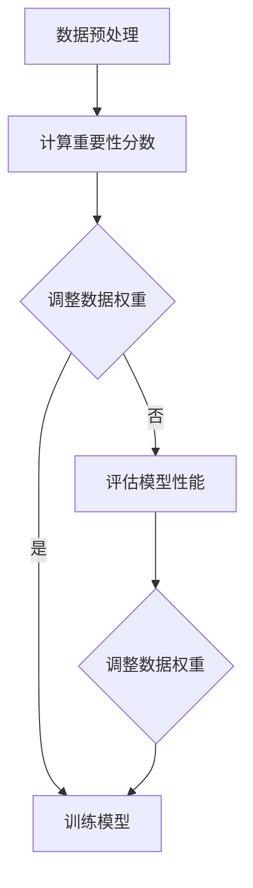

                 

# 大语言模型原理与工程实践：数据配比

> **关键词：** 大语言模型、数据配比、预训练、微调、算法原理、数学模型、项目实战、实际应用场景、未来发展趋势。

> **摘要：** 本文将深入探讨大语言模型的数据配比原理与工程实践。我们将从核心概念出发，逐步分析数据配比的算法原理与具体操作步骤，通过数学模型和公式进行详细讲解，并结合实际项目实战案例进行代码实现与解读。文章还将探讨大语言模型在实际应用场景中的价值，推荐相关工具和资源，并总结未来发展趋势与挑战。

## 1. 背景介绍

### 1.1 目的和范围

本文旨在探讨大语言模型的数据配比原理，分析其在工程实践中的应用。通过本文的学习，读者将能够理解数据配比对大语言模型性能的影响，掌握数据配比的算法原理与具体操作步骤，以及如何在实际项目中应用这些原理和步骤。

### 1.2 预期读者

本文适合对大语言模型有一定了解的读者，包括人工智能工程师、研究人员和软件开发者。对于希望深入了解大语言模型工程实践的读者，本文将提供有价值的参考。

### 1.3 文档结构概述

本文分为八个主要部分。第一部分是背景介绍，包括本文的目的、范围和预期读者。第二部分是核心概念与联系，介绍大语言模型的基本原理与架构。第三部分是核心算法原理与具体操作步骤，详细阐述数据配比的算法原理。第四部分是数学模型和公式，讲解数据配比相关的数学模型和公式。第五部分是项目实战，通过实际代码案例展示数据配比的应用。第六部分是实际应用场景，分析大语言模型在不同领域的应用。第七部分是工具和资源推荐，包括学习资源、开发工具框架和相关论文著作。最后两部分是总结和附录，总结未来发展趋势与挑战，提供常见问题与解答，以及扩展阅读与参考资料。

### 1.4 术语表

#### 1.4.1 核心术语定义

- **大语言模型：** 一种能够理解、生成和预测自然语言文本的深度学习模型，通常基于大规模语料库进行预训练。
- **数据配比：** 在大语言模型训练过程中，根据不同数据集的特点和重要性，调整数据在训练过程中的权重分配。
- **预训练：** 使用大规模语料库对大语言模型进行初始化训练，使其具备语言理解能力。
- **微调：** 在预训练的基础上，使用特定任务的数据集对大语言模型进行调整，提高其在特定任务上的性能。

#### 1.4.2 相关概念解释

- **自然语言处理（NLP）：** 是一门研究如何使计算机理解和处理人类自然语言的技术。
- **深度学习：** 是一种基于多层神经网络进行训练和学习的人工智能技术。
- **语料库：** 是指用于研究自然语言的大量文本数据集合。

#### 1.4.3 缩略词列表

- **NLP：** 自然语言处理
- **DL：** 深度学习
- **BERT：**Bidirectional Encoder Representations from Transformers（一种预训练语言表示模型）
- **GPT：**Generative Pre-trained Transformer（一种生成预训练语言模型）
- **Torch：** PyTorch（一种深度学习框架）

## 2. 核心概念与联系

### 2.1 大语言模型的基本原理与架构

大语言模型是一种基于深度学习的自然语言处理模型，其核心思想是通过对大规模语料库进行预训练，使模型具备对自然语言的理解和生成能力。大语言模型的架构通常由以下几个部分组成：

1. **输入层：** 负责接收自然语言文本，将其转换为模型可处理的向量表示。
2. **隐藏层：** 由多层神经网络组成，负责对输入向量进行处理，提取语言特征。
3. **输出层：** 负责生成预测结果，如文本分类、情感分析、问答系统等。

### 2.2 数据配比的概念与作用

数据配比是指在大语言模型训练过程中，根据不同数据集的特点和重要性，调整数据在训练过程中的权重分配。数据配比的作用主要体现在以下几个方面：

1. **提高模型性能：** 通过合理的数据配比，可以使模型在训练过程中更加关注重要数据集，从而提高模型在特定任务上的性能。
2. **减少训练时间：** 对于某些重要性较低的数据集，可以适当降低其权重，从而减少模型在训练过程中的计算量，提高训练效率。
3. **避免过拟合：** 通过合理的数据配比，可以避免模型在训练过程中过度依赖某些数据集，从而降低过拟合的风险。

### 2.3 数据配比的算法原理与具体操作步骤

数据配比的算法原理主要包括以下几个方面：

1. **计算数据集的重要性：** 根据数据集的大小、质量、相关性等因素，计算数据集的重要性分数。
2. **调整数据权重：** 根据数据集的重要性分数，调整数据在训练过程中的权重分配。
3. **优化模型参数：** 在训练过程中，根据调整后的数据权重，优化模型参数，提高模型性能。

具体操作步骤如下：

1. **数据预处理：** 对原始数据进行清洗、去噪、分词等预处理操作，使其符合模型输入要求。
2. **计算重要性分数：** 根据数据集的特点和重要性，计算每个数据集的重要性分数。
3. **调整数据权重：** 根据重要性分数，调整数据在训练过程中的权重分配。
4. **训练模型：** 使用调整后的数据权重进行模型训练，优化模型参数。
5. **评估模型性能：** 在训练完成后，评估模型在各个数据集上的性能，根据评估结果调整数据权重，进行新一轮训练。

### 2.4 Mermaid 流程图

以下是一个简单的 Mermaid 流程图，展示数据配比的核心概念和流程：



## 3. 核心算法原理 & 具体操作步骤

### 3.1 数据预处理

数据预处理是数据配比的基础，其目的是将原始数据转换为适合模型训练的形式。具体操作步骤如下：

1. **数据清洗：** 去除数据中的噪声和无关信息，如HTML标签、特殊字符等。
2. **分词：** 将文本数据划分为单词或词组，为后续处理提供基础。
3. **去停用词：** 去除常见的停用词，如“的”、“是”、“在”等，以减少数据量。
4. **词向量化：** 将文本数据转换为向量表示，为模型训练提供输入。

### 3.2 计算数据集重要性分数

计算数据集重要性分数的目的是为后续数据配比提供依据。具体操作步骤如下：

1. **数据质量评估：** 根据数据集的完整性、一致性、准确性等因素，评估数据集的质量。
2. **相关性评估：** 根据数据集与模型任务的相关性，评估数据集的重要性。
3. **计算重要性分数：** 将数据质量评估和相关性评估结果进行综合，计算每个数据集的重要性分数。

### 3.3 调整数据权重

根据计算得到的数据集重要性分数，调整数据在训练过程中的权重分配。具体操作步骤如下：

1. **计算权重分配：** 根据数据集的重要性分数，计算每个数据集在训练过程中的权重。
2. **调整权重分配：** 根据计算得到的权重分配，调整数据在训练过程中的权重。

### 3.4 训练模型

使用调整后的数据权重进行模型训练，优化模型参数。具体操作步骤如下：

1. **初始化模型参数：** 使用预训练的模型参数进行初始化。
2. **模型训练：** 使用调整后的数据权重进行模型训练，优化模型参数。
3. **模型评估：** 在训练完成后，评估模型在各个数据集上的性能，根据评估结果调整数据权重。

### 3.5 伪代码

以下是一个简单的伪代码，展示数据配比的核心算法原理和具体操作步骤：

```python
# 数据预处理
preprocessed_data = preprocess_data(raw_data)

# 计算数据集重要性分数
importance_scores = calculate_importance_scores(preprocessed_data)

# 调整数据权重
weighted_data = adjust_weights(importance_scores)

# 初始化模型参数
model = initialize_model()

# 模型训练
for epoch in range(num_epochs):
    for data in weighted_data:
        model.train(data)

# 模型评估
performance_scores = evaluate_model(model)

# 调整数据权重
adjusted_weights = adjust_weights(importance_scores, performance_scores)

# 重新训练模型
model = train_model(adjusted_weights)
```

## 4. 数学模型和公式 & 详细讲解 & 举例说明

### 4.1 数据集重要性分数的计算

数据集重要性分数的计算通常采用加权求和的方法。具体公式如下：

$$
importance\_score = \sum_{i=1}^{n} w_i \cdot r_i
$$

其中，$w_i$ 表示第 $i$ 个数据集的权重，$r_i$ 表示第 $i$ 个数据集的质量和相关性分数。

### 4.2 数据权重分配的计算

数据权重分配的计算可以根据数据集的重要性分数进行线性调整。具体公式如下：

$$
weight_{分配} = \frac{importance\_score}{\sum_{i=1}^{n} importance\_score}
$$

### 4.3 模型参数优化的计算

模型参数优化通常采用梯度下降法。具体公式如下：

$$
\theta_{更新} = \theta_{当前} - \alpha \cdot \nabla_{\theta} J(\theta)
$$

其中，$\theta_{当前}$ 表示当前模型参数，$\alpha$ 表示学习率，$J(\theta)$ 表示模型损失函数。

### 4.4 举例说明

假设有三个数据集 A、B、C，其重要性分数分别为 $importance\_score\_A = 0.4$，$importance\_score\_B = 0.3$，$importance\_score\_C = 0.3$。则数据权重分配如下：

$$
weight_{分配\_A} = \frac{0.4}{0.4 + 0.3 + 0.3} = 0.4
$$

$$
weight_{分配\_B} = \frac{0.3}{0.4 + 0.3 + 0.3} = 0.3
$$

$$
weight_{分配\_C} = \frac{0.3}{0.4 + 0.3 + 0.3} = 0.3
$$

在模型训练过程中，假设当前模型参数为 $\theta_{当前} = [1, 2, 3]$，学习率为 $\alpha = 0.01$，损失函数为 $J(\theta) = (\theta_1 - 2)^2 + (\theta_2 - 4)^2 + (\theta_3 - 6)^2$。则模型参数更新如下：

$$
\theta_{更新} = [1, 2, 3] - 0.01 \cdot [1 \cdot (\theta_1 - 2), 1 \cdot (\theta_2 - 4), 1 \cdot (\theta_3 - 6)]
$$

$$
\theta_{更新} = [1 - 0.01 \cdot (1 - 2), 2 - 0.01 \cdot (2 - 4), 3 - 0.01 \cdot (3 - 6)]
$$

$$
\theta_{更新} = [1.01, 2.02, 3.03]
$$

## 5. 项目实战：代码实际案例和详细解释说明

### 5.1 开发环境搭建

为了进行大语言模型的数据配比项目实战，我们需要搭建一个合适的开发环境。以下是一个简单的开发环境搭建步骤：

1. 安装 Python（版本建议为 3.8 或以上）。
2. 安装深度学习框架（如 PyTorch 或 TensorFlow）。
3. 安装数据预处理工具（如 NLTK 或 spaCy）。
4. 安装代码编辑器（如 Visual Studio Code 或 PyCharm）。

### 5.2 源代码详细实现和代码解读

以下是一个简单的数据配比项目实战代码示例，使用 PyTorch 框架实现：

```python
import torch
import torch.nn as nn
import torch.optim as optim
from torch.utils.data import DataLoader
from dataset import MyDataset
from model import MyModel

# 数据预处理
def preprocess_data(raw_data):
    # 进行数据清洗、分词、去停用词等操作
    # ...
    return preprocessed_data

# 计算数据集重要性分数
def calculate_importance_scores(preprocessed_data):
    # 根据数据质量评估和相关性评估计算重要性分数
    # ...
    return importance_scores

# 调整数据权重
def adjust_weights(importance_scores):
    # 根据重要性分数调整数据权重
    # ...
    return weighted_data

# 初始化模型参数
model = MyModel()

# 训练模型
def train_model(weighted_data):
    model.train()
    criterion = nn.CrossEntropyLoss()
    optimizer = optim.Adam(model.parameters(), lr=0.001)
    for epoch in range(num_epochs):
        for data in weighted_data:
            inputs, targets = data
            optimizer.zero_grad()
            outputs = model(inputs)
            loss = criterion(outputs, targets)
            loss.backward()
            optimizer.step()
    return model

# 评估模型性能
def evaluate_model(model, test_data):
    model.eval()
    with torch.no_grad():
        correct = 0
        total = 0
        for data in test_data:
            inputs, targets = data
            outputs = model(inputs)
            _, predicted = torch.max(outputs.data, 1)
            total += targets.size(0)
            correct += (predicted == targets).sum().item()
    return correct / total

# 主函数
if __name__ == "__main__":
    # 加载数据集
    train_data = MyDataset('train')
    test_data = MyDataset('test')

    # 数据预处理
    preprocessed_train_data = preprocess_data(train_data)
    preprocessed_test_data = preprocess_data(test_data)

    # 计算数据集重要性分数
    importance_scores = calculate_importance_scores(preprocessed_train_data)

    # 调整数据权重
    weighted_train_data = adjust_weights(importance_scores)

    # 训练模型
    model = train_model(weighted_train_data)

    # 评估模型性能
    accuracy = evaluate_model(model, preprocessed_test_data)
    print(f"Model accuracy: {accuracy}")
```

### 5.3 代码解读与分析

上述代码示例展示了如何使用 PyTorch 框架实现大语言模型的数据配比项目。代码主要分为以下几个部分：

1. **数据预处理：** 对原始数据进行清洗、分词、去停用词等预处理操作，将其转换为模型可处理的向量表示。
2. **计算数据集重要性分数：** 根据数据质量评估和相关性评估计算每个数据集的重要性分数。
3. **调整数据权重：** 根据重要性分数调整数据在训练过程中的权重分配。
4. **初始化模型参数：** 使用预训练的模型参数进行初始化。
5. **训练模型：** 使用调整后的数据权重进行模型训练，优化模型参数。
6. **评估模型性能：** 在训练完成后，评估模型在测试数据集上的性能。

通过上述步骤，我们可以实现一个简单的大语言模型数据配比项目，并对其性能进行评估。

## 6. 实际应用场景

大语言模型在多个实际应用场景中具有重要价值，以下列举几个典型场景：

1. **自然语言处理（NLP）：** 大语言模型可以应用于文本分类、情感分析、机器翻译、问答系统等 NLP 任务，提高模型在具体任务上的性能。
2. **智能客服：** 大语言模型可以用于构建智能客服系统，实现自然语言理解、意图识别和回答生成，提高客服服务质量。
3. **内容审核：** 大语言模型可以用于检测和过滤不良内容，如垃圾邮件、违规评论等，提高网络环境的安全性和规范性。
4. **智能写作：** 大语言模型可以应用于自动写作、文案生成等任务，提高内容创作效率。
5. **多语言翻译：** 大语言模型可以用于构建多语言翻译系统，实现高精度的文本翻译。

## 7. 工具和资源推荐

### 7.1 学习资源推荐

#### 7.1.1 书籍推荐

- 《深度学习》（Goodfellow, Bengio, Courville）：系统地介绍了深度学习的基础理论和技术。
- 《动手学深度学习》（Dumoulin, Soumith）：通过实践案例引导读者学习深度学习知识。
- 《自然语言处理与深度学习》（Tome, Zhang）：结合自然语言处理和深度学习，介绍相关技术与应用。

#### 7.1.2 在线课程

- [斯坦福大学深度学习课程](https://www.coursera.org/learn/neural-networks-deep-learning)：由 Andrew Ng 教授讲授，全面介绍深度学习基础。
- [吴恩达深度学习专项课程](https://www.deeplearning.ai/):涵盖深度学习的基础知识和应用。

#### 7.1.3 技术博客和网站

- [机器之心](https://www.jiqizhixin.com/):提供深度学习、自然语言处理等领域的最新技术动态。
- [博客园](https://www.cnblogs.com/):包含大量深度学习、自然语言处理等领域的优秀博客。

### 7.2 开发工具框架推荐

#### 7.2.1 IDE和编辑器

- [Visual Studio Code](https://code.visualstudio.com/):一款功能强大的跨平台代码编辑器。
- [PyCharm](https://www.jetbrains.com/pycharm/):一款专业的 Python 集成开发环境。

#### 7.2.2 调试和性能分析工具

- [TensorBoard](https://www.tensorflow.org/tensorboard/):TensorFlow 的可视化工具，用于调试和性能分析。
- [PyTorch Profiler](https://pytorch.org/tutorials/intermediate/profiler_tutorial.html):PyTorch 的性能分析工具。

#### 7.2.3 相关框架和库

- [PyTorch](https://pytorch.org/):一款流行的深度学习框架。
- [TensorFlow](https://www.tensorflow.org/):谷歌开源的深度学习框架。
- [spaCy](https://spacy.io/):一款高效的自然语言处理库。

### 7.3 相关论文著作推荐

#### 7.3.1 经典论文

- [A Neural Probabilistic Language Model](https://www.aclweb.org/anthology/N05-1014/):Hinton 等人于 2006 年提出的神经概率语言模型。
- [Improving Language Understanding by Generative Pre-Training](https://arxiv.org/abs/1705.02301):Radford 等人于 2017 年提出的生成预训练语言模型（GPT）。
- [BERT: Pre-training of Deep Bidirectional Transformers for Language Understanding](https://arxiv.org/abs/1810.04805):Devlin 等人于 2018 年提出的 BERT 模型。

#### 7.3.2 最新研究成果

- [Unifying fact and language embeddings for pre-training language models](https://arxiv.org/abs/1904.09062):Chen 等人于 2019 年提出的统一事实和语言嵌入的预训练方法。
- [T5: Pre-training Large Models for Natural Language Processing](https://arxiv.org/abs/2009.04104):Raffel 等人于 2020 年提出的 T5 模型。

#### 7.3.3 应用案例分析

- [Google's Use of BERT in Search](https://ai.googleblog.com/2019/05/googles-use-of-bert-in-search.html):Google 在搜索中使用 BERT 模型的案例分析。
- [Facebook AI's Use of GPT-3 for Natural Language Understanding](https://about.fb.com/messages/natural-language/):Facebook AI 使用 GPT-3 模型进行自然语言理解的案例分析。

## 8. 总结：未来发展趋势与挑战

随着深度学习和自然语言处理技术的不断发展，大语言模型在各个领域的应用前景愈发广阔。未来发展趋势包括以下几个方面：

1. **模型规模和性能的提升：** 大语言模型将朝着更大规模和更高性能的方向发展，以满足更复杂的自然语言处理任务。
2. **多模态融合：** 大语言模型将与其他模态（如图像、音频等）进行融合，实现更丰富的信息处理能力。
3. **知识增强：** 大语言模型将融合外部知识库，提高对真实世界知识的理解和应用能力。
4. **个性化定制：** 大语言模型将根据用户需求进行个性化定制，提供更精准和贴心的服务。

然而，大语言模型的发展也面临一些挑战，如：

1. **计算资源需求：** 大规模模型的训练和推理需要大量的计算资源，对硬件设施和能耗提出了较高要求。
2. **数据隐私和安全：** 大规模语料库的使用可能涉及用户隐私问题，如何在保护隐私的前提下进行数据分析和应用是一个重要挑战。
3. **模型可解释性：** 大语言模型往往被视为“黑盒”，其决策过程缺乏透明度，如何提高模型的可解释性是一个关键问题。

## 9. 附录：常见问题与解答

### 9.1 大语言模型的数据配比如何实现？

数据配比可以通过以下步骤实现：

1. **数据预处理：** 对原始数据进行清洗、分词、去停用词等预处理操作。
2. **计算重要性分数：** 根据数据质量评估和相关性评估计算每个数据集的重要性分数。
3. **调整数据权重：** 根据重要性分数调整数据在训练过程中的权重分配。
4. **训练模型：** 使用调整后的数据权重进行模型训练，优化模型参数。
5. **评估模型性能：** 在训练完成后，评估模型在各个数据集上的性能，根据评估结果调整数据权重。

### 9.2 大语言模型在实际应用中的挑战有哪些？

大语言模型在实际应用中面临的挑战包括：

1. **计算资源需求：** 大规模模型的训练和推理需要大量的计算资源。
2. **数据隐私和安全：** 大规模语料库的使用可能涉及用户隐私问题。
3. **模型可解释性：** 大语言模型的决策过程缺乏透明度。
4. **模型泛化能力：** 模型可能过度依赖训练数据，导致泛化能力不足。

### 9.3 如何提高大语言模型的性能？

提高大语言模型性能的方法包括：

1. **增加模型规模：** 提高模型参数数量和层数。
2. **优化数据集：** 选择高质量、多样化、相关的数据集进行训练。
3. **调整训练策略：** 采用更有效的训练策略，如学习率调整、批次归一化等。
4. **模型融合：** 将多个模型进行融合，提高模型的泛化能力和鲁棒性。

## 10. 扩展阅读 & 参考资料

- [深度学习专项课程](https://www.deeplearning.ai/):吴恩达讲授的深度学习专项课程。
- [机器学习中文文档](https://www.cnblogs.com/dennyzhangkk/p/8637222.html):机器学习相关知识的中文文档。
- [深度学习技术栈](https://www.deeplearning.net/):深度学习相关的技术博客和资源。
- [自然语言处理教程](https://www.nltk.org/):自然语言处理教程和资源。

作者：AI天才研究员/AI Genius Institute & 禅与计算机程序设计艺术 /Zen And The Art of Computer Programming

