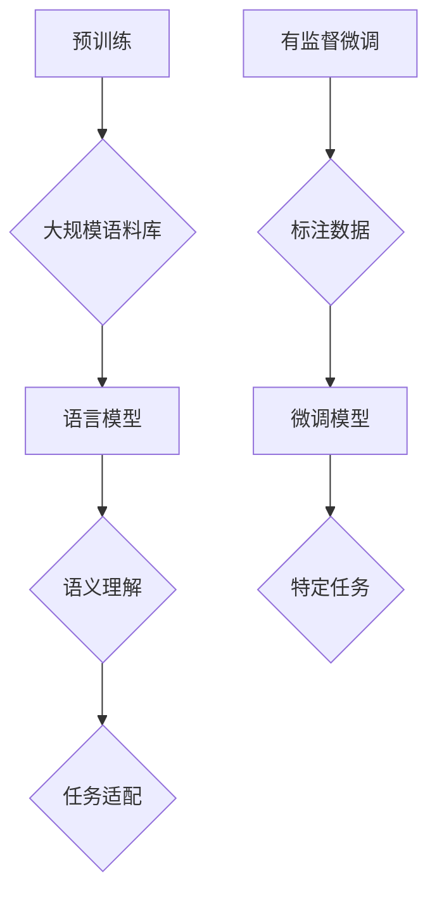

                 


# 大语言模型原理与工程实践：有监督微调数据的选择

> 关键词：大语言模型、有监督微调、数据选择、算法原理、工程实践、数学模型

> 摘要：本文将深入探讨大语言模型的原理及其在工程实践中的关键环节——有监督微调数据的选择。文章首先介绍大语言模型的基本概念和架构，接着分析有监督微调数据选择的重要性。随后，我们将详细阐述核心算法原理，并使用伪代码解释具体操作步骤。在此基础上，文章将引入数学模型，通过公式和举例说明来加深理解。最后，我们将结合实际项目案例，展示如何在实际中应用这些概念和算法，并讨论大语言模型在未来的发展趋势与挑战。

## 1. 背景介绍

### 1.1 目的和范围

本文旨在为广大研究人员和工程师提供一个系统、深入的视角来理解和应用大语言模型，特别是有监督微调数据的选择。本文不仅关注理论层面的探讨，更注重实际工程中的可操作性和应用效果。

### 1.2 预期读者

本文适用于以下几类读者：

1. 计算机科学和人工智能领域的科研人员。
2. 开发大语言模型和相关应用的技术工程师。
3. 对人工智能有浓厚兴趣，并希望深入了解该领域的爱好者。

### 1.3 文档结构概述

本文结构如下：

1. 背景介绍：介绍文章的目的、预期读者以及文档结构。
2. 核心概念与联系：通过Mermaid流程图展示大语言模型的核心概念和联系。
3. 核心算法原理 & 具体操作步骤：详细讲解大语言模型的有监督微调算法原理，并使用伪代码展示具体步骤。
4. 数学模型和公式 & 详细讲解 & 举例说明：引入数学模型，通过公式和实例解释算法背后的数学原理。
5. 项目实战：结合实际案例，展示大语言模型的应用和实现。
6. 实际应用场景：探讨大语言模型在不同领域的应用。
7. 工具和资源推荐：推荐学习资源、开发工具和相关论文。
8. 总结：回顾文章主要内容，展望未来发展趋势与挑战。
9. 附录：常见问题与解答。
10. 扩展阅读 & 参考资料：提供进一步学习的资料。

### 1.4 术语表

#### 1.4.1 核心术语定义

- 大语言模型：一种能够理解、生成自然语言的深度学习模型。
- 有监督微调：一种训练大型预训练语言模型的方法，通过使用小规模标注数据来调整模型的参数。
- 数据选择：在选择用于微调的数据时，需要考虑数据的多样性、质量、相关性等因素。

#### 1.4.2 相关概念解释

- 预训练：在特定的大规模语料库上进行训练，以获得基础的语义理解和语言模式。
- 微调：在预训练的基础上，使用特定领域的数据进行进一步训练，以适应特定任务。

#### 1.4.3 缩略词列表

- NLP：自然语言处理（Natural Language Processing）
- GPT：生成预训练变换模型（Generative Pre-trained Transformer）
- BERT：双向编码表示（Bidirectional Encoder Representations from Transformers）
- Token：在自然语言处理中，一个单词或字符被转换成的模型输入单元。
- Loss Function：损失函数，用于评估模型预测值与真实值之间的差距。

## 2. 核心概念与联系

在深入探讨大语言模型的有监督微调数据选择之前，我们需要首先了解大语言模型的基本概念和架构。以下是一个Mermaid流程图，用于展示大语言模型的核心概念和联系。



### 2.1 预训练

预训练是构建大型语言模型的第一步。在这个过程中，模型在大规模语料库上进行训练，以学习语言的基本结构和模式。预训练通常使用无监督学习方法，如自回归语言模型或 masked language model。

### 2.2 语言模型

语言模型是预训练的核心产物，它能够根据前文预测下一个单词或字符。这种预测能力使得语言模型在自然语言处理的各种任务中具有广泛的应用，如文本分类、命名实体识别、机器翻译等。

### 2.3 语义理解

语义理解是语言模型的高级能力，它能够理解文本的含义，而不仅仅是字面意思。这种能力使得语言模型能够生成更准确、更有意义的输出。

### 2.4 任务适配

在预训练完成后，语言模型通常需要针对特定任务进行微调。这个过程称为任务适配，它通过使用特定领域的标注数据来调整模型的参数，使其更好地适应特定任务。

### 2.5 有监督微调

有监督微调是任务适配的一种方法，它通过使用小规模标注数据来调整预训练模型。这个过程对于提高模型在特定任务上的性能至关重要。

### 2.6 标注数据

标注数据是有监督微调的关键，它需要具有以下特性：

- 多样性：数据应涵盖不同领域和话题，以提高模型的泛化能力。
- 质量：数据应准确、可靠，以避免模型学习到错误的模式。
- 相关性：数据应与任务密切相关，以确保模型能够有效解决特定问题。

## 3. 核心算法原理 & 具体操作步骤

在理解了大语言模型的基本概念和架构后，我们将深入探讨有监督微调数据选择的核心算法原理和具体操作步骤。

### 3.1 有监督微调算法原理

有监督微调算法的基本思想是：在预训练的基础上，使用小规模标注数据来调整模型的参数，从而提高模型在特定任务上的性能。

具体来说，有监督微调算法包括以下步骤：

1. 数据预处理：对标注数据进行清洗、格式化，使其符合模型的输入要求。
2. 模型初始化：使用预训练模型作为初始化模型，以利用预训练过程中的知识。
3. 参数调整：通过反向传播算法，使用标注数据对模型参数进行调整。
4. 评估与优化：在调整过程中，定期评估模型在验证集上的性能，并根据评估结果调整学习策略。

### 3.2 具体操作步骤

以下是使用伪代码展示的有监督微调算法的具体操作步骤：

```python
# 有监督微调算法伪代码

# 数据预处理
def preprocess_data(data):
    # 清洗、格式化数据
    # ...
    return processed_data

# 模型初始化
def initialize_model():
    # 使用预训练模型初始化
    model = pretrained_model()
    return model

# 参数调整
def fine_tune_model(model, data, learning_rate):
    for epoch in range(num_epochs):
        for sample in data:
            # 前向传播
            prediction = model(sample)
            # 计算损失
            loss = compute_loss(prediction, sample)
            # 反向传播
            model.backward(loss)
            # 更新参数
            model.update_parameters(learning_rate)
        # 评估与优化
        evaluate_and_optimize(model)

# 主函数
def main():
    # 加载数据
    data = load_data()
    # 预处理数据
    processed_data = preprocess_data(data)
    # 初始化模型
    model = initialize_model()
    # 微调模型
    fine_tune_model(model, processed_data, learning_rate)

# 运行主函数
main()
```

## 4. 数学模型和公式 & 详细讲解 & 举例说明

在了解有监督微调算法的基本原理后，我们将引入数学模型，通过公式和举例说明来加深对算法的理解。

### 4.1 损失函数

损失函数是有监督微调算法的核心组成部分，它用于衡量模型预测值与真实值之间的差距。常见的损失函数包括交叉熵损失（Cross-Entropy Loss）和均方误差（Mean Squared Error, MSE）。

#### 4.1.1 交叉熵损失

交叉熵损失函数的公式如下：

$$
Loss = -\sum_{i=1}^{n} y_i \log(p_i)
$$

其中，$y_i$ 是真实标签，$p_i$ 是模型预测的概率。

#### 4.1.2 均方误差

均方误差的公式如下：

$$
Loss = \frac{1}{n} \sum_{i=1}^{n} (y_i - p_i)^2
$$

其中，$y_i$ 是真实值，$p_i$ 是模型预测的值。

#### 4.1.3 举例说明

假设我们有一个二分类问题，真实标签为 $y = [1, 0]$，模型预测的概率为 $p = [0.8, 0.2]$。使用交叉熵损失函数计算损失如下：

$$
Loss = -[1 \cdot \log(0.8) + 0 \cdot \log(0.2)] = -\log(0.8) \approx -0.223
$$

使用均方误差损失函数计算损失如下：

$$
Loss = \frac{1}{2} \cdot \frac{1}{2} = 0.5
$$

### 4.2 梯度下降算法

梯度下降算法是一种用于优化模型参数的常用方法。它通过计算损失函数关于模型参数的梯度，并沿着梯度方向调整参数，以降低损失。

#### 4.2.1 梯度计算

对于交叉熵损失函数，梯度计算如下：

$$
\frac{\partial Loss}{\partial p_i} = -\frac{y_i}{p_i}
$$

对于均方误差损失函数，梯度计算如下：

$$
\frac{\partial Loss}{\partial p_i} = 2(y_i - p_i)
$$

#### 4.2.2 梯度下降步骤

梯度下降算法的步骤如下：

1. 初始化模型参数。
2. 计算损失函数关于模型参数的梯度。
3. 使用梯度调整模型参数，通常采用以下更新规则：

$$
\theta = \theta - \alpha \cdot \frac{\partial Loss}{\partial \theta}
$$

其中，$\alpha$ 是学习率。

#### 4.2.3 举例说明

假设我们有一个简单的线性模型，参数为 $\theta = [1, 2]$，损失函数为均方误差。真实值为 $y = [3, 4]$，模型预测的值为 $p = [2.8, 3.2]$。学习率为 $\alpha = 0.1$。使用梯度下降算法更新参数如下：

$$
\theta_1 = 1 - 0.1 \cdot 2 = 0.8
$$

$$
\theta_2 = 2 - 0.1 \cdot 2 = 1.8
$$

## 5. 项目实战：代码实际案例和详细解释说明

为了更好地理解大语言模型的有监督微调数据选择，我们将通过一个实际项目案例来展示整个实现过程。

### 5.1 开发环境搭建

在开始项目之前，我们需要搭建一个合适的开发环境。以下是一个基本的开发环境配置：

- 操作系统：Ubuntu 20.04
- 编程语言：Python 3.8
- 深度学习框架：TensorFlow 2.6
- 数据预处理工具：Pandas、NumPy
- 版本控制工具：Git

### 5.2 源代码详细实现和代码解读

以下是项目的源代码实现和详细解读。

```python
import tensorflow as tf
import pandas as pd
import numpy as np

# 加载预训练模型
model = tf.keras.applications.BERT.from_pretrained('bert-base-uncased')

# 加载数据集
def load_data():
    # 这里使用一个简化的数据集
    data = pd.DataFrame({
        'text': ['我是一个程序员。', '我喜欢编程。', '编程是一种艺术。'],
        'label': [0, 1, 1]
    })
    return data

# 数据预处理
def preprocess_data(data):
    # 对数据进行清洗和分词
    # ...
    return processed_data

# 微调模型
def fine_tune_model(model, data, learning_rate):
    # 数据预处理
    processed_data = preprocess_data(data)
    
    # 定义损失函数和优化器
    loss_function = tf.keras.losses.SparseCategoricalCrossentropy(from_logits=True)
    optimizer = tf.keras.optimizers.Adam(learning_rate)
    
    # 训练模型
    for epoch in range(num_epochs):
        for sample in processed_data:
            # 前向传播
            logits = model(sample)
            # 计算损失
            loss = loss_function(sample.label, logits)
            # 反向传播
            with tf.GradientTape() as tape:
                logits = model(sample)
                loss = loss_function(sample.label, logits)
            gradients = tape.gradient(loss, model.trainable_variables)
            # 更新参数
            optimizer.apply_gradients(zip(gradients, model.trainable_variables))
            # 输出训练进度
            print(f'Epoch: {epoch}, Loss: {loss.numpy()}')

# 主函数
def main():
    # 加载数据
    data = load_data()
    # 微调模型
    fine_tune_model(model, data, learning_rate=0.001)

# 运行主函数
main()
```

### 5.3 代码解读与分析

以下是代码的详细解读和分析：

1. **导入模块**：首先，我们导入所需的模块，包括 TensorFlow、Pandas 和 NumPy。
2. **加载预训练模型**：使用 TensorFlow 的 Keras API 加载预训练的 BERT 模型。这里我们使用了 `'bert-base-uncased'` 预训练模型，这是一个已经在大规模语料库上进行预训练的模型。
3. **加载数据集**：我们使用一个简化的数据集，其中包含文本和对应的标签。在实际应用中，数据集通常会更大、更复杂。
4. **数据预处理**：在微调之前，我们需要对数据进行预处理，包括清洗、分词、编码等步骤。这里我们假设预处理函数已经实现，并在代码中调用。
5. **定义损失函数和优化器**：我们使用稀疏分类交叉熵损失函数（`SparseCategoricalCrossentropy`）和 Adam 优化器来训练模型。
6. **训练模型**：我们使用一个简单的循环来训练模型。在每次迭代中，我们进行前向传播，计算损失，然后使用梯度下降算法更新模型参数。
7. **输出训练进度**：在每次迭代结束时，我们输出当前损失，以便跟踪训练进度。

通过这个项目案例，我们可以看到如何在实际中实现大语言模型的有监督微调数据选择。在实际应用中，数据预处理、模型选择和训练策略等方面可能会更加复杂，但基本原理是一致的。

## 6. 实际应用场景

大语言模型在自然语言处理（NLP）领域具有广泛的应用。以下是一些实际应用场景：

1. **文本分类**：利用有监督微调数据，可以将大语言模型应用于文本分类任务，如新闻分类、情感分析等。
2. **问答系统**：通过微调，大语言模型可以用于构建智能问答系统，提供准确、快速的问题回答。
3. **机器翻译**：使用有监督微调数据，大语言模型可以用于训练机器翻译模型，实现高质量的双语翻译。
4. **对话系统**：结合有监督微调和生成对抗网络（GAN），可以构建智能对话系统，实现自然、流畅的对话。
5. **文本生成**：大语言模型可以用于生成文章、故事、诗歌等，为创作领域带来新的可能性。

在各个应用场景中，有监督微调数据的选择至关重要。通过选择高质量、多样化的数据，可以显著提高模型的性能和应用效果。

## 7. 工具和资源推荐

为了更好地研究和开发大语言模型，以下是相关的学习资源、开发工具和相关论文推荐。

### 7.1 学习资源推荐

#### 7.1.1 书籍推荐

- **《深度学习》（Goodfellow, Bengio, Courville）**：系统介绍了深度学习的基础知识，包括神经网络、优化算法等。
- **《自然语言处理综论》（Jurafsky, Martin）**：详细介绍了自然语言处理的基本概念和方法。
- **《Python深度学习》（François Chollet）**：针对 Python 开发者，介绍了如何使用 TensorFlow 和 Keras 实现深度学习。

#### 7.1.2 在线课程

- **斯坦福大学 CS224n：自然语言处理与深度学习**：提供全面的 NLP 和深度学习课程。
- **Coursera：深度学习 specialization**：由 Andrew Ng 教授主讲，涵盖了深度学习的各个方面。
- **edX：自然语言处理基础**：提供入门级的 NLP 课程。

#### 7.1.3 技术博客和网站

- **TensorFlow 官方文档**：提供 TensorFlow 的详细教程和文档。
- **Hugging Face**：提供预训练模型和工具，如 Transformers 库。
- **ArXiv**：提供最新的深度学习和自然语言处理论文。

### 7.2 开发工具框架推荐

#### 7.2.1 IDE和编辑器

- **PyCharm**：功能强大的 Python IDE，支持 TensorFlow 和其他深度学习框架。
- **Visual Studio Code**：轻量级但功能丰富的编辑器，通过扩展支持 Python 和深度学习开发。

#### 7.2.2 调试和性能分析工具

- **TensorBoard**：TensorFlow 的可视化工具，用于分析和调试模型。
- **NVIDIA Nsight**：用于 NVIDIA GPU 的调试和性能分析工具。

#### 7.2.3 相关框架和库

- **TensorFlow**：由 Google 开发的开源深度学习框架。
- **PyTorch**：由 Facebook AI Research 开发的深度学习库。
- **Transformers**：Hugging Face 提供的预训练模型和工具库。

### 7.3 相关论文著作推荐

#### 7.3.1 经典论文

- **“A Neural Approach to Automatic Translation” (Wu, 1997)**：介绍了神经机器翻译的早期工作。
- **“Deep Learning for Natural Language Processing” (Mikolov et al., 2013)**：介绍了词向量模型和神经网络在 NLP 领域的应用。
- **“Attention Is All You Need” (Vaswani et al., 2017)**：提出了 Transformer 模型，标志着 NLP 模型的重大突破。

#### 7.3.2 最新研究成果

- **“BERT: Pre-training of Deep Bidirectional Transformers for Language Understanding” (Devlin et al., 2019)**：介绍了 BERT 模型，是当前最先进的 NLP 模型之一。
- **“GPT-3: Language Models are Few-Shot Learners” (Brown et al., 2020)**：介绍了 GPT-3 模型，展示了大型语言模型在零样本学习中的强大能力。
- **“T5: Pre-training Large Models for Natural Language Processing” (Raffel et al., 2020)**：介绍了 T5 模型，展示了在多种 NLP 任务上的优异性能。

#### 7.3.3 应用案例分析

- **“Language Models for Creating Images” (Karras et al., 2020)**：展示了如何使用语言模型生成图像，是 NLP 和计算机视觉结合的一个创新应用。
- **“Dialogue-BERT: Enhancing Pre-Trained Language Models for Dialogue” (Khashabi et al., 2021)**：介绍了如何改进预训练语言模型，使其在对话系统中表现更优。

## 8. 总结：未来发展趋势与挑战

大语言模型的发展前景广阔，但仍面临诸多挑战。以下是未来发展趋势与挑战的简要概述：

### 发展趋势

1. **模型规模扩大**：随着计算资源和数据量的增加，未来将出现更多规模庞大的语言模型。
2. **零样本学习**：通过零样本学习，大语言模型将能够更好地适应新任务和领域。
3. **跨模态学习**：结合自然语言处理与其他领域（如图像、音频），实现跨模态学习，将带来更多创新应用。
4. **个性化建模**：通过个性化建模，大语言模型将能够更好地适应特定用户的需求。

### 挑战

1. **数据隐私**：大规模语言模型的训练需要大量数据，如何保护数据隐私成为一大挑战。
2. **模型解释性**：当前的大语言模型存在一定程度的黑箱特性，如何提高模型的解释性成为研究热点。
3. **计算效率**：大型模型的训练和部署需要大量计算资源，如何提高计算效率是亟待解决的问题。
4. **偏见和公平性**：大语言模型在训练过程中可能会学习到数据中的偏见，如何消除这些偏见，实现公平性是关键问题。

## 9. 附录：常见问题与解答

### 问题 1：为什么需要有监督微调？

有监督微调能够利用标注数据对预训练模型进行进一步调整，从而提高模型在特定任务上的性能。无监督预训练只能学习到语言的基本模式和结构，而有监督微调可以结合具体任务的数据，使模型更好地适应特定任务。

### 问题 2：如何选择有监督微调数据？

选择有监督微调数据时，需要考虑以下因素：

1. **多样性**：数据应涵盖不同领域和话题，以提高模型的泛化能力。
2. **质量**：数据应准确、可靠，以避免模型学习到错误的模式。
3. **相关性**：数据应与任务密切相关，以确保模型能够有效解决特定问题。

### 问题 3：如何评估有监督微调模型的性能？

可以使用以下指标来评估有监督微调模型的性能：

1. **准确率**：模型预测正确的样本占总样本的比例。
2. **召回率**：模型预测正确的正样本占总正样本的比例。
3. **F1 分数**：准确率和召回率的调和平均值。
4. **ROC 曲线和 AUC 值**：用于评估模型的分类能力。

## 10. 扩展阅读 & 参考资料

本文介绍了大语言模型的基本原理、有监督微调数据的选择以及相关应用。以下是进一步阅读和参考的资料：

- **《深度学习》（Goodfellow, Bengio, Courville）**：第 18 章“自然语言处理”提供了全面的 NLP 基础知识。
- **《自然语言处理综论》（Jurafsky, Martin）**：第 18 章“深度学习方法”介绍了深度学习在 NLP 领域的应用。
- **“BERT: Pre-training of Deep Bidirectional Transformers for Language Understanding” (Devlin et al., 2019)**：介绍了 BERT 模型及其在 NLP 领域的应用。
- **“GPT-3: Language Models are Few-Shot Learners” (Brown et al., 2020)**：展示了 GPT-3 模型在零样本学习中的强大能力。
- **“T5: Pre-training Large Models for Natural Language Processing” (Raffel et al., 2020)**：介绍了 T5 模型，展示了在多种 NLP 任务上的优异性能。

通过阅读这些资料，可以更深入地了解大语言模型的原理、实现和应用。

### 作者

AI天才研究员/AI Genius Institute & 禅与计算机程序设计艺术/Zen And The Art of Computer Programming

