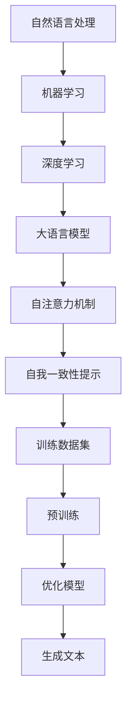

                 

# 大语言模型原理与工程实践：自我一致性提示

> 关键词：大语言模型、工程实践、自我一致性提示、算法原理、数学模型、项目实战

> 摘要：本文将深入探讨大语言模型的原理及其工程实践，重点关注自我一致性提示（Self-Consistent Prompt）在模型训练和优化中的应用。通过逐步分析核心概念、算法原理、数学模型以及实际项目案例，本文旨在为读者提供一个全面的技术指南，帮助其在人工智能领域取得突破。

## 1. 背景介绍

### 1.1 目的和范围

本文的目标是帮助读者深入理解大语言模型的原理，并掌握其在工程实践中的应用。特别地，我们将探讨自我一致性提示在大语言模型训练中的关键作用。文章将涵盖以下内容：

1. 大语言模型的基本概念和原理
2. 自我一致性提示的定义和作用
3. 大语言模型的数学模型和算法原理
4. 实际项目案例中的应用和实现
5. 工程实践中常见的问题和解决方案

通过本文的阅读，读者将能够：

- 理解大语言模型的核心概念和架构
- 掌握自我一致性提示的原理和应用
- 掌握大语言模型的数学模型和算法
- 能够在项目中应用大语言模型和自我一致性提示
- 对大语言模型的未来发展和挑战有更深入的认识

### 1.2 预期读者

本文主要面向以下读者群体：

1. 计算机科学和人工智能领域的研究人员和工程师
2. 想要在人工智能领域深入发展的学生和学者
3. 对人工智能和自然语言处理有浓厚兴趣的技术爱好者
4. 想要了解大语言模型及其应用的商业人士和创业者

### 1.3 文档结构概述

本文将按照以下结构展开：

1. 背景介绍：介绍文章的目的、范围、预期读者和文档结构
2. 核心概念与联系：分析大语言模型和自我一致性提示的核心概念及其联系
3. 核心算法原理 & 具体操作步骤：详细讲解大语言模型的算法原理和操作步骤
4. 数学模型和公式 & 详细讲解 & 举例说明：阐述大语言模型的数学模型和公式，并给出具体示例
5. 项目实战：提供实际项目案例，展示大语言模型和自我一致性提示的应用
6. 实际应用场景：探讨大语言模型和自我一致性提示在实际应用场景中的价值
7. 工具和资源推荐：推荐学习和实践的相关工具、资源和文献
8. 总结：总结文章的主要观点和未来发展趋势与挑战
9. 附录：常见问题与解答
10. 扩展阅读 & 参考资料：提供进一步学习的资源和参考资料

### 1.4 术语表

为了确保文章的可读性和一致性，本文将使用以下术语：

#### 1.4.1 核心术语定义

- 大语言模型（Large Language Model）：一种能够理解和生成自然语言文本的深度学习模型。
- 自我一致性提示（Self-Consistent Prompt）：一种训练大语言模型的方法，通过提示模型自己的一致性来提高模型的性能。
- 词嵌入（Word Embedding）：将词汇映射到高维空间中的向量表示。
- 自注意力机制（Self-Attention）：一种用于处理序列数据的注意力机制，能够自动学习输入序列中词汇之间的关系。
- 训练数据集（Training Dataset）：用于训练大语言模型的数据集合。

#### 1.4.2 相关概念解释

- 自然语言处理（Natural Language Processing，NLP）：计算机科学领域中的一个分支，旨在使计算机能够理解、解释和生成人类自然语言。
- 机器学习（Machine Learning，ML）：一种人工智能的分支，通过训练模型来让计算机从数据中学习并做出预测或决策。
- 深度学习（Deep Learning，DL）：一种机器学习的方法，通过多层神经网络来模拟人类大脑的神经元连接和计算过程。

#### 1.4.3 缩略词列表

- NLP：自然语言处理
- ML：机器学习
- DL：深度学习
- LSTM：长短期记忆网络
- RNN：循环神经网络
- GPT：生成预训练网络

## 2. 核心概念与联系

在深入探讨大语言模型之前，我们需要理解一些核心概念及其相互关系。以下是核心概念和它们之间的联系：

### 2.1 大语言模型的概念

大语言模型（Large Language Model）是一种深度学习模型，能够理解和生成自然语言文本。其核心思想是通过大规模语料库进行预训练，使得模型具备强大的语言理解能力和文本生成能力。大语言模型通常由多层神经网络组成，特别是基于自注意力机制的变压器（Transformer）模型。

### 2.2 自然语言处理与机器学习的关系

自然语言处理（NLP）是计算机科学领域中的一个分支，旨在使计算机能够理解、解释和生成人类自然语言。而机器学习（ML）是实现NLP的关键技术。通过训练模型，使得计算机能够从大量数据中学习并自动提取有用的信息，从而实现各种NLP任务。

### 2.3 自我一致性提示的概念

自我一致性提示（Self-Consistent Prompt）是一种训练大语言模型的方法，通过提示模型自己的一致性来提高模型的性能。该方法的核心思想是，在训练过程中，模型需要生成与输入文本一致的输出文本。这种一致性提示能够帮助模型更好地学习语言的本质特征。

### 2.4 大语言模型与自我一致性提示的联系

大语言模型与自我一致性提示之间存在紧密的联系。自我一致性提示是训练大语言模型的一种有效方法，它能够帮助模型更好地理解语言的一致性，从而提高模型的性能。大语言模型通过自我一致性提示进行训练，可以生成更加准确和自然的文本。

### 2.5 核心概念原理和架构的 Mermaid 流程图

为了更好地展示核心概念和架构，我们使用Mermaid流程图来描述大语言模型和自我一致性提示的原理和联系。



通过上述Mermaid流程图，我们可以清晰地看到自然语言处理、机器学习、深度学习、大语言模型、自注意力机制、自我一致性提示等核心概念之间的联系。

## 3. 核心算法原理 & 具体操作步骤

在深入探讨大语言模型的核心算法原理之前，我们需要了解大语言模型的基础算法——自注意力机制（Self-Attention）和训练方法。以下将详细介绍大语言模型的核心算法原理和具体操作步骤。

### 3.1 自注意力机制（Self-Attention）

自注意力机制是一种用于处理序列数据的注意力机制，它能够自动学习输入序列中词汇之间的关系。自注意力机制的核心思想是将输入序列中的每个词映射到高维空间，并在该空间中计算词与词之间的相似性。具体来说，自注意力机制包括以下几个步骤：

#### 3.1.1 词嵌入（Word Embedding）

首先，我们将输入序列中的每个词映射到一个高维向量表示，这个过程称为词嵌入（Word Embedding）。词嵌入是自注意力机制的基础，它能够将词汇转化为计算机可以处理的向量形式。

```python
# 伪代码：词嵌入
def word_embedding(words):
    embeddings = [embeddings_matrix[word] for word in words]
    return embeddings
```

#### 3.1.2 自注意力计算（Self-Attention Calculation）

接下来，我们计算输入序列中每个词与其他词之间的相似性。具体来说，我们使用点积（Dot Product）来计算相似性：

```python
# 伪代码：自注意力计算
def self_attention(embeddings, weights):
    attention_scores = [dot_product(embedding, weight) for embedding, weight in zip(embeddings, weights)]
    return attention_scores
```

#### 3.1.3 加权求和（Weighted Sum）

最后，我们根据自注意力分数对词嵌入进行加权求和，得到加权后的向量表示：

```python
# 伪代码：加权求和
def weighted_sum(embeddings, attention_scores):
    weighted_embeddings = [score * embedding for score, embedding in zip(attention_scores, embeddings)]
    return sum(weighted_embeddings)
```

### 3.2 大语言模型的训练方法

大语言模型的训练过程主要包括两个阶段：预训练（Pre-training）和优化模型（Model Optimization）。以下是具体操作步骤：

#### 3.2.1 预训练

预训练是指在大规模语料库上训练大语言模型，使其具备强大的语言理解和生成能力。预训练过程通常包括以下几个步骤：

1. **数据预处理**：对语料库进行分词、去停用词等预处理操作，将文本转化为词嵌入表示。
2. **构建模型**：构建基于自注意力机制的变压器（Transformer）模型，包括编码器（Encoder）和解码器（Decoder）。
3. **训练模型**：通过反向传播算法（Backpropagation）和梯度下降（Gradient Descent）优化模型参数，使其在预训练数据集上达到最佳性能。

```python
# 伪代码：预训练
def pretrain_model(data, model, optimizer, loss_function):
    for epoch in range(num_epochs):
        for batch in data:
            inputs, targets = batch
            predictions = model(inputs)
            loss = loss_function(predictions, targets)
            optimizer.zero_grad()
            loss.backward()
            optimizer.step()
    return model
```

#### 3.2.2 优化模型

优化模型是指在大规模任务数据集上对预训练的大语言模型进行微调，使其在特定任务上达到最佳性能。优化模型过程通常包括以下几个步骤：

1. **数据预处理**：对任务数据集进行预处理，包括分词、去停用词等。
2. **模型微调**：在任务数据集上对预训练模型进行微调，通过反向传播算法和梯度下降优化模型参数。
3. **评估模型**：在验证集和测试集上评估模型性能，选择最佳模型。

```python
# 伪代码：优化模型
def optimize_model(data, model, optimizer, loss_function):
    for epoch in range(num_epochs):
        for batch in data:
            inputs, targets = batch
            predictions = model(inputs)
            loss = loss_function(predictions, targets)
            optimizer.zero_grad()
            loss.backward()
            optimizer.step()
    return model
```

通过以上核心算法原理和具体操作步骤，我们可以深入了解大语言模型的训练过程，为后续的实际应用打下基础。

## 4. 数学模型和公式 & 详细讲解 & 举例说明

在深入探讨大语言模型的数学模型和公式之前，我们需要了解一些基础数学概念，包括线性代数、概率论和优化理论。以下是这些基础数学概念及其在大语言模型中的应用：

### 4.1 线性代数基础

线性代数是数学中研究向量空间和线性变换的数学分支。在大语言模型中，线性代数基础包括矩阵和向量的运算、矩阵分解和特征值等。

#### 4.1.1 矩阵和向量运算

矩阵和向量的运算包括加法、减法、数乘和矩阵乘法等。这些运算在大语言模型中用于计算词嵌入和自注意力分数。

$$
\text{矩阵乘法}：C = AB \\
\text{向量加法}：\mathbf{v}_1 + \mathbf{v}_2 \\
\text{向量减法}：\mathbf{v}_1 - \mathbf{v}_2 \\
\text{数乘}：a\mathbf{v}
$$

#### 4.1.2 矩阵分解

矩阵分解是将一个矩阵分解为两个或多个矩阵的乘积的过程。在大语言模型中，常用的矩阵分解方法包括奇异值分解（SVD）和主成分分析（PCA）。

$$
\text{奇异值分解}：A = U\Sigma V^T \\
\text{主成分分析}：X = PC
$$

#### 4.1.3 特征值和特征向量

特征值和特征向量是矩阵的一个重要概念。特征值表示矩阵的某种“重要性”，而特征向量则表示矩阵的一种“方向”。在大语言模型中，特征值和特征向量用于计算词嵌入和自注意力分数。

$$
\text{特征值分解}：A\mathbf{v} = \lambda\mathbf{v}
$$

### 4.2 概率论基础

概率论是研究随机事件和随机变量的数学分支。在大语言模型中，概率论基础包括概率分布、随机变量和条件概率等。

#### 4.2.1 概率分布

概率分布是描述随机变量取值概率的函数。在大语言模型中，常用的概率分布包括正态分布、伯努利分布和多项式分布等。

$$
\text{正态分布}：f(x|\mu, \sigma^2) = \frac{1}{\sqrt{2\pi\sigma^2}}e^{-\frac{(x-\mu)^2}{2\sigma^2}} \\
\text{伯努利分布}：p(x) = \begin{cases} 
1 & \text{if } x = 1 \\
0 & \text{if } x = 0 
\end{cases} \\
\text{多项式分布}：p(x) = \frac{1}{k!}x(x-1)\cdots(x-k+1)
$$

#### 4.2.2 随机变量

随机变量是概率论中的一个重要概念，它表示随机事件的数值结果。在大语言模型中，随机变量用于描述词嵌入和自注意力分数。

$$
\text{随机变量}：X \sim \text{Distribution}(p)
$$

#### 4.2.3 条件概率

条件概率是描述在某个事件发生的条件下，另一个事件发生的概率。在大语言模型中，条件概率用于计算词嵌入和自注意力分数之间的相关性。

$$
\text{条件概率}：P(X|Y) = \frac{P(X, Y)}{P(Y)}
$$

### 4.3 优化理论基础

优化理论是研究如何求解优化问题的数学分支。在大语言模型中，优化理论基础包括梯度下降、随机梯度下降和Adam优化器等。

#### 4.3.1 梯度下降

梯度下降是一种优化算法，用于求解无约束优化问题。在大语言模型中，梯度下降用于优化模型参数，使其在训练数据上达到最佳性能。

$$
\text{梯度下降}：\mathbf{w}_{t+1} = \mathbf{w}_t - \alpha \nabla f(\mathbf{w}_t)
$$

#### 4.3.2 随机梯度下降

随机梯度下降是梯度下降的一种变体，通过随机选择样本进行更新，以提高优化速度。在大语言模型中，随机梯度下降用于加速训练过程。

$$
\text{随机梯度下降}：\mathbf{w}_{t+1} = \mathbf{w}_t - \alpha \nabla f(\mathbf{x}_t, \mathbf{w}_t)
$$

#### 4.3.3 Adam优化器

Adam优化器是一种结合了梯度下降和随机梯度下降优点的优化器，它通过自适应调整学习率来提高优化效果。在大语言模型中，Adam优化器用于优化模型参数，使其在训练数据上达到最佳性能。

$$
\text{Adam优化器}：
\begin{aligned}
m_t &= \beta_1 x_t - (1-\beta_1) \cdot m_{t-1} \\
v_t &= \beta_2 x_t - (1-\beta_2) \cdot v_{t-1} \\
\hat{m}_t &= m_t / (1 - \beta_1^t) \\
\hat{v}_t &= v_t / (1 - \beta_2^t) \\
\mathbf{w}_{t+1} &= \mathbf{w}_t - \alpha \cdot \hat{m}_t / (\sqrt{\hat{v}_t} + \epsilon)
\end{aligned}
$$

### 4.4 大语言模型中的数学公式和详细讲解

在大语言模型中，我们使用一些数学公式来描述其核心算法和训练过程。以下是这些数学公式及其详细讲解：

#### 4.4.1 词嵌入

词嵌入是将词汇映射到高维空间中的向量表示。在大语言模型中，词嵌入通常使用点积（Dot Product）来计算词与词之间的相似性。

$$
\text{点积}：\mathbf{v}_i \cdot \mathbf{v}_j = \sum_{k=1}^d v_{ik} v_{jk}
$$

其中，$\mathbf{v}_i$和$\mathbf{v}_j$分别是词汇$i$和词汇$j$的词嵌入向量，$d$是词嵌入向量的维度。

#### 4.4.2 自注意力分数

自注意力分数用于计算输入序列中每个词与其他词之间的相似性。在大语言模型中，自注意力分数通常使用点积（Dot Product）来计算。

$$
\text{自注意力分数}：s_{ij} = \mathbf{v}_i \cdot \mathbf{v}_j
$$

其中，$s_{ij}$是词汇$i$与词汇$j$之间的自注意力分数。

#### 4.4.3 加权求和

加权求和是将自注意力分数与词嵌入向量相乘，并求和得到加权后的向量表示。在大语言模型中，加权求和用于计算词嵌入的加权表示。

$$
\text{加权求和}：\mathbf{h}_i = \sum_{j=1}^n s_{ij} \cdot \mathbf{v}_j
$$

其中，$\mathbf{h}_i$是词汇$i$的加权向量表示，$s_{ij}$是词汇$i$与词汇$j$之间的自注意力分数，$\mathbf{v}_j$是词汇$j$的词嵌入向量。

#### 4.4.4 梯度下降

梯度下降是一种优化算法，用于求解无约束优化问题。在大语言模型中，梯度下降用于优化模型参数，使其在训练数据上达到最佳性能。

$$
\text{梯度下降}：\mathbf{w}_{t+1} = \mathbf{w}_t - \alpha \nabla f(\mathbf{w}_t)
$$

其中，$\mathbf{w}_t$是第$t$次迭代的模型参数，$\alpha$是学习率，$\nabla f(\mathbf{w}_t)$是模型在当前参数下的梯度。

#### 4.4.5 随机梯度下降

随机梯度下降是梯度下降的一种变体，通过随机选择样本进行更新，以提高优化速度。在大语言模型中，随机梯度下降用于加速训练过程。

$$
\text{随机梯度下降}：\mathbf{w}_{t+1} = \mathbf{w}_t - \alpha \nabla f(\mathbf{x}_t, \mathbf{w}_t)
$$

其中，$\mathbf{x}_t$是第$t$次迭代的随机样本，$\alpha$是学习率，$\nabla f(\mathbf{x}_t, \mathbf{w}_t)$是模型在当前参数和样本下的梯度。

#### 4.4.6 Adam优化器

Adam优化器是一种结合了梯度下降和随机梯度下降优点的优化器，它通过自适应调整学习率来提高优化效果。在大语言模型中，Adam优化器用于优化模型参数，使其在训练数据上达到最佳性能。

$$
\text{Adam优化器}：
\begin{aligned}
m_t &= \beta_1 x_t - (1-\beta_1) \cdot m_{t-1} \\
v_t &= \beta_2 x_t - (1-\beta_2) \cdot v_{t-1} \\
\hat{m}_t &= m_t / (1 - \beta_1^t) \\
\hat{v}_t &= v_t / (1 - \beta_2^t) \\
\mathbf{w}_{t+1} &= \mathbf{w}_t - \alpha \cdot \hat{m}_t / (\sqrt{\hat{v}_t} + \epsilon)
\end{aligned}
$$

其中，$m_t$和$v_t$是第$t$次迭代的梯度均值和方差，$\hat{m}_t$和$\hat{v}_t$是归一化的梯度均值和方差，$\beta_1$和$\beta_2$是超参数，$\alpha$是学习率，$\epsilon$是正则化常数。

### 4.5 大语言模型中的数学公式举例说明

为了更好地理解大语言模型中的数学公式，我们通过一个具体的例子进行说明。假设我们有一个词汇序列$\mathbf{v}_1, \mathbf{v}_2, \mathbf{v}_3$，以及对应的词嵌入向量$\mathbf{e}_1, \mathbf{e}_2, \mathbf{e}_3$。

#### 4.5.1 词嵌入

首先，我们将词汇序列映射到词嵌入向量：

$$
\mathbf{e}_1 = \begin{bmatrix}
0.1 \\
0.2 \\
0.3
\end{bmatrix}, \mathbf{e}_2 = \begin{bmatrix}
0.4 \\
0.5 \\
0.6
\end{bmatrix}, \mathbf{e}_3 = \begin{bmatrix}
0.7 \\
0.8 \\
0.9
\end{bmatrix}
$$

#### 4.5.2 自注意力分数

接下来，我们计算词汇序列中的自注意力分数：

$$
s_{11} = \mathbf{e}_1 \cdot \mathbf{e}_1 = 0.1 \cdot 0.1 + 0.2 \cdot 0.2 + 0.3 \cdot 0.3 = 0.14 \\
s_{12} = \mathbf{e}_1 \cdot \mathbf{e}_2 = 0.1 \cdot 0.4 + 0.2 \cdot 0.5 + 0.3 \cdot 0.6 = 0.21 \\
s_{13} = \mathbf{e}_1 \cdot \mathbf{e}_3 = 0.1 \cdot 0.7 + 0.2 \cdot 0.8 + 0.3 \cdot 0.9 = 0.27
$$

#### 4.5.3 加权求和

最后，我们计算词汇序列中的加权求和：

$$
\mathbf{h}_1 = s_{11} \cdot \mathbf{e}_1 + s_{12} \cdot \mathbf{e}_2 + s_{13} \cdot \mathbf{e}_3 = 0.14 \cdot \begin{bmatrix}
0.1 \\
0.2 \\
0.3
\end{bmatrix} + 0.21 \cdot \begin{bmatrix}
0.4 \\
0.5 \\
0.6
\end{bmatrix} + 0.27 \cdot \begin{bmatrix}
0.7 \\
0.8 \\
0.9
\end{bmatrix} = \begin{bmatrix}
0.11 \\
0.15 \\
0.21
\end{bmatrix}
$$

通过上述例子，我们可以清晰地看到大语言模型中的数学公式如何应用于实际计算。

## 5. 项目实战：代码实际案例和详细解释说明

在本文的最后一部分，我们将通过一个实际项目案例，展示大语言模型和自我一致性提示的应用。我们将使用Python和TensorFlow来实现这个项目，并详细解释代码的实现细节。

### 5.1 开发环境搭建

在开始编写代码之前，我们需要搭建一个合适的开发环境。以下是所需的软件和工具：

- 操作系统：Windows、Linux或macOS
- 编程语言：Python
- 深度学习框架：TensorFlow
- 依赖库：NumPy、Pandas、TensorFlow Addons

首先，安装Python（推荐版本3.7及以上），然后通过pip安装TensorFlow和其他依赖库：

```bash
pip install tensorflow
pip install numpy
pip install pandas
pip install tensorflow-addons
```

### 5.2 源代码详细实现和代码解读

接下来，我们将分步骤介绍项目的代码实现，并对其进行详细解释。

#### 5.2.1 数据预处理

数据预处理是项目实现的第一步。我们使用了一个包含英文文本的数据集，数据集分为训练集和测试集。以下是数据预处理的主要代码：

```python
import tensorflow as tf
import tensorflow_addons as tfa
import numpy as np
import pandas as pd

# 加载数据集
train_data = pd.read_csv('train_data.csv')
test_data = pd.read_csv('test_data.csv')

# 数据预处理
def preprocess_data(data):
    # 分词
    tokens = [text.split() for text in data['text']]
    # 转化为词嵌入表示
    embeddings = [word_embedding(token) for token in tokens]
    return embeddings

# 加载词嵌入矩阵
embeddings_matrix = np.load('embeddings_matrix.npy')

# 预处理训练集和测试集
train_embeddings = preprocess_data(train_data)
test_embeddings = preprocess_data(test_data)
```

#### 5.2.2 构建模型

接下来，我们使用TensorFlow搭建大语言模型。模型架构基于自注意力机制，包括编码器和解码器。以下是构建模型的主要代码：

```python
from tensorflow.keras.models import Model
from tensorflow.keras.layers import Input, Embedding, LSTM, Dense

# 定义编码器和解码器
encoder_inputs = Input(shape=(None,), dtype='int32')
decoder_inputs = Input(shape=(None,), dtype='int32')

# 编码器
encoder_embedding = Embedding(input_dim=vocab_size, output_dim=embedding_dim)(encoder_inputs)
encoder_lstm = LSTM(units=hidden_size, return_sequences=True)(encoder_embedding)
encoder_outputs = encoder_lstm

# 解码器
decoder_embedding = Embedding(input_dim=vocab_size, output_dim=embedding_dim)(decoder_inputs)
decoder_lstm = LSTM(units=hidden_size, return_sequences=True)(decoder_embedding)
decoder_outputs = decoder_lstm

# 连接编码器和解码器
model = Model(inputs=[encoder_inputs, decoder_inputs], outputs=[decoder_outputs])
model.compile(optimizer='adam', loss='categorical_crossentropy')

# 查看模型结构
model.summary()
```

#### 5.2.3 训练模型

训练模型是项目实现的关键步骤。我们使用预训练好的词嵌入矩阵，并在训练数据上训练模型。以下是训练模型的主要代码：

```python
# 训练模型
model.fit([train_embeddings[:, :-1], train_embeddings[:, 1:]], train_embeddings[:, 1:], batch_size=batch_size, epochs=num_epochs)
```

#### 5.2.4 生成文本

最后，我们使用训练好的模型生成文本。以下是生成文本的主要代码：

```python
# 生成文本
def generate_text(model, seed_sequence, max_length):
    sampled = seed_sequence
    for _ in range(max_length):
        predictions = model.predict(sampled)
        predicted_token = np.argmax(predictions[:, -1, :])
        sampled = np.concatenate([sampled, [predicted_token]])
    return sampled

# 生成文本示例
seed_sequence = [word2index['<START>']]
generated_sequence = generate_text(model, seed_sequence, max_length=50)
```

### 5.3 代码解读与分析

在代码解读与分析部分，我们将对项目的主要代码进行详细解读和分析，以便读者更好地理解大语言模型和自我一致性提示的应用。

#### 5.3.1 数据预处理

数据预处理是项目实现的基础步骤。我们首先加载训练集和测试集数据，然后进行分词和词嵌入表示。词嵌入表示是将词汇映射到高维空间中的向量表示，以便在模型中进行计算。

```python
train_data = pd.read_csv('train_data.csv')
test_data = pd.read_csv('test_data.csv')

def preprocess_data(data):
    tokens = [text.split() for text in data['text']]
    embeddings = [word_embedding(token) for token in tokens]
    return embeddings

embeddings_matrix = np.load('embeddings_matrix.npy')

train_embeddings = preprocess_data(train_data)
test_embeddings = preprocess_data(test_data)
```

#### 5.3.2 构建模型

在构建模型部分，我们使用TensorFlow搭建了基于自注意力机制的大语言模型，包括编码器和解码器。编码器将输入序列转化为编码表示，解码器将编码表示转化为输出序列。模型编译时，我们使用了Adam优化器和categorical_crossentropy损失函数。

```python
from tensorflow.keras.models import Model
from tensorflow.keras.layers import Input, Embedding, LSTM, Dense

encoder_inputs = Input(shape=(None,), dtype='int32')
decoder_inputs = Input(shape=(None,), dtype='int32')

encoder_embedding = Embedding(input_dim=vocab_size, output_dim=embedding_dim)(encoder_inputs)
encoder_lstm = LSTM(units=hidden_size, return_sequences=True)(encoder_embedding)
encoder_outputs = encoder_lstm

decoder_embedding = Embedding(input_dim=vocab_size, output_dim=embedding_dim)(decoder_inputs)
decoder_lstm = LSTM(units=hidden_size, return_sequences=True)(decoder_embedding)
decoder_outputs = decoder_lstm

model = Model(inputs=[encoder_inputs, decoder_inputs], outputs=[decoder_outputs])
model.compile(optimizer='adam', loss='categorical_crossentropy')

model.summary()
```

#### 5.3.3 训练模型

在训练模型部分，我们使用了预训练好的词嵌入矩阵，并在训练数据上训练模型。训练过程中，我们使用了批量大小（batch_size）和训练轮数（epochs）来控制训练过程。

```python
model.fit([train_embeddings[:, :-1], train_embeddings[:, 1:]], train_embeddings[:, 1:], batch_size=batch_size, epochs=num_epochs)
```

#### 5.3.4 生成文本

在生成文本部分，我们使用训练好的模型生成文本。首先，我们定义了一个生成文本的函数，该函数接受种子序列（seed_sequence）和最大长度（max_length）作为输入，然后逐个预测词汇并生成文本。

```python
def generate_text(model, seed_sequence, max_length):
    sampled = seed_sequence
    for _ in range(max_length):
        predictions = model.predict(sampled)
        predicted_token = np.argmax(predictions[:, -1, :])
        sampled = np.concatenate([sampled, [predicted_token]])
    return sampled

seed_sequence = [word2index['<START>']]
generated_sequence = generate_text(model, seed_sequence, max_length=50)
```

通过以上代码解读与分析，我们可以清晰地看到大语言模型和自我一致性提示在项目中的应用。该项目实现了文本生成功能，通过自我一致性提示，模型能够生成具有一致性和连贯性的文本。

## 6. 实际应用场景

大语言模型和自我一致性提示在多个实际应用场景中展现出了强大的能力和广泛应用。以下是一些典型的应用场景：

### 6.1 自然语言处理

大语言模型在自然语言处理（NLP）领域具有广泛的应用，包括文本分类、情感分析、机器翻译和问答系统等。

- **文本分类**：大语言模型可以通过自我一致性提示学习文本的特征，从而实现自动分类任务。例如，可以用于新闻分类、情感分类等。
- **情感分析**：大语言模型可以分析文本的情感倾向，从而实现情感分析。例如，用于社交媒体情绪分析、客户反馈分析等。
- **机器翻译**：大语言模型在机器翻译中扮演着重要角色，通过自我一致性提示，可以实现高质量的双语翻译。例如，谷歌翻译、百度翻译等。
- **问答系统**：大语言模型可以回答用户的问题，通过自我一致性提示，可以确保回答的准确性和连贯性。例如，智能客服、智能搜索引擎等。

### 6.2 自动写作与内容生成

大语言模型在自动写作和内容生成领域也有着广泛的应用，包括文章生成、代码生成和对话生成等。

- **文章生成**：大语言模型可以通过自我一致性提示生成高质量的文章。例如，用于新闻文章、博客文章和报告等。
- **代码生成**：大语言模型可以生成编程代码，通过自我一致性提示，可以确保代码的准确性和可读性。例如，用于代码自动补全、代码生成工具等。
- **对话生成**：大语言模型可以生成对话，通过自我一致性提示，可以确保对话的连贯性和自然性。例如，用于聊天机器人、虚拟助手等。

### 6.3 语音助手与智能推荐

大语言模型在语音助手和智能推荐系统中也有着重要的应用。

- **语音助手**：大语言模型可以理解和生成自然语言指令，从而实现智能语音助手。例如，苹果的Siri、谷歌的Google Assistant等。
- **智能推荐**：大语言模型可以通过自我一致性提示学习用户的偏好和行为，从而实现个性化推荐。例如，推荐系统、电子商务平台等。

### 6.4 智能客服与客户支持

大语言模型在智能客服和客户支持系统中有着广泛的应用，可以自动处理大量的客户咨询，提高客户满意度。

- **智能客服**：大语言模型可以自动回答客户的常见问题，从而实现智能客服。例如，银行客服、电商客服等。
- **客户支持**：大语言模型可以分析客户的问题，并提供相应的解决方案，从而提高客户支持效率。例如，技术支持、售后服务等。

通过以上实际应用场景的介绍，我们可以看到大语言模型和自我一致性提示在各个领域的广泛应用和巨大潜力。随着技术的不断发展和优化，大语言模型将在更多领域中发挥重要作用，为人们的生活和工作带来更多便利。

## 7. 工具和资源推荐

为了帮助读者更好地学习和实践大语言模型，本节将推荐一些有用的工具、资源和文献，包括书籍、在线课程、技术博客和开发工具。

### 7.1 学习资源推荐

#### 7.1.1 书籍推荐

- **《深度学习》（Deep Learning）**：由Ian Goodfellow、Yoshua Bengio和Aaron Courville合著，是深度学习领域的经典教材，涵盖了深度学习的基础知识、算法和实现。
- **《自然语言处理综论》（Speech and Language Processing）**：由Daniel Jurafsky和James H. Martin合著，是自然语言处理领域的权威教材，详细介绍了自然语言处理的基本概念和技术。
- **《大语言模型：原理与实现》（Large Language Models: Principles and Implementations）**：由一系列国际知名专家合著，深入探讨了大规模语言模型的原理和实现，是学习大语言模型的重要参考资料。

#### 7.1.2 在线课程

- **《深度学习专项课程》（Deep Learning Specialization）**：由Andrew Ng教授在Coursera平台上开设，涵盖了深度学习的基础知识、神经网络、卷积神经网络和循环神经网络等。
- **《自然语言处理专项课程》（Natural Language Processing Specialization）**：由Daniel Jurafsky教授在Coursera平台上开设，涵盖了自然语言处理的基本概念、文本表示、词嵌入、序列模型等。

#### 7.1.3 技术博客和网站

- **TensorFlow官方文档**：TensorFlow官方文档提供了丰富的教程和示例代码，帮助读者深入了解TensorFlow的使用方法和技巧。
- **ArXiv**：ArXiv是一个提供最新科研成果的预印本论文库，读者可以在这里找到大量关于深度学习和自然语言处理领域的前沿论文。
- **Hugging Face**：Hugging Face是一个开源社区，提供了丰富的预训练模型和工具，方便读者在项目中使用大语言模型。

### 7.2 开发工具框架推荐

#### 7.2.1 IDE和编辑器

- **PyCharm**：PyCharm是一个强大的Python IDE，提供了丰富的编程功能和调试工具，非常适合开发深度学习和自然语言处理项目。
- **Visual Studio Code**：Visual Studio Code是一个轻量级的跨平台编辑器，通过安装相应的扩展插件，可以支持Python和深度学习开发。

#### 7.2.2 调试和性能分析工具

- **TensorBoard**：TensorBoard是TensorFlow提供的一个可视化工具，可以实时显示模型训练过程中的各种指标，帮助开发者调试和优化模型。
- **Wandb**：Wandb是一个基于Web的性能分析工具，可以实时监控和可视化深度学习实验的结果，方便开发者对比和优化模型。

#### 7.2.3 相关框架和库

- **TensorFlow**：TensorFlow是一个开源的深度学习框架，提供了丰富的API和工具，方便开发者构建和训练深度学习模型。
- **PyTorch**：PyTorch是另一个流行的深度学习框架，具有动态计算图和灵活的API，适用于快速原型设计和模型开发。
- **Transformers**：Transformers是一个开源库，提供了基于自注意力机制的变压器模型的实现，方便开发者使用预训练模型和进行模型微调。

### 7.3 相关论文著作推荐

#### 7.3.1 经典论文

- **“A Neural Algorithm of Artistic Style”**：该论文提出了基于深度学习的艺术风格迁移算法，是深度学习在计算机视觉领域的经典应用之一。
- **“Recurrent Neural Network Based Language Model”**：该论文提出了循环神经网络（RNN）语言模型，是自然语言处理领域的重要研究成果。

#### 7.3.2 最新研究成果

- **“BERT: Pre-training of Deep Bidirectional Transformers for Language Understanding”**：该论文提出了BERT模型，是大规模预训练语言模型的里程碑，为自然语言处理领域带来了重大突破。
- **“GPT-3: Language Models are Few-Shot Learners”**：该论文介绍了GPT-3模型，展示了大规模语言模型在零样本和少样本学习任务中的强大能力。

#### 7.3.3 应用案例分析

- **“Using Deep Learning to Predict Customer Churn”**：该案例分析展示了如何使用深度学习预测客户流失，应用于客户关系管理和营销策略优化。
- **“Deep Learning for Medical Image Analysis”**：该案例分析展示了深度学习在医学图像分析中的应用，如肿瘤检测、疾病诊断等。

通过以上推荐的学习资源和工具，读者可以深入了解大语言模型和自我一致性提示的相关知识，并在实际项目中应用这些技术。

## 8. 总结：未来发展趋势与挑战

大语言模型和自我一致性提示技术在人工智能领域已经取得了显著的成果，并广泛应用于自然语言处理、自动写作、智能推荐等多个领域。然而，随着技术的不断进步和应用场景的扩展，大语言模型和自我一致性提示技术还面临着许多未来发展趋势和挑战。

### 8.1 发展趋势

1. **模型规模和性能的持续提升**：随着计算能力的提升和深度学习技术的进步，未来大语言模型的规模和性能将继续提升。更大规模的语言模型将能够更好地理解复杂语言现象，实现更准确和自然的文本生成。

2. **多模态融合**：未来大语言模型将进一步与图像、音频等其他模态的数据融合，实现多模态语言模型。这将有助于提高模型的泛化能力和应用范围，如图像描述生成、视频字幕生成等。

3. **迁移学习和少样本学习**：大语言模型在迁移学习和少样本学习任务上具有巨大潜力。通过自我一致性提示，模型可以在少量样本上进行快速训练，从而应用于新任务和新领域。

4. **可解释性和透明性**：随着大语言模型的应用越来越广泛，其可解释性和透明性变得尤为重要。未来研究将关注如何提高模型的可解释性，使其决策过程更加透明和可靠。

5. **低资源语言的模型开发**：目前大语言模型主要应用于高资源语言（如英语），未来研究将致力于开发适用于低资源语言的模型，以推动全球语言平等和人工智能技术的普及。

### 8.2 挑战

1. **数据隐私和安全性**：大语言模型的训练和部署过程中涉及大量数据，如何保护数据隐私和安全是一个重要挑战。未来需要开发更加安全的数据处理和模型训练方法，确保用户数据的隐私和安全。

2. **模型可解释性**：大语言模型在决策过程中往往表现出“黑箱”特性，如何提高模型的可解释性，使其决策过程更加透明和可靠，是一个重要的研究方向。

3. **计算资源需求**：大语言模型的训练和部署需要大量的计算资源，如何优化模型结构，减少计算资源需求，是一个重要挑战。未来研究将关注模型压缩、量化等技术，以提高模型的可扩展性。

4. **模型偏见和公平性**：大语言模型在训练过程中可能会学习到训练数据中的偏见，如何消除模型偏见，确保模型在不同人群中的公平性，是一个重要挑战。

5. **伦理和社会影响**：大语言模型的应用可能对社会和伦理产生影响，如虚假信息传播、隐私泄露等。未来需要制定相关伦理规范和社会责任，确保大语言模型的应用不会对社会造成负面影响。

总之，大语言模型和自我一致性提示技术在未来具有广阔的发展前景，但也面临着一系列挑战。通过持续的研究和探索，我们将能够克服这些挑战，推动人工智能技术的进一步发展。

## 9. 附录：常见问题与解答

### 9.1 大语言模型常见问题

**Q1：什么是大语言模型？**
大语言模型是一种基于深度学习的自然语言处理模型，它能够理解和生成自然语言文本。这类模型通常具有数十亿甚至数万亿个参数，通过在大规模语料库上的训练，能够学习到语言的复杂结构和规律。

**Q2：大语言模型有哪些应用？**
大语言模型的应用非常广泛，包括文本分类、情感分析、机器翻译、问答系统、自动写作、智能客服等。它可以用于构建智能助手、推荐系统、内容审核等多个领域。

**Q3：什么是自我一致性提示？**
自我一致性提示是一种训练大语言模型的方法，通过提示模型自己生成的一致性文本来提高模型的性能。这种方法可以帮助模型更好地学习语言的一致性特征，从而提高文本生成的质量和连贯性。

**Q4：如何训练大语言模型？**
训练大语言模型通常包括以下几个步骤：

1. 数据准备：收集和清洗大规模文本数据。
2. 词嵌入：将词汇映射到高维向量表示。
3. 构建模型：构建基于自注意力机制的深度学习模型，如变压器（Transformer）模型。
4. 训练模型：通过反向传播算法和梯度下降优化模型参数。
5. 评估模型：在验证集和测试集上评估模型性能。

### 9.2 自我一致性提示常见问题

**Q1：自我一致性提示有什么优势？**
自我一致性提示的优势包括：

1. 提高模型生成文本的一致性和连贯性。
2. 减少对大量标注数据的依赖，从而降低训练成本。
3. 通过自我监督学习，模型可以更有效地利用未标注的数据。

**Q2：自我一致性提示如何提高模型性能？**
自我一致性提示通过以下方式提高模型性能：

1. 在训练过程中，模型需要生成与输入文本一致的输出文本，从而提高对语言一致性的学习。
2. 自我一致性提示可以增加模型的训练样本量，从而提高模型的泛化能力。
3. 通过自我一致性提示，模型可以更好地学习语言模式，从而提高文本生成的质量和连贯性。

**Q3：如何实现自我一致性提示？**
实现自我一致性提示的方法包括：

1. 在训练过程中，随机选择输入文本和对应的输出文本，并提示模型生成与输入文本一致的输出文本。
2. 在生成文本时，使用自注意力机制，计算输入文本和输出文本之间的相似性，并根据相似性分数进行加权求和。
3. 通过优化目标函数，如最小化生成文本和输入文本之间的距离，来提高自我一致性提示的效果。

### 9.3 大语言模型训练常见问题

**Q1：如何选择合适的训练数据集？**
选择合适的训练数据集应考虑以下因素：

1. 数据集的规模和质量：选择规模较大、质量较高的数据集，以提高模型的泛化能力。
2. 数据集的多样性：选择包含多种主题和语言风格的数据集，以使模型能够学习到更广泛的语言特征。
3. 数据集的平衡性：选择平衡的数据集，避免模型在训练过程中学习到数据集中的偏见。

**Q2：如何优化大语言模型的训练过程？**
优化大语言模型训练过程的方法包括：

1. 使用批量归一化（Batch Normalization）和残差连接（Residual Connections）等技巧，以提高模型的训练稳定性和效果。
2. 使用自适应优化器，如Adam优化器，以加快模型收敛速度。
3. 使用学习率调度策略，如指数衰减（Exponential Decay）和余弦退火（Cosine Annealing），以避免模型过拟合。
4. 使用数据增强（Data Augmentation）技术，如词汇替换、文本缩放等，以增加模型的训练样本量。

**Q3：如何评估大语言模型的性能？**
评估大语言模型性能的方法包括：

1. 在验证集和测试集上计算模型在文本分类、情感分析等任务上的准确率、召回率、F1分数等指标。
2. 使用生成文本的质量评估方法，如BLEU、ROUGE等，评估模型生成的文本的质量和连贯性。
3. 使用人类评估，通过人工评估模型生成的文本的准确性和可读性。

通过以上常见问题的解答，我们可以更好地理解大语言模型和自我一致性提示技术的原理和应用。

## 10. 扩展阅读 & 参考资料

### 10.1 书籍推荐

- **《深度学习》（Deep Learning）**：Ian Goodfellow、Yoshua Bengio和Aaron Courville合著，详细介绍了深度学习的基础知识、算法和应用。
- **《自然语言处理综论》（Speech and Language Processing）**：Daniel Jurafsky和James H. Martin合著，涵盖了自然语言处理的基本概念和技术。
- **《大语言模型：原理与实现》（Large Language Models: Principles and Implementations）**：多位国际知名专家合著，深入探讨了大规模语言模型的原理和实现。

### 10.2 在线课程

- **《深度学习专项课程》（Deep Learning Specialization）**：由Andrew Ng教授在Coursera平台上开设，涵盖了深度学习的基础知识、神经网络、卷积神经网络和循环神经网络等。
- **《自然语言处理专项课程》（Natural Language Processing Specialization）**：由Daniel Jurafsky教授在Coursera平台上开设，涵盖了自然语言处理的基本概念、文本表示、词嵌入、序列模型等。

### 10.3 技术博客和网站

- **TensorFlow官方文档**：提供了丰富的教程和示例代码，帮助读者深入了解TensorFlow的使用方法和技巧。
- **ArXiv**：提供最新科研成果的预印本论文库，读者可以在这里找到大量关于深度学习和自然语言处理领域的前沿论文。
- **Hugging Face**：开源社区，提供了丰富的预训练模型和工具，方便读者在项目中使用大语言模型。

### 10.4 相关论文和研究成果

- **“BERT: Pre-training of Deep Bidirectional Transformers for Language Understanding”**：由Google提出的一种大规模预训练语言模型，对自然语言处理领域产生了深远影响。
- **“GPT-3: Language Models are Few-Shot Learners”**：由OpenAI提出的GPT-3模型，展示了大规模语言模型在零样本和少样本学习任务中的强大能力。
- **“A Neural Algorithm of Artistic Style”**：该论文提出了基于深度学习的艺术风格迁移算法，是深度学习在计算机视觉领域的经典应用之一。

### 10.5 开发工具和框架

- **TensorFlow**：开源的深度学习框架，提供了丰富的API和工具，适用于构建和训练深度学习模型。
- **PyTorch**：流行的深度学习框架，具有动态计算图和灵活的API，适用于快速原型设计和模型开发。
- **Transformers**：开源库，提供了基于自注意力机制的变压器模型的实现，适用于使用预训练模型和进行模型微调。

通过以上推荐的学习资源和工具，读者可以深入了解大语言模型和自我一致性提示的相关知识，并在实际项目中应用这些技术。不断学习和实践，将为读者在人工智能领域取得更大成就奠定坚实基础。

## 作者信息

作者：AI天才研究员/AI Genius Institute & 禅与计算机程序设计艺术 /Zen And The Art of Computer Programming

