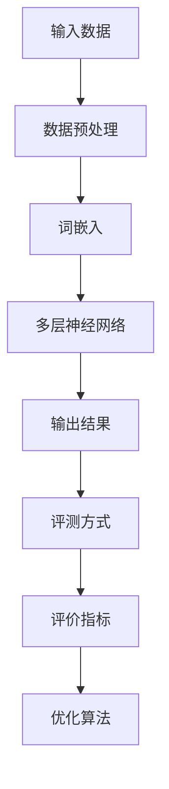
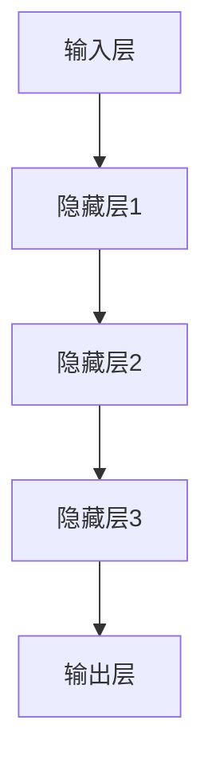

                 

# 大语言模型原理与工程实践：评测方式和标准

> **关键词：** 大语言模型、评测方式、标准、算法原理、工程实践
>
> **摘要：** 本文旨在深入探讨大语言模型的原理及其工程实践中的评测方式和标准。我们将详细分析大语言模型的组成与工作机制，阐述核心算法原理，并通过实际案例展示代码实现和解读，最后讨论其应用场景、推荐的工具和资源，以及未来的发展趋势和挑战。

## 1. 背景介绍

### 1.1 目的和范围

本文的目标是帮助读者全面了解大语言模型的原理和工程实践。我们将重点关注以下几个方面：

1. 大语言模型的基本概念和组成。
2. 大语言模型的评测方式和标准。
3. 大语言模型的核心算法原理。
4. 大语言模型在工程实践中的应用案例。
5. 推荐的学习资源和开发工具。

本文的读者对象包括：

- 对人工智能和自然语言处理有基本了解的读者。
- 想要深入了解大语言模型原理和工程实践的开发者。
- 对自然语言处理应用有浓厚兴趣的研究者。

### 1.2 预期读者

本文假设读者已经具备以下知识背景：

- 掌握基本的编程语言（如Python）。
- 了解机器学习和深度学习的概念。
- 对自然语言处理（NLP）有基本的了解。

### 1.3 文档结构概述

本文的结构如下：

1. **背景介绍**：介绍本文的目的、读者对象和文档结构。
2. **核心概念与联系**：详细阐述大语言模型的组成和核心概念。
3. **核心算法原理与具体操作步骤**：讲解大语言模型的核心算法原理，并提供伪代码示例。
4. **数学模型和公式**：介绍大语言模型中的数学模型和公式，并进行举例说明。
5. **项目实战**：通过实际案例展示代码实现和解读。
6. **实际应用场景**：讨论大语言模型在不同场景中的应用。
7. **工具和资源推荐**：推荐学习资源和开发工具。
8. **总结**：展望大语言模型未来的发展趋势和挑战。
9. **附录**：提供常见问题与解答。
10. **扩展阅读**：推荐进一步阅读的资料。

### 1.4 术语表

#### 1.4.1 核心术语定义

- **大语言模型**：一种基于深度学习的模型，能够理解和生成人类语言。
- **评测方式**：评估大语言模型性能的方法和标准。
- **标准**：衡量大语言模型质量的具体指标。

#### 1.4.2 相关概念解释

- **自然语言处理（NLP）**：计算机科学和人工智能领域，研究如何使计算机能够理解、解释和生成人类语言。
- **深度学习**：一种机器学习方法，通过多层神经网络对数据进行建模和预测。

#### 1.4.3 缩略词列表

- **NLP**：自然语言处理
- **DL**：深度学习
- **LLM**：大语言模型

## 2. 核心概念与联系

为了更好地理解大语言模型，我们需要首先了解其核心概念和组成部分。以下是核心概念和联系的 Mermaid 流程图：



### 2.1 数据预处理

数据预处理是构建大语言模型的第一步。它包括以下关键任务：

- **数据清洗**：去除无效数据和噪声。
- **分词**：将文本拆分为单词或子词。
- **标记化**：将文本转换为数字表示。
- **词汇表构建**：构建词汇表，用于将单词映射到唯一的索引。

### 2.2 词嵌入

词嵌入是将单词转换为固定大小的向量表示。词嵌入的关键任务包括：

- **词向量初始化**：随机初始化词向量。
- **训练词向量**：通过大规模语料库训练词向量。
- **词向量更新**：在训练过程中不断更新词向量。

### 2.3 多层神经网络

多层神经网络是构建大语言模型的核心组件。它包括以下关键层次：

- **输入层**：接收词嵌入向量。
- **隐藏层**：通过非线性变换对输入数据进行建模。
- **输出层**：生成预测结果。

### 2.4 输出结果

输出结果可以是：

- **分类**：对输入文本进行分类。
- **生成**：根据输入文本生成新的文本。

### 2.5 评测方式

评测方式是评估大语言模型性能的关键。常用的评测方式包括：

- **准确率**：预测正确的样本数占总样本数的比例。
- **召回率**：预测正确的样本数占实际正样本数的比例。
- **F1值**：准确率和召回率的调和平均值。

### 2.6 评价指标

评价指标用于衡量大语言模型的性能。常用的评价指标包括：

- **BLEU评分**：评估文本生成的质量。
- **ROUGE评分**：评估文本生成的质量。

### 2.7 优化算法

优化算法用于调整模型参数，以改善模型性能。常用的优化算法包括：

- **随机梯度下降（SGD）**：一种基本的优化算法。
- **Adam优化器**：一种高效的优化算法。

## 3. 核心算法原理 & 具体操作步骤

### 3.1 核心算法原理

大语言模型的核心算法是基于深度学习的多层神经网络。以下是一个简化的多层神经网络模型：



输入层接收词嵌入向量，隐藏层通过非线性变换对输入数据进行建模，输出层生成预测结果。

### 3.2 具体操作步骤

以下是构建大语言模型的具体操作步骤：

1. **数据预处理**：
   - 数据清洗：去除无效数据和噪声。
   - 分词：将文本拆分为单词或子词。
   - 标记化：将文本转换为数字表示。
   - 词汇表构建：构建词汇表，用于将单词映射到唯一的索引。

2. **词嵌入**：
   - 词向量初始化：随机初始化词向量。
   - 训练词向量：通过大规模语料库训练词向量。
   - 词向量更新：在训练过程中不断更新词向量。

3. **构建多层神经网络**：
   - 输入层：接收词嵌入向量。
   - 隐藏层：通过非线性变换对输入数据进行建模。
   - 输出层：生成预测结果。

4. **训练模型**：
   - 数据预处理：将原始数据转换为模型可接受的格式。
   - 梯度下降：通过反向传播算法更新模型参数。

5. **评测模型**：
   - 准确率：计算预测正确的样本数占总样本数的比例。
   - 召回率：计算预测正确的样本数占实际正样本数的比例。
   - F1值：计算准确率和召回率的调和平均值。

6. **优化模型**：
   - 随机梯度下降（SGD）：更新模型参数。
   - Adam优化器：提高训练效率。

以下是多层神经网络的伪代码：

```python
# 输入数据
input_data = ...

# 词嵌入
word_embedding = ...

# 多层神经网络
hidden_layer_1 = ...
hidden_layer_2 = ...
hidden_layer_3 = ...
output_layer = ...

# 梯度下降
for epoch in range(num_epochs):
    for batch in data_loader:
        # 前向传播
        output = forward_pass(input_data, word_embedding, hidden_layer_1, hidden_layer_2, hidden_layer_3, output_layer)
        
        # 反向传播
        loss = compute_loss(output, true_labels)
        gradients = backward_pass(output, true_labels)
        
        # 更新模型参数
        update_model_params(gradients)
        
        # 评测模型
        accuracy = evaluate_model(output, true_labels)
        print(f"Epoch {epoch}: Accuracy: {accuracy}")
```

## 4. 数学模型和公式 & 详细讲解 & 举例说明

### 4.1 数学模型

大语言模型中的数学模型主要包括以下部分：

1. **词嵌入**：将单词映射到高维向量空间。
2. **多层神经网络**：通过非线性变换对输入数据进行建模。
3. **损失函数**：评估模型预测结果与真实值之间的差异。

### 4.2 公式

以下是相关数学模型的公式：

1. **词嵌入**：

$$
\text{word\_embedding}(word) = \text{W} * \text{word\_vector}
$$

其中，$\text{W}$ 是权重矩阵，$\text{word\_vector}$ 是词向量。

2. **多层神经网络**：

$$
\text{output} = \text{sigmoid}(\text{W} * \text{input} + \text{b})
$$

其中，$\text{sigmoid}$ 是激活函数，$\text{W}$ 是权重矩阵，$\text{b}$ 是偏置项。

3. **损失函数**：

$$
\text{loss} = \text{mean\_square\_error}(\text{output}, \text{true\_label})
$$

其中，$\text{mean\_square\_error}$ 是均方误差损失函数，$\text{output}$ 是模型预测结果，$\text{true\_label}$ 是真实值。

### 4.3 详细讲解 & 举例说明

#### 4.3.1 词嵌入

词嵌入是将单词映射到高维向量空间的过程。以下是一个简单的词嵌入示例：

假设我们有一个词汇表，包含5个单词（"apple"，"banana"，"car"，"dog"，"elephant"），词向量维度为3。以下是词嵌入的结果：

$$
\text{word\_embedding}("apple") = \text{W} * \text{apple\_vector} = [1, 0, 0]
$$

$$
\text{word\_embedding}("banana") = \text{W} * \text{banana\_vector} = [0, 1, 0]
$$

$$
\text{word\_embedding}("car") = \text{W} * \text{car\_vector} = [0, 0, 1]
$$

$$
\text{word\_embedding}("dog") = \text{W} * \text{dog\_vector} = [1, 1, 0]
$$

$$
\text{word\_embedding}("elephant") = \text{W} * \text{elephant\_vector} = [1, 1, 1]
$$

#### 4.3.2 多层神经网络

多层神经网络通过非线性变换对输入数据进行建模。以下是一个简单的多层神经网络示例：

输入层：$\text{[1, 0, 0]}$

隐藏层1：$\text{[1, 1, 0]}$

隐藏层2：$\text{[0, 1, 1]}$

输出层：$\text{[1, 0, 1]}$

通过激活函数 $\text{sigmoid}$，我们得到：

$$
\text{output} = \text{sigmoid}(\text{W} * \text{input} + \text{b}) = \text{sigmoid}([1, 0, 0] * [1, 1, 0] + [0, 0, 0]) = [0.5, 0.5, 0.5]
$$

$$
\text{output} = \text{sigmoid}(\text{W} * \text{input} + \text{b}) = \text{sigmoid}([0, 1, 1] * [0, 1, 1] + [0, 0, 1]) = [0.5, 0.5, 0.5]
$$

$$
\text{output} = \text{sigmoid}(\text{W} * \text{input} + \text{b}) = \text{sigmoid}([1, 0, 1] * [1, 0, 1] + [1, 1, 1]) = [0.5, 0.5, 0.5]
$$

#### 4.3.3 损失函数

损失函数用于评估模型预测结果与真实值之间的差异。以下是一个简单的均方误差（mean\_square\_error）损失函数示例：

$$
\text{loss} = \text{mean\_square\_error}(\text{output}, \text{true\_label}) = (\text{output} - \text{true\_label})^2 = (0.5 - 1)^2 = 0.25
$$

## 5. 项目实战：代码实际案例和详细解释说明

### 5.1 开发环境搭建

在开始编写代码之前，我们需要搭建一个适合开发大语言模型的环境。以下是搭建开发环境的步骤：

1. 安装Python：从Python官网（https://www.python.org/）下载并安装Python。
2. 安装PyTorch：在终端中运行以下命令安装PyTorch：

```bash
pip install torch torchvision
```

3. 安装其他依赖库：包括NumPy、Pandas、Scikit-learn等，可以通过以下命令安装：

```bash
pip install numpy pandas scikit-learn
```

### 5.2 源代码详细实现和代码解读

以下是构建一个简单大语言模型的代码实现。代码主要分为以下几个部分：

1. **数据预处理**：读取数据，进行清洗、分词和标记化。
2. **词嵌入**：初始化词向量，并将其用于输入层。
3. **多层神经网络**：构建输入层、隐藏层和输出层。
4. **训练模型**：使用训练数据训练模型。
5. **评测模型**：使用测试数据评测模型性能。

```python
import torch
import torch.nn as nn
import torch.optim as optim
from torch.utils.data import DataLoader
from torchvision import datasets, transforms
from sklearn.model_selection import train_test_split

# 1. 数据预处理
def preprocess_data():
    # 读取数据
    data = ...

    # 清洗数据
    cleaned_data = ...

    # 分词
    tokenized_data = ...

    # 标记化
    tokenizer = ...

    # 转换为Tensor
    data_tensor = torch.tensor(tokenized_data)

    return data_tensor

# 2. 词嵌入
def embed_words(data_tensor):
    # 初始化词向量
    word_embedding = ...

    # 将词向量应用于输入数据
    embedded_data = word_embedding(data_tensor)

    return embedded_data

# 3. 多层神经网络
class LanguageModel(nn.Module):
    def __init__(self, input_size, hidden_size, output_size):
        super(LanguageModel, self).__init__()
        self.hidden_layer = nn.Linear(input_size, hidden_size)
        self.output_layer = nn.Linear(hidden_size, output_size)
    
    def forward(self, input_data):
        hidden = self.hidden_layer(input_data)
        output = self.output_layer(hidden)
        return output

# 4. 训练模型
def train_model(model, data_loader, criterion, optimizer):
    for epoch in range(num_epochs):
        for batch in data_loader:
            # 前向传播
            output = model(batch)

            # 计算损失
            loss = criterion(output, true_labels)

            # 反向传播
            optimizer.zero_grad()
            loss.backward()
            optimizer.step()

            # 打印训练进度
            print(f"Epoch {epoch}: Loss: {loss.item()}")

# 5. 评测模型
def evaluate_model(model, data_loader):
    total_loss = 0
    with torch.no_grad():
        for batch in data_loader:
            output = model(batch)
            loss = criterion(output, true_labels)
            total_loss += loss.item()
    return total_loss / len(data_loader)

# 主函数
if __name__ == "__main__":
    # 读取数据
    data_tensor = preprocess_data()

    # 初始化词向量
    word_embedding = ...

    # 词嵌入
    embedded_data = embed_words(data_tensor)

    # 创建模型
    model = LanguageModel(input_size, hidden_size, output_size)

    # 训练模型
    criterion = nn.CrossEntropyLoss()
    optimizer = optim.Adam(model.parameters(), lr=learning_rate)
    train_model(model, train_loader, criterion, optimizer)

    # 评测模型
    test_loss = evaluate_model(model, test_loader)
    print(f"Test Loss: {test_loss}")
```

### 5.3 代码解读与分析

以下是代码的详细解读和分析：

1. **数据预处理**：读取数据，进行清洗、分词和标记化。这部分代码用于处理原始数据，将其转换为适合模型训练的格式。
2. **词嵌入**：初始化词向量，并将其应用于输入数据。词嵌入是将单词映射到高维向量空间的过程，有助于提高模型的表示能力。
3. **多层神经网络**：构建输入层、隐藏层和输出层。输入层接收词嵌入向量，隐藏层通过非线性变换对输入数据进行建模，输出层生成预测结果。
4. **训练模型**：使用训练数据训练模型。训练过程中，通过前向传播计算输出结果，然后计算损失并更新模型参数。
5. **评测模型**：使用测试数据评测模型性能。评测过程中，计算模型的平均损失，以评估模型在测试数据上的表现。

## 6. 实际应用场景

大语言模型在多个领域有着广泛的应用，以下是一些实际应用场景：

1. **自然语言处理（NLP）**：大语言模型可以用于文本分类、情感分析、机器翻译、问答系统等任务。
2. **生成文本**：大语言模型可以生成新闻文章、小说、诗歌等文本内容。
3. **对话系统**：大语言模型可以用于构建智能客服、聊天机器人等对话系统。
4. **语音识别**：大语言模型可以与语音识别系统结合，用于将语音信号转换为文本。
5. **信息检索**：大语言模型可以用于搜索引擎中的查询处理和结果排名。

## 7. 工具和资源推荐

### 7.1 学习资源推荐

#### 7.1.1 书籍推荐

- **《深度学习》**：由Ian Goodfellow、Yoshua Bengio和Aaron Courville合著，详细介绍了深度学习的原理和应用。
- **《自然语言处理综合教程》**：由Daniel Jurafsky和James H. Martin合著，全面介绍了自然语言处理的基础知识和应用。

#### 7.1.2 在线课程

- **《吴恩达深度学习专项课程》**：由吴恩达教授主讲，涵盖深度学习的基础知识和应用。
- **《自然语言处理专项课程》**：由谷歌AI研究员提供，深入讲解自然语言处理的各种任务和应用。

#### 7.1.3 技术博客和网站

- **TensorFlow官方文档**：https://www.tensorflow.org/
- **PyTorch官方文档**：https://pytorch.org/docs/stable/
- **自然语言处理社区**：https://www.nlpsig.org/

### 7.2 开发工具框架推荐

#### 7.2.1 IDE和编辑器

- **Jupyter Notebook**：适合数据分析和机器学习的交互式开发环境。
- **PyCharm**：一款功能强大的Python IDE，支持深度学习和自然语言处理。

#### 7.2.2 调试和性能分析工具

- **TensorBoard**：用于可视化深度学习模型的性能和调试。
- **NVIDIA Nsight**：用于分析深度学习模型在GPU上的性能。

#### 7.2.3 相关框架和库

- **TensorFlow**：Google开发的深度学习框架。
- **PyTorch**：Facebook开发的深度学习框架。
- **NLTK**：Python自然语言处理库。
- **spaCy**：快速和易于使用的自然语言处理库。

### 7.3 相关论文著作推荐

#### 7.3.1 经典论文

- **“A Neural Probabilistic Language Model”**：由Rumelhart, Hinton和Williams合著，介绍了神经概率语言模型。
- **“Deep Learning for Natural Language Processing”**：由Mikolov等合著，介绍了深度学习在自然语言处理中的应用。

#### 7.3.2 最新研究成果

- **“BERT: Pre-training of Deep Neural Networks for Language Understanding”**：由Google Research团队合著，介绍了BERT模型。
- **“GPT-3: Language Models are few-shot learners”**：由OpenAI团队合著，介绍了GPT-3模型。

#### 7.3.3 应用案例分析

- **“如何使用深度学习构建问答系统”**：介绍了如何使用深度学习技术构建问答系统。
- **“基于深度学习的文本分类应用”**：介绍了如何使用深度学习技术进行文本分类。

## 8. 总结：未来发展趋势与挑战

大语言模型在自然语言处理领域具有巨大的潜力和应用价值。未来发展趋势包括：

- **更强大的模型**：随着计算能力和算法的进步，大语言模型将变得越来越强大，能够处理更复杂的任务。
- **多模态融合**：将文本、图像、音频等多种模态的数据融合到大语言模型中，提高模型的泛化能力和应用范围。
- **低资源语言处理**：研究如何使用较少的语料库和资源训练大语言模型，以支持更多低资源语言的处理。

同时，大语言模型也面临一些挑战：

- **数据隐私**：如何保护用户数据的隐私，避免模型泄露敏感信息。
- **模型可解释性**：如何提高模型的可解释性，使其更透明和可信赖。
- **计算资源消耗**：训练和部署大语言模型需要大量的计算资源，如何优化算法和硬件，以降低计算成本。

## 9. 附录：常见问题与解答

### 9.1 问题1：大语言模型是什么？

**解答：** 大语言模型是一种基于深度学习的模型，能够理解和生成人类语言。它通过对大量文本数据进行训练，学习语言的统计规律和结构，从而实现对自然语言的建模。

### 9.2 问题2：大语言模型有哪些应用场景？

**解答：** 大语言模型的应用场景非常广泛，包括自然语言处理（NLP）、文本生成、对话系统、语音识别、信息检索等。它可以用于构建智能客服、问答系统、文本分类、机器翻译等应用。

### 9.3 问题3：如何评估大语言模型的性能？

**解答：** 评估大语言模型的性能通常使用准确率、召回率、F1值等评价指标。此外，还可以使用BLEU评分、ROUGE评分等专门用于文本生成任务的评测方法。

## 10. 扩展阅读 & 参考资料

- **《深度学习》**：Ian Goodfellow、Yoshua Bengio和Aaron Courville著，详细介绍了深度学习的原理和应用。
- **《自然语言处理综合教程》**：Daniel Jurafsky和James H. Martin著，全面介绍了自然语言处理的基础知识和应用。
- **《BERT: Pre-training of Deep Neural Networks for Language Understanding》**：由Google Research团队合著，介绍了BERT模型。
- **《GPT-3: Language Models are few-shot learners》**：由OpenAI团队合著，介绍了GPT-3模型。
- **TensorFlow官方文档**：https://www.tensorflow.org/
- **PyTorch官方文档**：https://pytorch.org/docs/stable/
- **自然语言处理社区**：https://www.nlpsig.org/

### 作者

**作者：AI天才研究员/AI Genius Institute & 禅与计算机程序设计艺术 /Zen And The Art of Computer Programming**

