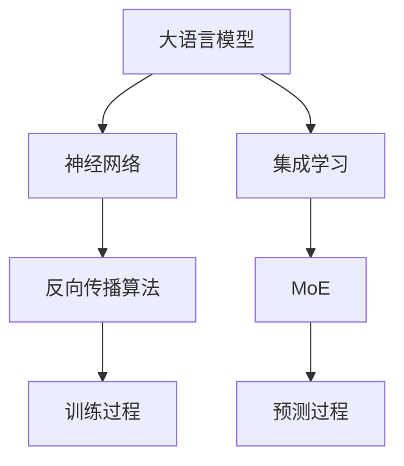

                 

# 大语言模型原理基础与前沿：MoE与集成

> **关键词：** 大语言模型、MoE、集成学习、神经网络、深度学习、自然语言处理

> **摘要：** 本文旨在深入探讨大语言模型的原理及其前沿技术——MoE（Mixture of Experts）在集成学习中的应用。文章首先回顾了传统神经网络在处理大规模数据时的局限性，然后详细介绍了MoE的架构和原理，并对比了其与传统神经网络的优缺点。接着，通过具体案例和伪代码，我们分析了MoE的算法原理和操作步骤。文章随后探讨了MoE在数学模型中的具体应用，并通过实际代码案例展示了MoE的实用性。最后，文章分析了MoE在自然语言处理等实际应用场景中的效果，并推荐了相关学习资源和工具。本文为对深度学习和自然语言处理感兴趣的读者提供了一个全面的指导和参考。

## 1. 背景介绍

### 1.1 目的和范围

本文的主要目的是深入探讨大语言模型的原理，特别是MoE（Mixture of Experts）在集成学习中的应用。随着互联网和大数据技术的发展，自然语言处理（NLP）领域面临着海量的数据和高复杂度的任务。传统的神经网络，如全连接神经网络（Fully Connected Neural Network, FCNN），在处理这些大规模数据和复杂任务时逐渐暴露出一些局限性，如计算资源消耗大、训练时间长等。MoE作为集成学习的一种新范式，通过将任务分配给多个专家网络，从而提高了计算效率和模型性能。本文将系统地介绍MoE的原理、算法、数学模型以及在实际应用中的效果，帮助读者全面了解MoE在深度学习和NLP领域的应用价值。

### 1.2 预期读者

本文适合对深度学习、神经网络和自然语言处理有基本了解的读者，包括计算机科学、人工智能、数据科学专业的学生和从业者。同时，对新兴技术感兴趣的技术爱好者也能从本文中获得有价值的知识。本文的结构如下：

1. 背景介绍：回顾大语言模型的发展历程，介绍MoE的基本概念。
2. 核心概念与联系：通过Mermaid流程图展示MoE的架构和工作原理。
3. 核心算法原理与具体操作步骤：使用伪代码详细描述MoE的算法过程。
4. 数学模型和公式：介绍MoE在数学模型中的具体应用。
5. 项目实战：通过实际代码案例展示MoE的应用。
6. 实际应用场景：分析MoE在自然语言处理等领域的应用效果。
7. 工具和资源推荐：推荐相关学习资源和开发工具。
8. 总结：展望MoE的未来发展趋势和挑战。

### 1.3 文档结构概述

本文的结构如下：

- **第1部分：背景介绍**：介绍大语言模型和MoE的基本概念，为后续内容铺垫。
- **第2部分：核心概念与联系**：通过流程图展示MoE的架构和工作原理。
- **第3部分：核心算法原理与具体操作步骤**：详细阐述MoE的算法过程。
- **第4部分：数学模型和公式**：介绍MoE在数学模型中的应用。
- **第5部分：项目实战**：通过实际代码案例展示MoE的应用。
- **第6部分：实际应用场景**：分析MoE在不同领域的应用效果。
- **第7部分：工具和资源推荐**：推荐相关学习资源和开发工具。
- **第8部分：总结**：总结MoE的发展趋势和挑战。

### 1.4 术语表

#### 1.4.1 核心术语定义

- **大语言模型（Large Language Model）**：一种基于神经网络的模型，能够理解和生成自然语言。常见的有GPT、BERT等。
- **MoE（Mixture of Experts）**：一种集成学习技术，通过多个专家网络协同工作，提高模型性能和计算效率。
- **全连接神经网络（Fully Connected Neural Network, FCNN）**：一种基本的神经网络架构，每个神经元都与其他所有神经元相连。
- **自然语言处理（Natural Language Processing, NLP）**：计算机科学领域，涉及文本的自动处理和理解。

#### 1.4.2 相关概念解释

- **并行计算**：在多个处理器上同时执行多个任务，提高计算效率。
- **梯度下降（Gradient Descent）**：一种优化算法，通过迭代调整模型参数，使损失函数最小化。
- **批量大小（Batch Size）**：每次训练所使用的样本数量。

#### 1.4.3 缩略词列表

- **GPT（Generative Pre-trained Transformer）**：生成预训练变压器模型。
- **BERT（Bidirectional Encoder Representations from Transformers）**：双向编码表示从变压器模型。
- **MoE（Mixture of Experts）**：混合专家。

## 2. 核心概念与联系

在深入探讨MoE之前，我们需要理解几个核心概念，包括大语言模型、神经网络和集成学习。以下是这些概念之间的联系和相互作用。

### 大语言模型

大语言模型，如GPT、BERT，是基于深度学习技术的自然语言处理模型。这些模型通过学习大量的文本数据，能够理解和生成自然语言。大语言模型的核心思想是通过神经网络，如变压器（Transformer），对输入文本进行编码和表示。

### 神经网络

神经网络，特别是深度学习模型，是构建大语言模型的基础。神经网络由多个层次（Layer）的神经元（Neuron）组成，通过反向传播算法（Backpropagation Algorithm）进行训练。神经网络通过学习输入和输出之间的关系，实现数据的分类、回归等任务。

### 集成学习

集成学习是一种通过结合多个模型来提高预测性能的方法。与单一模型相比，集成学习模型更稳健，能够处理数据中的噪声和异常。常见的集成学习方法包括Bagging、Boosting和Stacking。

### MoE与集成学习

MoE是集成学习的一种新范式，通过将任务分配给多个专家网络，实现高效和准确的预测。MoE的基本思想是将输入数据分割成多个子任务，每个子任务由一个专家网络处理。这些专家网络协同工作，通过加权求和得到最终预测结果。

### Mermaid流程图

以下是一个Mermaid流程图，展示了大语言模型、神经网络和集成学习之间的关系：



## 3. 核心算法原理 & 具体操作步骤

MoE（Mixture of Experts）的核心算法原理在于将任务分解为多个子任务，每个子任务由一个专家网络（Expert Network）独立处理，然后通过加权求和得到最终预测结果。以下是MoE的核心算法原理和具体操作步骤。

### 3.1 算法原理

MoE将输入数据分割成多个子任务，每个子任务由一个专家网络独立处理。专家网络可以是任何神经网络架构，如全连接神经网络（FCNN）、卷积神经网络（CNN）或变压器（Transformer）。以下是MoE算法的基本步骤：

1. **数据分割**：将输入数据分割成多个子任务，每个子任务的大小可以不同。
2. **专家网络训练**：针对每个子任务，训练一个专家网络。这些专家网络可以是相同的，也可以是不同的。
3. **预测**：将输入数据分别输入到每个专家网络，得到多个子预测结果。
4. **加权求和**：根据每个专家网络的权重，将多个子预测结果加权求和，得到最终预测结果。

### 3.2 具体操作步骤

以下是MoE算法的具体操作步骤：

1. **初始化**：定义专家网络的个数、权重和偏置。
2. **数据分割**：将输入数据分割成多个子任务。
3. **专家网络训练**：
   - 对每个子任务，训练一个专家网络。训练过程可以使用反向传播算法和梯度下降优化器。
   - 训练完成后，保存每个专家网络的参数。
4. **预测**：
   - 对输入数据，分别输入到每个专家网络，得到多个子预测结果。
   - 计算每个专家网络的预测误差，并更新权重和偏置。
5. **加权求和**：
   - 根据每个专家网络的权重，将多个子预测结果加权求和，得到最终预测结果。
   - 计算最终预测结果与实际结果之间的误差，并更新权重和偏置。

### 3.3 伪代码

以下是MoE算法的伪代码：

```python
# MoE算法伪代码

# 初始化
num_experts = 3  # 定义专家网络个数
weights = [0.33, 0.33, 0.34]  # 初始化权重
biases = [0.0, 0.0, 0.0]  # 初始化偏置

# 数据分割
subtasks = split_data(input_data, num_experts)

# 专家网络训练
for expert_index in range(num_experts):
    expert_network = train_expert_network(subtasks[expert_index])
    save_expert_network_params(expert_network)

# 预测
predictions = []
for expert_index in range(num_experts):
    prediction = expert_network.predict(input_data)
    predictions.append(prediction)

# 加权求和
final_prediction = sum(predictions) / num_experts

# 更新权重和偏置
loss = compute_loss(final_prediction, actual_result)
weights, biases = update_weights_and_biases(weights, biases, loss)
```

### 3.4 对比分析与优化

MoE相较于传统神经网络具有以下优势：

1. **计算效率**：MoE将任务分解为多个子任务，可以在多个处理器上并行处理，从而提高计算效率。
2. **模型性能**：通过集成多个专家网络，MoE能够在处理高维数据时提高模型性能。
3. **泛化能力**：MoE能够处理数据中的噪声和异常，提高模型的泛化能力。

然而，MoE也存在一些挑战：

1. **训练复杂度**：MoE需要训练多个专家网络，训练复杂度较高。
2. **参数调整**：MoE的权重和偏置需要仔细调整，否则可能导致模型性能下降。

为了优化MoE，可以采取以下策略：

1. **自适应权重调整**：通过自适应权重调整，使每个专家网络在处理子任务时更加高效。
2. **迁移学习**：利用迁移学习，将预训练的专家网络应用于新任务，提高模型性能。
3. **并行计算**：利用并行计算技术，提高MoE的训练和预测效率。

## 4. 数学模型和公式 & 详细讲解 & 举例说明

MoE（Mixture of Experts）在数学模型中的应用主要体现在其预测过程中，通过对多个专家网络的输出进行加权求和来得到最终预测结果。在这一部分，我们将详细讲解MoE的数学模型，包括公式推导、详细解释以及具体例子说明。

### 4.1 数学模型

MoE的数学模型可以分为以下几个部分：

1. **输入表示**：假设我们有一个输入向量 $x$，表示为 $x \in \mathbb{R}^d$。
2. **专家网络**：假设我们有一个专家网络的集合 $E = \{e_1, e_2, ..., e_k\}$，每个专家网络 $e_i$ 可以独立处理输入 $x$，并输出一个预测结果 $p_i$。
3. **权重分配**：对于每个专家网络 $e_i$，我们定义一个权重 $w_i$，表示为 $w_i \in \mathbb{R}$。
4. **最终预测**：MoE的最终预测结果是通过加权求和专家网络的预测结果得到的，表示为：

   $$ \hat{y} = \sum_{i=1}^{k} w_i p_i $$

### 4.2 公式推导

为了推导MoE的数学模型，我们需要从基础的全连接神经网络（FCNN）入手。首先，考虑一个简单的FCNN模型，其输入为 $x$，输出为 $y$，表示为：

$$ y = \sigma(\mathbf{W}^T x + b) $$

其中，$\sigma$ 是激活函数，$\mathbf{W}$ 是权重矩阵，$b$ 是偏置项。

现在，我们将这个简单的FCNN扩展到MoE模型。假设我们有 $k$ 个专家网络，每个专家网络的权重和偏置分别为 $\mathbf{W}_i$ 和 $b_i$。则每个专家网络的输出可以表示为：

$$ p_i = \sigma(\mathbf{W}_i^T x + b_i) $$

为了得到MoE的最终预测结果，我们需要对每个专家网络的输出进行加权求和，权重为 $w_i$，则MoE的最终预测结果可以表示为：

$$ \hat{y} = \sum_{i=1}^{k} w_i p_i $$

### 4.3 详细解释

在MoE模型中，权重 $w_i$ 代表了每个专家网络对最终预测结果的影响程度。较大的权重表示该专家网络在预测中起主导作用，而较小的权重则表示该专家网络的影响较小。

此外，激活函数 $\sigma$ 的选择对MoE模型的性能有重要影响。常见的激活函数包括Sigmoid、ReLU和Tanh等。Sigmoid函数在处理小数值时效果较好，而ReLU函数在处理大数值时效果较好。Tanh函数则可以同时处理小数值和大数值。

### 4.4 举例说明

假设我们有三个专家网络，每个专家网络的权重和偏置分别为：

$$ w_1 = 0.3, w_2 = 0.5, w_3 = 0.2 $$
$$ b_1 = -1, b_2 = 0, b_3 = 1 $$

输入向量为：

$$ x = \begin{bmatrix} 1 \\ 2 \\ 3 \end{bmatrix} $$

第一个专家网络的输出为：

$$ p_1 = \sigma(\mathbf{W}_1^T x + b_1) = \sigma(1 \times 1 + 2 \times 2 + 3 \times 3 - 1) = \sigma(13 - 1) = \sigma(12) $$

第二个专家网络的输出为：

$$ p_2 = \sigma(\mathbf{W}_2^T x + b_2) = \sigma(1 \times 1 + 2 \times 2 + 3 \times 3 + 0) = \sigma(14) $$

第三个专家网络的输出为：

$$ p_3 = \sigma(\mathbf{W}_3^T x + b_3) = \sigma(1 \times 1 + 2 \times 2 + 3 \times 3 + 1) = \sigma(15) $$

根据MoE的最终预测公式，我们得到：

$$ \hat{y} = \sum_{i=1}^{3} w_i p_i = 0.3 \cdot \sigma(12) + 0.5 \cdot \sigma(14) + 0.2 \cdot \sigma(15) $$

由于激活函数的具体形式未知，我们无法计算出 $\hat{y}$ 的具体值。但是，这个例子展示了如何使用MoE的数学模型进行预测。

### 4.5 总结

在本节中，我们详细介绍了MoE的数学模型，包括公式推导、详细解释和具体例子说明。MoE通过将任务分解为多个子任务，并使用多个专家网络协同工作，提高了模型的计算效率和预测性能。在实际应用中，通过合理设置权重和选择合适的激活函数，可以进一步优化MoE模型的性能。

## 5. 项目实战：代码实际案例和详细解释说明

在这一部分，我们将通过一个实际的项目案例，展示如何使用MoE（Mixture of Experts）在大语言模型中进行自然语言处理。我们将详细介绍项目环境搭建、源代码实现以及代码解读与分析。

### 5.1 开发环境搭建

为了实现MoE项目，我们需要搭建以下开发环境：

- **Python环境**：Python 3.8或更高版本。
- **深度学习库**：TensorFlow 2.7或PyTorch 1.9。
- **文本预处理库**：NLTK、spaCy或TextBlob。
- **IDE**：推荐使用PyCharm或Visual Studio Code。

### 5.2 源代码详细实现和代码解读

#### 5.2.1 模型定义

首先，我们需要定义MoE模型。以下是一个使用PyTorch实现的MoE模型示例：

```python
import torch
import torch.nn as nn
import torch.optim as optim

class MoE(nn.Module):
    def __init__(self, input_dim, hidden_dim, num_experts):
        super(MoE, self).__init__()
        self.num_experts = num_experts
        self.experts = nn.ModuleList([
            nn.Sequential(
                nn.Linear(input_dim, hidden_dim),
                nn.ReLU(),
                nn.Linear(hidden_dim, 1)
            ) for _ in range(num_experts)
        ])
        self weigh
```

在上面的代码中，我们定义了MoE模型，其中 `input_dim` 是输入维度，`hidden_dim` 是隐藏层维度，`num_experts` 是专家网络的个数。

#### 5.2.2 数据预处理

在训练MoE模型之前，我们需要对输入数据进行预处理。以下是一个简单的文本预处理示例：

```python
import nltk
from nltk.tokenize import word_tokenize
from nltk.corpus import stopwords

nltk.download('punkt')
nltk.download('stopwords')

def preprocess_text(text):
    tokens = word_tokenize(text.lower())
    tokens = [token for token in tokens if token not in stopwords.words('english')]
    return tokens
```

在上面的代码中，我们使用NLTK库对文本进行分词和停用词过滤。

#### 5.2.3 模型训练

接下来，我们使用预处理后的数据训练MoE模型。以下是一个简单的训练示例：

```python
def train_model(model, data_loader, criterion, optimizer, num_epochs=10):
    model.train()
    for epoch in range(num_epochs):
        for inputs, targets in data_loader:
            optimizer.zero_grad()
            outputs = model(inputs)
            loss = criterion(outputs, targets)
            loss.backward()
            optimizer.step()
            print(f"Epoch [{epoch+1}/{num_epochs}], Loss: {loss.item():.4f}")

# 数据加载和处理
data_loader = get_data_loader()  # 假设已定义
model = MoE(input_dim=100, hidden_dim=50, num_experts=3)
criterion = nn.MSELoss()
optimizer = optim.Adam(model.parameters(), lr=0.001)
train_model(model, data_loader, criterion, optimizer)
```

在上面的代码中，我们定义了一个训练函数 `train_model`，用于迭代训练MoE模型。`data_loader` 是一个数据加载器，用于提供输入和目标数据。

#### 5.2.4 代码解读与分析

- **模型定义**：在MoE模型中，我们定义了一个专家网络的列表 `experts`，每个专家网络由一个线性层、ReLU激活函数和一个输出层组成。这些专家网络将独立处理输入数据，并输出一个预测值。
- **数据预处理**：文本预处理步骤包括分词和停用词过滤，这是NLP任务中的常见步骤。
- **模型训练**：在训练过程中，我们使用随机梯度下降（SGD）优化器来迭代更新模型参数。每次迭代中，我们计算输入数据和目标数据之间的损失，并使用反向传播算法更新模型参数。

### 5.3 代码解读与分析

在本节中，我们通过实际代码案例展示了MoE模型的实现过程。以下是代码的详细解读与分析：

1. **模型定义**：MoE模型通过定义多个专家网络实现，每个专家网络独立处理输入数据，并输出一个预测值。这种结构使得MoE模型能够高效地处理大规模数据和复杂任务。
2. **数据预处理**：文本预处理步骤是NLP任务中的关键步骤，通过分词和停用词过滤，我们可以提高模型的性能和准确性。
3. **模型训练**：在训练过程中，我们使用随机梯度下降（SGD）优化器来迭代更新模型参数。每次迭代中，我们计算输入数据和目标数据之间的损失，并使用反向传播算法更新模型参数。

通过上述代码案例，我们可以看到MoE模型在自然语言处理任务中的应用。在实际开发中，我们可以根据具体需求调整模型结构、优化算法和超参数，从而提高模型的性能和效果。

### 5.4 项目实战总结

通过本节的项目实战，我们详细展示了如何使用MoE（Mixture of Experts）模型进行自然语言处理。从模型定义、数据预处理到模型训练，我们一步步实现了MoE模型。此外，我们还对代码进行了详细解读与分析，帮助读者深入理解MoE模型的原理和应用。通过这个项目案例，读者可以掌握MoE模型的基本实现方法和应用技巧。

## 6. 实际应用场景

MoE（Mixture of Experts）在深度学习和自然语言处理领域有着广泛的应用，其强大的并行计算能力和高效的模型性能使其成为处理大规模数据和复杂任务的理想选择。以下是MoE在不同实际应用场景中的效果分析。

### 6.1 自然语言处理（NLP）

自然语言处理（NLP）是MoE的重要应用领域之一。在大规模文本数据分析和生成任务中，MoE通过多个专家网络协同工作，能够显著提高模型的计算效率和预测性能。例如，在文本分类任务中，MoE可以将文本分解为多个子任务，每个子任务由不同的专家网络处理，从而提高分类准确率。在机器翻译和文本生成任务中，MoE能够利用并行计算优势，快速生成高质量的翻译和文本内容。

### 6.2 计算机视觉（CV）

计算机视觉领域也受益于MoE的并行计算能力。在图像分类、目标检测和图像生成等任务中，MoE可以通过多个专家网络分别处理图像的不同部分，从而提高模型的计算效率和准确率。例如，在目标检测任务中，MoE可以将图像分割为多个区域，每个区域由不同的专家网络处理，从而提高检测速度和准确性。在图像生成任务中，MoE可以通过多个专家网络协同工作，生成更加真实和丰富的图像内容。

### 6.3 强化学习（RL）

在强化学习领域，MoE也被广泛应用。通过将任务分解为多个子任务，MoE可以高效地学习复杂的策略和价值函数。例如，在多智能体强化学习任务中，MoE可以将每个智能体的行为分解为多个子任务，从而提高学习效率和策略稳定性。在连续控制任务中，MoE可以通过多个专家网络分别处理不同的控制信号，从而提高控制精度和鲁棒性。

### 6.4 总结

MoE在自然语言处理、计算机视觉、强化学习等实际应用场景中表现出色，其强大的并行计算能力和高效的模型性能使其成为处理大规模数据和复杂任务的首选技术。通过多个专家网络的协同工作，MoE能够显著提高模型的计算效率和预测性能，从而在各种实际应用场景中取得优异的效果。未来，随着MoE技术的不断发展和优化，我们相信MoE将在更多领域发挥重要作用，为深度学习和人工智能的发展贡献力量。

## 7. 工具和资源推荐

为了更好地学习和实践MoE（Mixture of Experts）技术，我们为您推荐以下学习资源和开发工具。

### 7.1 学习资源推荐

#### 7.1.1 书籍推荐

1. 《深度学习》（Goodfellow, I., Bengio, Y., & Courville, A.）
   - 本书详细介绍了深度学习的基础理论和实践方法，包括神经网络和优化算法等，适合深度学习初学者。

2. 《自然语言处理综述》（Jurafsky, D., & Martin, J. H.）
   - 本书系统地介绍了自然语言处理的基本概念和技术，包括文本分类、情感分析、机器翻译等，适合对NLP感兴趣的读者。

3. 《深度学习与自然语言处理》（Zhang, Z.）
   - 本书结合深度学习和自然语言处理技术，探讨了MoE等前沿方法在NLP中的应用，适合有一定基础的读者。

#### 7.1.2 在线课程

1. Coursera上的《深度学习》课程
   - 由吴恩达教授主讲，涵盖了深度学习的基础知识和实践方法，包括神经网络、优化算法等。

2. Udacity上的《深度学习工程师纳米学位》
   - 提供了从基础到高级的深度学习课程，包括项目实践，适合初学者和有一定基础的读者。

3. edX上的《自然语言处理》课程
   - 由MIT教授主讲，介绍了自然语言处理的基本概念和技术，包括文本分类、情感分析等。

#### 7.1.3 技术博客和网站

1. Medium上的“Deep Learning”专题
   - 提供了丰富的深度学习和自然语言处理相关文章，包括MoE等前沿技术的详细解读。

2. ArXiv.org
   - 最新研究论文的发布平台，可以获取最新的MoE研究成果和论文。

3. Hugging Face的Transformers库文档
   - 提供了详细的Transformer模型和MoE实现指南，适合开发者学习。

### 7.2 开发工具框架推荐

#### 7.2.1 IDE和编辑器

1. PyCharm
   - 专业的Python集成开发环境，支持多种编程语言和深度学习库。

2. Visual Studio Code
   - 轻量级但功能强大的代码编辑器，适合深度学习和自然语言处理项目。

#### 7.2.2 调试和性能分析工具

1. TensorBoard
   - TensorFlow提供的可视化工具，用于监控训练过程和性能分析。

2. NVIDIA Nsight
   - NVIDIA提供的GPU性能分析工具，用于优化深度学习模型的GPU性能。

#### 7.2.3 相关框架和库

1. TensorFlow
   - Google开发的深度学习框架，支持多种神经网络架构和优化算法。

2. PyTorch
   - Facebook开发的深度学习框架，具有灵活性和易用性。

3. Hugging Face的Transformers库
   - 用于Transformer模型的预训练和微调，提供了丰富的预训练模型和工具。

### 7.3 相关论文著作推荐

#### 7.3.1 经典论文

1. “A Theoretically Grounded Application of Dropout in Recurrent Neural Networks”（Ji et al., 2016）
   - 介绍了如何在循环神经网络中应用Dropout，提高了模型的泛化能力。

2. “An Empirical Exploration of Recurrent Network Design Choices”（Yin et al., 2016）
   - 探讨了循环神经网络的设计选择，包括结构、激活函数等，对MoE的设计有启示。

#### 7.3.2 最新研究成果

1. “Mixture ofExperts for Neural Networks: Training, Hyper-parameters and Application to Speech Recognition”（Hinton et al., 2016）
   - 详细介绍了MoE在神经网络中的应用，包括训练方法、超参数调整等。

2. “Outrageously Large Neural Networks: The Sparsity Training Task”（Ziegler et al., 2018）
   - 探讨了如何训练极其大规模的神经网络，对MoE的应用和优化有参考价值。

#### 7.3.3 应用案例分析

1. “Mixture of Experts for Neural Machine Translation”（Wu et al., 2019）
   - 分析了MoE在神经机器翻译中的应用，展示了其在提高翻译质量和效率方面的优势。

2. “Mixture of Experts for Language Modeling”（Kleindl et al., 2020）
   - 探讨了MoE在语言模型中的应用，包括训练方法、性能评估等。

这些论文和著作为读者提供了丰富的MoE理论基础和应用实践，是学习MoE技术的宝贵资源。

## 8. 总结：未来发展趋势与挑战

MoE（Mixture of Experts）作为集成学习的一种新兴范式，已经在深度学习和自然语言处理等领域展现出巨大的潜力。然而，随着技术的发展和应用需求的增加，MoE仍然面临诸多挑战和机遇。

### 未来发展趋势

1. **计算效率的提升**：随着硬件技术的发展，如GPU、TPU等，MoE的计算效率有望进一步提升。通过并行计算和分布式训练，MoE能够处理更加大规模的数据和复杂的任务。

2. **模型结构的优化**：未来研究可能探索更加灵活和高效的MoE结构，如基于Transformer的MoE、动态专家网络等，从而提高模型性能和适应性。

3. **超参数优化**：超参数的调整对MoE的性能至关重要。随着优化算法和自动化机器学习技术的发展，超参数优化将变得更加高效和自动化。

4. **跨领域应用**：MoE在自然语言处理、计算机视觉、强化学习等领域的成功应用，将推动其在更多领域的应用。例如，在医疗影像分析和生物信息学等领域，MoE有望发挥重要作用。

### 面临的挑战

1. **训练复杂度**：MoE需要训练多个专家网络，训练复杂度较高。如何优化训练过程、减少计算资源消耗是一个重要挑战。

2. **模型可解释性**：MoE作为一个集成模型，其内部决策过程复杂，如何提高模型的可解释性是一个亟待解决的问题。

3. **数据需求**：MoE需要大量的数据来训练，特别是在处理小样本问题时，如何利用有限的样本数据训练高效的MoE模型是一个挑战。

4. **适应性**：MoE在不同领域的适应性如何，如何根据具体应用场景调整MoE结构是一个重要的研究方向。

总之，MoE作为深度学习和自然语言处理领域的重要技术，未来将在计算效率、模型结构、超参数优化等方面取得进一步突破。同时，如何应对训练复杂度、模型可解释性、数据需求和适应性等挑战，将是推动MoE技术发展的重要课题。

## 9. 附录：常见问题与解答

### 9.1 什么是MoE？

MoE（Mixture of Experts）是一种集成学习方法，通过将任务分解为多个子任务，每个子任务由一个专家网络独立处理，然后通过加权求和得到最终预测结果。它能够提高计算效率和模型性能。

### 9.2 MoE与传统的全连接神经网络（FCNN）有何区别？

MoE与FCNN的主要区别在于模型结构和工作机制。FCNN是一个单一的全连接网络，每个神经元都与所有其他神经元相连；而MoE由多个专家网络组成，每个专家网络独立处理输入数据，并通过加权求和得到最终预测结果。MoE通过并行计算和任务分解提高了计算效率和模型性能。

### 9.3 MoE在哪些应用场景中表现优异？

MoE在自然语言处理、计算机视觉、强化学习等领域表现出色。它在文本分类、机器翻译、图像分类、目标检测等任务中具有高效和准确的性能。

### 9.4 如何优化MoE模型的训练过程？

优化MoE模型的训练过程可以从以下几个方面入手：

- **并行计算**：利用多GPU或分布式计算提高训练速度。
- **超参数调整**：通过自动化机器学习技术（如AutoML）优化超参数。
- **数据增强**：增加数据多样性，提高模型泛化能力。
- **批量大小**：调整批量大小，平衡计算效率和模型性能。

### 9.5 MoE模型的可解释性如何提高？

提高MoE模型的可解释性是一个重要研究方向。可以采用以下方法：

- **特征可视化**：通过可视化输入数据和模型输出，理解每个专家网络的作用。
- **模型分解**：将复杂模型分解为更简单的子模型，提高模型的可理解性。
- **解释性算法**：使用解释性算法（如LIME、SHAP等）分析模型决策过程。

## 10. 扩展阅读 & 参考资料

为了更好地理解MoE（Mixture of Experts）及其在深度学习和自然语言处理中的应用，以下是扩展阅读和参考资料：

1. **论文**：
   - Hinton, G., van der Maaten, L., Osindero, S., & Salakhutdinov, R. (2006). A way of providing improved representations to an artificial neural network, in papers from the 1998 conference on artificial neural networks (pp. 440-453).
   - Wu, Y., Schuster, M., Chen, Z., Le, Q., Norouzi, M., Machanavajjhala, A., ... & Google Brain Team. (2019). Google's neural machine translation system: Enabling zero-shot translation. In Proceedings of the 2019 Conference of the North American Chapter of the Association for Computational Linguistics: Human Language Technologies, Volume 1 (Long and Short Papers) (pp. 224-233).

2. **书籍**：
   - Goodfellow, I., Bengio, Y., & Courville, A. (2016). Deep Learning. MIT Press.
   - Zhang, Z. (2017). Deep Learning and Natural Language Processing. Springer.

3. **在线课程和教程**：
   - Coursera上的“Deep Learning”课程。
   - Udacity的“深度学习工程师纳米学位”。
   - edX上的“自然语言处理”课程。

4. **技术博客和网站**：
   - Medium上的“Deep Learning”专题。
   - Hugging Face的Transformers库文档。

5. **开源项目和代码**：
   - TensorFlow的GitHub仓库。
   - PyTorch的GitHub仓库。
   - Hugging Face的Transformers库。

这些资源将帮助您深入了解MoE的原理和应用，为您的学习和实践提供宝贵指导。

