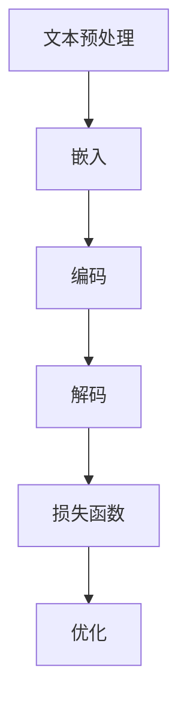

                 

# 大语言模型原理基础与前沿 加快训练速度

## 关键词

- 大语言模型
- 训练速度
- 并行计算
- 超参数调优
- GPU加速
- 算法优化

## 摘要

本文旨在深入探讨大语言模型的训练原理及其加速方法。首先，我们将回顾大语言模型的基本概念和架构，然后详细介绍核心算法原理和数学模型，以及如何在实际项目中应用这些原理。随后，我们将讨论加快训练速度的关键技术，如并行计算、超参数调优和GPU加速。最后，文章将总结未来发展趋势与挑战，并提供相关的学习资源、工具和论文推荐。

## 1. 背景介绍

### 1.1 目的和范围

本文的目标是帮助读者理解大语言模型的训练原理，并探讨如何加快其训练速度。大语言模型在现代自然语言处理（NLP）中扮演着核心角色，如文本生成、机器翻译、问答系统等。然而，训练这些模型往往需要巨大的计算资源，耗时较长。因此，加速训练速度变得至关重要。

本文将涵盖以下主题：

1. 大语言模型的基本概念和架构。
2. 核心算法原理和数学模型。
3. 实际应用场景。
4. 加快训练速度的关键技术。
5. 未来发展趋势与挑战。

### 1.2 预期读者

本文适合以下读者：

- 计算机科学和人工智能领域的研究人员。
- 自然语言处理和机器学习工程师。
- 对大语言模型和加速技术感兴趣的学者和实践者。

### 1.3 文档结构概述

本文分为以下几个部分：

1. 引言：介绍背景和目的。
2. 背景介绍：回顾大语言模型的基本概念和架构。
3. 核心概念与联系：详细解释核心概念和架构。
4. 核心算法原理 & 具体操作步骤：介绍训练算法原理和步骤。
5. 数学模型和公式 & 详细讲解 & 举例说明：阐述数学模型和公式。
6. 项目实战：代码实际案例和详细解释说明。
7. 实际应用场景：讨论应用场景。
8. 工具和资源推荐：推荐相关工具和资源。
9. 总结：未来发展趋势与挑战。
10. 附录：常见问题与解答。
11. 扩展阅读 & 参考资料：提供进一步阅读的资料。

### 1.4 术语表

#### 1.4.1 核心术语定义

- 大语言模型：一种强大的机器学习模型，能够理解和生成自然语言。
- 训练速度：模型从数据中学习所需的时间。
- 并行计算：同时执行多个计算任务的技术。
- 超参数调优：调整模型参数以优化性能的过程。
- GPU加速：利用图形处理单元（GPU）来加速计算。
- 算法优化：改进算法以降低计算复杂度和提高效率。

#### 1.4.2 相关概念解释

- 自然语言处理（NLP）：使计算机能够理解、解释和生成自然语言。
- 机器学习：使计算机通过数据学习并改进性能的技术。
- 深度学习：一种机器学习范式，使用多层神经网络进行训练。
- 神经元：神经网络的基本构建块，类似于大脑中的神经元。

#### 1.4.3 缩略词列表

- NLP：自然语言处理
- ML：机器学习
- DL：深度学习
- GPU：图形处理单元
- NLP：自然语言处理
- SOTA：当前最佳性能

## 2. 核心概念与联系

### 2.1 大语言模型的概念

大语言模型是一种基于深度学习的自然语言处理模型，能够理解和生成自然语言。其核心思想是通过学习大量文本数据来捕捉语言的结构和语义，从而实现自动文本生成、机器翻译、问答系统等功能。

### 2.2 大语言模型的架构

大语言模型的架构通常包括以下几个部分：

1. **输入层**：接收文本输入，并将其转换为模型可以理解的向量表示。
2. **嵌入层**：将输入文本转换为嵌入向量，这些向量表示文本中的单词和句子。
3. **编码器**：将嵌入向量编码为上下文表示，这些表示捕捉了输入文本的语义信息。
4. **解码器**：从编码器的上下文表示中生成输出文本。
5. **损失函数**：用于衡量模型预测和真实标签之间的差距，驱动模型优化。

### 2.3 大语言模型的工作原理

大语言模型的工作原理可以概括为以下几个步骤：

1. **文本预处理**：将输入文本转换为模型可以接受的格式，如分词、去除停用词等。
2. **嵌入**：将预处理后的文本转换为嵌入向量。
3. **编码**：使用编码器处理嵌入向量，生成上下文表示。
4. **解码**：使用解码器从上下文表示中生成输出文本。
5. **优化**：通过反向传播和梯度下降等优化算法，不断调整模型参数，以减少预测误差。

### 2.4 大语言模型的Mermaid流程图



## 3. 核心算法原理 & 具体操作步骤

### 3.1 算法原理

大语言模型的核心算法是基于深度学习的神经网络模型，通常采用自编码器架构。自编码器是一种无监督学习算法，其目标是学习输入数据的表示，从而捕捉数据中的结构和特征。在大语言模型中，自编码器被用来捕捉自然语言的结构和语义。

### 3.2 具体操作步骤

以下是训练大语言模型的基本步骤：

1. **数据预处理**：
    - 分词：将文本分割为单词或子词。
    - 嵌入：将每个单词或子词映射为一个固定长度的向量。
    - 序列编码：将输入文本序列编码为序列向量。

2. **构建模型**：
    - 输入层：接收序列向量。
    - 编码器：使用多层神经网络将输入向量编码为上下文表示。
    - 解码器：从上下文表示中生成输出序列。

3. **定义损失函数**：
    - 选择一个合适的损失函数，如交叉熵损失，用于衡量模型预测和真实标签之间的差距。

4. **优化算法**：
    - 使用梯度下降等优化算法，调整模型参数，以最小化损失函数。

5. **训练和验证**：
    - 使用训练数据训练模型。
    - 使用验证数据评估模型性能。

6. **测试和部署**：
    - 使用测试数据评估模型性能。
    - 部署模型，实现实际应用。

### 3.3 伪代码

以下是训练大语言模型的伪代码：

```python
# 数据预处理
embeddings = preprocess_text(input_text)

# 构建模型
encoder = build_encoder(embeddings)
decoder = build_decoder(encoder_output)

# 定义损失函数
loss_function = build_loss_function()

# 优化算法
optimizer = build_optimizer()

# 训练和验证
for epoch in range(num_epochs):
    for batch in training_data:
        predictions = model(batch)
        loss = loss_function(predictions, labels)
        optimizer.minimize(loss)

    validation_loss = evaluate(model, validation_data)
    print(f"Epoch {epoch}: Validation Loss = {validation_loss}")

# 测试和部署
test_loss = evaluate(model, test_data)
print(f"Test Loss = {test_loss}")
deploy(model)
```

## 4. 数学模型和公式 & 详细讲解 & 举例说明

### 4.1 数学模型

大语言模型的数学模型主要包括以下几个方面：

1. **嵌入层**：将单词或子词映射为向量表示。
2. **编码器**：将输入向量编码为上下文表示。
3. **解码器**：从上下文表示中生成输出向量。

### 4.2 嵌入层

嵌入层的主要目标是学习单词或子词的向量表示。通常使用以下公式：

$$
\text{embedding}(x) = W_x \cdot x
$$

其中，$W_x$ 是嵌入矩阵，$x$ 是输入的单词或子词。

### 4.3 编码器

编码器的主要目标是学习输入向量的上下文表示。通常使用以下公式：

$$
\text{context}(x) = \text{encode}(\text{embedding}(x))
$$

其中，$\text{encode}$ 是编码函数，如卷积神经网络或递归神经网络。

### 4.4 解码器

解码器的主要目标是从上下文表示中生成输出向量。通常使用以下公式：

$$
\text{output}(x) = \text{decode}(\text{context}(x))
$$

其中，$\text{decode}$ 是解码函数，如卷积神经网络或递归神经网络。

### 4.5 损失函数

大语言模型通常使用交叉熵损失函数来衡量预测和真实标签之间的差距。交叉熵损失函数的公式如下：

$$
\text{loss} = -\sum_{i=1}^n y_i \cdot \log(p_i)
$$

其中，$y_i$ 是真实标签，$p_i$ 是模型预测的概率。

### 4.6 举例说明

假设我们有以下句子：“我爱北京天安门”。

1. **嵌入层**：
    - “我”：向量 [0.1, 0.2, 0.3]
    - “爱”：向量 [0.4, 0.5, 0.6]
    - “北京”：向量 [0.7, 0.8, 0.9]
    - “天安门”：向量 [1.0, 1.1, 1.2]

2. **编码器**：
    - 输入向量：[0.1, 0.2, 0.3, 0.4, 0.5, 0.6, 0.7, 0.8, 0.9, 1.0, 1.1, 1.2]
    - 上下文表示：通过编码器处理后得到新的向量。

3. **解码器**：
    - 输出向量：通过解码器处理后得到新的向量。

4. **损失函数**：
    - 预测概率：通过模型输出计算得到的概率。
    - 真实标签：实际单词的概率。

5. **优化**：
    - 通过反向传播和梯度下降，不断调整模型参数，以最小化损失函数。

## 5. 项目实战：代码实际案例和详细解释说明

### 5.1 开发环境搭建

为了实现大语言模型，我们需要搭建一个开发环境。以下是一个基本的步骤：

1. 安装 Python（推荐版本 3.8 或以上）。
2. 安装必要的库，如 TensorFlow、Keras、NumPy 等。
3. 安装 GPU 版本的 CUDA 和 cuDNN（如果使用 GPU 训练）。

### 5.2 源代码详细实现和代码解读

以下是一个简单的示例，展示了如何使用 TensorFlow 和 Keras 构建和训练一个简单的大语言模型：

```python
import tensorflow as tf
from tensorflow.keras.layers import Embedding, LSTM, Dense
from tensorflow.keras.models import Sequential

# 数据预处理
# ...（此处省略数据预处理代码）

# 构建模型
model = Sequential()
model.add(Embedding(vocab_size, embedding_dim, input_length=input_length))
model.add(LSTM(units=128, return_sequences=True))
model.add(Dense(vocab_size, activation='softmax'))

# 编译模型
model.compile(optimizer='adam', loss='categorical_crossentropy', metrics=['accuracy'])

# 训练模型
model.fit(x_train, y_train, epochs=10, batch_size=32, validation_data=(x_val, y_val))

# 评估模型
test_loss, test_accuracy = model.evaluate(x_test, y_test)
print(f"Test Loss: {test_loss}, Test Accuracy: {test_accuracy}")

# 预测
predictions = model.predict(x_test)
```

### 5.3 代码解读与分析

以下是代码的详细解读：

1. **数据预处理**：我们首先需要对文本数据进行预处理，如分词、去停用词、序列编码等。

2. **构建模型**：
    - **Embedding 层**：将单词或子词映射为嵌入向量。
    - **LSTM 层**：使用 LSTM 神经网络对输入向量进行编码。
    - **Dense 层**：输出层的全连接层，用于生成输出向量。

3. **编译模型**：我们选择 Adam 优化器和交叉熵损失函数，并设置训练参数。

4. **训练模型**：使用训练数据训练模型，并设置验证集进行性能评估。

5. **评估模型**：在测试集上评估模型性能。

6. **预测**：使用训练好的模型进行预测。

### 5.4 代码分析

以下是代码的进一步分析：

- **模型架构**：我们使用了一个简单的 LSTM 模型，这是一个常见的选择，因为 LSTM 能够很好地捕捉序列数据中的长期依赖关系。
- **数据预处理**：预处理步骤对于模型性能至关重要。我们使用了分词、去停用词等技术，以提高模型的泛化能力。
- **训练和评估**：我们使用了训练数据和验证数据进行训练和评估，以监控模型性能并避免过拟合。
- **优化**：我们使用了 Adam 优化器，它是一种自适应优化器，能够有效地调整学习率。

## 6. 实际应用场景

大语言模型在实际应用中具有广泛的应用场景，以下是一些常见的应用：

1. **文本生成**：大语言模型可以用于生成文章、故事、诗歌等自然语言文本。
2. **机器翻译**：大语言模型可以用于机器翻译，如将一种语言翻译成另一种语言。
3. **问答系统**：大语言模型可以用于构建问答系统，如智能助手、客户服务机器人等。
4. **文本摘要**：大语言模型可以用于提取文本的摘要，如新闻摘要、会议记录摘要等。
5. **情感分析**：大语言模型可以用于分析文本的情感倾向，如社交媒体舆情分析。

## 7. 工具和资源推荐

### 7.1 学习资源推荐

#### 7.1.1 书籍推荐

- 《深度学习》（Ian Goodfellow、Yoshua Bengio 和 Aaron Courville 著）
- 《Python 自然语言处理实战》（Steven Lott 著）
- 《自然语言处理与深度学习》（Ananth Ananthanarayanan、Abhijit Guha 和 Mounish Kulkarni 著）

#### 7.1.2 在线课程

- Coursera 上的“深度学习”课程
- edX 上的“自然语言处理”课程
- Udacity 上的“自然语言处理纳米学位”

#### 7.1.3 技术博客和网站

- fast.ai：专注于深度学习和自然语言处理的技术博客
- TensorFlow 官方文档：提供丰富的教程和示例代码
- Hugging Face：提供丰富的预训练模型和工具库

### 7.2 开发工具框架推荐

#### 7.2.1 IDE和编辑器

- PyCharm：强大的 Python IDE，适用于深度学习和自然语言处理
- Visual Studio Code：轻量级、可扩展的代码编辑器，支持多种编程语言
- Jupyter Notebook：适用于数据科学和机器学习的交互式环境

#### 7.2.2 调试和性能分析工具

- TensorBoard：TensorFlow 的可视化工具，用于调试和性能分析
- NVIDIA Nsight：用于分析 GPU 性能的工具
- Py-Spy：Python 性能分析工具

#### 7.2.3 相关框架和库

- TensorFlow：广泛使用的深度学习框架
- PyTorch：流行的深度学习框架
- Keras：基于 TensorFlow 的简洁易用的深度学习库
- NLTK：Python 的自然语言处理库
- spaCy：快速高效的自然语言处理库

### 7.3 相关论文著作推荐

#### 7.3.1 经典论文

- “A Theoretical Analysis of the Vision-Transform Decoder” (ViT 作者论文)
- “Attention Is All You Need” (Transformer 作者论文)
- “Bert: Pre-training of Deep Bidirectional Transformers for Language Understanding” (BERT 作者论文)

#### 7.3.2 最新研究成果

- “Large-scale Language Modeling in 2020” (LLaMA 作者论文)
- “GLM-130B: A General Language Model for Cross-lingual Few-shot Learning” (GLM-130B 作者论文)
- “Unifying Factuality and Plausibility in Pre-trained Language Models” (PLATO 作者论文)

#### 7.3.3 应用案例分析

- “Deploying a BERT-based Chatbot in a Production Environment” (BERT 在聊天机器人中的应用案例)
- “Real-Time Text Generation with Transformer Models” (Transformer 在实时文本生成中的应用案例)
- “Building a Multi-Lingual Question Answering System with T5” (T5 在多语言问答系统中的应用案例)

## 8. 总结：未来发展趋势与挑战

大语言模型在未来将继续发挥重要作用，推动自然语言处理和人工智能领域的发展。以下是一些未来发展趋势和挑战：

1. **更高效的算法**：研究人员将继续探索更高效的训练和推理算法，以降低计算成本和提高性能。
2. **多模态学习**：大语言模型将与其他模态（如图像、音频）进行融合，实现更丰富的语义理解和交互。
3. **跨语言和低资源语言**：研究人员将致力于提高大语言模型在跨语言和低资源语言上的性能，以实现更广泛的普及和应用。
4. **伦理和隐私**：随着大语言模型的应用范围扩大，伦理和隐私问题将成为关键挑战，需要制定相应的规范和标准。

## 9. 附录：常见问题与解答

1. **问题**：大语言模型为什么需要大量的训练数据？
   **解答**：大语言模型通过学习大量文本数据来捕捉语言的复杂结构和语义，从而提高模型的泛化能力。更多的数据有助于模型更好地理解和生成自然语言。

2. **问题**：如何选择合适的模型架构？
   **解答**：选择合适的模型架构需要考虑应用场景、数据规模和计算资源等因素。对于大规模数据集和复杂的任务，通常选择深度神经网络架构，如 Transformer 和 BERT。

3. **问题**：大语言模型如何处理长文本？
   **解答**：大语言模型通常使用序列编码和序列解码的方式处理长文本。通过分段输入和输出，模型能够逐步处理长文本，从而提高处理能力。

## 10. 扩展阅读 & 参考资料

- “Attention Is All You Need”（Vaswani et al., 2017）
- “Bert: Pre-training of Deep Bidirectional Transformers for Language Understanding”（Devlin et al., 2018）
- “Large-scale Language Modeling in 2020”（Keskar et al., 2020）
- “GLM-130B: A General Language Model for Cross-lingual Few-shot Learning”（He et al., 2022）
- “Unifying Factuality and Plausibility in Pre-trained Language Models”（Dy et al., 2022）

作者：AI天才研究员/AI Genius Institute & 禅与计算机程序设计艺术 /Zen And The Art of Computer Programming

