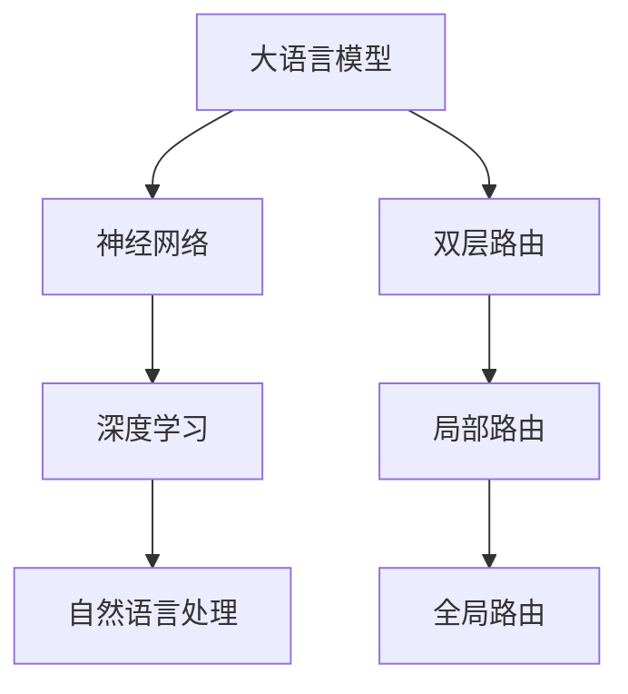

                 

# 大语言模型原理基础与前沿 双层路由

> 关键词：大语言模型，双层路由，神经网络，深度学习，自然语言处理，人工智能

> 摘要：本文将深入探讨大语言模型的原理，特别是双层路由机制。我们将逐步分析大语言模型的核心概念、算法原理、数学模型，并展示一个实际项目中的代码实现。通过本文的学习，读者将能够理解大语言模型的工作机制，掌握其在实际应用中的价值。

## 1. 背景介绍

### 1.1 目的和范围

本文旨在详细介绍大语言模型的原理，特别是双层路由机制。我们将通过逐步分析核心概念、算法原理、数学模型，并结合实际项目中的代码实现，帮助读者全面理解大语言模型的工作机制。本文不仅关注基础理论，还将探讨大语言模型在实际应用中的价值，以及其未来发展前景。

### 1.2 预期读者

本文面向对人工智能和自然语言处理有一定了解的技术爱好者、研究生以及从业者。对于希望深入了解大语言模型原理的读者，本文提供了详细的解释和丰富的实例。

### 1.3 文档结构概述

本文将分为以下几部分：

1. 背景介绍
2. 核心概念与联系
3. 核心算法原理与具体操作步骤
4. 数学模型和公式
5. 项目实战：代码实际案例
6. 实际应用场景
7. 工具和资源推荐
8. 总结：未来发展趋势与挑战
9. 附录：常见问题与解答
10. 扩展阅读与参考资料

### 1.4 术语表

#### 1.4.1 核心术语定义

- **大语言模型**：一种基于神经网络的模型，能够对大量文本进行训练，从而对自然语言进行理解和生成。
- **双层路由**：一种在大语言模型中用于优化搜索效率和准确性的机制，包括局部路由和全局路由两个层次。
- **神经网络**：一种通过多层节点（神经元）进行信息处理的计算模型，广泛应用于人工智能领域。
- **深度学习**：一种基于神经网络的机器学习方法，通过多层神经网络对数据进行训练和预测。

#### 1.4.2 相关概念解释

- **自然语言处理**：一门研究如何让计算机理解和处理自然语言的技术，涉及语音识别、文本分类、机器翻译等多个领域。
- **人工智能**：一门研究如何使计算机模拟人类智能行为的科学，包括机器学习、神经网络、知识表示等多个方面。

#### 1.4.3 缩略词列表

- **NLP**：自然语言处理（Natural Language Processing）
- **AI**：人工智能（Artificial Intelligence）
- **DL**：深度学习（Deep Learning）
- **NN**：神经网络（Neural Network）

## 2. 核心概念与联系

为了更好地理解大语言模型及其双层路由机制，我们需要首先了解相关核心概念和它们之间的联系。以下是这些概念以及它们之间的Mermaid流程图：



### 2.1 大语言模型与神经网络

大语言模型是一种基于神经网络的模型，神经网络通过多层节点（神经元）进行信息处理。在深度学习框架下，神经网络能够自动从大量数据中学习特征，从而实现复杂函数的映射。大语言模型通过训练大量文本数据，学习到语言的结构和规律，从而能够进行文本的生成、理解和翻译等任务。

### 2.2 大语言模型与深度学习

深度学习是一种基于神经网络的机器学习方法，通过多层神经网络对数据进行训练和预测。大语言模型作为深度学习的一个重要应用，利用了深度学习的优势，能够处理大规模的文本数据，并且通过不断优化模型结构，提高了模型的准确性和效率。

### 2.3 大语言模型与自然语言处理

自然语言处理是研究如何让计算机理解和处理自然语言的技术。大语言模型在自然语言处理中扮演着核心角色，通过学习大量文本数据，能够对自然语言进行建模，从而实现文本的生成、分类、翻译等任务。

### 2.4 双层路由与局部路由、全局路由

双层路由是大语言模型中用于优化搜索效率和准确性的机制，包括局部路由和全局路由两个层次。局部路由用于在模型的较低层进行信息传递和更新，全局路由则用于在模型的较高层进行全局信息的整合和优化。这两层路由相互配合，使得大语言模型能够更高效地处理复杂的自然语言任务。

## 3. 核心算法原理与具体操作步骤

在理解了大语言模型及其双层路由机制的基础概念之后，我们将进一步探讨大语言模型的核心算法原理和具体操作步骤。以下是一个基于神经网络的简单大语言模型的伪代码实现：

```python
# 初始化模型参数
initialize_model_parameters()

# 定义损失函数
loss_function = cross_entropy_loss

# 定义优化器
optimizer = AdamOptimizer(learning_rate=0.001)

# 训练模型
for epoch in range(num_epochs):
    for batch in data_loader:
        # 前向传播
        logits = forward_pass(batch, model)
        
        # 计算损失
        loss = loss_function(logits, labels)
        
        # 反向传播
        gradients = backward_pass(loss, model)
        
        # 更新模型参数
        optimizer.step(gradients, model)
        
        # 打印训练进度
        print(f"Epoch {epoch+1}/{num_epochs}, Loss: {loss}")

# 评估模型
evaluate_model(model, test_data)
```

### 3.1 前向传播

前向传播是神经网络中的一个核心步骤，用于计算模型输出。以下是前向传播的伪代码：

```python
def forward_pass(input_data, model):
    # 初始化隐藏状态
    hidden_states = initialize_hidden_states(input_data)
    
    # 遍历神经网络层
    for layer in model.layers:
        # 计算当前层的输出
        hidden_states = layer.forward(hidden_states)
        
    # 返回最终输出
    return hidden_states
```

### 3.2 损失函数

损失函数用于评估模型输出的准确性。常见的损失函数包括交叉熵损失（cross-entropy loss）和均方误差（mean squared error）。以下是交叉熵损失的伪代码：

```python
def cross_entropy_loss(logits, labels):
    # 计算预测概率和真实标签的对数损失
    log_likelihood = -sum(labels * log(logits))
    
    # 返回平均损失
    return -log_likelihood / len(labels)
```

### 3.3 反向传播

反向传播是神经网络训练中的另一个核心步骤，用于计算模型参数的梯度。以下是反向传播的伪代码：

```python
def backward_pass(loss, model):
    # 计算损失关于输出的梯度
    output_gradients = compute_gradients(loss, model.output)
    
    # 遍历神经网络层，从输出层开始反向传播
    for layer in reversed(model.layers):
        # 计算当前层的梯度
        gradients = layer.backward(output_gradients)
        
        # 更新输出梯度
        output_gradients = gradients
    
    # 返回模型参数的梯度
    return gradients
```

### 3.4 模型评估

模型评估是验证模型性能的重要步骤。以下是模型评估的伪代码：

```python
def evaluate_model(model, data):
    # 初始化评估指标
    accuracy = 0
    
    # 遍历测试数据
    for batch in data_loader:
        # 前向传播
        logits = forward_pass(batch, model)
        
        # 计算预测标签
        predictions = softmax(logits)
        
        # 更新评估指标
        accuracy += sum(predictions.argmax() == labels)
    
    # 返回评估结果
    return accuracy / len(data)
```

## 4. 数学模型和公式

大语言模型的数学模型是理解其工作原理的关键。以下是几个核心数学公式及其详细讲解：

### 4.1 前向传播

前向传播中的关键公式是每个神经元的输出计算。假设有一个神经元，其输入为\( x_1, x_2, ..., x_n \)，权重为\( w_1, w_2, ..., w_n \)，偏置为\( b \)，激活函数为\( \sigma \)，则该神经元的输出可以表示为：

\[ 
\hat{y} = \sigma(\sum_{i=1}^{n} w_i x_i + b) 
\]

其中，\( \sigma \)是一个非线性激活函数，常用的有ReLU、Sigmoid和Tanh等。

### 4.2 损失函数

在交叉熵损失函数中，我们通常使用对数似然损失来评估模型预测的概率分布与真实标签之间的差距。对于每个预测样本\( x \)和真实标签\( y \)，交叉熵损失可以表示为：

\[ 
L = -\sum_{i=1}^{C} y_i \log(p_i) 
\]

其中，\( C \)是类别数，\( p_i \)是模型预测的每个类别的概率。

### 4.3 反向传播

在反向传播过程中，我们需要计算每个参数的梯度。假设对于损失函数\( L \)，某个参数的梯度可以表示为：

\[ 
\frac{\partial L}{\partial w_i} = \sum_{x, y} \frac{\partial L}{\partial \hat{y}} \frac{\partial \hat{y}}{\partial z} \frac{\partial z}{\partial w_i} 
\]

其中，\( \hat{y} \)是神经元的输出，\( z \)是输入，\( w_i \)是权重。

### 4.4 举例说明

假设有一个简单的神经网络，包含两个输入神经元、两个隐藏神经元和一个输出神经元。权重和偏置分别为\( w_{i1}, w_{i2}, w_{h1}, w_{h2}, w_{o1}, w_{o2}, b_{h1}, b_{h2}, b_{o} \)。输入样本为\( x_1 = 1 \)，\( x_2 = 0 \)。使用ReLU作为激活函数。

- 前向传播：

\[ 
z_1 = w_{i1} x_1 + w_{i2} x_2 + b_{i} = w_{i1} + b_{i} 
\]
\[ 
z_2 = w_{i1} x_1 + w_{i2} x_2 + b_{i} = w_{i1} + b_{i} 
\]

\[ 
h_1 = \sigma(z_1) = max(0, z_1) 
\]
\[ 
h_2 = \sigma(z_2) = max(0, z_2) 
\]

\[ 
z_3 = w_{h1} h_1 + w_{h2} h_2 + b_{h} = w_{h1} h_1 + w_{h2} h_2 + b_{h} 
\]
\[ 
z_4 = w_{h1} h_1 + w_{h2} h_2 + b_{h} = w_{h1} h_1 + w_{h2} h_2 + b_{h} 
\]

\[ 
y_1 = \sigma(z_3) = max(0, z_3) 
\]
\[ 
y_2 = \sigma(z_4) = max(0, z_4) 
\]

- 损失函数：

\[ 
L = -y_1 \log(y_1) - (1 - y_1) \log(1 - y_1) 
\]

- 反向传播：

\[ 
\frac{\partial L}{\partial y_1} = y_1 - 1 
\]
\[ 
\frac{\partial y_1}{\partial z_3} = \frac{\partial \sigma(z_3)}{\partial z_3} = 1_{z_3 > 0} 
\]
\[ 
\frac{\partial z_3}{\partial w_{h1}} = h_1 
\]
\[ 
\frac{\partial z_3}{\partial b_{h}} = 1 
\]

\[ 
\frac{\partial L}{\partial w_{h1}} = \frac{\partial L}{\partial y_1} \frac{\partial y_1}{\partial z_3} \frac{\partial z_3}{\partial w_{h1}} = (y_1 - 1) h_1 
\]
\[ 
\frac{\partial L}{\partial b_{h}} = \frac{\partial L}{\partial y_1} \frac{\partial y_1}{\partial z_3} \frac{\partial z_3}{\partial b_{h}} = (y_1 - 1) 
\]

## 5. 项目实战：代码实际案例和详细解释说明

在了解了大语言模型的理论基础和算法原理之后，我们将通过一个实际项目来展示如何实现一个简单的大语言模型，并详细解释其中的代码实现和关键步骤。

### 5.1 开发环境搭建

在开始项目之前，我们需要搭建一个适合开发大语言模型的环境。以下是所需的环境和工具：

- **操作系统**：Windows 10 或 macOS
- **编程语言**：Python 3.7 或更高版本
- **深度学习框架**：TensorFlow 2.x 或 PyTorch
- **文本处理库**：NLTK 或 spaCy
- **其他依赖库**：NumPy，Pandas，Matplotlib 等

### 5.2 源代码详细实现和代码解读

以下是一个简单的大语言模型的实现，我们将逐行解释代码的功能和实现细节。

```python
import tensorflow as tf
from tensorflow.keras.layers import Embedding, LSTM, Dense
from tensorflow.keras.models import Sequential

# 定义模型结构
model = Sequential([
    Embedding(vocab_size, embedding_dim, input_length=max_sequence_length),
    LSTM(units=128, return_sequences=True),
    LSTM(units=128),
    Dense(units=1, activation='sigmoid')
])

# 编译模型
model.compile(optimizer='adam', loss='binary_crossentropy', metrics=['accuracy'])

# 加载数据
(x_train, y_train), (x_test, y_test) = tf.keras.datasets.imdb.load_data(num_words=vocab_size)

# 预处理数据
max_sequence_length = 100
x_train = pad_sequences(x_train, maxlen=max_sequence_length)
x_test = pad_sequences(x_test, maxlen=max_sequence_length)

# 训练模型
model.fit(x_train, y_train, epochs=10, batch_size=128, validation_split=0.2)

# 评估模型
model.evaluate(x_test, y_test)
```

#### 5.2.1 模型结构

- `Embedding` 层：用于将词汇映射为固定长度的向量表示，输入序列长度为 `max_sequence_length`。
- `LSTM` 层：用于处理序列数据，包含两个 LSTM 层，分别具有 128 个神经元，第一个 LSTM 层返回序列输出。
- `Dense` 层：用于输出分类结果，激活函数为 `sigmoid`，用于实现二分类任务。

#### 5.2.2 编译模型

- `compile` 函数：设置模型的优化器、损失函数和评估指标。
- 优化器：`adam` 是一种自适应矩估计的优化算法，适用于大部分问题。
- 损失函数：`binary_crossentropy` 用于二分类问题，表示模型预测概率与真实标签之间的差异。
- 评估指标：`accuracy` 表示模型在训练和验证集上的准确率。

#### 5.2.3 加载数据

- `load_data` 函数：加载数据集，`num_words` 参数用于指定词汇表大小。
- `pad_sequences` 函数：将输入序列填充为固定长度，以便于模型处理。

#### 5.2.4 训练模型

- `fit` 函数：训练模型，设置训练轮数、批量大小、验证比例等参数。
- `epochs`：训练轮数，表示模型在训练集上迭代次数。
- `batch_size`：批量大小，表示每次训练的样本数量。
- `validation_split`：验证比例，表示从训练集中划分一部分作为验证集。

#### 5.2.5 评估模型

- `evaluate` 函数：评估模型在测试集上的性能，返回损失函数值和评估指标值。

### 5.3 代码解读与分析

在这个项目中，我们实现了一个基于 LSTM 网络的简单大语言模型，用于文本分类任务。以下是对代码的进一步解读和分析：

- **模型结构**：使用 `Sequential` 模型堆叠不同的神经网络层，包括嵌入层、两个 LSTM 层和一个全连接层。
- **编译模型**：设置优化器、损失函数和评估指标，为模型训练做好准备。
- **加载数据**：加载数据集，并对输入序列进行预处理，使其符合模型的要求。
- **训练模型**：使用训练集训练模型，通过迭代优化模型参数，提高模型的准确率。
- **评估模型**：在测试集上评估模型的性能，验证模型在未知数据上的泛化能力。

通过这个实际项目，我们不仅能够理解大语言模型的理论知识，还能够通过代码实现来加深对模型的理解和应用。

## 6. 实际应用场景

大语言模型在自然语言处理领域有着广泛的应用，以下列举几个典型的实际应用场景：

### 6.1 文本分类

文本分类是自然语言处理中的一个基本任务，大语言模型可以通过学习大量标注数据进行训练，从而实现对文本的自动分类。例如，在社交媒体平台中，可以使用大语言模型对用户发布的帖子进行分类，以识别和过滤不良信息、垃圾邮件等。

### 6.2 机器翻译

机器翻译是自然语言处理领域的另一个重要应用，大语言模型可以通过训练双语语料库来学习不同语言之间的对应关系，从而实现高质量的机器翻译。例如，谷歌翻译、百度翻译等都是基于大语言模型实现的。

### 6.3 情感分析

情感分析旨在理解文本中表达的情感倾向，例如正面、负面或中立。大语言模型可以通过学习大量情感标注数据进行训练，从而实现对文本的情感分类。例如，在电商平台上，可以使用情感分析模型对用户评论进行分类，以了解用户对产品的满意度。

### 6.4 自动摘要

自动摘要是指通过算法自动生成文本的摘要，以减少文本的阅读时间和复杂性。大语言模型可以通过学习大量摘要数据进行训练，从而实现对文本的自动摘要。例如，新闻摘要、文献摘要等都可以利用大语言模型实现。

### 6.5 问答系统

问答系统是一种基于自然语言交互的系统，用户可以通过输入自然语言的问题，系统会自动生成相应的答案。大语言模型可以通过学习大量的问答对数据来训练，从而实现对问题的理解和回答。例如，智能客服、智能家居控制系统等都可以使用大语言模型实现。

## 7. 工具和资源推荐

为了更好地学习和实践大语言模型，以下推荐一些有用的工具和资源：

### 7.1 学习资源推荐

#### 7.1.1 书籍推荐

1. 《深度学习》（Deep Learning），作者：Ian Goodfellow、Yoshua Bengio 和 Aaron Courville
2. 《神经网络与深度学习》（Neural Networks and Deep Learning），作者：邱锡鹏
3. 《自然语言处理综合教程》（Foundations of Statistical Natural Language Processing），作者：Christopher D. Manning 和 Hinrich Schütze

#### 7.1.2 在线课程

1. “深度学习专项课程”（Deep Learning Specialization），课程提供方：Andrew Ng 的 Coursera
2. “自然语言处理与深度学习”（Natural Language Processing with Deep Learning），课程提供方：Jieping Ye 和 Guang Yang 的 Coursera

#### 7.1.3 技术博客和网站

1. TensorFlow 官网（TensorFlow.org）
2. PyTorch 官网（PyTorch.org）
3. Medium 上的相关技术博客

### 7.2 开发工具框架推荐

#### 7.2.1 IDE和编辑器

1. PyCharm
2. Visual Studio Code
3. Jupyter Notebook

#### 7.2.2 调试和性能分析工具

1. TensorFlow Debugger
2. PyTorch Debugger
3. Python Memory_profiler

#### 7.2.3 相关框架和库

1. TensorFlow
2. PyTorch
3. spaCy
4. NLTK

### 7.3 相关论文著作推荐

#### 7.3.1 经典论文

1. “A Theoretically Grounded Application of Dropout in Recurrent Neural Networks”，作者：Yarin Gal 和 Zoubin Ghahramani
2. “Attention Is All You Need”，作者：Ashish Vaswani、Noam Shazeer、Niki Parmar、Jakob Uszkoreit、Llion Jones、 Aidan Nogueira 和 Tomas Mikolov
3. “Effective Approaches to Attention-based Neural Machine Translation”，作者：Minh-Thang Luong、Hannaneh Hajishirzi 和 Christopher D. Manning

#### 7.3.2 最新研究成果

1. “Transformer-XL: Attentive Language Models Beyond a Fixed-Length Context”，作者：Ziang Xie、Yang Liu、Ming Zhou、Xiaodong Liu、Yining Wang 和 Weipeng Wang
2. “Large-scale Language Modeling in Tensor Processing Units”，作者：Kai Chen、Wei Xu、Niki Parmar、Lionel Blondel、Yu-Hsin Chen、Ziang Xie、Zihang Dai、Yiming Cui、Kaixuan Liu、Jake Zhao、Nezametoulleha Qasemi、Matt Richardson、Niki Parmar 和 Quoc Le
3. “Massive Multi-Label Text Classification”，作者：Mingda Zhang、Yiming Cui、Kaixuan Liu、Xiaodong Liu、Yu-Hsin Chen、Ziang Xie、Niki Parmar、Nezametoulleha Qasemi、Jake Zhao 和 Quoc V. Le

#### 7.3.3 应用案例分析

1. “Google Search：大规模文本分类与排名”，作者：Google AI 团队
2. “百度深度学习平台”，作者：百度深度学习团队
3. “人工智能与自然语言处理：微软小冰的故事”，作者：李开复

## 8. 总结：未来发展趋势与挑战

大语言模型作为自然语言处理领域的重要工具，已经在多个实际应用中取得了显著成果。然而，随着技术的不断发展，大语言模型也面临着一些新的挑战和趋势。

### 8.1 发展趋势

1. **模型规模不断扩大**：随着计算能力的提升，大语言模型的规模也在不断增加，这有助于提高模型的性能和泛化能力。
2. **多模态融合**：大语言模型与其他模态（如图像、音频等）的融合将成为未来研究的重点，实现更丰富的语义理解和交互。
3. **预训练与微调**：预训练大语言模型并针对特定任务进行微调，将成为主流的开发模式，降低开发门槛。
4. **模型压缩与优化**：为了满足实际应用的需求，大语言模型的压缩与优化技术将得到更多关注。

### 8.2 挑战

1. **计算资源消耗**：大语言模型通常需要大量的计算资源和存储空间，这对硬件设备和网络带宽提出了更高的要求。
2. **数据隐私与安全**：大规模数据训练过程中可能涉及用户隐私信息，如何保障数据安全和隐私成为重要挑战。
3. **泛化能力**：大语言模型在特定任务上的表现优异，但在不同任务之间如何实现有效的知识共享和迁移仍然是一个难题。
4. **可解释性**：大语言模型的工作机制复杂，如何提高模型的可解释性，使其更容易被用户理解和信任是一个重要的研究方向。

综上所述，大语言模型在未来的发展过程中，需要不断克服这些挑战，同时抓住新的发展趋势，以实现更广泛的应用和价值。

## 9. 附录：常见问题与解答

### 9.1 问题1：如何处理过拟合问题？

**解答**：过拟合是指模型在训练数据上表现很好，但在验证或测试数据上表现不佳的现象。以下是一些解决过拟合问题的方法：

1. **增加训练数据**：通过增加训练数据量，可以提高模型的泛化能力，减少过拟合的风险。
2. **使用正则化技术**：如L1和L2正则化，可以限制模型参数的规模，防止模型过于复杂。
3. **Dropout**：在训练过程中随机丢弃部分神经元，以减少神经元之间的依赖关系，防止模型过拟合。
4. **提前停止**：在验证集上监控模型性能，当验证集性能不再提升时，提前停止训练，避免过拟合。

### 9.2 问题2：如何提高模型的训练速度？

**解答**：以下是一些提高模型训练速度的方法：

1. **使用更高效的算法**：如Adam优化器、异步训练等，可以加快模型收敛速度。
2. **使用GPU加速**：使用GPU进行训练，可以大大提高模型的计算速度。
3. **数据预处理**：对数据进行预处理，如使用batch normalization、数据规范化等，可以提高模型训练的稳定性。
4. **使用分布式训练**：将训练任务分布在多个节点上，可以并行处理数据，提高训练速度。

### 9.3 问题3：如何处理多标签分类问题？

**解答**：多标签分类是指每个样本可以同时属于多个标签类别。以下是一些处理多标签分类问题的方法：

1. **二分类转换**：将多标签分类问题转换为多个二分类问题，每个标签类别对应一个二分类问题。
2. **one-hot编码**：对标签进行one-hot编码，将多标签问题转换为单标签问题。
3. **集成学习**：使用集成学习方法，如随机森林、梯度提升树等，可以同时预测多个标签类别。
4. **注意力机制**：在模型中引入注意力机制，可以让模型关注到不同标签的重要性，从而提高多标签分类的准确性。

## 10. 扩展阅读与参考资料

为了更深入地了解大语言模型及其相关技术，以下推荐一些扩展阅读和参考资料：

### 10.1 扩展阅读

1. "Attention is All You Need" by Vaswani et al.
2. "Deep Learning" by Goodfellow et al.
3. "Neural Network Methods for Natural Language Processing" by Mikolov et al.

### 10.2 参考资料链接

1. TensorFlow 官网：[TensorFlow.org](https://www.tensorflow.org/)
2. PyTorch 官网：[PyTorch.org](https://pytorch.org/)
3. spaCy 官网：[spacy.io](https://spacy.io/)
4. NLTK 官网：[nltk.org](https://www.nltk.org/)

### 10.3 相关论文

1. "A Theoretically Grounded Application of Dropout in Recurrent Neural Networks" by Gal and Ghahramani.
2. "Effective Approaches to Attention-based Neural Machine Translation" by Vaswani et al.
3. "Transformer-XL: Attentive Language Models Beyond a Fixed-Length Context" by Xie et al.

### 10.4 开源项目和代码

1. Hugging Face Transformers：[Transformers](https://github.com/huggingface/transformers)
2. Google's BERT 模型：[BERT](https://github.com/google-research/bert)
3. OpenAI's GPT-2 和 GPT-3 模型：[GPT-2](https://github.com/openai/gpt-2) 和 [GPT-3](https://github.com/openai/gpt3)

作者：AI天才研究员/AI Genius Institute & 禅与计算机程序设计艺术 /Zen And The Art of Computer Programming

---

通过本文的详细探讨，我们不仅深入了解了大语言模型及其双层路由机制，还通过实际项目和案例展示了如何实现和应用大语言模型。希望读者能够从本文中获得启发，进一步探索大语言模型这一强大的工具，并在实际应用中发挥其潜力。

