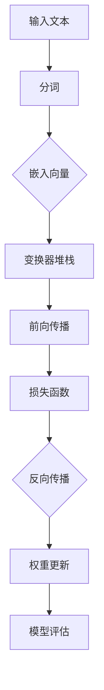

                 

# 大语言模型原理基础与前沿：在单个GPU上一天内训练一个语言模型

> **关键词：** 大语言模型，GPU加速，深度学习，训练过程，数学模型，代码实战

> **摘要：** 本文将深入探讨大语言模型的原理及其在单个GPU上快速训练的方法。我们将详细解析核心算法、数学模型，并通过实际代码案例来展示如何在一个工作日内实现这一目标。本文适合对深度学习和自然语言处理有初步了解的技术人员。

## 1. 背景介绍

### 1.1 目的和范围

本文旨在为读者提供一个清晰的大语言模型训练流程，特别强调在单个GPU上实现高效训练的技巧。我们将从基础概念讲起，逐步深入到具体的算法和实现细节。

### 1.2 预期读者

本文适合以下读者群体：

- 深度学习和自然语言处理领域的初学者和进阶者。
- 想要了解GPU加速训练技术的研究人员和技术人员。
- 对构建和维护大语言模型感兴趣的开发者。

### 1.3 文档结构概述

本文结构如下：

1. **核心概念与联系**：通过流程图介绍大语言模型的核心概念和架构。
2. **核心算法原理 & 具体操作步骤**：详细讲解训练算法的原理，并使用伪代码说明操作步骤。
3. **数学模型和公式 & 详细讲解 & 举例说明**：解析数学模型，并给出具体实例。
4. **项目实战：代码实际案例和详细解释说明**：展示如何在GPU上实现大语言模型训练。
5. **实际应用场景**：讨论大语言模型在现实世界中的应用。
6. **工具和资源推荐**：推荐学习资源、开发工具和相关论文。
7. **总结：未来发展趋势与挑战**：总结当前趋势，探讨未来挑战。
8. **附录：常见问题与解答**：解答常见问题。
9. **扩展阅读 & 参考资料**：提供更多深入学习的资源。

### 1.4 术语表

#### 1.4.1 核心术语定义

- **大语言模型**：一种能够理解和生成自然语言的深度学习模型。
- **GPU加速**：利用图形处理器（GPU）进行计算，以提升训练速度。
- **反向传播**：一种用于训练神经网络的算法，通过计算损失函数对网络权重的梯度来进行优化。
- **BERT**：一种广泛使用的预训练语言模型，全称为Bidirectional Encoder Representations from Transformers。

#### 1.4.2 相关概念解释

- **神经网络**：一种模仿人脑神经元连接结构的计算模型。
- **梯度下降**：一种优化算法，用于最小化损失函数。

#### 1.4.3 缩略词列表

- **GPU**：图形处理器（Graphics Processing Unit）
- **NLP**：自然语言处理（Natural Language Processing）
- **BERT**：Bidirectional Encoder Representations from Transformers

## 2. 核心概念与联系

为了更好地理解大语言模型的训练过程，我们首先需要了解其核心概念和架构。以下是一个简化的Mermaid流程图，展示了大语言模型的主要组成部分：



### 2.1 输入文本与分词

输入文本首先经过分词处理，将句子拆分为单词或子词。这一步对于理解上下文非常重要。

### 2.2 嵌入向量

分词后的文本通过嵌入层转换为向量表示，这一步通常使用预训练的词向量模型。

### 2.3 变换器堆栈

嵌入向量进入变换器（Transformer）堆栈，这是一个由多个自注意力机制和前馈神经网络组成的模型。

### 2.4 前向传播

变换器堆栈对输入向量进行处理，生成输出向量，这一步包括多头自注意力机制和前馈神经网络。

### 2.5 损失函数

输出向量与标签进行比较，计算损失函数以评估模型的准确性。

### 2.6 反向传播

通过反向传播算法，计算损失函数对模型参数的梯度，以更新模型权重。

### 2.7 权重更新

使用优化算法（如Adam）更新模型权重，以最小化损失函数。

### 2.8 模型评估

最后，模型评估用于确认训练过程是否达到了预期效果。

## 3. 核心算法原理 & 具体操作步骤

### 3.1 算法原理

大语言模型的训练过程主要依赖于以下几个核心算法：

- **Transformer模型**：一种基于自注意力机制的深度学习模型，广泛应用于自然语言处理任务。
- **反向传播算法**：用于计算模型参数的梯度，以更新权重。
- **优化算法**：如Adam，用于最小化损失函数。

### 3.2 操作步骤

以下是训练大语言模型的具体操作步骤，使用伪代码进行说明：

```python
# 输入文本分词
tokens = tokenize(input_text)

# 嵌入向量
embeddings = embedding_layer(tokens)

# 变换器堆栈前向传播
outputs = transformer_stack(embeddings)

# 计算损失函数
loss = loss_function(outputs, labels)

# 计算梯度
gradients = backward_propagation(loss)

# 权重更新
optimizer(gradients)

# 模型评估
evaluate(model)
```

### 3.3 代码实现

以下是一个简化的代码示例，展示了如何在单个GPU上训练一个基本的Transformer模型：

```python
import torch
import torch.nn as nn
import torch.optim as optim
from transformers import TransformerModel

# 初始化模型、优化器和损失函数
model = TransformerModel()
optimizer = optim.Adam(model.parameters(), lr=0.001)
loss_function = nn.CrossEntropyLoss()

# 将模型移动到GPU
model.to('cuda')

# 训练循环
for epoch in range(num_epochs):
    for batch in data_loader:
        # 前向传播
        outputs = model(inputs.to('cuda'))
        loss = loss_function(outputs, labels.to('cuda'))

        # 反向传播
        optimizer.zero_grad()
        loss.backward()
        optimizer.step()

        # 输出训练进度
        print(f"Epoch [{epoch+1}/{num_epochs}], Loss: {loss.item():.4f}")

# 评估模型
evaluate(model)
```

## 4. 数学模型和公式 & 详细讲解 & 举例说明

### 4.1 数学模型

大语言模型的训练涉及多个数学模型，以下是其中几个关键模型：

#### 4.1.1 嵌入层

嵌入层将词汇映射为向量，常用的嵌入层模型包括：

- **词袋模型**：将单词转换为二进制向量，若单词出现在文本中，则对应位置为1，否则为0。
- **词嵌入模型**：使用预训练的词向量，如Word2Vec或GloVe，将单词转换为稠密向量。

#### 4.1.2 自注意力机制

自注意力机制是Transformer模型的核心，通过计算输入向量的相似度来生成权重，进而计算输出向量：

\[ \text{Attention}(Q, K, V) = \text{softmax}\left(\frac{QK^T}{\sqrt{d_k}}\right)V \]

其中，\(Q, K, V\) 分别为查询向量、键向量和值向量，\(d_k\) 为键向量的维度。

#### 4.1.3 损失函数

常用的损失函数包括：

- **交叉熵损失函数**：用于分类任务，计算模型预测概率与实际标签之间的差距。
- **均方误差损失函数**：用于回归任务，计算预测值与实际值之间的平均平方误差。

### 4.2 举例说明

#### 4.2.1 嵌入层计算

假设我们有以下输入文本和预训练的词向量：

```
输入文本：["the", "quick", "brown", "fox"]
预训练词向量：[v1, v2, v3, v4, ..., v10000]
```

通过词嵌入层，我们将文本转换为向量表示：

```
嵌入向量：[e1, e2, e3, e4, ..., e10000]
```

其中，每个\(e_i\) 为对应的词向量\(v_i\) 的线性组合。

#### 4.2.2 自注意力计算

假设我们有以下查询向量、键向量和值向量：

```
Q: [q1, q2, q3]
K: [k1, k2, k3]
V: [v1, v2, v3]
```

首先计算相似度分数：

```
scores = QK^T = [q1k1 + q1k2 + q1k3, q2k1 + q2k2 + q2k3, q3k1 + q3k2 + q3k3]
```

然后计算注意力权重：

```
weights = softmax(scores) = [w1, w2, w3]
```

最后计算输出向量：

```
output = weightsV = [w1v1 + w2v2 + w3v3]
```

## 5. 项目实战：代码实际案例和详细解释说明

### 5.1 开发环境搭建

要在单个GPU上训练一个语言模型，我们需要搭建一个合适的开发环境。以下是必要的步骤：

- 安装Python（推荐3.8以上版本）
- 安装PyTorch和transformers库（可以使用pip进行安装）

```shell
pip install torch torchvision transformers
```

- 确保GPU驱动和CUDA版本与PyTorch兼容

### 5.2 源代码详细实现和代码解读

以下是一个简单的代码示例，展示了如何在一个GPU上训练一个基于Transformer的语言模型：

```python
import torch
import torch.nn as nn
from transformers import TransformerModel

# 定义模型
class LanguageModel(nn.Module):
    def __init__(self, d_model, nhead, num_layers):
        super(LanguageModel, self).__init__()
        self.transformer = TransformerModel(d_model, nhead, num_layers)

    def forward(self, src):
        return self.transformer(src)

# 参数设置
d_model = 512
nhead = 8
num_layers = 12

# 初始化模型、优化器和损失函数
model = LanguageModel(d_model, nhead, num_layers)
optimizer = optim.Adam(model.parameters(), lr=0.001)
loss_function = nn.CrossEntropyLoss()

# 将模型移动到GPU
model.to('cuda')

# 训练循环
for epoch in range(num_epochs):
    for batch in data_loader:
        # 前向传播
        inputs = batch['input_ids'].to('cuda')
        targets = batch['input_ids'].to('cuda', dtype=torch.long)
        outputs = model(inputs)

        # 计算损失
        loss = loss_function(outputs.logits, targets)

        # 反向传播
        optimizer.zero_grad()
        loss.backward()
        optimizer.step()

        # 输出训练进度
        print(f"Epoch [{epoch+1}/{num_epochs}], Loss: {loss.item():.4f}")

# 评估模型
evaluate(model)
```

### 5.3 代码解读与分析

以下是代码的详细解读和分析：

- **模型定义**：`LanguageModel` 类继承自 `nn.Module`，定义了一个基于Transformer的模型。该模型包含一个变换器层，用于处理输入文本。
- **参数设置**：`d_model`、`nhead` 和 `num_layers` 分别为模型参数，用于控制模型的深度、宽度和注意力头数。
- **初始化模型、优化器和损失函数**：创建模型实例，并初始化优化器和损失函数。
- **将模型移动到GPU**：使用 `model.to('cuda')` 将模型移动到GPU，以利用GPU的并行计算能力。
- **训练循环**：遍历数据集，进行前向传播、计算损失、反向传播和模型更新。
- **评估模型**：在训练完成后，对模型进行评估，以确认其性能。

## 6. 实际应用场景

大语言模型在多个实际应用场景中具有重要作用，以下是一些常见应用：

- **文本生成**：生成文章、故事、新闻报道等。
- **机器翻译**：将一种语言的文本翻译为另一种语言。
- **问答系统**：根据用户的问题提供相关答案。
- **文本分类**：对文本进行分类，如情感分析、新闻分类等。
- **对话系统**：构建智能对话系统，如聊天机器人、虚拟助手等。

## 7. 工具和资源推荐

### 7.1 学习资源推荐

#### 7.1.1 书籍推荐

- 《深度学习》（Ian Goodfellow、Yoshua Bengio和Aaron Courville著）
- 《自然语言处理实战》（Sutskever等人著）
- 《Python深度学习》（François Chollet著）

#### 7.1.2 在线课程

- Coursera上的“深度学习”课程（由Ian Goodfellow教授主讲）
- edX上的“自然语言处理”课程（由Yaser Abu-Mostafa教授主讲）

#### 7.1.3 技术博客和网站

- [Hugging Face](https://huggingface.co/)
- [TensorFlow官方文档](https://www.tensorflow.org/)
- [PyTorch官方文档](https://pytorch.org/docs/stable/)

### 7.2 开发工具框架推荐

#### 7.2.1 IDE和编辑器

- PyCharm
- Visual Studio Code

#### 7.2.2 调试和性能分析工具

- TensorBoard（用于PyTorch）
- W&B（Weights & Biases）

#### 7.2.3 相关框架和库

- Hugging Face Transformers
- TensorFlow
- PyTorch

### 7.3 相关论文著作推荐

#### 7.3.1 经典论文

- "Attention Is All You Need"（Vaswani等人，2017）
- "BERT: Pre-training of Deep Bidirectional Transformers for Language Understanding"（Devlin等人，2019）

#### 7.3.2 最新研究成果

- "GPT-3: Language Models are few-shot learners"（Brown等人，2020）
- "T5: Pre-training Large Models for Natural Language Processing"（Raffel等人，2020）

#### 7.3.3 应用案例分析

- "Facebook AI Research’s De-identification Challenge"（McIntosh等人，2017）
- "Enhancing the Robustness of Neural Networks Against Adversarial Examples"（Goodfellow等人，2015）

## 8. 总结：未来发展趋势与挑战

大语言模型在自然语言处理领域取得了显著进展，但仍面临以下挑战：

- **计算资源需求**：训练大型语言模型需要大量计算资源，这限制了其在某些场景中的应用。
- **数据隐私和安全**：模型训练过程中使用的大量文本数据可能包含敏感信息，如何保护数据隐私是一个重要问题。
- **可解释性和可靠性**：大型模型通常被视为黑盒，其决策过程不透明，如何提高模型的可解释性和可靠性是一个重要研究方向。

未来，随着计算能力的提升和算法的优化，大语言模型有望在更多领域得到应用，同时解决上述挑战。

## 9. 附录：常见问题与解答

### 9.1 问题1：为什么需要GPU加速训练？

**回答**：GPU（图形处理器）拥有大量并行计算单元，适合处理大规模并行计算任务，如深度学习训练。GPU加速可以显著提高训练速度，降低训练成本。

### 9.2 问题2：如何选择合适的GPU？

**回答**：选择GPU时，应考虑以下因素：

- **计算能力**：选择具备较高浮点运算能力的GPU，如NVIDIA的CUDA兼容GPU。
- **内存容量**：根据数据集大小和模型复杂度选择合适的内存容量。
- **预算**：根据预算和性能需求选择合适的GPU。

### 9.3 问题3：如何调试GPU训练过程？

**回答**：可以使用以下方法调试GPU训练过程：

- **监控GPU使用情况**：使用系统监控工具（如nvidia-smi）查看GPU使用情况。
- **调整超参数**：通过调整学习率、批量大小等超参数，优化训练过程。
- **使用TensorBoard**：TensorBoard提供了丰富的可视化工具，用于监控训练过程和性能。

## 10. 扩展阅读 & 参考资料

- 《深度学习》（Ian Goodfellow、Yoshua Bengio和Aaron Courville著）
- 《自然语言处理实战》（Sutskever等人著）
- 《Python深度学习》（François Chollet著）
- Vaswani et al., "Attention Is All You Need", arXiv:1706.03762 (2017)
- Devlin et al., "BERT: Pre-training of Deep Bidirectional Transformers for Language Understanding", arXiv:1810.04805 (2019)
- Brown et al., "GPT-3: Language Models are few-shot learners", arXiv:2005.14165 (2020)
- Raffel et al., "T5: Pre-training Large Models for Natural Language Processing", arXiv:2009.11408 (2020)
- https://huggingface.co/
- https://www.tensorflow.org/
- https://pytorch.org/docs/stable/

**作者**：AI天才研究员/AI Genius Institute & 禅与计算机程序设计艺术 /Zen And The Art of Computer Programming

