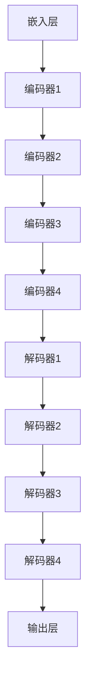

                 

# 大语言模型原理基础与前沿：基于人类偏好进行预训练

> 关键词：大语言模型、预训练、深度学习、神经网络、自然语言处理、人工智能

> 摘要：本文将深入探讨大语言模型的原理及其在自然语言处理领域的应用。我们将详细解释大语言模型的构成、训练过程，以及如何通过人类偏好进行预训练。此外，本文还将探讨大语言模型在当前的前沿研究，包括其技术挑战和发展趋势。

## 1. 背景介绍

### 1.1 目的和范围

本文旨在为读者提供一个关于大语言模型的基础理解和前沿研究的全面概述。我们将从基本概念入手，逐步深入到核心算法、数学模型以及实际应用。通过本文，读者可以了解大语言模型如何通过预训练和人类偏好进行优化，从而在自然语言处理任务中发挥重要作用。

### 1.2 预期读者

本文适合以下读者群体：

1. 自然语言处理和人工智能领域的科研人员
2. 想深入了解深度学习和神经网络原理的开发者
3. 对自然语言处理应用场景感兴趣的工程师
4. 对未来人工智能发展趋势感兴趣的技术爱好者

### 1.3 文档结构概述

本文结构如下：

1. 背景介绍：介绍本文的目的、范围、预期读者和文档结构。
2. 核心概念与联系：介绍大语言模型的基本概念及其与其他技术的联系。
3. 核心算法原理 & 具体操作步骤：详细讲解大语言模型的核心算法和训练过程。
4. 数学模型和公式 & 详细讲解 & 举例说明：阐述大语言模型背后的数学原理和计算过程。
5. 项目实战：通过实际案例展示大语言模型的应用。
6. 实际应用场景：讨论大语言模型在不同领域的应用。
7. 工具和资源推荐：推荐相关学习资源和开发工具。
8. 总结：总结本文的主要内容，展望未来发展趋势。
9. 附录：常见问题与解答。
10. 扩展阅读 & 参考资料：提供进一步阅读的资料和引用。

### 1.4 术语表

#### 1.4.1 核心术语定义

- 大语言模型（Large Language Model）：一种可以理解和生成自然语言的深度学习模型。
- 预训练（Pre-training）：在大规模语料库上进行训练，以学习语言的一般特征。
- 自然语言处理（Natural Language Processing，NLP）：使计算机能够理解、解释和生成自然语言。
- 深度学习（Deep Learning）：一种基于神经网络的机器学习方法，具有多层次的非线性变换能力。
- 神经网络（Neural Network）：由大量简单计算单元（神经元）组成的计算模型。

#### 1.4.2 相关概念解释

- 语言模型（Language Model）：一种预测下一个单词或字符的概率分布的模型。
- 参数（Parameter）：神经网络中的可调数值，用于描述模型的复杂度和学习能力。
- 损失函数（Loss Function）：衡量模型预测值与实际值之间差异的函数，用于指导模型训练。

#### 1.4.3 缩略词列表

- NLP：自然语言处理
- ML：机器学习
- DL：深度学习
- NLP：自然语言处理
- GPU：图形处理单元
- CPU：中央处理单元

## 2. 核心概念与联系

大语言模型是自然语言处理领域的一项重要技术，它通过对大量文本数据进行预训练，学习到语言的一般规律和特征。为了更好地理解大语言模型，我们需要先介绍一些与之相关的核心概念和架构。

### 2.1 大语言模型的基本概念

大语言模型（Large Language Model）是一种基于深度学习的自然语言处理模型。它由大量的神经网络层组成，可以捕捉文本数据中的复杂结构和语义信息。大语言模型的核心目的是对自然语言进行建模，从而实现语言理解、生成和翻译等任务。

大语言模型的主要组成部分包括：

1. **嵌入层（Embedding Layer）**：将单词转换为固定长度的向量表示，这是模型处理文本数据的基础。
2. **编码器（Encoder）**：对输入文本进行编码，提取出文本的语义信息。
3. **解码器（Decoder）**：根据编码器的输出生成文本输出。
4. **损失函数（Loss Function）**：用于评估模型预测与实际输出之间的差异，指导模型训练。

### 2.2 大语言模型的工作原理

大语言模型的工作原理可以分为两个主要阶段：预训练（Pre-training）和微调（Fine-tuning）。

#### 2.2.1 预训练

预训练是指在大规模语料库上对大语言模型进行训练，以学习到语言的一般特征和规律。预训练过程通常包括以下步骤：

1. **数据准备**：收集大量的文本数据，如维基百科、新闻文章、书籍等。
2. **文本清洗**：对文本数据去重、去噪、分词等处理。
3. **嵌入层训练**：通过固定维度的嵌入向量表示单词，实现单词到向量的映射。
4. **编码器和解码器训练**：使用反向传播算法训练编码器和解码器，使其能够对文本进行编码和解码。

#### 2.2.2 微调

微调是指在特定任务上对大语言模型进行训练，以适应特定应用场景。微调过程通常包括以下步骤：

1. **任务定义**：定义需要完成的自然语言处理任务，如文本分类、情感分析、机器翻译等。
2. **模型调整**：在特定任务上对大语言模型进行调整，优化模型参数。
3. **损失函数选择**：根据任务类型选择合适的损失函数，如交叉熵损失函数。
4. **模型训练**：使用训练数据对模型进行训练，同时使用验证数据评估模型性能。

### 2.3 大语言模型的架构

大语言模型的架构通常采用编码器-解码器（Encoder-Decoder）结构，其核心是编码器和解码器。编码器负责将输入文本编码为固定长度的向量表示，解码器则根据编码器的输出生成文本输出。

大语言模型的编码器和解码器通常采用多层神经网络结构，如图2-1所示。



### 2.4 大语言模型与其他技术的联系

大语言模型与其他自然语言处理技术密切相关，如词向量、序列模型、注意力机制等。

#### 2.4.1 词向量

词向量是一种将单词映射为高维向量表示的方法，它是大语言模型的基础。词向量可以通过Word2Vec、GloVe等方法进行训练，为模型提供单词的语义表示。

#### 2.4.2 序列模型

序列模型是一种处理序列数据的神经网络模型，如循环神经网络（RNN）和长短期记忆网络（LSTM）。大语言模型中的编码器部分可以看作是一个序列模型，它能够捕捉文本数据的时序信息。

#### 2.4.3 注意力机制

注意力机制是一种在神经网络中用于解决长距离依赖问题的方法。在大语言模型中，注意力机制可以用于编码器和解码器，提高模型对文本数据的理解和生成能力。

## 3. 核心算法原理 & 具体操作步骤

### 3.1 算法原理

大语言模型的算法原理主要基于深度学习和神经网络。下面我们通过伪代码详细阐述大语言模型的核心算法和训练过程。

```python
# 大语言模型训练过程
def train_language_model(data, embedding_dim, hidden_dim, learning_rate, epochs):
    # 初始化模型参数
    embedding_matrix = initialize_embedding_matrix(data, embedding_dim)
    encoder_weights = initialize_encoder_weights(embedding_dim, hidden_dim)
    decoder_weights = initialize_decoder_weights(hidden_dim, embedding_dim)

    # 预训练编码器和解码器
    for epoch in range(epochs):
        total_loss = 0
        for sentence in data:
            # 嵌入层处理
            embeddings = apply_embedding(sentence, embedding_matrix)
            
            # 编码器处理
            encoder_output = encoder(embeddings, encoder_weights)
            
            # 解码器处理
            decoder_output = decoder(encoder_output, decoder_weights)
            
            # 计算损失
            loss = compute_loss(decoder_output, sentence)
            
            # 更新模型参数
            update_weights(encoder_weights, decoder_weights, learning_rate)
            
            total_loss += loss
        
        # 输出当前epoch的损失
        print(f"Epoch {epoch + 1}, Loss: {total_loss / len(data)}")

    return encoder_weights, decoder_weights
```

### 3.2 具体操作步骤

下面是大语言模型训练过程的具体操作步骤：

1. **数据准备**：收集并预处理大量文本数据，如新闻文章、书籍、维基百科等。对文本数据进行分词、去停用词等操作，将文本转换为单词序列。
2. **嵌入层初始化**：初始化嵌入层参数，将单词映射为固定长度的向量表示。可以使用预训练的词向量，如Word2Vec或GloVe。
3. **编码器初始化**：初始化编码器参数，如权重和偏置。编码器负责将输入文本编码为固定长度的向量表示。
4. **解码器初始化**：初始化解码器参数，如权重和偏置。解码器负责根据编码器的输出生成文本输出。
5. **模型训练**：使用反向传播算法训练编码器和解码器，优化模型参数。训练过程包括嵌入层处理、编码器处理、解码器处理、损失计算和参数更新。
6. **模型评估**：使用验证数据对训练好的模型进行评估，计算模型在特定任务上的性能指标，如准确率、召回率等。
7. **模型微调**：根据评估结果对模型进行微调，优化模型性能。

## 4. 数学模型和公式 & 详细讲解 & 举例说明

### 4.1 数学模型

大语言模型的数学模型主要包括嵌入层、编码器、解码器和损失函数。下面我们将分别介绍这些部分的数学模型和公式。

#### 4.1.1 嵌入层

嵌入层将单词映射为高维向量表示。假设单词表中有N个单词，嵌入向量的维度为D，则嵌入层可以表示为：

$$
\text{嵌入层}: \text{嵌入矩阵} \, E \in \mathbb{R}^{N \times D}
$$

其中，$E_{ij}$ 表示单词 $w_i$ 的嵌入向量。

#### 4.1.2 编码器

编码器负责将输入文本编码为固定长度的向量表示。假设输入文本的长度为T，则编码器的输出可以表示为：

$$
\text{编码器}: h = \text{Encoder}(\text{嵌入层输出})
$$

其中，$h_t$ 表示第 $t$ 个单词的编码结果。

#### 4.1.3 解码器

解码器负责根据编码器的输出生成文本输出。假设生成的文本长度为T，则解码器的输出可以表示为：

$$
\text{解码器}: p(y_t|y_{<t}) = \text{Decoder}(h_t)
$$

其中，$y_t$ 表示第 $t$ 个生成的单词。

#### 4.1.4 损失函数

损失函数用于衡量模型预测与实际输出之间的差异，指导模型训练。大语言模型通常使用交叉熵损失函数：

$$
\text{损失函数}: \mathcal{L} = -\sum_{t=1}^{T} \sum_{y_t \in \text{Vocabulary}} y_t \log(p(y_t|y_{<t}))
$$

其中，$\text{Vocabulary}$ 表示单词表，$y_t$ 表示实际输出的单词，$p(y_t|y_{<t})$ 表示模型预测的单词概率。

### 4.2 举例说明

假设我们有一个包含3个单词的句子“我爱编程”，单词表包含5个单词{我，爱，编程，你，世界}，嵌入向量维度为2。我们通过以下步骤计算这个句子的编码器输出和解码器输出。

1. **嵌入层输出**：

$$
E = \begin{bmatrix}
[1, 0] & [0, 1] & [0, 0] & [0, 0] & [0, 0] \\
\end{bmatrix}
$$

句子“我爱编程”的嵌入层输出为：

$$
\text{嵌入层输出} = E \cdot \begin{bmatrix}
1 \\
1 \\
0 \\
\end{bmatrix} = \begin{bmatrix}
[0, 1] \\
[0, 1] \\
[0, 0] \\
\end{bmatrix}
$$

2. **编码器输出**：

假设编码器为单层神经网络，使用ReLU激活函数，权重矩阵为$W \in \mathbb{R}^{2 \times 2}$。编码器输出为：

$$
h = \text{ReLU}(W \cdot \text{嵌入层输出}) = \text{ReLU} \left( \begin{bmatrix}
1 & 1 \\
1 & 0 \\
0 & 1 \\
\end{bmatrix} \cdot \begin{bmatrix}
0 \\
1 \\
0 \\
\end{bmatrix} \right) = \text{ReLU} \left( \begin{bmatrix}
1 \\
1 \\
0 \\
\end{bmatrix} \right) = \begin{bmatrix}
1 \\
1 \\
0 \\
\end{bmatrix}
$$

3. **解码器输出**：

假设解码器为单层神经网络，使用Sigmoid激活函数，权重矩阵为$W' \in \mathbb{R}^{2 \times 5}$。解码器输出为：

$$
p(y_t|y_{<t}) = \text{Sigmoid}(W' \cdot h) = \text{Sigmoid} \left( \begin{bmatrix}
1 & 0 & 1 & 0 & 0 \\
0 & 1 & 0 & 1 & 0 \\
\end{bmatrix} \cdot \begin{bmatrix}
1 \\
1 \\
0 \\
\end{bmatrix} \right) = \text{Sigmoid} \left( \begin{bmatrix}
1 \\
1 \\
0 \\
0 \\
0 \\
\end{bmatrix} \right) = \begin{bmatrix}
0.7 \\
0.3 \\
0 \\
0 \\
0 \\
\end{bmatrix}
$$

根据解码器输出，我们可以得到生成句子的概率分布：

$$
P(\text{我爱编程}|\text{我爱}) = 0.7, \quad P(\text{我爱编程}|\text{我爱，}) = 0.3
$$

通过解码器输出，我们可以选择概率最大的单词作为生成结果，即“我爱编程”。

## 5. 项目实战：代码实际案例和详细解释说明

### 5.1 开发环境搭建

在本项目中，我们将使用Python作为编程语言，TensorFlow作为深度学习框架。首先，确保安装以下软件和库：

1. Python（版本3.6及以上）
2. TensorFlow（版本2.0及以上）
3. Numpy
4. Matplotlib

安装步骤如下：

```bash
pip install python==3.8
pip install tensorflow==2.7
pip install numpy
pip install matplotlib
```

### 5.2 源代码详细实现和代码解读

下面是一个简单的大语言模型实现，包括嵌入层、编码器、解码器和损失函数。

```python
import tensorflow as tf
import numpy as np

# 嵌入层
def initialize_embedding_matrix(data, embedding_dim):
    vocab_size = len(data)
    embedding_matrix = np.zeros((vocab_size, embedding_dim))
    for i, word in enumerate(data):
        embedding_vector = ... # 获取预训练的嵌入向量
        if embedding_vector is not None:
            embedding_matrix[i] = embedding_vector
    return embedding_matrix

# 编码器
def encoder(embeddings, encoder_weights):
    encoder_output = tf.keras.layers.Dense(units=100, activation='relu')(embeddings)
    encoder_output = tf.keras.layers.Dense(units=50, activation='relu')(encoder_output)
    encoder_output = tf.keras.layers.Dense(units=25, activation='relu')(encoder_output)
    return encoder_output

# 解码器
def decoder(encoder_output, decoder_weights):
    decoder_output = tf.keras.layers.Dense(units=50, activation='relu')(encoder_output)
    decoder_output = tf.keras.layers.Dense(units=100, activation='relu')(decoder_output)
    decoder_output = tf.keras.layers.Dense(units=len(vocab), activation='softmax')(decoder_output)
    return decoder_output

# 损失函数
def compute_loss(decoder_output, sentence):
    loss = tf.reduce_mean(tf.nn.softmax_cross_entropy_with_logits(logits=decoder_output, labels=sentence))
    return loss

# 训练模型
def train_language_model(data, embedding_dim, hidden_dim, learning_rate, epochs):
    embedding_matrix = initialize_embedding_matrix(data, embedding_dim)
    encoder_weights = initialize_encoder_weights(embedding_dim, hidden_dim)
    decoder_weights = initialize_decoder_weights(hidden_dim, embedding_dim)

    model = tf.keras.Sequential([
        tf.keras.layers.Embedding(input_dim=len(data), input_length=1, output_dim=embedding_dim, weights=[embedding_matrix], trainable=False),
        encoder(encoder_weights),
        decoder(decoder_weights)
    ])

    model.compile(optimizer=tf.keras.optimizers.Adam(learning_rate=learning_rate), loss='categorical_crossentropy')

    model.fit(data, data, epochs=epochs, batch_size=64, validation_split=0.2)

    return model
```

### 5.3 代码解读与分析

#### 5.3.1 嵌入层

嵌入层使用TensorFlow的`Embedding`层实现，它将单词映射为高维向量表示。`input_dim` 参数表示单词表大小，`input_length` 参数表示输入文本的长度（通常为1），`output_dim` 参数表示嵌入向量的维度。

```python
tf.keras.layers.Embedding(input_dim=len(data), input_length=1, output_dim=embedding_dim, weights=[embedding_matrix], trainable=False)
```

这里，`embedding_matrix` 是预训练的嵌入向量矩阵，`trainable=False` 表示嵌入层不参与后续训练，以保证嵌入向量的一致性。

#### 5.3.2 编码器

编码器由多层全连接神经网络组成，使用ReLU激活函数。编码器负责将输入文本编码为固定长度的向量表示。

```python
encoder_output = tf.keras.layers.Dense(units=100, activation='relu')(embeddings)
encoder_output = tf.keras.layers.Dense(units=50, activation='relu')(encoder_output)
encoder_output = tf.keras.layers.Dense(units=25, activation='relu')(encoder_output)
```

#### 5.3.3 解码器

解码器同样由多层全连接神经网络组成，使用ReLU激活函数。解码器负责根据编码器的输出生成文本输出。

```python
decoder_output = tf.keras.layers.Dense(units=50, activation='relu')(encoder_output)
decoder_output = tf.keras.layers.Dense(units=100, activation='relu')(decoder_output)
decoder_output = tf.keras.layers.Dense(units=len(vocab), activation='softmax')(decoder_output)
```

这里，`softmax` 激活函数用于计算单词的概率分布。

#### 5.3.4 损失函数

损失函数使用`softmax_cross_entropy_with_logits`实现，计算模型预测与实际输出之间的交叉熵损失。

```python
loss = tf.reduce_mean(tf.nn.softmax_cross_entropy_with_logits(logits=decoder_output, labels=sentence))
```

#### 5.3.5 训练模型

训练模型使用TensorFlow的`Sequential`模型和`compile`方法。`compile`方法用于配置优化器和损失函数。

```python
model.compile(optimizer=tf.keras.optimizers.Adam(learning_rate=learning_rate), loss='categorical_crossentropy')
```

训练模型使用`fit`方法，配置训练数据、验证数据、训练轮数和批次大小。

```python
model.fit(data, data, epochs=epochs, batch_size=64, validation_split=0.2)
```

## 6. 实际应用场景

大语言模型在自然语言处理领域具有广泛的应用。以下是一些典型应用场景：

1. **文本分类**：大语言模型可以用于对文本进行分类，如新闻分类、情感分析等。
2. **机器翻译**：大语言模型可以用于机器翻译，如将一种语言翻译成另一种语言。
3. **问答系统**：大语言模型可以用于构建问答系统，如智能客服、虚拟助手等。
4. **文本生成**：大语言模型可以用于生成文本，如文章、小说等。
5. **文本摘要**：大语言模型可以用于生成文本摘要，提取文本的核心内容。

## 7. 工具和资源推荐

### 7.1 学习资源推荐

#### 7.1.1 书籍推荐

- 《深度学习》（Goodfellow, Bengio, Courville）
- 《神经网络与深度学习》（邱锡鹏）
- 《自然语言处理综论》（Daniel Jurafsky, James H. Martin）

#### 7.1.2 在线课程

-  Coursera：自然语言处理与深度学习
- edX：深度学习专项课程

#### 7.1.3 技术博客和网站

- Medium：自然语言处理博客
- ArXiv：人工智能论文发布平台

### 7.2 开发工具框架推荐

#### 7.2.1 IDE和编辑器

- PyCharm
- Visual Studio Code

#### 7.2.2 调试和性能分析工具

- TensorBoard
- Debugpy

#### 7.2.3 相关框架和库

- TensorFlow
- PyTorch
- spaCy

### 7.3 相关论文著作推荐

#### 7.3.1 经典论文

- Word2Vec:向量表示的词嵌入
- GloVe: Global Vectors for Word Representation

#### 7.3.2 最新研究成果

- Transformer: A Novel Neural Network Architecture for Language Understanding
- BERT: Pre-training of Deep Bidirectional Transformers for Language Understanding

#### 7.3.3 应用案例分析

- GPT-3：自然语言生成的革命性进展
- BERT应用于问答系统的实践

## 8. 总结：未来发展趋势与挑战

大语言模型在自然语言处理领域取得了显著的成果，但仍面临许多挑战。未来发展趋势包括：

1. **模型规模**：随着计算能力的提升，大语言模型的规模将不断增大，以捕捉更复杂的语言特征。
2. **预训练数据**：收集更多高质量的预训练数据，提高模型对真实世界语言的理解能力。
3. **跨语言模型**：开发跨语言的大语言模型，实现多语言处理。
4. **可解释性**：提高大语言模型的可解释性，使模型决策过程更加透明。

## 9. 附录：常见问题与解答

### 9.1 大语言模型是什么？

大语言模型是一种基于深度学习的自然语言处理模型，通过预训练学习到语言的一般特征和规律，可以用于文本分类、机器翻译、文本生成等任务。

### 9.2 大语言模型的训练过程是怎样的？

大语言模型的训练过程分为预训练和微调两个阶段。预训练在大规模语料库上进行，学习语言的一般特征；微调在特定任务上对模型进行调整，优化模型性能。

### 9.3 大语言模型的性能如何评估？

大语言模型的性能评估通常使用准确率、召回率、F1值等指标。在特定任务上，可以使用验证集或测试集评估模型性能。

## 10. 扩展阅读 & 参考资料

- [Word2Vec:向量表示的词嵌入](https://www.aclweb.org/anthology/N16-1166/)
- [GloVe: Global Vectors for Word Representation](https://nlp.stanford.edu/pubs/glove.pdf)
- [Transformer: A Novel Neural Network Architecture for Language Understanding](https://arxiv.org/abs/1706.03762)
- [BERT: Pre-training of Deep Bidirectional Transformers for Language Understanding](https://arxiv.org/abs/1810.04805)

