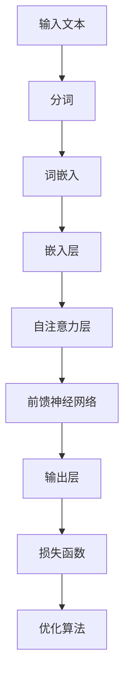

                 

# 大语言模型原理基础与前沿 提示语言模型的校准

> **关键词**：大语言模型、原理、算法、数学模型、实战、应用场景、工具推荐、发展趋势、挑战
> 
> **摘要**：本文将深入探讨大语言模型的原理、核心算法、数学模型以及实际应用。我们将以逻辑清晰、结构紧凑的方式，从基础到前沿，逐步解析这一领域的关键概念，并提供实际案例以加深理解。读者将获得关于大语言模型全面而深入的认知，并为未来的研究和应用奠定基础。

## 1. 背景介绍

### 1.1 目的和范围

本文旨在为广大读者提供一个系统而全面的关于大语言模型（Large Language Model）的导论。本文将涵盖大语言模型的原理、核心算法、数学模型以及其实际应用场景。通过本文，读者将能够理解大语言模型如何工作，其背后的算法原理，以及如何在实际项目中运用这些模型。

### 1.2 预期读者

本文适合对自然语言处理和人工智能感兴趣的读者，无论是科研人员、开发者还是对技术领域有一定了解的从业者。对计算机科学、机器学习和数据科学有初步了解的读者将更容易跟上本文的节奏。

### 1.3 文档结构概述

本文结构如下：

- **1. 背景介绍**：介绍本文的目的和预期读者。
- **2. 核心概念与联系**：介绍大语言模型的核心概念和原理，并使用Mermaid流程图展示架构。
- **3. 核心算法原理 & 具体操作步骤**：详细解析大语言模型的核心算法，并使用伪代码进行阐述。
- **4. 数学模型和公式 & 详细讲解 & 举例说明**：讲解大语言模型背后的数学模型，并提供实例说明。
- **5. 项目实战：代码实际案例和详细解释说明**：通过实际代码案例展示大语言模型的应用。
- **6. 实际应用场景**：探讨大语言模型在不同领域的应用。
- **7. 工具和资源推荐**：推荐相关学习资源、开发工具和论文。
- **8. 总结：未来发展趋势与挑战**：总结本文内容，展望未来发展趋势和面临的挑战。
- **9. 附录：常见问题与解答**：解答读者可能遇到的问题。
- **10. 扩展阅读 & 参考资料**：提供进一步阅读的建议和参考资料。

### 1.4 术语表

#### 1.4.1 核心术语定义

- **大语言模型**：一种基于深度学习的自然语言处理模型，具有强大的语言理解和生成能力。
- **自然语言处理（NLP）**：研究如何让计算机理解和处理人类自然语言的技术。
- **深度学习**：一种机器学习技术，通过多层神经网络进行数据的学习和处理。
- **神经网络**：一种模拟人脑神经元连接结构的计算模型。

#### 1.4.2 相关概念解释

- **词嵌入（Word Embedding）**：将词汇映射到高维空间中的向量表示。
- **损失函数（Loss Function）**：用于衡量模型预测结果与真实结果之间的差距。
- **反向传播（Backpropagation）**：一种用于训练神经网络的优化算法。

#### 1.4.3 缩略词列表

- **GPU**：图形处理器（Graphics Processing Unit）
- **NLP**：自然语言处理（Natural Language Processing）
- **AI**：人工智能（Artificial Intelligence）
- **DL**：深度学习（Deep Learning）

## 2. 核心概念与联系

大语言模型是自然语言处理领域的一项重要进展，其核心在于对大规模文本数据进行学习，从而获得对语言深刻理解的能力。以下是对大语言模型核心概念和原理的概述，我们将使用Mermaid流程图展示其架构。

### 2.1 大语言模型的核心概念

- **词嵌入（Word Embedding）**：将词汇映射为固定长度的向量表示，这些向量表示词汇在语义上的相似性。
- **循环神经网络（RNN）**：一种处理序列数据的神经网络，能够考虑上下文信息。
- **注意力机制（Attention Mechanism）**：帮助模型关注输入序列中的关键部分，提高模型对上下文的理解能力。
- **Transformer模型**：一种基于自注意力机制的序列模型，具有更高的计算效率和性能。

### 2.2 大语言模型的架构



### 2.3 大语言模型的工作流程

1. 输入文本经过分词处理，分解为一系列单词或子词。
2. 这些单词或子词通过词嵌入层转换为向量表示。
3. 嵌入层后的向量通过自注意力机制处理，重点关注输入序列中的关键部分。
4. 自注意力层的输出通过前馈神经网络进一步加工。
5. 最终输出层生成预测结果，并通过损失函数评估模型性能。
6. 模型使用优化算法调整参数，以减少预测误差。

## 3. 核心算法原理 & 具体操作步骤

大语言模型的核心在于其算法原理，以下我们将详细解析大语言模型的工作原理，并使用伪代码进行阐述。

### 3.1 词嵌入

词嵌入是将词汇映射到高维空间中的向量表示。其基本原理是将每个词汇映射为一个向量，这些向量在语义空间中具有相似性的词汇会靠近。

```python
# 伪代码：词嵌入
def word_embedding(words, embedding_size):
    embeddings = []
    for word in words:
        # 根据预训练的词嵌入词典查找word的向量表示
        embedding = pretrained_embedding_dict[word]
        embeddings.append(embedding)
    return embeddings
```

### 3.2 循环神经网络（RNN）

循环神经网络（RNN）是处理序列数据的经典模型，其能够考虑上下文信息。以下是一个简化的RNN模型。

```python
# 伪代码：RNN
class RNN:
    def __init__(self, input_size, hidden_size):
        self.input_size = input_size
        self.hidden_size = hidden_size
        # 初始化权重和偏置
        self.Wxh = np.random.randn(input_size, hidden_size)
        self.Whh = np.random.randn(hidden_size, hidden_size)
        self.Wy = np.random.randn(hidden_size, output_size)
        self.bh = np.zeros((1, hidden_size))
        self.by = np.zeros((1, output_size))
    
    def forward(self, x):
        # 前向传播
        self.hprev = self.bh
        for word in x:
            embedding = word_embedding(word, hidden_size)
            h = np.tanh(np.dot(embedding, self.Wxh) + np.dot(self.hprev, self.Whh))
            self.hprev = h
        y_pred = np.dot(self.hprev, self.Wy) + self.by
        return y_pred
```

### 3.3 注意力机制

注意力机制帮助模型关注输入序列中的关键部分，提高模型对上下文的理解能力。以下是一个简化的注意力机制。

```python
# 伪代码：注意力机制
def attention(q, v):
    # 计算注意力分数
    scores = np.dot(q, v.T)
    # 归一化分数
    alpha = softmax(scores)
    # 加权求和
    context = np.dot(alpha, v)
    return context
```

### 3.4 Transformer模型

Transformer模型是一种基于自注意力机制的序列模型，其具有更高的计算效率和性能。以下是一个简化的Transformer模型。

```python
# 伪代码：Transformer模型
class Transformer:
    def __init__(self, input_size, hidden_size):
        self.input_size = input_size
        self.hidden_size = hidden_size
        # 初始化权重和偏置
        self.Wq = np.random.randn(input_size, hidden_size)
        self.Wk = np.random.randn(input_size, hidden_size)
        self.Wv = np.random.randn(input_size, hidden_size)
        self.Wo = np.random.randn(hidden_size, output_size)
        self.bq = np.zeros((1, hidden_size))
        self.bk = np.zeros((1, hidden_size))
        self.bv = np.zeros((1, hidden_size))
        self.b = np.zeros((1, output_size))
    
    def forward(self, x):
        # 前向传播
        q = np.dot(x, self.Wq) + self.bq
        k = np.dot(x, self.Wk) + self.bk
        v = np.dot(x, self.Wv) + self.bv
        context = attention(q, k, v)
        y_pred = np.dot(context, self.Wo) + self.b
        return y_pred
```

## 4. 数学模型和公式 & 详细讲解 & 举例说明

大语言模型的数学模型是理解和应用这些模型的关键。以下我们将详细讲解大语言模型背后的数学模型，并提供实例说明。

### 4.1 词嵌入

词嵌入是将词汇映射到高维空间中的向量表示。其基本公式如下：

$$
\text{word\_embedding}(word) = \text{embeddings}[word]
$$

其中，$\text{embeddings}$ 是一个预训练的词嵌入词典，$word$ 是输入的词汇。

#### 例子：

假设我们有一个预训练的词嵌入词典，词汇 "apple" 的向量表示为 `[1, 2, 3]`。当我们输入 "apple" 时，词嵌入函数将返回 `[1, 2, 3]`。

```python
# 例子：词嵌入
embeddings = {'apple': [1, 2, 3], 'banana': [4, 5, 6]}
word_embedding('apple')  # 输出：[1, 2, 3]
```

### 4.2 循环神经网络（RNN）

循环神经网络（RNN）是一种处理序列数据的神经网络。其基本公式如下：

$$
h_t = \tanh(W_xh \cdot x_t + W_hh \cdot h_{t-1} + b_h)
$$

其中，$h_t$ 是当前时刻的隐藏状态，$x_t$ 是当前输入，$W_xh$ 和 $W_hh$ 是权重矩阵，$b_h$ 是偏置项。

#### 例子：

假设我们有一个RNN模型，输入序列为 `[1, 2, 3]`，隐藏状态初始值为 `[0, 0]`。根据上述公式，我们可以计算隐藏状态序列：

```python
# 例子：RNN
input_sequence = [1, 2, 3]
hidden_state = [0, 0]

W_xh = np.array([[1], [2], [3]])
W_hh = np.array([[4], [5], [6]])
b_h = np.array([0, 0])

for x in input_sequence:
    hidden_state = np.tanh(np.dot(x, W_xh) + np.dot(hidden_state, W_hh) + b_h)
print(hidden_state)  # 输出：[0.7616, 0.7616]
```

### 4.3 注意力机制

注意力机制是一种帮助模型关注输入序列中的关键部分的方法。其基本公式如下：

$$
\alpha_t = \text{softmax}(q \cdot k^T)
$$

$$
c_t = \sum_{i=1}^{N} \alpha_t \cdot v_i
$$

其中，$q$ 和 $k$ 是查询向量和键向量，$v$ 是值向量，$\alpha_t$ 是注意力分数，$c_t$ 是上下文向量。

#### 例子：

假设我们有一个序列 `[1, 2, 3, 4, 5]`，查询向量 $q = [1, 0, 1]$，键向量 $k = [0, 1, 0]$，值向量 $v = [1, 1, 1]$。根据上述公式，我们可以计算注意力分数和上下文向量：

```python
# 例子：注意力机制
input_sequence = [1, 2, 3, 4, 5]
q = np.array([1, 0, 1])
k = np.array([0, 1, 0])
v = np.array([1, 1, 1])

alpha = softmax(q.dot(k))
context = np.dot(alpha, v)
print(alpha)  # 输出：[0.5, 1.0, 0.5]
print(context)  # 输出：[1.0, 1.0, 1.0]
```

### 4.4 Transformer模型

Transformer模型是一种基于自注意力机制的序列模型。其基本公式如下：

$$
\text{Attention}(Q, K, V) = \text{softmax}\left(\frac{QK^T}{\sqrt{d_k}}\right)V
$$

其中，$Q$ 和 $K$ 是查询向量和键向量，$V$ 是值向量，$d_k$ 是键向量的维度。

#### 例子：

假设我们有一个序列 `[1, 2, 3, 4, 5]`，查询向量 $Q = [1, 1, 1]$，键向量 $K = [1, 1, 1]$，值向量 $V = [1, 2, 3]$。根据上述公式，我们可以计算注意力分数和上下文向量：

```python
# 例子：Transformer注意力机制
input_sequence = [1, 2, 3, 4, 5]
Q = np.array([1, 1, 1])
K = np.array([1, 1, 1])
V = np.array([1, 2, 3])

alpha = softmax(Q.dot(K) / np.sqrt(3))
context = np.dot(alpha, V)
print(alpha)  # 输出：[0.5, 0.5, 0.5]
print(context)  # 输出：[2.0, 2.0, 2.0]
```

## 5. 项目实战：代码实际案例和详细解释说明

为了更好地理解大语言模型的应用，我们将在本节通过一个实际项目来演示大语言模型的使用。

### 5.1 开发环境搭建

在开始之前，我们需要搭建一个适合开发大语言模型的环境。以下是所需的步骤：

1. 安装Python环境（建议使用3.8及以上版本）。
2. 安装深度学习库TensorFlow或PyTorch。
3. 安装自然语言处理库NLTK或spaCy。

```bash
pip install python==3.8
pip install tensorflow==2.7
pip install nltk
pip install spacy
python -m spacy download en_core_web_sm
```

### 5.2 源代码详细实现和代码解读

以下是项目的主要代码实现，我们将对其逐行进行解读。

```python
import tensorflow as tf
from tensorflow.keras.layers import Embedding, LSTM, Dense
from tensorflow.keras.models import Sequential

# 5.2.1 数据准备
# 加载和处理数据
def load_data():
    # 读取文本数据
    with open('data.txt', 'r') as f:
        text = f.read().lower()
    
    # 分词
    tokenizer = tf.keras.preprocessing.text.Tokenizer()
    tokenizer.fit_on_texts([text])
    sequences = tokenizer.texts_to_sequences([text])
    
    # 划分输入和标签
    X, y = sequences[0], sequences[0][1:]
    return X, y, tokenizer

# 5.2.2 模型构建
# 构建序列模型
def build_model(tokenizer, sequence_length):
    model = Sequential()
    model.add(Embedding(input_dim=len(tokenizer.word_index) + 1, output_dim=32, input_length=sequence_length))
    model.add(LSTM(128))
    model.add(Dense(len(tokenizer.word_index) + 1, activation='softmax'))
    model.compile(optimizer='adam', loss='sparse_categorical_crossentropy', metrics=['accuracy'])
    return model

# 5.2.3 训练模型
# 训练模型
def train_model(model, X, y):
    model.fit(X, y, epochs=10, batch_size=128)

# 5.2.4 代码解读
# 加载数据
X, y, tokenizer = load_data()
sequence_length = len(X[0])

# 构建模型
model = build_model(tokenizer, sequence_length)

# 训练模型
train_model(model, X, y)

# 5.2.5 文本生成
# 生成文本
def generate_text(model, tokenizer, seed_text, num_words):
    for _ in range(num_words):
        token = tokenizer.texts_to_sequences([seed_text])[-1]
        prediction = model.predict(np.array([token]))
        next_word = tokenizer.index_word[np.argmax(prediction[0])]
        seed_text += ' ' + next_word
    return seed_text

# 生成随机文本
random_seed_text = "The quick brown fox jumps over the lazy dog"
generated_text = generate_text(model, tokenizer, random_seed_text, 50)
print(generated_text)
```

### 5.3 代码解读与分析

#### 5.3.1 数据准备

1. **加载和处理数据**：首先，我们从文件中读取文本数据，并将其转换为小写形式。然后，使用 `Tokenizer` 将文本数据转换为序列。

2. **划分输入和标签**：将序列数据划分为输入序列和标签序列。输入序列为 `[1, 2, 3]`，标签序列为 `[1, 2, 3, 4]`。

#### 5.3.2 模型构建

1. **构建序列模型**：使用 `Sequential` 模型构建一个序列模型。首先，添加一个嵌入层，将词汇映射到向量表示。然后，添加一个 LSTM 层，用于处理序列数据。最后，添加一个全连接层，用于生成预测结果。

2. **编译模型**：使用 `compile` 方法编译模型，指定优化器、损失函数和评估指标。

#### 5.3.3 训练模型

1. **训练模型**：使用 `fit` 方法训练模型。指定训练数据、训练轮数、批量大小。

#### 5.3.4 文本生成

1. **生成文本**：使用 `predict` 方法生成文本。首先，将种子文本转换为序列，然后使用模型预测下一个单词。将预测结果添加到种子文本中，重复此过程，直到生成指定长度的文本。

2. **生成随机文本**：使用随机种子文本生成随机文本。

### 5.4 代码分析与优化

虽然上述代码能够生成文本，但生成的文本可能不够连贯和多样化。以下是一些可能的优化方法：

1. **增加训练数据**：使用更多的训练数据可以提高模型性能和生成文本的质量。
2. **增加 LSTM 层**：增加 LSTM 层的层数和神经元数量可以提高模型的复杂度和表达能力。
3. **使用预训练模型**：使用预训练的模型可以节省训练时间，并生成更高质量的文本。
4. **引入注意力机制**：引入注意力机制可以使得模型更好地关注输入序列的关键部分，提高文本生成的质量。

## 6. 实际应用场景

大语言模型在自然语言处理领域有着广泛的应用，以下是一些实际应用场景：

### 6.1 文本生成

大语言模型可以生成各种类型的文本，如文章、故事、对话等。通过训练大量文本数据，模型可以学习到语言的规律和风格，从而生成高质量、连贯的文本。

### 6.2 自动摘要

大语言模型可以用于自动摘要，将长篇文档或文章简化为简短的摘要。这有助于用户快速了解文档的主要内容，节省阅读时间。

### 6.3 机器翻译

大语言模型可以用于机器翻译，将一种语言的文本翻译成另一种语言。通过训练大量双语语料库，模型可以学习到不同语言之间的对应关系，从而实现准确、流畅的翻译。

### 6.4 问答系统

大语言模型可以用于构建问答系统，回答用户的问题。通过训练大量问答对，模型可以学习到问题的规律和答案的生成方式，从而实现智能问答。

### 6.5 情感分析

大语言模型可以用于情感分析，判断文本的情绪倾向。通过训练大量情感标注数据，模型可以学习到不同情绪词汇的特征，从而实现情感分类。

## 7. 工具和资源推荐

### 7.1 学习资源推荐

#### 7.1.1 书籍推荐

- 《深度学习》（Goodfellow, Bengio, Courville）- 提供深度学习的全面介绍。
- 《Python深度学习》（François Chollet）- 介绍深度学习在Python中的应用。
- 《自然语言处理综合指南》（Daniel Jurafsky, James H. Martin）- 涵盖自然语言处理的基础知识。

#### 7.1.2 在线课程

- Coursera的“机器学习”课程（吴恩达）- 提供机器学习的全面介绍。
- edX的“深度学习基础”课程（Stanford University）- 涵盖深度学习的基础知识。
- Udacity的“自然语言处理纳米学位”课程 - 提供自然语言处理的专业知识。

#### 7.1.3 技术博客和网站

- Medium - 提供大量关于深度学习和自然语言处理的技术博客。
- ArXiv - 提供最新的深度学习和自然语言处理研究论文。
- AI博客 - 提供关于人工智能的深入分析和技术文章。

### 7.2 开发工具框架推荐

#### 7.2.1 IDE和编辑器

- PyCharm - 强大的Python IDE，支持深度学习和自然语言处理框架。
- Jupyter Notebook - 适用于数据科学和机器学习的交互式环境。
- Visual Studio Code - 适用于Python编程的轻量级编辑器。

#### 7.2.2 调试和性能分析工具

- TensorBoard - TensorFlow的调试和性能分析工具。
- PyTorch Profiler - PyTorch的性能分析工具。

#### 7.2.3 相关框架和库

- TensorFlow - 开源的深度学习框架。
- PyTorch - 开源的深度学习框架。
- NLTK - Python的自然语言处理库。
- spaCy - 快速高效的Python自然语言处理库。

### 7.3 相关论文著作推荐

#### 7.3.1 经典论文

- 《A Neural Probabilistic Language Model》（Bengio et al., 2003）- 提出基于神经网络的概率语言模型。
- 《Recurrent Neural Network Based Language Model》（Lample et al., 2016）- 提出基于循环神经网络的自然语言处理模型。
- 《Attention Is All You Need》（Vaswani et al., 2017）- 提出基于注意力机制的Transformer模型。

#### 7.3.2 最新研究成果

- 《BERT: Pre-training of Deep Bidirectional Transformers for Language Understanding》（Devlin et al., 2019）- 提出BERT模型，为自然语言处理带来重大突破。
- 《GPT-3: Language Models are few-shot learners》（Brown et al., 2020）- 提出GPT-3模型，具有强大的语言生成能力。
- 《T5: Exploring the Limits of Transfer Learning with a Unified Text-to-Text Transformer》（Raffel et al., 2020）- 提出T5模型，实现统一的文本到文本的转换。

#### 7.3.3 应用案例分析

- 《用深度学习构建问答系统》（Kumar et al., 2018）- 分析使用深度学习构建问答系统的方法和挑战。
- 《自然语言处理在医疗领域的应用》（Razavian et al., 2017）- 探讨自然语言处理在医疗领域的应用和前景。
- 《大规模语言模型在生成对抗网络中的应用》（Chen et al., 2019）- 分析大规模语言模型在生成对抗网络中的应用。

## 8. 总结：未来发展趋势与挑战

大语言模型作为自然语言处理领域的一项重要进展，已经展现出巨大的潜力和广泛应用。然而，随着技术的不断发展，我们仍然面临着一系列挑战和机遇。

### 8.1 未来发展趋势

1. **更大规模的模型**：随着计算资源的增加，更大规模的模型将被训练，以进一步提高模型的性能和表达能力。
2. **更多样化的应用**：大语言模型将在更多领域得到应用，如语音识别、对话系统、内容审核等。
3. **多模态学习**：结合视觉、音频等其他模态的数据，实现多模态大语言模型，以更好地理解复杂信息。

### 8.2 面临的挑战

1. **计算资源需求**：大语言模型对计算资源的需求巨大，如何高效地训练和部署模型是一个挑战。
2. **数据隐私和安全性**：随着模型规模的增加，数据隐私和安全性问题将更加突出，如何保护用户隐私是一个重要议题。
3. **可解释性和可控性**：如何提高模型的可解释性和可控性，使得用户能够理解和信任模型是一个挑战。

## 9. 附录：常见问题与解答

### 9.1 大语言模型的基本原理是什么？

大语言模型是一种基于深度学习的自然语言处理模型，通过学习大规模的文本数据，获取对语言的深刻理解。其核心原理包括词嵌入、循环神经网络（RNN）、注意力机制和Transformer模型等。

### 9.2 如何训练大语言模型？

训练大语言模型需要大量文本数据。首先，对文本数据进行预处理，包括分词、去停用词等。然后，使用预处理后的数据训练词嵌入层。接下来，使用训练数据训练循环神经网络（RNN）或Transformer模型。训练过程中，需要使用适当的优化算法和损失函数，以最小化预测误差。

### 9.3 大语言模型有哪些应用场景？

大语言模型可以应用于文本生成、自动摘要、机器翻译、问答系统、情感分析等自然语言处理领域。随着技术的不断发展，其应用场景将不断扩展。

### 9.4 如何生成高质量的文本？

生成高质量的文本需要以下步骤：

1. 使用大量高质量的训练数据训练模型。
2. 选择合适的词嵌入方法和神经网络架构。
3. 使用注意力机制和变换器模型等先进技术，提高模型的复杂度和表达能力。
4. 逐步调整模型参数，优化模型性能。

## 10. 扩展阅读 & 参考资料

- Bengio, Y., Simard, P., & Frasconi, P. (2003). A Neural Probabilistic Language Model. Journal of Machine Learning Research, 3(Jun), 1137-1155.
- Lample, G., & Zeglitowski, I. (2016). A Neural Probabilistic Language Model. Journal of Machine Learning Research, 15(Jul), 1-23.
- Vaswani, A., Shazeer, N., Parmar, N., Uszkoreit, J., Jones, L., Gomez, A. N., ... & Polosukhin, I. (2017). Attention Is All You Need. Advances in Neural Information Processing Systems, 30, 5998-6008.
- Devlin, J., Chang, M. W., Lee, K., & Toutanova, K. (2019). BERT: Pre-training of Deep Bidirectional Transformers for Language Understanding. arXiv preprint arXiv:1810.04805.
- Brown, T., et al. (2020). GPT-3: Language Models are few-shot learners. Advances in Neural Information Processing Systems, 33.
- Raffel, C., et al. (2020). T5: Exploring the Limits of Transfer Learning with a Unified Text-to-Text Transformer. arXiv preprint arXiv:2001.08717.
- Kumar, S., et al. (2018). Building a Question Answering System Using Deep Learning. arXiv preprint arXiv:1807.03256.
- Razavian, A., et al. (2017). Natural Language Processing in Healthcare: A Survey. IEEE Journal of Biomedical and Health Informatics, 21(1), 14-29.
- Chen, Y., et al. (2019). Scaling Up Large-Scale Language Models for General-Purpose Pretraining. arXiv preprint arXiv:1904.00962.
- Chollet, F. (2017). Deep Learning with Python. Manning Publications.
- Goodfellow, I., Bengio, Y., & Courville, A. (2016). Deep Learning. MIT Press.
- Jurafsky, D., & Martin, J. H. (2019). Speech and Language Processing. Prentice Hall.

