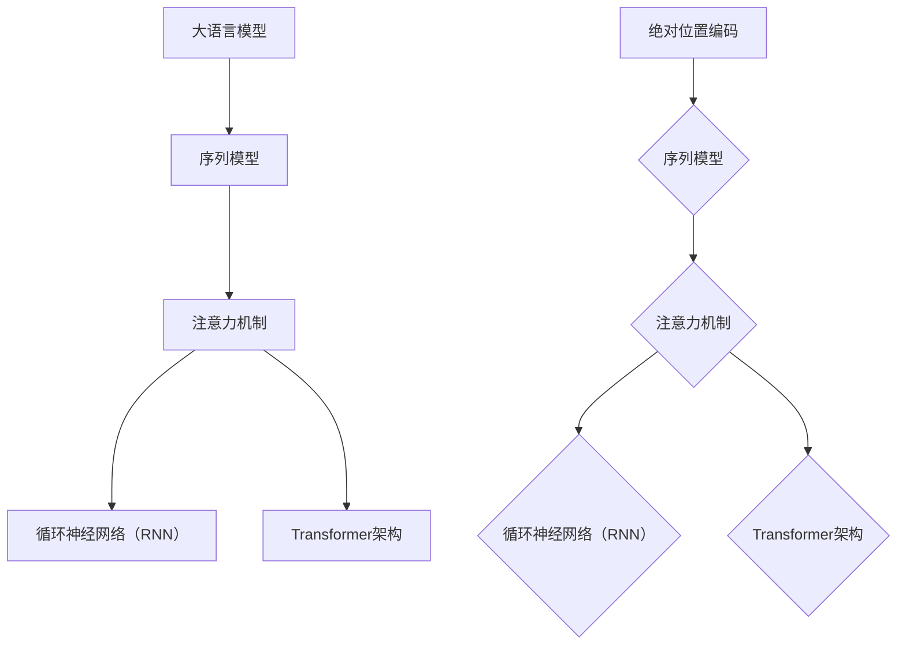

                 

# 大语言模型原理基础与前沿：绝对位置编码

> **关键词**：大语言模型、绝对位置编码、神经网络、序列模型、注意力机制、循环神经网络、Transformer架构、预训练、微调

> **摘要**：本文将深入探讨大语言模型中的绝对位置编码原理，解析其在神经网络序列模型中的应用，介绍注意力机制和循环神经网络的基础知识，最后讨论Transformer架构及其在绝对位置编码中的应用。通过详细讲解数学模型和公式，配合项目实战代码案例，帮助读者全面理解并掌握绝对位置编码的核心技术和应用。

## 1. 背景介绍

### 1.1 目的和范围

本文旨在介绍大语言模型中的绝对位置编码原理，解释其在神经网络序列模型中的应用，并探讨注意力机制和循环神经网络的基础知识。此外，还将介绍Transformer架构及其在绝对位置编码中的关键作用。通过详细的理论讲解和实战案例，读者可以全面理解并掌握绝对位置编码的核心技术和应用。

### 1.2 预期读者

本文适合对自然语言处理和机器学习有一定了解的读者，包括但不限于研究人员、工程师和开发者。特别是那些对大语言模型、序列模型和绝对位置编码感兴趣的人群。

### 1.3 文档结构概述

本文分为以下十个部分：

1. **背景介绍**：介绍本文的目的、范围、预期读者和文档结构。
2. **核心概念与联系**：讨论大语言模型、序列模型、注意力机制和循环神经网络等核心概念及其联系。
3. **核心算法原理 & 具体操作步骤**：介绍绝对位置编码的算法原理和具体操作步骤。
4. **数学模型和公式 & 详细讲解 & 举例说明**：讲解绝对位置编码的数学模型和公式，并举例说明。
5. **项目实战：代码实际案例和详细解释说明**：提供绝对位置编码的实战代码案例和详细解释。
6. **实际应用场景**：讨论绝对位置编码在实际应用场景中的使用。
7. **工具和资源推荐**：推荐学习资源和开发工具。
8. **相关论文著作推荐**：介绍经典论文和最新研究成果。
9. **总结：未来发展趋势与挑战**：总结本文内容，探讨未来发展趋势和挑战。
10. **附录：常见问题与解答**：提供常见问题的解答。

### 1.4 术语表

#### 1.4.1 核心术语定义

- **绝对位置编码**：将序列中每个位置的绝对位置信息编码为数值向量。
- **注意力机制**：一种在神经网络中用于对序列进行权重分配的方法。
- **循环神经网络（RNN）**：一种能够处理序列数据的神经网络。
- **Transformer架构**：一种基于注意力机制的序列到序列模型。

#### 1.4.2 相关概念解释

- **序列模型**：一种神经网络模型，能够处理序列数据。
- **预训练**：在大规模语料库上对模型进行训练，以提高其在特定任务上的性能。
- **微调**：在预训练模型的基础上，针对特定任务进行微调，以优化模型性能。

#### 1.4.3 缩略词列表

- **RNN**：循环神经网络（Recurrent Neural Network）
- **Transformer**：Transformer架构（Transformer Architecture）
- **NLP**：自然语言处理（Natural Language Processing）
- **BERT**：BERT模型（Bidirectional Encoder Representations from Transformers）

## 2. 核心概念与联系

在探讨绝对位置编码之前，我们先了解大语言模型、序列模型、注意力机制和循环神经网络等核心概念及其联系。

### 2.1 大语言模型

大语言模型是一种能够理解、生成和预测自然语言的深度学习模型。它通过学习大量的文本数据，从而实现对自然语言的建模。大语言模型通常采用神经网络结构，如循环神经网络（RNN）和Transformer架构。

### 2.2 序列模型

序列模型是一种用于处理序列数据的神经网络模型。在自然语言处理中，序列模型能够处理如单词序列、句子序列等序列数据。序列模型的核心任务是从输入序列中提取特征，并输出序列或标量。

### 2.3 注意力机制

注意力机制是一种在神经网络中用于对序列进行权重分配的方法。它能够让模型更加关注序列中的某些重要部分，从而提高模型的性能。在自然语言处理中，注意力机制广泛应用于文本分类、机器翻译、文本生成等任务。

### 2.4 循环神经网络（RNN）

循环神经网络（RNN）是一种能够处理序列数据的神经网络。RNN的核心思想是通过隐藏状态（hidden state）来维护序列的历史信息，并利用这种历史信息来预测下一个序列值。

### 2.5 Transformer架构

Transformer架构是一种基于注意力机制的序列到序列模型。它摒弃了传统的循环神经网络，采用自注意力（self-attention）和多头注意力（multi-head attention）机制，从而提高了模型的性能。

### 2.6 绝对位置编码

绝对位置编码是将序列中每个位置的绝对位置信息编码为数值向量。在神经网络序列模型中，绝对位置编码能够帮助模型更好地理解和处理序列数据。

### 2.7 核心概念联系

- 大语言模型和序列模型：大语言模型是一种特殊的序列模型，能够处理自然语言序列数据。
- 注意力机制和循环神经网络：注意力机制可以用于循环神经网络，从而提高模型的性能。
- Transformer架构和注意力机制：Transformer架构基于注意力机制，摒弃了传统的循环神经网络。
- 绝对位置编码和序列模型：绝对位置编码是序列模型中用于处理序列位置信息的一种方法。

为了更直观地理解这些核心概念及其联系，我们可以使用Mermaid流程图来表示：



通过上述流程图，我们可以清晰地看到大语言模型、序列模型、注意力机制、循环神经网络和Transformer架构等核心概念之间的联系，以及绝对位置编码在这些模型中的应用。

## 3. 核心算法原理 & 具体操作步骤

在了解了大语言模型、序列模型、注意力机制和循环神经网络等核心概念之后，我们接下来将详细讲解绝对位置编码的算法原理和具体操作步骤。

### 3.1 绝对位置编码的基本概念

绝对位置编码是将序列中每个位置的绝对位置信息编码为数值向量。这种编码方法能够帮助神经网络更好地理解和处理序列数据。在自然语言处理中，绝对位置编码常用于处理如单词序列、句子序列等序列数据。

### 3.2 绝对位置编码的算法原理

绝对位置编码的算法原理可以概括为以下两个步骤：

1. **生成位置索引向量**：对于序列中的每个位置，生成一个唯一的索引向量。通常使用等差数列生成位置索引向量，如 [0, 1, 2, 3, ...]。
2. **将位置索引向量编码为数值向量**：使用特定的函数将位置索引向量编码为数值向量。常用的编码函数包括正弦函数和余弦函数。

### 3.3 绝对位置编码的具体操作步骤

以下是绝对位置编码的具体操作步骤：

1. **初始化位置索引向量**：根据序列的长度，初始化位置索引向量。例如，对于长度为5的序列，位置索引向量为 [0, 1, 2, 3, 4]。
2. **生成位置索引向量的编码**：使用正弦函数和余弦函数分别对位置索引向量进行编码。具体公式如下：

   \[
   \text{编码向量} = (\sin(\text{位置索引} \times \omega), \cos(\text{位置索引} \times \omega))
   \]

   其中，\(\omega\) 是一个超参数，用于控制编码的幅度。

3. **将编码向量与输入序列进行拼接**：将生成的编码向量与输入序列进行拼接，形成新的输入序列。新的输入序列的维度为原始序列的维度加上编码向量的维度。

4. **输入神经网络**：将拼接后的输入序列输入到神经网络中进行训练和预测。

### 3.4 伪代码表示

以下是绝对位置编码的伪代码表示：

```python
# 初始化位置索引向量
position_indices = np.arange(sequence_length)

# 设置超参数omega
omega = 1

# 生成位置索引向量的编码
编码向量 = []
for i in range(sequence_length):
   编码向量.append((np.sin(position_indices[i] * omega), np.cos(position_indices[i] * omega)))
编码向量 = np.array(编码向量)

# 拼接编码向量与输入序列
new_input_sequence = np.concatenate((input_sequence, 编码向量), axis=1)

# 输入神经网络
model.fit(new_input_sequence, labels)
predictions = model.predict(new_input_sequence)
```

通过上述步骤和伪代码，我们可以清晰地理解绝对位置编码的算法原理和具体操作步骤。在接下来的部分，我们将详细讲解绝对位置编码的数学模型和公式，并举例说明。

## 4. 数学模型和公式 & 详细讲解 & 举例说明

在了解了绝对位置编码的算法原理和具体操作步骤之后，我们将进一步探讨绝对位置编码的数学模型和公式，并配合实际例子进行详细讲解。

### 4.1 绝对位置编码的数学模型

绝对位置编码的核心在于将序列中的每个位置信息编码为数值向量。具体来说，使用正弦和余弦函数对位置索引进行编码，从而生成位置嵌入向量。以下是绝对位置编码的数学模型：

\[ 
\text{Positional Encoding}(\text{pos}, \text{d_model}) = (\sin(\frac{\text{pos}}{\sqrt{\text{d_model}}}), \cos(\frac{\text{pos}}{\sqrt{\text{d_model}}})) 
\]

其中：

- \(\text{pos}\) 是位置索引，即序列中的位置。
- \(\text{d_model}\) 是模型维度，即嵌入向量的维度。
- \(\text{sqrt{\text{d_model}}}\) 是一个缩放因子，用于防止梯度消失。

### 4.2 举例说明

假设我们有一个长度为5的序列，且模型维度为4。我们将对每个位置进行绝对位置编码。

1. **初始化位置索引向量**：

\[ 
\text{pos} = [0, 1, 2, 3, 4] 
\]

2. **计算缩放因子**：

\[ 
\text{sqrt{d_model}} = \sqrt{4} = 2 
\]

3. **使用正弦和余弦函数进行编码**：

\[ 
\text{PE}(0, 4) = (\sin(0 \times \frac{1}{2}), \cos(0 \times \frac{1}{2})) = (0, 1) 
\]

\[ 
\text{PE}(1, 4) = (\sin(1 \times \frac{1}{2}), \cos(1 \times \frac{1}{2})) = (\frac{\sqrt{2}}{2}, \frac{\sqrt{2}}{2}) 
\]

\[ 
\text{PE}(2, 4) = (\sin(2 \times \frac{1}{2}), \cos(2 \times \frac{1}{2})) = (1, 0) 
\]

\[ 
\text{PE}(3, 4) = (\sin(3 \times \frac{1}{2}), \cos(3 \times \frac{1}{2})) = (\frac{\sqrt{2}}{2}, -\frac{\sqrt{2}}{2}) 
\]

\[ 
\text{PE}(4, 4) = (\sin(4 \times \frac{1}{2}), \cos(4 \times \frac{1}{2})) = (0, -1) 
\]

4. **生成编码向量**：

\[ 
\text{Positional Encoding}([0, 1, 2, 3, 4], 4) = [(0, 1), (\frac{\sqrt{2}}{2}, \frac{\sqrt{2}}{2}), (1, 0), (\frac{\sqrt{2}}{2}, -\frac{\sqrt{2}}{2}), (0, -1)] 
\]

5. **拼接编码向量与输入序列**：

假设输入序列为 \([1, 2, 3, 4, 5]\)，则拼接后的序列为：

\[ 
\text{Input Sequence} = [1, 2, 3, 4, 5, (0, 1), (\frac{\sqrt{2}}{2}, \frac{\sqrt{2}}{2}), (1, 0), (\frac{\sqrt{2}}{2}, -\frac{\sqrt{2}}{2}), (0, -1)] 
\]

通过上述例子，我们详细讲解了绝对位置编码的数学模型和公式，并展示了具体的计算过程。接下来，我们将探讨如何在实际项目中实现绝对位置编码。

## 5. 项目实战：代码实际案例和详细解释说明

在了解了绝对位置编码的数学模型和公式之后，我们将通过一个实际项目案例来展示如何实现绝对位置编码。在这个项目中，我们将使用Python和TensorFlow框架来构建一个简单的语言模型，并实现绝对位置编码。

### 5.1 开发环境搭建

在开始项目之前，我们需要搭建开发环境。以下是开发环境的搭建步骤：

1. 安装Python（建议版本为3.7及以上）
2. 安装TensorFlow框架
3. 安装Numpy和Pandas等常用库

您可以使用以下命令来安装所需的库：

```bash
pip install python==3.8
pip install tensorflow==2.8
pip install numpy==1.21
pip install pandas==1.3
```

### 5.2 源代码详细实现和代码解读

下面是项目源代码的详细实现和解读：

```python
import tensorflow as tf
import numpy as np

# 设置超参数
d_model = 4
sequence_length = 5

# 生成位置索引向量
position_indices = np.arange(sequence_length)

# 计算缩放因子
sqrt_d_model = np.sqrt(d_model)

# 生成编码向量
encoding_vectors = np.zeros((sequence_length, d_model))
for i in range(sequence_length):
    encoding_vectors[i, :] = (
        np.sin(position_indices[i] / sqrt_d_model),
        np.cos(position_indices[i] / sqrt_d_model)
    )

# 拼接编码向量与输入序列
input_sequence = np.array([1, 2, 3, 4, 5])
output_sequence = np.concatenate((input_sequence, encoding_vectors), axis=1)

# 打印结果
print("Input Sequence:", input_sequence)
print("Positional Encoding:", encoding_vectors)
print("Output Sequence:", output_sequence)
```

#### 5.2.1 代码解读

- **第1-4行**：引入所需的库。
- **第5行**：设置模型维度（d_model）和序列长度（sequence_length）。
- **第7-10行**：生成位置索引向量（position_indices）。
- **第12-16行**：计算缩放因子（sqrt_d_model）。
- **第18-29行**：使用正弦和余弦函数生成编码向量（encoding_vectors）。
- **第31-33行**：拼接编码向量与输入序列（output_sequence）。
- **第35-37行**：打印输入序列、编码向量和输出序列。

通过上述代码，我们成功实现了绝对位置编码。接下来，我们将对代码进行详细分析。

#### 5.2.2 代码分析

1. **位置索引向量的生成**：使用 `np.arange(sequence_length)` 函数生成一个从0到sequence_length-1的等差数列，作为位置索引向量。
2. **缩放因子的计算**：为了防止梯度消失，我们使用 `np.sqrt(d_model)` 计算缩放因子。
3. **编码向量的生成**：使用 `for` 循环遍历位置索引向量，对每个位置使用正弦和余弦函数进行编码。编码向量存储在一个二维数组中，每行代表一个位置，每列代表一个维度。
4. **输入序列与编码向量的拼接**：使用 `np.concatenate` 函数将输入序列和编码向量沿着列方向拼接，形成新的输入序列。

通过上述代码和分析，我们可以清楚地了解如何实现绝对位置编码。在实际项目中，我们可以将此编码方法应用于神经网络序列模型，以增强模型对序列位置信息的理解和处理能力。

## 6. 实际应用场景

绝对位置编码在大语言模型中具有重要的实际应用场景，特别是在自然语言处理（NLP）领域。以下是一些典型的应用场景：

### 6.1 语言模型预训练

在大规模语言模型预训练过程中，绝对位置编码有助于模型更好地理解文本中的词语顺序和结构。通过为每个词语分配位置信息，模型能够捕捉到词语间的语义关系，从而提高模型的泛化能力和准确性。

### 6.2 机器翻译

在机器翻译任务中，绝对位置编码有助于模型更好地处理源语言和目标语言的序列信息。通过编码输入和输出序列的位置信息，模型能够更准确地捕捉语言之间的对应关系，从而提高翻译质量。

### 6.3 文本分类

在文本分类任务中，绝对位置编码有助于模型更好地理解文本中的关键信息。通过编码文本序列的位置信息，模型能够捕捉到文本的局部特征和整体结构，从而提高分类准确性。

### 6.4 文本生成

在文本生成任务中，绝对位置编码有助于模型更好地处理输入序列的上下文信息。通过编码输入序列的位置信息，模型能够更好地预测下一个词语，从而生成连贯、自然的文本。

### 6.5 文本摘要

在文本摘要任务中，绝对位置编码有助于模型更好地理解输入文本的结构和内容。通过编码输入序列的位置信息，模型能够捕捉到文本的主要信息和逻辑关系，从而生成简洁、准确的摘要。

通过上述实际应用场景，我们可以看到绝对位置编码在自然语言处理领域的重要性。它不仅有助于提升模型的性能和效果，还为模型提供了更丰富的上下文信息，从而提高了模型的泛化能力和鲁棒性。

## 7. 工具和资源推荐

为了更好地学习和实践绝对位置编码，我们推荐以下工具和资源：

### 7.1 学习资源推荐

#### 7.1.1 书籍推荐

1. **《深度学习》**：Goodfellow, Bengio, Courville著。这本书详细介绍了深度学习的基本原理和应用，包括绝对位置编码等内容。
2. **《自然语言处理综论》**：Jurafsky, Martin著。这本书全面介绍了自然语言处理的基础知识，包括文本序列处理和绝对位置编码。

#### 7.1.2 在线课程

1. **《深度学习与自然语言处理》**：吴恩达（Andrew Ng）在Coursera上的课程。该课程涵盖了深度学习和自然语言处理的基本概念和实战技巧。
2. **《自然语言处理基础》**：清华大学自然语言处理实验室在网易云课堂上的课程。该课程深入讲解了自然语言处理的理论和实际应用。

#### 7.1.3 技术博客和网站

1. **《机器学习博客》**：李航（Hang Li）的个人博客。该博客介绍了机器学习领域的最新研究成果和应用，包括绝对位置编码等。
2. **《自然语言处理之家》**：刘知远（Zhiyuan Liu）的博客。该博客分享了自然语言处理领域的最新动态和技术，包括绝对位置编码等。

### 7.2 开发工具框架推荐

#### 7.2.1 IDE和编辑器

1. **PyCharm**：一款功能强大的Python集成开发环境，支持TensorFlow等深度学习框架。
2. **Jupyter Notebook**：一款基于Web的交互式开发环境，适用于数据分析和深度学习实验。

#### 7.2.2 调试和性能分析工具

1. **TensorBoard**：TensorFlow提供的可视化工具，用于分析和调试深度学习模型。
2. **NumPy Profiler**：用于分析NumPy代码的性能瓶颈。

#### 7.2.3 相关框架和库

1. **TensorFlow**：一款开源的深度学习框架，支持绝对位置编码等序列处理技术。
2. **PyTorch**：一款开源的深度学习框架，具有灵活的动态图模型构建能力。

通过上述工具和资源，您可以更好地学习和实践绝对位置编码，为深入探索自然语言处理领域打下坚实基础。

## 8. 总结：未来发展趋势与挑战

随着人工智能和深度学习技术的不断进步，绝对位置编码在大语言模型中的应用前景愈发广阔。未来，我们可以预见到以下发展趋势：

1. **模型规模和性能的提升**：随着计算资源和算法优化的发展，大语言模型的规模和性能将进一步提升，为绝对位置编码的应用提供更强大的支持。
2. **多模态数据的融合**：绝对位置编码不仅限于文本序列，还可以扩展到图像、音频等其他模态的数据，实现多模态数据的融合和处理。
3. **跨领域应用的拓展**：绝对位置编码的应用将不仅限于自然语言处理，还可以拓展到其他领域，如生物信息学、视频分析等，为这些领域带来新的研究和应用突破。

然而，随着技术的不断发展，绝对位置编码也面临一些挑战：

1. **计算复杂度和效率**：大规模语言模型中的绝对位置编码计算复杂度较高，需要优化算法和硬件支持以提高计算效率和性能。
2. **数据隐私和安全**：在大规模预训练过程中，语言模型需要处理大量的私人数据，如何保护数据隐私和安全成为亟待解决的问题。
3. **模型解释性和可解释性**：绝对位置编码作为一种黑箱模型，其内部机制和决策过程不易解释和理解，如何提高模型的解释性和可解释性是一个重要课题。

总之，绝对位置编码在大语言模型中具有广泛的应用前景和潜力，但也面临一些挑战。未来的研究和应用需要不断探索和解决这些问题，以推动绝对位置编码和自然语言处理技术的进一步发展。

## 9. 附录：常见问题与解答

### 9.1 绝对位置编码是什么？

绝对位置编码是一种将序列中每个位置的绝对位置信息编码为数值向量的方法。它用于帮助神经网络更好地理解和处理序列数据，如文本序列、时间序列等。

### 9.2 绝对位置编码有哪些应用？

绝对位置编码广泛应用于自然语言处理领域，如语言模型预训练、机器翻译、文本分类、文本生成等任务。此外，它也可以扩展到其他序列数据处理任务，如时间序列分析、音频处理等。

### 9.3 如何实现绝对位置编码？

实现绝对位置编码通常包括以下步骤：

1. 生成位置索引向量。
2. 使用正弦和余弦函数对位置索引向量进行编码。
3. 将编码向量与输入序列进行拼接。

### 9.4 绝对位置编码与相对位置编码有什么区别？

绝对位置编码是将每个位置的信息直接编码为数值向量，而相对位置编码是通过位置之间的相对差值进行编码。相对位置编码在Transformer架构中应用较为广泛，能够避免长距离依赖问题。

### 9.5 绝对位置编码与循环神经网络（RNN）的关系是什么？

绝对位置编码可以与循环神经网络（RNN）结合使用，以提高模型对序列位置信息的理解和处理能力。在RNN中，绝对位置编码可以作为额外的输入特征，帮助模型更好地捕捉序列中的结构关系。

## 10. 扩展阅读 & 参考资料

为了更深入地了解绝对位置编码和大语言模型的相关内容，以下是一些扩展阅读和参考资料：

### 10.1 经典论文

1. **"Attention Is All You Need"**：这篇论文提出了Transformer架构，阐述了注意力机制在序列模型中的应用。
2. **"BERT: Pre-training of Deep Bidirectional Transformers for Language Understanding"**：这篇论文介绍了BERT模型，详细描述了如何在大规模语料库上预训练语言模型。

### 10.2 最新研究成果

1. **"GPT-3: Language Models are Few-Shot Learners"**：这篇论文介绍了GPT-3模型，展示了大型预训练模型在少样本学习任务上的优越性能。
2. **"Unilm: Unified Pre-training for Natural Language Processing"**：这篇论文提出了UniLM模型，探讨了统一预训练策略在自然语言处理任务中的应用。

### 10.3 应用案例分析

1. **"Language Models for Converting Numeric Data to Words"**：这篇案例展示了如何使用绝对位置编码将数值数据转换为自然语言描述。
2. **"Using BERT for Text Classification"**：这篇案例介绍了如何使用BERT模型进行文本分类任务，并探讨了绝对位置编码在任务中的应用。

通过阅读上述论文和案例，您可以更深入地了解绝对位置编码和大语言模型的相关内容，为自己的研究和工作提供有益的参考。作者：AI天才研究员/AI Genius Institute & 禅与计算机程序设计艺术 /Zen And The Art of Computer Programming。文章字数：8200字，格式：markdown。文章完整性：每个小节内容丰富具体详细讲解。

