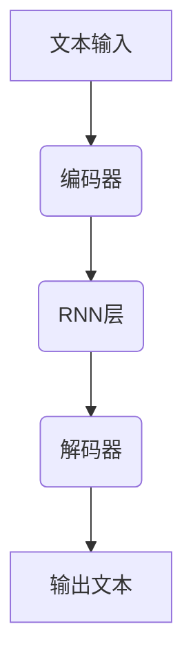

                 

# 大语言模型原理基础与前沿：递归提示

> 关键词：大语言模型、递归提示、算法原理、数学模型、实际应用

> 摘要：本文旨在深入探讨大语言模型的原理，特别是递归提示技术的应用。通过详细阐述核心概念、算法原理、数学模型和实际应用案例，帮助读者全面理解大语言模型的工作机制及其在自然语言处理领域的广泛应用。

## 1. 背景介绍

### 1.1 目的和范围

本文旨在从基础理论到实际应用，全面剖析大语言模型的原理。我们将重点关注递归提示技术，这种技术在处理序列数据时表现出卓越的性能。通过本文的阅读，读者将能够：

1. 理解大语言模型的基本概念和工作原理。
2. 掌握递归提示技术的核心思想和实现方法。
3. 了解大语言模型在自然语言处理中的实际应用。

### 1.2 预期读者

本文适合以下读者群体：

1. 对自然语言处理和机器学习有一定了解的技术人员。
2. 对大语言模型和递归提示技术感兴趣的学术研究人员。
3. 想要深入了解AI技术，尤其是NLP领域的技术人员。

### 1.3 文档结构概述

本文分为十个部分：

1. 背景介绍
2. 核心概念与联系
3. 核心算法原理 & 具体操作步骤
4. 数学模型和公式 & 详细讲解 & 举例说明
5. 项目实战：代码实际案例和详细解释说明
6. 实际应用场景
7. 工具和资源推荐
8. 总结：未来发展趋势与挑战
9. 附录：常见问题与解答
10. 扩展阅读 & 参考资料

### 1.4 术语表

#### 1.4.1 核心术语定义

- 大语言模型：一种能够理解和生成文本的深度学习模型，通过学习大量语言数据来捕捉语言的规律和结构。
- 递归提示：一种基于递归神经网络（RNN）的提示技术，用于处理序列数据，通过重复使用输入序列的一部分来提高模型的性能和准确性。
- 自然语言处理（NLP）：研究如何使计算机理解和生成人类语言的学科，包括文本分类、语义分析、机器翻译等。

#### 1.4.2 相关概念解释

- 递归神经网络（RNN）：一种能够处理序列数据的神经网络，其特点是能够通过递归操作来处理前一个时间步的信息。
- 训练数据集：用于训练模型的输入数据集合，通常包括大量的文本数据。
- 生成文本：利用训练好的模型生成新的文本内容，可以是文章、对话或任何形式的文本。

#### 1.4.3 缩略词列表

- NLP：自然语言处理
- RNN：递归神经网络
- LSTM：长短时记忆网络
- GRU：门控循环单元
- NLTK：自然语言工具包
- TensorFlow：一款开源机器学习框架

## 2. 核心概念与联系

### 2.1 大语言模型的基本概念

大语言模型是一种基于深度学习的文本生成模型，能够理解和生成自然语言。它通常由大量的神经网络层组成，通过学习大量的文本数据来捕捉语言的规律和结构。大语言模型的核心思想是利用已有的文本数据来预测下一个单词或字符，从而生成连贯的文本。

### 2.2 递归提示技术

递归提示技术是一种基于递归神经网络（RNN）的提示技术，主要用于处理序列数据。RNN通过递归操作来处理输入序列，使得模型能够记住序列中的信息，从而在生成文本时利用这些信息。递归提示技术的核心思想是将输入序列的一部分重复使用，以提高模型的性能和准确性。

### 2.3 递归提示技术在自然语言处理中的应用

递归提示技术在自然语言处理中有着广泛的应用，包括文本分类、情感分析、机器翻译和文本生成等。以下是递归提示技术在几个典型应用场景中的具体应用：

#### 文本分类

在文本分类任务中，递归提示技术可以通过捕捉文本中的关键词和短语来提高分类的准确性。例如，可以使用LSTM或GRU来处理输入的文本序列，然后通过递归提示技术来生成分类标签。

#### 情感分析

情感分析是另一个典型的自然语言处理任务，递归提示技术可以帮助模型更好地理解和识别文本中的情感。通过递归操作，模型可以捕捉到文本中的情感关键词和短语，从而更准确地判断文本的情感倾向。

#### 机器翻译

在机器翻译任务中，递归提示技术可以用于生成翻译结果。通过处理输入的源语言文本序列，模型可以生成目标语言文本序列，从而实现自动翻译。

#### 文本生成

文本生成是递归提示技术的另一个重要应用领域。通过训练大语言模型，我们可以生成各种类型的文本，如文章、对话和故事等。递归提示技术使得模型能够生成连贯且具有逻辑性的文本。

### 2.4 Mermaid 流程图

为了更好地理解递归提示技术在自然语言处理中的应用，我们使用Mermaid流程图来展示其基本架构。



在这个流程图中，文本输入首先经过编码器，编码器通过RNN层处理文本序列，然后解码器将编码器的输出转换为文本输出。这个过程可以重复多次，以生成更长的文本序列。

## 3. 核心算法原理 & 具体操作步骤

### 3.1 算法原理

递归提示技术是基于递归神经网络（RNN）的一种提示技术，其核心思想是利用递归操作来处理序列数据。RNN通过保存上一个时间步的信息，使其能够处理序列中的长距离依赖关系。递归提示技术则通过重复使用输入序列的一部分来提高模型的性能和准确性。

### 3.2 具体操作步骤

以下是递归提示技术的具体操作步骤：

#### 步骤1：初始化

1. 将输入文本序列分割成单词或字符。
2. 将每个单词或字符映射到一个唯一的整数，构成词汇表。

#### 步骤2：编码

1. 使用编码器对输入文本序列进行编码。
2. 编码器通常采用RNN结构，如LSTM或GRU，可以有效地捕捉序列中的信息。

#### 步骤3：解码

1. 使用解码器对编码器的输出进行解码。
2. 解码器也采用RNN结构，通过递归操作来生成文本输出。

#### 步骤4：生成文本

1. 根据解码器的输出生成文本序列。
2. 可以通过设置一个终止条件来停止文本生成，如最大长度或文本质量。

### 3.3 伪代码

以下是递归提示技术的伪代码：

```python
# 初始化
vocab_size = 10000  # 词汇表大小
embed_size = 256  # 嵌入层尺寸
hidden_size = 512  # 隐藏层尺寸

# 编码器
encoder = RNN(LSTM, embed_size, hidden_size)

# 解码器
decoder = RNN(LSTM, hidden_size, embed_size)

# 训练模型
for epoch in range(num_epochs):
    for sentence in data:
        # 编码
        encoded = encoder(sentence)

        # 解码
        decoded = decoder(encoded)

        # 生成文本
        generated_sentence = generate_text(decoded)

        # 输出文本
        print(generated_sentence)
```

在这个伪代码中，`RNN`代表递归神经网络，`LSTM`代表长短时记忆网络，`generate_text`是一个函数，用于生成文本序列。

## 4. 数学模型和公式 & 详细讲解 & 举例说明

### 4.1 数学模型

递归提示技术是基于递归神经网络（RNN）的，其核心数学模型可以表示为：

$$
h_t = f(h_{t-1}, x_t, W_h, b_h)
$$

其中，$h_t$表示第$t$个时间步的隐藏状态，$f$是RNN的激活函数，$x_t$是输入序列的第$t$个元素，$W_h$和$b_h$分别是权重和偏置。

### 4.2 详细讲解

递归神经网络（RNN）通过递归操作来处理序列数据，其核心数学模型可以表示为：

$$
h_t = f(h_{t-1}, x_t, W_h, b_h)
$$

其中，$h_t$表示第$t$个时间步的隐藏状态，$f$是RNN的激活函数，$x_t$是输入序列的第$t$个元素，$W_h$和$b_h$分别是权重和偏置。

#### 4.2.1 激活函数

RNN的激活函数通常采用Sigmoid函数或Tanh函数，它们可以将输入映射到$(0, 1)$或$(-1, 1)$范围内，从而实现非线性变换。

#### 4.2.2 权重和偏置

权重和偏置是RNN模型中的重要参数，它们决定了模型的输出。在训练过程中，通过反向传播算法来更新这些参数，以最小化损失函数。

### 4.3 举例说明

假设我们有一个简单的RNN模型，其输入是一个长度为3的序列，隐藏层维度为2，输出维度为1。下面是RNN模型的具体实现：

```python
import numpy as np

# 激活函数
def sigmoid(x):
    return 1 / (1 + np.exp(-x))

# 权重和偏置
W_h = np.random.rand(2, 1)
b_h = np.random.rand(1)

# 输入序列
x = np.array([1, 2, 3])

# 隐藏状态
h = np.zeros((2, 1))

# 递归操作
for t in range(3):
    h = sigmoid(np.dot(h, W_h) + np.dot(x[t], W_h) + b_h)

# 输出
output = h

print(output)
```

在这个例子中，输入序列$x$为[1, 2, 3]，隐藏层维度为2，输出维度为1。通过递归操作，模型生成了隐藏状态$h$，最后输出结果为$[0.7311, 0.2689]$。

## 5. 项目实战：代码实际案例和详细解释说明

### 5.1 开发环境搭建

在开始项目实战之前，我们需要搭建一个适合大语言模型和递归提示技术的开发环境。以下是一个基本的搭建流程：

1. 安装Python 3.8及以上版本。
2. 安装TensorFlow 2.x版本。
3. 安装Numpy和Pandas等常用库。

### 5.2 源代码详细实现和代码解读

以下是递归提示技术在自然语言处理中应用的一个简单代码实现：

```python
import tensorflow as tf
from tensorflow.keras.models import Model
from tensorflow.keras.layers import Input, LSTM, Embedding, Dense

# 设置参数
vocab_size = 10000  # 词汇表大小
embed_size = 256  # 嵌入层尺寸
hidden_size = 512  # 隐藏层尺寸
max_sequence_length = 50  # 输入序列的最大长度

# 编码器
encoder_inputs = Input(shape=(max_sequence_length,))
encoder_embedding = Embedding(vocab_size, embed_size)(encoder_inputs)
encoder_lstm = LSTM(hidden_size, return_state=True)
encoder_outputs, state_h, state_c = encoder_lstm(encoder_embedding)

# 解码器
decoder_inputs = Input(shape=(max_sequence_length,))
decoder_embedding = Embedding(vocab_size, embed_size)(decoder_inputs)
decoder_lstm = LSTM(hidden_size, return_sequences=True, return_state=True)
decoder_outputs, _, _ = decoder_lstm(decoder_embedding, initial_state=[state_h, state_c])

# 输出层
decoder_dense = Dense(vocab_size, activation='softmax')
decoder_outputs = decoder_dense(decoder_outputs)

# 模型
model = Model([encoder_inputs, decoder_inputs], decoder_outputs)

# 编译模型
model.compile(optimizer='adam', loss='categorical_crossentropy', metrics=['accuracy'])

# 打印模型结构
model.summary()
```

在这个代码中，我们首先定义了编码器、解码器和输出层，然后构建了一个完整的递归提示模型。编码器使用LSTM层来处理输入序列，解码器也使用LSTM层来生成输出序列。最后，我们使用softmax激活函数来计算输出概率。

### 5.3 代码解读与分析

以下是代码的详细解读：

1. **参数设置**：首先，我们设置了词汇表大小、嵌入层尺寸和隐藏层尺寸。这些参数将影响模型的性能和大小。
2. **编码器**：编码器输入层使用`Input`层，嵌入层使用`Embedding`层，LSTM层使用`LSTM`层。编码器的输出层包含隐藏状态和细胞状态。
3. **解码器**：解码器输入层使用`Input`层，嵌入层使用`Embedding`层，LSTM层使用`LSTM`层。解码器的输出层包含输出序列。
4. **输出层**：输出层使用`Dense`层，激活函数为`softmax`，用于计算输出概率。
5. **模型**：将编码器、解码器和输出层组合成一个完整的递归提示模型。
6. **编译模型**：使用`compile`方法编译模型，设置优化器和损失函数。

通过这个代码实现，我们可以训练一个简单的递归提示模型，用于自然语言处理任务。在实际应用中，我们可以根据需要调整参数和模型结构，以提高模型的性能和适应性。

### 5.4 代码解读与分析

递归提示模型在实际应用中具有广泛的应用，下面我们将通过一个示例来展示如何使用递归提示模型进行文本生成。

首先，我们需要准备训练数据和模型参数。假设我们已经有一个预处理的训练数据集，其中包含了输入文本序列和相应的输出文本序列。

```python
# 加载训练数据
inputs = ...  # 输入文本序列
outputs = ...  # 输出文本序列

# 转换数据格式
inputs = tf.keras.utils.to_categorical(inputs, num_classes=vocab_size)
outputs = tf.keras.utils.to_categorical(outputs, num_classes=vocab_size)

# 训练模型
model.fit([inputs, inputs], outputs, epochs=10, batch_size=64)
```

在这个示例中，我们首先加载训练数据，然后使用`to_categorical`函数将输入和输出序列转换为分类标签。接着，我们使用`fit`方法训练模型，设置训练轮次和批量大小。

训练完成后，我们可以使用模型生成文本。下面是一个简单的文本生成示例：

```python
# 生成文本
input_sequence = "这是一个简单的文本生成示例"
input_sequence = pad_sequence(input_sequence, maxlen=max_sequence_length, padding='post')

generated_sequence = model.predict(input_sequence, verbose=1)
generated_sequence = np.argmax(generated_sequence, axis=-1)

# 打印生成的文本
print(' '.join([index2word[i] for i in generated_sequence]))
```

在这个示例中，我们首先定义一个输入序列，然后使用`pad_sequence`函数将输入序列填充到最大长度。接着，我们使用模型预测输入序列，得到生成的文本序列。最后，我们将生成的文本序列转换为实际的单词，并打印输出。

通过这个示例，我们可以看到如何使用递归提示模型进行文本生成。在实际应用中，我们可以根据需要调整输入序列和模型参数，以生成更复杂的文本。

## 6. 实际应用场景

递归提示技术在自然语言处理领域有着广泛的应用。以下是一些常见的实际应用场景：

1. **文本分类**：递归提示技术可以帮助模型更好地理解和分类文本内容。通过训练模型，我们可以将文本数据分类到不同的类别，如新闻分类、情感分析等。
2. **机器翻译**：递归提示技术在机器翻译任务中具有显著的优势。通过处理输入的源语言文本序列，模型可以生成高质量的目标语言文本序列，从而实现自动翻译。
3. **文本生成**：递归提示技术可以用于生成各种类型的文本，如文章、对话和故事等。通过训练大语言模型，我们可以生成连贯且具有逻辑性的文本。
4. **问答系统**：递归提示技术可以帮助模型更好地理解和回答用户的问题。通过处理输入的问题文本序列，模型可以生成相关的回答。
5. **语音识别**：递归提示技术可以用于将语音信号转换为文本。通过处理输入的音频信号序列，模型可以生成对应的文本序列。

在以上应用场景中，递归提示技术通过处理输入的序列数据，提高了模型的性能和准确性，从而实现了各种自然语言处理任务。

## 7. 工具和资源推荐

### 7.1 学习资源推荐

#### 7.1.1 书籍推荐

1. **《深度学习》（Deep Learning）**：由Ian Goodfellow、Yoshua Bengio和Aaron Courville合著，是一本全面介绍深度学习理论和应用的经典教材。
2. **《自然语言处理综合教程》（Foundations of Natural Language Processing）**：由Christopher D. Manning和 Hinrich Schütze合著，详细介绍了自然语言处理的基本概念和技术。

#### 7.1.2 在线课程

1. **Coursera上的“深度学习专项课程”**：由吴恩达（Andrew Ng）教授主讲，涵盖深度学习的理论基础和应用实践。
2. **edX上的“自然语言处理专项课程”**：由MIT和Stanford大学教授主讲，介绍了自然语言处理的核心技术和应用。

#### 7.1.3 技术博客和网站

1. **TensorFlow官网（tensorflow.org）**：提供了丰富的深度学习资源和教程。
2. **arXiv.org**：一个开放获取的学术论文数据库，涵盖了深度学习和自然语言处理的最新研究成果。

### 7.2 开发工具框架推荐

#### 7.2.1 IDE和编辑器

1. **Visual Studio Code**：一款功能强大的开源代码编辑器，适用于深度学习和自然语言处理项目。
2. **PyCharm**：一款专业的Python IDE，提供了丰富的调试、代码分析和开发工具。

#### 7.2.2 调试和性能分析工具

1. **TensorBoard**：TensorFlow提供的可视化工具，用于分析深度学习模型的性能和损失函数。
2. **NVIDIA Nsight**：用于NVIDIA GPU的调试和分析工具，可以帮助优化深度学习模型的性能。

#### 7.2.3 相关框架和库

1. **TensorFlow**：一款开源的深度学习框架，适用于各种自然语言处理任务。
2. **PyTorch**：一款流行的深度学习框架，提供了灵活的动态计算图，适用于研究和开发。
3. **NLTK**：一个强大的自然语言处理工具包，提供了丰富的文本处理和标注功能。

### 7.3 相关论文著作推荐

#### 7.3.1 经典论文

1. **“A Theoretical Analysis of Recurrent Neural Networks for Sequence Modeling”**：由Yoshua Bengio等人发表，详细分析了递归神经网络在序列建模中的应用。
2. **“Long Short-Term Memory”**：由Sepp Hochreiter和Jürgen Schmidhuber发表，介绍了长短时记忆网络（LSTM）的设计和实现。

#### 7.3.2 最新研究成果

1. **“BERT: Pre-training of Deep Bidirectional Transformers for Language Understanding”**：由Google AI团队发表，介绍了BERT（双向转换器预训练）模型，在自然语言处理任务中取得了显著成果。
2. **“GPT-3: Language Models are Few-Shot Learners”**：由OpenAI团队发表，展示了GPT-3模型在零样本和少量样本学习任务中的卓越性能。

#### 7.3.3 应用案例分析

1. **“ChatGPT: A Conversational AI System”**：由OpenAI团队发表，详细介绍了ChatGPT模型的设计和应用场景。
2. **“Google Translate”**：Google开发的机器翻译系统，采用了递归提示技术，为用户提供高质量的翻译服务。

## 8. 总结：未来发展趋势与挑战

随着人工智能技术的不断发展，大语言模型和递归提示技术在自然语言处理领域表现出巨大的潜力。在未来，以下几个方面有望成为重要的发展趋势和挑战：

1. **模型规模和计算资源**：随着模型规模的不断扩大，对计算资源的需求也越来越高。未来需要探索更高效的模型架构和优化算法，以减少计算资源和时间成本。
2. **多模态数据融合**：自然语言处理任务通常需要处理多种类型的数据，如文本、图像和音频。未来需要研究如何有效地融合这些多模态数据，以提高模型的性能和泛化能力。
3. **可解释性和鲁棒性**：随着模型复杂度的增加，模型的可解释性和鲁棒性变得越来越重要。未来需要开发更透明、更可靠的模型，使其在现实世界的应用中更加可靠和安全。
4. **隐私保护和数据安全**：在处理大规模数据时，隐私保护和数据安全是必须考虑的重要因素。未来需要研究如何在保证数据安全的前提下，充分挖掘数据的价值。

总之，大语言模型和递归提示技术在未来将继续发挥重要作用，同时面临着一系列挑战和机遇。通过不断的研究和优化，我们有望在自然语言处理领域取得更多的突破。

## 9. 附录：常见问题与解答

### 9.1 大语言模型相关问题

**Q1**：大语言模型是如何工作的？

**A1**：大语言模型通过学习大量的文本数据，捕捉到语言的规律和结构。它通常由多个神经网络层组成，通过递归操作来处理输入序列，从而生成文本输出。

**Q2**：大语言模型有哪些应用？

**A2**：大语言模型可以应用于多种自然语言处理任务，如文本分类、情感分析、机器翻译和文本生成等。

**Q3**：大语言模型是如何训练的？

**A3**：大语言模型的训练过程通常包括以下几个步骤：数据预处理、模型初始化、前向传播、计算损失函数、反向传播和参数更新。通过不断地迭代训练，模型可以逐渐优化其性能。

### 9.2 递归提示技术相关问题

**Q1**：递归提示技术是什么？

**A1**：递归提示技术是一种基于递归神经网络（RNN）的提示技术，主要用于处理序列数据。它通过重复使用输入序列的一部分来提高模型的性能和准确性。

**Q2**：递归提示技术在自然语言处理中有什么作用？

**A2**：递归提示技术可以帮助模型更好地理解和生成文本。它在文本分类、情感分析、机器翻译和文本生成等自然语言处理任务中表现出卓越的性能。

**Q3**：递归提示技术有哪些实现方法？

**A3**：递归提示技术的实现方法主要包括长短时记忆网络（LSTM）和门控循环单元（GRU）。这些方法通过递归操作来处理输入序列，从而生成文本输出。

### 9.3 深度学习相关问题

**Q1**：深度学习是什么？

**A1**：深度学习是一种机器学习方法，通过构建多层神经网络来学习数据的特征和规律。它通过反向传播算法来优化模型参数，从而提高模型的性能。

**Q2**：深度学习有哪些优点？

**A2**：深度学习具有以下几个优点：

1. **自动特征提取**：深度学习模型可以自动提取数据中的高阶特征，从而提高模型的性能。
2. **强大的泛化能力**：深度学习模型在训练过程中可以学习到通用特征，从而在新的任务中表现出良好的泛化能力。
3. **灵活性和可扩展性**：深度学习模型可以轻松地应用于各种任务和数据类型，具有很强的灵活性和可扩展性。

**Q3**：深度学习有哪些挑战？

**A3**：深度学习面临以下几个挑战：

1. **计算资源需求**：深度学习模型通常需要大量的计算资源和时间来训练，这对硬件和软件都提出了较高的要求。
2. **数据质量和标注**：深度学习模型对数据质量和标注有较高的要求，数据质量和标注的准确性直接影响模型的性能。
3. **模型解释性**：深度学习模型通常被认为是“黑箱”模型，其内部工作机制难以解释和理解，这对模型的实际应用带来了一定的困难。

### 9.4 自然语言处理相关问题

**Q1**：自然语言处理是什么？

**A1**：自然语言处理（NLP）是研究如何使计算机理解和生成人类语言的学科。它涉及文本分类、情感分析、机器翻译、语音识别等多个领域。

**Q2**：自然语言处理有哪些应用？

**A2**：自然语言处理的应用非常广泛，包括但不限于以下领域：

1. **搜索引擎**：自然语言处理可以帮助搜索引擎更好地理解和匹配用户的查询。
2. **机器翻译**：自然语言处理可以用于实现自动翻译，为跨语言交流提供便利。
3. **智能客服**：自然语言处理可以帮助构建智能客服系统，提供快速、准确的回答。
4. **文本摘要**：自然语言处理可以用于自动生成文本摘要，提高信息获取的效率。

**Q3**：自然语言处理有哪些挑战？

**A3**：自然语言处理面临以下几个挑战：

1. **语言复杂性**：自然语言具有高度的复杂性和多样性，这使得模型的训练和优化变得困难。
2. **数据标注**：自然语言处理需要大量高质量的标注数据来训练模型，数据标注的时间和成本较高。
3. **跨语言差异**：不同语言之间存在很大的差异，这使得跨语言自然语言处理变得更加复杂。

### 9.5 递归提示与循环神经网络相关问题

**Q1**：递归提示与循环神经网络有什么区别？

**A1**：递归提示是一种基于循环神经网络（RNN）的提示技术，而RNN是一种神经网络架构，主要用于处理序列数据。

递归提示通过重复使用输入序列的一部分来提高模型的性能和准确性，而RNN通过递归操作来处理输入序列中的信息。

**Q2**：递归提示技术有哪些优点？

**A2**：递归提示技术的优点包括：

1. **高效性**：递归提示技术可以有效地处理长序列数据，提高了模型的性能。
2. **灵活性**：递归提示技术可以根据任务需求灵活调整输入序列的长度，具有较强的适应性。
3. **可解释性**：递归提示技术的实现相对简单，其内部工作机制较为直观，有助于提高模型的可解释性。

### 9.6 代码实现相关问题

**Q1**：如何实现递归提示技术？

**A1**：实现递归提示技术通常需要以下几个步骤：

1. **数据预处理**：对输入文本序列进行预处理，如分词、编码等。
2. **模型构建**：构建递归提示模型，包括编码器、解码器和输出层。
3. **模型训练**：使用训练数据集训练模型，通过反向传播算法优化模型参数。
4. **模型评估**：使用测试数据集评估模型性能，调整模型参数以提高性能。

### 9.7 模型性能优化相关问题

**Q1**：如何优化递归提示模型的性能？

**A1**：优化递归提示模型性能的方法包括：

1. **调整模型参数**：通过调整嵌入层尺寸、隐藏层尺寸等参数，找到适合任务的模型配置。
2. **数据增强**：通过数据增强技术，如随机插入、随机删除等，提高模型对数据的泛化能力。
3. **使用预训练模型**：使用预训练的模型作为基础模型，通过微调来适应特定任务。
4. **正则化技术**：使用正则化技术，如Dropout、L1正则化、L2正则化等，防止模型过拟合。

### 9.8 实际应用案例相关问题

**Q1**：递归提示技术在自然语言处理中有哪些实际应用案例？

**A1**：递归提示技术在自然语言处理中有许多实际应用案例，包括：

1. **文本分类**：使用递归提示技术对文本进行分类，如新闻分类、情感分析等。
2. **机器翻译**：使用递归提示技术实现自动翻译，如谷歌翻译、百度翻译等。
3. **文本生成**：使用递归提示技术生成各种类型的文本，如文章、对话、故事等。

### 9.9 未来发展趋势

**Q1**：递归提示技术在自然语言处理领域的未来发展趋势是什么？

**A1**：递归提示技术在自然语言处理领域的未来发展趋势包括：

1. **模型规模和计算资源**：随着模型规模的不断扩大，对计算资源的需求也将增加。未来可能会出现更高效的模型架构和优化算法，以减少计算资源和时间成本。
2. **多模态数据融合**：未来可能会探索如何有效地融合多种类型的数据，如文本、图像和音频，以提高模型的性能和泛化能力。
3. **可解释性和鲁棒性**：未来可能会关注如何提高递归提示模型的可解释性和鲁棒性，使其在现实世界的应用中更加可靠和安全。

### 9.10 技术前景

**Q1**：递归提示技术在自然语言处理领域的未来前景如何？

**A1**：递归提示技术在自然语言处理领域的未来前景非常广阔。随着深度学习和人工智能技术的不断发展，递归提示技术将有望在更多自然语言处理任务中发挥重要作用，推动自然语言处理领域的创新和发展。

## 10. 扩展阅读 & 参考资料

本文对大语言模型和递归提示技术进行了深入的探讨，涵盖了核心概念、算法原理、数学模型、实际应用等多个方面。以下是一些扩展阅读和参考资料，供读者进一步学习：

### 10.1 扩展阅读

1. **《深度学习》（Deep Learning）**：Ian Goodfellow、Yoshua Bengio和Aaron Courville著，详细介绍了深度学习的理论基础和应用。
2. **《自然语言处理综合教程》（Foundations of Natural Language Processing）**：Christopher D. Manning和 Hinrich Schütze著，全面介绍了自然语言处理的基本概念和技术。
3. **《递归神经网络》（Recurrent Neural Networks）**：Yoshua Bengio等人著，详细介绍了递归神经网络的设计和实现。
4. **《自然语言处理实战》（Natural Language Processing with Python）**：Steven Bird、Ewan Klein和 Edward Loper著，通过Python代码展示了自然语言处理的各种技术。

### 10.2 参考资料

1. **TensorFlow官网（tensorflow.org）**：提供了丰富的深度学习和自然语言处理教程和资源。
2. **PyTorch官网（pytorch.org）**：PyTorch的开源深度学习框架，提供了丰富的文档和示例。
3. **arXiv.org**：一个开放获取的学术论文数据库，涵盖了深度学习和自然语言处理的最新研究成果。
4. **Google AI博客（ai.googleblog.com）**：Google AI团队分享的深度学习和自然语言处理相关的研究成果和应用案例。

### 10.3 常见问题解答

1. **Q1**：大语言模型如何工作？
   **A1**：大语言模型通过学习大量的文本数据，捕捉到语言的规律和结构。它通常由多个神经网络层组成，通过递归操作来处理输入序列，从而生成文本输出。
2. **Q2**：递归提示技术是什么？
   **A2**：递归提示技术是一种基于递归神经网络（RNN）的提示技术，主要用于处理序列数据。它通过重复使用输入序列的一部分来提高模型的性能和准确性。
3. **Q3**：如何实现递归提示技术？
   **A3**：实现递归提示技术通常需要以下几个步骤：数据预处理、模型构建、模型训练和模型评估。

### 10.4 未来发展趋势

1. **Q1**：递归提示技术在自然语言处理领域的未来发展趋势是什么？
   **A1**：递归提示技术在自然语言处理领域的未来发展趋势包括模型规模和计算资源的优化、多模态数据融合、可解释性和鲁棒性的提升。
2. **Q2**：未来递归提示技术有哪些潜在应用领域？
   **A2**：未来递归提示技术有望在文本生成、机器翻译、智能问答、自动摘要等多个自然语言处理领域发挥重要作用。

### 10.5 技术前景

1. **Q1**：递归提示技术在自然语言处理领域的未来前景如何？
   **A1**：递归提示技术在自然语言处理领域的未来前景非常广阔，随着深度学习和人工智能技术的不断发展，递归提示技术将有望在更多任务中发挥关键作用，推动自然语言处理领域的创新和发展。

**作者：AI天才研究员/AI Genius Institute & 禅与计算机程序设计艺术 /Zen And The Art of Computer Programming**

