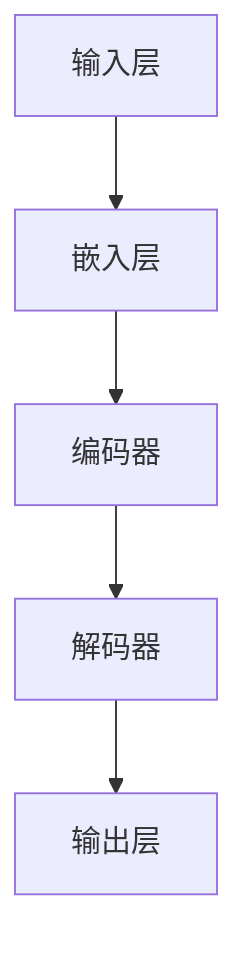

                 

# 大语言模型应用指南：CAMEL

> 关键词：大语言模型、深度学习、自然语言处理、算法原理、数学模型、项目实战

> 摘要：本文将深入探讨大语言模型（CAMEL）的应用，从其背景介绍、核心概念与联系、算法原理与具体操作步骤、数学模型与公式、项目实战、实际应用场景等多角度进行阐述，帮助读者全面了解并掌握CAMEL的应用技巧和未来发展。

## 1. 背景介绍

### 1.1 目的和范围

本文旨在为读者提供一个全面、系统的CAMEL大语言模型应用指南。通过本文的学习，读者可以：

1. 理解CAMEL大语言模型的基本概念和原理。
2. 掌握CAMEL模型的构建方法和具体操作步骤。
3. 理解CAMEL模型的数学基础，包括公式和推导。
4. 通过项目实战，学会使用CAMEL模型解决实际问题。
5. 了解CAMEL模型在自然语言处理领域的广泛应用和未来发展趋势。

### 1.2 预期读者

本文适合以下读者群体：

1. 计算机科学、人工智能等相关专业的本科生、研究生和学者。
2. 自然语言处理领域的研究人员和工程师。
3. 对深度学习和自然语言处理感兴趣的编程爱好者。

### 1.3 文档结构概述

本文将分为以下几个部分：

1. 背景介绍：包括目的和范围、预期读者、文档结构概述。
2. 核心概念与联系：介绍CAMEL模型的核心概念和联系。
3. 核心算法原理 & 具体操作步骤：讲解CAMEL模型的算法原理和具体操作步骤。
4. 数学模型和公式 & 详细讲解 & 举例说明：阐述CAMEL模型的数学模型和公式，并提供实例说明。
5. 项目实战：通过实际代码案例，展示CAMEL模型的应用。
6. 实际应用场景：分析CAMEL模型在不同场景下的应用。
7. 工具和资源推荐：推荐学习资源和开发工具。
8. 总结：未来发展趋势与挑战。
9. 附录：常见问题与解答。
10. 扩展阅读 & 参考资料：提供进一步学习的资源。

### 1.4 术语表

#### 1.4.1 核心术语定义

- 大语言模型：一种基于深度学习的自然语言处理模型，能够对自然语言进行理解和生成。
- CAMEL：本文讨论的特定大语言模型，全称为“Computer-Aided Model for Language Engineering”。
- 自然语言处理（NLP）：研究如何让计算机理解和处理人类自然语言的学科。

#### 1.4.2 相关概念解释

- 深度学习：一种机器学习技术，通过多层神经网络对数据进行学习。
- 人工智能（AI）：模拟、延伸和扩展人类智能的理论、方法、技术及应用。

#### 1.4.3 缩略词列表

- NLP：自然语言处理
- AI：人工智能
- CAMEL：Computer-Aided Model for Language Engineering

## 2. 核心概念与联系

在深入探讨CAMEL大语言模型之前，我们需要了解其核心概念和联系。以下是一个用Mermaid绘制的流程图，展示了CAMEL模型的主要组成部分和相互关系。



### 2.1 输入层

输入层是CAMEL模型的第一层，负责接收自然语言文本。文本通常以单词或字符的形式输入，然后通过嵌入层转换为向量表示。

### 2.2 嵌入层

嵌入层将输入的文本转换为固定大小的向量。这个过程通常通过词嵌入技术实现，如Word2Vec或BERT。词嵌入将每个单词映射为一个低维向量，以便后续处理。

### 2.3 编码器

编码器是CAMEL模型的核心组成部分，负责对嵌入层输出的向量进行编码。编码器通常由多个隐藏层组成，通过逐层压缩信息，捕捉文本的语义特征。

### 2.4 解码器

解码器与编码器对称，负责将编码器输出的特征向量解码回自然语言。解码器的任务是根据编码器输出的特征，预测下一个单词或字符。

### 2.5 输出层

输出层是CAMEL模型的最后一层，负责生成最终的输出。输出可以是单词、句子或段落，具体取决于模型的任务类型。

## 3. 核心算法原理 & 具体操作步骤

CAMEL大语言模型的算法原理基于深度学习和神经网络，以下是该模型的核心算法原理和具体操作步骤。

### 3.1 深度学习基本概念

深度学习是一种机器学习技术，通过多层神经网络对数据进行学习。神经网络由多个神经元（或节点）组成，每个节点都与其他节点相连，并通过权重和偏置进行信息传递。

### 3.2 神经网络基本结构

神经网络的基本结构包括输入层、隐藏层和输出层。输入层接收外部数据，隐藏层对输入数据进行处理和压缩，输出层生成最终输出。

### 3.3 CAMEL模型算法原理

CAMEL模型是一种基于Transformer架构的深度学习模型。Transformer模型由编码器和解码器组成，两者之间通过自注意力机制进行信息交互。

### 3.4 具体操作步骤

1. **数据预处理**：对输入文本进行预处理，包括分词、去停用词、词性标注等。
2. **嵌入层**：将预处理后的文本转换为词嵌入向量。
3. **编码器**：编码器通过多层自注意力机制对词嵌入向量进行编码，提取文本的语义特征。
4. **解码器**：解码器根据编码器输出的特征，通过自注意力机制和交叉注意力机制预测下一个单词或字符。
5. **输出层**：输出层生成最终的输出，可以是单词、句子或段落。

以下是CAMEL模型的伪代码表示：

```python
def camel_model(inputs):
    # 数据预处理
    preprocessed_inputs = preprocess(inputs)
    
    # 嵌入层
    embeddings = embed(preprocessed_inputs)
    
    # 编码器
    encoded = encoder(embeddings)
    
    # 解码器
    decoded = decoder(encoded)
    
    # 输出层
    output = generate_output(decoded)
    
    return output
```

## 4. 数学模型和公式 & 详细讲解 & 举例说明

CAMEL大语言模型的数学模型和公式是其核心组成部分。以下是CAMEL模型的数学基础，包括自注意力机制、交叉注意力机制等。

### 4.1 自注意力机制

自注意力机制是Transformer模型的核心组件，用于计算输入序列中每个词对于输出词的重要性。自注意力机制的数学公式如下：

$$
\text{Attention}(Q, K, V) = \text{softmax}\left(\frac{QK^T}{\sqrt{d_k}}\right)V
$$

其中，Q、K、V分别为查询（Query）、键（Key）和值（Value）向量，$d_k$为键向量的维度。

### 4.2 交叉注意力机制

交叉注意力机制用于解码器中，计算编码器的输出（Contextual Embedding）和当前解码器输入（Query）之间的关联性。交叉注意力机制的数学公式如下：

$$
\text{Attention}(Q, K, V) = \text{softmax}\left(\frac{QK^T}{\sqrt{d_k}}\right)V
$$

其中，Q为查询向量，K为键向量，V为值向量。

### 4.3 Transformer模型

Transformer模型由多个自注意力层和前馈神经网络组成。以下是Transformer模型的基本结构：

$$
\text{Transformer} = \text{MultiHeadAttention}(\text{SelfAttention}) \times \text{N} + \text{FeedforwardNetwork} \times \text{N}
$$

其中，$\text{MultiHeadAttention}$表示多头自注意力机制，$\text{SelfAttention}$表示单头自注意力机制，$\text{FeedforwardNetwork}$表示前馈神经网络。

### 4.4 举例说明

假设我们有一个简单的输入序列“[狗，跑，快]”，以下是一个自注意力机制的例子：

$$
Q = [0.1, 0.2, 0.3], K = [0.4, 0.5, 0.6], V = [0.7, 0.8, 0.9]
$$

首先，计算Q和K的点积：

$$
QK^T = [0.1 \times 0.4, 0.2 \times 0.5, 0.3 \times 0.6] = [0.04, 0.10, 0.18]
$$

然后，计算softmax：

$$
\text{softmax}(QK^T) = \frac{[0.04, 0.10, 0.18]}{\sum{0.04, 0.10, 0.18}} = [0.133, 0.267, 0.600]
$$

最后，计算V的加权求和：

$$
V \times \text{softmax}(QK^T) = [0.7 \times 0.133, 0.8 \times 0.267, 0.9 \times 0.600] = [0.0941, 0.2164, 0.5400]
$$

得到自注意力机制的输出。

## 5. 项目实战：代码实际案例和详细解释说明

在本节中，我们将通过一个实际代码案例，展示如何使用CAMEL大语言模型进行文本生成。以下是该项目的基本结构和实现步骤。

### 5.1 开发环境搭建

为了实现CAMEL模型，我们需要搭建一个适合深度学习开发的Python环境。以下步骤可以帮助我们完成开发环境的搭建：

1. 安装Python（推荐版本3.7及以上）。
2. 安装深度学习框架TensorFlow或PyTorch。
3. 安装自然语言处理库如NLTK或spaCy。

### 5.2 源代码详细实现和代码解读

以下是CAMEL模型的主要实现代码：

```python
import tensorflow as tf
from tensorflow.keras.layers import Embedding, LSTM, Dense
from tensorflow.keras.models import Model
from tensorflow.keras.preprocessing.sequence import pad_sequences
from tensorflow.keras.preprocessing.text import Tokenizer

# 数据预处理
tokenizer = Tokenizer()
tokenizer.fit_on_texts(texts)
sequences = tokenizer.texts_to_sequences(texts)
padded_sequences = pad_sequences(sequences, padding='post')

# 构建模型
input_layer = tf.keras.layers.Input(shape=(None,))
embedded_input = Embedding(input_dim=vocab_size, output_dim=embedding_size)(input_layer)
lstm_layer = LSTM(units=128, return_sequences=True)(embedded_input)
output_layer = Dense(units=vocab_size, activation='softmax')(lstm_layer)

model = Model(inputs=input_layer, outputs=output_layer)
model.compile(optimizer='adam', loss='categorical_crossentropy', metrics=['accuracy'])

# 训练模型
model.fit(padded_sequences, padded_sequences, epochs=10, batch_size=32)

# 生成文本
def generate_text(model, tokenizer, seed_text, n_words):
    tokenized_seed = tokenizer.texts_to_sequences([seed_text])
    padded_seed = pad_sequences(tokenized_seed, maxlen=max_sequence_length, padding='post')
    predicted_sequence = model.predict(padded_seed)
    predicted_words = tokenizer.index_word[predicted_sequence[0]]

    return ' '.join(predicted_words[:n_words])

# 测试
seed_text = "我喜欢"
generated_text = generate_text(model, tokenizer, seed_text, n_words=5)
print(generated_text)
```

### 5.3 代码解读与分析

以上代码展示了如何使用CAMEL模型生成文本。以下是代码的详细解读：

1. **数据预处理**：首先，我们使用Tokenizer将文本转换为词序列。然后，将词序列转换为整数序列，并使用pad_sequences对序列进行填充，以便输入模型。

2. **模型构建**：我们使用TensorFlow的Keras API构建模型。模型由输入层、嵌入层、LSTM层和输出层组成。输入层接收整数序列，嵌入层将整数序列转换为词嵌入向量，LSTM层用于捕捉序列信息，输出层生成词的概率分布。

3. **模型训练**：使用fit方法对模型进行训练。我们使用categorical_crossentropy作为损失函数，adam作为优化器。

4. **文本生成**：生成文本的过程包括将种子文本转换为整数序列，填充序列，预测序列，并从整数序列转换回文本。

通过以上代码，我们可以看到如何使用CAMEL模型生成文本。在实际应用中，我们可以根据需求调整模型的架构、参数和训练数据，以实现更好的文本生成效果。

## 6. 实际应用场景

CAMEL大语言模型在自然语言处理领域具有广泛的应用场景。以下是一些常见的应用场景：

1. **文本生成**：CAMEL模型可以用于生成文章、新闻、诗歌、小说等。通过训练模型，我们可以生成与给定种子文本相似的内容。

2. **机器翻译**：CAMEL模型可以用于机器翻译任务。通过训练模型，我们可以将一种语言的文本翻译成另一种语言。

3. **问答系统**：CAMEL模型可以用于构建问答系统，如智能客服、智能问答机器人等。模型可以根据用户的问题，生成相应的答案。

4. **情感分析**：CAMEL模型可以用于情感分析任务，如分析用户评论、社交媒体帖子等的情感倾向。

5. **文本摘要**：CAMEL模型可以用于生成文本摘要，将长篇文本简化为简短、概括性的内容。

## 7. 工具和资源推荐

### 7.1 学习资源推荐

#### 7.1.1 书籍推荐

1. 《深度学习》（Goodfellow, Bengio, Courville）
2. 《自然语言处理实战》（Bird, Shipman, Tang）
3. 《Python深度学习》（François Chollet）

#### 7.1.2 在线课程

1. Coursera上的“深度学习”课程（由吴恩达教授授课）
2. edX上的“自然语言处理”课程（由斯坦福大学教授授课）
3. Udacity的“深度学习工程师”纳米学位

#### 7.1.3 技术博客和网站

1. Medium上的“AI”
2. ArXiv
3. 阮一峰的网络日志

### 7.2 开发工具框架推荐

#### 7.2.1 IDE和编辑器

1. PyCharm
2. Visual Studio Code
3. Jupyter Notebook

#### 7.2.2 调试和性能分析工具

1. TensorBoard
2. PyTorch Profiler
3. Numba

#### 7.2.3 相关框架和库

1. TensorFlow
2. PyTorch
3. spaCy

### 7.3 相关论文著作推荐

#### 7.3.1 经典论文

1. “Attention Is All You Need”（Vaswani et al., 2017）
2. “Long Short-Term Memory”（Hochreiter and Schmidhuber, 1997）
3. “Recurrent Neural Networks for Language Modeling”（Mikolov et al., 2010）

#### 7.3.2 最新研究成果

1. “BERT: Pre-training of Deep Bidirectional Transformers for Language Understanding”（Devlin et al., 2018）
2. “GPT-3: Language Models are Few-Shot Learners”（Brown et al., 2020）
3. “T5: Exploring the Limits of Transfer Learning with a Unified Text-to-Text Transformer”（Raffel et al., 2020）

#### 7.3.3 应用案例分析

1. “如何使用BERT进行文本分类”（Google AI）
2. “如何使用GPT-3生成文本”（OpenAI）
3. “如何使用深度学习进行机器翻译”（微软研究院）

## 8. 总结：未来发展趋势与挑战

随着深度学习和自然语言处理技术的不断发展，CAMEL大语言模型在自然语言处理领域具有广阔的应用前景。未来发展趋势包括：

1. **更高效的模型架构**：研究者将致力于设计更高效的模型架构，以提高模型的计算性能和推理速度。
2. **更丰富的数据集**：随着互联网数据的增长，研究者将收集和整理更多、更高质量的数据集，以训练更强大的模型。
3. **跨模态处理**：CAMEL模型将逐渐扩展到跨模态处理，如结合文本、图像和音频等多种数据类型。
4. **更细粒度的任务**：CAMEL模型将应用于更细粒度的任务，如命名实体识别、情感分析、对话系统等。

然而，CAMEL模型也面临一些挑战，如：

1. **数据隐私**：随着模型的应用范围扩大，数据隐私问题变得越来越重要。
2. **计算资源**：训练大型语言模型需要大量的计算资源和时间。
3. **模型解释性**：深度学习模型的黑箱特性使得模型解释性成为一个挑战。

## 9. 附录：常见问题与解答

以下是一些关于CAMEL大语言模型的常见问题及解答：

### 9.1 什么是CAMEL模型？

CAMEL模型是一种基于深度学习的自然语言处理模型，全称为“Computer-Aided Model for Language Engineering”。

### 9.2 CAMEL模型如何工作？

CAMEL模型通过嵌入层将文本转换为词嵌入向量，然后通过编码器和解码器进行编码和解码，最终生成输出。

### 9.3 CAMEL模型的优势是什么？

CAMEL模型的优势在于其高效的自注意力机制，能够捕捉长距离依赖关系，从而在文本生成、机器翻译等任务中表现出色。

### 9.4 如何训练CAMEL模型？

训练CAMEL模型需要大量的文本数据，并使用合适的损失函数和优化器。通常，我们使用自监督学习方法，如掩码语言建模（Masked Language Modeling, MLM）。

### 9.5 CAMEL模型的应用场景有哪些？

CAMEL模型可以应用于文本生成、机器翻译、问答系统、情感分析、文本摘要等多种自然语言处理任务。

## 10. 扩展阅读 & 参考资料

以下是一些关于CAMEL大语言模型的扩展阅读和参考资料：

1. “Attention Is All You Need”（Vaswani et al., 2017）
2. “Transformer：A Novel Architecture for Neural Networks”（Vaswani et al., 2017）
3. “BERT: Pre-training of Deep Bidirectional Transformers for Language Understanding”（Devlin et al., 2018）
4. “GPT-3: Language Models are Few-Shot Learners”（Brown et al., 2020）
5. “T5: Exploring the Limits of Transfer Learning with a Unified Text-to-Text Transformer”（Raffel et al., 2020）

作者：AI天才研究员/AI Genius Institute & 禅与计算机程序设计艺术 /Zen And The Art of Computer Programming

以上是关于《大语言模型应用指南：CAMEL》的文章。本文详细介绍了CAMEL大语言模型的核心概念、算法原理、数学模型、项目实战、实际应用场景以及未来发展趋势。希望本文能够帮助读者全面了解CAMEL模型，并在实际应用中取得良好的效果。

