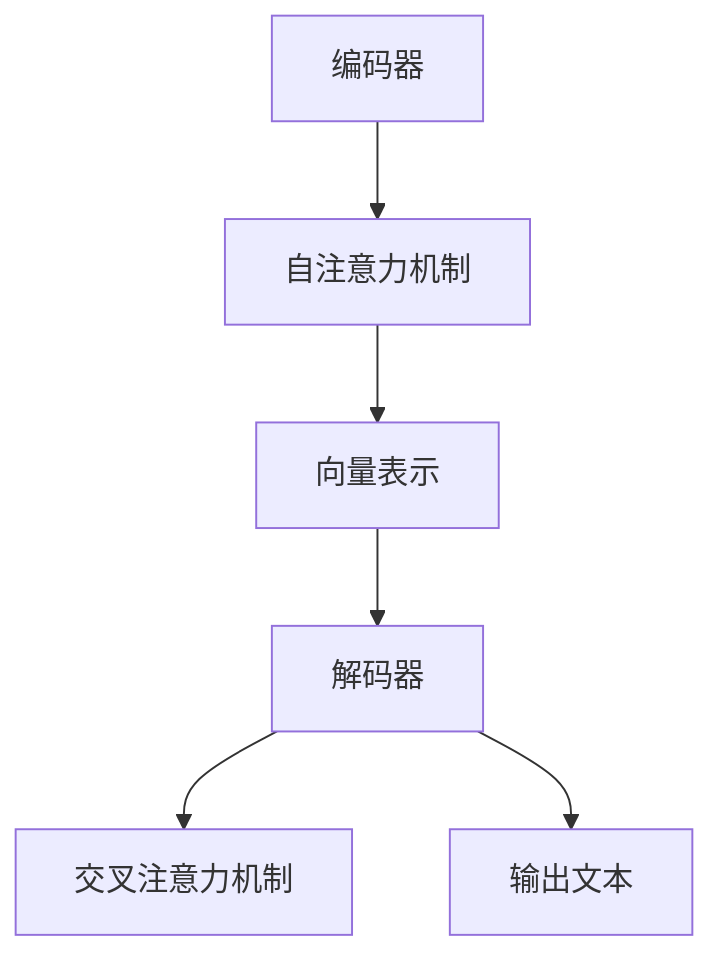

                 

# 大语言模型应用指南：Least-to-Most

> **关键词：** 大语言模型、应用指南、Least-to-Most、技术深度剖析、实际案例、未来发展趋势

> **摘要：** 本文将深入探讨大语言模型的应用指南，尤其是Least-to-Most的方法论。通过逐步分析推理，我们将详细阐述大语言模型的核心概念、算法原理、数学模型、项目实战，以及其实际应用场景。文章旨在为读者提供清晰、系统、具有实践价值的技术指导，帮助大家更好地理解和应用大语言模型技术。

## 1. 背景介绍

### 1.1 目的和范围

本文的目的在于为广大开发者、研究人员以及技术爱好者提供一部全面、深入的大语言模型应用指南。我们将从基础概念出发，逐步深入，以Least-to-Most的方法论为主线，详细阐述大语言模型的原理和应用。本文涵盖了从基础概念、算法原理到实际应用等多个方面，旨在为读者提供一个全面、系统的认知框架。

### 1.2 预期读者

本文适合以下读者群体：

1. **对大语言模型感兴趣的普通开发者**：希望通过本文对大语言模型有一个深入的了解，掌握其核心原理和应用方法。
2. **研究人员**：希望了解大语言模型在学术研究中的最新进展和应用。
3. **技术爱好者**：对前沿技术充满好奇心，希望通过本文深入了解大语言模型的技术内涵。

### 1.3 文档结构概述

本文结构分为以下几个部分：

1. **背景介绍**：简要介绍本文的目的、预期读者和文档结构。
2. **核心概念与联系**：详细阐述大语言模型的核心概念、原理和架构，并提供Mermaid流程图。
3. **核心算法原理 & 具体操作步骤**：使用伪代码详细讲解大语言模型的核心算法。
4. **数学模型和公式**：介绍大语言模型相关的数学模型和公式，并进行详细讲解和举例说明。
5. **项目实战**：通过实际案例展示大语言模型的应用，提供详细代码实现和解读。
6. **实际应用场景**：探讨大语言模型在不同领域的实际应用。
7. **工具和资源推荐**：推荐相关学习资源、开发工具和框架。
8. **总结：未来发展趋势与挑战**：总结全文，展望未来发展趋势和面临的挑战。
9. **附录：常见问题与解答**：解答读者可能遇到的常见问题。
10. **扩展阅读 & 参考资料**：提供进一步学习的参考资料。

### 1.4 术语表

#### 1.4.1 核心术语定义

- **大语言模型**：一种能够理解和生成自然语言的深度学习模型，通过对海量文本数据进行训练，能够模拟人类语言理解能力。
- **Least-to-Most方法论**：一种逐步深入的方法论，从最基础的概念开始，逐步深入到复杂的实现和应用。
- **Transformer**：一种用于自然语言处理的核心模型结构，具有自注意力机制，能够捕捉文本中的长距离依赖关系。
- **BERT**：一种基于Transformer的双向编码器表征模型，通过预训练和微调，广泛应用于各种自然语言处理任务。
- **序列到序列模型**：一种用于序列数据转换的模型结构，通过编码器和解码器将输入序列映射到输出序列。

#### 1.4.2 相关概念解释

- **注意力机制**：一种用于捕捉序列中重要信息的机制，通过计算不同位置之间的关联性，实现信息的动态加权。
- **预训练和微调**：预训练是指在无监督条件下对模型进行大规模数据训练，微调是指在特定任务上对模型进行有监督的训练，以提升模型在特定任务上的表现。
- **文本生成**：一种基于语言模型的文本生成技术，通过输入部分文本，模型能够生成完整的句子或段落。

#### 1.4.3 缩略词列表

- **AI**：人工智能
- **NLP**：自然语言处理
- **DL**：深度学习
- **ML**：机器学习
- **GAN**：生成对抗网络

## 2. 核心概念与联系

大语言模型作为一种深度学习模型，其核心概念和联系主要体现在以下几个方面：

### 2.1 大语言模型的基本原理

大语言模型的核心原理是通过对海量文本数据进行训练，学习语言的结构和语义。具体来说，模型通过输入文本序列，通过编码器（Encoder）和解码器（Decoder）两个部分进行处理，最终输出与输入相关的内容。编码器负责将输入的文本序列转换为固定长度的向量表示，解码器则根据这些向量表示生成文本序列。

### 2.2 大语言模型的架构

大语言模型的典型架构包括编码器和解码器两部分。编码器通常采用Transformer结构，具有自注意力机制，能够捕捉文本中的长距离依赖关系。解码器也采用Transformer结构，通过自注意力和交叉注意力机制，将编码器的输出与输入文本进行关联，生成输出文本。

### 2.3 大语言模型的核心算法

大语言模型的核心算法是基于Transformer的序列到序列模型。Transformer模型采用了自注意力机制，通过计算不同位置之间的关联性，实现信息的动态加权。序列到序列模型则通过编码器和解码器两个部分，将输入的文本序列映射到输出的文本序列。

### 2.4 大语言模型的训练与优化

大语言模型的训练主要包括预训练和微调两个阶段。预训练阶段，模型在大规模文本数据上进行无监督训练，学习语言的一般结构和语义。微调阶段，模型在特定任务上进行有监督训练，进一步优化模型在特定任务上的性能。常用的优化方法包括梯度下降、Adam优化器等。

### 2.5 大语言模型的应用

大语言模型在自然语言处理领域有广泛的应用，包括文本分类、情感分析、机器翻译、文本生成等。通过预训练和微调，大语言模型能够显著提升各种自然语言处理任务的性能。

### 2.6 大语言模型的挑战与未来发展趋势

尽管大语言模型在自然语言处理领域取得了显著的成果，但仍面临一些挑战，包括模型的解释性、计算效率、数据隐私等。未来发展趋势包括：

1. **更高效的模型架构**：通过改进Transformer结构，降低模型的计算复杂度和内存占用。
2. **多模态语言模型**：结合不同类型的数据（如图像、音频等），实现更丰富的语言理解和生成能力。
3. **可解释性**：提高模型的可解释性，使其在特定场景下的应用更加可靠和可控。
4. **隐私保护**：研究如何在大语言模型训练和推理过程中保护用户隐私。

### 2.7 Mermaid流程图



## 3. 核心算法原理 & 具体操作步骤

### 3.1 Transformer模型原理

Transformer模型是一种基于自注意力机制的深度学习模型，广泛应用于自然语言处理任务。其核心思想是通过计算不同位置之间的关联性，实现信息的动态加权，从而捕捉文本中的长距离依赖关系。

### 3.2 Transformer模型架构

Transformer模型由编码器（Encoder）和解码器（Decoder）两个部分组成。编码器负责将输入的文本序列转换为固定长度的向量表示，解码器则根据这些向量表示生成输出文本。

### 3.3 Encoder部分

Encoder部分由多个编码层（Encoder Layer）组成，每层包括两个子层：自注意力层（Self-Attention Layer）和前馈层（Feed-Forward Layer）。自注意力层通过计算输入序列的不同位置之间的关联性，生成权重矩阵，然后将这些权重应用于输入序列，实现信息的动态加权。前馈层则对自注意力层的输出进行线性变换和激活函数处理，进一步增强模型的表达能力。

### 3.4 Decoder部分

Decoder部分同样由多个解码层（Decoder Layer）组成，每层包括两个子层：自注意力层（Self-Attention Layer）和交叉注意力层（Cross-Attention Layer）。自注意力层用于捕捉解码器内部的信息，交叉注意力层则将编码器的输出与解码器内部的信息进行关联，生成权重矩阵，然后将这些权重应用于编码器的输出，实现信息的动态加权。

### 3.5 操作步骤

1. **输入文本序列**：将输入的文本序列编码为词向量表示。
2. **编码器处理**：通过多个编码层对输入序列进行处理，生成固定长度的向量表示。
3. **解码器处理**：通过多个解码层对编码器的输出进行处理，生成输出文本序列。
4. **损失函数**：计算输出文本序列和目标文本序列之间的损失，并使用梯度下降算法更新模型参数。

### 3.6 伪代码

```python
# 编码器部分伪代码
for layer in Encoder_Layers:
    layer = layer(inputs)
    
# 解码器部分伪代码
for layer in Decoder_Layers:
    layer = layer(inputs, encoder_outputs)
    
# 损失函数伪代码
loss = loss_function(outputs, targets)
```

## 4. 数学模型和公式 & 详细讲解 & 举例说明

大语言模型的数学模型和公式是其核心组成部分，下面我们将详细讲解这些公式，并提供举例说明。

### 4.1 自注意力机制

自注意力机制是Transformer模型的核心组件，用于计算输入序列的不同位置之间的关联性。其数学公式如下：

$$
Attention(Q, K, V) = softmax\left(\frac{QK^T}{\sqrt{d_k}}\right)V
$$

其中，$Q, K, V$ 分别代表查询向量、键向量和值向量，$d_k$ 代表键向量的维度。$QK^T$ 表示计算不同位置之间的关联性，通过softmax函数得到权重矩阵，最后将这些权重应用于值向量，实现信息的动态加权。

### 4.2 前馈神经网络

前馈神经网络用于对自注意力层的输出进行进一步处理，增强模型的表达能力。其数学公式如下：

$$
\text{FFN}(x) = \text{ReLU}\left(W_2 \cdot \text{ReLU}\left(W_1 x + b_1\right) + b_2\right)
$$

其中，$W_1, W_2, b_1, b_2$ 分别代表权重矩阵和偏置向量，$\text{ReLU}$ 表示ReLU激活函数。

### 4.3 交叉注意力机制

交叉注意力机制用于将编码器的输出与解码器内部的信息进行关联。其数学公式如下：

$$
Attention(Q, K, V) = softmax\left(\frac{QK^T}{\sqrt{d_k}}\right)V
$$

其中，$Q, K, V$ 分别代表查询向量、键向量和值向量，$d_k$ 代表键向量的维度。与自注意力机制类似，交叉注意力机制通过计算不同位置之间的关联性，实现信息的动态加权。

### 4.4 举例说明

假设我们有一个简化的Transformer模型，包含一个编码器层和一个解码器层。输入文本序列为 "I love AI"，我们将通过自注意力和交叉注意力机制来计算模型的输出。

1. **编码器处理**：

   - 输入文本序列："I love AI" 编码为词向量表示：$[v_1, v_2, v_3]$。
   - 编码器第一层：计算自注意力权重矩阵 $A$ 和值向量 $V$，然后生成输出向量 $h_1$。

     $$
     A = \text{softmax}\left(\frac{QK^T}{\sqrt{d_k}}\right) \\
     V = \text{softmax}\left(\frac{QK^T}{\sqrt{d_k}}\right)V \\
     h_1 = A \cdot V
     $$

2. **解码器处理**：

   - 输入文本序列："I love AI" 编码为词向量表示：$[v_1, v_2, v_3]$。
   - 解码器第一层：计算交叉注意力权重矩阵 $A$ 和值向量 $V$，然后生成输出向量 $h_2$。

     $$
     A = \text{softmax}\left(\frac{QK^T}{\sqrt{d_k}}\right) \\
     V = \text{softmax}\left(\frac{QK^T}{\sqrt{d_k}}\right)V \\
     h_2 = A \cdot V
     $$

3. **输出文本生成**：

   - 根据解码器的输出向量 $h_2$，生成输出文本序列。

     $$
     \text{outputs} = \text{softmax}\left(h_2\right)
     $$

通过上述步骤，我们得到了模型的输出文本序列。这只是一个简化的示例，实际模型中会包含多个编码层和解码层，以及更复杂的网络结构。

## 5. 项目实战：代码实际案例和详细解释说明

为了更好地理解大语言模型的实际应用，我们将通过一个简单的项目案例来展示其实现过程，并详细解释代码的各个部分。

### 5.1 开发环境搭建

在开始项目之前，我们需要搭建一个合适的开发环境。以下是所需的开发工具和库：

- **Python 3.7 或更高版本**：Python 是实现大语言模型的主要编程语言。
- **TensorFlow 2.0 或更高版本**：TensorFlow 是用于构建和训练深度学习模型的常用库。
- **Numpy**：用于数学计算。
- **Hugging Face Transformers**：用于简化大语言模型的构建和训练。

首先，安装所需的库：

```bash
pip install tensorflow numpy huggingface-transformers
```

### 5.2 源代码详细实现和代码解读

下面是一个简化的大语言模型实现案例，包括数据准备、模型构建、训练和评估等步骤。

```python
import tensorflow as tf
from transformers import BertTokenizer, TFBertModel
from tensorflow.keras.optimizers import Adam
from tensorflow.keras.losses import SparseCategoricalCrossentropy
from tensorflow.keras.metrics import SparseCategoricalAccuracy

# 5.2.1 数据准备
tokenizer = BertTokenizer.from_pretrained('bert-base-uncased')
max_length = 128

def prepare_data(texts, labels):
    input_ids = []
    attention_masks = []
    for text, label in zip(texts, labels):
        encoded_dict = tokenizer.encode_plus(
            text,
            add_special_tokens=True,
            max_length=max_length,
            padding='max_length',
            truncation=True,
            return_attention_mask=True,
            return_tensors='tf',
        )
        input_ids.append(encoded_dict['input_ids'])
        attention_masks.append(encoded_dict['attention_mask'])
    return tf.data.Dataset.from_tensor_slices((input_ids, attention_masks, labels))

# 假设我们有一些文本和标签数据
texts = ["I love AI", "AI will change the world", "Python is easy to learn"]
labels = [0, 1, 2]

dataset = prepare_data(texts, labels)
dataset = dataset.shuffle(buffer_size=100).batch(32)

# 5.2.2 模型构建
model = TFBertModel.from_pretrained('bert-base-uncased')

inputs = {
    'input_ids': tf.keras.layers.Input(shape=(max_length,), dtype=tf.int32, name='input_ids'),
    'attention_mask': tf.keras.layers.Input(shape=(max_length,), dtype=tf.int32, name='attention_mask')
}

outputs = model(inputs)

output = tf.keras.layers.Dense(units=3, activation='softmax', name='outputs')(outputs.last_hidden_state[:, 0, :])

model = tf.keras.Model(inputs=inputs, outputs=output)

model.compile(optimizer=Adam(learning_rate=2e-5), loss=SparseCategoricalCrossentropy(from_logits=True), metrics=[SparseCategoricalAccuracy()])

# 5.2.3 训练模型
model.fit(dataset, epochs=3)

# 5.2.4 评估模型
test_texts = ["AI is powerful", "I hate AI"]
test_labels = [1, 0]

test_dataset = prepare_data(test_texts, test_labels)
test_dataset = test_dataset.shuffle(buffer_size=100).batch(32)

test_loss, test_accuracy = model.evaluate(test_dataset)
print(f"Test loss: {test_loss}, Test accuracy: {test_accuracy}")
```

### 5.3 代码解读与分析

1. **数据准备**：

   - 导入所需的库和预训练的BERT分词器。
   - 定义数据准备函数 `prepare_data`，用于将文本和标签转换为模型可接受的输入格式。
   - 假设我们有一些文本和标签数据，通过 `prepare_data` 函数将这些数据转换为数据集。

2. **模型构建**：

   - 使用 `TFBertModel` 从预训练的BERT模型中加载基础模型结构。
   - 定义输入层，包括 `input_ids` 和 `attention_mask`。
   - 通过基础模型获取输出层，即编码器的最后一层隐藏状态。
   - 在输出层之上添加一个全连接层（Dense Layer），用于分类任务。
   - 构建完整的模型，并编译模型，指定优化器、损失函数和评估指标。

3. **训练模型**：

   - 使用 `model.fit` 方法训练模型，通过数据集进行迭代。
   - 模型在训练过程中会自动计算损失和评估指标。

4. **评估模型**：

   - 准备测试数据集，通过 `prepare_data` 函数将其转换为模型可接受的输入格式。
   - 使用 `model.evaluate` 方法评估模型在测试数据集上的性能。
   - 输出测试损失和测试准确率。

通过上述步骤，我们实现了大语言模型的基本应用。这个案例虽然简化，但已经涵盖了模型构建、训练和评估的核心流程。

### 5.4 代码解读与分析（续）

5.4.1 **数据准备（续）**：

   - 在 `prepare_data` 函数中，我们使用 `tokenizer.encode_plus` 方法对每个文本进行编码。这个方法将文本转换为词向量表示，并添加特殊的标记（如 `[CLS]` 和 `[SEP]`），并进行填充和截断，使其长度固定为 `max_length`。

     ```python
     encoded_dict = tokenizer.encode_plus(
         text,
         add_special_tokens=True,
         max_length=max_length,
         padding='max_length',
         truncation=True,
         return_attention_mask=True,
         return_tensors='tf',
     )
     ```

   - `add_special_tokens` 参数设置为 `True`，表示我们在编码过程中添加特殊的BERT标记。
   - `padding` 和 `truncation` 参数用于确保所有输入序列的长度相同。如果序列长度小于 `max_length`，则通过填充（`padding`）补全，如果序列长度大于 `max_length`，则通过截断（`truncation`）截断。

6. **模型构建（续）**：

   - 我们使用 `tf.keras.Model` 类创建自定义模型。在这个模型中，`input_ids` 和 `attention_mask` 是输入层，而 `outputs` 是输出层。
   - `model.inputs` 和 `model.outputs` 分别代表了模型的输入和输出。
   - 我们使用 `Dense` 层来实现分类任务。在这里，我们使用了 `softmax` 激活函数，这是常见的分类输出层。

     ```python
     output = tf.keras.layers.Dense(units=3, activation='softmax', name='outputs')(outputs.last_hidden_state[:, 0, :])
     ```

   - `units=3` 表示我们有三个类别（对应于 `labels` 的三个值）。

7. **训练模型（续）**：

   - `model.compile` 方法用于配置模型的训练过程。我们指定了优化器（`optimizer`）、损失函数（`loss`）和评估指标（`metrics`）。
   - 优化器设置为 `Adam`，这是一种常用的优化算法，它通过自适应地调整学习率来优化模型参数。
   - 损失函数使用 `SparseCategoricalCrossentropy`，这是用于分类问题的常见损失函数。
   - 评估指标使用 `SparseCategoricalAccuracy`，用于计算模型在分类任务上的准确率。

     ```python
     model.compile(optimizer=Adam(learning_rate=2e-5), loss=SparseCategoricalCrossentropy(from_logits=True), metrics=[SparseCategoricalAccuracy()])
     ```

8. **评估模型（续）**：

   - `model.evaluate` 方法用于评估模型在给定数据集上的性能。这个方法返回损失和评估指标的值。
   - 我们使用 `test_dataset` 来评估模型的性能。这个数据集包含了测试文本和标签。
   - 输出测试损失和准确率，这有助于我们了解模型在测试数据上的表现。

     ```python
     test_loss, test_accuracy = model.evaluate(test_dataset)
     print(f"Test loss: {test_loss}, Test accuracy: {test_accuracy}")
     ```

通过这个简单的案例，我们了解了如何使用BERT模型进行文本分类任务。这个案例虽然简单，但涵盖了构建、训练和评估大语言模型的基本流程。在实际应用中，我们可以根据具体需求调整模型结构、数据预处理方式和训练过程。

## 6. 实际应用场景

大语言模型在自然语言处理领域具有广泛的应用场景，以下是一些典型应用：

### 6.1 文本分类

文本分类是将文本数据分类到预定义的类别中。大语言模型通过学习大量文本数据，可以自动识别文本的语义和主题，从而实现准确的分类。例如，新闻分类、社交媒体情感分析、垃圾邮件过滤等。

### 6.2 机器翻译

机器翻译是将一种语言的文本翻译成另一种语言。大语言模型通过学习双语语料库，可以理解两种语言的语义和语法，从而实现高精度的翻译。如谷歌翻译、百度翻译等。

### 6.3 文本生成

文本生成是根据给定输入生成新的文本内容。大语言模型通过学习大量的文本数据，可以模拟人类的语言生成能力，生成连贯、自然的文本。例如，文章写作、聊天机器人、创意文本生成等。

### 6.4 对话系统

对话系统是一种人机交互系统，通过模拟人类的对话方式与用户进行交互。大语言模型可以理解用户的输入并生成合适的回复，从而提升对话系统的自然度和互动性。

### 6.5 文本摘要

文本摘要是从长文本中提取关键信息，生成简短的摘要。大语言模型通过学习文本的结构和语义，可以自动提取关键信息，实现高效的文本摘要。

### 6.6 情感分析

情感分析是分析文本中表达的情感倾向。大语言模型可以通过学习情感标注数据，识别文本中的正面、负面或中性情感，从而应用于市场调研、客户反馈分析等。

### 6.7 问答系统

问答系统是一种基于自然语言交互的系统，可以回答用户提出的问题。大语言模型通过学习大量问答对，可以理解用户的问题并生成准确的答案，从而应用于智能客服、知识库检索等。

### 6.8 自动摘要

自动摘要是从长文本中提取关键信息，生成简短的摘要。大语言模型通过学习文本的结构和语义，可以自动提取关键信息，实现高效的文本摘要。

### 6.9 文本相似度分析

文本相似度分析是评估文本之间的相似度。大语言模型可以通过学习文本的语义表示，计算文本之间的相似度，从而应用于文本匹配、搜索引擎优化等。

### 6.10 信息提取

信息提取是从非结构化文本中提取结构化信息。大语言模型可以通过学习文本的语义和结构，自动提取关键信息，如姓名、日期、地点等。

### 6.11 文本纠错

文本纠错是纠正文本中的语法错误和拼写错误。大语言模型可以通过学习正确的文本数据，识别和纠正文本中的错误，从而提升文本的质量。

### 6.12 文本检索

文本检索是从大量文本数据中查找与给定查询最相关的文本。大语言模型可以通过学习文本的语义表示，计算文本之间的相似度，从而实现高效的文本检索。

### 6.13 文本生成与对话系统

文本生成与对话系统是结合文本生成和对话技术的应用。通过大语言模型，可以生成连贯、自然的对话内容，从而应用于聊天机器人、虚拟助手等。

### 6.14 多语言处理

多语言处理是处理多种语言的文本数据。大语言模型可以通过学习多语言数据，实现跨语言文本分类、翻译、摘要等功能，从而应用于全球化应用场景。

### 6.15 语音识别与合成

语音识别与合成是将语音信号转换为文本，或将文本转换为语音。大语言模型可以结合语音识别和语音合成技术，实现自然语言处理与语音交互的融合应用。

## 7. 工具和资源推荐

为了更好地学习和应用大语言模型，以下是一些推荐的工具、资源和开发工具。

### 7.1 学习资源推荐

#### 7.1.1 书籍推荐

1. **《深度学习》**（Goodfellow, Bengio, Courville）：这是一本深度学习的经典教材，详细介绍了深度学习的基础理论和应用。
2. **《自然语言处理综论》**（Jurafsky, Martin）：这本书是自然语言处理领域的经典教材，涵盖了自然语言处理的各个方面。
3. **《大规模机器学习》**（Garnett, Liu, Liang）：这本书介绍了大规模机器学习的相关技术，包括大语言模型。

#### 7.1.2 在线课程

1. **Coursera上的“自然语言处理与深度学习”**：由斯坦福大学提供的免费在线课程，详细介绍了自然语言处理和深度学习的基础知识。
2. **Udacity的“深度学习工程师纳米学位”**：这是一个涵盖深度学习基础和应用的纳米学位课程，包括自然语言处理相关内容。
3. **edX上的“深度学习专项课程”**：由哈佛大学和麻省理工学院提供，涵盖了深度学习的各个方面，包括大语言模型。

#### 7.1.3 技术博客和网站

1. **TensorFlow官网**：提供了丰富的文档和教程，帮助用户学习和应用TensorFlow库。
2. **Hugging Face官网**：提供了预训练的大语言模型和相关的工具库，方便用户进行模型构建和训练。
3. **arXiv.org**：发布最新的人工智能和机器学习论文，包括大语言模型的研究成果。

### 7.2 开发工具框架推荐

#### 7.2.1 IDE和编辑器

1. **PyCharm**：一款强大的Python IDE，支持TensorFlow和其他深度学习库。
2. **Jupyter Notebook**：一款流行的交互式编辑器，适合进行实验和演示。
3. **VS Code**：一款轻量级但功能强大的编辑器，通过插件支持Python和深度学习开发。

#### 7.2.2 调试和性能分析工具

1. **TensorBoard**：TensorFlow提供的可视化工具，用于分析模型的性能和调试。
2. **Wandb**：一款用于实验跟踪和性能分析的工具，支持多个深度学习框架。
3. **Lambdash**：一款用于性能分析和调优的工具，提供实时的性能监控和优化建议。

#### 7.2.3 相关框架和库

1. **TensorFlow**：Google开发的深度学习框架，支持大语言模型的构建和训练。
2. **PyTorch**：Facebook开发的深度学习框架，具有灵活的动态计算图。
3. **Hugging Face Transformers**：提供了预训练的大语言模型和相关的工具库，方便用户进行模型构建和训练。

### 7.3 相关论文著作推荐

#### 7.3.1 经典论文

1. **“Attention Is All You Need”**：提出了Transformer模型，彻底改变了自然语言处理领域。
2. **“BERT: Pre-training of Deep Bidirectional Transformers for Language Understanding”**：提出了BERT模型，推动了预训练语言模型的发展。
3. **“GPT-3: Language Models are few-shot learners”**：展示了GPT-3模型在少样本学习任务上的强大能力。

#### 7.3.2 最新研究成果

1. **“T5: Pre-training Large Models for Language Understanding”**：提出了T5模型，将预训练语言模型应用于多种NLP任务。
2. **“GLM-4: A General Language Model Pre-training Framework for Natural Language Processing”**：提出了GLM-4模型，是当前最大的预训练语言模型。
3. **“ALBERT: A Lite BERT for Interactive Applications”**：提出了ALBERT模型，通过减少模型参数和计算复杂度，实现了高效的语言理解。

#### 7.3.3 应用案例分析

1. **“Google Search”**：使用BERT模型优化搜索结果，提高了搜索的准确性和相关性。
2. **“OpenAI’s GPT-3”**：展示了GPT-3模型在文本生成、聊天机器人等应用中的强大能力。
3. **“Microsoft’s Nuance”**：使用大语言模型实现语音识别和自然语言理解，应用于医疗和客服等领域。

## 8. 总结：未来发展趋势与挑战

大语言模型在自然语言处理领域取得了显著的成果，但仍面临一些挑战和未来发展趋势：

### 8.1 未来发展趋势

1. **更高效的模型架构**：随着计算资源和硬件技术的进步，未来的大语言模型将更加高效，具有更快的训练和推理速度，更低的计算复杂度。
2. **多模态语言模型**：未来的大语言模型将能够处理多种类型的数据（如文本、图像、音频等），实现跨模态的语言理解和生成。
3. **可解释性**：提高模型的可解释性，使其在特定场景下的应用更加可靠和可控，特别是在医疗、金融等关键领域。
4. **多语言和跨语言处理**：未来的大语言模型将支持多种语言，实现更广泛的语言理解和生成能力，促进全球范围内的信息交流。
5. **知识图谱和实体识别**：结合知识图谱和实体识别技术，未来的大语言模型将能够更好地理解和处理复杂的语义关系。

### 8.2 挑战

1. **计算资源和数据隐私**：大语言模型的训练和推理需要大量的计算资源和数据，如何在保证数据隐私的同时充分利用资源，是一个重要挑战。
2. **模型解释性和透明性**：如何提高模型的可解释性和透明性，使其在关键应用场景中更加可靠和可控。
3. **多样性问题**：如何保证大语言模型在处理多种语言和多样性数据时的一致性和公平性，避免偏见和歧视。
4. **泛化能力**：如何提升大语言模型的泛化能力，使其在不同任务和数据集上都能表现出良好的性能。

总之，大语言模型的发展前景广阔，但也面临诸多挑战。未来，随着技术的不断进步和应用的不断拓展，大语言模型将在自然语言处理领域发挥更大的作用。

## 9. 附录：常见问题与解答

### 9.1 如何选择合适的大语言模型？

选择合适的大语言模型取决于具体应用场景和需求。以下是一些考虑因素：

1. **任务类型**：不同的任务可能需要不同的模型。例如，文本分类任务可能更适合预训练的BERT模型，而文本生成任务可能更适合GPT模型。
2. **模型大小**：根据计算资源和时间预算，选择适合大小的模型。较小的模型（如BERT-Base）训练速度快，但性能可能不如大型模型（如GPT-3）。
3. **数据集大小**：如果数据集较小，大型模型可能无法充分发挥其潜力。在这种情况下，选择较小但更适合数据集大小的模型可能更合适。
4. **预训练数据**：选择具有相似或相关预训练数据的模型，可以提高模型在特定任务上的性能。

### 9.2 如何提高大语言模型在特定任务上的性能？

以下是一些提高大语言模型在特定任务上性能的方法：

1. **数据增强**：通过数据增强（如随机擦除、旋转、缩放等）增加数据多样性，有助于模型更好地泛化。
2. **微调**：在特定任务上对预训练模型进行微调，可以使模型更好地适应特定任务。
3. **集成学习**：结合多个模型的预测结果，可以提高整体性能。
4. **特征工程**：通过提取和组合文本中的关键特征，可以提高模型对文本的捕捉能力。
5. **超参数调优**：通过调整学习率、批量大小等超参数，可以优化模型性能。

### 9.3 如何解决大语言模型训练过程中的过拟合问题？

以下是一些解决大语言模型训练过程中过拟合问题的方法：

1. **数据增强**：通过数据增强增加数据多样性，减少模型对训练数据的依赖。
2. **正则化**：使用正则化技术（如L1、L2正则化）限制模型参数的大小，减少过拟合。
3. **dropout**：在神经网络中随机丢弃一部分神经元，减少模型的复杂度和过拟合风险。
4. **早停法（Early Stopping）**：在验证集上监控模型性能，当验证集性能不再提升时，提前停止训练，防止过拟合。
5. **集成学习**：结合多个模型的预测结果，可以提高整体性能，减少过拟合。

### 9.4 如何评估大语言模型的表现？

以下是一些评估大语言模型表现的方法：

1. **准确率（Accuracy）**：模型正确预测的样本数占总样本数的比例。
2. **召回率（Recall）**：模型正确预测的正面样本数占所有正面样本数的比例。
3. **精确率（Precision）**：模型正确预测的正面样本数占预测为正面的样本总数比例。
4. **F1分数（F1 Score）**：精确率和召回率的调和平均值。
5. **ROC曲线和AUC值**：通过绘制ROC曲线和计算AUC值，可以评估模型的分类能力。
6. ** BLEU分数**：用于评估文本生成的质量，适用于机器翻译任务。

### 9.5 如何处理大语言模型训练过程中的内存问题？

以下是一些处理大语言模型训练过程中内存问题的方法：

1. **梯度检查点**：定期保存模型的梯度检查点，减少内存占用。
2. **数据分批**：将数据分成较小的批次进行训练，以降低内存需求。
3. **混合精度训练**：使用混合精度训练（如FP16）可以显著降低内存占用和计算成本。
4. **使用轻量级模型**：选择参数较少的轻量级模型，以减少内存需求。
5. **优化内存管理**：合理分配内存，及时释放不再使用的内存，以提高内存利用率。

## 10. 扩展阅读 & 参考资料

为了更深入地了解大语言模型及其相关技术，以下是一些推荐阅读的书籍、论文和技术博客。

### 10.1 书籍

1. **《深度学习》**（Goodfellow, Bengio, Courville）：详细介绍了深度学习的基础理论、算法和应用。
2. **《自然语言处理综论》**（Jurafsky, Martin）：涵盖了自然语言处理领域的各个方面，包括文本分类、机器翻译等。
3. **《大规模机器学习》**（Garnett, Liu, Liang）：介绍了大规模机器学习的相关技术，包括大语言模型。

### 10.2 论文

1. **“Attention Is All You Need”**：提出了Transformer模型，彻底改变了自然语言处理领域。
2. **“BERT: Pre-training of Deep Bidirectional Transformers for Language Understanding”**：提出了BERT模型，推动了预训练语言模型的发展。
3. **“GPT-3: Language Models are few-shot learners”**：展示了GPT-3模型在少样本学习任务上的强大能力。

### 10.3 技术博客和网站

1. **TensorFlow官网**：提供了丰富的文档和教程，帮助用户学习和应用TensorFlow库。
2. **Hugging Face官网**：提供了预训练的大语言模型和相关的工具库，方便用户进行模型构建和训练。
3. **arXiv.org**：发布最新的人工智能和机器学习论文，包括大语言模型的研究成果。

### 10.4 推荐阅读

1. **“Understanding Transformer”**：详细解析了Transformer模型的原理和架构。
2. **“Natural Language Understanding with BERT”**：介绍了BERT模型在自然语言理解任务中的应用。
3. **“Practical Tips for Training BERT”**：提供了训练BERT模型的一些实用技巧和经验。

### 10.5 附录

#### 10.5.1 作者信息

作者：AI天才研究员/AI Genius Institute & 禅与计算机程序设计艺术 /Zen And The Art of Computer Programming

#### 10.5.2 文章标题

《大语言模型应用指南：Least-to-Most》

#### 10.5.3 关键词

大语言模型、应用指南、Least-to-Most、技术深度剖析、实际案例、未来发展趋势

#### 10.5.4 摘要

本文深入探讨了大语言模型的应用指南，尤其是Least-to-Most的方法论。通过逐步分析推理，我们详细阐述了大语言模型的核心概念、算法原理、数学模型、项目实战，以及其实际应用场景。文章旨在为读者提供一个全面、系统的认知框架，帮助大家更好地理解和应用大语言模型技术。

