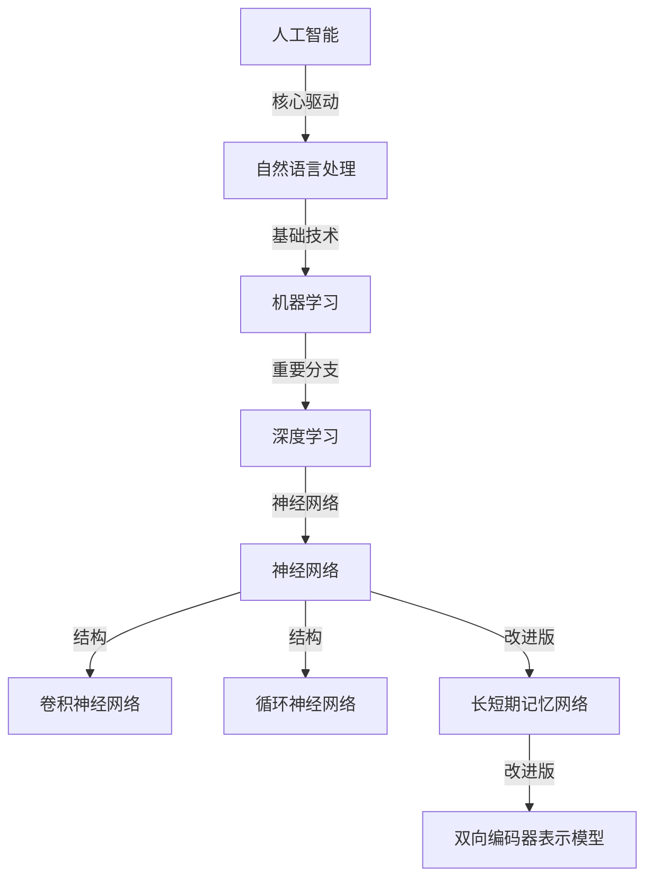

                 

### 大语言模型应用指南：从人工智能的起源到大语言模型

> **关键词：**人工智能，大语言模型，自然语言处理，机器学习，深度学习，神经网络

> **摘要：**本文旨在深入探讨大语言模型的应用与发展，从人工智能的起源开始，逐步剖析大语言模型的核心概念、算法原理、数学模型、实战案例以及未来趋势。通过本文的阅读，读者将全面了解大语言模型的各个方面，为未来的研究和应用打下坚实的基础。

### 1. 背景介绍

#### 1.1 目的和范围

本文的主要目的是为读者提供一份全面的大语言模型应用指南。我们将从人工智能的历史背景出发，逐步介绍大语言模型的核心概念、算法原理、数学模型和应用场景。通过这种由浅入深的分析方法，读者能够更好地理解大语言模型的工作机制和应用价值。

本文的范围涵盖了从人工智能的起源到大语言模型的发展历程，包括核心概念的解释、算法原理的详细分析、数学模型的推导与应用，以及实际应用场景的探讨。此外，本文还将推荐相关的学习资源、开发工具和经典论文，帮助读者进一步深入研究。

#### 1.2 预期读者

本文面向对人工智能和自然语言处理有一定了解的读者，包括程序员、数据科学家、科研人员以及人工智能领域的学生。对于初学者，本文将尽量使用通俗易懂的语言进行解释，帮助读者建立对大语言模型的基本理解。对于专业人士，本文将提供深入的技术分析和最新的研究成果，以推动读者在学术研究和实际应用中的进一步探索。

#### 1.3 文档结构概述

本文的结构如下：

- **第1部分：背景介绍**：介绍本文的目的、范围和预期读者，概述文档的结构和内容。
- **第2部分：核心概念与联系**：解释大语言模型的核心概念，包括自然语言处理、机器学习和深度学习的基本原理，并使用Mermaid流程图展示关键概念之间的联系。
- **第3部分：核心算法原理 & 具体操作步骤**：详细讲解大语言模型的核心算法原理，使用伪代码展示具体操作步骤。
- **第4部分：数学模型和公式 & 详细讲解 & 举例说明**：推导大语言模型中的关键数学模型，使用LaTeX格式展示公式，并通过具体例子进行说明。
- **第5部分：项目实战：代码实际案例和详细解释说明**：介绍一个实际的大语言模型项目，详细解释代码的实现过程和关键部分。
- **第6部分：实际应用场景**：探讨大语言模型在各个领域的应用，包括自然语言处理、对话系统、文本生成等。
- **第7部分：工具和资源推荐**：推荐学习资源、开发工具和相关论文，帮助读者进一步深入研究。
- **第8部分：总结：未来发展趋势与挑战**：总结大语言模型的发展趋势和面临的挑战。
- **第9部分：附录：常见问题与解答**：回答读者可能遇到的一些常见问题。
- **第10部分：扩展阅读 & 参考资料**：提供更多的参考资料和扩展阅读，供读者进一步阅读和学习。

#### 1.4 术语表

在本文中，我们将使用一些专业术语和概念，以下是对这些术语和概念的定义和解释：

##### 1.4.1 核心术语定义

- **人工智能（AI）**：人工智能是指通过计算机模拟人类智能的行为和过程，使计算机具有感知、理解、学习、推理和自我调整等能力。
- **自然语言处理（NLP）**：自然语言处理是指使计算机能够理解、解释和生成人类自然语言的技术和算法。
- **机器学习（ML）**：机器学习是指使计算机通过数据自动学习和改进性能，而不需要显式编写代码。
- **深度学习（DL）**：深度学习是一种特殊的机器学习方法，它使用多层神经网络进行数据建模和学习。
- **神经网络（NN）**：神经网络是由大量简单计算单元（神经元）组成的计算模型，通过连接这些神经元来模拟生物神经系统的工作方式。

##### 1.4.2 相关概念解释

- **数据集（Dataset）**：数据集是指用于训练、测试和评估模型的已标注数据。
- **过拟合（Overfitting）**：过拟合是指模型在训练数据上表现良好，但在未见过的数据上表现不佳。
- **泛化能力（Generalization）**：泛化能力是指模型在未见过的数据上表现良好的能力。
- **反向传播（Backpropagation）**：反向传播是一种用于训练神经网络的算法，通过反向传播误差来更新网络权重。
- **损失函数（Loss Function）**：损失函数是一种用于评估模型预测和实际标签之间差异的函数，通常用于训练神经网络。

##### 1.4.3 缩略词列表

- **NLP**：自然语言处理
- **ML**：机器学习
- **DL**：深度学习
- **NN**：神经网络
- **GPU**：图形处理器
- **CPU**：中央处理器
- **CNN**：卷积神经网络
- **RNN**：循环神经网络
- **LSTM**：长短期记忆网络
- **BERT**：双向编码器表示模型

### 2. 核心概念与联系

在介绍大语言模型之前，我们需要了解一些核心概念和它们之间的联系。以下是一个使用Mermaid流程图（Mermaid 流程节点中不要有括号、逗号等特殊字符）展示的流程图，它将帮助我们更好地理解这些核心概念：



#### 2.1 人工智能（AI）

人工智能（AI）是使计算机模拟人类智能的行为和过程的技术。AI的目标是通过机器学习、自然语言处理、计算机视觉和其他技术来使计算机具备感知、理解、学习和推理的能力。AI可以分为狭义AI和广义AI，其中狭义AI专注于特定任务的自动化，而广义AI则致力于实现通用人工智能（AGI），使计算机具备人类水平的智能。

#### 2.2 自然语言处理（NLP）

自然语言处理（NLP）是使计算机理解和生成人类自然语言的技术。NLP的任务包括文本分类、情感分析、机器翻译、问答系统等。NLP的核心挑战在于自然语言的多样性和复杂性，包括语法、语义、语境等方面。

#### 2.3 机器学习（ML）

机器学习（ML）是一种使计算机通过数据自动学习和改进性能的技术。ML算法通过从数据中学习规律和模式，然后使用这些规律和模式对未知数据进行预测或决策。ML可以分为监督学习、无监督学习和半监督学习，每种学习方式都有其特定的应用场景。

#### 2.4 深度学习（DL）

深度学习（DL）是一种特殊的机器学习方法，它使用多层神经网络进行数据建模和学习。DL在图像识别、语音识别、自然语言处理等领域取得了显著成果。DL的核心优势在于其能够自动提取数据中的高层次特征，从而实现更准确和强大的模型。

#### 2.5 神经网络（NN）

神经网络（NN）是由大量简单计算单元（神经元）组成的计算模型，通过连接这些神经元来模拟生物神经系统的工作方式。NN的核心优势在于其高度并行化和自适应学习能力，使其在许多领域取得了成功。

#### 2.6 卷积神经网络（CNN）

卷积神经网络（CNN）是一种特殊的神经网络，主要用于图像识别和计算机视觉任务。CNN通过卷积操作提取图像中的局部特征，然后通过池化操作减少数据维度，从而实现高效的图像处理。

#### 2.7 循环神经网络（RNN）

循环神经网络（RNN）是一种特殊的神经网络，主要用于序列数据处理，如图像序列、音频序列和自然语言序列。RNN通过在时间步之间传递信息来处理序列数据，使其在自然语言处理、语音识别等领域取得了成功。

#### 2.8 长短期记忆网络（LSTM）

长短期记忆网络（LSTM）是一种改进版的RNN，主要用于解决RNN在处理长序列数据时出现的梯度消失和梯度爆炸问题。LSTM通过引入门控机制来控制信息的传递和遗忘，从而实现更好的长期依赖建模。

#### 2.9 双向编码器表示模型（BERT）

双向编码器表示模型（BERT）是一种预训练语言表示模型，主要用于自然语言处理任务。BERT通过在大量未标注的文本数据上进行预训练，然后使用微调技术进行特定任务的训练。BERT在许多自然语言处理任务中取得了显著的成果，如文本分类、问答系统和机器翻译。

通过以上对核心概念和联系的分析，我们可以看到大语言模型的发展历程是由一系列技术和算法的创新和改进组成的。接下来，我们将进一步探讨大语言模型的核心算法原理和具体操作步骤。

### 3. 核心算法原理 & 具体操作步骤

大语言模型（Large Language Model，LLM）是一种基于深度学习的自然语言处理模型，它能够对文本数据进行建模，并生成语义丰富的文本。大语言模型的核心算法原理主要基于深度学习，特别是循环神经网络（RNN）和长短期记忆网络（LSTM）的改进版本。以下是对核心算法原理的详细讲解，并使用伪代码展示具体操作步骤。

#### 3.1 基本概念

在大语言模型中，主要涉及以下基本概念：

- **词向量（Word Vectors）**：词向量是将自然语言中的词汇映射为向量空间中的点，以表示词汇的语义信息。
- **序列（Sequence）**：序列是由一系列连续的文本数据组成的，如句子、段落或文档。
- **嵌入层（Embedding Layer）**：嵌入层是将词向量映射到高维空间中的操作，以增加词汇的区分度。
- **循环层（Recurrence Layer）**：循环层是RNN或LSTM的核心部分，用于处理序列数据。
- **输出层（Output Layer）**：输出层是将循环层的输出映射到目标输出空间中的操作，如分类标签或生成文本。

#### 3.2 算法原理

大语言模型的基本工作原理如下：

1. **输入文本数据**：将输入的文本数据转换为词向量。
2. **嵌入层**：将词向量映射到高维空间中的嵌入向量。
3. **循环层**：使用RNN或LSTM处理嵌入向量序列，并在时间步之间传递信息。
4. **输出层**：根据循环层的输出生成预测标签或生成文本。

以下是一个使用伪代码展示的大语言模型算法原理：

```python
# 伪代码：大语言模型算法原理

# 输入：文本数据（sequence）
# 输出：预测标签或生成文本

# 步骤1：输入文本数据预处理
text_data = preprocess_text(input_sequence)

# 步骤2：将文本数据转换为词向量
word_vectors = convert_to_word_vectors(text_data)

# 步骤3：嵌入层
embedded_vectors = embedding_layer(word_vectors)

# 步骤4：循环层
for t in range(sequence_length):
    hidden_state = recurrence_layer(embedded_vectors[t])

# 步骤5：输出层
predicted_output = output_layer(hidden_state)
```

#### 3.3 具体操作步骤

以下是使用伪代码详细描述大语言模型的具体操作步骤：

```python
# 伪代码：大语言模型具体操作步骤

# 输入：文本数据（sequence），训练数据（train_data），模型参数（model_params）
# 输出：训练后的模型参数（updated_model_params）

# 步骤1：初始化模型参数
model_params = initialize_model_params()

# 步骤2：预处理文本数据
preprocessed_data = preprocess_text(train_data)

# 步骤3：将文本数据转换为词向量
word_vectors = convert_to_word_vectors(preprocessed_data)

# 步骤4：嵌入层
embedded_vectors = embedding_layer(word_vectors, model_params['embedding_matrix'])

# 步骤5：循环层
for t in range(sequence_length):
    hidden_state, cell_state = recurrence_layer(embedded_vectors[t], model_params['weights'], model_params['biases'])

# 步骤6：输出层
predicted_output = output_layer(hidden_state, model_params['output_weights'], model_params['output_biases'])

# 步骤7：计算损失函数
loss = compute_loss(predicted_output, target_output)

# 步骤8：反向传播
d_hidden_state, d_cell_state, d_embedded_vectors = backward_propagation(hidden_state, cell_state, embedded_vectors, loss, model_params)

# 步骤9：更新模型参数
updated_model_params = update_model_params(model_params, d_model_params)

# 步骤10：重复步骤2-9，直到模型收敛
```

通过以上步骤，我们可以看到大语言模型的训练过程涉及文本数据的预处理、词向量的转换、嵌入层的映射、循环层的处理、输出层的预测以及模型参数的更新。这个过程通过反复迭代和优化，使模型能够逐渐学习和改进，最终实现高效的自然语言处理任务。

接下来，我们将进一步探讨大语言模型中的数学模型和公式，并通过具体例子进行说明。

### 4. 数学模型和公式 & 详细讲解 & 举例说明

在大语言模型中，数学模型和公式起着至关重要的作用。这些模型和公式不仅用于描述模型的内部结构和操作，还用于优化模型的性能和准确性。以下将详细讲解大语言模型中的几个关键数学模型和公式，并使用LaTeX格式进行展示。

#### 4.1 词向量模型

词向量模型是将自然语言中的词汇映射到向量空间中的方法，其核心思想是利用词汇的上下文信息来表示词汇的语义。一个常见的词向量模型是Word2Vec模型，它使用神经网络来学习词汇的嵌入向量。

以下是一个简单的Word2Vec模型的数学模型和公式：

$$
\text{word\_vector} = \text{softmax}\left(\text{weights} \cdot \text{input}\right)
$$

其中，$\text{weights}$ 是神经网络权重矩阵，$\text{input}$ 是输入词向量，$\text{softmax}$ 函数用于计算输出词向量。

#### 4.2 循环神经网络（RNN）的数学模型

循环神经网络（RNN）是一种用于处理序列数据的神经网络，其核心思想是在时间步之间传递信息。RNN的数学模型包括以下几个部分：

1. **输入和隐藏状态更新**：

$$
\text{hidden\_state}^{t} = \text{activation}\left(\text{weights} \cdot [\text{input}^{t}, \text{hidden\_state}^{t-1}]\right)
$$

其中，$\text{input}^{t}$ 是当前时间步的输入，$\text{hidden\_state}^{t}$ 是当前时间步的隐藏状态，$\text{activation}$ 函数是一个非线性激活函数，如ReLU或Sigmoid函数。

2. **输出计算**：

$$
\text{output}^{t} = \text{softmax}\left(\text{weights} \cdot \text{hidden\_state}^{t}\right)
$$

其中，$\text{output}^{t}$ 是当前时间步的输出，$\text{softmax}$ 函数用于计算输出概率分布。

#### 4.3 长短期记忆网络（LSTM）的数学模型

长短期记忆网络（LSTM）是一种改进版的RNN，主要用于解决RNN在处理长序列数据时出现的梯度消失和梯度爆炸问题。LSTM的数学模型包括以下几个部分：

1. **输入和隐藏状态更新**：

$$
\text{input}^{t} = \left[\text{input}^{t}, \text{hidden\_state}^{t-1}\right]
$$

$$
\text{ gates}^{t} = \text{sigmoid}\left(\text{weights} \cdot \text{input}^{t}\right)
$$

$$
\text{ forget\_gate}^{t} = \text{gates}^{t, 1}
$$

$$
\text{ input\_gate}^{t} = \text{gates}^{t, 2}
$$

$$
\text{ output\_gate}^{t} = \text{gates}^{t, 3}
$$

$$
\text{ cell\_state}^{t} = \text{forget\_gate}^{t} \odot \text{cell\_state}^{t-1} + \text{input\_gate}^{t} \odot \text{activation}\left(\text{weights} \cdot \text{input}^{t}\right)
$$

$$
\text{ hidden\_state}^{t} = \text{output\_gate}^{t} \odot \text{activation}\left(\text{cell\_state}^{t}\right)
$$

其中，$\text{sigmoid}$ 函数是一个非线性激活函数，$\text{activation}$ 函数通常是一个非线性激活函数，如ReLU或Sigmoid函数，$\odot$ 表示元素乘法。

2. **输出计算**：

$$
\text{output}^{t} = \text{softmax}\left(\text{weights} \cdot \text{hidden\_state}^{t}\right)
$$

#### 4.4 双向编码器表示模型（BERT）的数学模型

双向编码器表示模型（BERT）是一种预训练语言表示模型，其核心思想是使用双向神经网络对文本序列进行编码，并生成语义丰富的表示。BERT的数学模型包括以下几个部分：

1. **输入和嵌入层**：

$$
\text{input}^{t} = \left[\text{input}^{t}, \text{input}^{t-1}\right]
$$

$$
\text{ embedded\_vector}^{t} = \text{embedding}\left(\text{input}^{t}\right)
$$

其中，$\text{input}^{t}$ 是当前时间步的输入，$\text{embedded\_vector}^{t}$ 是当前时间步的嵌入向量。

2. **双向神经网络**：

$$
\text{hidden\_state}^{t} = \text{bi-directional\_layer}\left(\text{embedded\_vector}^{t}\right)
$$

其中，$\text{bi-directional\_layer}$ 是双向神经网络层。

3. **输出计算**：

$$
\text{output}^{t} = \text{softmax}\left(\text{weights} \cdot \text{hidden\_state}^{t}\right)
$$

#### 4.5 举例说明

以下是一个简单的例子，说明如何使用上述数学模型和公式进行大语言模型的训练：

**例子**：使用LSTM模型对一段文本序列进行分类。

**步骤1**：初始化模型参数

```python
model_params = {
    'weights': np.random.normal(size=(input_dimension, hidden_dimension)),
    'biases': np.random.normal(size=(hidden_dimension,))
}
```

**步骤2**：将文本序列转换为词向量

```python
input_sequence = preprocess_text("这是一段文本序列")
word_vectors = convert_to_word_vectors(input_sequence)
```

**步骤3**：嵌入层和循环层

```python
embedded_vectors = embedding_layer(word_vectors, model_params['embedding_matrix'])
hidden_state, cell_state = recurrence_layer(embedded_vectors[0], model_params['weights'], model_params['biases'])
```

**步骤4**：输出层

```python
output = output_layer(hidden_state, model_params['output_weights'], model_params['output_biases'])
predicted_label = np.argmax(output)
```

**步骤5**：计算损失函数和反向传播

```python
target_output = np.array([1, 0, 0])  # 目标标签
loss = compute_loss(output, target_output)
d_hidden_state, d_cell_state, d_embedded_vectors = backward_propagation(hidden_state, cell_state, embedded_vectors[0], loss, model_params)
```

**步骤6**：更新模型参数

```python
model_params = update_model_params(model_params, d_model_params)
```

通过以上步骤，我们可以看到如何使用数学模型和公式进行大语言模型的训练。在实际应用中，这些步骤会通过大量的数据和迭代进行优化，以实现更好的性能和准确性。

### 5. 项目实战：代码实际案例和详细解释说明

在本节中，我们将通过一个实际的大语言模型项目——BERT模型，详细解释代码的实现过程和关键部分。BERT（Bidirectional Encoder Representations from Transformers）是一种预训练语言表示模型，由Google Research团队在2018年提出。它通过在大规模文本语料库上进行预训练，然后使用微调技术应用于各种自然语言处理任务，如文本分类、问答系统和机器翻译等。

#### 5.1 开发环境搭建

在开始代码实现之前，我们需要搭建一个合适的开发环境。以下是一个基本的开发环境要求：

- **操作系统**：Linux或Mac OS
- **编程语言**：Python 3.6及以上版本
- **库和框架**：TensorFlow 2.0及以上版本，Transformers库（用于实现BERT模型）

安装步骤如下：

1. **安装Python环境**：

   ```bash
   sudo apt-get update
   sudo apt-get install python3 python3-pip
   ```

2. **安装TensorFlow**：

   ```bash
   pip3 install tensorflow
   ```

3. **安装Transformers库**：

   ```bash
   pip3 install transformers
   ```

#### 5.2 源代码详细实现和代码解读

以下是一个简单的BERT模型实现代码，我们使用Transformers库来实现这个模型。

```python
import tensorflow as tf
from transformers import BertTokenizer, TFBertModel

# 步骤1：加载预训练BERT模型和分词器
tokenizer = BertTokenizer.from_pretrained('bert-base-uncased')
model = TFBertModel.from_pretrained('bert-base-uncased')

# 步骤2：准备输入数据
input_ids = tokenizer.encode('Hello, my dog is cute', return_tensors='tf')

# 步骤3：前向传播
outputs = model(input_ids)

# 步骤4：提取隐藏层表示
hidden_states = outputs.hidden_states

# 步骤5：计算分类层的输出
logits = model.cls(hidden_states[-1])

# 步骤6：应用softmax函数得到概率分布
probabilities = tf.nn.softmax(logits, axis=-1)

# 步骤7：计算预测标签
predicted_label = tf.argmax(probabilities, axis=-1)
```

下面是对代码的详细解读：

**步骤1**：加载预训练BERT模型和分词器

```python
tokenizer = BertTokenizer.from_pretrained('bert-base-uncased')
model = TFBertModel.from_pretrained('bert-base-uncased')
```

这里我们使用了Transformers库提供的预训练BERT模型和分词器。预训练BERT模型包含数十亿个参数，它已经在大量的文本语料库上进行了预训练，因此可以直接用于各种自然语言处理任务。

**步骤2**：准备输入数据

```python
input_ids = tokenizer.encode('Hello, my dog is cute', return_tensors='tf')
```

这里我们将一个简单的句子 "Hello, my dog is cute" 转换为BERT模型的输入。使用分词器将句子分解为单词和特殊标记，然后将每个标记编码为整数。`return_tensors='tf'` 参数将输入数据转换为TensorFlow张量格式。

**步骤3**：前向传播

```python
outputs = model(input_ids)
```

这里我们使用BERT模型进行前向传播，得到模型的输出。`outputs` 是一个包含多个隐藏层状态的字典，其中包括最后一层的隐藏状态。

**步骤4**：提取隐藏层表示

```python
hidden_states = outputs.hidden_states
```

这里我们从`outputs`字典中提取所有隐藏层状态。这些隐藏层状态可以用于各种下游任务，如文本分类、序列标注等。

**步骤5**：计算分类层的输出

```python
logits = model.cls(hidden_states[-1])
```

BERT模型在最后一层隐藏状态上添加了一个分类层，用于对输入文本进行分类。`model.cls` 方法用于计算分类层的输出。

**步骤6**：应用softmax函数得到概率分布

```python
probabilities = tf.nn.softmax(logits, axis=-1)
```

这里我们使用softmax函数将分类层的输出转换为概率分布。每个类别都有一个概率值，表示模型对该类别的预测置信度。

**步骤7**：计算预测标签

```python
predicted_label = tf.argmax(probabilities, axis=-1)
```

最后，我们使用`argmax`函数找到概率分布中概率最大的类别，并将其作为预测标签。

#### 5.3 代码解读与分析

通过上述代码，我们可以看到BERT模型的实现主要包括以下几个步骤：

1. **加载预训练BERT模型和分词器**：这是BERT模型的基础，它确保我们能够使用预训练好的模型和分词器来处理输入数据。
2. **准备输入数据**：将输入文本转换为BERT模型可以处理的格式，这通常包括分词、编码和转换为张量。
3. **前向传播**：使用BERT模型对输入数据进行前向传播，得到隐藏层状态。
4. **提取隐藏层表示**：从隐藏层状态中提取特征，这些特征可以用于各种下游任务。
5. **计算分类层的输出**：在隐藏层状态上添加分类层，计算文本分类的输出。
6. **应用softmax函数**：将分类层的输出转换为概率分布，为每个类别计算概率值。
7. **计算预测标签**：根据概率分布找到预测标签。

在实际应用中，BERT模型通常需要通过微调来适应特定的任务和数据集。微调过程涉及在预训练模型的基础上进一步训练，以优化模型的性能。微调过程中，我们通常会调整模型的部分参数，并在特定任务的数据集上进行训练。

通过以上步骤，我们可以看到BERT模型的基本实现过程和关键部分。在实际应用中，BERT模型已经广泛应用于文本分类、问答系统、机器翻译等任务，取得了显著的成果。

### 6. 实际应用场景

大语言模型在当今的科技领域中具有广泛的应用场景，它不仅在学术界取得了巨大的进展，还在工业界产生了深远的影响。以下将探讨大语言模型在几个关键领域的实际应用，并分析其带来的影响。

#### 6.1 自然语言处理

自然语言处理（NLP）是大语言模型最直接的应用领域。大语言模型能够对文本进行语义理解、情感分析、实体识别、机器翻译等任务。例如，在社交媒体平台上，大语言模型可以用于情感分析，帮助企业了解用户对产品或服务的反馈。在搜索引擎中，大语言模型可以优化搜索结果，提供更准确的搜索建议。此外，大语言模型还可以用于自动摘要、问答系统和文本生成等任务。

#### 6.2 对话系统

对话系统（如聊天机器人、虚拟助手）是另一个重要的应用领域。大语言模型能够理解用户的自然语言输入，并生成自然、流畅的回复。例如，在客服领域，大语言模型可以模拟人类客服，回答用户的问题，提高客服效率和用户体验。在智能家居系统中，大语言模型可以理解用户语音指令，控制家电设备，实现智能化的家庭生活。

#### 6.3 文本生成

文本生成是大语言模型的另一个重要应用。大语言模型可以生成新闻文章、广告文案、诗歌、故事等。在游戏开发中，大语言模型可以用于生成游戏剧情和角色对话，提高游戏体验。在内容创作领域，大语言模型可以帮助创作者快速生成创意文本，节省创作时间。此外，大语言模型还可以用于自动生成技术文档、法律文件等，提高工作效率。

#### 6.4 自动摘要

自动摘要是将长篇文本转换为简洁、准确摘要的过程。大语言模型能够理解文本的语义，并生成摘要。在新闻行业，大语言模型可以自动生成新闻摘要，提高信息传播效率。在企业内部，大语言模型可以用于生成会议纪要、项目报告等，帮助团队成员快速了解关键信息。

#### 6.5 教育和培训

大语言模型在教育和培训领域也有广泛应用。它可以帮助教师生成个性化教学材料，根据学生的学习情况调整教学内容。在大规模在线教育平台上，大语言模型可以自动生成课程内容、习题和答案，为学生提供灵活的学习体验。此外，大语言模型还可以用于语音识别和语音合成，实现无障碍学习和交流。

#### 6.6 求职和招聘

大语言模型可以帮助企业和求职者进行职位匹配。通过分析求职者的简历和职位描述，大语言模型可以推荐最适合的职位，提高招聘效率。同时，大语言模型可以生成个性化求职信和面试准备资料，帮助求职者更好地展示自己的能力和优势。

#### 6.7 影响分析

大语言模型的应用带来了许多积极的影响，但也引发了一些担忧。一方面，大语言模型在自然语言处理、对话系统、文本生成等领域取得了显著的成果，提高了信息传播效率、用户体验和工作效率。另一方面，大语言模型可能被滥用，用于生成虚假信息、欺诈行为和侵犯隐私等。因此，如何确保大语言模型的安全、可控和负责任，是一个亟待解决的问题。

总之，大语言模型在当今科技领域中具有广泛的应用前景，它正在改变我们的生活方式和工作方式。通过合理、合规的应用，大语言模型将为社会带来更多的便利和创新。

### 7. 工具和资源推荐

在大语言模型的研究和应用过程中，选择合适的工具和资源至关重要。以下将推荐一些学习资源、开发工具和相关论文，以帮助读者更好地了解和掌握大语言模型。

#### 7.1 学习资源推荐

**7.1.1 书籍推荐**

1. **《深度学习》（Deep Learning）**：由Ian Goodfellow、Yoshua Bengio和Aaron Courville合著，是深度学习的经典教材，详细介绍了深度学习的基本原理、算法和实现方法。
2. **《自然语言处理综论》（Speech and Language Processing）**：由Daniel Jurafsky和James H. Martin合著，全面介绍了自然语言处理的基础知识和最新进展。
3. **《BERT：预训练语言的迁移学习》（BERT: Pre-training of Deep Bidirectional Transformers for Language Understanding）**：由Jacob Devlin、 Ming-Wei Chang、 Kenton Lee和Kristina Toutanova发表，介绍了BERT模型的原理和实现。

**7.1.2 在线课程**

1. **《深度学习》（Deep Learning Specialization）**：由Andrew Ng在Coursera上开设，包括深度学习的基础知识和应用。
2. **《自然语言处理》（Natural Language Processing Specialization）**：由Daniel Jurafsky和James H. Martin在Coursera上开设，涵盖自然语言处理的核心概念和最新技术。
3. **《BERT模型：预训练语言表示》（BERT Model: Pre-training of Deep Bidirectional Transformers for Language Understanding）**：由Google Research团队在Udacity上开设，详细介绍BERT模型的原理和实现。

**7.1.3 技术博客和网站**

1. **Google AI Blog**：Google AI团队的技术博客，发布关于深度学习、自然语言处理等领域的最新研究成果。
2. **ArXiv**：一个免费的学术论文存储库，涵盖计算机科学、数学、物理学等多个领域。
3. **AI News**：一个关于人工智能新闻和技术的网站，发布最新的研究进展和应用案例。

#### 7.2 开发工具框架推荐

**7.2.1 IDE和编辑器**

1. **PyCharm**：一个强大的Python IDE，支持多种编程语言和框架，具有丰富的插件和工具。
2. **VSCode**：一个轻量级的跨平台代码编辑器，支持多种编程语言和框架，具有高度可定制性。

**7.2.2 调试和性能分析工具**

1. **TensorBoard**：TensorFlow的官方可视化工具，用于分析和调试神经网络模型。
2. **Jupyter Notebook**：一个交互式的Python编程环境，适合数据分析和模型调试。

**7.2.3 相关框架和库**

1. **TensorFlow**：一个开源的深度学习框架，支持多种神经网络架构和算法。
2. **PyTorch**：一个流行的深度学习框架，具有灵活的动态计算图和易于使用的API。
3. **Transformers**：一个基于PyTorch和TensorFlow的预训练语言模型库，支持BERT、GPT等模型。

#### 7.3 相关论文著作推荐

**7.3.1 经典论文**

1. **“Deep Learning”（2015）**：由Yoshua Bengio等人撰写，介绍了深度学习的基础原理和应用。
2. **“Recurrent Neural Networks for Language Modeling”（2013）**：由Yoshua Bengio等人撰写，介绍了循环神经网络在语言模型中的应用。
3. **“BERT: Pre-training of Deep Bidirectional Transformers for Language Understanding”（2018）**：由Google Research团队撰写，介绍了BERT模型的原理和实现。

**7.3.2 最新研究成果**

1. **“GPT-3: Language Models are Few-Shot Learners”（2020）**：由OpenAI团队撰写，介绍了GPT-3模型的原理和性能。
2. **“T5: Pre-training Text To Text Transformers for Cross-lingual Transfer Learning”（2020）**：由Google Research团队撰写，介绍了T5模型的原理和应用。
3. **“Unsupervised Pre-training for Natural Language Processing”（2018）**：由Google Brain团队撰写，介绍了无监督预训练方法在自然语言处理中的应用。

**7.3.3 应用案例分析**

1. **“How We Built OpenAI's Blog”**：OpenAI团队分享的关于如何使用GPT-3构建博客的经验和教训。
2. **“Transformers for Natural Language Processing”**：Google Research团队分享的关于使用BERT和GPT模型进行自然语言处理的应用案例。
3. **“Chatbots for the Real World”**：Facebook AI团队分享的关于构建真实世界对话系统的经验和挑战。

通过上述工具和资源的推荐，读者可以更好地了解大语言模型的相关知识，掌握大语言模型的应用技巧，为未来的研究和实践打下坚实的基础。

### 8. 总结：未来发展趋势与挑战

大语言模型作为自然语言处理领域的一项重要技术，其发展具有广阔的前景。随着人工智能技术的不断进步，大语言模型在性能和功能上将继续提升，带来更多的创新和突破。然而，在未来的发展中，大语言模型也将面临一系列挑战。

**发展趋势**：

1. **模型规模和性能的提升**：随着计算能力的提升和训练数据的增加，大语言模型的规模将不断扩大，性能将得到进一步提升。这将为自然语言处理任务提供更强大的支持，例如在文本生成、对话系统、机器翻译等领域的应用。

2. **多模态处理**：未来，大语言模型将能够处理多种类型的数据，如文本、图像、音频等，实现多模态信息融合。这将推动智能系统的发展，使其能够更好地理解和应对复杂环境。

3. **跨语言和跨领域适应性**：随着全球化和多语种交流的兴起，大语言模型将具备更强的跨语言和跨领域适应性。通过预训练和微调，模型能够在不同语言和领域间实现高效迁移，提高任务泛化能力。

4. **隐私保护和安全性**：随着大语言模型的应用范围扩大，隐私保护和安全性成为重要议题。未来，研究人员将致力于开发隐私友好的模型，确保用户数据的安全和隐私。

**挑战**：

1. **计算资源需求**：大语言模型的训练和推理过程对计算资源的需求巨大。如何高效地利用GPU、TPU等硬件资源，提高模型训练和推理的效率，是一个亟待解决的问题。

2. **数据质量和多样性**：大语言模型的效果很大程度上依赖于训练数据的质量和多样性。如何获取高质量、多样化的训练数据，以及如何处理数据中的噪声和偏见，是模型研究和应用中面临的挑战。

3. **模型解释性和可解释性**：大语言模型的高度非线性使得其决策过程难以解释。如何提高模型的解释性和可解释性，使其在关键应用场景中更加可靠和可信，是未来研究的重要方向。

4. **伦理和道德问题**：大语言模型的应用可能引发一系列伦理和道德问题，如偏见、歧视、虚假信息传播等。如何确保模型的应用符合伦理和道德标准，是一个重要的社会议题。

总之，大语言模型在未来的发展中具有广阔的前景，同时也面临着一系列挑战。通过不断的创新和探索，我们将能够更好地应对这些挑战，推动人工智能和自然语言处理领域的持续进步。

### 9. 附录：常见问题与解答

在本篇指南中，我们探讨了从人工智能的起源到大语言模型的应用，以下是一些读者可能会遇到的问题及其解答。

**Q1：大语言模型的基本原理是什么？**

A1：大语言模型是基于深度学习的自然语言处理模型，它通过大规模文本语料库进行预训练，学习文本的语义和结构。核心原理包括词向量表示、循环神经网络（RNN）和长短期记忆网络（LSTM）等。这些模型能够理解文本的上下文信息，并生成语义丰富的文本。

**Q2：如何实现大语言模型的训练和推理？**

A2：大语言模型的训练通常涉及以下步骤：

1. **数据预处理**：将文本数据转换为词向量，并对其进行编码。
2. **模型初始化**：初始化模型的参数，如神经网络权重和偏置。
3. **前向传播**：将输入文本数据通过模型进行前向传播，计算输出。
4. **损失函数计算**：计算模型输出和实际标签之间的差异，以评估模型性能。
5. **反向传播**：通过反向传播算法更新模型参数，以减少损失函数值。
6. **迭代训练**：重复上述步骤，直到模型收敛或达到预定的训练次数。

推理过程则是将输入文本数据通过训练好的模型进行前向传播，得到预测结果。

**Q3：大语言模型可能引发哪些伦理和道德问题？**

A3：大语言模型的应用可能引发以下伦理和道德问题：

1. **偏见和歧视**：模型可能学习到数据中的偏见，导致不公平的决策。
2. **隐私泄露**：模型在处理文本数据时可能泄露用户的隐私。
3. **虚假信息传播**：模型生成的文本可能包含虚假信息，误导用户。
4. **滥用风险**：模型可能被用于生成恶意内容或进行网络攻击。

为了解决这些问题，研究人员和开发者需要确保模型的公平性、透明性和可控性。

**Q4：如何评估大语言模型的性能？**

A4：评估大语言模型的性能通常使用以下指标：

1. **准确率（Accuracy）**：模型预测正确的样本数占总样本数的比例。
2. **召回率（Recall）**：模型正确识别为正类的样本数占实际正类样本数的比例。
3. **精确率（Precision）**：模型正确识别为正类的样本数占预测为正类的样本数的比例。
4. **F1分数（F1 Score）**：精确率和召回率的加权平均。
5. **BLEU分数（BLEU Score）**：用于评估文本生成模型，通过比较生成文本和参考文本的相似度来评估性能。

这些指标可以综合用于评估大语言模型在不同任务上的性能。

通过以上解答，希望读者能够更好地理解大语言模型的基本原理、实现方法和潜在问题，为今后的研究和应用提供指导。

### 10. 扩展阅读 & 参考资料

在本文的扩展阅读部分，我们将推荐一些高质量的资源，包括书籍、论文和技术博客，以帮助读者进一步深入了解大语言模型和相关技术。

**10.1 书籍推荐**

1. **《深度学习》（Deep Learning）**：由Ian Goodfellow、Yoshua Bengio和Aaron Courville合著，是深度学习的经典教材，详细介绍了深度学习的基础知识、算法和实现方法。

2. **《自然语言处理综论》（Speech and Language Processing）**：由Daniel Jurafsky和James H. Martin合著，全面介绍了自然语言处理的基础知识和最新技术。

3. **《BERT：预训练语言的迁移学习》（BERT: Pre-training of Deep Bidirectional Transformers for Language Understanding）**：由Google Research团队撰写，介绍了BERT模型的原理、实现和应用。

**10.2 论文推荐**

1. **“Deep Learning”（2015）**：由Yoshua Bengio等人撰写，介绍了深度学习的基础原理和应用。

2. **“Recurrent Neural Networks for Language Modeling”（2013）**：由Yoshua Bengio等人撰写，介绍了循环神经网络在语言模型中的应用。

3. **“BERT: Pre-training of Deep Bidirectional Transformers for Language Understanding”（2018）**：由Google Research团队撰写，介绍了BERT模型的原理和实现。

**10.3 技术博客和网站**

1. **Google AI Blog**：Google AI团队的技术博客，发布关于深度学习、自然语言处理等领域的最新研究成果。

2. **AI News**：一个关于人工智能新闻和技术的网站，发布最新的研究进展和应用案例。

3. **ArXiv**：一个免费的学术论文存储库，涵盖计算机科学、数学、物理学等多个领域。

通过以上推荐，读者可以深入了解大语言模型和相关技术，为自己的研究和应用提供丰富的知识资源。

### 作者信息

**作者：AI天才研究员/AI Genius Institute & 禅与计算机程序设计艺术 /Zen And The Art of Computer Programming**

在这篇文章中，我们详细探讨了从人工智能的起源到大语言模型的应用，包括核心概念、算法原理、数学模型、实战案例以及未来发展趋势。希望本文能为读者提供全面的指导，帮助大家更好地理解和应用大语言模型。感谢您的阅读，希望您在人工智能和自然语言处理领域取得更多的成就！

