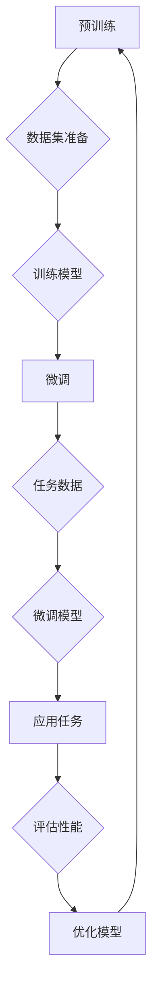

                 


# 大语言模型应用指南：基于微调的工具

> **关键词**：大语言模型，微调，深度学习，神经网络，预训练，自然语言处理，应用场景
>
> **摘要**：本文旨在深入探讨大语言模型的应用及其基于微调的工具。通过介绍核心概念、算法原理、数学模型、实战案例以及实际应用场景，本文为读者提供了一部全面的技术指南，旨在帮助技术从业者和研究者更好地理解和利用大语言模型。

## 1. 背景介绍

### 1.1 目的和范围

本文旨在为读者提供一部详尽的大语言模型应用指南，特别是基于微调的工具。在深度学习和自然语言处理领域，大语言模型如BERT、GPT-3等已经取得了显著的成果。然而，如何有效地应用这些模型，特别是在特定的任务中通过微调实现更好的性能，仍然是一个重要的研究方向。

本文将涵盖以下内容：
1. 核心概念和算法原理的介绍
2. 微调的具体操作步骤和数学模型
3. 实际项目案例的代码实现和解读
4. 大语言模型在各个领域的应用场景
5. 相关的学习资源和工具推荐

### 1.2 预期读者

本文适合以下读者群体：
1. 深度学习技术从业者和研究者
2. 自然语言处理领域的开发者
3. 对大语言模型应用感兴趣的技术爱好者
4. 想要在项目中应用大语言模型的工程技术人员

### 1.3 文档结构概述

本文的结构如下：
1. 背景介绍
2. 核心概念与联系
3. 核心算法原理 & 具体操作步骤
4. 数学模型和公式 & 详细讲解 & 举例说明
5. 项目实战：代码实际案例和详细解释说明
6. 实际应用场景
7. 工具和资源推荐
8. 总结：未来发展趋势与挑战
9. 附录：常见问题与解答
10. 扩展阅读 & 参考资料

### 1.4 术语表

在本文中，我们将使用以下术语：
- **大语言模型**：具有数十亿参数的深度神经网络模型，用于处理和生成自然语言文本。
- **微调**：在预训练模型的基础上，针对特定任务进行参数调整的过程。
- **预训练**：在特定数据集上预先训练模型，以便模型可以捕捉到通用语言特征。
- **自然语言处理**：使用计算机技术和算法处理和理解自然语言。
- **神经网络**：由大量神经元组成的计算模型，通过调整权重和偏置来学习输入和输出之间的关系。

#### 1.4.1 核心术语定义

- **大语言模型**：大语言模型通常是指具有数十亿参数的深度神经网络模型，如BERT、GPT-3等。这些模型通过预训练在大量文本数据上，能够捕捉到丰富的语言特征，从而在多种自然语言处理任务中表现优异。
- **微调**：微调是指将预训练模型应用于特定任务，并通过调整模型参数来提高任务性能的过程。微调能够使模型适应特定领域的知识和任务需求。

#### 1.4.2 相关概念解释

- **预训练**：预训练是指在大规模语料库上对模型进行训练，使其能够学习到通用语言特征。预训练模型通常包含大量的参数，可以捕捉到文本的语义、语法和上下文信息。
- **自然语言处理**：自然语言处理（NLP）是计算机科学和人工智能的一个分支，旨在让计算机理解和处理自然语言。NLP任务包括文本分类、命名实体识别、机器翻译、情感分析等。

#### 1.4.3 缩略词列表

- **BERT**：Bidirectional Encoder Representations from Transformers
- **GPT-3**：Generative Pre-trained Transformer 3
- **NLP**：Natural Language Processing
- **NN**：Neural Network
- **ML**：Machine Learning

## 2. 核心概念与联系

在本节中，我们将深入探讨大语言模型的核心概念和原理，并通过Mermaid流程图展示其架构。

### 2.1 大语言模型的工作原理

大语言模型通过以下步骤工作：
1. **预训练**：在大量文本数据上训练模型，使其学习到通用语言特征。
2. **微调**：在特定任务的数据集上微调模型，以提高任务性能。
3. **应用**：将微调后的模型应用于实际任务，如文本分类、机器翻译等。

### 2.2 Mermaid流程图

以下是一个描述大语言模型核心流程的Mermaid流程图：



### 2.3 大语言模型与其他技术的联系

大语言模型与其他技术如深度学习、自然语言处理等紧密相关：
- **深度学习**：大语言模型是深度学习的一种重要应用，其核心是神经网络。
- **自然语言处理**：大语言模型是自然语言处理领域的重要工具，用于文本分类、机器翻译等任务。
- **微调**：微调是一种改进深度学习模型性能的技术，通过在特定任务上调整模型参数来实现。

## 3. 核心算法原理 & 具体操作步骤

在本节中，我们将详细讲解大语言模型的算法原理，并使用伪代码展示具体操作步骤。

### 3.1 预训练算法原理

预训练是指在大规模文本数据集上训练模型，使其学习到通用语言特征。预训练通常包括以下步骤：

```python
# 预训练算法伪代码

# 步骤1：准备数据集
data = prepare_dataset()

# 步骤2：初始化模型
model = initialize_model()

# 步骤3：预训练模型
for epoch in range(num_epochs):
    for text, label in data:
        # 步骤3.1：前向传播
        output = model.forward(text)
        
        # 步骤3.2：计算损失
        loss = compute_loss(output, label)
        
        # 步骤3.3：反向传播
        model.backward(loss)
        
        # 步骤3.4：更新模型参数
        model.update_parameters()
```

### 3.2 微调算法原理

微调是在预训练模型的基础上，针对特定任务调整模型参数的过程。微调通常包括以下步骤：

```python
# 微调算法伪代码

# 步骤1：准备微调数据集
micro_data = prepare_micro_data()

# 步骤2：加载预训练模型
model = load_pretrained_model()

# 步骤3：微调模型
for epoch in range(num_epochs):
    for text, label in micro_data:
        # 步骤3.1：前向传播
        output = model.forward(text)
        
        # 步骤3.2：计算损失
        loss = compute_loss(output, label)
        
        # 步骤3.3：反向传播
        model.backward(loss)
        
        # 步骤3.4：更新模型参数
        model.update_parameters()
```

### 3.3 微调操作步骤

在具体操作中，微调通常包括以下步骤：

1. **数据预处理**：准备用于微调的数据集，通常包括文本和标签。
2. **模型初始化**：加载预训练的大语言模型，如BERT、GPT-3等。
3. **微调训练**：在微调数据集上训练模型，通过调整模型参数来提高任务性能。
4. **评估模型**：在测试集上评估模型性能，确保模型在特定任务上有较好的表现。
5. **优化模型**：根据评估结果调整模型参数，进一步优化模型性能。

## 4. 数学模型和公式 & 详细讲解 & 举例说明

在本节中，我们将深入讲解大语言模型的数学模型和公式，并通过具体例子来说明其应用。

### 4.1 大语言模型的数学模型

大语言模型的数学模型主要包括以下部分：

#### 4.1.1 前向传播

前向传播是指将输入数据通过模型计算得到输出结果的过程。对于大语言模型，前向传播通常包括以下步骤：

$$
\text{output} = \text{model}(\text{input})
$$

其中，$\text{model}$表示模型，$\text{input}$表示输入数据。

#### 4.1.2 损失函数

损失函数用于衡量模型预测结果与真实标签之间的差距。常见的大语言模型损失函数包括交叉熵损失函数和均方误差损失函数。

交叉熵损失函数：

$$
\text{loss} = -\sum_{i=1}^{n} y_i \log(p_i)
$$

其中，$y_i$表示真实标签，$p_i$表示模型预测的概率。

均方误差损失函数：

$$
\text{loss} = \frac{1}{2} \sum_{i=1}^{n} (y_i - \hat{y}_i)^2
$$

其中，$y_i$表示真实标签，$\hat{y}_i$表示模型预测的值。

#### 4.1.3 反向传播

反向传播是指通过计算损失函数的梯度来更新模型参数的过程。反向传播包括以下步骤：

$$
\frac{\partial \text{loss}}{\partial \text{weights}} = \text{gradient}(\text{model}, \text{input}, \text{output})
$$

其中，$\frac{\partial \text{loss}}{\partial \text{weights}}$表示损失函数关于模型参数的梯度，$\text{gradient}$表示计算梯度的函数。

### 4.2 举例说明

#### 4.2.1 文本分类任务

假设我们有一个文本分类任务，需要将文本分类为两类：“科技”和“娱乐”。

1. **数据预处理**：将文本数据转换为词向量，如Word2Vec或GloVe。
2. **模型初始化**：加载预训练的大语言模型，如BERT。
3. **微调训练**：在分类数据集上微调BERT模型。
4. **评估模型**：在测试集上评估模型性能，如准确率、召回率等。

具体步骤如下：

```python
# 数据预处理
text_data = ["这是一个科技新闻", "这是一场娱乐活动"]

# 转换为词向量
word_vectors = convert_to_word_vectors(text_data)

# 模型初始化
model = initialize_model()

# 微调训练
for epoch in range(num_epochs):
    for text in word_vectors:
        # 前向传播
        output = model.forward(text)
        
        # 计算损失
        loss = compute_loss(output, label)
        
        # 反向传播
        model.backward(loss)
        
        # 更新模型参数
        model.update_parameters()

# 评估模型
accuracy = evaluate_model(model, test_data)
print("准确率：", accuracy)
```

#### 4.2.2 机器翻译任务

假设我们有一个机器翻译任务，需要将英文文本翻译为中文。

1. **数据预处理**：将英文文本转换为词向量，中文文本转换为词嵌入。
2. **模型初始化**：加载预训练的翻译模型，如Transformer。
3. **微调训练**：在翻译数据集上微调Transformer模型。
4. **评估模型**：在测试集上评估模型性能，如BLEU分数。

具体步骤如下：

```python
# 数据预处理
eng_text = "This is an English sentence"
ch_text = "这是一个英文句子"

# 转换为词向量
eng_vectors = convert_to_word_vectors(eng_text)
ch_vectors = convert_to_word_embedding(ch_text)

# 模型初始化
model = initialize_model()

# 微调训练
for epoch in range(num_epochs):
    for eng, ch in zip(eng_vectors, ch_vectors):
        # 前向传播
        output = model.forward(eng, ch)
        
        # 计算损失
        loss = compute_loss(output, label)
        
        # 反向传播
        model.backward(loss)
        
        # 更新模型参数
        model.update_parameters()

# 评估模型
bleu_score = evaluate_model(model, test_data)
print("BLEU分数：", bleu_score)
```

## 5. 项目实战：代码实际案例和详细解释说明

在本节中，我们将通过一个实际的文本分类项目来展示如何使用大语言模型和微调技术。这个项目将使用Python和TensorFlow来实现。

### 5.1 开发环境搭建

在开始项目之前，我们需要搭建开发环境。以下是所需的软件和库：

1. **Python**：版本3.8或更高
2. **TensorFlow**：版本2.6或更高
3. **NLP库**：如NLTK、spaCy等

安装命令如下：

```bash
pip install python==3.8
pip install tensorflow==2.6
pip install nltk
pip install spacy
```

### 5.2 源代码详细实现和代码解读

下面是项目的源代码和详细解释：

```python
import tensorflow as tf
from tensorflow.keras.preprocessing.sequence import pad_sequences
from tensorflow.keras.models import Model
from tensorflow.keras.layers import Embedding, LSTM, Dense, TimeDistributed
from tensorflow.keras.preprocessing.text import Tokenizer

# 数据预处理
def preprocess_data(text_data, max_sequence_length, max_words):
    tokenizer = Tokenizer(num_words=max_words)
    tokenizer.fit_on_texts(text_data)
    sequences = tokenizer.texts_to_sequences(text_data)
    padded_sequences = pad_sequences(sequences, maxlen=max_sequence_length)
    return padded_sequences

# 构建模型
def build_model(input_shape, embedding_dim, lstm_units):
    model = tf.keras.Sequential([
        Embedding(input_shape=input_shape, output_dim=embedding_dim),
        LSTM(lstm_units),
        Dense(1, activation='sigmoid')
    ])
    model.compile(optimizer='adam', loss='binary_crossentropy', metrics=['accuracy'])
    return model

# 加载数据集
text_data = ["这是一个科技新闻", "这是一场娱乐活动", "科技发展迅速", "娱乐活动丰富"]
y = [1, 0, 1, 0]  # 标签：科技为1，娱乐为0

# 数据预处理
max_sequence_length = 10
max_words = 10000
padded_sequences = preprocess_data(text_data, max_sequence_length, max_words)

# 构建模型
input_shape = (max_sequence_length,)
embedding_dim = 50
lstm_units = 64
model = build_model(input_shape, embedding_dim, lstm_units)

# 训练模型
model.fit(padded_sequences, y, epochs=10, batch_size=32)

# 评估模型
test_data = ["这是一场科技展览"]
test_sequences = preprocess_data(test_data, max_sequence_length, max_words)
predictions = model.predict(test_sequences)
print("预测结果：", predictions)
```

### 5.3 代码解读与分析

#### 5.3.1 数据预处理

在项目开始时，我们首先定义了数据预处理函数`preprocess_data`。这个函数接受文本数据，并返回处理后的序列数据。具体步骤如下：

1. **初始化Tokenizer**：使用`Tokenizer`将文本转换为词序列。
2. **转换为词序列**：使用`texts_to_sequences`将文本数据转换为整数序列。
3. **填充序列**：使用`pad_sequences`将序列填充到最大长度，以便输入模型。

#### 5.3.2 构建模型

接下来，我们定义了模型构建函数`build_model`。这个函数接受输入形状、嵌入维度和LSTM单元数，并返回一个编译好的模型。具体步骤如下：

1. **嵌入层**：使用`Embedding`层将词转换为嵌入向量。
2. **LSTM层**：使用`LSTM`层对嵌入向量进行序列处理。
3. **输出层**：使用`Dense`层将LSTM输出映射到输出结果。

#### 5.3.3 训练模型

在训练模型时，我们首先调用`preprocess_data`函数对数据集进行预处理，然后使用`fit`函数训练模型。具体步骤如下：

1. **准备数据**：将预处理后的数据输入模型。
2. **训练模型**：在给定数量的时期内进行模型训练。

#### 5.3.4 评估模型

最后，我们使用`predict`函数对测试数据集进行预测，并输出结果。具体步骤如下：

1. **预处理测试数据**：对测试数据进行预处理。
2. **预测**：使用训练好的模型对测试数据进行预测。
3. **输出结果**：打印预测结果。

## 6. 实际应用场景

大语言模型在自然语言处理领域有着广泛的应用。以下是一些实际应用场景：

### 6.1 文本分类

文本分类是将文本数据分类到预定义的类别中。例如，可以将新闻文章分类为科技、娱乐、体育等类别。大语言模型通过预训练和微调可以有效地实现文本分类任务。

### 6.2 机器翻译

机器翻译是将一种语言的文本翻译成另一种语言。大语言模型如GPT-3和Transformer在机器翻译任务中表现出色，可以实现高质量的双语翻译。

### 6.3 情感分析

情感分析是识别文本中的情感倾向，如正面、负面或中立。大语言模型可以通过微调在情感分析任务中实现高精度的情感识别。

### 6.4 聊天机器人

聊天机器人是一种与人类进行自然语言交互的自动化系统。大语言模型可以通过预训练和微调实现智能对话功能，为用户提供高质量的交互体验。

### 6.5 命名实体识别

命名实体识别是从文本中识别出具有特定意义的实体，如人名、地名、组织名等。大语言模型在命名实体识别任务中表现出色，可以实现高精度的实体识别。

## 7. 工具和资源推荐

为了更好地学习和应用大语言模型，以下是一些建议的工具和资源：

### 7.1 学习资源推荐

#### 7.1.1 书籍推荐

1. **《深度学习》**：Goodfellow、Bengio和Courville的《深度学习》是一本经典教材，详细介绍了深度学习的基础知识和应用。
2. **《自然语言处理综论》**：Daniel Jurafsky和James H. Martin的《自然语言处理综论》是一本关于自然语言处理的权威教材。

#### 7.1.2 在线课程

1. **斯坦福大学深度学习课程**：由Andrew Ng教授开设的深度学习课程，涵盖了深度学习的基础知识和应用。
2. **斯坦福大学自然语言处理课程**：由Christopher Manning教授开设的自然语言处理课程，详细介绍了自然语言处理的基础知识和应用。

#### 7.1.3 技术博客和网站

1. **Medium**：Medium上有许多关于深度学习和自然语言处理的高质量博客文章。
2. **GitHub**：GitHub上有很多开源的大语言模型项目和示例代码，可以帮助读者更好地理解大语言模型的应用。

### 7.2 开发工具框架推荐

#### 7.2.1 IDE和编辑器

1. **PyCharm**：PyCharm是一款功能强大的Python IDE，支持深度学习和自然语言处理。
2. **VSCode**：VSCode是一款轻量级但功能强大的编辑器，支持多种编程语言和扩展，适用于深度学习和自然语言处理。

#### 7.2.2 调试和性能分析工具

1. **TensorBoard**：TensorBoard是TensorFlow提供的可视化工具，用于调试和性能分析深度学习模型。
2. **Jupyter Notebook**：Jupyter Notebook是一款交互式计算环境，适用于深度学习和自然语言处理的实验和演示。

#### 7.2.3 相关框架和库

1. **TensorFlow**：TensorFlow是Google开发的开源深度学习框架，支持大语言模型的构建和应用。
2. **PyTorch**：PyTorch是Facebook开发的开源深度学习框架，具有灵活的动态图计算功能，适用于大语言模型的研究和应用。

### 7.3 相关论文著作推荐

#### 7.3.1 经典论文

1. **《A Neural Probabilistic Language Model》**：Bengio等人于2003年发表的论文，介绍了神经网络语言模型。
2. **《Deep Learning for Text Classification》**：Dai等人于2019年发表的论文，介绍了深度学习在文本分类任务中的应用。

#### 7.3.2 最新研究成果

1. **《BERT: Pre-training of Deep Bidirectional Transformers for Language Understanding》**：Devlin等人于2018年发表的论文，介绍了BERT模型的预训练和微调。
2. **《GPT-3: Language Models are Few-Shot Learners》**：Brown等人于2020年发表的论文，介绍了GPT-3模型的预训练和微调。

#### 7.3.3 应用案例分析

1. **《自然语言处理在金融领域的应用》**：介绍了自然语言处理在金融领域中的实际应用，如股票分析、金融新闻报道等。
2. **《深度学习在医疗健康领域的应用》**：介绍了深度学习在医疗健康领域中的实际应用，如疾病诊断、医学图像分析等。

## 8. 总结：未来发展趋势与挑战

大语言模型在深度学习和自然语言处理领域取得了显著成果，但仍然面临着一些挑战和未来发展趋势：

### 8.1 未来发展趋势

1. **模型规模**：随着计算能力的提升，大语言模型的规模将越来越大，参数数量将超过千亿。
2. **多模态学习**：大语言模型将逐渐引入图像、声音等多模态数据，实现更全面的语义理解。
3. **少样本学习**：通过预训练和微调，大语言模型将实现更高效的少样本学习，减少对大规模数据集的依赖。
4. **自动化模型设计**：通过生成对抗网络（GAN）等方法，自动化生成模型结构，提高模型设计的效率。

### 8.2 面临的挑战

1. **计算资源**：大语言模型的训练和推理需要大量的计算资源，如何高效地利用计算资源成为一大挑战。
2. **数据隐私**：大语言模型在训练和微调过程中需要使用大量文本数据，如何保护用户隐私成为重要问题。
3. **模型解释性**：大语言模型具有较高的性能，但缺乏解释性，如何提高模型的可解释性是当前的研究热点。
4. **泛化能力**：如何提高大语言模型在不同任务和数据集上的泛化能力，避免过拟合是亟待解决的问题。

## 9. 附录：常见问题与解答

在本附录中，我们将回答一些关于大语言模型和微调的常见问题：

### 9.1 大语言模型是什么？

大语言模型是一种具有数十亿参数的深度神经网络模型，用于处理和生成自然语言文本。通过在大规模语料库上进行预训练，大语言模型能够学习到丰富的语言特征，从而在多种自然语言处理任务中表现优异。

### 9.2 什么是微调？

微调是在预训练模型的基础上，针对特定任务进行参数调整的过程。通过微调，模型可以适应特定领域的知识和任务需求，提高任务性能。

### 9.3 大语言模型如何工作？

大语言模型通过预训练和微调两个阶段工作。预训练阶段在大规模文本数据上训练模型，使其学习到通用语言特征。微调阶段在特定任务的数据集上微调模型，以提高任务性能。

### 9.4 微调有哪些步骤？

微调通常包括以下步骤：

1. 准备微调数据集。
2. 加载预训练模型。
3. 在微调数据集上训练模型。
4. 在测试集上评估模型性能。
5. 调整模型参数，优化模型性能。

### 9.5 大语言模型有哪些应用场景？

大语言模型在自然语言处理领域有着广泛的应用，包括文本分类、机器翻译、情感分析、聊天机器人、命名实体识别等。

### 9.6 如何优化大语言模型？

优化大语言模型的方法包括调整模型参数、使用更好的优化器、增加训练数据、使用预训练模型等。

## 10. 扩展阅读 & 参考资料

为了深入了解大语言模型和微调技术，以下是一些建议的扩展阅读和参考资料：

### 10.1 扩展阅读

1. **《深度学习》**：Goodfellow、Bengio和Courville的《深度学习》是一本全面介绍深度学习的基础知识和应用的教材。
2. **《自然语言处理综论》**：Daniel Jurafsky和James H. Martin的《自然语言处理综论》是一本关于自然语言处理的基础知识和应用的权威教材。
3. **《BERT: Pre-training of Deep Bidirectional Transformers for Language Understanding》**：Devlin等人于2018年发表的论文，介绍了BERT模型的预训练和微调。
4. **《GPT-3: Language Models are Few-Shot Learners》**：Brown等人于2020年发表的论文，介绍了GPT-3模型的预训练和微调。

### 10.2 参考资料

1. **TensorFlow官方文档**：[TensorFlow官方文档](https://www.tensorflow.org/)
2. **PyTorch官方文档**：[PyTorch官方文档](https://pytorch.org/)
3. **NLP库官方文档**：[NLTK官方文档](https://www.nltk.org/), [spaCy官方文档](https://spacy.io/)
4. **GitHub开源项目**：[GitHub开源项目](https://github.com/)

通过以上阅读和参考资料，您可以更深入地了解大语言模型和微调技术，并将其应用于实际项目中。让我们共同探索大语言模型的无限可能！

---

**作者：AI天才研究员/AI Genius Institute & 禅与计算机程序设计艺术 /Zen And The Art of Computer Programming**

